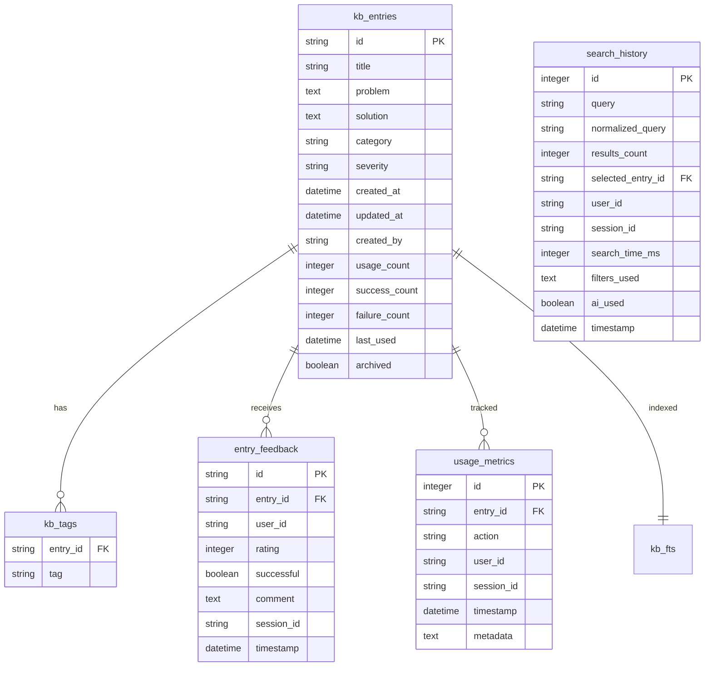

# Database Schema Documentation
## Mainframe KB Assistant MVP1

This document provides comprehensive documentation of the SQLite database schema used by the Mainframe KB Assistant, including relationships, indexes, and usage patterns.

## Overview

The knowledge base uses SQLite as the storage engine, providing:
- **Excellent performance** for read-heavy workloads
- **ACID compliance** for data integrity
- **Full-text search** capabilities with FTS5
- **Offline capability** with no external dependencies
- **Simple deployment** with single-file database

## Schema Architecture



## Core Tables

### kb_entries
The main knowledge base entries table containing problem-solution pairs.

```sql
CREATE TABLE kb_entries (
    id TEXT PRIMARY KEY,                    -- UUID v4 unique identifier
    title TEXT NOT NULL,                    -- Brief descriptive title
    problem TEXT NOT NULL,                  -- Detailed problem description
    solution TEXT NOT NULL,                 -- Step-by-step solution
    category TEXT NOT NULL CHECK(          -- Component category
        category IN ('JCL', 'VSAM', 'DB2', 'Batch', 'Functional', 
                     'IMS', 'CICS', 'System', 'Other')
    ),
    severity TEXT DEFAULT 'medium' CHECK(  -- Issue severity level
        severity IN ('critical', 'high', 'medium', 'low')
    ),
    created_at DATETIME DEFAULT CURRENT_TIMESTAMP,
    updated_at DATETIME DEFAULT CURRENT_TIMESTAMP,
    created_by TEXT,                        -- User who created entry
    usage_count INTEGER DEFAULT 0,         -- Total access count
    success_count INTEGER DEFAULT 0,       -- Successful resolutions
    failure_count INTEGER DEFAULT 0,       -- Failed resolutions
    last_used DATETIME,                    -- Last access timestamp
    archived BOOLEAN DEFAULT FALSE        -- Hidden from searches
);
```

**Key Features:**
- **UUID Primary Key**: Ensures global uniqueness across systems
- **Check Constraints**: Validates category and severity values
- **Usage Tracking**: Automatic counters for effectiveness metrics
- **Audit Fields**: Created/updated timestamps and user tracking
- **Soft Delete**: Archived flag for hiding without deletion

### kb_tags
Tag associations for flexible categorization and search.

```sql
CREATE TABLE kb_tags (
    entry_id TEXT,
    tag TEXT,
    PRIMARY KEY (entry_id, tag),
    FOREIGN KEY (entry_id) REFERENCES kb_entries(id) ON DELETE CASCADE
);
```

**Key Features:**
- **Composite Primary Key**: Prevents duplicate tags per entry
- **Cascade Delete**: Automatically removes tags when entry is deleted
- **Lowercase Storage**: Tags stored in lowercase for consistency

### entry_feedback
User feedback and ratings for solution effectiveness.

```sql
CREATE TABLE entry_feedback (
    id TEXT PRIMARY KEY,                    -- UUID v4 identifier
    entry_id TEXT NOT NULL,               -- Reference to kb_entries
    user_id TEXT,                         -- User providing feedback
    rating INTEGER CHECK(rating BETWEEN 1 AND 5),  -- 1-5 star rating
    successful BOOLEAN NOT NULL,          -- Was solution successful?
    comment TEXT,                         -- Optional feedback comment
    session_id TEXT,                      -- User session identifier
    resolution_time INTEGER,              -- Time to resolve (milliseconds)
    timestamp DATETIME DEFAULT CURRENT_TIMESTAMP,
    FOREIGN KEY (entry_id) REFERENCES kb_entries(id) ON DELETE CASCADE
);
```

### usage_metrics
Detailed usage tracking for analytics and optimization.

```sql
CREATE TABLE usage_metrics (
    id INTEGER PRIMARY KEY AUTOINCREMENT,
    entry_id TEXT,                        -- Reference to kb_entries
    action TEXT CHECK(action IN (         -- Type of action performed
        'view', 'copy', 'rate_success', 'rate_failure',
        'export', 'print', 'share', 'create', 'update', 'delete'
    )),
    user_id TEXT,                         -- User performing action
    session_id TEXT,                      -- Session identifier
    timestamp DATETIME DEFAULT CURRENT_TIMESTAMP,
    metadata TEXT,                        -- Additional context (JSON)
    FOREIGN KEY (entry_id) REFERENCES kb_entries(id) ON DELETE SET NULL
);
```

## Search and Indexing

### kb_fts (Full-Text Search)
Virtual FTS5 table for high-performance search.

```sql
CREATE VIRTUAL TABLE kb_fts USING fts5(
    id UNINDEXED,                         -- Entry ID (not searchable)
    title,                                -- Searchable title
    problem,                              -- Searchable problem text
    solution,                             -- Searchable solution text
    tags,                                 -- Searchable tags
    content=kb_entries                    -- Source table
);
```

**Search Features:**
- **BM25 Ranking**: Advanced relevance scoring algorithm
- **Phrase Queries**: Support for exact phrase matching
- **Boolean Operators**: AND, OR, NOT query support
- **Prefix Matching**: Partial term matching with *
- **Highlighting**: Automatic text highlighting in results

### search_history
Query history for analytics and auto-complete.

```sql
CREATE TABLE search_history (
    id INTEGER PRIMARY KEY AUTOINCREMENT,
    query TEXT NOT NULL,                  -- Original search query
    normalized_query TEXT,                -- Processed query for analytics
    results_count INTEGER DEFAULT 0,     -- Number of results returned
    selected_entry_id TEXT,               -- Entry user selected (if any)
    user_id TEXT,                         -- Searching user
    session_id TEXT,                      -- Session identifier
    search_time_ms INTEGER DEFAULT 0,    -- Response time
    filters_used TEXT,                    -- JSON of applied filters
    ai_used BOOLEAN DEFAULT FALSE,       -- Was AI search used?
    timestamp DATETIME DEFAULT CURRENT_TIMESTAMP,
    FOREIGN KEY (selected_entry_id) REFERENCES kb_entries(id) ON DELETE SET NULL
);
```

## System Tables

### system_config
Application configuration and settings.

```sql
CREATE TABLE system_config (
    key TEXT PRIMARY KEY,                 -- Configuration key
    value TEXT NOT NULL,                  -- Configuration value
    type TEXT DEFAULT 'string' CHECK(    -- Value data type
        type IN ('string', 'number', 'boolean', 'json')
    ),
    description TEXT,                     -- Human-readable description
    category TEXT DEFAULT 'general',     -- Configuration grouping
    created_at DATETIME DEFAULT CURRENT_TIMESTAMP,
    updated_at DATETIME DEFAULT CURRENT_TIMESTAMP
);
```

### backup_log
Backup operation history and verification.

```sql
CREATE TABLE backup_log (
    id INTEGER PRIMARY KEY AUTOINCREMENT,
    backup_path TEXT NOT NULL,           -- Path to backup file
    backup_type TEXT NOT NULL CHECK(     -- Type of backup
        backup_type IN ('manual', 'scheduled', 'migration', 'export')
    ),
    entries_count INTEGER NOT NULL,      -- Number of entries backed up
    file_size INTEGER,                   -- Backup file size in bytes
    checksum TEXT,                       -- MD5 checksum for verification
    created_at DATETIME DEFAULT CURRENT_TIMESTAMP,
    status TEXT DEFAULT 'created' CHECK( -- Backup status
        status IN ('created', 'verified', 'corrupted', 'deleted')
    )
);
```

## Performance Indexes

### Primary Indexes
```sql
-- Primary key indexes (automatic)
CREATE UNIQUE INDEX idx_kb_entries_pk ON kb_entries(id);
CREATE UNIQUE INDEX idx_entry_feedback_pk ON entry_feedback(id);

-- Foreign key indexes for joins
CREATE INDEX idx_kb_tags_entry_id ON kb_tags(entry_id);
CREATE INDEX idx_entry_feedback_entry_id ON entry_feedback(entry_id);
CREATE INDEX idx_usage_metrics_entry_id ON usage_metrics(entry_id);
```

### Query Optimization Indexes
```sql
-- Search and filtering
CREATE INDEX idx_kb_entries_category ON kb_entries(category);
CREATE INDEX idx_kb_entries_severity ON kb_entries(severity);
CREATE INDEX idx_kb_entries_archived ON kb_entries(archived);
CREATE INDEX idx_kb_entries_created_at ON kb_entries(created_at DESC);
CREATE INDEX idx_kb_entries_updated_at ON kb_entries(updated_at DESC);

-- Usage and popularity
CREATE INDEX idx_kb_entries_usage_count ON kb_entries(usage_count DESC);
CREATE INDEX idx_kb_entries_last_used ON kb_entries(last_used DESC);
CREATE INDEX idx_kb_entries_success_rate ON kb_entries(success_count, failure_count);

-- Tag-based searches
CREATE INDEX idx_kb_tags_tag ON kb_tags(tag);

-- Analytics and reporting
CREATE INDEX idx_search_history_timestamp ON search_history(timestamp DESC);
CREATE INDEX idx_search_history_query ON search_history(normalized_query);
CREATE INDEX idx_usage_metrics_timestamp ON usage_metrics(timestamp DESC);
CREATE INDEX idx_usage_metrics_action ON usage_metrics(action);
```

### Composite Indexes for Complex Queries
```sql
-- Active entries by category and usage
CREATE INDEX idx_kb_entries_active_popular ON kb_entries(
    archived, category, usage_count DESC
) WHERE archived = FALSE;

-- Recent activity tracking
CREATE INDEX idx_kb_entries_recent_activity ON kb_entries(
    archived, last_used DESC
) WHERE archived = FALSE AND last_used IS NOT NULL;

-- Success rate calculations
CREATE INDEX idx_kb_entries_effectiveness ON kb_entries(
    archived, success_count, failure_count, usage_count
) WHERE archived = FALSE;
```

## Data Types and Constraints

### Field Specifications

| Table | Field | Type | Length | Nullable | Default | Validation |
|-------|-------|------|---------|----------|---------|------------|
| kb_entries | id | TEXT | UUID | No | Generated | UUID format |
| kb_entries | title | TEXT | 255 | No | - | 3-255 chars |
| kb_entries | problem | TEXT | 5000 | No | - | 10-5000 chars |
| kb_entries | solution | TEXT | 10000 | No | - | 10-10000 chars |
| kb_entries | category | TEXT | - | No | - | Enum values |
| kb_entries | severity | TEXT | - | Yes | 'medium' | Enum values |
| kb_tags | tag | TEXT | 50 | No | - | 1-50 chars, lowercase |
| entry_feedback | rating | INTEGER | - | Yes | - | 1-5 range |
| usage_metrics | action | TEXT | - | No | - | Enum values |

### Business Rules

1. **Entry Validation**
   - Title must be unique within category
   - Problem and solution must be substantial (min 10 chars)
   - At least one tag recommended but not required

2. **Usage Tracking**
   - Usage count incremented on every access
   - Success/failure counts updated only through feedback
   - Last used timestamp updated on access

3. **Search Optimization**
   - Archived entries excluded from normal searches
   - FTS index updated automatically on entry changes
   - Search history retained for analytics

4. **Data Integrity**
   - Cascade deletes for dependent records
   - Foreign key constraints enforced
   - Check constraints validate enum values

## Query Patterns and Performance

### Common Query Patterns

#### 1. Basic Search Query
```sql
-- Full-text search with category filter
SELECT 
    e.id, e.title, e.problem, e.solution, e.category,
    GROUP_CONCAT(t.tag, ', ') as tags,
    bm25(kb_fts) as relevance_score
FROM kb_fts f
JOIN kb_entries e ON f.id = e.id
LEFT JOIN kb_tags t ON e.id = t.entry_id
WHERE kb_fts MATCH ?
  AND e.category = ?
  AND e.archived = FALSE
GROUP BY e.id
ORDER BY relevance_score DESC
LIMIT ?;
```

#### 2. Popular Entries Query
```sql
-- Most used entries with success rates
SELECT 
    e.id, e.title, e.category, e.usage_count,
    CASE WHEN (e.success_count + e.failure_count) > 0 
         THEN CAST(e.success_count AS REAL) / (e.success_count + e.failure_count)
         ELSE 0 END as success_rate
FROM kb_entries e
WHERE e.archived = FALSE
ORDER BY e.usage_count DESC, success_rate DESC
LIMIT ?;
```

#### 3. Analytics Query
```sql
-- Daily search statistics
SELECT 
    DATE(timestamp) as date,
    COUNT(*) as total_searches,
    COUNT(DISTINCT user_id) as unique_users,
    AVG(search_time_ms) as avg_response_time,
    SUM(CASE WHEN ai_used THEN 1 ELSE 0 END) as ai_searches
FROM search_history
WHERE timestamp >= DATE('now', '-30 days')
GROUP BY DATE(timestamp)
ORDER BY date DESC;
```

### Performance Benchmarks

| Operation | Target Time | Typical Size | Notes |
|-----------|-------------|---------------|-------|
| Simple search | < 50ms | 1000 entries | With indexes |
| Full-text search | < 200ms | 10000 entries | FTS5 optimized |
| Entry creation | < 10ms | - | Single transaction |
| Stats calculation | < 500ms | 10000 entries | Complex aggregates |
| Backup operation | < 5s | 1GB database | File system dependent |

## Database Maintenance

### Automatic Maintenance Tasks

1. **Daily Tasks** (via PerformanceTuner)
   ```sql
   -- Update statistics
   ANALYZE;
   
   -- Rebuild FTS index if needed
   INSERT INTO kb_fts(kb_fts) VALUES('rebuild');
   
   -- Clean old search history (optional)
   DELETE FROM search_history 
   WHERE timestamp < DATE('now', '-90 days');
   ```

2. **Weekly Tasks**
   ```sql
   -- Vacuum database to reclaim space
   VACUUM;
   
   -- Integrity check
   PRAGMA integrity_check;
   
   -- Analyze index usage
   PRAGMA index_info(idx_kb_entries_usage_count);
   ```

### Backup Strategies

1. **File-based Backup**
   ```typescript
   // Simple file copy (database must be closed)
   await copyFile('knowledge.db', 'backup/knowledge-2025-01-15.db');
   ```

2. **SQL Backup**
   ```sql
   -- Export to SQL format
   .output backup/knowledge-dump.sql
   .dump
   .output stdout
   ```

3. **JSON Export**
   ```typescript
   // Application-level export
   const entries = await db.search('', { limit: 10000, includeArchived: true });
   await writeFile('backup.json', JSON.stringify({
     version: '1.0',
     timestamp: new Date().toISOString(),
     entries: entries.map(r => r.entry)
   }));
   ```

## Migration and Versioning

### Schema Versions

| Version | Description | Migration Required |
|---------|-------------|--------------------|
| 1.0 | Initial schema | - |
| 1.1 | Added feedback table | ALTER statements |
| 1.2 | Enhanced search history | ALTER + INDEX |
| 2.0 | Performance optimizations | REBUILD recommended |

### Migration Example
```typescript
class MigrationManager {
  async migrateToVersion(targetVersion: string) {
    const currentVersion = this.getCurrentVersion();
    
    switch (targetVersion) {
      case '1.1':
        await this.addFeedbackTable();
        break;
      case '1.2':
        await this.enhanceSearchHistory();
        await this.rebuildIndexes();
        break;
    }
    
    await this.updateSchemaVersion(targetVersion);
  }
  
  private async addFeedbackTable() {
    await this.db.exec(`
      CREATE TABLE entry_feedback (
        id TEXT PRIMARY KEY,
        entry_id TEXT NOT NULL,
        -- ... rest of schema
      );
    `);
  }
}
```

## Troubleshooting Common Issues

### Performance Issues

1. **Slow Search Queries**
   ```sql
   -- Check if indexes are being used
   EXPLAIN QUERY PLAN 
   SELECT * FROM kb_entries WHERE category = 'VSAM';
   
   -- Rebuild FTS index if needed
   INSERT INTO kb_fts(kb_fts) VALUES('rebuild');
   ```

2. **Database File Size Growth**
   ```sql
   -- Check database size and fragmentation
   PRAGMA page_count;
   PRAGMA page_size;
   PRAGMA freelist_count;
   
   -- Vacuum to reclaim space
   VACUUM;
   ```

### Data Integrity Issues

1. **Orphaned Records**
   ```sql
   -- Find tags without entries
   SELECT t.* FROM kb_tags t
   LEFT JOIN kb_entries e ON t.entry_id = e.id
   WHERE e.id IS NULL;
   
   -- Find feedback without entries
   SELECT f.* FROM entry_feedback f
   LEFT JOIN kb_entries e ON f.entry_id = e.id
   WHERE e.id IS NULL;
   ```

2. **Inconsistent Counts**
   ```sql
   -- Recalculate usage counts from metrics
   UPDATE kb_entries SET usage_count = (
     SELECT COUNT(*) FROM usage_metrics 
     WHERE entry_id = kb_entries.id
   );
   ```

## Security Considerations

1. **SQL Injection Prevention**
   - All queries use prepared statements
   - Input validation with Zod schemas
   - No dynamic SQL construction

2. **Data Protection**
   - Database file permissions: 600 (owner only)
   - Backup encryption recommended
   - User data anonymization in logs

3. **Audit Trail**
   - All changes tracked in usage_metrics
   - User attribution for all operations
   - Timestamp precision for forensics

This completes the comprehensive database schema documentation for the Mainframe KB Assistant MVP1.