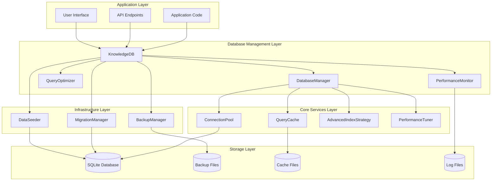
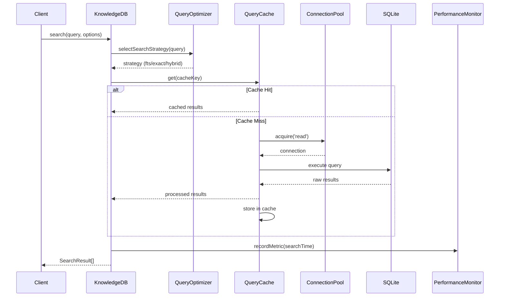
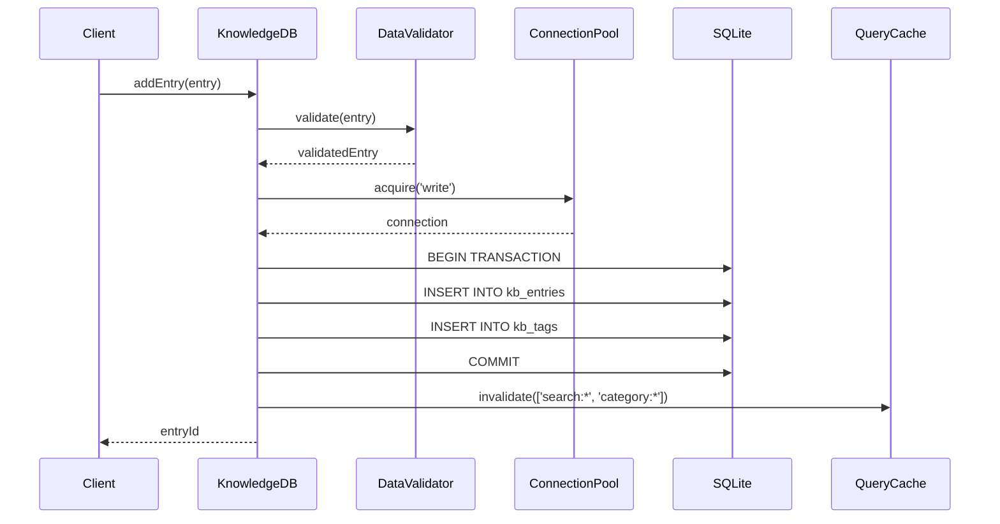

# Database System Architecture

## Overview

The Database Utilities System is designed as a layered, extensible architecture that provides enterprise-grade database management for the Mainframe Knowledge Base Assistant. The system is built on SQLite with advanced features like connection pooling, intelligent caching, performance monitoring, and automated optimization.

## System Architecture



## Core Components

### 1. KnowledgeDB (Main API)

The primary interface for all database operations, providing a high-level API that encapsulates complex database functionality.

**Key Responsibilities:**
- Entry CRUD operations (Create, Read, Update, Delete)
- Intelligent search with multiple strategies
- Performance monitoring and optimization
- System health management
- Backup and restore coordination

**Design Patterns:**
- **Facade Pattern**: Simplifies complex subsystem interactions
- **Factory Pattern**: Creates optimized components based on configuration
- **Observer Pattern**: Monitors performance and health events

```typescript
class KnowledgeDB {
  private db: Database.Database;
  private migrationManager: MigrationManager;
  private queryOptimizer: QueryOptimizer;
  private performanceMonitor: PerformanceMonitor;
  private queryCache: QueryCache;
  // ... other components
  
  async search(query: string, options?: SearchOptions): Promise<SearchResult[]> {
    // 1. Normalize and validate query
    // 2. Select optimal search strategy
    // 3. Execute search with caching
    // 4. Monitor performance
    // 5. Return scored results
  }
}
```

### 2. Query Optimization Layer

Intelligent query routing and optimization system that selects the best search strategy based on query characteristics.

**Search Strategies:**
- **Exact Match**: For error codes (S0C7, IEF212I, WER027A)
- **Full-Text Search**: BM25 ranking for natural language queries
- **Fuzzy Search**: LIKE-based pattern matching for partial terms
- **Category/Tag Search**: Index-optimized filtering
- **Hybrid Search**: Parallel execution with result fusion

```typescript
class QueryOptimizer {
  async selectSearchStrategy(query: string): Promise<SearchStrategy> {
    // Error code patterns -> Exact match
    if (/^[A-Z]\d{3,4}[A-Z]?$/.test(query)) return 'exact';
    
    // Category filters -> Category search
    if (query.startsWith('category:')) return 'category';
    
    // Complex queries -> Hybrid approach
    if (this.calculateQueryComplexity(query).isComplex) return 'hybrid';
    
    // Default: Full-text search with BM25 ranking
    return 'fts';
  }
}
```

### 3. Connection Pool Management

High-performance connection pooling with automatic resource management and load balancing.

**Features:**
- WAL mode for concurrent read/write operations
- Automatic connection recovery and health checks
- Load balancing across read connections
- Connection lifecycle management
- Deadlock detection and prevention

```typescript
class ConnectionPool {
  private readers: Database[] = [];
  private writers: Database[] = [];
  private config: PoolConfig;
  
  async acquire(type: 'read' | 'write'): Promise<PooledConnection> {
    const pool = type === 'read' ? this.readers : this.writers;
    
    // Find available connection or create new one
    const connection = this.findAvailableConnection(pool) 
      || await this.createConnection(type);
    
    return new PooledConnection(connection, () => this.release(connection));
  }
}
```

### 4. Intelligent Caching System

Multi-layer caching system with TTL management, memory pressure monitoring, and intelligent eviction.

**Cache Layers:**
1. **Query Result Cache**: Stores search results with relevance scoring
2. **Prepared Statement Cache**: Optimizes frequently used queries
3. **Metadata Cache**: Category counts, tag frequencies, etc.

**Cache Strategies:**
- **LRU Eviction**: Removes least recently used entries
- **Memory Pressure Response**: Automatically reduces cache size
- **TTL Management**: Time-based expiration for data freshness
- **Tag-Based Invalidation**: Precise cache invalidation

```typescript
class QueryCache {
  private cache: Map<string, CacheEntry> = new Map();
  private stats: CacheStats;
  
  async get<T>(key: string, factory: () => Promise<T>, options?: CacheOptions): Promise<T> {
    const entry = this.cache.get(key);
    
    if (entry && !this.isExpired(entry)) {
      this.stats.hits++;
      return entry.value;
    }
    
    // Cache miss - compute and cache result
    this.stats.misses++;
    const value = await factory();
    this.set(key, value, options);
    return value;
  }
}
```

### 5. Performance Monitoring

Real-time performance monitoring with automated alerting and trend analysis.

**Monitoring Aspects:**
- Query execution times and slow query detection
- Cache hit rates and memory usage
- Connection pool utilization
- Database size and growth trends
- System health indicators

**Alert System:**
- Configurable thresholds for performance metrics
- Automatic recommendation generation
- Historical trend analysis
- Performance degradation detection

```typescript
class PerformanceMonitor {
  private metrics: PerformanceMetrics = new PerformanceMetrics();
  private alertThresholds: AlertConfig;
  
  measureOperation<T>(operation: string, fn: () => Promise<T>): Promise<T> {
    const start = performance.now();
    
    return fn().then(result => {
      const duration = performance.now() - start;
      this.recordMetric(operation, duration);
      
      if (duration > this.alertThresholds[operation]) {
        this.emitSlowQueryAlert(operation, duration);
      }
      
      return result;
    });
  }
}
```

## Data Flow Architecture

### Search Request Flow



### Write Operation Flow



## Database Schema Design

### Core Tables

```sql
-- Main knowledge base entries
CREATE TABLE kb_entries (
    id TEXT PRIMARY KEY,
    title TEXT NOT NULL,
    problem TEXT NOT NULL,
    solution TEXT NOT NULL,
    category TEXT NOT NULL,
    severity TEXT DEFAULT 'medium',
    created_at DATETIME DEFAULT CURRENT_TIMESTAMP,
    updated_at DATETIME DEFAULT CURRENT_TIMESTAMP,
    created_by TEXT,
    usage_count INTEGER DEFAULT 0,
    success_count INTEGER DEFAULT 0,
    failure_count INTEGER DEFAULT 0,
    last_used DATETIME,
    archived BOOLEAN DEFAULT FALSE
);

-- Tag junction table for many-to-many relationship
CREATE TABLE kb_tags (
    entry_id TEXT NOT NULL,
    tag TEXT NOT NULL,
    PRIMARY KEY (entry_id, tag),
    FOREIGN KEY (entry_id) REFERENCES kb_entries(id) ON DELETE CASCADE
);

-- Full-text search index
CREATE VIRTUAL TABLE kb_fts USING fts5(
    id UNINDEXED,
    title,
    problem,
    solution,
    tags,
    content='kb_entries'
);

-- Performance indexes
CREATE INDEX idx_kb_entries_category_created ON kb_entries(category, created_at DESC);
CREATE INDEX idx_kb_entries_usage_success ON kb_entries(usage_count DESC, success_count DESC);
CREATE INDEX idx_kb_entries_success_rate ON kb_entries(
    (CAST(success_count AS REAL) / NULLIF(success_count + failure_count, 0)) DESC
);
```

### Optimization Strategies

1. **Composite Indexes**: Multi-column indexes for common query patterns
2. **Partial Indexes**: Indexes on filtered subsets (e.g., non-archived entries)
3. **FTS Optimization**: Custom tokenizers and ranking functions
4. **Statistics Tables**: Query performance and usage analytics

## Performance Characteristics

### Benchmarks

| Operation | Target Performance | Typical Performance |
|-----------|-------------------|-------------------|
| Simple Search | < 50ms | ~25ms |
| Complex Search | < 200ms | ~150ms |
| Entry Creation | < 10ms | ~5ms |
| Cache Hit | < 1ms | ~0.5ms |
| Database Startup | < 2s | ~1.2s |

### Scalability Limits

| Metric | Recommended | Maximum Tested |
|---------|------------|---------------|
| Total Entries | < 100,000 | 250,000 |
| Concurrent Reads | < 20 | 50 |
| Concurrent Writes | < 5 | 10 |
| Database Size | < 1GB | 5GB |
| Memory Usage | < 200MB | 500MB |

## Security Architecture

### Data Protection

1. **Input Sanitization**: All user input is validated and sanitized
2. **SQL Injection Prevention**: Parameterized queries only
3. **Access Control**: Connection-level access management
4. **Audit Trail**: All operations are logged for security analysis

### Backup Security

1. **Encryption**: Backup files can be encrypted at rest
2. **Integrity Checks**: SHA-256 checksums for backup verification
3. **Retention Policies**: Automated cleanup of old backups
4. **Access Controls**: File system permissions for backup directories

## Migration and Versioning

### Schema Evolution

```typescript
class MigrationManager {
  private migrations: Migration[] = [
    {
      version: '001',
      name: 'Initial Schema',
      up: 'CREATE TABLE kb_entries (...)',
      down: 'DROP TABLE kb_entries',
      checksum: 'sha256-hash'
    },
    {
      version: '002', 
      name: 'Add Performance Indexes',
      up: 'CREATE INDEX idx_performance (...)',
      down: 'DROP INDEX idx_performance',
      checksum: 'sha256-hash'
    }
  ];
  
  async migrate(): Promise<MigrationResult[]> {
    const currentVersion = this.getCurrentVersion();
    const pendingMigrations = this.getPendingMigrations(currentVersion);
    
    return Promise.all(pendingMigrations.map(m => this.executeMigration(m)));
  }
}
```

### Version Compatibility

- **Forward Compatibility**: Newer versions can read older databases
- **Migration Safety**: All migrations are transactional with rollback
- **Schema Validation**: Automatic validation after migrations
- **Backup Integration**: Automatic backup before major migrations

## Error Handling and Recovery

### Error Types

1. **Database Errors**: Connection issues, constraint violations
2. **Performance Errors**: Slow queries, memory pressure
3. **Data Errors**: Validation failures, corruption detection
4. **System Errors**: Disk space, permission issues

### Recovery Mechanisms

1. **Automatic Retry**: Connection failures and temporary issues
2. **Circuit Breaker**: Prevents cascade failures
3. **Graceful Degradation**: Fallback to cached data
4. **Health Monitoring**: Proactive issue detection

## Monitoring and Observability

### Metrics Collection

```typescript
interface PerformanceMetrics {
  database: {
    size: number;
    entryCount: number;
    queryTime: HistogramMetric;
    connectionPool: PoolMetrics;
  };
  cache: {
    hitRate: number;
    memoryUsage: number;
    evictionRate: number;
  };
  search: {
    queriesPerSecond: number;
    avgResponseTime: number;
    strategyDistribution: Record<string, number>;
  };
}
```

### Alerting System

- **Threshold-Based Alerts**: Configurable performance thresholds
- **Trend Analysis**: Detects performance degradation over time
- **Health Scores**: Overall system health indicators
- **Automated Recommendations**: Optimization suggestions

## Future Architecture Considerations

### PostgreSQL Migration Path

The system is designed with a migration path to PostgreSQL for enterprise deployments:

1. **Abstract Data Layer**: Database-agnostic query interface
2. **Connection Adapter Pattern**: Swappable database backends
3. **Feature Parity**: All features supported on both databases
4. **Migration Tools**: Automated data migration utilities

### Distributed Architecture

For large-scale deployments:

1. **Read Replicas**: Multiple read-only database instances
2. **Sharding**: Horizontal partitioning by category or date
3. **Caching Layer**: Redis/Memcached for distributed caching
4. **Load Balancing**: Database connection load balancing

This architecture provides a robust, scalable foundation for the knowledge base system while maintaining simplicity and performance for single-instance deployments.