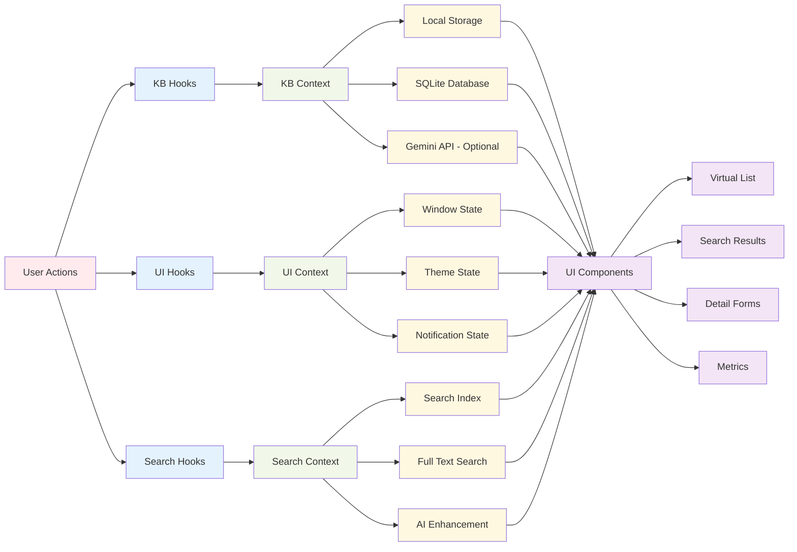
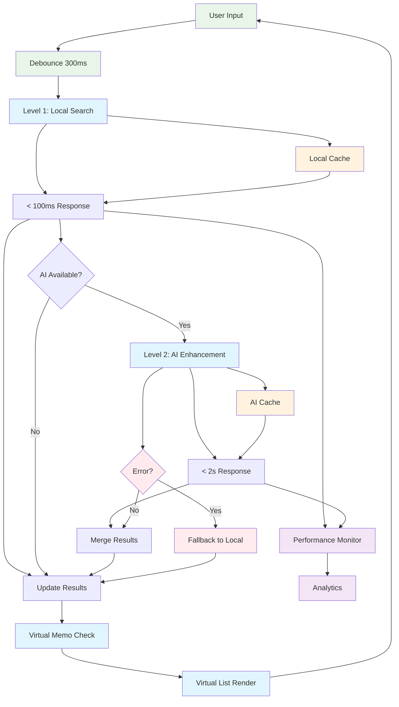
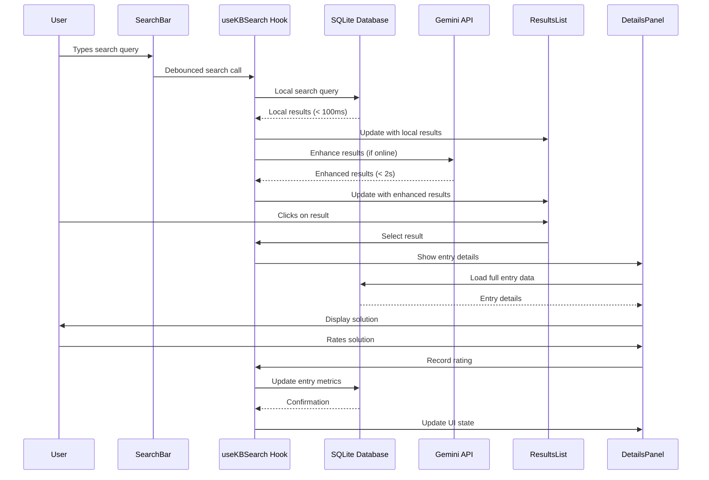

# UI Component Hierarchy Diagram
## Mainframe KB Assistant - Visual Architecture Map

```mermaid
graph TD
    %% Application Root
    App[Application Root]

    %% State Providers
    App --> SP[State Providers Layer]
    SP --> ASP[AppStateProvider]
    SP --> KSP[KBStateProvider]
    SP --> USP[UIStateProvider]
    SP --> NSP[NotificationProvider]

    %% Main Layout
    SP --> ML[MainWindowLayout]

    %% Window Components
    ML --> WTB[WindowTitleBar]
    ML --> WSB[WindowStatusBar]
    ML --> WR[WindowResizer]

    %% Tab System
    WTB --> WT[WindowTabs]
    WT --> DT[Dashboard Tab]
    WT --> KT[Knowledge Base Tab]
    WT --> ST[Search Tab]

    %% Main Content Areas
    ML --> MCA[Main Content Area]
    MCA --> DV[Dashboard View]
    MCA --> KBV[Knowledge Base View]
    MCA --> SV[Search View]

    %% Dashboard View Components
    DV --> MC1[Metrics Card - Usage Stats]
    DV --> MC2[Metrics Card - Recent Activity]
    DV --> MC3[Metrics Card - Top Categories]
    DV --> QA[Quick Actions Panel]

    %% Knowledge Base View Components
    KBV --> EL[Entry List Panel]
    KBV --> DP[Details Panel]
    KBV --> AP[Actions Panel]

    EL --> ELH[Entry List Header]
    EL --> ELF[Entry List Filters]
    EL --> VRL[Virtualized Results List]

    VRL --> ER1[Entry Row 1]
    VRL --> ER2[Entry Row 2]
    VRL --> ERN[Entry Row N...]

    ER1 --> EC[Entry Card]
    EC --> ET[Entry Title]
    EC --> ES[Entry Summary]
    EC --> EB[Entry Badges]
    EC --> EM[Entry Metadata]

    DP --> EDH[Entry Details Header]
    DP --> EDD[Entry Details Description]
    DP --> EDS[Entry Details Solution]
    DP --> EDM[Entry Details Metadata]
    DP --> RB[Rating Buttons]

    %% Search View Components
    SV --> SB[Search Bar]
    SV --> FC[Filter Controls]
    SV --> RL[Results List]
    SV --> NR[No Results State]

    SB --> SI[Search Input]
    SB --> SS[Search Suggestions]
    SB --> SC[Search Controls]

    FC --> CF[Category Filter]
    FC --> TF[Tag Filter]
    FC --> DF[Date Filter]
    FC --> SF[Sort Filter]

    RL --> SR1[Search Result 1]
    RL --> SR2[Search Result 2]
    RL --> SRN[Search Result N...]

    SR1 --> SRC[Search Result Card]
    SRC --> SRT[Result Title with Highlighting]
    SRC --> SRS[Result Summary]
    SRC --> SRB[Result Badges]
    SRC --> SRM[Result Metadata]
    SRC --> CSI[Confidence Score Indicator]

    %% Action Panel Components
    AP --> NAB[New Entry Button]
    AP --> EB[Edit Button]
    AP --> DB[Delete Button]
    AP --> ExpB[Export Button]

    %% Modal System
    ML --> MS[Modal Stack]
    MS --> NEF[New Entry Form Modal]
    MS --> EEF[Edit Entry Form Modal]
    MS --> CD[Confirm Dialog]
    MS --> HM[Help Modal]

    %% Form Components
    NEF --> KBF[KB Entry Form]
    KBF --> TF1[Title Field]
    KBF --> PF[Problem Field]
    KBF --> SF[Solution Field]
    KBF --> CatF[Category Field]
    KBF --> TagF[Tags Field]
    KBF --> FA[Form Actions]

    FA --> SBtn[Save Button]
    FA --> CBtn[Cancel Button]

    %% Notification System
    App --> NS[Notification System]
    NS --> NT1[Toast Notification 1]
    NS --> NT2[Toast Notification 2]
    NS --> NTN[Toast Notification N...]

    %% Keyboard Shortcuts
    App --> KS[Keyboard Shortcut Handler]
    KS --> GSH[Global Shortcuts]
    KS --> NSH[Navigation Shortcuts]
    KS --> ASH[Action Shortcuts]

    %% Error Boundary
    App --> EBD[Error Boundary]
    EBD --> ES[Error State UI]
    EBD --> RT[Retry Component]

    %% Loading States
    App --> LS[Loading System]
    LS --> SL[Skeleton Loader]
    LS --> SP[Spinner]
    LS --> PB[Progress Bar]

    %% Accessibility Layer
    App --> A11Y[Accessibility Manager]
    A11Y --> SR[Screen Reader Announcements]
    A11Y --> FT[Focus Trap]
    A11Y --> LR[Live Region]

    %% Styling Classes
    classDef provider fill:#e1f5fe
    classDef layout fill:#f3e5f5
    classDef view fill:#e8f5e8
    classDef component fill:#fff3e0
    classDef atom fill:#fce4ec
    classDef system fill:#f1f8e9

    class ASP,KSP,USP,NSP provider
    class ML,WTB,WSB,WR layout
    class DV,KBV,SV view
    class MC1,MC2,MC3,EL,DP,AP,SB,FC,RL component
    class TF1,PF,SF,CatF,TagF,SBtn,CBtn,SI,ET,ES atom
    class NS,KS,EBD,LS,A11Y system
```

## State Flow Diagram

## Performance Optimization Flow

## Component Communication Patterns

## Keyboard Navigation Map

```mermaid
graph TD
    %% Global Level
    GS[Global Shortcuts] --> OS[Open Search - Ctrl+F]
    GS --> NT[New Tab - Ctrl+T]
    GS --> NE[New Entry - Ctrl+N]
    GS --> H[Help - F1]

    %% Search Context
    SC[Search Context] --> TAB[Tab - Next Result]
    SC --> STAB[Shift+Tab - Previous Result]
    SC --> ENT[Enter - Select Result]
    SC --> ESC[Escape - Clear Search]
    SC --> AF[Arrow Keys - Navigate Filters]

    %% Result List Context
    RC[Result List Context] --> UD[Up/Down Arrows - Navigate]
    RC --> HOME[Home - First Result]
    RC --> END[End - Last Result]
    RC --> CENT[Ctrl+Enter - Open in New Window]
    RC --> SP[Space - Preview]

    %% Detail Context
    DC[Detail Context] --> R[R - Rate Solution]
    DC --> E[E - Edit Entry]
    DC --> C[C - Copy Solution]
    DC --> P[P - Print]

    %% Form Context
    FC[Form Context] --> CS[Ctrl+S - Save]
    FC --> CESC[Ctrl+Escape - Cancel]
    FC --> CTAB[Ctrl+Tab - Next Field]
    FC --> CSTAB[Ctrl+Shift+Tab - Previous Field]

    %% Quick Filters
    QF[Quick Filters] --> A1[Alt+1 - JCL]
    QF --> A2[Alt+2 - VSAM]
    QF --> A3[Alt+3 - DB2]
    QF --> A4[Alt+4 - Batch]
    QF --> A5[Alt+5 - Functional]
```

This comprehensive component hierarchy and flow diagrams provide a clear visual representation of the UI architecture, showing how components interact, how state flows through the system, and how users navigate through the interface efficiently.