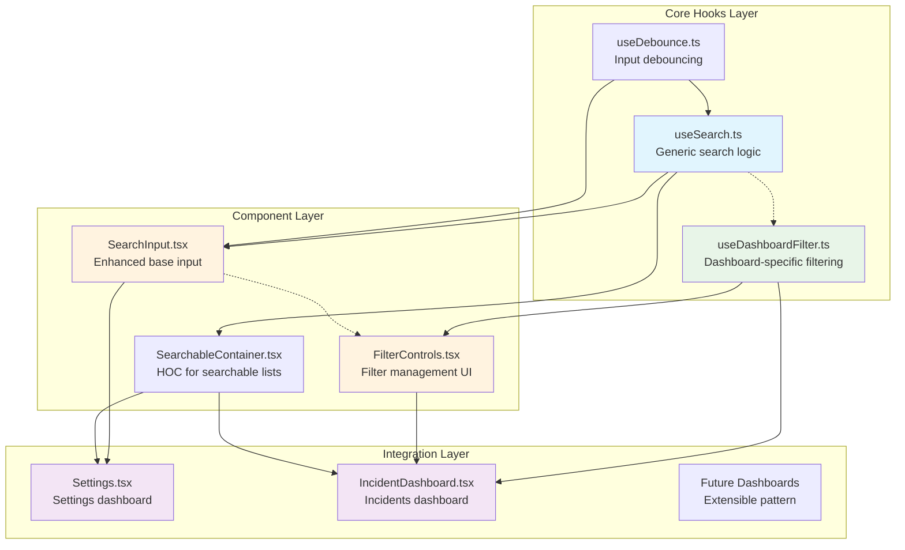
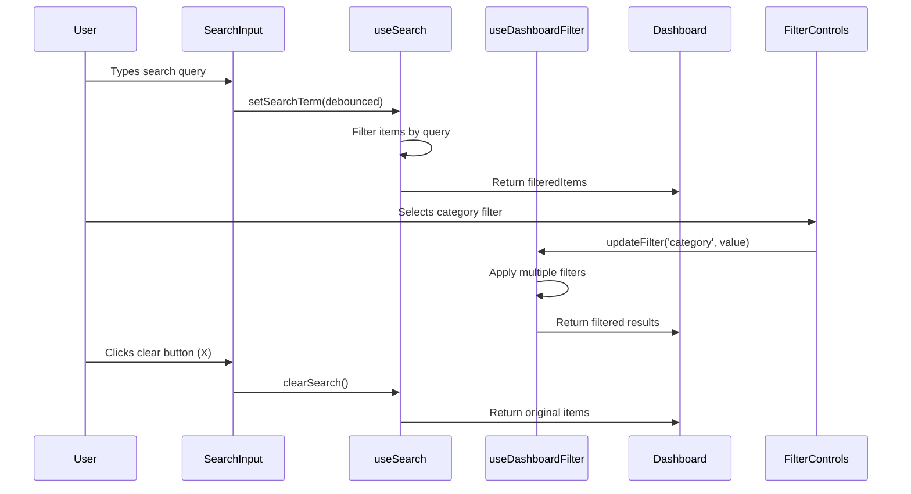
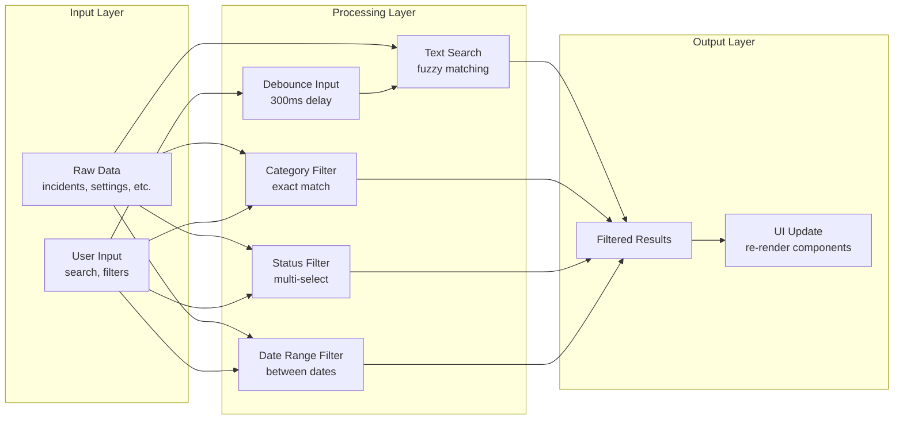

# Search Filter System - Component Relationships & Integration Flow

## 🔗 Component Dependency Graph



## 📊 State Flow Architecture



## 🔧 Hook Integration Patterns

### 1. Basic Search Pattern (Settings Dashboard)

```typescript
// Settings.tsx - Simple search integration
const SettingsWithSearch: React.FC = () => {
  // Flatten all settings sections for search
  const allSections = useMemo(() =>
    settingsCategories.flatMap(category => category.sections), []
  );

  // Use basic search hook
  const {
    filteredItems: filteredSections,
    searchTerm,
    setSearchTerm,
    clearSearch,
    isSearching,
    resultCount
  } = useSearch({
    items: allSections,
    searchKeys: ['title', 'description'],
    debounceMs: 300,
    minQueryLength: 2,
    filterFn: customFilterLogic // Optional custom filter
  });

  return (
    <div className="settings-with-search">
      {/* Enhanced search input */}
      <SearchInput
        value={searchTerm}
        onChange={setSearchTerm}
        onClear={clearSearch}
        placeholder="Search settings..."
        loading={isSearching}
        showClearButton={true}
        className="settings-search"
      />

      {/* Search results info */}
      {searchTerm && (
        <div className="search-info">
          {resultCount} settings found for "{searchTerm}"
        </div>
      )}

      {/* Conditional rendering based on search */}
      {searchTerm ? (
        <SearchResults sections={filteredSections} />
      ) : (
        <OriginalSettingsLayout categories={settingsCategories} />
      )}
    </div>
  );
};
```

### 2. Advanced Filter Pattern (Incident Dashboard)

```typescript
// IncidentDashboard.tsx - Complex filtering integration
const IncidentDashboardWithFilters: React.FC = () => {
  const [incidents, setIncidents] = useState<Incident[]>([]);

  // Use advanced dashboard filter hook
  const {
    filteredItems: filteredIncidents,
    activeFilters,
    updateFilter,
    clearAllFilters,
    clearFilter,
    hasActiveFilters,
    filterCount
  } = useDashboardFilter({
    items: incidents,
    config: {
      enableTextSearch: true,
      enableCategoryFilter: true,
      enableStatusFilter: true,
      enablePriorityFilter: true,
      enableDateFilter: true
    },
    searchKeys: ['title', 'problem', 'solution', 'incident_number'],
    defaultFilters: {
      searchTerm: '',
      categories: [],
      statuses: ['aberto', 'em_tratamento'], // Default to open/in-progress
      priorities: [],
      dateRange: undefined
    }
  });

  return (
    <div className="incident-dashboard">
      {/* Comprehensive filter controls */}
      <FilterControls
        filters={activeFilters}
        onFilterChange={updateFilter}
        onClearAll={clearAllFilters}
        onClearFilter={clearFilter}
        filterConfig={{
          availableCategories: ['JCL', 'VSAM', 'DB2', 'Batch', 'CICS'],
          availableStatuses: ['aberto', 'em_tratamento', 'resolvido', 'fechado'],
          availablePriorities: ['P1', 'P2', 'P3', 'P4'],
          showDateFilter: true,
          showTextSearch: true
        }}
        compact={false}
        className="incident-filters"
      />

      {/* Active filters display */}
      {hasActiveFilters && (
        <div className="active-filters">
          <span>Active filters ({filterCount})</span>
          <button onClick={clearAllFilters}>Clear all</button>
        </div>
      )}

      {/* Dashboard content with filtered data */}
      <IncidentMetrics incidents={filteredIncidents} />
      <IncidentList incidents={filteredIncidents} />
    </div>
  );
};
```

### 3. Searchable Container Pattern (Reusable)

```typescript
// Generic searchable list wrapper
const SearchableIncidentList: React.FC<{
  incidents: Incident[];
  onIncidentClick: (incident: Incident) => void;
}> = ({ incidents, onIncidentClick }) => {
  return (
    <SearchableContainer
      items={incidents}
      searchKeys={['title', 'problem', 'incident_number']}
      searchPlaceholder="Search incidents..."
      showFilters={true}
      filterConfig={{
        enableTextSearch: true,
        enableCategoryFilter: true,
        enableStatusFilter: true
      }}
      renderItem={(incident, index) => (
        <IncidentCard
          key={incident.id}
          incident={incident}
          onClick={() => onIncidentClick(incident)}
        />
      )}
      renderEmpty={() => (
        <EmptyState
          title="No incidents found"
          description="Try adjusting your search or filters"
        />
      )}
      className="searchable-incident-list"
    />
  );
};
```

## 🔄 Data Transformation Pipeline



## 🏗️ Component Implementation Structure

### File Organization
```
src/renderer/
├── hooks/
│   ├── useSearch.ts                 # Enhanced generic search
│   ├── useDashboardFilter.ts        # Advanced filtering
│   ├── useDebounce.ts              # Existing debounce
│   └── index.ts                    # Export all hooks
├── components/
│   ├── common/
│   │   ├── SearchInput.tsx         # Enhanced base input
│   │   ├── FilterControls.tsx      # Filter management
│   │   ├── SearchableContainer.tsx # HOC wrapper
│   │   └── EmptyState.tsx          # Empty search results
│   └── ui/
│       ├── FilterChip.tsx          # Individual filter chips
│       └── SearchResults.tsx       # Search result display
├── pages/
│   └── Settings.tsx                # Enhanced with search
├── views/
│   └── IncidentDashboard.tsx       # Enhanced with filters
└── types/
    ├── search.ts                   # Search interfaces
    └── filters.ts                  # Filter interfaces
```

## 🎯 Integration Strategy by Component

### 1. Settings Dashboard Integration

**Approach**: Progressive enhancement without breaking existing functionality

```typescript
// Phase 1: Add search overlay
const [showSearchResults, setShowSearchResults] = useState(false);

useEffect(() => {
  setShowSearchResults(searchTerm.length >= 2);
}, [searchTerm]);

// Phase 2: Maintain existing navigation
{showSearchResults ? (
  <SearchResultsOverlay sections={filteredSections} />
) : (
  <ExistingSettingsLayout />
)}
```

**Benefits**:
- Zero impact on existing users
- Gradual rollout possible
- Fallback to original UI
- Maintains lazy loading benefits

### 2. Incident Dashboard Integration

**Approach**: Direct integration with comprehensive filtering

```typescript
// Replace static incident display with filtered view
const displayIncidents = useMemo(() => {
  return hasActiveFilters ? filteredIncidents : incidents;
}, [hasActiveFilters, filteredIncidents, incidents]);

// Update metrics based on filtered data
const displayMetrics = useMemo(() => {
  return calculateMetrics(displayIncidents);
}, [displayIncidents]);
```

**Benefits**:
- Real-time filtering
- Consistent user experience
- Performance optimized
- Extensible for future dashboards

## 📱 Responsive Design Considerations

### Mobile-First Filter Design

```typescript
const FilterControls: React.FC = ({ compact, ...props }) => {
  const isMobile = useMediaQuery('(max-width: 768px)');

  return (
    <div className={`filter-controls ${isMobile ? 'mobile' : 'desktop'}`}>
      {isMobile ? (
        <MobileFilterDrawer {...props} />
      ) : (
        <DesktopFilterBar {...props} />
      )}
    </div>
  );
};
```

### Responsive Search Input

```css
.search-input {
  width: 100%;
  min-width: 280px;

  @media (max-width: 768px) {
    min-width: 240px;
    font-size: 16px; /* Prevent zoom on iOS */
  }

  @media (max-width: 480px) {
    min-width: 200px;
  }
}
```

## 🔍 Search Algorithm Implementation

### Multi-Field Search Logic

```typescript
const createSearchFilter = <T>(
  searchKeys: (keyof T)[],
  query: string,
  options: SearchOptions = {}
) => {
  const {
    caseSensitive = false,
    fuzzyThreshold = 0.6,
    enableFuzzy = false
  } = options;

  const normalizedQuery = caseSensitive ? query : query.toLowerCase();

  return (item: T): boolean => {
    return searchKeys.some(key => {
      const value = String(item[key] || '');
      const normalizedValue = caseSensitive ? value : value.toLowerCase();

      if (enableFuzzy) {
        return fuzzyMatch(normalizedValue, normalizedQuery, fuzzyThreshold);
      }

      return normalizedValue.includes(normalizedQuery);
    });
  };
};
```

### Performance Optimization

```typescript
// Memoize filter function to prevent unnecessary recalculations
const filterFunction = useMemo(() => {
  return createSearchFilter(searchKeys, debouncedQuery, options);
}, [searchKeys, debouncedQuery, options]);

// Use Web Workers for large datasets
const useWebWorkerSearch = (items: any[], query: string) => {
  const [results, setResults] = useState(items);

  useEffect(() => {
    if (items.length > 1000) {
      const worker = new Worker('/search-worker.js');
      worker.postMessage({ items, query });
      worker.onmessage = (e) => setResults(e.data);
      return () => worker.terminate();
    } else {
      setResults(filterItems(items, query));
    }
  }, [items, query]);

  return results;
};
```

## 🧪 Testing Integration Strategy

### Component Testing Approach

```typescript
// Test hook in isolation
describe('useSearch', () => {
  const mockItems = [
    { id: 1, title: 'Test Item', description: 'Description' },
    { id: 2, title: 'Another Item', description: 'Another desc' }
  ];

  it('filters items correctly', () => {
    const { result } = renderHook(() =>
      useSearch({
        items: mockItems,
        searchKeys: ['title', 'description']
      })
    );

    act(() => {
      result.current.setSearchTerm('test');
    });

    expect(result.current.filteredItems).toHaveLength(1);
    expect(result.current.filteredItems[0].title).toBe('Test Item');
  });
});

// Test component integration
describe('SearchInput integration', () => {
  it('updates search results on input change', async () => {
    render(<SearchableIncidentList incidents={mockIncidents} />);

    const searchInput = screen.getByPlaceholderText('Search incidents...');
    fireEvent.change(searchInput, { target: { value: 'database' } });

    await waitFor(() => {
      expect(screen.getByText('DB2 Connection Issue')).toBeInTheDocument();
      expect(screen.queryByText('JCL Job Error')).not.toBeInTheDocument();
    });
  });
});
```

---

**Component Relationships Documentation Complete** ✅

*This detailed component relationship guide provides the foundation for implementing a cohesive, performant search and filter system across all dashboard components.*