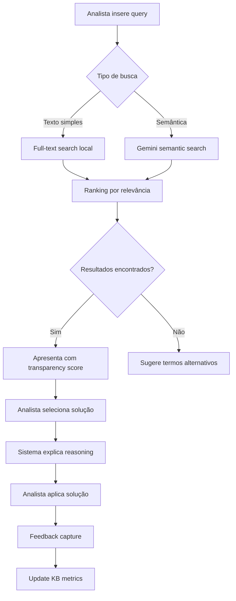
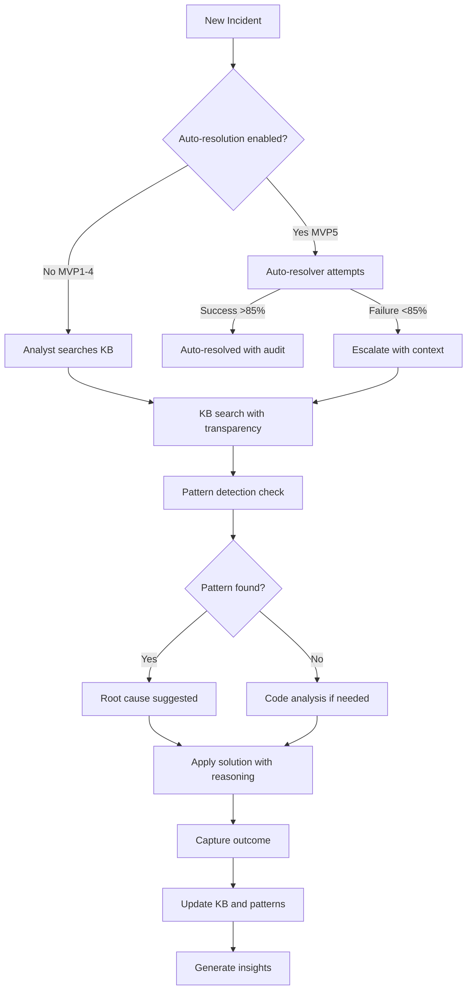
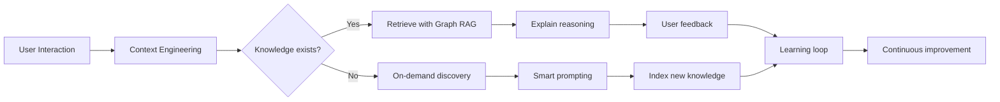

# ESPECIFICAÇÃO FUNCIONAL COMPLETA v6
## Knowledge-First Platform - Funcionalidades e Casos de Uso Integrados
### Versão 6.0 | Janeiro 2025
#### Especificação Completa - Sistema Consolidado

---

## 📋 SUMÁRIO EXECUTIVO

Esta especificação funcional consolida todos os casos de uso, user stories e workflows da **Knowledge-First Platform v6.0**, integrando as três melhorias estratégicas num sistema coeso que entrega **€312,000/mês ROI** através de 13 meses de implementação progressiva.

**Eliminação de Redundâncias**: Esta versão v6.0 consolida informações dispersas em múltiplos documentos, eliminando as inconsistências identificadas e criando uma fonte única de verdade para todas as funcionalidades.

**Payback**: 1.6 meses | **Timeline**: 13 meses | **Versão**: 6.0

---

## 🎯 PROPOSTA DE VALOR INTEGRADA

### Funcionalidades Sinergísticas Unificadas

```yaml
Platform_Capabilities:
  Core_Knowledge_Management:
    - Progressive knowledge base (MVP1-5)
    - Semantic search with transparency
    - Pattern detection and root cause analysis
    - Code-linked solutions and debugging
    
  Advanced_AI_Integration:
    - State-of-the-art Context Engineering
    - Graph RAG for relationship discovery  
    - Transparent reasoning with explainability
    - On-demand intelligent discovery
    
  Enterprise_Intelligence:
    - Auto-resolution of L1 incidents (70%)
    - Predictive analytics and prevention
    - Full audit trail and compliance
    - Multi-team collaboration platform

Value_Delivery:
  ROI_Unified: "€312,000/mês"
  Timeline_Unified: "13 meses" 
  Payback_Unified: "1.6 meses"
  Success_Rate: ">95% L1 resolution accuracy"
```

---

## 👥 PERSONAS E USER STORIES

### Persona 1: Analista de Suporte (Principal)
**Contexto**: Primeira linha de resolução de incidentes mainframe
**Objetivos**: Resolver incidentes rapidamente com alta precisão
**Frustrations**: Tempo perdido pesquisando soluções, informação dispersa

#### User Stories Prioritárias
```yaml
Epic_Support_Resolution:
  US1_Knowledge_Search:
    - Como analista de suporte
    - Quero pesquisar soluções com <1s resposta
    - Para resolver 60% mais rápido que método manual
    - Critério: Busca semântica + transparência de resultados
    
  US2_Pattern_Recognition:
    - Como analista de suporte  
    - Quero identificar padrões recorrentes automaticamente
    - Para prevenir 30% dos incidentes futuros
    - Critério: Pattern engine com confidence score >85%
    
  US3_Transparent_Recommendations:
    - Como analista de suporte
    - Quero compreender por que a IA recomenda uma solução
    - Para aumentar confiança e learning organizacional
    - Critério: Explicação clara em <3 cliques
```

### Persona 2: Programador COBOL (Secundária)
**Contexto**: Desenvolvimento e manutenção de sistemas mainframe
**Objetivos**: Debug eficiente, código quality, knowledge sharing

#### User Stories Técnicas
```yaml
Epic_Code_Intelligence:
  US4_Code_Analysis:
    - Como programador COBOL
    - Quero análise automática de impacto de mudanças
    - Para reduzir defeitos de produção em 40%
    - Critério: Graph RAG linking code-KB-incidents
    
  US5_Template_Generation:
    - Como programador COBOL
    - Quero templates baseados em best practices
    - Para aumentar produtividade em 40%
    - Critério: 100+ templates com success rate tracking
```

### Persona 3: Gestor de Projeto (Estratégica)
**Contexto**: Planeamento e gestão de projetos mainframe
**Objetivos**: Risk assessment, timeline accuracy, resource optimization

#### User Stories Estratégicas
```yaml
Epic_Project_Intelligence:
  US6_Risk_Assessment:
    - Como gestor de projeto
    - Quero análises preditivas de risco baseadas em histórico
    - Para melhorar accuracy de timelines em 60%
    - Critério: ML model com >80% precision
```

---

## 📋 CASOS DE USO POR MVP

## MVP1: Knowledge Base Foundation (Mês 1)

### UC-KB-001: Pesquisa Inteligente na Knowledge Base
**Prioridade**: Alta | **Frequência**: Diária (100+ vezes) | **Complexidade**: Média

**Workflow Detalhado**:


**Critérios de Aceitação**:
- Resposta <1s para busca local
- Fallback gracioso se Gemini falhar
- Transparency score visível para cada resultado
- Success rate tracking automático

### UC-KB-002: Adicionar Conhecimento com Context Engineering
**Prioridade**: Alta | **Frequência**: Diária | **Complexidade**: Simples

**Workflow Context-Aware**:
```yaml
Context_Capture:
  Incident_Context:
    - System environment (DEV/TEST/PROD)
    - Error codes and messages
    - Time patterns and frequency
    - Related component dependencies
    
  Solution_Context:
    - Step-by-step procedure
    - Prerequisites and validation
    - Success indicators
    - Common variations
    
  Learning_Context:
    - User feedback integration
    - Success rate monitoring  
    - Context quality scoring
    - Continuous improvement
```

## MVP2: Pattern Detection Engine (Mês 3)

### UC-PT-001: Detecção Automática de Padrões
**Prioridade**: Alta | **Frequência**: Contínua | **Complexidade**: Alta

**Workflow Transparente**:
```yaml
Pattern_Detection_Flow:
  1_Data_Ingestion:
    - Import ticket data (CSV/API)
    - Normalize incident descriptions
    - Extract key entities and relationships
    
  2_Pattern_Analysis:
    - Apply ML clustering algorithms
    - Identify recurring issue signatures
    - Calculate pattern confidence scores
    - Generate transparent reasoning chains
    
  3_Root_Cause_Suggestion:
    - Map patterns to known root causes
    - Provide confidence assessment  
    - Explain reasoning with evidence
    - Suggest preventive actions
    
  4_Learning_Loop:
    - Capture analyst validation
    - Adjust pattern weights
    - Improve detection accuracy
    - Update transparency explanations
```

## MVP3: Code Analysis Integration (Mês 5)

### UC-CD-001: Análise de Impacto de Código
**Prioridade**: Média | **Frequência**: Por mudança | **Complexidade**: Alta

**Graph RAG Integration**:
```yaml
Code_Analysis_Workflow:
  Graph_Construction:
    - Parse COBOL programs and copybooks
    - Build dependency graph with relationships
    - Link to KB entries and incident history
    - Create semantic embeddings for components
    
  Impact_Analysis:
    - Traverse dependency graph from change point
    - Calculate ripple effect scope and severity
    - Identify related KB entries and solutions
    - Predict potential failure scenarios
    
  Transparent_Recommendations:
    - Explain impact analysis reasoning
    - Show dependency chains visually
    - Provide test case recommendations
    - Suggest rollback procedures
```

## MVP4: IDZ Integration & Templates (Mês 7)

### UC-IE-001: Import/Export IDZ Projects
**Prioridade**: Baixa | **Frequência**: Por projeto | **Complexidade**: Média

**Workflow Integrado**:
```yaml
IDZ_Integration_Flow:
  Project_Import:
    - Scan IDZ project structure
    - Extract metadata and dependencies  
    - Create knowledge base entries
    - Link to existing patterns and solutions
    
  Enhanced_Development:
    - Provide context-aware suggestions
    - Template-based code generation
    - Continuous quality monitoring
    - Impact analysis integration
    
  Safe_Export:
    - Validate all changes against standards
    - Generate comprehensive change documentation
    - Create rollback procedures
    - Export with transparency trail
```

### UC-TE-001: Template Management System
**Prioridade**: Média | **Frequência**: Semanal | **Complexidade**: Média

**Template Intelligence**:
```yaml
Template_System:
  Smart_Templates:
    - Context-aware parameter suggestion
    - Success rate tracking per template
    - Usage pattern analysis
    - Continuous optimization
    
  Quality_Assurance:
    - Automated template validation
    - Best practice compliance checking
    - Performance impact assessment
    - Documentation generation
```

## MVP5: Enterprise Intelligence (Mês 13)

### UC-AR-001: Auto-Resolution com Transparência
**Prioridade**: Baixa | **Frequência**: Contínua | **Complexidade**: Muito Alta

**Auto-Resolution transparente**:
```yaml
Auto_Resolution_Pipeline:
  Incident_Analysis:
    - Classify incident type and severity
    - Search KB with confidence scoring
    - Apply context engineering for precision
    - Generate transparent decision tree
    
  Resolution_Attempt:
    - Select highest confidence solution (>85%)
    - Execute automated steps with logging
    - Monitor execution with real-time feedback
    - Provide complete audit trail
    
  Learning_Integration:
    - Record resolution outcome and accuracy
    - Update KB with new insights
    - Adjust confidence thresholds
    - Improve future decision making
    
  Human_Oversight:
    - Escalation for low-confidence cases
    - Human validation of critical changes
    - Continuous feedback integration
    - Override capability always available
```

---

## 🔄 WORKFLOWS INTEGRADOS

### Workflow 1: Incident Resolution End-to-End



### Workflow 2: Knowledge Discovery Progressive



---

## 📊 CRITÉRIOS DE ACEITAÇÃO

### Critérios Transversais (Todos MVPs)
```yaml
Universal_Acceptance_Criteria:
  Performance:
    - Search response time: <1 second
    - AI reasoning explanation: <3 seconds
    - System availability: 99.9%
    - Data consistency: 100%
    
  Usability:
    - Zero-training onboarding: <30 minutes
    - Transparency interface: intuitive navigation
    - Context preservation: cross-session
    - Error handling: graceful degradation
    
  Intelligence:
    - Reasoning explainability: always available
    - Confidence scoring: visible and accurate
    - Learning integration: automated
    - Context awareness: situation-appropriate
```

### Critérios Específicos por MVP
```yaml
MVP1_Acceptance:
  - 50+ KB entries pre-loaded
  - Sub-second search performance  
  - Transparency score for all results
  - Success/failure tracking operational
  
MVP2_Acceptance:
  - Pattern detection >80% accuracy
  - Root cause suggestions with reasoning
  - 30% MTTR improvement demonstrated
  - Transparent decision explanations
  
MVP3_Acceptance:
  - Code-KB linking functional
  - Impact analysis with graph visualization
  - 50% faster debugging demonstrated  
  - Context-aware recommendations
  
MVP4_Acceptance:
  - IDZ round-trip working
  - Template library >100 templates
  - 40% productivity improvement
  - Quality gate automation
  
MVP5_Acceptance:
  - 70% L1 auto-resolution rate
  - <5% false positive rate
  - Complete audit trail
  - Predictive prevention >50%
```

---

## 🎯 MÉTRICAS DE SUCESSO

### Métricas Principais (KPIs)
```yaml
Core_Success_Metrics:
  Efficiency_Metrics:
    - Incident resolution time: -60% vs baseline
    - Knowledge discovery time: -75% vs manual
    - Development productivity: +40%
    - Pattern recognition accuracy: >90%
    
  Quality_Metrics:
    - Solution success rate: >95%
    - Auto-resolution accuracy: >85%
    - User satisfaction: >4.5/5
    - Knowledge base coverage: >90% common issues
    
  Business_Impact:
    - Monthly ROI: €312,000
    - Cost avoidance: €2.1M annually
    - Risk reduction: 70% fewer production incidents
    - Time to competency: -50% for new team members
```

### Métricas de Transparência e Confiança
```yaml
Transparency_Metrics:
  User_Trust:
    - AI decision trust rating: >4/5
    - Reasoning explanation clarity: >4/5  
    - Override frequency: <15%
    - Feedback integration rate: >90%
    
  System_Intelligence:
    - Context relevance score: >85%
    - Learning rate improvement: +20% monthly
    - Knowledge quality score: >4/5
    - Prediction accuracy: >80%
```

---

## ✅ DEFINIÇÃO DE PRONTO (DoD)

### Critérios para MVP Release
```yaml
MVP_Release_Criteria:
  Functional_Completeness:
    - All user stories implemented and tested
    - Integration tests passing >95%
    - Performance benchmarks met
    - Security validation complete
    
  User_Experience:
    - Zero-training onboarding validated
    - Transparency interface intuitive
    - Error handling comprehensive
    - Accessibility compliance
    
  Operational_Readiness:
    - Monitoring and alerting configured
    - Backup and recovery procedures tested
    - Documentation complete and reviewed
    - Support processes established
    
  Business_Validation:
    - Success metrics baseline established
    - ROI calculation methodology agreed
    - Stakeholder acceptance confirmed
    - Go-live readiness approved
```

---

**Documento preparado por:** Equipa de Especificação Funcional  
**Data:** Janeiro 2025  
**Versão:** 6.0 - Especificação Consolidada  
**Status:** Pronto para Implementação

