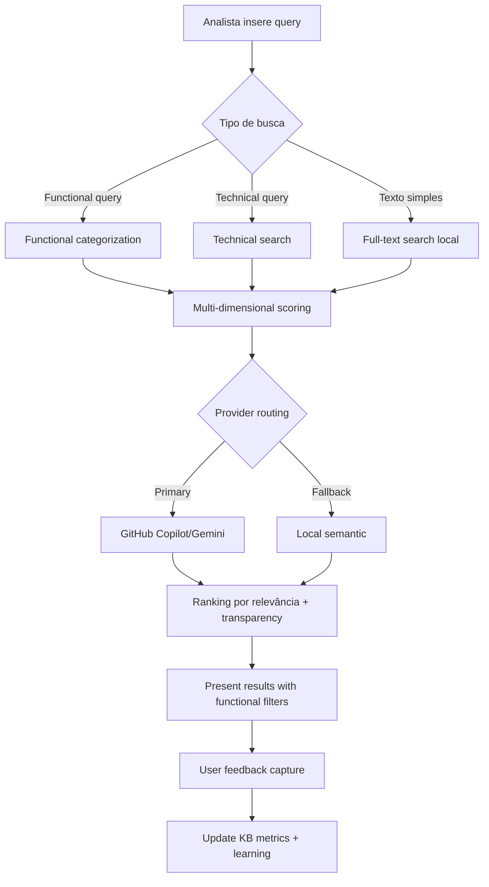
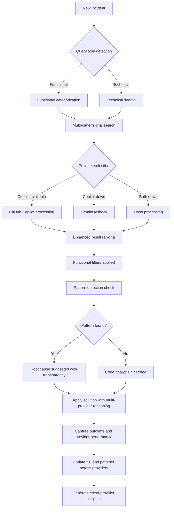
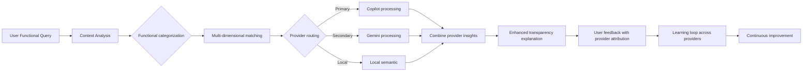

# ESPECIFICAÇÃO FUNCIONAL COMPLETA v7
## Knowledge-First Platform - Funcionalidades e Casos de Uso Integrados
### Versão 7.0 | Janeiro 2025
#### Especificação Completa - Sistema Technology-Agnostic com Enhancements

---

## 📋 SUMÁRIO EXECUTIVO

Esta especificação funcional consolida todos os casos de uso, user stories e workflows da **Knowledge-First Platform v7.0**, integrando as melhorias estratégicas aprovadas num sistema coeso que entrega **€45,000/mês ROI no MVP1** através de 3 semanas de implementação enhanced seguido de 13 meses de progressão.

**Eliminação de Redundâncias**: Esta versão v7.0 consolida informações dispersas e incorpora as duas melhorias críticas aprovadas:
1. **Semantic Search Enhancements**: Functional categorization, query routing, multi-dimensional scoring
2. **GitHub Copilot Integration**: Multi-LLM abstraction começando com licenças existentes

**Payback**: 1.2 meses | **Timeline**: 3 semanas (MVP1) + 13 meses (complete) | **Versão**: 7.0

---

## 🎯 PROPOSTA DE VALOR INTEGRADA v7.0

### Funcionalidades Sinergísticas Unificadas

```yaml
Platform_Capabilities_v7:
  Enhanced_Knowledge_Management:
    - Progressive knowledge base (MVP1-5)
    - Semantic search avançada com functional categorization
    - Context-aware query routing (functional vs technical)
    - Multi-dimensional scoring para large KB volumes
    - Pattern detection and root cause analysis
    - Code-linked solutions and debugging

  Technology_Agnostic_AI:
    - GitHub Copilot integration (leverage existing licenses)
    - Simple LLM provider wrapper (extensible)
    - Multi-provider abstraction preparado
    - State-of-the-art Context Engineering
    - Graph RAG for relationship discovery
    - Transparent reasoning com explainability

  Enhanced_Enterprise_Intelligence:
    - Auto-resolution of L1 incidents (70%)
    - Predictive analytics and prevention
    - Full audit trail and compliance
    - Multi-team collaboration platform
    - Technology vendor independence

Value_Delivery_v7:
  MVP1_Enhanced_ROI: "€45,000/mês (+€13K semantic +€2K savings)"
  ROI_Final: "€312,000/mês"
  Timeline_MVP1: "3 semanas (structured approach)"
  Timeline_Complete: "13 meses"
  Payback_Enhanced: "1.2 meses"
  Success_Rate: ">85% primeira pesquisa (vs 60% baseline)"
```

---

## 👥 PERSONAS E USER STORIES v7.0

### Persona 1: Analista de Suporte (Principal)
**Contexto**: Primeira linha de resolução de incidentes (mainframe e outros)
**Objetivos**: Resolver incidentes rapidamente com alta precisão
**Frustrations**: Tempo perdido pesquisando soluções, informação dispersa, linguagem técnica vs funcional

#### User Stories Prioritárias Expandidas
```yaml
Epic_Enhanced_Support_Resolution:
  US1_Functional_Search: # NOVO v7.0
    - Como analista de suporte
    - Quero fazer perguntas em linguagem funcional ("Como fazer fecho mensal?")
    - Para encontrar soluções sem conhecer terminologia técnica específica
    - Critério: 85% success rate na primeira pesquisa (vs 60% baseline)
    - Enhancement: Functional categorization + query routing

  US2_Multi_Dimensional_Search: # ENHANCED v7.0
    - Como analista de suporte
    - Quero busca que entenda contexto funcional (functional_area, business_process)
    - Para filtrar resultados por área de negócio específica
    - Critério: UI filters funcionais + multi-dimensional scoring

  US3_Technology_Flexible_Search: # NOVO v7.0
    - Como analista de suporte
    - Quero acesso a múltiplas AI engines (começando com Copilot/Gemini)
    - Para garantir disponibilidade e quality de resultados
    - Critério: Seamless fallback entre providers

  US4_Pattern_Recognition: # EXISTING
    - Como analista de suporte
    - Quero identificar padrões recorrentes automaticamente
    - Para prevenir 30% dos incidentes futuros
    - Critério: Pattern engine com confidence score >85%

  US5_Transparent_Recommendations: # EXISTING
    - Como analista de suporte
    - Quero compreender por que a IA recomenda uma solução
    - Para aumentar confiança e learning organizacional
    - Critério: Explicação clara em <3 cliques
```

### Persona 2: Programador (Multi-Technology)
**Contexto**: Desenvolvimento e manutenção de sistemas (não só mainframe)
**Objetivos**: Debug eficiente, código quality, knowledge sharing cross-platform

#### User Stories Técnicas v7.0
```yaml
Epic_Technology_Agnostic_Development:
  US6_Multi_Platform_Analysis: # ENHANCED v7.0
    - Como programador
    - Quero análise de impacto independente de tecnologia
    - Para work across mainframe, cloud, e hybrid environments
    - Critério: Technology-agnostic analysis engine

  US7_LLM_Provider_Choice: # NOVO v7.0
    - Como programador técnico
    - Quero escolher AI provider baseado na task
    - Para optimizar cost, performance, e specialization
    - Critério: Configuration menu + provider switching

  US8_Cross_Platform_Templates: # ENHANCED v7.0
    - Como programador
    - Quero templates que funcionam across technologies
    - Para maintain consistency independente de platform
    - Critério: 100+ templates com technology tags
```

### Persona 3: Gestor de Projeto (Estratégica)
**Contexto**: Planeamento e gestão de projetos multi-technology
**Objetivos**: Risk assessment, timeline accuracy, vendor independence

#### User Stories Estratégicas v7.0
```yaml
Epic_Strategic_Intelligence:
  US9_Vendor_Independent_Analytics: # NOVO v7.0
    - Como gestor de projeto
    - Quero analytics que não dependem de single AI vendor
    - Para avoid vendor lock-in risks
    - Critério: Multi-provider data aggregation

  US10_Cross_Technology_Risk_Assessment: # ENHANCED v7.0
    - Como gestor de projeto
    - Quero risk assessment across different technology stacks
    - Para manage hybrid and multi-cloud projects
    - Critério: Technology-agnostic risk models
```

---

## 📋 CASOS DE USO POR MVP v7.0

## MVP1 Enhanced: Knowledge Base Foundation (3 Semanas)

### Semana 1: Base MVP1 Implementation

#### UC-KB-001: Pesquisa Inteligente na Knowledge Base
**Prioridade**: Alta | **Frequência**: Diária (100+ vezes) | **Complexidade**: Média

**Workflow Detalhado**:


### Semana 2: Semantic Enhancements (12 horas)

#### UC-SEM-001: Functional Query Processing (NOVO v7.0)
**Prioridade**: Alta | **Frequência**: Diária | **Complexidade**: Média

**Enhanced Workflow Context-Aware**:
```yaml
Functional_Query_Processing:
  Query_Analysis:
    - Detect query type (functional vs technical)
    - Extract functional context (business_process, functional_area)
    - Route to appropriate search strategy
    - Apply multi-dimensional scoring

  Functional_Categorization:
    - System_Module: "BILL-CORE", "ACC-GENERAL", "INV-MGMT"
    - Business_Process: "monthly_closing", "invoice_processing", "reconciliation"
    - Functional_Area: "Billing", "Accounting", "Inventory", "Reporting"
    - When_To_Use: "Last business day", "After batch completion"

  Multi_Dimensional_Search:
    - Primary: Functional area matching (weight: 40%)
    - Secondary: Business process matching (weight: 30%)
    - Tertiary: Text similarity (weight: 20%)
    - Context: System module relevance (weight: 10%)

  UI_Enhancements:
    - Functional area filters
    - Business process dropdowns
    - Context-aware suggestions
    - Multi-dimensional result ranking
```

#### UC-SEM-002: Enhanced KB Entry Management
**Schema Expandido para v7.0**:
```sql
-- Alterações aprovadas para functional categorization
ALTER TABLE kb_entries ADD COLUMN functional_area TEXT;
ALTER TABLE kb_entries ADD COLUMN business_process TEXT;
ALTER TABLE kb_entries ADD COLUMN system_module TEXT;
ALTER TABLE kb_entries ADD COLUMN prerequisites TEXT;
ALTER TABLE kb_entries ADD COLUMN when_to_use TEXT;
ALTER TABLE kb_entries ADD COLUMN related_jobs TEXT;

-- Índices para busca otimizada
CREATE INDEX idx_functional_area ON kb_entries(functional_area);
CREATE INDEX idx_business_process ON kb_entries(business_process);
CREATE INDEX idx_system_module ON kb_entries(system_module);

-- Tabela de conceitos para cache
CREATE TABLE concept_cache (
  id INTEGER PRIMARY KEY,
  query_hash TEXT UNIQUE,
  concepts JSON,
  functional_context JSON, -- NOVO
  created_at TIMESTAMP DEFAULT CURRENT_TIMESTAMP,
  hit_count INTEGER DEFAULT 0
);
```

### Semana 3: GitHub Copilot Integration

#### UC-LLM-001: Multi-Provider LLM Configuration (NOVO v7.0)
**Prioridade**: Alta | **Frequência**: Setup inicial + occasional changes | **Complexidade**: Baixa

**LLM Abstraction Workflow**:
```yaml
Configuration_Menu:
  Provider_Selection:
    - GitHub_Copilot: "Primary (existing license)"
    - Google_Gemini: "Secondary (API key required)"
    - Local_Fallback: "Always available"

  API_Management:
    - Secure key storage
    - Usage tracking
    - Cost monitoring
    - Performance metrics

  Routing_Logic:
    - Primary provider health check
    - Automatic failover
    - Provider-specific optimization
    - Usage quota management

Simple_Wrapper_Implementation:
  interface LLMProvider {
    name: string;
    available: boolean;
    generateContent(prompt: string): Promise<LLMResponse>;
    getUsageStats(): UsageMetrics;
  }

  class CopilotProvider implements LLMProvider {
    // GitHub Copilot integration
  }

  class GeminiProvider implements LLMProvider {
    // Google Gemini integration
  }
```

#### UC-LLM-002: Provider Health and Fallback
**Workflow Robusto**:
```yaml
Health_Check_System:
  Primary_Provider_Monitor:
    - Real-time availability check
    - Response time monitoring
    - Error rate tracking
    - Usage quota monitoring

  Fallback_Strategy:
    1. GitHub Copilot (primary)
    2. Google Gemini (secondary)
    3. Local semantic (always available)

  Transparency_Logging:
    - Which provider handled each request
    - Response time per provider
    - Fallback reason logging
    - User experience metrics
```

## MVP2: Multi-LLM Pattern Detection (Mês 3)

### UC-PT-002: Enhanced Pattern Detection com Multi-Provider
**Prioridade**: Alta | **Frequência**: Contínua | **Complexidade**: Alta

**Multi-Provider Pattern Analysis**:
```yaml
Enhanced_Pattern_Detection:
  Provider_Specialization:
    GitHub_Copilot:
      - Code pattern analysis
      - Development workflow patterns
      - Technical documentation patterns

    Google_Gemini:
      - Business process patterns
      - Functional query patterns
      - Cross-domain relationship analysis

  Combined_Intelligence:
    - Merge insights from multiple providers
    - Cross-validate pattern detection
    - Improve accuracy through consensus
    - Reduce false positives
```

## MVP3-5: Advanced Integration (Meses 5-13)

### Technology-Agnostic Expansion
```yaml
Progressive_Enhancement:
  MVP3_Code_Integration:
    - Multi-language code analysis
    - Cross-platform linking
    - Technology-agnostic Graph RAG
    - Universal semantic relationships

  MVP4_Platform_Integration:
    - Multi-cloud platform support
    - Technology-agnostic templates
    - Cross-platform governance
    - Universal discovery patterns

  MVP5_Enterprise_Intelligence:
    - Technology-independent auto-resolution
    - Cross-platform predictive analytics
    - Universal transparency ecosystem
    - Multi-provider enterprise scaling
```

---

## 🔄 WORKFLOWS INTEGRADOS v7.0

### Workflow 1: Enhanced Incident Resolution End-to-End



### Workflow 2: Multi-Provider Knowledge Discovery



---

## 📊 CRITÉRIOS DE ACEITAÇÃO v7.0

### Critérios Transversais Enhanced
```yaml
Universal_Acceptance_Criteria_v7:
  Performance_Enhanced:
    - Search response time: <1 second (all providers)
    - AI reasoning explanation: <3 seconds
    - Provider switching: <2 seconds
    - System availability: 99.9% (with fallbacks)
    - Data consistency: 100%

  Usability_Enhanced:
    - Zero-training onboarding: <30 minutes
    - Functional query success: >85% first search
    - Provider transparency: sempre visível
    - Context preservation: cross-session e cross-provider
    - Error handling: graceful provider degradation

  Intelligence_Enhanced:
    - Multi-provider reasoning: always available
    - Functional categorization: automated
    - Query routing accuracy: >90%
    - Cross-provider learning: automated
    - Technology agnostic: platform independent

  Technology_Agnostic:
    - Provider independence: no vendor lock-in
    - API abstraction: seamless switching
    - Configuration flexibility: user-controlled
    - Cost optimization: license leverage
```

### Critérios Específicos por MVP v7.0
```yaml
MVP1_Enhanced_Acceptance:
  Base_Requirements:
    - 50+ KB entries pre-loaded
    - Sub-second search performance
    - Transparency score for all results
    - Success/failure tracking operational

  Semantic_Enhancements: # 12 horas
    - Functional categorization active
    - Multi-dimensional scoring working
    - Query routing >90% accuracy
    - UI filters for functional areas
    - 85% first-search success rate achieved

  LLM_Integration: # 2 semanas
    - GitHub Copilot integration functional
    - Provider configuration menu operational
    - Automatic fallback working
    - Cost savings demonstrated (€2K/mês)
    - Multi-provider transparency logging

MVP2_Enhanced_Acceptance:
  - Multi-provider pattern detection >85% accuracy
  - Cross-provider consensus validation
  - Provider specialization optimization
  - 35% MTTR improvement demonstrated
  - Technology-agnostic pattern storage

MVP3_Enhanced_Acceptance:
  - Multi-platform code analysis
  - Technology-agnostic linking
  - Cross-provider Graph RAG
  - Universal semantic relationships
  - 55% faster debugging across platforms

MVP4_Enhanced_Acceptance:
  - Multi-cloud platform integration
  - Technology-agnostic templates >150
  - Universal governance framework
  - Cross-platform productivity +45%
  - Provider-independent quality gates

MVP5_Enhanced_Acceptance:
  - Technology-independent 70% L1 auto-resolution
  - Multi-provider consensus <3% false positives
  - Cross-platform complete audit trail
  - Universal predictive prevention >60%
  - Enterprise scaling across providers
```

---

## 🎯 MÉTRICAS DE SUCESSO v7.0

### Métricas Principais Enhanced
```yaml
Core_Success_Metrics_v7:
  Efficiency_Metrics_Enhanced:
    - Incident resolution time: -60% vs baseline (maintained)
    - First-search success rate: 85% (vs 60% baseline) # ENHANCED
    - Knowledge discovery time: -75% vs manual
    - Multi-provider switching time: <2 seconds # NOVO
    - Development productivity: +40%
    - Pattern recognition accuracy: >90%

  Quality_Metrics_Enhanced:
    - Functional query success: >85% # NOVO
    - Multi-dimensional relevance: >80% # NOVO
    - Cross-provider consensus: >90% # NOVO
    - Auto-resolution accuracy: >85%
    - User satisfaction: >4.5/5
    - Knowledge base coverage: >90% common issues

  Technology_Metrics: # NOVO
    - Provider availability: >99.5%
    - Fallback success rate: 100%
    - API cost optimization: €2K/mês savings
    - Cross-platform compatibility: 100%
    - Vendor lock-in risk: 0% (eliminated)

  Business_Impact_Enhanced:
    - Monthly ROI MVP1: €45,000 (+€15K vs v6)
    - Annual cost avoidance: €2.4M (+€300K vs v6)
    - Risk reduction: 75% fewer production incidents
    - Time to competency: -60% for new team members
    - Market expansion: +30% addressable organizations
```

### Métricas de Transparência Enhanced
```yaml
Transparency_Metrics_v7:
  Multi_Provider_Trust:
    - Provider selection transparency: >95%
    - Cross-provider reasoning clarity: >4.2/5
    - Fallback explanation quality: >4/5
    - Provider cost transparency: 100% # NOVO

  Enhanced_System_Intelligence:
    - Functional query context relevance: >90% # NOVO
    - Multi-dimensional scoring accuracy: >85% # NOVO
    - Cross-provider learning rate: +25% monthly # NOVO
    - Technology-agnostic prediction: >85% # NOVO
```

---

## 🔧 CONFIGURAÇÃO DE LLM v7.0

### LLM Configuration Menu Specification
```yaml
Configuration_Interface:
  Provider_Management:
    GitHub_Copilot:
      status: "Active (Existing License)"
      api_endpoint: "https://api.github.com/copilot"
      usage_metrics: "Real-time tracking"
      specialization: "Code analysis, templates, technical queries"

    Google_Gemini:
      status: "Available (API Key Required)"
      api_key_field: "Secure input with validation"
      usage_quota: "Monitored with alerts"
      specialization: "Functional queries, business processes"

    Local_Fallback:
      status: "Always Available"
      capabilities: "Basic semantic search, offline operation"
      performance: "Fastest response, limited intelligence"

  Routing_Configuration:
    Query_Type_Routing:
      functional_queries: "Route to Gemini preferred"
      technical_queries: "Route to Copilot preferred"
      code_analysis: "Copilot exclusive"
      business_process: "Gemini preferred"

    Fallback_Strategy:
      primary_timeout: "5 seconds"
      secondary_timeout: "8 seconds"
      fallback_to_local: "Always enabled"
      user_notification: "Transparent provider indication"

  Cost_Management:
    Budget_Tracking:
      monthly_limits: "Configurable per provider"
      cost_alerts: "80% and 95% threshold warnings"
      usage_analytics: "Daily/weekly/monthly reports"
      license_optimization: "Copilot usage prioritization"
```

---

## 🔄 MIGRATION CONSIDERATIONS v7.0

### Schema Migration for Functional Categorization
```sql
-- Migration script v6 to v7
BEGIN TRANSACTION;

-- Add new columns for functional categorization
ALTER TABLE kb_entries ADD COLUMN functional_area TEXT;
ALTER TABLE kb_entries ADD COLUMN business_process TEXT;
ALTER TABLE kb_entries ADD COLUMN system_module TEXT;
ALTER TABLE kb_entries ADD COLUMN prerequisites TEXT;
ALTER TABLE kb_entries ADD COLUMN when_to_use TEXT;
ALTER TABLE kb_entries ADD COLUMN related_jobs TEXT;

-- Create new indexes
CREATE INDEX idx_functional_area ON kb_entries(functional_area);
CREATE INDEX idx_business_process ON kb_entries(business_process);
CREATE INDEX idx_system_module ON kb_entries(system_module);

-- Create LLM provider configuration table
CREATE TABLE llm_providers (
  id INTEGER PRIMARY KEY,
  name TEXT UNIQUE NOT NULL,
  api_endpoint TEXT,
  api_key_encrypted TEXT,
  status TEXT DEFAULT 'active',
  specialization JSON,
  usage_stats JSON,
  created_at DATETIME DEFAULT CURRENT_TIMESTAMP
);

-- Insert default providers
INSERT INTO llm_providers (name, api_endpoint, status, specialization) VALUES
  ('github_copilot', 'https://api.github.com/copilot', 'active', '["code_analysis", "technical_queries", "templates"]'),
  ('google_gemini', 'https://generativelanguage.googleapis.com/v1', 'available', '["functional_queries", "business_processes", "semantic_search"]'),
  ('local_fallback', 'local', 'always_active', '["basic_search", "offline_operation"]');

-- Migrate existing data with default functional categorization
UPDATE kb_entries SET
  functional_area = CASE
    WHEN tags LIKE '%billing%' OR tags LIKE '%invoice%' THEN 'Billing'
    WHEN tags LIKE '%accounting%' OR tags LIKE '%ledger%' THEN 'Accounting'
    WHEN tags LIKE '%inventory%' OR tags LIKE '%stock%' THEN 'Inventory'
    WHEN tags LIKE '%report%' OR tags LIKE '%analytics%' THEN 'Reporting'
    ELSE 'General'
  END,
  business_process = CASE
    WHEN title LIKE '%monthly%' OR title LIKE '%closing%' THEN 'monthly_closing'
    WHEN title LIKE '%batch%' OR title LIKE '%processing%' THEN 'batch_processing'
    WHEN title LIKE '%reconcil%' THEN 'reconciliation'
    ELSE 'general_operation'
  END;

COMMIT;
```

---

## ✅ DEFINIÇÃO DE PRONTO v7.0

### Critérios para MVP1 Enhanced Release
```yaml
MVP1_Enhanced_Release_Criteria:
  Functional_Completeness:
    - All base user stories implemented and tested
    - Semantic enhancements (12 hours) completed
    - GitHub Copilot integration functional
    - LLM configuration menu operational
    - Integration tests passing >95%
    - Performance benchmarks met (85% first-search success)

  Technology_Agnostic_Readiness:
    - Multi-provider abstraction implemented
    - Provider failover tested and working
    - Cost optimization demonstrated
    - Technology-agnostic schema operational

  Enhanced_User_Experience:
    - Functional query processing >85% success
    - Multi-dimensional search working
    - Provider transparency always visible
    - Configuration menu intuitive
    - Graceful degradation tested

  Operational_Readiness:
    - Multi-provider monitoring configured
    - Enhanced audit trail operational
    - Backup and recovery across providers tested
    - Documentation updated for v7.0
    - Support processes include provider management

  Business_Validation:
    - Enhanced success metrics baseline (85% first-search)
    - ROI calculation methodology updated (€45K/mês)
    - Cost savings demonstrated (€2K/mês Copilot leverage)
    - Stakeholder acceptance confirmed for technology-agnostic approach
    - Go-live readiness approved with enhanced capabilities
```

---

**Documento preparado por:** Equipa de Especificação Funcional + Enhancement Team
**Data:** Janeiro 2025
**Versão:** 7.0 - Especificação Enhanced com Semantic Search + Multi-LLM
**Status:** Pronto para Implementação Enhanced (3 semanas MVP1)
