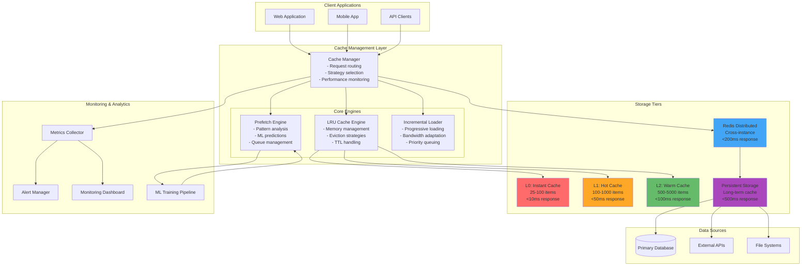
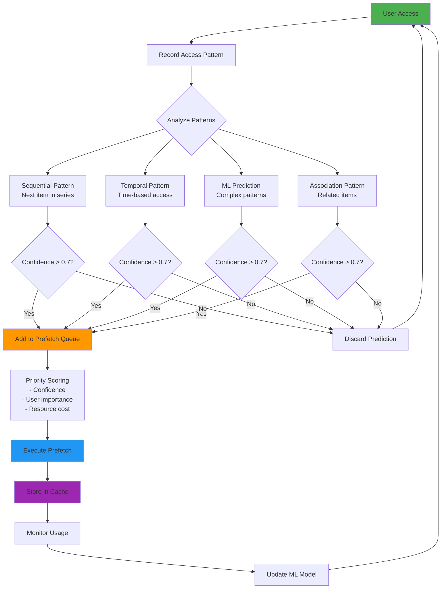
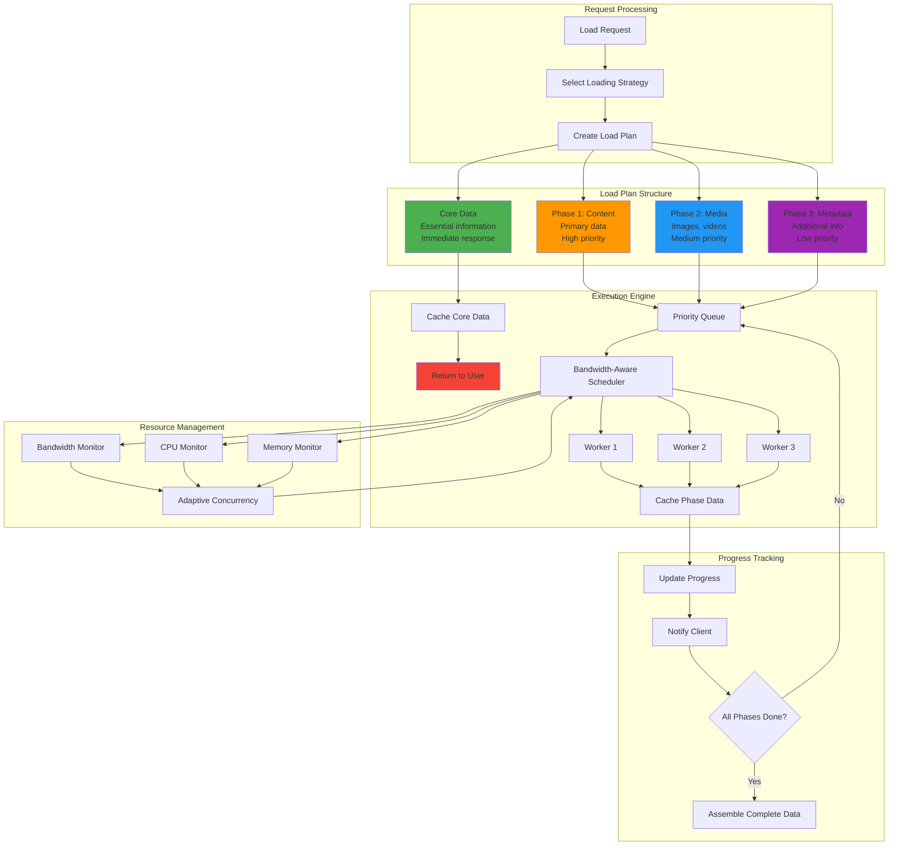
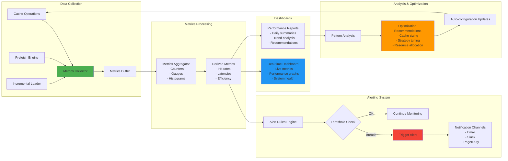
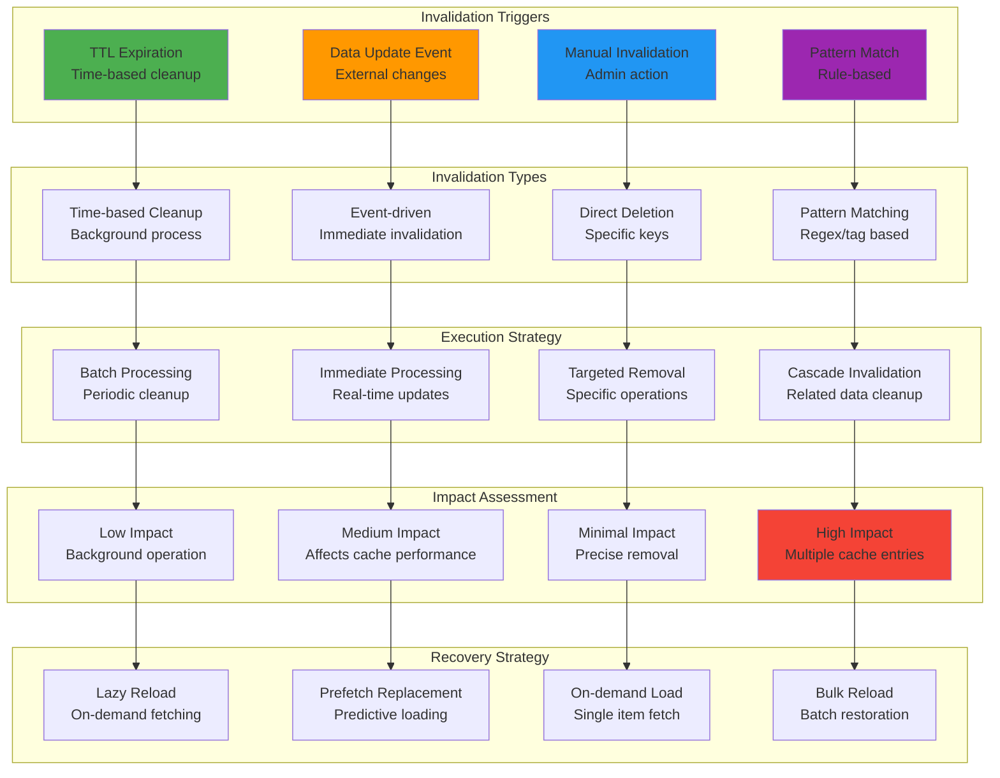
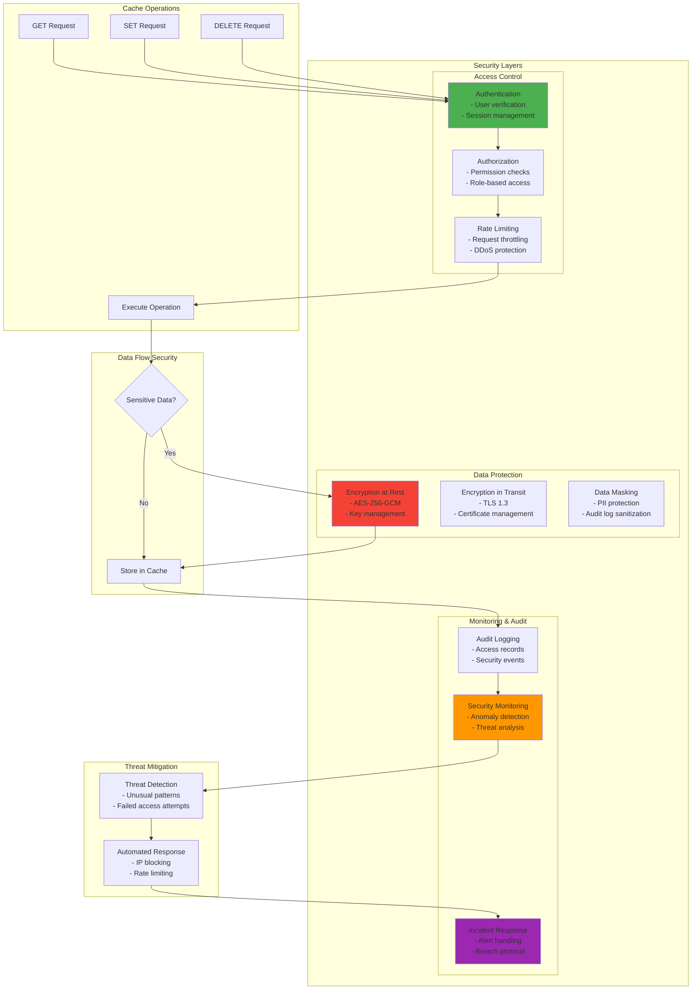
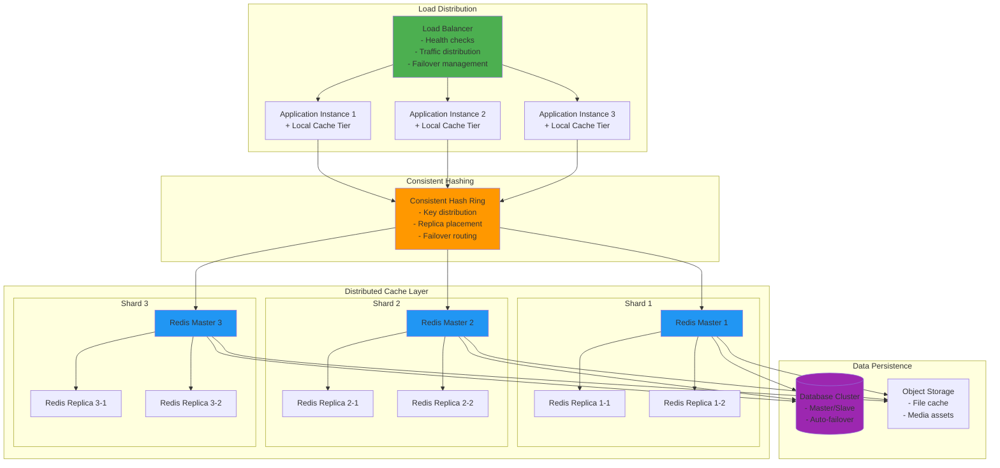
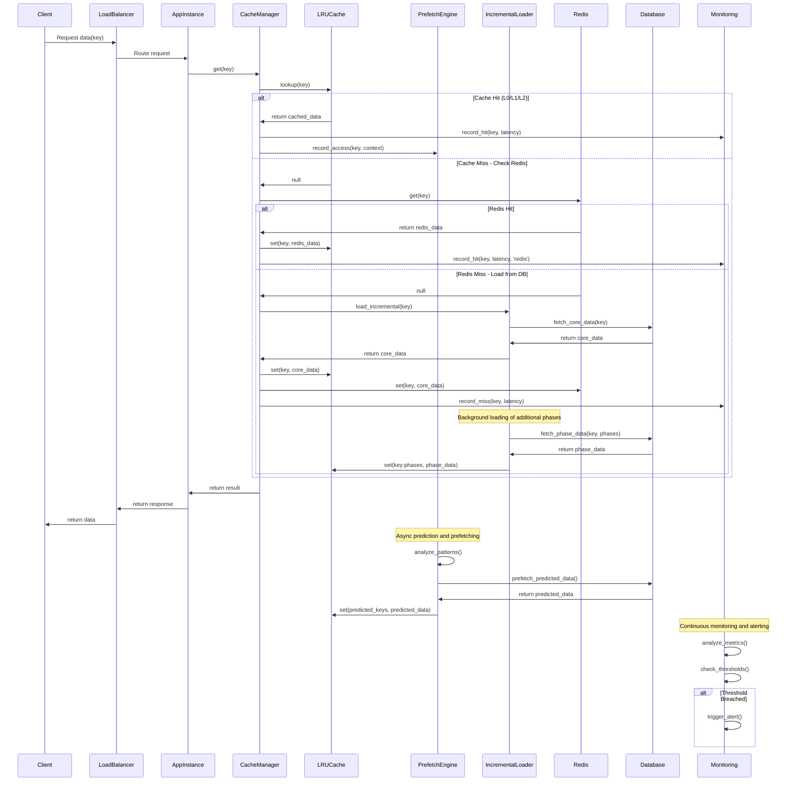
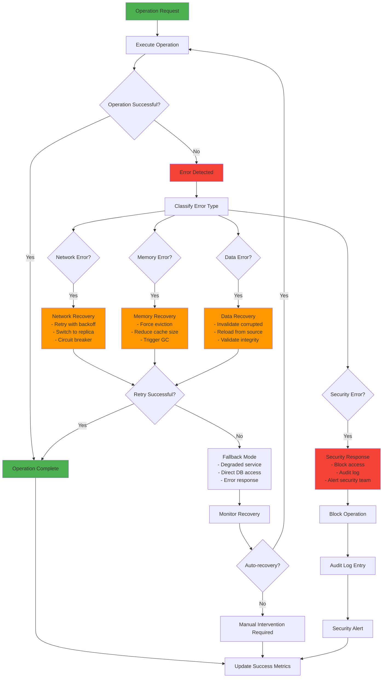

# Cache Architecture Diagrams
## Visual System Architecture Documentation

### 1. High-Level System Architecture



### 2. LRU Cache Internal Structure

```mermaid
graph LR
    subgraph "LRU Cache Implementation"
        HashMap[HashMap<br/>O(1) Lookup]

        subgraph "Doubly Linked List"
            Head[Head Sentinel] --> Node1[Node 1<br/>Most Recent]
            Node1 --> Node2[Node 2]
            Node2 --> Node3[Node 3]
            Node3 --> Tail[Tail Sentinel<br/>Least Recent]

            Tail --> Node3
            Node3 --> Node2
            Node2 --> Node1
            Node1 --> Head
        end

        subgraph "Node Structure"
            NodeData[Node<br/>- key: string<br/>- value: T<br/>- size: number<br/>- accessTime: number<br/>- accessCount: number<br/>- ttl?: number<br/>- tags?: string[]]
        end

        HashMap -.-> Node1
        HashMap -.-> Node2
        HashMap -.-> Node3
    end

    subgraph "Operations"
        Get[GET Operation<br/>1. HashMap lookup<br/>2. Move to head<br/>3. Update stats]
        Set[SET Operation<br/>1. Check capacity<br/>2. Add/update node<br/>3. Evict if needed]
        Evict[EVICTION<br/>1. Select victim<br/>2. Remove from tail<br/>3. Update metrics]
    end

    Get --> HashMap
    Set --> HashMap
    Evict --> Tail

    style Head fill:#4caf50
    style Tail fill:#f44336
    style HashMap fill:#2196f3
```

### 3. Predictive Prefetching Flow



### 4. Incremental Loading Architecture



### 5. Performance Monitoring System



### 6. Cache Invalidation Strategy Flow



### 7. Security Architecture



### 8. Horizontal Scaling Architecture



### 9. Data Flow Sequence - Complete Request Lifecycle



### 10. Error Handling and Recovery Flow



These diagrams provide comprehensive visual documentation of the cache architecture, covering all major components, data flows, and operational scenarios. They can be used for:

1. **Architecture Review** - Understanding system design and component interactions
2. **Implementation Planning** - Guiding development teams during implementation
3. **Operations Training** - Educating operations teams on system behavior
4. **Troubleshooting** - Diagnosing issues using visual flow references
5. **Documentation** - Maintaining up-to-date system documentation

Each diagram uses standard notation and can be rendered using Mermaid.js or similar tools for inclusion in technical documentation, presentations, and wikis.