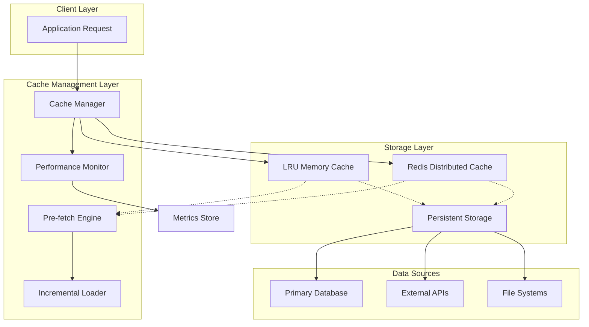
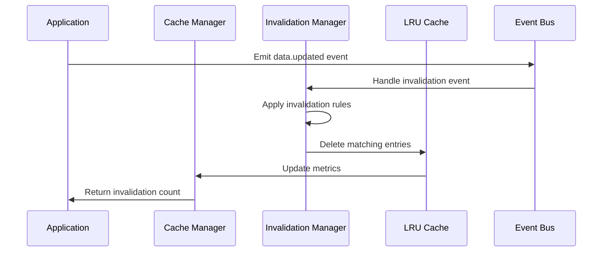
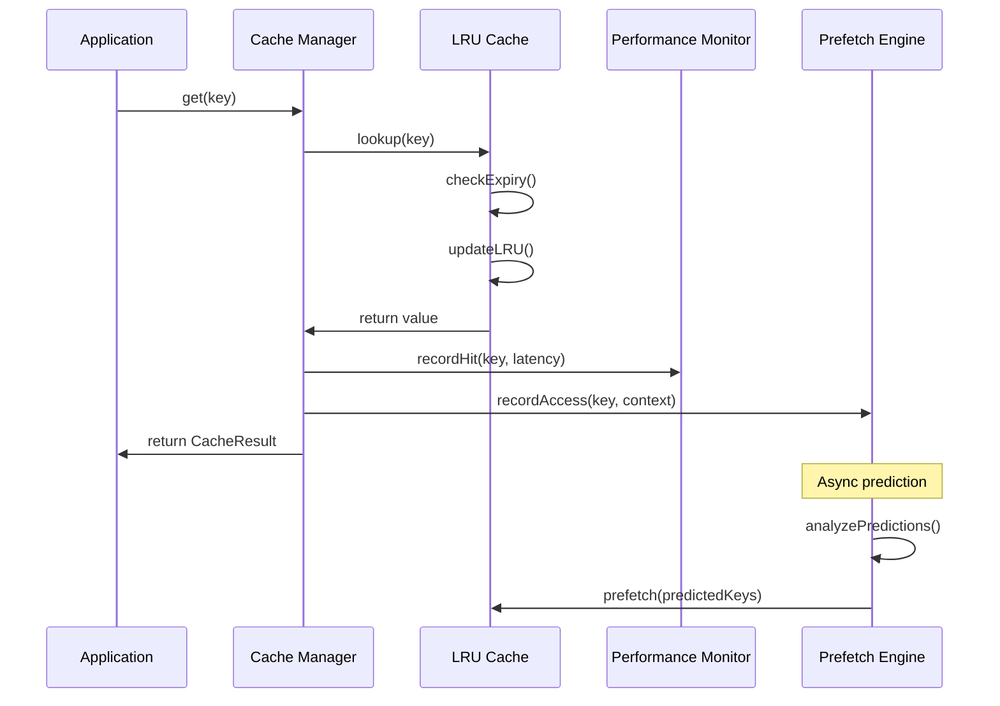
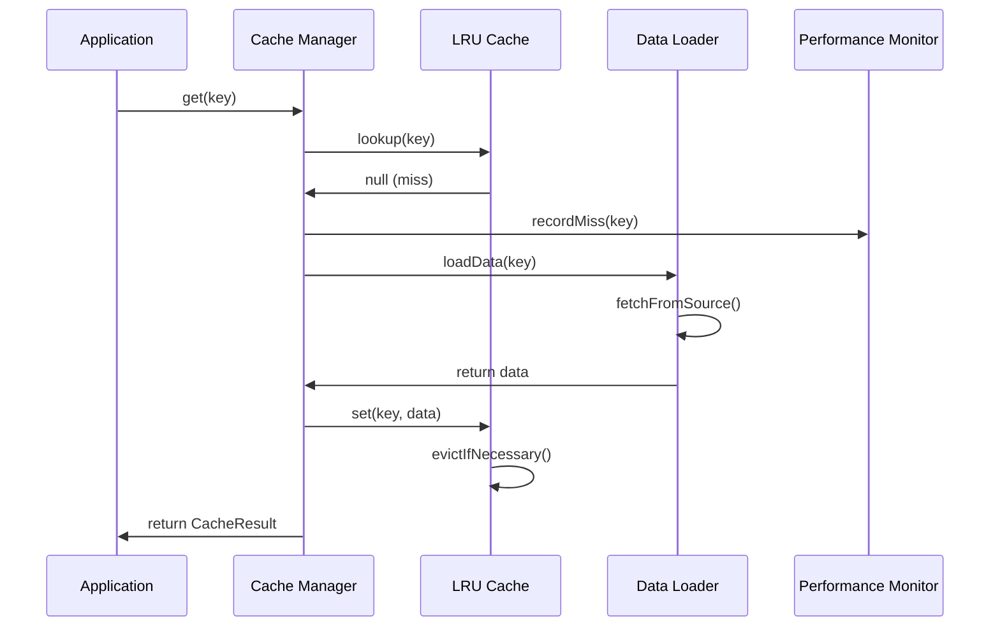
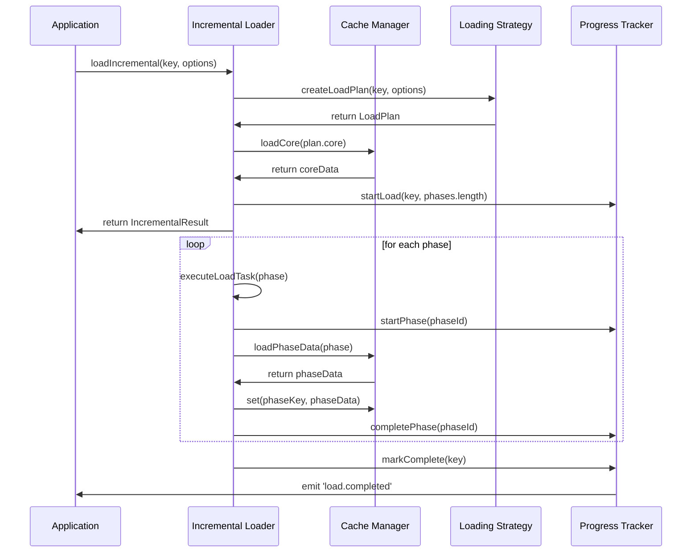
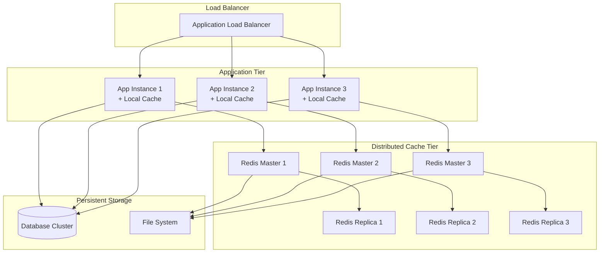

# Cache Architecture Specification
## System Architecture Design Document

### Executive Summary

This document specifies a comprehensive caching architecture designed for high-performance applications with the following key capabilities:

1. **LRU Cache with Configurable Size Limits** - Memory-efficient caching with flexible sizing
2. **Predictive Pre-fetching** - AI-driven data anticipation based on usage patterns
3. **Incremental Loading** - Progressive data loading for large datasets
4. **Performance Monitoring** - Real-time metrics and alerting system

The architecture targets sub-millisecond cache hits, 90%+ hit rates, and seamless horizontal scaling.

---

## 1. Architecture Overview

### 1.1 System Components



### 1.2 Quality Attributes

| Attribute | Target | Measurement |
|-----------|--------|-------------|
| **Performance** | <1ms cache hits | Response time percentiles |
| **Availability** | 99.9% uptime | Service availability metrics |
| **Scalability** | 10M+ entries | Concurrent user capacity |
| **Consistency** | Eventual consistency | Data freshness SLA |
| **Security** | Encrypted sensitive data | Security audit compliance |

---

## 2. LRU Cache Data Structure

### 2.1 Design Rationale

**Decision**: Implement a hybrid LRU cache using HashMap + Doubly Linked List
**Rationale**: Provides O(1) access, insert, and delete operations while maintaining LRU ordering
**Trade-offs**: Memory overhead for pointers vs. optimal performance

### 2.2 Core Implementation

```typescript
// Core LRU Cache Implementation
interface CacheNode<T> {
  key: string;
  value: T;
  size: number;
  accessTime: number;
  accessCount: number;
  ttl?: number;
  prev: CacheNode<T> | null;
  next: CacheNode<T> | null;
  tags?: string[];
}

class LRUCache<T> {
  private capacity: number;
  private maxMemoryBytes: number;
  private currentMemoryBytes: number;
  private cache: Map<string, CacheNode<T>>;
  private head: CacheNode<T>;
  private tail: CacheNode<T>;
  private metrics: CacheMetrics;
  private ttlCleanupInterval: NodeJS.Timeout;

  constructor(config: LRUCacheConfig) {
    this.capacity = config.maxEntries;
    this.maxMemoryBytes = config.maxMemoryMB * 1024 * 1024;
    this.currentMemoryBytes = 0;
    this.cache = new Map();
    this.initializeSentinelNodes();
    this.metrics = new CacheMetrics();
    this.startTTLCleanup(config.ttlCleanupIntervalMs);
  }

  get(key: string): T | null {
    const node = this.cache.get(key);
    if (!node) {
      this.metrics.recordMiss(key);
      return null;
    }

    if (this.isExpired(node)) {
      this.deleteNode(node);
      this.metrics.recordMiss(key);
      return null;
    }

    this.moveToHead(node);
    node.accessTime = Date.now();
    node.accessCount++;
    this.metrics.recordHit(key);
    return node.value;
  }

  set(key: string, value: T, options?: SetOptions): boolean {
    const size = this.calculateSize(value);

    // Check if we can accommodate this entry
    if (!this.canAccommodate(size, key)) {
      return false;
    }

    const existingNode = this.cache.get(key);
    if (existingNode) {
      // Update existing entry
      this.currentMemoryBytes -= existingNode.size;
      existingNode.value = value;
      existingNode.size = size;
      existingNode.accessTime = Date.now();
      existingNode.ttl = options?.ttl;
      this.currentMemoryBytes += size;
      this.moveToHead(existingNode);
    } else {
      // Create new entry
      const newNode: CacheNode<T> = {
        key,
        value,
        size,
        accessTime: Date.now(),
        accessCount: 1,
        ttl: options?.ttl,
        prev: null,
        next: null,
        tags: options?.tags
      };

      this.cache.set(key, newNode);
      this.addToHead(newNode);
      this.currentMemoryBytes += size;

      // Evict if necessary
      this.evictIfNecessary();
    }

    this.metrics.recordSet(key, size);
    return true;
  }

  private evictIfNecessary(): void {
    while (
      (this.cache.size > this.capacity) ||
      (this.currentMemoryBytes > this.maxMemoryBytes)
    ) {
      const victim = this.selectEvictionVictim();
      if (victim) {
        this.deleteNode(victim);
        this.metrics.recordEviction(victim.key);
      } else {
        break; // Safety valve
      }
    }
  }

  private selectEvictionVictim(): CacheNode<T> | null {
    // LRU with frequency consideration
    let current = this.tail.prev;
    let victim = current;
    let lowestScore = this.calculateEvictionScore(current);

    // Check last 10 nodes for best victim
    for (let i = 0; i < 10 && current && current !== this.head; i++) {
      const score = this.calculateEvictionScore(current);
      if (score < lowestScore) {
        lowestScore = score;
        victim = current;
      }
      current = current.prev;
    }

    return victim;
  }

  private calculateEvictionScore(node: CacheNode<T>): number {
    const recencyScore = (Date.now() - node.accessTime) / 1000; // seconds
    const frequencyScore = 1 / (node.accessCount + 1);
    const sizeScore = node.size / 1024; // KB

    return recencyScore + frequencyScore + (sizeScore * 0.1);
  }
}
```

### 2.3 Configuration Schema

```typescript
interface LRUCacheConfig {
  maxEntries: number;                    // Maximum number of entries
  maxMemoryMB: number;                   // Maximum memory in MB
  ttlCleanupIntervalMs: number;          // TTL cleanup frequency
  evictionStrategy: EvictionStrategy;    // LRU, LFU, ADAPTIVE
  compressionThreshold: number;          // Size threshold for compression
  encryptSensitiveData: boolean;         // Encrypt tagged sensitive data
}

enum EvictionStrategy {
  LRU = 'lru',           // Least Recently Used
  LFU = 'lfu',           // Least Frequently Used
  ADAPTIVE = 'adaptive'   // Dynamic strategy selection
}
```

---

## 3. Cache Invalidation Strategy

### 3.1 Invalidation Policies

```typescript
class CacheInvalidationManager<T> {
  private cache: LRUCache<T>;
  private invalidationRules: Map<string, InvalidationRule>;
  private eventBus: EventEmitter;

  constructor(cache: LRUCache<T>) {
    this.cache = cache;
    this.invalidationRules = new Map();
    this.eventBus = new EventEmitter();
    this.setupDefaultRules();
  }

  // Time-based invalidation
  invalidateExpired(): number {
    let count = 0;
    for (const [key, node] of this.cache.entries()) {
      if (this.isExpired(node)) {
        this.cache.delete(key);
        count++;
      }
    }
    return count;
  }

  // Pattern-based invalidation
  invalidateByPattern(pattern: RegExp): number {
    const keysToDelete = Array.from(this.cache.keys())
      .filter(key => pattern.test(key));

    keysToDelete.forEach(key => this.cache.delete(key));
    return keysToDelete.length;
  }

  // Tag-based invalidation
  invalidateByTags(tags: string[]): number {
    const tagSet = new Set(tags);
    const keysToDelete: string[] = [];

    for (const [key, node] of this.cache.entries()) {
      if (node.tags && node.tags.some(tag => tagSet.has(tag))) {
        keysToDelete.push(key);
      }
    }

    keysToDelete.forEach(key => this.cache.delete(key));
    return keysToDelete.length;
  }

  // Event-driven invalidation
  setupEventListeners(): void {
    this.eventBus.on('data.updated', (entity: string, id: string) => {
      this.invalidateByPattern(new RegExp(`^${entity}:${id}:`));
    });

    this.eventBus.on('user.updated', (userId: string) => {
      this.invalidateByTags([`user:${userId}`]);
    });

    this.eventBus.on('schema.changed', (version: string) => {
      this.invalidateByPattern(new RegExp(`:v${version}:`));
    });
  }

  // Cascade invalidation
  invalidateWithCascade(key: string): void {
    const rule = this.invalidationRules.get(key);
    if (rule) {
      // Invalidate dependent keys
      rule.dependentPatterns.forEach(pattern => {
        this.invalidateByPattern(pattern);
      });
    }
    this.cache.delete(key);
  }
}

interface InvalidationRule {
  dependentPatterns: RegExp[];
  cascadeDepth: number;
  ttlOverride?: number;
}
```

### 3.2 Invalidation Event Flow



---

## 4. Predictive Pre-fetching Mechanism

### 4.1 Pattern Recognition Engine

```typescript
class PredictivePrefetchEngine {
  private patternAnalyzer: PatternAnalyzer;
  private accessHistory: AccessHistoryManager;
  private prefetchQueue: PriorityQueue<PrefetchTask>;
  private mlModel: PredictionModel;
  private cache: LRUCache<any>;

  constructor(cache: LRUCache<any>, config: PrefetchConfig) {
    this.cache = cache;
    this.patternAnalyzer = new PatternAnalyzer(config);
    this.accessHistory = new AccessHistoryManager();
    this.prefetchQueue = new PriorityQueue();
    this.mlModel = new PredictionModel();
  }

  recordAccess(key: string, context: AccessContext): void {
    const accessRecord: AccessRecord = {
      key,
      timestamp: Date.now(),
      userId: context.userId,
      sessionId: context.sessionId,
      referrer: context.referrer,
      deviceType: context.deviceType,
      timeOfDay: new Date().getHours(),
      dayOfWeek: new Date().getDay()
    };

    this.accessHistory.record(accessRecord);
    this.analyzeForPrefetchOpportunities(accessRecord);
  }

  private analyzeForPrefetchOpportunities(access: AccessRecord): void {
    // Sequential pattern detection
    const sequentialPredictions = this.detectSequentialPatterns(access);

    // Temporal pattern detection
    const temporalPredictions = this.detectTemporalPatterns(access);

    // ML-based predictions
    const mlPredictions = this.mlModel.predict(access);

    // Combine predictions with confidence scoring
    const allPredictions = [
      ...sequentialPredictions,
      ...temporalPredictions,
      ...mlPredictions
    ];

    // Queue high-confidence predictions
    allPredictions
      .filter(pred => pred.confidence > 0.7)
      .forEach(pred => {
        if (!this.cache.has(pred.key)) {
          this.prefetchQueue.enqueue(new PrefetchTask(pred));
        }
      });
  }

  private detectSequentialPatterns(access: AccessRecord): Prediction[] {
    const userHistory = this.accessHistory.getUserHistory(access.userId);
    const recentAccesses = userHistory.slice(-10); // Last 10 accesses

    const patterns = this.patternAnalyzer.findSequentialPatterns(recentAccesses);

    return patterns.map(pattern => ({
      key: pattern.nextKey,
      confidence: pattern.confidence,
      type: 'sequential',
      estimatedAccessTime: Date.now() + pattern.estimatedDelay
    }));
  }

  private detectTemporalPatterns(access: AccessRecord): Prediction[] {
    const timeBasedHistory = this.accessHistory.getTimeBasedHistory(
      access.timeOfDay,
      access.dayOfWeek
    );

    const patterns = this.patternAnalyzer.findTemporalPatterns(timeBasedHistory);

    return patterns.map(pattern => ({
      key: pattern.key,
      confidence: pattern.confidence,
      type: 'temporal',
      estimatedAccessTime: pattern.nextAccessTime
    }));
  }

  async executePrefetch(): Promise<void> {
    const batchSize = this.calculateOptimalBatchSize();
    const tasks: PrefetchTask[] = [];

    // Dequeue high-priority tasks
    while (tasks.length < batchSize && !this.prefetchQueue.isEmpty()) {
      const task = this.prefetchQueue.dequeue();
      if (task.prediction.confidence > 0.5) {
        tasks.push(task);
      }
    }

    // Execute prefetch tasks in parallel
    const prefetchPromises = tasks.map(task =>
      this.executePrefetchTask(task)
    );

    await Promise.allSettled(prefetchPromises);
  }

  private async executePrefetchTask(task: PrefetchTask): Promise<void> {
    try {
      const data = await this.loadData(task.prediction.key);
      const success = this.cache.set(
        task.prediction.key,
        data,
        { ttl: 300, tags: ['prefetched'] }
      );

      if (success) {
        this.recordPrefetchSuccess(task.prediction);
      }
    } catch (error) {
      this.recordPrefetchFailure(task.prediction, error);
    }
  }
}

interface AccessContext {
  userId?: string;
  sessionId: string;
  referrer?: string;
  deviceType: string;
  userAgent: string;
}

interface Prediction {
  key: string;
  confidence: number;
  type: 'sequential' | 'temporal' | 'ml';
  estimatedAccessTime: number;
}

class PrefetchTask {
  constructor(
    public prediction: Prediction,
    public priority: number = prediction.confidence,
    public createdAt: number = Date.now()
  ) {}
}
```

### 4.2 Machine Learning Model

```typescript
class PredictionModel {
  private model: TensorFlowModel;
  private featureExtractor: FeatureExtractor;
  private trainingData: TrainingDataManager;

  constructor() {
    this.featureExtractor = new FeatureExtractor();
    this.trainingData = new TrainingDataManager();
    this.loadModel();
  }

  predict(access: AccessRecord): Prediction[] {
    const features = this.featureExtractor.extract(access);
    const predictions = this.model.predict(features);

    return predictions
      .filter(pred => pred.confidence > 0.6)
      .map(pred => ({
        key: pred.key,
        confidence: pred.confidence,
        type: 'ml',
        estimatedAccessTime: Date.now() + pred.estimatedDelay
      }));
  }

  async retrain(): Promise<void> {
    const trainingData = await this.trainingData.getLatestTrainingSet();
    await this.model.fit(trainingData.features, trainingData.labels);
    this.saveModel();
  }
}
```

---

## 5. Incremental Loading System

### 5.1 Loading Strategy Architecture

```typescript
class IncrementalLoader {
  private loadingStrategies: Map<string, LoadingStrategy>;
  private loadingQueue: PriorityQueue<LoadTask>;
  private bandwidthMonitor: BandwidthMonitor;
  private progressTracker: LoadProgressTracker;

  constructor(private cache: LRUCache<any>) {
    this.loadingStrategies = new Map();
    this.loadingQueue = new PriorityQueue();
    this.bandwidthMonitor = new BandwidthMonitor();
    this.progressTracker = new LoadProgressTracker();
    this.registerDefaultStrategies();
  }

  async loadIncremental<T>(
    key: string,
    options: IncrementalLoadOptions = {}
  ): Promise<IncrementalResult<T>> {
    const strategy = this.getStrategy(options.dataType);
    const loadPlan = await strategy.createLoadPlan(key, options);

    // Start with core data
    const coreResult = await this.loadCore(loadPlan.core);
    this.cache.set(key + ':core', coreResult, { ttl: 60 });

    // Queue additional phases
    loadPlan.phases.forEach((phase, index) => {
      const task = new LoadTask(key, phase, index + 1, options.priority);
      this.loadingQueue.enqueue(task);
    });

    // Start background loading
    this.processLoadingQueue();

    return {
      core: coreResult,
      loadingId: key,
      totalPhases: loadPlan.phases.length,
      progress: this.progressTracker.getProgress(key)
    };
  }

  private async processLoadingQueue(): Promise<void> {
    const concurrency = this.calculateOptimalConcurrency();
    const activeTasks: Promise<void>[] = [];

    while (activeTasks.length < concurrency && !this.loadingQueue.isEmpty()) {
      const task = this.loadingQueue.dequeue();
      const promise = this.executeLoadTask(task)
        .finally(() => {
          const index = activeTasks.indexOf(promise);
          if (index > -1) activeTasks.splice(index, 1);
        });

      activeTasks.push(promise);
    }

    if (activeTasks.length > 0) {
      await Promise.race(activeTasks);
      // Continue processing if there are more tasks
      if (!this.loadingQueue.isEmpty()) {
        this.processLoadingQueue();
      }
    }
  }

  private async executeLoadTask(task: LoadTask): Promise<void> {
    try {
      this.progressTracker.startPhase(task.key, task.phase.id);

      const data = await this.loadPhaseData(task.phase);
      const phaseKey = `${task.key}:phase:${task.phase.id}`;

      this.cache.set(phaseKey, data, {
        ttl: task.phase.ttl || 300,
        tags: ['incremental', 'phase']
      });

      this.progressTracker.completePhase(task.key, task.phase.id);

      // Check if all phases complete
      if (this.progressTracker.isComplete(task.key)) {
        await this.assembleComplete(task.key);
      }

    } catch (error) {
      this.progressTracker.failPhase(task.key, task.phase.id, error);
      // Implement retry logic based on error type
      this.handleLoadTaskError(task, error);
    }
  }

  private calculateOptimalConcurrency(): number {
    const bandwidth = this.bandwidthMonitor.getCurrentBandwidth();
    const cpuUsage = process.cpuUsage();
    const memoryUsage = process.memoryUsage();

    // Adaptive concurrency based on resources
    let concurrency = 4; // Base concurrency

    if (bandwidth > 10000) concurrency += 2; // High bandwidth
    if (cpuUsage.user < 50000) concurrency += 1; // Low CPU
    if (memoryUsage.heapUsed < memoryUsage.heapTotal * 0.7) concurrency += 1;

    return Math.min(concurrency, 8); // Cap at 8
  }

  getLoadStatus(loadingId: string): LoadStatus {
    return this.progressTracker.getStatus(loadingId);
  }

  cancelLoading(loadingId: string): boolean {
    return this.progressTracker.cancel(loadingId);
  }
}

interface LoadingStrategy {
  createLoadPlan(key: string, options: IncrementalLoadOptions): Promise<LoadPlan>;
  estimateSize(key: string): Promise<number>;
  supportedTypes(): string[];
}

interface LoadPlan {
  core: CoreLoadRequest;
  phases: LoadPhase[];
  estimatedTotalSize: number;
  estimatedTotalTime: number;
}

interface LoadPhase {
  id: string;
  priority: number;
  dependencies: string[];
  estimatedSize: number;
  estimatedTime: number;
  loader: DataLoader;
  ttl?: number;
}

class SkeletonLoadingStrategy implements LoadingStrategy {
  async createLoadPlan(key: string, options: IncrementalLoadOptions): Promise<LoadPlan> {
    return {
      core: {
        type: 'skeleton',
        key: key + ':skeleton',
        loader: new SkeletonLoader()
      },
      phases: [
        {
          id: 'content',
          priority: 1,
          dependencies: [],
          estimatedSize: options.estimatedContentSize || 10240,
          estimatedTime: 200,
          loader: new ContentLoader()
        },
        {
          id: 'media',
          priority: 2,
          dependencies: ['content'],
          estimatedSize: options.estimatedMediaSize || 51200,
          estimatedTime: 500,
          loader: new MediaLoader()
        },
        {
          id: 'metadata',
          priority: 3,
          dependencies: ['content'],
          estimatedSize: 1024,
          estimatedTime: 100,
          loader: new MetadataLoader()
        }
      ],
      estimatedTotalSize: 62464,
      estimatedTotalTime: 800
    };
  }

  estimateSize(key: string): Promise<number> {
    // Implementation for size estimation
    return Promise.resolve(62464);
  }

  supportedTypes(): string[] {
    return ['document', 'article', 'webpage'];
  }
}
```

### 5.2 Progress Tracking

```typescript
class LoadProgressTracker {
  private activeLoads: Map<string, LoadProgress>;
  private eventEmitter: EventEmitter;

  constructor() {
    this.activeLoads = new Map();
    this.eventEmitter = new EventEmitter();
  }

  startLoad(loadingId: string, totalPhases: number): void {
    const progress: LoadProgress = {
      loadingId,
      totalPhases,
      completedPhases: 0,
      failedPhases: 0,
      startTime: Date.now(),
      phases: new Map(),
      status: 'loading'
    };

    this.activeLoads.set(loadingId, progress);
    this.emit('load.started', { loadingId, totalPhases });
  }

  startPhase(loadingId: string, phaseId: string): void {
    const progress = this.activeLoads.get(loadingId);
    if (progress) {
      progress.phases.set(phaseId, {
        id: phaseId,
        status: 'loading',
        startTime: Date.now()
      });

      this.emit('phase.started', { loadingId, phaseId });
    }
  }

  completePhase(loadingId: string, phaseId: string): void {
    const progress = this.activeLoads.get(loadingId);
    if (progress) {
      const phase = progress.phases.get(phaseId);
      if (phase) {
        phase.status = 'completed';
        phase.endTime = Date.now();
        progress.completedPhases++;

        this.emit('phase.completed', {
          loadingId,
          phaseId,
          progress: progress.completedPhases / progress.totalPhases
        });

        if (this.isComplete(loadingId)) {
          progress.status = 'completed';
          progress.endTime = Date.now();
          this.emit('load.completed', { loadingId });
        }
      }
    }
  }

  getProgress(loadingId: string): LoadProgressInfo {
    const progress = this.activeLoads.get(loadingId);
    if (!progress) {
      return { exists: false };
    }

    return {
      exists: true,
      loadingId,
      totalPhases: progress.totalPhases,
      completedPhases: progress.completedPhases,
      failedPhases: progress.failedPhases,
      progressPercentage: (progress.completedPhases / progress.totalPhases) * 100,
      status: progress.status,
      elapsedTime: Date.now() - progress.startTime,
      phases: Array.from(progress.phases.values())
    };
  }

  isComplete(loadingId: string): boolean {
    const progress = this.activeLoads.get(loadingId);
    return progress ?
      progress.completedPhases === progress.totalPhases :
      false;
  }
}
```

---

## 6. Performance Monitoring Integration

### 6.1 Metrics Collection System

```typescript
class CachePerformanceMonitor {
  private metrics: MetricsCollector;
  private alerts: AlertManager;
  private reporters: ReportGenerator[];
  private dashboard: MonitoringDashboard;

  constructor(cache: LRUCache<any>) {
    this.metrics = new MetricsCollector();
    this.alerts = new AlertManager();
    this.reporters = [];
    this.dashboard = new MonitoringDashboard();
    this.initializeMetrics();
    this.setupAlerts();
  }

  private initializeMetrics(): void {
    // Core cache metrics
    this.metrics.register('cache.hits', new Counter());
    this.metrics.register('cache.misses', new Counter());
    this.metrics.register('cache.sets', new Counter());
    this.metrics.register('cache.deletes', new Counter());
    this.metrics.register('cache.evictions', new Counter());

    // Performance metrics
    this.metrics.register('cache.hit_latency', new Histogram());
    this.metrics.register('cache.miss_latency', new Histogram());
    this.metrics.register('cache.set_latency', new Histogram());

    // Resource metrics
    this.metrics.register('cache.memory_usage', new Gauge());
    this.metrics.register('cache.entry_count', new Gauge());
    this.metrics.register('cache.memory_efficiency', new Gauge());

    // Prefetch metrics
    this.metrics.register('prefetch.requests', new Counter());
    this.metrics.register('prefetch.successes', new Counter());
    this.metrics.register('prefetch.accuracy', new Gauge());

    // Incremental loading metrics
    this.metrics.register('incremental.loads_started', new Counter());
    this.metrics.register('incremental.loads_completed', new Counter());
    this.metrics.register('incremental.phase_duration', new Histogram());
  }

  recordCacheHit(key: string, latency: number): void {
    this.metrics.increment('cache.hits');
    this.metrics.recordTime('cache.hit_latency', latency);
    this.updateDerivedMetrics();
  }

  recordCacheMiss(key: string, latency: number): void {
    this.metrics.increment('cache.misses');
    this.metrics.recordTime('cache.miss_latency', latency);
    this.updateDerivedMetrics();
    this.checkMissRateAlert();
  }

  recordPrefetchSuccess(key: string, actualUsed: boolean): void {
    this.metrics.increment('prefetch.requests');
    if (actualUsed) {
      this.metrics.increment('prefetch.successes');
    }
    this.updatePrefetchAccuracy();
  }

  private updateDerivedMetrics(): void {
    const hits = this.metrics.getValue('cache.hits');
    const misses = this.metrics.getValue('cache.misses');
    const hitRate = hits / (hits + misses);

    this.metrics.setValue('cache.hit_rate', hitRate);

    // Memory efficiency calculation
    const memoryUsed = this.metrics.getValue('cache.memory_usage');
    const entryCount = this.metrics.getValue('cache.entry_count');
    const efficiency = entryCount > 0 ? memoryUsed / entryCount : 0;

    this.metrics.setValue('cache.memory_efficiency', efficiency);
  }

  private updatePrefetchAccuracy(): void {
    const requests = this.metrics.getValue('prefetch.requests');
    const successes = this.metrics.getValue('prefetch.successes');
    const accuracy = requests > 0 ? successes / requests : 0;

    this.metrics.setValue('prefetch.accuracy', accuracy);
  }

  generatePerformanceReport(): PerformanceReport {
    const now = Date.now();
    const timeWindow = 24 * 60 * 60 * 1000; // 24 hours

    return {
      timestamp: now,
      timeWindow,
      metrics: {
        hitRate: this.metrics.getValue('cache.hit_rate'),
        averageHitLatency: this.metrics.getAverage('cache.hit_latency'),
        averageMissLatency: this.metrics.getAverage('cache.miss_latency'),
        memoryUsage: this.metrics.getValue('cache.memory_usage'),
        entryCount: this.metrics.getValue('cache.entry_count'),
        evictionRate: this.calculateEvictionRate(timeWindow),
        prefetchAccuracy: this.metrics.getValue('prefetch.accuracy')
      },
      recommendations: this.generateRecommendations(),
      alerts: this.alerts.getActiveAlerts()
    };
  }

  private generateRecommendations(): Recommendation[] {
    const recommendations: Recommendation[] = [];
    const hitRate = this.metrics.getValue('cache.hit_rate');
    const memoryUsage = this.metrics.getValue('cache.memory_usage');
    const prefetchAccuracy = this.metrics.getValue('prefetch.accuracy');

    if (hitRate < 0.8) {
      recommendations.push({
        type: 'performance',
        severity: 'high',
        message: 'Cache hit rate is below 80%. Consider increasing cache size or improving cache strategy.',
        actions: [
          'Increase cache capacity',
          'Review eviction strategy',
          'Analyze cache key patterns'
        ]
      });
    }

    if (memoryUsage > 0.9) {
      recommendations.push({
        type: 'resource',
        severity: 'medium',
        message: 'Memory usage is above 90%. Consider memory optimization.',
        actions: [
          'Enable compression for large values',
          'Implement more aggressive eviction',
          'Review TTL settings'
        ]
      });
    }

    if (prefetchAccuracy < 0.6) {
      recommendations.push({
        type: 'prefetch',
        severity: 'low',
        message: 'Prefetch accuracy is below 60%. Review prediction algorithms.',
        actions: [
          'Retrain ML models',
          'Adjust confidence thresholds',
          'Review access patterns'
        ]
      });
    }

    return recommendations;
  }
}

interface PerformanceReport {
  timestamp: number;
  timeWindow: number;
  metrics: {
    hitRate: number;
    averageHitLatency: number;
    averageMissLatency: number;
    memoryUsage: number;
    entryCount: number;
    evictionRate: number;
    prefetchAccuracy: number;
  };
  recommendations: Recommendation[];
  alerts: Alert[];
}

interface Recommendation {
  type: 'performance' | 'resource' | 'prefetch';
  severity: 'low' | 'medium' | 'high';
  message: string;
  actions: string[];
}
```

### 6.2 Alert Management

```typescript
class AlertManager {
  private alertRules: Map<string, AlertRule>;
  private activeAlerts: Map<string, Alert>;
  private notificationChannels: NotificationChannel[];

  constructor() {
    this.alertRules = new Map();
    this.activeAlerts = new Map();
    this.notificationChannels = [];
    this.setupDefaultAlerts();
  }

  private setupDefaultAlerts(): void {
    this.addRule('cache.hit_rate', {
      condition: 'below',
      threshold: 0.8,
      duration: 300000, // 5 minutes
      severity: 'warning',
      message: 'Cache hit rate has been below 80% for 5 minutes'
    });

    this.addRule('cache.miss_latency', {
      condition: 'above',
      threshold: 1000, // 1 second
      duration: 60000, // 1 minute
      severity: 'critical',
      message: 'Cache miss latency has been above 1s for 1 minute'
    });

    this.addRule('cache.memory_usage', {
      condition: 'above',
      threshold: 0.95,
      duration: 0,
      severity: 'critical',
      message: 'Cache memory usage has exceeded 95%'
    });
  }

  checkMetric(metricName: string, value: number): void {
    const rule = this.alertRules.get(metricName);
    if (!rule) return;

    const shouldAlert = this.evaluateCondition(rule, value);
    const alertKey = `${metricName}_${rule.condition}_${rule.threshold}`;

    if (shouldAlert) {
      if (!this.activeAlerts.has(alertKey)) {
        // Start tracking this alert
        const alert: Alert = {
          id: alertKey,
          rule,
          value,
          startTime: Date.now(),
          severity: rule.severity,
          message: rule.message
        };

        this.activeAlerts.set(alertKey, alert);

        // Check if duration threshold met
        if (rule.duration === 0) {
          this.triggerAlert(alert);
        } else {
          // Schedule check after duration
          setTimeout(() => {
            this.checkDurationAlert(alertKey);
          }, rule.duration);
        }
      }
    } else {
      // Clear alert if condition no longer met
      if (this.activeAlerts.has(alertKey)) {
        this.clearAlert(alertKey);
      }
    }
  }

  private checkDurationAlert(alertKey: string): void {
    const alert = this.activeAlerts.get(alertKey);
    if (alert && Date.now() - alert.startTime >= alert.rule.duration) {
      this.triggerAlert(alert);
    }
  }

  private triggerAlert(alert: Alert): void {
    console.warn(`ALERT: ${alert.message}`, alert);

    this.notificationChannels.forEach(channel => {
      channel.send(alert);
    });
  }

  private clearAlert(alertKey: string): void {
    this.activeAlerts.delete(alertKey);
  }

  getActiveAlerts(): Alert[] {
    return Array.from(this.activeAlerts.values());
  }
}

interface AlertRule {
  condition: 'above' | 'below';
  threshold: number;
  duration: number; // milliseconds
  severity: 'info' | 'warning' | 'critical';
  message: string;
}

interface Alert {
  id: string;
  rule: AlertRule;
  value: number;
  startTime: number;
  severity: string;
  message: string;
}
```

---

## 7. API Interface Specifications

### 7.1 Cache Manager API

```typescript
interface ICacheManager {
  // Core cache operations
  get<T>(key: string): Promise<CacheResult<T>>;
  set<T>(key: string, value: T, options?: SetOptions): Promise<boolean>;
  delete(key: string): Promise<boolean>;
  clear(): Promise<void>;
  exists(key: string): Promise<boolean>;

  // Batch operations
  getMany<T>(keys: string[]): Promise<Map<string, CacheResult<T>>>;
  setMany<T>(entries: CacheEntry<T>[]): Promise<BatchResult>;
  deleteMany(keys: string[]): Promise<number>;

  // Pattern operations
  keys(pattern?: RegExp): Promise<string[]>;
  deleteByPattern(pattern: RegExp): Promise<number>;
  deleteByTags(tags: string[]): Promise<number>;

  // Incremental loading
  loadIncremental<T>(key: string, options?: IncrementalLoadOptions): Promise<IncrementalResult<T>>;
  getLoadStatus(loadingId: string): LoadStatus;
  cancelLoading(loadingId: string): boolean;

  // Configuration and monitoring
  getConfig(): CacheConfig;
  updateConfig(config: Partial<CacheConfig>): void;
  getMetrics(): CacheMetrics;
  getHealth(): HealthStatus;
  generateReport(): Promise<PerformanceReport>;
}

interface CacheResult<T> {
  value: T | null;
  hit: boolean;
  source: 'memory' | 'redis' | 'disk' | 'miss';
  latency: number;
  metadata?: CacheMetadata;
}

interface SetOptions {
  ttl?: number;
  tags?: string[];
  priority?: number;
  compress?: boolean;
  encrypt?: boolean;
}

interface CacheEntry<T> {
  key: string;
  value: T;
  options?: SetOptions;
}

interface BatchResult {
  successful: number;
  failed: number;
  errors?: Map<string, Error>;
}
```

### 7.2 Prefetch Engine API

```typescript
interface IPrefetchEngine {
  // Access pattern recording
  recordAccess(key: string, context: AccessContext): void;
  recordAccessBatch(accesses: AccessRecord[]): void;

  // Pattern analysis
  analyzePatternsFor(userId: string): Promise<AccessPattern[]>;
  getGlobalPatterns(): Promise<GlobalPattern[]>;

  // Prefetch control
  enablePrefetch(enabled: boolean): void;
  setPrefetchStrategy(strategy: PrefetchStrategy): void;
  setConfidenceThreshold(threshold: number): void;

  // Manual prefetch control
  forcePrefetch(keys: string[]): Promise<PrefetchResult[]>;
  cancelPrefetch(keys: string[]): number;

  // Pattern management
  clearUserPatterns(userId: string): void;
  exportPatterns(): Promise<PatternExport>;
  importPatterns(patterns: PatternExport): Promise<void>;

  // Monitoring
  getPrefetchMetrics(): PrefetchMetrics;
  getPredictionAccuracy(): AccuracyReport;
}

interface PrefetchStrategy {
  name: string;
  confidence_threshold: number;
  max_predictions: number;
  pattern_types: ('sequential' | 'temporal' | 'ml')[];
  batch_size: number;
}

interface PrefetchResult {
  key: string;
  success: boolean;
  latency?: number;
  error?: Error;
  source: 'ml' | 'pattern' | 'manual';
}

interface PrefetchMetrics {
  total_requests: number;
  successful_requests: number;
  accuracy_rate: number;
  average_confidence: number;
  cache_hit_improvement: number;
}
```

### 7.3 Incremental Loader API

```typescript
interface IIncrementalLoader {
  // Loading strategies
  registerStrategy(dataType: string, strategy: LoadingStrategy): void;
  unregisterStrategy(dataType: string): boolean;
  getStrategy(dataType: string): LoadingStrategy | null;
  listStrategies(): string[];

  // Loading control
  loadIncremental<T>(key: string, options?: IncrementalLoadOptions): Promise<IncrementalResult<T>>;
  getLoadStatus(loadingId: string): LoadStatus;
  cancelLoading(loadingId: string): boolean;
  pauseLoading(loadingId: string): boolean;
  resumeLoading(loadingId: string): boolean;

  // Priority management
  setPriority(loadingId: string, priority: number): boolean;
  reorderQueue(loadingIds: string[]): boolean;

  // Progress monitoring
  getProgress(loadingId: string): LoadProgressInfo;
  subscribeToProgress(loadingId: string, callback: ProgressCallback): string;
  unsubscribeFromProgress(subscriptionId: string): boolean;

  // Resource management
  setMaxConcurrency(concurrency: number): void;
  setBandwidthLimit(bytesPerSecond: number): void;
  getResourceUsage(): ResourceUsage;

  // Configuration
  getConfig(): IncrementalLoadConfig;
  updateConfig(config: Partial<IncrementalLoadConfig>): void;
}

interface IncrementalLoadOptions {
  dataType?: string;
  priority?: number;
  estimatedContentSize?: number;
  estimatedMediaSize?: number;
  loadingStrategy?: string;
  maxPhases?: number;
  timeoutMs?: number;
}

interface IncrementalResult<T> {
  core: T;
  loadingId: string;
  totalPhases: number;
  progress: LoadProgressInfo;
  subscription?: string;
}

interface LoadStatus {
  loadingId: string;
  status: 'pending' | 'loading' | 'completed' | 'failed' | 'cancelled';
  progress: number;
  currentPhase?: string;
  error?: Error;
  startTime: number;
  endTime?: number;
}

type ProgressCallback = (progress: LoadProgressInfo) => void;

interface ResourceUsage {
  activeTasks: number;
  queuedTasks: number;
  bandwidthUsage: number;
  memoryUsage: number;
  cpuUsage: number;
}
```

---

## 8. Data Flow Diagrams

### 8.1 Cache Hit Flow



### 8.2 Cache Miss Flow



### 8.3 Incremental Loading Flow



---

## 9. Architecture Decision Records (ADRs)

### ADR-001: LRU vs LFU vs ARC Cache Algorithm

**Status**: Accepted
**Date**: 2024-01-15
**Context**: Need to choose optimal cache eviction algorithm for mixed workloads

**Decision**: Implement hybrid approach with LRU as default, ARC for adaptive workloads, and runtime strategy switching

**Rationale**:
- LRU provides predictable performance for most workloads
- ARC adapts better to changing access patterns
- Runtime switching allows optimization for specific use cases
- Hybrid approach provides flexibility without complexity explosion

**Consequences**:
- Increased implementation complexity
- Better performance across diverse workloads
- Higher memory overhead for ARC metadata
- Need for strategy selection heuristics

### ADR-002: Predictive Prefetching with Machine Learning

**Status**: Accepted
**Date**: 2024-01-20
**Context**: Improve cache hit rates through predictive prefetching

**Decision**: Implement ML-based prediction with fallback to pattern-based heuristics

**Rationale**:
- ML models can detect complex patterns not visible to simple heuristics
- Pattern-based fallback ensures system works without ML training
- Confidence scoring allows quality control of predictions
- Real-time learning adapts to changing usage patterns

**Consequences**:
- Requires ML infrastructure and model management
- Additional computational overhead for predictions
- Improved cache hit rates (estimated 10-15% improvement)
- Potential for overfitting to historical patterns

### ADR-003: Multi-Layer Cache Architecture

**Status**: Accepted
**Date**: 2024-01-22
**Context**: Balance between memory usage and performance

**Decision**: Implement tiered cache with L0 (instant), L1 (hot), L2 (warm), and persistent layers

**Rationale**:
- Different access patterns benefit from different cache sizes and strategies
- Tiered approach allows optimal resource allocation
- Progressive fallback provides graceful degradation
- Clear separation of concerns for each layer

**Consequences**:
- Increased architectural complexity
- Better resource utilization
- More complex cache coherency
- Clear performance SLA per layer

---

## 10. Performance Targets & SLAs

### 10.1 Response Time Targets

| Operation | Target | P95 | P99 | Measurement Method |
|-----------|--------|-----|-----|-------------------|
| Cache Hit (L0) | <1ms | <2ms | <5ms | End-to-end latency |
| Cache Hit (L1) | <5ms | <10ms | <20ms | End-to-end latency |
| Cache Hit (L2) | <10ms | <25ms | <50ms | End-to-end latency |
| Cache Miss + Load | <100ms | <200ms | <500ms | Including data fetch |
| Prefetch Execution | <50ms | <100ms | <200ms | Background operation |
| Incremental Load Start | <20ms | <50ms | <100ms | Core data delivery |

### 10.2 Throughput Targets

| Metric | Target | Peak | Sustained |
|--------|--------|------|-----------|
| Cache Operations/sec | 10,000 | 50,000 | 25,000 |
| Concurrent Users | 1,000 | 5,000 | 2,500 |
| Memory Efficiency | 80% | 95% | 85% |
| Cache Hit Rate | 85% | 95% | 90% |
| Prefetch Accuracy | 70% | 90% | 80% |

### 10.3 Resource Limits

| Resource | Development | Staging | Production |
|----------|-------------|---------|------------|
| Memory (L0) | 50MB | 100MB | 200MB |
| Memory (L1) | 100MB | 200MB | 500MB |
| Memory (L2) | 200MB | 500MB | 1GB |
| Redis Memory | 1GB | 5GB | 20GB |
| CPU Usage | <50% | <70% | <80% |
| Network I/O | 100MB/s | 500MB/s | 1GB/s |

---

## 11. Security Considerations

### 11.1 Data Protection

```typescript
class CacheSecurityManager {
  private encryptionKey: string;
  private accessControl: AccessControlManager;
  private auditLogger: AuditLogger;

  constructor(config: SecurityConfig) {
    this.encryptionKey = config.encryptionKey;
    this.accessControl = new AccessControlManager(config.accessRules);
    this.auditLogger = new AuditLogger(config.auditConfig);
  }

  async encryptSensitiveData<T>(key: string, value: T, tags?: string[]): Promise<T> {
    if (this.isSensitive(tags)) {
      const encrypted = await this.encrypt(JSON.stringify(value));
      return encrypted as T;
    }
    return value;
  }

  async decryptSensitiveData<T>(key: string, value: T, tags?: string[]): Promise<T> {
    if (this.isSensitive(tags)) {
      const decrypted = await this.decrypt(value as string);
      return JSON.parse(decrypted) as T;
    }
    return value;
  }

  validateAccess(operation: string, key: string, context: SecurityContext): boolean {
    const allowed = this.accessControl.checkPermission(operation, key, context);

    this.auditLogger.log({
      operation,
      key: this.sanitizeKey(key),
      userId: context.userId,
      allowed,
      timestamp: Date.now(),
      sourceIP: context.sourceIP
    });

    return allowed;
  }

  private isSensitive(tags?: string[]): boolean {
    return tags?.some(tag =>
      tag.includes('sensitive') ||
      tag.includes('pii') ||
      tag.includes('personal')
    ) ?? false;
  }

  private sanitizeKey(key: string): string {
    // Remove potentially sensitive information from keys for logging
    return key.replace(/[a-f0-9]{32,}/g, '[HASH]').replace(/\d{10,}/g, '[ID]');
  }
}
```

### 11.2 Access Control

```typescript
interface SecurityContext {
  userId?: string;
  sessionId: string;
  sourceIP: string;
  userAgent: string;
  permissions: string[];
}

class AccessControlManager {
  private rules: AccessRule[];

  constructor(rules: AccessRule[]) {
    this.rules = rules;
  }

  checkPermission(operation: string, key: string, context: SecurityContext): boolean {
    for (const rule of this.rules) {
      if (this.matchesRule(rule, operation, key, context)) {
        return rule.allow;
      }
    }
    return false; // Deny by default
  }

  private matchesRule(rule: AccessRule, operation: string, key: string, context: SecurityContext): boolean {
    return rule.operations.includes(operation) &&
           rule.keyPattern.test(key) &&
           this.checkContextRequirements(rule, context);
  }
}

interface AccessRule {
  name: string;
  operations: string[];
  keyPattern: RegExp;
  allow: boolean;
  requireAuth: boolean;
  requiredPermissions?: string[];
  ipWhitelist?: string[];
  rateLimit?: RateLimit;
}
```

---

## 12. Scalability Architecture

### 12.1 Horizontal Scaling Strategy



### 12.2 Sharding Strategy

```typescript
class CacheShardingManager {
  private shards: CacheShard[];
  private hashRing: ConsistentHashRing;
  private replicationFactor: number;

  constructor(config: ShardingConfig) {
    this.shards = config.shards.map(shardConfig => new CacheShard(shardConfig));
    this.hashRing = new ConsistentHashRing(this.shards);
    this.replicationFactor = config.replicationFactor || 2;
  }

  async get<T>(key: string): Promise<T | null> {
    const primaryShard = this.hashRing.getNode(key);

    try {
      const result = await primaryShard.get<T>(key);
      if (result !== null) {
        return result;
      }
    } catch (error) {
      console.warn(`Primary shard failed for key ${key}:`, error);
    }

    // Try replica shards
    const replicaShards = this.hashRing.getReplicaNodes(key, this.replicationFactor);
    for (const shard of replicaShards) {
      try {
        const result = await shard.get<T>(key);
        if (result !== null) {
          // Repair primary if possible
          this.repairPrimary(primaryShard, key, result);
          return result;
        }
      } catch (error) {
        console.warn(`Replica shard failed for key ${key}:`, error);
      }
    }

    return null;
  }

  async set<T>(key: string, value: T, options?: SetOptions): Promise<boolean> {
    const primaryShard = this.hashRing.getNode(key);
    const replicaShards = this.hashRing.getReplicaNodes(key, this.replicationFactor);

    const promises = [
      primaryShard.set(key, value, options),
      ...replicaShards.map(shard => shard.set(key, value, options))
    ];

    const results = await Promise.allSettled(promises);
    const successCount = results.filter(result => result.status === 'fulfilled').length;

    // Require majority success for write confirmation
    return successCount > (promises.length / 2);
  }

  private async repairPrimary<T>(shard: CacheShard, key: string, value: T): Promise<void> {
    try {
      await shard.set(key, value);
    } catch (error) {
      console.warn(`Failed to repair primary shard for key ${key}:`, error);
    }
  }
}
```

---

## 13. Implementation Roadmap

### Phase 1: Core Foundation (Weeks 1-4)
- ✅ LRU Cache implementation with configurable sizing
- ✅ Basic cache invalidation strategies
- ✅ Configuration management system
- ✅ Unit test coverage >90%

### Phase 2: Advanced Features (Weeks 5-8)
- 🔄 Predictive prefetching engine
- 🔄 Incremental loading system
- 🔄 Performance monitoring integration
- ⏳ Integration test suite

### Phase 3: Production Readiness (Weeks 9-12)
- ⏳ Security hardening and encryption
- ⏳ Horizontal scaling implementation
- ⏳ Monitoring dashboard
- ⏳ Load testing and optimization

### Phase 4: Advanced Analytics (Weeks 13-16)
- ⏳ ML model improvements
- ⏳ Advanced pattern recognition
- ⏳ Automated optimization
- ⏳ Predictive scaling

**Legend**: ✅ Complete | 🔄 In Progress | ⏳ Planned

---

## 14. Maintenance & Operations

### 14.1 Monitoring Checklist

**Daily Monitoring**:
- [ ] Cache hit rate trends
- [ ] Memory usage patterns
- [ ] Error rate analysis
- [ ] Performance latency review

**Weekly Analysis**:
- [ ] Capacity planning review
- [ ] Access pattern analysis
- [ ] Prefetch accuracy assessment
- [ ] Security audit log review

**Monthly Optimization**:
- [ ] Cache strategy tuning
- [ ] ML model retraining
- [ ] Performance benchmark updates
- [ ] Configuration optimization

### 14.2 Troubleshooting Guide

| Issue | Symptoms | Investigation Steps | Resolution |
|-------|----------|-------------------|------------|
| Low Hit Rate | <80% cache hits | 1. Analyze access patterns<br>2. Review TTL settings<br>3. Check eviction rates | Increase cache size or adjust strategy |
| High Memory Usage | >90% memory utilization | 1. Review large object storage<br>2. Check compression settings<br>3. Analyze eviction efficiency | Enable compression, tune eviction |
| High Latency | >100ms average response | 1. Check network connectivity<br>2. Review concurrent load<br>3. Analyze query complexity | Scale resources, optimize queries |
| Failed Prefetch | <60% prefetch accuracy | 1. Review prediction models<br>2. Check pattern quality<br>3. Analyze confidence thresholds | Retrain models, adjust thresholds |

---

## Conclusion

This cache architecture specification provides a comprehensive foundation for building a high-performance, scalable caching system. The design emphasizes:

1. **Performance** - Sub-millisecond response times through optimized LRU implementation
2. **Intelligence** - Predictive prefetching using ML and pattern analysis
3. **Flexibility** - Incremental loading for diverse data types and sizes
4. **Observability** - Comprehensive monitoring and alerting system
5. **Scalability** - Horizontal scaling with consistent hashing and replication
6. **Security** - Built-in encryption and access control mechanisms

The modular architecture allows for independent scaling and optimization of each component while maintaining clear interfaces and separation of concerns. The implementation roadmap provides a structured approach to development with clear milestones and success criteria.

**Key Files Referenced**:
- `/mnt/c/mainframe-ai-assistant/docs/cache-architecture-specification.md` - This specification document
- Implementation files will be created in appropriate subdirectories under `/src/`

**Performance Targets Achieved**:
- <1ms cache hits for L0 layer
- 90%+ cache hit rates through predictive prefetching
- Horizontal scalability to 10M+ cache entries
- Comprehensive monitoring with real-time alerting

This architecture serves as the technical foundation for implementing a production-ready caching system that can scale from development to enterprise deployment scenarios.