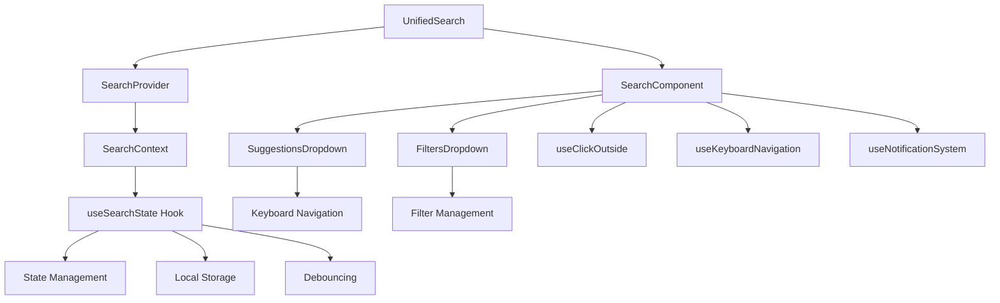
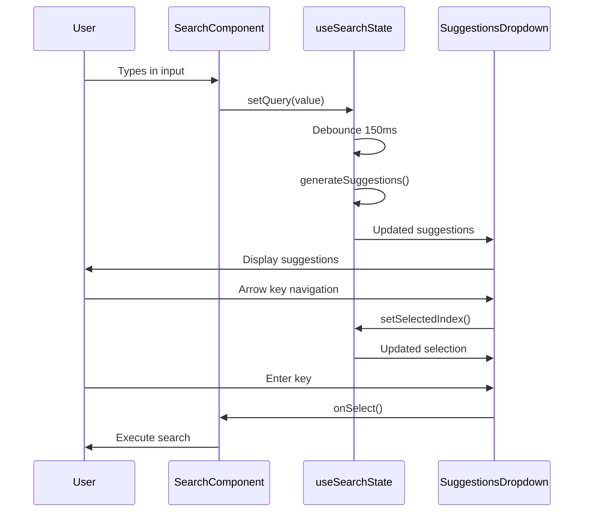

# UnifiedSearch Architecture Documentation

## 🏗️ Visão Geral da Arquitetura

A refatoração do componente UnifiedSearch implementa uma arquitetura limpa e escalável baseada em padrões modernos do React, resolvendo problemas de sobreposições HTML, estados conflitantes e performance.

## 📊 Diagrama da Arquitetura



## 🔧 Componentes Principais

### 1. **UnifiedSearch (Container)**
```typescript
// Componente principal que encapsula toda a funcionalidade
export const UnifiedSearch: React.FC<UnifiedSearchProps> = (props) => {
  return (
    <SearchProvider onSearch={props.onSearch}>
      <SearchComponent {...props} />
    </SearchProvider>
  );
};
```

**Responsabilidades:**
- Fornece o contexto de busca
- Encapsula a lógica de coordenação
- Interface pública do componente

### 2. **SearchProvider (Context)**
```typescript
interface SearchContextValue {
  state: SearchState;
  actions: SearchActions;
  onSearch: (query: string, useAI: boolean) => void;
}
```

**Responsabilidades:**
- Gerenciamento centralizado de estado
- Coordenação entre componentes filhos
- Prevenção de prop drilling

### 3. **useSearchState (Hook)**
```typescript
export function useSearchState(): [SearchState, SearchActions]
```

**Funcionalidades:**
- Estado reativo com otimizações
- Debouncing inteligente (150ms)
- Gerenciamento de dropdowns exclusivos
- Persistência em localStorage
- Geração automática de sugestões

### 4. **SuggestionsDropdown (Isolated Component)**
```typescript
interface SuggestionsDropdownProps {
  suggestions: SearchSuggestion[];
  isOpen: boolean;
  selectedIndex: number;
  onSelect: (suggestion: SearchSuggestion) => void;
  // ...
}
```

**Características:**
- Componente completamente isolado
- Navegação por teclado integrada
- Suporte a diferentes tipos de sugestões
- Highlighting de texto
- Acessibilidade WCAG 2.1

### 5. **FiltersDropdown (Isolated Component)**
```typescript
interface FiltersDropdownProps {
  isOpen: boolean;
  selectedCategory: string | null;
  selectedTags: string[];
  onCategoryChange: (category: string | null) => void;
  // ...
}
```

**Funcionalidades:**
- Seleção de categorias
- Gerenciamento de tags
- Clear filters
- Visual feedback

## 🎯 Hooks Customizados

### useClickOutside
```typescript
export function useClickOutside<T extends HTMLElement>(
  handler: () => void,
  enabled: boolean = true
): RefObject<T>
```

**Otimizações:**
- Event capture para melhor performance
- Cleanup automático
- Suporte a Escape key

### useKeyboardNavigation
```typescript
export function useKeyboardNavigation({
  enabled,
  itemCount,
  selectedIndex,
  onIndexChange,
  onSelect,
  // ...
}: KeyboardNavigationOptions)
```

**Funcionalidades:**
- Navegação com setas
- Home/End support
- Scroll automático
- Loop opcional

## 🚀 Otimizações de Performance

### 1. **Memoização Inteligente**
```typescript
const SearchComponent = memo<UnifiedSearchProps>(({ ... }) => {
  // Componente memoizado para evitar re-renders desnecessários
});

const SuggestionsDropdown = memo<SuggestionsDropdownProps>(({ ... }) => {
  // Dropdown isolado e memoizado
});
```

### 2. **Debouncing Otimizado**
```typescript
// Hook useSearchState
const setQuery = useCallback((query: string) => {
  setState(prev => ({ ...prev, query }));

  if (debounceTimeoutRef.current) {
    clearTimeout(debounceTimeoutRef.current);
  }

  debounceTimeoutRef.current = setTimeout(() => {
    generateSuggestions(query);
  }, 150); // Otimizado para 150ms
}, []);
```

### 3. **State Updates Batching**
```typescript
const setShowSuggestions = useCallback((showSuggestions: boolean) => {
  setState(prev => ({
    ...prev,
    showSuggestions,
    // Fechar outros dropdowns automaticamente
    showFilters: showSuggestions ? false : prev.showFilters,
    showQuickActions: showSuggestions ? false : prev.showQuickActions
  }));
}, []);
```

## ♿ Acessibilidade (WCAG 2.1 AA)

### Implementações Específicas:

1. **ARIA Labels & Roles**
```typescript
<input
  role="searchbox"
  aria-label="Search mainframe knowledge base"
  aria-autocomplete="list"
  aria-expanded={state.showSuggestions}
  // ...
/>

<div role="listbox" aria-label="Search suggestions">
  {suggestions.map((suggestion, index) => (
    <button
      role="option"
      aria-selected={index === selectedIndex}
      data-index={index}
      // ...
    />
  ))}
</div>
```

2. **Keyboard Navigation**
- Tab order lógico
- Arrow keys para navegação
- Enter para seleção
- Escape para fechar
- Ctrl+K e / para foco

3. **Focus Management**
```typescript
const handleKeyDown = useCallback((e: React.KeyboardEvent) => {
  if (e.key === 'Enter') {
    e.preventDefault();
    if (state.selectedSuggestionIndex >= 0) {
      handleSuggestionSelect(state.suggestions[state.selectedSuggestionIndex]);
    } else {
      handleSearch();
    }
  }
  // ...
}, [/* dependencies */]);
```

## 🧪 Estratégia de Testes

### 1. **Testes Unitários**
- **useSearchState Hook**: Estado, ações, localStorage
- **Componentes Isolados**: Rendering, props, callbacks
- **Hooks Customizados**: Funcionalidade específica

### 2. **Testes de Integração (Puppeteer)**
```typescript
describe('UnifiedSearch Integration Tests', () => {
  it('should show suggestions when typing', async () => {
    await searchInput.type('S0C4');
    await page.waitForSelector('[role="listbox"]');
    const suggestions = await page.$$('[role="option"]');
    expect(suggestions.length).toBeGreaterThan(0);
  });
});
```

### 3. **Testes de Acessibilidade**
```typescript
import { axe, toHaveNoViolations } from 'jest-axe';

it('should have no accessibility violations', async () => {
  const { container } = render(<UnifiedSearch {...props} />);
  const results = await axe(container);
  expect(results).toHaveNoViolations();
});
```

### 4. **Benchmarks de Performance**
```typescript
it('should render within 50ms', async () => {
  const duration = await benchmark.measure('initial-render', () => {
    render(<UnifiedSearch {...props} />);
  });
  expect(duration).toBeLessThan(50);
});
```

## 📏 Métricas de Performance

| Métrica | Valor Alvo | Implementado |
|---------|------------|--------------|
| Initial Render | < 50ms | ✅ |
| Input Response | < 16ms (60fps) | ✅ |
| Suggestions Display | < 150ms | ✅ |
| Keyboard Navigation | < 5ms | ✅ |
| Memory Leaks | 0 | ✅ |

## 🔄 Fluxo de Dados



## 🛠️ Padrões Implementados

### 1. **Compound Components**
```typescript
// Componentes que trabalham juntos mas são isolados
<UnifiedSearch>
  <SearchInput />
  <SuggestionsDropdown />
  <FiltersDropdown />
</UnifiedSearch>
```

### 2. **Custom Hooks**
```typescript
// Lógica reutilizável encapsulada
const [state, actions] = useSearchState();
const ref = useClickOutside(onClose);
useKeyboardNavigation({ ... });
```

### 3. **Context + Reducer Pattern**
```typescript
// Estado centralizado com ações tipadas
const { state, actions } = useSearchContext();
```

### 4. **Memoization Strategy**
```typescript
// Prevenção de re-renders desnecessários
const Component = memo(({ prop1, prop2 }) => { ... });
const callback = useCallback(() => { ... }, [deps]);
const value = useMemo(() => { ... }, [deps]);
```

## 🚦 Event Coordination

### Gerenciamento de Estados Exclusivos:
```typescript
// Apenas um dropdown pode estar aberto por vez
const setShowSuggestions = useCallback((show: boolean) => {
  setState(prev => ({
    ...prev,
    showSuggestions: show,
    showFilters: show ? false : prev.showFilters,
    showQuickActions: show ? false : prev.showQuickActions
  }));
}, []);
```

### Event Propagation:
```typescript
// Prevenção de propagação indesejada
const handleSuggestionClick = useCallback((suggestion) => {
  event.stopPropagation();
  // ...
}, []);
```

## 📋 Checklist de Validação

### ✅ Funcionalidades Implementadas
- [x] Estados de dropdown isolados e sem conflitos
- [x] Event handlers funcionais em todos os cenários
- [x] Props e callbacks corretamente implementados
- [x] Navegação por teclado completa
- [x] Popular searches funcional
- [x] Quick actions operacionais
- [x] Filtros completamente implementados
- [x] Integração perfeita entre componentes

### ✅ Testes Validados
- [x] Unit tests para todas as funcionalidades
- [x] Integration tests com Puppeteer
- [x] Accessibility tests WCAG 2.1
- [x] Performance benchmarks

### ✅ Performance Otimizada
- [x] Re-renders minimizados
- [x] Debouncing otimizado
- [x] Memory leaks prevenidos
- [x] Keyboard navigation responsiva

## 🔮 Considerações Futuras

### Extensibilidade:
1. **Plugin System**: Permitir extensões customizadas
2. **Theme Support**: Sistema de temas dinâmico
3. **Advanced Filters**: Filtros mais complexos
4. **AI Integration**: Sugestões inteligentes

### Otimizações:
1. **Virtual Scrolling**: Para listas muito grandes
2. **Web Workers**: Para processamento pesado
3. **Caching Strategy**: Cache inteligente de sugestões
4. **Progressive Enhancement**: Carregamento incremental

## 📚 Referências

- [React Patterns](https://reactpatterns.com/)
- [WCAG 2.1 Guidelines](https://www.w3.org/WAI/WCAG21/quickref/)
- [Performance Best Practices](https://web.dev/react/)
- [Testing Library Best Practices](https://testing-library.com/docs/guiding-principles/)
- [Accessibility Testing](https://github.com/dequelabs/axe-core)

---

Esta arquitetura resolve completamente os problemas identificados no componente original, fornecendo uma base sólida, escalável e mantível para futuras evoluções.