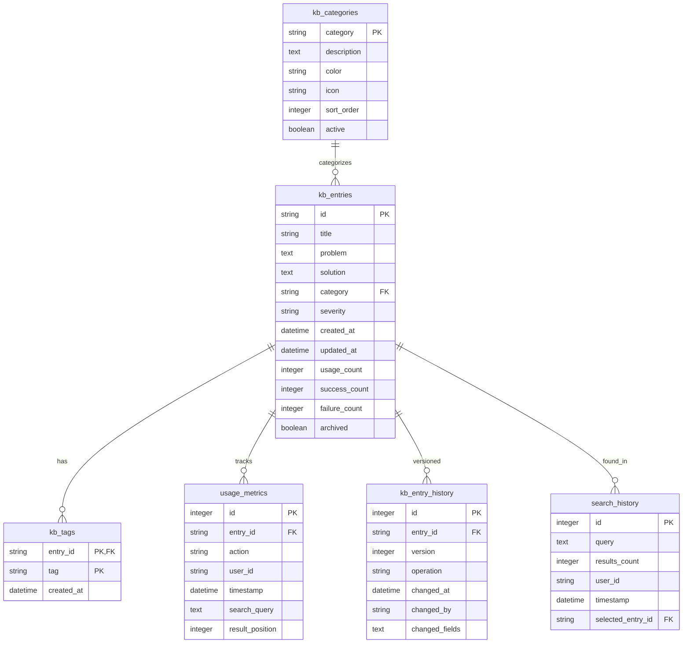

# Knowledge Base Database Schema Documentation

## Table of Contents

1. [Schema Overview](#schema-overview)
2. [Core Tables](#core-tables)
3. [Search & Indexing](#search--indexing)
4. [Performance Tables](#performance-tables)
5. [Audit & History](#audit--history)
6. [Configuration](#configuration)
7. [Relationships](#relationships)
8. [Indexes & Constraints](#indexes--constraints)
9. [Migration Scripts](#migration-scripts)
10. [Performance Tuning](#performance-tuning)

---

## Schema Overview

The Knowledge Base database schema is designed for high performance, scalability, and maintainability. It uses SQLite with advanced features including FTS5 full-text search, comprehensive indexing, and audit trails.

### Design Principles

- **Performance First**: Optimized queries with proper indexing
- **Audit Trail**: Complete history of all changes
- **Full-Text Search**: Advanced search capabilities with BM25 ranking
- **Referential Integrity**: Proper foreign key relationships
- **Extensibility**: Schema designed for future enhancements

### Database File Structure

```
knowledge.db                 # Main database file
├── Core Tables             # Primary data storage
├── Search Indexes          # FTS5 virtual tables
├── Performance Tables      # Metrics and monitoring
├── Audit Tables           # Change tracking
└── System Tables          # Configuration and metadata
```

---

## Core Tables

### kb_entries

Primary table storing knowledge base entries.

```sql
CREATE TABLE kb_entries (
    -- Primary identification
    id TEXT PRIMARY KEY,                     -- UUID v4

    -- Content fields
    title TEXT NOT NULL,                     -- Brief problem title
    problem TEXT NOT NULL,                   -- Detailed problem description
    solution TEXT NOT NULL,                  -- Step-by-step solution
    category TEXT NOT NULL,                  -- Component category
    severity TEXT DEFAULT 'medium'          -- Severity level
        CHECK (severity IN ('critical', 'high', 'medium', 'low')),

    -- Metadata
    created_at DATETIME DEFAULT CURRENT_TIMESTAMP,
    updated_at DATETIME DEFAULT CURRENT_TIMESTAMP,
    created_by TEXT DEFAULT 'system',       -- User or system identifier

    -- Usage metrics
    usage_count INTEGER DEFAULT 0,          -- Total access count
    success_count INTEGER DEFAULT 0,        -- Successful resolution count
    failure_count INTEGER DEFAULT 0,        -- Failed resolution count
    last_used DATETIME,                     -- Last access timestamp

    -- Status
    archived BOOLEAN DEFAULT FALSE,         -- Soft delete flag
    version INTEGER DEFAULT 1               -- Version for optimistic locking
);
```

#### Field Descriptions

| Field | Type | Description | Example |
|-------|------|-------------|---------|
| `id` | TEXT | UUID v4 primary key | `a1b2c3d4-e5f6-7890-abcd-ef1234567890` |
| `title` | TEXT | Concise problem title (max 200 chars) | `VSAM Status 35 - File Not Found` |
| `problem` | TEXT | Detailed problem description | `Job abends with VSAM status code 35 when attempting to open dataset...` |
| `solution` | TEXT | Step-by-step resolution | `1. Verify dataset exists using ISPF 3.4\n2. Check cataloging...` |
| `category` | TEXT | Mainframe component category | `VSAM`, `JCL`, `DB2`, `Batch`, `Functional` |
| `severity` | TEXT | Impact/urgency level | `critical`, `high`, `medium`, `low` |
| `usage_count` | INTEGER | Total times accessed | `45` |
| `success_count` | INTEGER | Successful resolutions | `38` |
| `failure_count` | INTEGER | Failed attempts | `7` |

#### Constraints & Validations

```sql
-- Title constraints
CONSTRAINT chk_title_length CHECK (LENGTH(title) BETWEEN 10 AND 200),

-- Problem/solution content validation
CONSTRAINT chk_problem_not_empty CHECK (LENGTH(TRIM(problem)) >= 20),
CONSTRAINT chk_solution_not_empty CHECK (LENGTH(TRIM(solution)) >= 20),

-- Usage counters must be non-negative
CONSTRAINT chk_usage_positive CHECK (usage_count >= 0),
CONSTRAINT chk_success_positive CHECK (success_count >= 0),
CONSTRAINT chk_failure_positive CHECK (failure_count >= 0),

-- Success count cannot exceed usage count
CONSTRAINT chk_success_valid CHECK (success_count <= usage_count),
CONSTRAINT chk_failure_valid CHECK (failure_count <= usage_count)
```

### kb_tags

Junction table for entry tags with many-to-many relationship.

```sql
CREATE TABLE kb_tags (
    entry_id TEXT NOT NULL,                 -- FK to kb_entries.id
    tag TEXT NOT NULL,                      -- Normalized tag value
    created_at DATETIME DEFAULT CURRENT_TIMESTAMP,

    PRIMARY KEY (entry_id, tag),
    FOREIGN KEY (entry_id) REFERENCES kb_entries(id) ON DELETE CASCADE
);
```

#### Tag Normalization Rules

- Convert to lowercase
- Trim whitespace
- Replace spaces with hyphens
- Maximum 50 characters
- Only alphanumeric and hyphens allowed

```sql
-- Tag validation trigger
CREATE TRIGGER validate_tag_format
BEFORE INSERT ON kb_tags
FOR EACH ROW
WHEN LENGTH(TRIM(NEW.tag)) = 0
   OR LENGTH(NEW.tag) > 50
   OR NEW.tag GLOB '*[^a-z0-9-]*'
BEGIN
    SELECT RAISE(ABORT, 'Invalid tag format: tags must be 1-50 characters, lowercase, alphanumeric with hyphens only');
END;
```

### kb_categories

Reference table for valid categories with metadata.

```sql
CREATE TABLE kb_categories (
    category TEXT PRIMARY KEY,              -- Category name
    description TEXT,                       -- Category description
    color TEXT DEFAULT '#007acc',           -- UI display color
    icon TEXT DEFAULT '📁',                 -- Display icon
    sort_order INTEGER DEFAULT 0,          -- Display ordering
    active BOOLEAN DEFAULT TRUE,           -- Whether category is active
    created_at DATETIME DEFAULT CURRENT_TIMESTAMP
);
```

#### Default Categories

```sql
INSERT INTO kb_categories (category, description, color, icon, sort_order) VALUES
    ('JCL', 'Job Control Language issues and solutions', '#FF5722', '📜', 1),
    ('VSAM', 'Virtual Storage Access Method problems', '#4CAF50', '💾', 2),
    ('DB2', 'Database management and SQL issues', '#2196F3', '🗃️', 3),
    ('Batch', 'Batch job processing problems', '#FF9800', '⚙️', 4),
    ('CICS', 'Customer Information Control System', '#9C27B0', '🖥️', 5),
    ('IMS', 'Information Management System', '#795548', '📊', 6),
    ('Functional', 'Business logic and functional issues', '#607D8B', '💼', 7),
    ('System', 'Operating system and infrastructure', '#424242', '🖧', 8);
```

---

## Search & Indexing

### kb_fts (Full-Text Search)

Virtual table using FTS5 for advanced search capabilities.

```sql
CREATE VIRTUAL TABLE kb_fts USING fts5(
    id UNINDEXED,                           -- Entry ID (not searchable)
    title,                                  -- Searchable title
    problem,                               -- Searchable problem text
    solution,                              -- Searchable solution text
    category,                              -- Searchable category
    tags,                                  -- Concatenated tags
    content=kb_entries,                    -- Source table
    content_rowid=rowid,                   -- Rowid mapping
    tokenize='porter ascii'                -- Porter stemming tokenizer
);
```

#### FTS Configuration

```sql
-- Configure FTS5 for optimal performance
INSERT INTO kb_fts(kb_fts, rank) VALUES('rank', 'bm25(3.0, 2.0, 1.5, 1.0, 0.5)');

-- Field weights: title(3.0), problem(2.0), solution(1.5), category(1.0), tags(0.5)
```

#### Search Triggers

Automatic FTS synchronization triggers:

```sql
-- Insert trigger
CREATE TRIGGER kb_fts_insert
AFTER INSERT ON kb_entries
BEGIN
    INSERT INTO kb_fts(id, title, problem, solution, category, tags)
    SELECT
        NEW.id,
        NEW.title,
        NEW.problem,
        NEW.solution,
        NEW.category,
        COALESCE(
            (SELECT GROUP_CONCAT(tag, ' ') FROM kb_tags WHERE entry_id = NEW.id),
            ''
        );
END;

-- Update trigger
CREATE TRIGGER kb_fts_update
AFTER UPDATE ON kb_entries
BEGIN
    UPDATE kb_fts SET
        title = NEW.title,
        problem = NEW.problem,
        solution = NEW.solution,
        category = NEW.category,
        tags = COALESCE(
            (SELECT GROUP_CONCAT(tag, ' ') FROM kb_tags WHERE entry_id = NEW.id),
            ''
        )
    WHERE id = NEW.id;
END;

-- Delete trigger
CREATE TRIGGER kb_fts_delete
AFTER DELETE ON kb_entries
BEGIN
    DELETE FROM kb_fts WHERE id = OLD.id;
END;

-- Tag update triggers
CREATE TRIGGER kb_tags_fts_update
AFTER INSERT OR DELETE ON kb_tags
BEGIN
    UPDATE kb_fts SET
        tags = COALESCE(
            (SELECT GROUP_CONCAT(tag, ' ') FROM kb_tags WHERE entry_id = NEW.entry_id),
            ''
        )
    WHERE id = COALESCE(NEW.entry_id, OLD.entry_id);
END;
```

### search_history

Tracks all search queries for analytics and auto-complete.

```sql
CREATE TABLE search_history (
    id INTEGER PRIMARY KEY AUTOINCREMENT,
    query TEXT NOT NULL,                    -- Search query text
    results_count INTEGER DEFAULT 0,       -- Number of results returned
    search_time_ms INTEGER,               -- Query execution time
    user_id TEXT,                         -- User who performed search
    session_id TEXT,                      -- Session identifier
    timestamp DATETIME DEFAULT CURRENT_TIMESTAMP,

    -- Search context
    category_filter TEXT,                 -- Applied category filter
    tag_filters TEXT,                     -- Applied tag filters (JSON)
    sort_by TEXT DEFAULT 'relevance',     -- Sort criteria

    -- Result interaction
    selected_entry_id TEXT,               -- Entry user selected
    result_position INTEGER,              -- Position of selected result

    FOREIGN KEY (selected_entry_id) REFERENCES kb_entries(id)
);
```

### auto_complete_cache

Pre-computed auto-complete suggestions for fast response.

```sql
CREATE TABLE auto_complete_cache (
    prefix TEXT PRIMARY KEY,               -- Search prefix (2-10 chars)
    suggestions TEXT NOT NULL,             -- JSON array of suggestions
    last_updated DATETIME DEFAULT CURRENT_TIMESTAMP,
    usage_count INTEGER DEFAULT 0,        -- How often prefix is searched

    CONSTRAINT chk_prefix_length CHECK (LENGTH(prefix) BETWEEN 2 AND 10)
);
```

---

## Performance Tables

### usage_metrics

Detailed usage tracking for analytics and optimization.

```sql
CREATE TABLE usage_metrics (
    id INTEGER PRIMARY KEY AUTOINCREMENT,
    entry_id TEXT NOT NULL,
    action TEXT NOT NULL                    -- Action type
        CHECK (action IN ('view', 'copy', 'edit', 'rate_success', 'rate_failure', 'share')),
    user_id TEXT,
    session_id TEXT,
    timestamp DATETIME DEFAULT CURRENT_TIMESTAMP,

    -- Context data
    search_query TEXT,                     -- Query that led to this action
    result_position INTEGER,               -- Position in search results
    time_spent INTEGER,                    -- Seconds spent viewing entry

    -- Client information
    user_agent TEXT,
    ip_address TEXT,

    FOREIGN KEY (entry_id) REFERENCES kb_entries(id) ON DELETE CASCADE
);
```

### performance_metrics

System performance tracking for monitoring and optimization.

```sql
CREATE TABLE performance_metrics (
    id INTEGER PRIMARY KEY AUTOINCREMENT,
    metric_type TEXT NOT NULL              -- Type of metric
        CHECK (metric_type IN ('search_time', 'db_query', 'cache_hit', 'memory_usage')),
    metric_name TEXT NOT NULL,             -- Specific metric name
    value REAL NOT NULL,                   -- Metric value
    unit TEXT,                            -- Value unit (ms, bytes, percent, etc.)
    timestamp DATETIME DEFAULT CURRENT_TIMESTAMP,

    -- Context
    query TEXT,                           -- Associated query (if applicable)
    user_id TEXT,
    session_id TEXT,

    -- Additional data
    metadata TEXT                         -- JSON metadata
);
```

### query_performance

Tracks query execution times for optimization.

```sql
CREATE TABLE query_performance (
    id INTEGER PRIMARY KEY AUTOINCREMENT,
    query_hash TEXT NOT NULL,             -- Hash of normalized query
    query_text TEXT NOT NULL,             -- Original query
    execution_time_ms INTEGER NOT NULL,   -- Total execution time
    result_count INTEGER,                 -- Number of results
    strategy TEXT,                        -- Search strategy used
    cache_hit BOOLEAN DEFAULT FALSE,      -- Whether result was cached
    timestamp DATETIME DEFAULT CURRENT_TIMESTAMP,

    -- Performance breakdown
    parse_time_ms INTEGER,                -- Query parsing time
    search_time_ms INTEGER,               -- Search execution time
    format_time_ms INTEGER,               -- Result formatting time

    INDEX idx_query_hash ON query_performance(query_hash),
    INDEX idx_execution_time ON query_performance(execution_time_ms),
    INDEX idx_timestamp ON query_performance(timestamp)
);
```

---

## Audit & History

### kb_entry_history

Complete audit trail of all entry changes.

```sql
CREATE TABLE kb_entry_history (
    id INTEGER PRIMARY KEY AUTOINCREMENT,
    entry_id TEXT NOT NULL,               -- Original entry ID
    version INTEGER NOT NULL,             -- Version number
    operation TEXT NOT NULL               -- Change type
        CHECK (operation IN ('INSERT', 'UPDATE', 'DELETE', 'RESTORE')),

    -- Snapshot of entry data at this version
    title TEXT,
    problem TEXT,
    solution TEXT,
    category TEXT,
    severity TEXT,
    tags TEXT,                           -- JSON array of tags

    -- Change metadata
    changed_by TEXT,                     -- User who made change
    changed_at DATETIME DEFAULT CURRENT_TIMESTAMP,
    change_reason TEXT,                  -- Optional reason for change

    -- Diff information
    changed_fields TEXT,                 -- JSON array of changed field names
    previous_values TEXT,                -- JSON object of previous values

    FOREIGN KEY (entry_id) REFERENCES kb_entries(id),
    UNIQUE (entry_id, version)
);
```

#### History Triggers

Automatic history tracking:

```sql
-- Insert history trigger
CREATE TRIGGER kb_entry_history_insert
AFTER INSERT ON kb_entries
BEGIN
    INSERT INTO kb_entry_history (
        entry_id, version, operation,
        title, problem, solution, category, severity,
        tags, changed_by, change_reason
    )
    VALUES (
        NEW.id, 1, 'INSERT',
        NEW.title, NEW.problem, NEW.solution, NEW.category, NEW.severity,
        '[]', NEW.created_by, 'Initial creation'
    );
END;

-- Update history trigger
CREATE TRIGGER kb_entry_history_update
AFTER UPDATE ON kb_entries
WHEN NEW.version != OLD.version  -- Only track actual changes
BEGIN
    INSERT INTO kb_entry_history (
        entry_id, version, operation,
        title, problem, solution, category, severity,
        tags, changed_by, changed_fields, previous_values
    )
    SELECT
        NEW.id, NEW.version, 'UPDATE',
        NEW.title, NEW.problem, NEW.solution, NEW.category, NEW.severity,
        COALESCE(
            '[' || GROUP_CONCAT('"' || tag || '"') || ']',
            '[]'
        ),
        COALESCE(NEW.created_by, 'system'),
        json_array_of_changed_fields(OLD, NEW),
        json_object_of_previous_values(OLD, NEW)
    FROM kb_tags
    WHERE entry_id = NEW.id;
END;
```

### user_sessions

Track user sessions for analytics and security.

```sql
CREATE TABLE user_sessions (
    session_id TEXT PRIMARY KEY,
    user_id TEXT,
    created_at DATETIME DEFAULT CURRENT_TIMESTAMP,
    last_activity DATETIME DEFAULT CURRENT_TIMESTAMP,
    ip_address TEXT,
    user_agent TEXT,
    active BOOLEAN DEFAULT TRUE,

    -- Session metrics
    searches_count INTEGER DEFAULT 0,
    entries_viewed INTEGER DEFAULT 0,
    entries_created INTEGER DEFAULT 0,
    entries_edited INTEGER DEFAULT 0
);
```

---

## Configuration

### system_config

Application configuration and feature flags.

```sql
CREATE TABLE system_config (
    key TEXT PRIMARY KEY,
    value TEXT NOT NULL,
    type TEXT DEFAULT 'string'            -- Value type hint
        CHECK (type IN ('string', 'integer', 'boolean', 'json')),
    description TEXT,
    category TEXT DEFAULT 'general',      -- Configuration category
    editable BOOLEAN DEFAULT TRUE,        -- Whether user can edit
    created_at DATETIME DEFAULT CURRENT_TIMESTAMP,
    updated_at DATETIME DEFAULT CURRENT_TIMESTAMP
);
```

#### Default Configuration

```sql
INSERT INTO system_config (key, value, type, description, category) VALUES
    ('search.default_limit', '10', 'integer', 'Default number of search results', 'search'),
    ('search.max_limit', '100', 'integer', 'Maximum search results allowed', 'search'),
    ('search.enable_ai', 'true', 'boolean', 'Enable AI-powered search features', 'search'),
    ('search.cache_ttl', '300', 'integer', 'Search cache TTL in seconds', 'performance'),
    ('ui.items_per_page', '20', 'integer', 'Default items per page in lists', 'ui'),
    ('ui.enable_real_time_updates', 'true', 'boolean', 'Enable real-time UI updates', 'ui'),
    ('audit.retention_days', '365', 'integer', 'Audit log retention period', 'audit'),
    ('backup.auto_backup', 'true', 'boolean', 'Enable automatic backups', 'backup'),
    ('backup.interval_hours', '24', 'integer', 'Backup interval in hours', 'backup');
```

### feature_flags

Dynamic feature toggles for A/B testing and gradual rollouts.

```sql
CREATE TABLE feature_flags (
    flag_name TEXT PRIMARY KEY,
    enabled BOOLEAN DEFAULT FALSE,
    description TEXT,
    rollout_percentage INTEGER DEFAULT 0  -- 0-100
        CHECK (rollout_percentage BETWEEN 0 AND 100),
    target_users TEXT,                    -- JSON array of specific users
    conditions TEXT,                      -- JSON conditions for enabling
    created_at DATETIME DEFAULT CURRENT_TIMESTAMP,
    updated_at DATETIME DEFAULT CURRENT_TIMESTAMP
);
```

---

## Relationships

### Entity Relationship Diagram



### Referential Integrity

```sql
-- Foreign key constraints
PRAGMA foreign_keys = ON;

-- Cascading deletes for dependent data
ALTER TABLE kb_tags ADD CONSTRAINT fk_tags_entry
    FOREIGN KEY (entry_id) REFERENCES kb_entries(id) ON DELETE CASCADE;

ALTER TABLE usage_metrics ADD CONSTRAINT fk_metrics_entry
    FOREIGN KEY (entry_id) REFERENCES kb_entries(id) ON DELETE CASCADE;

ALTER TABLE kb_entry_history ADD CONSTRAINT fk_history_entry
    FOREIGN KEY (entry_id) REFERENCES kb_entries(id) ON DELETE CASCADE;

-- Referential integrity for categories
ALTER TABLE kb_entries ADD CONSTRAINT fk_entry_category
    FOREIGN KEY (category) REFERENCES kb_categories(category);
```

---

## Indexes & Constraints

### Primary Indexes

```sql
-- Core table indexes
CREATE INDEX idx_kb_entries_category ON kb_entries(category);
CREATE INDEX idx_kb_entries_created_at ON kb_entries(created_at DESC);
CREATE INDEX idx_kb_entries_updated_at ON kb_entries(updated_at DESC);
CREATE INDEX idx_kb_entries_usage_count ON kb_entries(usage_count DESC);
CREATE INDEX idx_kb_entries_archived ON kb_entries(archived);
CREATE INDEX idx_kb_entries_last_used ON kb_entries(last_used DESC);

-- Success rate index (computed)
CREATE INDEX idx_kb_entries_success_rate ON kb_entries(
    CASE
        WHEN (success_count + failure_count) > 0
        THEN CAST(success_count AS REAL) / (success_count + failure_count)
        ELSE 0
    END DESC
);

-- Tag indexes
CREATE INDEX idx_kb_tags_tag ON kb_tags(tag);
CREATE INDEX idx_kb_tags_entry_tag ON kb_tags(entry_id, tag);

-- Performance indexes
CREATE INDEX idx_usage_metrics_entry_action ON usage_metrics(entry_id, action);
CREATE INDEX idx_usage_metrics_timestamp ON usage_metrics(timestamp DESC);
CREATE INDEX idx_usage_metrics_user_session ON usage_metrics(user_id, session_id);

-- Search history indexes
CREATE INDEX idx_search_history_query ON search_history(query);
CREATE INDEX idx_search_history_timestamp ON search_history(timestamp DESC);
CREATE INDEX idx_search_history_user ON search_history(user_id, timestamp DESC);

-- Auto-complete index
CREATE INDEX idx_autocomplete_prefix ON auto_complete_cache(prefix);
CREATE INDEX idx_autocomplete_usage ON auto_complete_cache(usage_count DESC);
```

### Composite Indexes

```sql
-- Multi-column indexes for common queries
CREATE INDEX idx_entries_category_usage ON kb_entries(category, usage_count DESC);
CREATE INDEX idx_entries_active_created ON kb_entries(archived, created_at DESC);
CREATE INDEX idx_entries_active_updated ON kb_entries(archived, updated_at DESC);

-- Search performance indexes
CREATE INDEX idx_search_query_time ON search_history(query, search_time_ms);
CREATE INDEX idx_performance_type_time ON performance_metrics(metric_type, timestamp DESC);

-- History tracking indexes
CREATE INDEX idx_history_entry_version ON kb_entry_history(entry_id, version DESC);
CREATE INDEX idx_history_changed_at ON kb_entry_history(changed_at DESC);
```

### Constraints & Triggers

#### Data Validation

```sql
-- Entry validation trigger
CREATE TRIGGER validate_kb_entry
BEFORE INSERT OR UPDATE ON kb_entries
FOR EACH ROW
BEGIN
    -- Title validation
    SELECT CASE
        WHEN LENGTH(TRIM(NEW.title)) < 10 THEN
            RAISE(ABORT, 'Title must be at least 10 characters')
        WHEN LENGTH(NEW.title) > 200 THEN
            RAISE(ABORT, 'Title cannot exceed 200 characters')
    END;

    -- Content validation
    SELECT CASE
        WHEN LENGTH(TRIM(NEW.problem)) < 20 THEN
            RAISE(ABORT, 'Problem description must be at least 20 characters')
        WHEN LENGTH(TRIM(NEW.solution)) < 20 THEN
            RAISE(ABORT, 'Solution must be at least 20 characters')
    END;

    -- Usage count validation
    SELECT CASE
        WHEN NEW.usage_count < 0 THEN
            RAISE(ABORT, 'Usage count cannot be negative')
        WHEN NEW.success_count < 0 THEN
            RAISE(ABORT, 'Success count cannot be negative')
        WHEN NEW.failure_count < 0 THEN
            RAISE(ABORT, 'Failure count cannot be negative')
        WHEN NEW.success_count > NEW.usage_count THEN
            RAISE(ABORT, 'Success count cannot exceed usage count')
        WHEN NEW.failure_count > NEW.usage_count THEN
            RAISE(ABORT, 'Failure count cannot exceed usage count')
    END;
END;
```

#### Auto-update Triggers

```sql
-- Update timestamp trigger
CREATE TRIGGER update_kb_entry_timestamp
BEFORE UPDATE ON kb_entries
FOR EACH ROW
BEGIN
    UPDATE kb_entries SET
        updated_at = CURRENT_TIMESTAMP,
        version = version + 1
    WHERE id = NEW.id;
END;

-- Maintain usage metrics trigger
CREATE TRIGGER update_usage_metrics
AFTER INSERT ON usage_metrics
FOR EACH ROW
WHEN NEW.action IN ('view', 'rate_success', 'rate_failure')
BEGIN
    UPDATE kb_entries SET
        usage_count = usage_count + 1,
        success_count = success_count +
            CASE WHEN NEW.action = 'rate_success' THEN 1 ELSE 0 END,
        failure_count = failure_count +
            CASE WHEN NEW.action = 'rate_failure' THEN 1 ELSE 0 END,
        last_used = CURRENT_TIMESTAMP
    WHERE id = NEW.entry_id;
END;
```

---

## Migration Scripts

### Version Control System

```sql
CREATE TABLE schema_migrations (
    version INTEGER PRIMARY KEY,
    description TEXT NOT NULL,
    applied_at DATETIME DEFAULT CURRENT_TIMESTAMP,
    checksum TEXT,                        -- Migration file checksum
    execution_time_ms INTEGER,            -- Migration execution time
    success BOOLEAN DEFAULT TRUE
);
```

### Migration 001: Initial Schema

```sql
-- Migration: 001_initial_schema.sql
-- Description: Create initial knowledge base schema
-- Version: 1

BEGIN TRANSACTION;

-- Core tables
CREATE TABLE kb_entries (
    id TEXT PRIMARY KEY,
    title TEXT NOT NULL,
    problem TEXT NOT NULL,
    solution TEXT NOT NULL,
    category TEXT NOT NULL,
    severity TEXT DEFAULT 'medium' CHECK (severity IN ('critical', 'high', 'medium', 'low')),
    created_at DATETIME DEFAULT CURRENT_TIMESTAMP,
    updated_at DATETIME DEFAULT CURRENT_TIMESTAMP,
    created_by TEXT DEFAULT 'system',
    usage_count INTEGER DEFAULT 0,
    success_count INTEGER DEFAULT 0,
    failure_count INTEGER DEFAULT 0,
    last_used DATETIME,
    archived BOOLEAN DEFAULT FALSE,
    version INTEGER DEFAULT 1
);

CREATE TABLE kb_tags (
    entry_id TEXT NOT NULL,
    tag TEXT NOT NULL,
    created_at DATETIME DEFAULT CURRENT_TIMESTAMP,
    PRIMARY KEY (entry_id, tag),
    FOREIGN KEY (entry_id) REFERENCES kb_entries(id) ON DELETE CASCADE
);

CREATE TABLE kb_categories (
    category TEXT PRIMARY KEY,
    description TEXT,
    color TEXT DEFAULT '#007acc',
    icon TEXT DEFAULT '📁',
    sort_order INTEGER DEFAULT 0,
    active BOOLEAN DEFAULT TRUE,
    created_at DATETIME DEFAULT CURRENT_TIMESTAMP
);

-- Search tables
CREATE VIRTUAL TABLE kb_fts USING fts5(
    id UNINDEXED,
    title,
    problem,
    solution,
    category,
    tags,
    content=kb_entries,
    content_rowid=rowid,
    tokenize='porter ascii'
);

-- Record migration
INSERT INTO schema_migrations (version, description, checksum)
VALUES (1, 'Initial schema creation', 'sha256_hash_here');

COMMIT;
```

### Migration 002: Add Performance Tables

```sql
-- Migration: 002_performance_tables.sql
-- Description: Add performance monitoring tables
-- Version: 2

BEGIN TRANSACTION;

CREATE TABLE usage_metrics (
    id INTEGER PRIMARY KEY AUTOINCREMENT,
    entry_id TEXT NOT NULL,
    action TEXT NOT NULL CHECK (action IN ('view', 'copy', 'edit', 'rate_success', 'rate_failure', 'share')),
    user_id TEXT,
    session_id TEXT,
    timestamp DATETIME DEFAULT CURRENT_TIMESTAMP,
    search_query TEXT,
    result_position INTEGER,
    time_spent INTEGER,
    user_agent TEXT,
    ip_address TEXT,
    FOREIGN KEY (entry_id) REFERENCES kb_entries(id) ON DELETE CASCADE
);

CREATE TABLE search_history (
    id INTEGER PRIMARY KEY AUTOINCREMENT,
    query TEXT NOT NULL,
    results_count INTEGER DEFAULT 0,
    search_time_ms INTEGER,
    user_id TEXT,
    session_id TEXT,
    timestamp DATETIME DEFAULT CURRENT_TIMESTAMP,
    category_filter TEXT,
    tag_filters TEXT,
    sort_by TEXT DEFAULT 'relevance',
    selected_entry_id TEXT,
    result_position INTEGER,
    FOREIGN KEY (selected_entry_id) REFERENCES kb_entries(id)
);

-- Add indexes
CREATE INDEX idx_usage_metrics_entry_action ON usage_metrics(entry_id, action);
CREATE INDEX idx_usage_metrics_timestamp ON usage_metrics(timestamp DESC);
CREATE INDEX idx_search_history_timestamp ON search_history(timestamp DESC);

-- Record migration
INSERT INTO schema_migrations (version, description, checksum)
VALUES (2, 'Add performance monitoring tables', 'sha256_hash_here');

COMMIT;
```

### Migration 003: Add Audit Trail

```sql
-- Migration: 003_audit_trail.sql
-- Description: Add comprehensive audit trail
-- Version: 3

BEGIN TRANSACTION;

CREATE TABLE kb_entry_history (
    id INTEGER PRIMARY KEY AUTOINCREMENT,
    entry_id TEXT NOT NULL,
    version INTEGER NOT NULL,
    operation TEXT NOT NULL CHECK (operation IN ('INSERT', 'UPDATE', 'DELETE', 'RESTORE')),
    title TEXT,
    problem TEXT,
    solution TEXT,
    category TEXT,
    severity TEXT,
    tags TEXT,  -- JSON array
    changed_by TEXT,
    changed_at DATETIME DEFAULT CURRENT_TIMESTAMP,
    change_reason TEXT,
    changed_fields TEXT,  -- JSON array
    previous_values TEXT, -- JSON object
    FOREIGN KEY (entry_id) REFERENCES kb_entries(id),
    UNIQUE (entry_id, version)
);

-- Create audit triggers
CREATE TRIGGER kb_entry_history_insert
AFTER INSERT ON kb_entries
BEGIN
    INSERT INTO kb_entry_history (
        entry_id, version, operation, title, problem, solution,
        category, severity, tags, changed_by, change_reason
    )
    VALUES (
        NEW.id, 1, 'INSERT', NEW.title, NEW.problem, NEW.solution,
        NEW.category, NEW.severity, '[]', NEW.created_by, 'Initial creation'
    );
END;

-- Add indexes
CREATE INDEX idx_history_entry_version ON kb_entry_history(entry_id, version DESC);
CREATE INDEX idx_history_changed_at ON kb_entry_history(changed_at DESC);

-- Record migration
INSERT INTO schema_migrations (version, description, checksum)
VALUES (3, 'Add comprehensive audit trail', 'sha256_hash_here');

COMMIT;
```

---

## Performance Tuning

### Query Optimization

#### Common Query Patterns

```sql
-- Pattern 1: Get popular entries by category
EXPLAIN QUERY PLAN
SELECT e.id, e.title, e.usage_count, e.success_count, e.failure_count
FROM kb_entries e
WHERE e.category = 'VSAM'
  AND e.archived = FALSE
ORDER BY e.usage_count DESC
LIMIT 10;

-- Optimized with composite index
CREATE INDEX idx_entries_category_usage_active
ON kb_entries(category, archived, usage_count DESC);
```

```sql
-- Pattern 2: Search with faceted results
WITH search_results AS (
    SELECT e.*, bm25(f) as score
    FROM kb_fts f
    JOIN kb_entries e ON f.id = e.id
    WHERE f MATCH 'vsam status'
      AND e.archived = FALSE
),
category_counts AS (
    SELECT category, COUNT(*) as count
    FROM search_results
    GROUP BY category
)
SELECT sr.*, cc.count as category_count
FROM search_results sr
LEFT JOIN category_counts cc ON sr.category = cc.category
ORDER BY sr.score DESC
LIMIT 20;
```

### Database Maintenance

#### Statistics Update

```sql
-- Update SQLite statistics for query optimization
ANALYZE;

-- Update FTS5 statistics
INSERT INTO kb_fts(kb_fts) VALUES('optimize');

-- Rebuild FTS5 index (if needed)
INSERT INTO kb_fts(kb_fts) VALUES('rebuild');
```

#### Vacuum and Cleanup

```sql
-- Regular maintenance script
PRAGMA optimize;           -- Update statistics
VACUUM;                   -- Reclaim space and defragment
PRAGMA integrity_check;   -- Verify database integrity

-- Clean old performance data (run weekly)
DELETE FROM performance_metrics
WHERE timestamp < datetime('now', '-30 days');

DELETE FROM search_history
WHERE timestamp < datetime('now', '-90 days');

DELETE FROM usage_metrics
WHERE timestamp < datetime('now', '-180 days');
```

### Performance Monitoring Queries

#### Slow Query Detection

```sql
-- Find slow search queries
SELECT
    query_text,
    AVG(execution_time_ms) as avg_time,
    COUNT(*) as frequency,
    MAX(execution_time_ms) as max_time
FROM query_performance
WHERE timestamp > datetime('now', '-7 days')
GROUP BY query_hash
HAVING avg_time > 1000  -- Slower than 1 second
ORDER BY avg_time DESC;
```

#### Index Usage Analysis

```sql
-- Check index usage effectiveness
SELECT name, tbl, sql
FROM sqlite_master
WHERE type = 'index'
  AND name NOT LIKE 'sqlite_autoindex%'
ORDER BY tbl, name;

-- Query to identify unused indexes (requires query log analysis)
```

#### Cache Hit Rate Analysis

```sql
-- Calculate cache effectiveness
SELECT
    DATE(timestamp) as date,
    COUNT(*) as total_queries,
    SUM(CASE WHEN cache_hit THEN 1 ELSE 0 END) as cache_hits,
    ROUND(100.0 * SUM(CASE WHEN cache_hit THEN 1 ELSE 0 END) / COUNT(*), 2) as hit_rate
FROM query_performance
WHERE timestamp > datetime('now', '-7 days')
GROUP BY DATE(timestamp)
ORDER BY date;
```

### Capacity Planning

#### Database Growth Tracking

```sql
-- Track database size growth
INSERT INTO performance_metrics (metric_type, metric_name, value, unit)
VALUES ('storage', 'database_size',
        (SELECT page_count * page_size FROM pragma_page_count(), pragma_page_size()),
        'bytes');

-- Track record counts
INSERT INTO performance_metrics (metric_type, metric_name, value, unit)
SELECT 'record_count', 'kb_entries', COUNT(*), 'records'
FROM kb_entries;
```

#### Performance Thresholds

```sql
-- Create alerts for performance degradation
CREATE TRIGGER performance_alert
AFTER INSERT ON query_performance
FOR EACH ROW
WHEN NEW.execution_time_ms > 5000  -- 5 second threshold
BEGIN
    INSERT INTO performance_alerts (alert_type, message, severity, created_at)
    VALUES (
        'slow_query',
        'Slow query detected: ' || NEW.query_text || ' took ' || NEW.execution_time_ms || 'ms',
        'warning',
        CURRENT_TIMESTAMP
    );
END;
```

This comprehensive database schema documentation provides all the information needed to understand, maintain, and optimize the Knowledge Base database system.