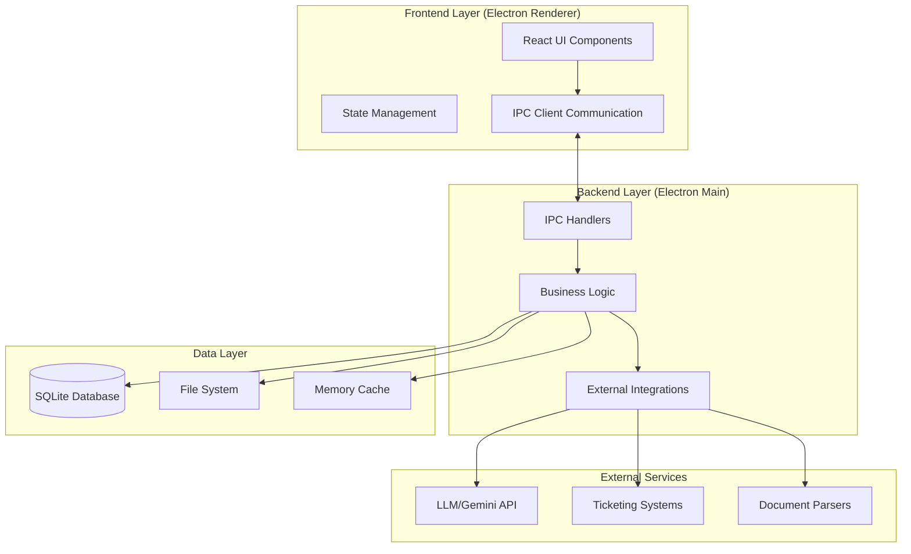
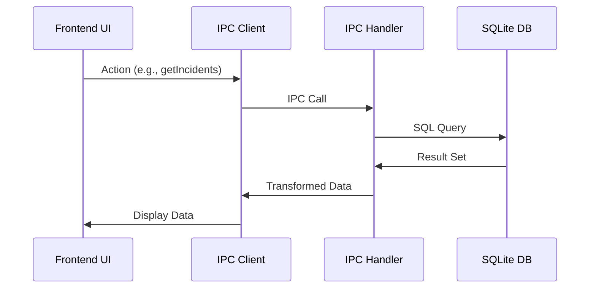
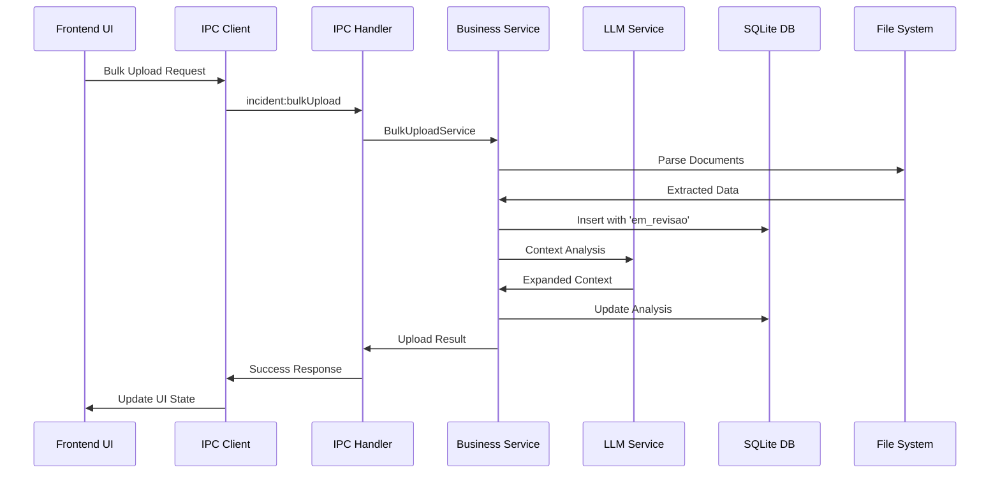
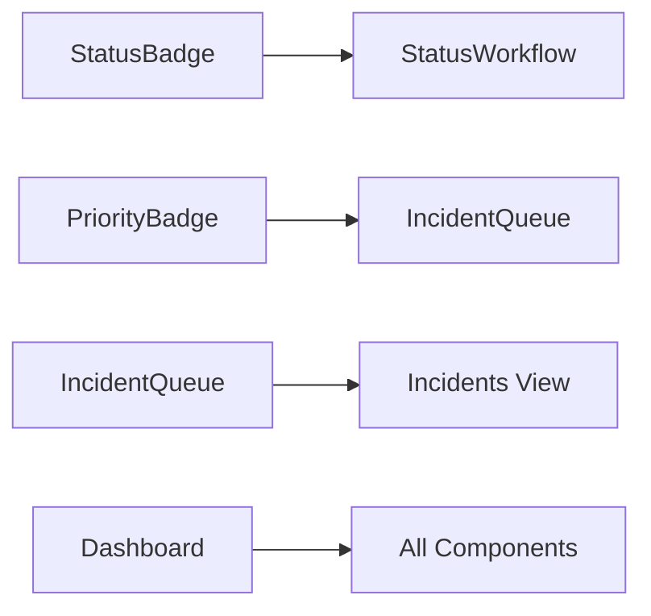
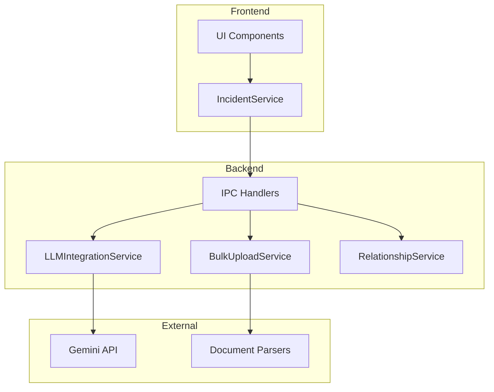

# Arquitetura de Componentes - Sistema de Gestão de Incidentes

## 📐 Visão Geral Arquitetural

Este documento detalha a arquitetura completa do sistema de gestão de incidentes, incluindo componentes implementados, gaps identificados e especificações técnicas para integração.

---

## 🏗️ Arquitetura de Alto Nível



---

## 🎨 Frontend Architecture (React)

### Estrutura de Componentes

```
src/renderer/
├── views/
│   └── Incidents.tsx                    ✅ Principal view com busca
├── components/
│   └── incident/
│       ├── IncidentQueue.tsx            ✅ Fila de incidentes
│       ├── StatusWorkflow.tsx           ✅ Gestão de estados
│       ├── PriorityBadge.tsx           ✅ Badge de prioridade
│       ├── StatusBadge.tsx             ✅ Badge de status
│       ├── IncidentManagementDashboard.tsx ✅ Dashboard analítico
│       ├── IncidentAnalytics.tsx       ❌ FALTANDO - Componente referenciado
│       ├── IncidentRelationshipViewer.tsx ❌ FALTANDO - Não funcional
│       ├── AdvancedIncidentSearch.tsx  ❌ FALTANDO - Não funcional
│       ├── IncidentAutomation.tsx      ❌ FALTANDO - Não funcional
│       ├── IncidentReporting.tsx       ❌ FALTANDO - Não funcional
│       └── QuickActions.tsx            ❌ FALTANDO - Não implementado
├── services/
│   └── IncidentService.ts              ❌ FALTANDO - Serviço não implementado
└── types/
    └── incident.ts                     ❌ FALTANDO - Types não implementados
```

---

## 📱 Análise Detalhada dos Componentes Frontend

### ✅ 1. Incidents.tsx (View Principal)

**Localização:** `src/renderer/views/Incidents.tsx`
**Status:** ✅ **Implementado** mas com limitações

**Funcionalidades Implementadas:**
```typescript
interface IncidentsView {
  // ✅ Busca local em tempo real (debounced 200ms)
  localSearch: (query: string) => IncidentResult[];

  // ✅ Busca via IA (mockada)
  aiSearch: (query: string) => Promise<IncidentResult[]>;

  // ✅ Interface tabbed (Local vs IA)
  tabNavigation: 'local' | 'ai';

  // ✅ Histórico de buscas
  searchHistory: string[];

  // ✅ Floating Action Button
  createIncident: () => void;
}
```

**Limitações Identificadas:**
- ❌ **Dados mockados** - Não conecta ao backend real (linhas 39-47)
- ❌ **Busca IA não funcional** - Apenas chama `searchService.searchAI()` mockado
- ❌ **Sem integração LLM** - Requisitos #12-15 não implementados

**Código Crítico (Gap):**
```typescript
// LINHA 39-47: Dados transformados artificialmente
const incidentResults: IncidentResult[] = results.map(result => ({
  ...result,
  type: result.type as IncidentResult['type'],
  priority: 'P3' as const,  // ❌ HARDCODED
  status: 'Open' as const,  // ❌ HARDCODED
  impact: 'Medium' as const // ❌ HARDCODED
}));
```

---

### ✅ 2. IncidentQueue.tsx (Fila de Incidentes)

**Localização:** `src/renderer/components/incident/IncidentQueue.tsx`
**Status:** ✅ **Bem implementado** mas dados mockados

**Funcionalidades Implementadas:**
```typescript
interface IncidentQueueComponent {
  // ✅ Filtros avançados
  filters: {
    status: string[];
    priority: string[];
    assigned_to: string[];
    category: string[];
    sla_status: 'breached' | 'at_risk' | 'on_time';
    date_range: { from: Date; to: Date; };
  };

  // ✅ Seleção múltipla e ações em lote
  bulkActions: BulkOperation;

  // ✅ Ordenação por colunas
  sorting: IncidentSort;

  // ✅ Paginação
  pagination: { page: number; pageSize: number; };
}
```

**Implementação de Qualidade:**
- ✅ **Filtros complexos** (linhas 114-151)
- ✅ **Ações em lote** com validação (linhas 172-188)
- ✅ **Interface responsiva** com tabela bem estruturada
- ✅ **Gestão de estado** com hooks React apropriados

**Limitações:**
- ❌ **Mock data** em `useEffect` (linhas 33-111)
- ❌ **Não conecta ao IPC** - Deveria usar `window.electron.incident.list()`

---

### ✅ 3. StatusWorkflow.tsx (Gestão de Estados)

**Localização:** `src/renderer/components/incident/StatusWorkflow.tsx`
**Status:** ✅ **Bem implementado** mas serviço inexistente

**Arquitetura Sólida:**
```typescript
interface StatusWorkflowComponent {
  // ✅ Configuração visual por estado
  statusWorkflow: Record<IncidentStatus, {
    next: IncidentStatus[];
    color: string;
    icon: string;
  }>;

  // ✅ Interface de transição com modal
  transitionModal: {
    selectedStatus: IncidentStatus;
    transitionReason: string;
  };

  // ✅ Histórico visual de transições
  statusHistory: StatusTransition[];
}
```

**Implementação de Qualidade:**
- ✅ **Estados bem modelados** (linhas 29-65)
- ✅ **Validação de transições** baseada em `next` states
- ✅ **Interface gráfica** com ícones e cores por estado
- ✅ **Modal de confirmação** para mudanças

**Gap Crítico:**
```typescript
// LINHA 75: Serviço não implementado
const history = await IncidentService.getStatusHistory(incident.id);
// ❌ IncidentService NÃO EXISTE
```

---

### ✅ 4. PriorityBadge.tsx & StatusBadge.tsx

**Status:** ✅ **Completamente implementados**

**Qualidade Alta:**
- ✅ **Configuração por tipos** (cores, tamanhos, labels)
- ✅ **StatusBadge interativo** com dropdown para mudança
- ✅ **Acessibilidade** com tooltips e ARIA

---

### 🟡 5. IncidentManagementDashboard.tsx (Dashboard)

**Localização:** `src/renderer/components/incident/IncidentManagementDashboard.tsx`
**Status:** 🟡 **Parcialmente implementado** - Interface completa mas dados mockados

**Arquitetura Avançada:**
```typescript
interface DashboardComponent {
  // ✅ Métricas de overview
  metrics: DashboardMetrics;

  // ✅ Sistema de alertas
  systemAlerts: SystemAlert[];

  // ✅ Ações rápidas configuráveis
  quickActions: QuickAction[];

  // ✅ Interface tabbed para seções
  sections: 'overview' | 'analytics' | 'relationships' | 'search' | 'automation' | 'reporting';
}
```

**Implementação Sofisticada:**
- ✅ **Métricas KPI** bem estruturadas (linhas 70-78)
- ✅ **Sistema de alertas** com categorias e ações (linhas 81-105)
- ✅ **Quick actions** configuráveis (linhas 117-169)
- ✅ **Interface modular** com tabs para diferentes seções

**Gap Crítico:**
```typescript
// LINHAS 472-514: Componentes referenciados mas não implementados
<IncidentAnalytics />           // ❌ FALTANDO
<IncidentRelationshipViewer />  // ❌ FALTANDO
<AdvancedIncidentSearch />      // ❌ FALTANDO
<IncidentAutomation />          // ❌ FALTANDO
<IncidentReporting />           // ❌ FALTANDO
```

---

## ❌ Componentes Não Implementados (Gaps Críticos)

### 1. IncidentService.ts
**Gap:** Camada de serviço ausente
**Impacto:** Alto - Frontend não conecta ao backend

**Especificação Necessária:**
```typescript
interface IncidentService {
  // Operações CRUD básicas
  getIncidents(filters?: IncidentFilter): Promise<IncidentKBEntry[]>;
  getIncident(id: string): Promise<IncidentKBEntry>;
  createIncident(data: IncidentData): Promise<string>;
  updateIncident(id: string, updates: Partial<IncidentKBEntry>): Promise<void>;

  // Gestão de estados
  updateStatus(id: string, status: IncidentStatus, reason?: string): Promise<void>;
  getStatusHistory(id: string): Promise<StatusTransition[]>;

  // Funcionalidades avançadas (Requisitos #10-18)
  searchRelatedIncidents(id: string): Promise<RelatedIncident[]>;
  requestAIAnalysis(id: string): Promise<AIAnalysisResult>;
  classifySolution(id: string, feedback: SolutionFeedback): Promise<void>;

  // Upload em massa (Requisito #3)
  uploadBulkDocuments(files: File[]): Promise<BulkUploadResult>;
  parseDocument(file: File): Promise<ParsedIncident>;
}
```

### 2. Types/incident.ts
**Gap:** Definições de tipos ausentes
**Impacto:** Médio - TypeScript sem type safety

**Especificação Necessária:**
```typescript
// Estados estendidos (incluindo gaps identificados)
type IncidentStatus =
  | 'open' | 'assigned' | 'in_progress' | 'pending_review'
  | 'resolved' | 'closed' | 'reopened'
  | 'em_revisao' | 'awaiting_ai' | 'rejected'; // NOVOS

// Configurações de prioridade e status
const PRIORITY_COLORS: Record<Priority, string>;
const STATUS_COLORS: Record<IncidentStatus, string>;
const PRIORITY_LABELS: Record<Priority, string>;
const STATUS_LABELS: Record<IncidentStatus, string>;

// Interfaces para componentes
interface IncidentQueueProps { /* ... */ }
interface StatusWorkflowProps { /* ... */ }
interface BulkOperation { /* ... */ }
interface IncidentFilter { /* ... */ }
interface IncidentSort { /* ... */ }
```

### 3. Componentes Avançados Referenciados

#### IncidentAnalytics.tsx ❌
**Finalidade:** Gráficos e métricas avançadas
**Requisitos:** Dashboard analítico, KPIs, trends

#### IncidentRelationshipViewer.tsx ❌
**Finalidade:** Visualização de incidentes relacionados
**Requisitos:** #10, #11 - Busca e exibição de relacionados

#### AdvancedIncidentSearch.tsx ❌
**Finalidade:** Busca avançada com filtros complexos
**Requisitos:** #12-15 - Integração com IA

#### IncidentAutomation.tsx ❌
**Finalidade:** Configuração de regras de automação
**Requisitos:** Gestão de `automation_rules`

#### IncidentReporting.tsx ❌
**Finalidade:** Geração de relatórios personalizados
**Requisitos:** Uso de `report_templates`

---

## 🔧 Backend Architecture (Electron Main)

### Estrutura de Handlers IPC

```
src/main/ipc/handlers/
└── IncidentHandler.ts                  ✅ Bem implementado (25+ handlers)

src/services/incident/                  ❌ FALTANDO - Diretório não existe
├── IncidentService.ts                 ❌ FALTANDO
├── BulkUploadService.ts               ❌ FALTANDO
├── LLMIntegrationService.ts           ❌ FALTANDO
├── RelationshipService.ts             ❌ FALTANDO
└── ReportingService.ts                ❌ FALTANDO
```

---

### ✅ IncidentHandler.ts (IPC Layer)

**Localização:** `src/main/ipc/handlers/IncidentHandler.ts`
**Status:** ✅ **Muito bem implementado** - 25+ handlers

**Handlers Implementados:**
```typescript
interface IPCHandlers {
  // ✅ Operações CRUD
  'incident:list': (filters, sort, page, pageSize) => PaginatedResult;
  'incident:get': (id) => IncidentKBEntry;
  'incident:create': (incidentData) => { id: string };

  // ✅ Gestão de estados
  'incident:updateStatus': (id, status, reason, changedBy) => void;
  'incident:assign': (id, assignedTo, assignedBy) => void;
  'incident:updatePriority': (id, priority, changedBy, reason) => void;

  // ✅ Operações em lote
  'incident:bulkOperation': (operation: BulkOperation) => void;

  // ✅ Comentários e histórico
  'incident:addComment': (id, content, author, isInternal, attachments) => { id };
  'incident:getComments': (id) => IncidentComment[];
  'incident:getStatusHistory': (id) => StatusTransition[];

  // ✅ Métricas e relatórios
  'incident:getMetrics': (timeframe) => IncidentMetrics;
  'incident:getTrends': (timeframe) => TrendData;
  'incident:getSLABreaches': () => IncidentKBEntry[];

  // ✅ Busca e filtros
  'incident:search': (query, filters, sort) => IncidentKBEntry[];
}
```

**Qualidade da Implementação:**
- ✅ **Error handling** adequado com try/catch
- ✅ **Validação de parâmetros** em todos handlers
- ✅ **Logging** de erros
- ✅ **Transações** para operações complexas
- ✅ **Paginação** implementada corretamente

**Limitações:**
- ❌ **Nenhum handler para upload em massa** (Requisito #3)
- ❌ **Nenhum handler para IA/LLM** (Requisitos #12-15)
- ❌ **Logs básicos** - Sem categorização USER/SYSTEM/LLM

---

### ❌ Services Layer (Completamente Ausente)

**Gap Crítico:** Nenhum service implementado além dos handlers IPC

#### 1. BulkUploadService (Requisito #3)
```typescript
interface BulkUploadService {
  uploadFiles(files: File[]): Promise<UploadResult[]>;

  // Parsers por tipo de arquivo
  parsePDF(file: Buffer): Promise<ParsedIncident>;
  parseWord(file: Buffer): Promise<ParsedIncident>;
  parseExcel(file: Buffer): Promise<ParsedIncident[]>;
  parseTXT(file: Buffer): Promise<ParsedIncident>;

  // Validação e importação
  validateIncident(incident: ParsedIncident): ValidationResult;
  bulkImport(incidents: ValidatedIncident[]): Promise<ImportResult>;
}
```

#### 2. LLMIntegrationService (Requisitos #12-15)
```typescript
interface LLMIntegrationService {
  // Expansão semântica (Req #13)
  expandSemanticContext(incident: Incident): Promise<ExpandedContext>;

  // Busca com contexto expandido (Req #14)
  findRelatedWithContext(context: ExpandedContext): Promise<RelatedIncident[]>;

  // Geração de soluções (Req #15)
  generateSolution(incident: Incident, related: RelatedIncident[]): Promise<SolutionProposal>;

  // Feedback e aprendizado (Req #16-18)
  processFeedback(proposal: SolutionProposal, feedback: UserFeedback): Promise<void>;
  reAnalyzeWithFeedback(incident: Incident, comments: Comment[]): Promise<SolutionProposal>;
}
```

#### 3. RelationshipService (Requisitos #10-11)
```typescript
interface RelationshipService {
  // Busca automática sem IA (Req #10)
  findRelatedIncidents(incident: Incident): Promise<RelatedIncident[]>;

  // Algoritmos de similaridade
  calculateSimilarity(incident1: Incident, incident2: Incident): number;

  // Gestão de relacionamentos (Req #11)
  createRelationship(sourceId: string, targetId: string, type: RelationType): Promise<void>;
  getRelationshipDetails(incidentId: string): Promise<RelationshipGraph>;
}
```

---

## 🗃️ Data Layer Architecture

### ✅ Database Schema (SQLite)

**Localização:** `src/database/incident-schema.sql`
**Status:** ✅ **Muito bem projetado** - Schema abrangente

**Estrutura Implementada:**
```sql
-- ✅ Tabelas principais (15 tabelas)
incidents                        -- Tabela central
incident_relationships          -- Links entre incidentes
incident_comments              -- Comentários e logs
sla_policies                   -- Políticas de SLA
automation_rules               -- Regras de automação
incident_metrics_snapshots     -- Métricas históricas
team_performance               -- Performance por equipe
report_templates               -- Templates de relatório
scheduled_reports              -- Execução de relatórios
incident_kb_suggestions        -- Sugestões de KB

-- ✅ Views analíticas (5 views)
v_incident_analytics           -- Métricas consolidadas
v_mttr_metrics                -- Cálculos MTTR
v_daily_incident_trends       -- Tendências diárias
v_team_performance_summary    -- Performance resumida
v_category_distribution       -- Distribuição por categoria

-- ✅ Triggers (3 triggers)
tr_incident_status_update     -- Auto-update timestamps
tr_incident_response_time     -- Cálculo tempo resposta
tr_auto_relationship_suggestions -- Sugestões automáticas

-- ✅ Indexes (15+ indexes)
idx_incidents_status, idx_incidents_category, etc.
```

**Qualidade do Schema:**
- ✅ **Normalização adequada** - 3NF
- ✅ **Constraints rigorosos** - CHECK, FK, UNIQUE
- ✅ **Indexes otimizados** - Queries eficientes
- ✅ **Views analíticas** - Agregações pré-calculadas
- ✅ **Triggers automáticos** - Consistência de dados

### ❌ Gaps no Schema

#### 1. Logs Categorizados
```sql
-- FALTANDO: Tabela para logs USER/SYSTEM/LLM_ACTION
CREATE TABLE incident_action_logs (
    id INTEGER PRIMARY KEY,
    incident_id TEXT NOT NULL,
    action_type TEXT CHECK(action_type IN ('USER_ACTION', 'SYSTEM_ACTION', 'LLM_ACTION')),
    action_name TEXT NOT NULL,
    details TEXT, -- JSON
    is_active BOOLEAN DEFAULT TRUE,
    -- ...
);
```

#### 2. Upload em Massa
```sql
-- FALTANDO: Tabela para tracking de uploads
CREATE TABLE bulk_uploads (
    id TEXT PRIMARY KEY,
    filename TEXT NOT NULL,
    file_type TEXT,
    status TEXT CHECK(status IN ('parsing', 'validating', 'importing', 'completed', 'failed')),
    incidents_count INTEGER,
    success_count INTEGER,
    failure_count INTEGER,
    -- ...
);
```

#### 3. IA/LLM Integration
```sql
-- FALTANDO: Tabelas para análise de IA
CREATE TABLE incident_ai_analyses (
    id TEXT PRIMARY KEY,
    incident_id TEXT NOT NULL,
    analysis_type TEXT,
    original_context TEXT,
    expanded_context TEXT,
    confidence_score REAL,
    -- ...
);

CREATE TABLE incident_solution_proposals (
    id TEXT PRIMARY KEY,
    incident_id TEXT NOT NULL,
    proposal_text TEXT NOT NULL,
    confidence_score REAL,
    referenced_incidents TEXT, -- JSON array
    user_feedback TEXT CHECK(user_feedback IN ('accepted', 'rejected')),
    -- ...
);
```

---

## 🔌 Integration Layer

### ❌ External Integrations (Completamente Ausentes)

#### 1. LLM/Gemini Integration
```typescript
interface GeminiClient {
  // Configuração
  apiKey: string;
  model: 'gemini-pro' | 'gemini-pro-vision';

  // Métodos principais
  expandContext(text: string): Promise<ExpandedContext>;
  generateSolution(prompt: string): Promise<GeneratedSolution>;
  classifyFeedback(feedback: FeedbackData): Promise<Classification>;
}
```

#### 2. Document Parsing
```typescript
interface DocumentParsers {
  // Parsers por tipo
  pdf: PDFParser;
  docx: WordParser;
  xlsx: ExcelParser;
  txt: TextParser;

  // Interface comum
  parse(file: Buffer, type: FileType): Promise<ParsedContent>;
  extractMetadata(content: ParsedContent): IncidentMetadata;
}
```

#### 3. External API Integration
```typescript
interface ExternalTicketingAPI {
  // Para requisito #5
  webhook: WebhookHandler;
  polling: PollingService;

  // Transformação de dados
  transformTicketToIncident(ticket: ExternalTicket): Incident;
}
```

---

## 🔄 Data Flow Architecture

### Fluxo Atual (Limitado)


### Fluxo Necessário (Com Integrações)


---

## 🎯 Component Integration Map

### Atualmente Conectados


### Integrações Necessárias


---

## 📊 Performance Considerations

### ✅ Otimizações Implementadas
- **Database Indexes:** 15+ indexes otimizados
- **Views Pré-calculadas:** Métricas agregadas
- **Paginação:** Implementada no IPC handler
- **React Optimizations:** useMemo, useCallback nos componentes

### ❌ Otimizações Necessárias
- **Lazy Loading** para componentes pesados
- **Virtualization** para listas grandes (react-window)
- **Caching** de resultados LLM
- **Background Processing** para uploads em massa
- **Connection Pooling** para APIs externas

---

## 🔒 Security Architecture

### ✅ Segurança Implementada
- **Input Validation:** CHECK constraints no SQL
- **SQL Injection Prevention:** Prepared statements
- **Foreign Key Integrity:** Cascading deletes

### ❌ Gaps de Segurança
- **File Upload Validation:** Antivírus, type checking
- **API Rate Limiting:** Para chamadas LLM
- **Access Control:** RBAC não implementado
- **Data Encryption:** Dados sensíveis em plaintext
- **Audit Logging:** Logs básicos, sem compliance

---

## 🚀 Implementation Roadmap

### Fase 1: Base Infrastructure (4-6 semanas)
1. **Implementar IncidentService.ts** - Conectar frontend ao backend
2. **Definir types/incident.ts** - Type safety completo
3. **Criar services layer** - BulkUploadService, RelationshipService

### Fase 2: Document Processing (4-6 semanas)
4. **Document parsers** - PDF, Word, Excel, TXT
5. **Bulk upload UI** - Interface drag & drop
6. **File validation** - Security e type checking

### Fase 3: AI Integration (6-8 semanas)
7. **LLMIntegrationService** - Gemini API integration
8. **AI workflow components** - AdvancedSearch, Analytics
9. **Feedback system** - Solution classification

### Fase 4: Advanced Features (4-6 semanas)
10. **Relationship visualization** - IncidentRelationshipViewer
11. **Reporting system** - IncidentReporting component
12. **Automation engine** - IncidentAutomation

### Fase 5: Polish & Optimization (3-4 semanas)
13. **Performance optimizations** - Caching, lazy loading
14. **Security hardening** - RBAC, encryption
15. **Testing & documentation** - E2E tests, user guides

---

## 📋 Architecture Checklist

### Frontend Components
- [ ] ✅ Implementar IncidentService.ts
- [ ] ✅ Definir types/incident.ts completamente
- [ ] ❌ Implementar IncidentAnalytics.tsx
- [ ] ❌ Implementar AdvancedIncidentSearch.tsx
- [ ] ❌ Implementar IncidentRelationshipViewer.tsx
- [ ] ❌ Implementar IncidentAutomation.tsx
- [ ] ❌ Implementar IncidentReporting.tsx
- [ ] ❌ Implementar BulkUpload.tsx

### Backend Services
- [ ] ❌ Criar src/services/incident/ estrutura
- [ ] ❌ Implementar BulkUploadService.ts
- [ ] ❌ Implementar LLMIntegrationService.ts
- [ ] ❌ Implementar RelationshipService.ts
- [ ] ❌ Implementar ReportingService.ts
- [ ] ❌ Implementar AutomationService.ts

### Database Schema
- [ ] ❌ Adicionar incident_action_logs table
- [ ] ❌ Adicionar bulk_uploads table
- [ ] ❌ Adicionar AI analysis tables
- [ ] ❌ Adicionar estados faltantes ao CHECK constraint
- [ ] ❌ Implementar triggers para logs automáticos

### External Integrations
- [ ] ❌ Configurar Gemini API client
- [ ] ❌ Implementar document parsers
- [ ] ❌ Criar webhook handlers para APIs externas
- [ ] ❌ Setup de rate limiting e caching

### Security & Performance
- [ ] ❌ Implementar RBAC system
- [ ] ❌ Adicionar file upload security
- [ ] ❌ Setup de encryption para dados sensíveis
- [ ] ❌ Otimizações de performance (caching, lazy loading)

**Total Estimado:** 21-30 semanas (5-7 meses)
**Complexidade:** Muito Alta - Sistema enterprise completo
**Arquitetura:** Sólida base, mas grandes gaps em funcionalidades críticas