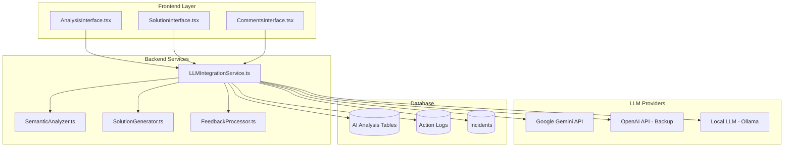

# Integração LLM/Gemini - Especificação Técnica Completa

## 📋 Objetivo
Implementar integração completa com Google Gemini (ou outros LLMs) para análise inteligente de incidentes, expansão semântica e geração de soluções conforme **Requisitos #12-18**.

---

## 🎯 Requisitos Funcionais Detalhados

### RF-012: Análise Inteligente Inicial
- **Trigger**: Usuário clica "Análise Inteligente" em incidente aberto
- **Ação**: Processar contexto do incidente via LLM
- **Log**: `LLM_ACTION` - Início da análise inteligente

### RF-013: Expansão Semântica Automática
- **Input**: Contexto básico do incidente (título, descrição, categoria)
- **Processamento**: LLM expande contexto técnico e funcional
- **Output**: Contexto expandido com keywords e conceitos relacionados
- **Log**: `LLM_ACTION` - Expansão semântica executada

### RF-014: Busca com Contexto Expandido
- **Input**: Contexto expandido do LLM
- **Processamento**: Busca de incidentes relacionados usando semântica expandida
- **Output**: Lista de incidentes relacionados (limitado a 5 por nível de similaridade)
- **Log**: `SYSTEM_ACTION` - Busca de relacionados executada

### RF-015: Geração de Proposta de Solução
- **Input**: Incidente original + incidentes relacionados
- **Processamento**: LLM gera proposta de solução baseada no histórico
- **Output**: Solução com referências aos incidentes utilizados
- **Log**: `LLM_ACTION` - Análise de solução concluída

### RF-016: Classificação de Solução
- **Interface**: Botões "Aceitar" / "Rejeitar" para usuário
- **Processamento**: Feedback registrado para melhoria do modelo
- **Log**: `USER_ACTION` - Classificação da solução

### RF-017: Sistema de Comentários Ativos
- **Funcionalidade**: Comentários podem ser marcados como ativos/inativos
- **Integração**: Apenas comentários ativos são enviados para LLM como contexto
- **Log**: `USER_ACTION` - Inclusão/exclusão de comentário no contexto

### RF-018: Re-análise com Feedback
- **Trigger**: Usuário rejeita solução e solicita nova análise
- **Processamento**: Nova análise incluindo todos os comentários ativos
- **Iteração**: Processo pode ser repetido até aceitação ou desistência

---

## 🏗️ Arquitetura de Integração LLM

### Diagrama de Componentes



---

## 🔧 Backend Services Implementation

### 1. LLMIntegrationService.ts (Core Service)

```typescript
import { GoogleGenerativeAI } from '@google/generative-ai';

interface LLMConfig {
  provider: 'gemini' | 'openai' | 'ollama';
  apiKey: string;
  model: string;
  maxTokens: number;
  temperature: number;
  timeout: number;
}

interface SemanticExpansionResult {
  originalContext: string;
  expandedKeywords: string[];
  technicalConcepts: string[];
  functionalConcepts: string[];
  relatedTerms: string[];
  confidenceScore: number;
  processingTime: number;
}

interface SolutionProposal {
  id: string;
  incidentId: string;
  proposalText: string;
  confidenceScore: number;
  referencedIncidents: string[];
  reasoning: string;
  generatedAt: Date;
  modelUsed: string;
}

interface AnalysisContext {
  incident: IncidentKBEntry;
  relatedIncidents?: RelatedIncident[];
  activeComments?: Comment[];
  previousAnalyses?: AnalysisResult[];
}

class LLMIntegrationService {
  private providers: Record<string, LLMProvider>;
  private currentConfig: LLMConfig;
  private database: Database;
  private logger: Logger;

  constructor(config: LLMConfig, database: Database) {
    this.currentConfig = config;
    this.database = database;
    this.logger = new Logger('LLMIntegration');

    this.providers = {
      gemini: new GeminiProvider(config),
      openai: new OpenAIProvider(config),
      ollama: new OllamaProvider(config)
    };
  }

  // RF-013: Expansão Semântica
  async expandSemanticContext(incident: IncidentKBEntry): Promise<SemanticExpansionResult> {
    const startTime = Date.now();

    try {
      // Log início da análise
      await this.logAction(incident.id, 'LLM_ACTION', 'semantic_expansion_started', {
        incident_title: incident.title,
        model: this.currentConfig.model
      });

      // Preparar contexto para LLM
      const contextPrompt = this.buildSemanticExpansionPrompt(incident);

      // Chamar LLM
      const provider = this.providers[this.currentConfig.provider];
      const response = await provider.generateResponse(contextPrompt);

      // Processar resposta
      const expansionResult = this.parseSemanticExpansion(response, incident);
      expansionResult.processingTime = Date.now() - startTime;

      // Salvar resultado na base de dados
      await this.saveSemanticExpansion(incident.id, expansionResult);

      // Log conclusão
      await this.logAction(incident.id, 'LLM_ACTION', 'semantic_expansion_completed', {
        keywords_count: expansionResult.expandedKeywords.length,
        confidence_score: expansionResult.confidenceScore,
        processing_time_ms: expansionResult.processingTime
      });

      return expansionResult;
    } catch (error) {
      await this.logAction(incident.id, 'LLM_ACTION', 'semantic_expansion_failed', {
        error: error.message,
        processing_time_ms: Date.now() - startTime
      });
      throw new Error(`Semantic expansion failed: ${error.message}`);
    }
  }

  // RF-015: Geração de Proposta de Solução
  async generateSolution(context: AnalysisContext): Promise<SolutionProposal> {
    const { incident, relatedIncidents = [], activeComments = [] } = context;

    try {
      // Log início da geração
      await this.logAction(incident.id, 'LLM_ACTION', 'solution_generation_started', {
        related_incidents_count: relatedIncidents.length,
        active_comments_count: activeComments.length
      });

      // Preparar prompt complexo
      const solutionPrompt = this.buildSolutionGenerationPrompt(
        incident,
        relatedIncidents,
        activeComments
      );

      // Gerar solução via LLM
      const provider = this.providers[this.currentConfig.provider];
      const response = await provider.generateResponse(solutionPrompt);

      // Processar e validar resposta
      const proposal = this.parseSolutionProposal(response, incident.id);

      // Salvar proposta na base de dados
      await this.saveSolutionProposal(proposal);

      // Log conclusão
      await this.logAction(incident.id, 'LLM_ACTION', 'solution_generation_completed', {
        solution_id: proposal.id,
        confidence_score: proposal.confidenceScore,
        referenced_incidents: proposal.referencedIncidents
      });

      return proposal;
    } catch (error) {
      await this.logAction(incident.id, 'LLM_ACTION', 'solution_generation_failed', {
        error: error.message
      });
      throw new Error(`Solution generation failed: ${error.message}`);
    }
  }

  // RF-016: Processamento de Feedback
  async processFeedback(
    proposalId: string,
    feedback: 'accept' | 'reject',
    comments?: string,
    userId?: string
  ): Promise<void> {
    try {
      const proposal = await this.getSolutionProposal(proposalId);

      // Log ação do usuário
      await this.logAction(proposal.incidentId, 'USER_ACTION', 'solution_feedback', {
        proposal_id: proposalId,
        feedback,
        comments,
        user_id: userId
      });

      // Atualizar proposta com feedback
      await this.updateProposalFeedback(proposalId, feedback, comments);

      // Se aceita, atualizar status do incidente
      if (feedback === 'accept') {
        await this.database.prepare(`
          UPDATE incidents
          SET status = 'resolved', resolver = ?, updated_at = CURRENT_TIMESTAMP
          WHERE id = ?
        `).run(userId || 'ai_system', proposal.incidentId);
      }

      // Processar feedback para melhoria do modelo (ML pipeline)
      await this.processFeedbackForModelImprovement(proposal, feedback, comments);

    } catch (error) {
      throw new Error(`Feedback processing failed: ${error.message}`);
    }
  }

  // RF-018: Re-análise com Comentários
  async reAnalyzeWithFeedback(
    incidentId: string,
    rejectionComments: string
  ): Promise<SolutionProposal> {
    try {
      // Buscar incident e contexto atualizado
      const incident = await this.getIncident(incidentId);
      const relatedIncidents = await this.getRelatedIncidents(incidentId);
      const activeComments = await this.getActiveComments(incidentId);

      // Adicionar feedback de rejeição aos comentários
      const enhancedComments = [
        ...activeComments,
        {
          content: `Feedback de rejeição: ${rejectionComments}`,
          author: 'system_feedback',
          is_active: true,
          created_at: new Date()
        }
      ];

      // Log re-análise
      await this.logAction(incidentId, 'LLM_ACTION', 'reanalysis_started', {
        rejection_feedback: rejectionComments,
        enhanced_context: true
      });

      // Gerar nova solução com contexto expandido
      const newProposal = await this.generateSolution({
        incident,
        relatedIncidents,
        activeComments: enhancedComments
      });

      return newProposal;
    } catch (error) {
      await this.logAction(incidentId, 'LLM_ACTION', 'reanalysis_failed', {
        error: error.message
      });
      throw error;
    }
  }

  // Prompts para diferentes operações
  private buildSemanticExpansionPrompt(incident: IncidentKBEntry): string {
    return `
Você é um especialista em sistemas mainframe e análise de incidentes. Analise o seguinte incidente e expanda o contexto semântico para melhorar a busca por incidentes relacionados.

INCIDENTE:
Título: ${incident.title}
Descrição: ${incident.problem}
Categoria: ${incident.category}
Tags: ${incident.tags?.join(', ') || 'Nenhuma'}

INSTRUÇÃO:
Identifique e liste:
1. PALAVRAS-CHAVE TÉCNICAS: Termos técnicos específicos do mainframe relacionados ao problema
2. CONCEITOS FUNCIONAIS: Aspectos funcionais e processos de negócio relacionados
3. TERMOS CORRELATOS: Sinônimos, variações e termos relacionados
4. CONTEXTO SISTÊMICO: Componentes e sistemas que podem estar relacionados

FORMATO DE RESPOSTA (JSON):
{
  "expandedKeywords": ["palavra1", "palavra2", ...],
  "technicalConcepts": ["conceito1", "conceito2", ...],
  "functionalConcepts": ["funcional1", "funcional2", ...],
  "relatedTerms": ["termo1", "termo2", ...],
  "systemContext": ["sistema1", "sistema2", ...],
  "confidenceScore": 0.85
}

Seja específico e focado em mainframe, COBOL, JCL, DB2, VSAM, CICS, etc.
    `;
  }

  private buildSolutionGenerationPrompt(
    incident: IncidentKBEntry,
    relatedIncidents: RelatedIncident[],
    activeComments: Comment[]
  ): string {
    const relatedText = relatedIncidents.map((related, index) => `
INCIDENTE RELACIONADO #${index + 1} (Similaridade: ${related.similarityScore}):
Título: ${related.title}
Problema: ${related.problem}
Solução: ${related.solution}
Status: ${related.status}
`).join('\n');

    const commentsText = activeComments.map(comment => `
COMENTÁRIO (${comment.author}): ${comment.content}
`).join('\n');

    return `
Você é um especialista em sistemas mainframe responsável por analisar incidentes e propor soluções baseadas no histórico de casos similares.

INCIDENTE ATUAL:
Título: ${incident.title}
Descrição: ${incident.problem}
Categoria: ${incident.category}
Prioridade: ${incident.priority}

INCIDENTES RELACIONADOS (RESOLVIDOS):
${relatedText}

COMENTÁRIOS ATIVOS:
${commentsText}

INSTRUÇÃO:
Com base nos incidentes relacionados resolvidos e comentários ativos, proponha uma solução detalhada para o incidente atual.

FORMATO DE RESPOSTA (JSON):
{
  "solution": "Descrição detalhada da solução proposta",
  "reasoning": "Explicação do raciocínio baseado nos casos relacionados",
  "steps": [
    "Passo 1: Descrição específica",
    "Passo 2: Descrição específica",
    "..."
  ],
  "referencedIncidents": ["INC-123", "INC-456"],
  "confidenceScore": 0.92,
  "additionalNotes": "Observações ou precauções importantes"
}

REQUISITOS:
- Seja específico e técnico
- Referencie explicitamente os incidentes relacionados utilizados
- Inclua passos práticos e executáveis
- Use terminologia mainframe apropriada
- Indique nível de confiança na solução
    `;
  }

  // Parsing de respostas do LLM
  private parseSemanticExpansion(
    response: string,
    incident: IncidentKBEntry
  ): SemanticExpansionResult {
    try {
      const parsed = JSON.parse(response);

      return {
        originalContext: `${incident.title} ${incident.problem}`,
        expandedKeywords: parsed.expandedKeywords || [],
        technicalConcepts: parsed.technicalConcepts || [],
        functionalConcepts: parsed.functionalConcepts || [],
        relatedTerms: parsed.relatedTerms || [],
        confidenceScore: parsed.confidenceScore || 0.5,
        processingTime: 0 // Será preenchido pelo caller
      };
    } catch (error) {
      // Fallback se JSON inválido
      return {
        originalContext: `${incident.title} ${incident.problem}`,
        expandedKeywords: this.extractKeywordsFromText(response),
        technicalConcepts: [],
        functionalConcepts: [],
        relatedTerms: [],
        confidenceScore: 0.3,
        processingTime: 0
      };
    }
  }

  private parseSolutionProposal(response: string, incidentId: string): SolutionProposal {
    try {
      const parsed = JSON.parse(response);

      return {
        id: this.generateId(),
        incidentId,
        proposalText: parsed.solution || response,
        confidenceScore: parsed.confidenceScore || 0.5,
        referencedIncidents: parsed.referencedIncidents || [],
        reasoning: parsed.reasoning || 'Análise automática via LLM',
        generatedAt: new Date(),
        modelUsed: `${this.currentConfig.provider}:${this.currentConfig.model}`
      };
    } catch (error) {
      return {
        id: this.generateId(),
        incidentId,
        proposalText: response,
        confidenceScore: 0.3,
        referencedIncidents: [],
        reasoning: 'Análise automática com parsing limitado',
        generatedAt: new Date(),
        modelUsed: `${this.currentConfig.provider}:${this.currentConfig.model}`
      };
    }
  }

  // Database operations
  private async saveSemanticExpansion(
    incidentId: string,
    result: SemanticExpansionResult
  ): Promise<void> {
    await this.database.prepare(`
      INSERT INTO incident_ai_analyses (
        id, incident_id, analysis_type, original_context, expanded_keywords,
        technical_concepts, functional_concepts, confidence_score, created_at
      ) VALUES (?, ?, 'semantic_expansion', ?, ?, ?, ?, ?, ?)
    `).run(
      this.generateId(),
      incidentId,
      result.originalContext,
      JSON.stringify(result.expandedKeywords),
      JSON.stringify(result.technicalConcepts),
      JSON.stringify(result.functionalConcepts),
      result.confidenceScore,
      new Date().toISOString()
    );
  }

  private async saveSolutionProposal(proposal: SolutionProposal): Promise<void> {
    await this.database.prepare(`
      INSERT INTO incident_solution_proposals (
        id, incident_id, proposal_text, confidence_score, referenced_incidents,
        reasoning, model_used, created_at
      ) VALUES (?, ?, ?, ?, ?, ?, ?, ?)
    `).run(
      proposal.id,
      proposal.incidentId,
      proposal.proposalText,
      proposal.confidenceScore,
      JSON.stringify(proposal.referencedIncidents),
      proposal.reasoning,
      proposal.modelUsed,
      proposal.generatedAt.toISOString()
    );
  }

  private async logAction(
    incidentId: string,
    actionType: 'USER_ACTION' | 'LLM_ACTION' | 'SYSTEM_ACTION',
    actionName: string,
    details: Record<string, any>
  ): Promise<void> {
    await this.database.prepare(`
      INSERT INTO incident_action_logs (
        incident_id, action_type, action_name, details, timestamp, is_active
      ) VALUES (?, ?, ?, ?, ?, TRUE)
    `).run(
      incidentId,
      actionType,
      actionName,
      JSON.stringify(details),
      new Date().toISOString()
    );
  }

  // Utility methods
  private generateId(): string {
    return `ai_${Date.now()}_${Math.random().toString(36).substring(2, 9)}`;
  }

  private extractKeywordsFromText(text: string): string[] {
    // Simple keyword extraction as fallback
    const words = text.toLowerCase()
      .replace(/[^\w\s]/g, ' ')
      .split(/\s+/)
      .filter(word => word.length > 3);

    return [...new Set(words)].slice(0, 20);
  }
}
```

### 2. LLM Provider Implementations

#### GeminiProvider.ts
```typescript
import { GoogleGenerativeAI, GenerativeModel } from '@google/generative-ai';

export class GeminiProvider implements LLMProvider {
  private genAI: GoogleGenerativeAI;
  private model: GenerativeModel;

  constructor(config: LLMConfig) {
    this.genAI = new GoogleGenerativeAI(config.apiKey);
    this.model = this.genAI.getGenerativeModel({
      model: config.model || 'gemini-pro',
      generationConfig: {
        temperature: config.temperature || 0.7,
        maxOutputTokens: config.maxTokens || 2048,
      }
    });
  }

  async generateResponse(prompt: string): Promise<string> {
    try {
      const result = await this.model.generateContent(prompt);
      const response = await result.response;
      return response.text();
    } catch (error) {
      if (error.message?.includes('rate limit')) {
        throw new RateLimitError('Gemini rate limit exceeded');
      }
      if (error.message?.includes('safety')) {
        throw new SafetyError('Content filtered by Gemini safety systems');
      }
      throw new LLMError(`Gemini API error: ${error.message}`);
    }
  }

  async isHealthy(): Promise<boolean> {
    try {
      const result = await this.model.generateContent('Test connection');
      return true;
    } catch {
      return false;
    }
  }

  getCapabilities(): ProviderCapabilities {
    return {
      maxTokens: 32768,
      supportsStreaming: true,
      supportsImages: false, // gemini-pro-vision for images
      supportsFunctions: true,
      languages: ['pt', 'en', 'es']
    };
  }
}
```

#### OpenAIProvider.ts (Backup)
```typescript
import { OpenAI } from 'openai';

export class OpenAIProvider implements LLMProvider {
  private client: OpenAI;
  private model: string;
  private config: LLMConfig;

  constructor(config: LLMConfig) {
    this.client = new OpenAI({
      apiKey: config.apiKey,
    });
    this.model = config.model || 'gpt-3.5-turbo';
    this.config = config;
  }

  async generateResponse(prompt: string): Promise<string> {
    try {
      const completion = await this.client.chat.completions.create({
        model: this.model,
        messages: [
          {
            role: 'system',
            content: 'Você é um especialista em sistemas mainframe e análise de incidentes.'
          },
          {
            role: 'user',
            content: prompt
          }
        ],
        max_tokens: this.config.maxTokens || 2048,
        temperature: this.config.temperature || 0.7,
      });

      return completion.choices[0]?.message?.content || '';
    } catch (error) {
      if (error.status === 429) {
        throw new RateLimitError('OpenAI rate limit exceeded');
      }
      throw new LLMError(`OpenAI API error: ${error.message}`);
    }
  }

  async isHealthy(): Promise<boolean> {
    try {
      await this.client.chat.completions.create({
        model: this.model,
        messages: [{ role: 'user', content: 'Test' }],
        max_tokens: 5
      });
      return true;
    } catch {
      return false;
    }
  }

  getCapabilities(): ProviderCapabilities {
    return {
      maxTokens: 16384,
      supportsStreaming: true,
      supportsImages: this.model.includes('vision'),
      supportsFunctions: true,
      languages: ['pt', 'en', 'es', 'fr', 'de']
    };
  }
}
```

#### OllamaProvider.ts (Local LLM)
```typescript
export class OllamaProvider implements LLMProvider {
  private baseUrl: string;
  private model: string;

  constructor(config: LLMConfig) {
    this.baseUrl = config.apiKey || 'http://localhost:11434'; // Ollama default
    this.model = config.model || 'llama2:7b';
  }

  async generateResponse(prompt: string): Promise<string> {
    try {
      const response = await fetch(`${this.baseUrl}/api/generate`, {
        method: 'POST',
        headers: {
          'Content-Type': 'application/json',
        },
        body: JSON.stringify({
          model: this.model,
          prompt: prompt,
          stream: false,
          options: {
            temperature: 0.7,
            num_predict: 2048
          }
        })
      });

      if (!response.ok) {
        throw new Error(`Ollama API error: ${response.statusText}`);
      }

      const data = await response.json();
      return data.response || '';
    } catch (error) {
      throw new LLMError(`Ollama connection error: ${error.message}`);
    }
  }

  async isHealthy(): Promise<boolean> {
    try {
      const response = await fetch(`${this.baseUrl}/api/version`);
      return response.ok;
    } catch {
      return false;
    }
  }

  getCapabilities(): ProviderCapabilities {
    return {
      maxTokens: 4096,
      supportsStreaming: true,
      supportsImages: false,
      supportsFunctions: false,
      languages: ['en', 'pt']
    };
  }
}
```

---

## 🗃️ Database Schema Extensions

### Tabelas para Análise de IA

```sql
-- Análises de IA realizadas nos incidentes
CREATE TABLE IF NOT EXISTS incident_ai_analyses (
    id TEXT PRIMARY KEY,
    incident_id TEXT NOT NULL,
    analysis_type TEXT NOT NULL CHECK(analysis_type IN (
        'semantic_expansion', 'solution_generation', 'classification', 'similarity_analysis'
    )),
    original_context TEXT NOT NULL,
    expanded_keywords TEXT, -- JSON array
    technical_concepts TEXT, -- JSON array
    functional_concepts TEXT, -- JSON array
    confidence_score REAL CHECK(confidence_score >= 0 AND confidence_score <= 1),
    processing_time_ms INTEGER,
    model_used TEXT,
    created_at DATETIME DEFAULT CURRENT_TIMESTAMP,

    FOREIGN KEY (incident_id) REFERENCES incidents(id) ON DELETE CASCADE
);

-- Propostas de solução geradas por IA
CREATE TABLE IF NOT EXISTS incident_solution_proposals (
    id TEXT PRIMARY KEY,
    incident_id TEXT NOT NULL,
    proposal_text TEXT NOT NULL,
    confidence_score REAL CHECK(confidence_score >= 0 AND confidence_score <= 1),
    referenced_incidents TEXT, -- JSON array of incident IDs
    reasoning TEXT, -- Explicação do raciocínio
    model_used TEXT,
    user_feedback TEXT CHECK(user_feedback IN ('accepted', 'rejected')),
    feedback_comments TEXT,
    feedback_timestamp DATETIME,
    created_at DATETIME DEFAULT CURRENT_TIMESTAMP,

    FOREIGN KEY (incident_id) REFERENCES incidents(id) ON DELETE CASCADE
);

-- Logs de ações categorizados (USER/SYSTEM/LLM)
CREATE TABLE IF NOT EXISTS incident_action_logs (
    id INTEGER PRIMARY KEY AUTOINCREMENT,
    incident_id TEXT NOT NULL,
    action_type TEXT NOT NULL CHECK(action_type IN ('USER_ACTION', 'SYSTEM_ACTION', 'LLM_ACTION')),
    action_name TEXT NOT NULL,
    user_id TEXT, -- Para USER_ACTION
    details TEXT, -- JSON com detalhes específicos da ação
    timestamp DATETIME DEFAULT CURRENT_TIMESTAMP,
    is_active BOOLEAN DEFAULT TRUE, -- Para soft delete
    session_id TEXT, -- Para agrupar ações relacionadas

    FOREIGN KEY (incident_id) REFERENCES incidents(id) ON DELETE CASCADE
);

-- Comentários com suporte a ativo/inativo
ALTER TABLE incident_comments ADD COLUMN is_active BOOLEAN DEFAULT TRUE;
ALTER TABLE incident_comments ADD COLUMN context_relevance REAL DEFAULT 1.0; -- Relevância para contexto LLM

-- Métricas de performance dos LLMs
CREATE TABLE IF NOT EXISTS llm_performance_metrics (
    id INTEGER PRIMARY KEY AUTOINCREMENT,
    model_name TEXT NOT NULL,
    operation_type TEXT NOT NULL,
    avg_processing_time_ms REAL,
    avg_confidence_score REAL,
    success_rate REAL, -- Taxa de análises bem-sucedidas
    user_acceptance_rate REAL, -- Taxa de aceitação das soluções propostas
    total_operations INTEGER,
    date_period DATE, -- Métricas por período (diário/mensal)
    created_at DATETIME DEFAULT CURRENT_TIMESTAMP
);

-- Relacionamentos entre incidentes com scoring de IA
ALTER TABLE incident_relationships ADD COLUMN ai_similarity_score REAL;
ALTER TABLE incident_relationships ADD COLUMN ai_model_used TEXT;
ALTER TABLE incident_relationships ADD COLUMN ai_analysis_timestamp DATETIME;

-- Indexes para performance
CREATE INDEX IF NOT EXISTS idx_ai_analyses_incident ON incident_ai_analyses(incident_id, analysis_type, created_at DESC);
CREATE INDEX IF NOT EXISTS idx_solution_proposals_incident ON incident_solution_proposals(incident_id, created_at DESC);
CREATE INDEX IF NOT EXISTS idx_action_logs_incident_type ON incident_action_logs(incident_id, action_type, timestamp DESC);
CREATE INDEX IF NOT EXISTS idx_action_logs_active ON incident_action_logs(is_active, action_type, timestamp DESC);
CREATE INDEX IF NOT EXISTS idx_comments_active ON incident_comments(incident_id, is_active);
```

---

## 📱 Frontend Implementation

### 1. AnalysisInterface.tsx

```typescript
interface AnalysisInterfaceProps {
  incident: IncidentKBEntry;
  onAnalysisComplete: (result: AnalysisResult) => void;
  onError: (error: AnalysisError) => void;
}

interface AnalysisState {
  phase: 'idle' | 'expanding' | 'searching' | 'generating' | 'completed';
  semanticExpansion?: SemanticExpansionResult;
  relatedIncidents?: RelatedIncident[];
  solutionProposal?: SolutionProposal;
  isProcessing: boolean;
  error?: string;
}

const AnalysisInterface: React.FC<AnalysisInterfaceProps> = ({
  incident,
  onAnalysisComplete,
  onError
}) => {
  const [state, setState] = useState<AnalysisState>({
    phase: 'idle',
    isProcessing: false
  });

  const startIntelligentAnalysis = useCallback(async () => {
    setState(prev => ({ ...prev, isProcessing: true, phase: 'expanding' }));

    try {
      // Phase 1: Expansão Semântica
      const semanticResult = await window.electron.incident.expandSemanticContext(incident.id);
      setState(prev => ({
        ...prev,
        semanticExpansion: semanticResult,
        phase: 'searching'
      }));

      // Phase 2: Busca de Relacionados
      const relatedIncidents = await window.electron.incident.findRelatedWithContext(
        incident.id,
        semanticResult
      );
      setState(prev => ({
        ...prev,
        relatedIncidents,
        phase: 'generating'
      }));

      // Phase 3: Geração de Solução
      const solutionProposal = await window.electron.incident.generateSolution(
        incident.id,
        relatedIncidents
      );

      setState(prev => ({
        ...prev,
        solutionProposal,
        phase: 'completed',
        isProcessing: false
      }));

      onAnalysisComplete({
        semanticExpansion: semanticResult,
        relatedIncidents,
        solutionProposal
      });

    } catch (error) {
      setState(prev => ({
        ...prev,
        error: error.message,
        isProcessing: false,
        phase: 'idle'
      }));
      onError(error as AnalysisError);
    }
  }, [incident.id, onAnalysisComplete, onError]);

  const renderAnalysisPhase = () => {
    switch (state.phase) {
      case 'idle':
        return (
          <div className="analysis-start">
            <div className="analysis-intro">
              <Brain className="analysis-icon" size={48} />
              <h3>Análise Inteligente</h3>
              <p>Utilize IA para analisar o incidente e encontrar soluções baseadas em casos similares</p>
            </div>
            <Button
              onClick={startIntelligentAnalysis}
              disabled={state.isProcessing}
              size="lg"
              className="bg-purple-600 hover:bg-purple-700"
            >
              <Sparkles className="mr-2" size={16} />
              Iniciar Análise Inteligente
            </Button>
          </div>
        );

      case 'expanding':
        return (
          <ProcessingPhase
            title="Expandindo Contexto Semântico"
            description="Analisando o contexto técnico e funcional do incidente..."
            icon={<Search className="animate-pulse" size={32} />}
          />
        );

      case 'searching':
        return (
          <div className="analysis-phase">
            <ProcessingPhase
              title="Buscando Incidentes Relacionados"
              description="Procurando casos similares com contexto expandido..."
              icon={<Database className="animate-bounce" size={32} />}
            />
            {state.semanticExpansion && (
              <SemanticExpansionPreview expansion={state.semanticExpansion} />
            )}
          </div>
        );

      case 'generating':
        return (
          <div className="analysis-phase">
            <ProcessingPhase
              title="Gerando Proposta de Solução"
              description="Analisando casos relacionados e gerando solução..."
              icon={<Brain className="animate-spin" size={32} />}
            />
            {state.relatedIncidents && (
              <RelatedIncidentsPreview incidents={state.relatedIncidents} />
            )}
          </div>
        );

      case 'completed':
        return (
          <AnalysisResults
            semanticExpansion={state.semanticExpansion!}
            relatedIncidents={state.relatedIncidents!}
            solutionProposal={state.solutionProposal!}
            onFeedback={handleSolutionFeedback}
            onReanalyze={handleReanalyze}
          />
        );

      default:
        return null;
    }
  };

  const handleSolutionFeedback = async (
    proposalId: string,
    feedback: 'accept' | 'reject',
    comments?: string
  ) => {
    try {
      await window.electron.incident.processSolutionFeedback(
        proposalId,
        feedback,
        comments
      );

      if (feedback === 'accept') {
        // Incident automatically marked as resolved by backend
        onAnalysisComplete({
          ...state,
          feedback: { type: feedback, comments }
        } as any);
      } else if (feedback === 'reject') {
        // Ask if user wants new analysis
        const wantsReanalysis = window.confirm(
          'Solução rejeitada. Deseja solicitar uma nova análise?'
        );

        if (wantsReanalysis) {
          handleReanalyze(comments || 'Solução rejeitada pelo usuário');
        }
      }
    } catch (error) {
      onError(error as AnalysisError);
    }
  };

  const handleReanalyze = async (feedback: string) => {
    setState(prev => ({ ...prev, phase: 'generating', isProcessing: true }));

    try {
      const newProposal = await window.electron.incident.reAnalyzeWithFeedback(
        incident.id,
        feedback
      );

      setState(prev => ({
        ...prev,
        solutionProposal: newProposal,
        phase: 'completed',
        isProcessing: false
      }));
    } catch (error) {
      setState(prev => ({
        ...prev,
        error: error.message,
        isProcessing: false
      }));
      onError(error as AnalysisError);
    }
  };

  return (
    <div className="analysis-interface">
      {renderAnalysisPhase()}

      {state.error && (
        <Alert variant="destructive" className="mt-4">
          <AlertTriangle className="h-4 w-4" />
          <AlertTitle>Erro na Análise</AlertTitle>
          <AlertDescription>{state.error}</AlertDescription>
        </Alert>
      )}
    </div>
  );
};
```

### 2. SolutionInterface.tsx

```typescript
interface SolutionInterfaceProps {
  proposal: SolutionProposal;
  relatedIncidents: RelatedIncident[];
  onFeedback: (proposalId: string, feedback: 'accept' | 'reject', comments?: string) => void;
  onReanalyze: (feedback: string) => void;
}

const SolutionInterface: React.FC<SolutionInterfaceProps> = ({
  proposal,
  relatedIncidents,
  onFeedback,
  onReanalyze
}) => {
  const [feedback, setFeedback] = useState<'accept' | 'reject' | null>(null);
  const [comments, setComments] = useState('');
  const [showReferences, setShowReferences] = useState(false);

  const handleSubmitFeedback = () => {
    if (!feedback) return;
    onFeedback(proposal.id, feedback, comments.trim() || undefined);
  };

  return (
    <div className="solution-interface">
      <Card>
        <CardHeader>
          <CardTitle className="flex items-center gap-2">
            <Bot className="text-purple-600" size={20} />
            Proposta de Solução - IA
            <Badge variant="secondary">
              Confiança: {Math.round(proposal.confidenceScore * 100)}%
            </Badge>
          </CardTitle>
        </CardHeader>
        <CardContent>
          {/* Solução Principal */}
          <div className="solution-content">
            <h4 className="font-semibold mb-2">Solução Proposta:</h4>
            <div className="solution-text bg-purple-50 p-4 rounded-lg border">
              <ReactMarkdown>{proposal.proposalText}</ReactMarkdown>
            </div>
          </div>

          {/* Raciocínio */}
          {proposal.reasoning && (
            <div className="reasoning-section mt-4">
              <Button
                variant="outline"
                onClick={() => setShowReferences(!showReferences)}
                className="mb-2"
              >
                <Info className="mr-2" size={16} />
                {showReferences ? 'Ocultar' : 'Mostrar'} Raciocínio e Referências
              </Button>

              {showReferences && (
                <div className="reasoning-content">
                  <div className="bg-blue-50 p-4 rounded-lg border mb-4">
                    <h5 className="font-semibold mb-2">Raciocínio da IA:</h5>
                    <p className="text-sm">{proposal.reasoning}</p>
                  </div>

                  {/* Incidentes Referenciados */}
                  {proposal.referencedIncidents.length > 0 && (
                    <div className="referenced-incidents">
                      <h5 className="font-semibold mb-2">Incidentes Utilizados na Análise:</h5>
                      <div className="space-y-2">
                        {proposal.referencedIncidents.map(incidentId => {
                          const incident = relatedIncidents.find(r => r.id === incidentId);
                          return incident ? (
                            <div key={incidentId} className="bg-gray-50 p-3 rounded border-l-4 border-blue-400">
                              <div className="flex items-center gap-2 mb-1">
                                <Badge variant="outline">{incident.id}</Badge>
                                <span className="text-sm font-medium">{incident.title}</span>
                              </div>
                              <p className="text-xs text-gray-600 mb-2">{incident.problem}</p>
                              <div className="text-xs">
                                <strong>Solução:</strong> {incident.solution}
                              </div>
                            </div>
                          ) : (
                            <div key={incidentId} className="text-sm text-gray-500">
                              Incidente {incidentId} (não disponível)
                            </div>
                          );
                        })}
                      </div>
                    </div>
                  )}
                </div>
              )}
            </div>
          )}

          {/* Interface de Feedback */}
          <div className="feedback-section mt-6 p-4 bg-gray-50 rounded-lg">
            <h4 className="font-semibold mb-3">Avalie esta solução:</h4>

            <div className="feedback-options mb-4">
              <div className="flex gap-4">
                <Button
                  onClick={() => setFeedback('accept')}
                  variant={feedback === 'accept' ? 'default' : 'outline'}
                  className={feedback === 'accept' ? 'bg-green-600 hover:bg-green-700' : ''}
                >
                  <CheckCircle className="mr-2" size={16} />
                  Aceitar Solução
                </Button>
                <Button
                  onClick={() => setFeedback('reject')}
                  variant={feedback === 'reject' ? 'destructive' : 'outline'}
                >
                  <XCircle className="mr-2" size={16} />
                  Rejeitar Solução
                </Button>
              </div>
            </div>

            {/* Comentários */}
            <div className="comments-section">
              <label className="block text-sm font-medium mb-2">
                Comentários {feedback === 'reject' ? '(requerido)' : '(opcional)'}:
              </label>
              <textarea
                value={comments}
                onChange={(e) => setComments(e.target.value)}
                placeholder={
                  feedback === 'reject'
                    ? 'Explique por que a solução não é adequada. Estes comentários serão incluídos na próxima análise.'
                    : 'Comentários adicionais sobre a solução...'
                }
                rows={3}
                className="w-full p-2 border rounded-md focus:ring-2 focus:ring-purple-500 focus:border-purple-500"
              />
            </div>

            {/* Ações */}
            <div className="actions mt-4">
              <Button
                onClick={handleSubmitFeedback}
                disabled={!feedback || (feedback === 'reject' && !comments.trim())}
                className="mr-2"
              >
                Enviar Avaliação
              </Button>

              {feedback === 'reject' && (
                <Button
                  variant="outline"
                  onClick={() => onReanalyze(comments)}
                  disabled={!comments.trim()}
                >
                  <RefreshCw className="mr-2" size={16} />
                  Solicitar Nova Análise
                </Button>
              )}
            </div>
          </div>
        </CardContent>
      </Card>
    </div>
  );
};
```

### 3. CommentsInterface.tsx

```typescript
interface CommentsInterfaceProps {
  incidentId: string;
  comments: Comment[];
  onCommentUpdate: (commentId: string, isActive: boolean) => void;
  onCommentAdd: (content: string, isActive: boolean) => void;
}

const CommentsInterface: React.FC<CommentsInterfaceProps> = ({
  incidentId,
  comments,
  onCommentUpdate,
  onCommentAdd
}) => {
  const [newComment, setNewComment] = useState('');
  const [newCommentActive, setNewCommentActive] = useState(true);

  const handleAddComment = async () => {
    if (!newComment.trim()) return;

    await onCommentAdd(newComment.trim(), newCommentActive);
    setNewComment('');
    setNewCommentActive(true);
  };

  const toggleCommentStatus = async (commentId: string, currentStatus: boolean) => {
    await onCommentUpdate(commentId, !currentStatus);
  };

  const activeComments = comments.filter(c => c.is_active);
  const inactiveComments = comments.filter(c => !c.is_active);

  return (
    <div className="comments-interface">
      <Card>
        <CardHeader>
          <CardTitle className="flex items-center justify-between">
            <span>Comentários do Incidente</span>
            <div className="flex gap-2">
              <Badge variant="secondary">
                {activeComments.length} Ativos
              </Badge>
              <Badge variant="outline">
                {inactiveComments.length} Inativos
              </Badge>
            </div>
          </CardTitle>
        </CardHeader>
        <CardContent>
          {/* Add New Comment */}
          <div className="add-comment-section mb-6">
            <h4 className="font-semibold mb-2">Adicionar Comentário:</h4>
            <textarea
              value={newComment}
              onChange={(e) => setNewComment(e.target.value)}
              placeholder="Digite seu comentário..."
              rows={3}
              className="w-full p-3 border rounded-md focus:ring-2 focus:ring-blue-500"
            />
            <div className="flex items-center justify-between mt-2">
              <label className="flex items-center gap-2 text-sm">
                <input
                  type="checkbox"
                  checked={newCommentActive}
                  onChange={(e) => setNewCommentActive(e.target.checked)}
                  className="rounded"
                />
                <span>Incluir no contexto da IA</span>
                <Tooltip content="Comentários ativos são enviados para a IA durante análises">
                  <HelpCircle className="text-gray-400" size={14} />
                </Tooltip>
              </label>
              <Button onClick={handleAddComment} disabled={!newComment.trim()}>
                <Plus className="mr-2" size={16} />
                Adicionar
              </Button>
            </div>
          </div>

          {/* Active Comments */}
          <div className="comments-section">
            <h4 className="font-semibold mb-3 flex items-center gap-2">
              <Eye className="text-green-600" size={18} />
              Comentários Ativos (Visíveis para IA)
            </h4>
            {activeComments.length === 0 ? (
              <p className="text-gray-500 text-sm">Nenhum comentário ativo</p>
            ) : (
              <div className="space-y-3">
                {activeComments.map(comment => (
                  <CommentCard
                    key={comment.id}
                    comment={comment}
                    isActive={true}
                    onToggleStatus={toggleCommentStatus}
                  />
                ))}
              </div>
            )}
          </div>

          {/* Inactive Comments */}
          {inactiveComments.length > 0 && (
            <div className="comments-section mt-6">
              <h4 className="font-semibold mb-3 flex items-center gap-2">
                <EyeOff className="text-gray-400" size={18} />
                Comentários Inativos (Não visíveis para IA)
              </h4>
              <div className="space-y-3">
                {inactiveComments.map(comment => (
                  <CommentCard
                    key={comment.id}
                    comment={comment}
                    isActive={false}
                    onToggleStatus={toggleCommentStatus}
                  />
                ))}
              </div>
            </div>
          )}
        </CardContent>
      </Card>
    </div>
  );
};

const CommentCard: React.FC<{
  comment: Comment;
  isActive: boolean;
  onToggleStatus: (id: string, currentStatus: boolean) => void;
}> = ({ comment, isActive, onToggleStatus }) => {
  return (
    <div className={`comment-card p-3 rounded border ${
      isActive ? 'bg-green-50 border-green-200' : 'bg-gray-50 border-gray-200'
    }`}>
      <div className="flex items-start justify-between">
        <div className="flex-1">
          <div className="flex items-center gap-2 mb-1">
            <span className="font-medium text-sm">{comment.author}</span>
            <span className="text-xs text-gray-500">
              {new Date(comment.timestamp).toLocaleString()}
            </span>
            {isActive && (
              <Badge variant="secondary" className="text-xs">
                Contexto IA
              </Badge>
            )}
          </div>
          <p className="text-sm">{comment.content}</p>
        </div>

        <Button
          variant="ghost"
          size="sm"
          onClick={() => onToggleStatus(comment.id, isActive)}
          className="ml-2"
          title={isActive ? 'Desativar (remover do contexto IA)' : 'Ativar (incluir no contexto IA)'}
        >
          {isActive ? (
            <EyeOff className="text-gray-600" size={16} />
          ) : (
            <Eye className="text-green-600" size={16} />
          )}
        </Button>
      </div>
    </div>
  );
};
```

---

## 🔄 IPC Integration Extensions

### IPC Handlers for LLM Integration

```typescript
// Add to IncidentHandler.ts

// LLM Integration handlers
ipcMain.handle('incident:expandSemanticContext', async (event, incidentId) => {
  try {
    const incident = await this.getIncident(incidentId);
    return await this.llmService.expandSemanticContext(incident);
  } catch (error) {
    console.error('Error in incident:expandSemanticContext:', error);
    throw error;
  }
});

ipcMain.handle('incident:findRelatedWithContext', async (event, incidentId, semanticExpansion) => {
  try {
    return await this.relationshipService.findRelatedWithContext(incidentId, semanticExpansion);
  } catch (error) {
    console.error('Error in incident:findRelatedWithContext:', error);
    throw error;
  }
});

ipcMain.handle('incident:generateSolution', async (event, incidentId, relatedIncidents) => {
  try {
    const incident = await this.getIncident(incidentId);
    const activeComments = await this.getActiveComments(incidentId);

    return await this.llmService.generateSolution({
      incident,
      relatedIncidents,
      activeComments
    });
  } catch (error) {
    console.error('Error in incident:generateSolution:', error);
    throw error;
  }
});

ipcMain.handle('incident:processSolutionFeedback', async (event, proposalId, feedback, comments) => {
  try {
    return await this.llmService.processFeedback(proposalId, feedback, comments);
  } catch (error) {
    console.error('Error in incident:processSolutionFeedback:', error);
    throw error;
  }
});

ipcMain.handle('incident:reAnalyzeWithFeedback', async (event, incidentId, rejectionComments) => {
  try {
    return await this.llmService.reAnalyzeWithFeedback(incidentId, rejectionComments);
  } catch (error) {
    console.error('Error in incident:reAnalyzeWithFeedback:', error);
    throw error;
  }
});

// Comment management with active/inactive support
ipcMain.handle('incident:updateCommentStatus', async (event, commentId, isActive) => {
  try {
    await this.database.prepare(`
      UPDATE incident_comments
      SET is_active = ?, updated_at = CURRENT_TIMESTAMP
      WHERE id = ?
    `).run(isActive ? 1 : 0, commentId);

    // Log the action
    const comment = await this.database.prepare('SELECT incident_id FROM incident_comments WHERE id = ?').get(commentId);
    if (comment) {
      await this.logAction(
        comment.incident_id,
        'USER_ACTION',
        isActive ? 'comment_activated' : 'comment_deactivated',
        { comment_id: commentId }
      );
    }
  } catch (error) {
    console.error('Error in incident:updateCommentStatus:', error);
    throw error;
  }
});

ipcMain.handle('incident:getActiveComments', async (event, incidentId) => {
  try {
    return await this.getActiveComments(incidentId);
  } catch (error) {
    console.error('Error in incident:getActiveComments:', error);
    throw error;
  }
});

// LLM performance metrics
ipcMain.handle('incident:getLLMMetrics', async (event, timeframe = '30d') => {
  try {
    return await this.getLLMPerformanceMetrics(timeframe);
  } catch (error) {
    console.error('Error in incident:getLLMMetrics:', error);
    throw error;
  }
});

// Helper methods
private async getActiveComments(incidentId: string): Promise<Comment[]> {
  const query = `
    SELECT * FROM incident_comments
    WHERE incident_id = ? AND is_active = TRUE
    ORDER BY timestamp ASC
  `;
  const comments = this.db.prepare(query).all(incidentId);
  return comments.map(c => ({
    ...c,
    is_active: Boolean(c.is_active),
    timestamp: new Date(c.timestamp)
  }));
}

private async getLLMPerformanceMetrics(timeframe: string): Promise<LLMMetrics> {
  const query = `
    SELECT
      model_name,
      operation_type,
      AVG(avg_processing_time_ms) as avg_processing_time,
      AVG(avg_confidence_score) as avg_confidence,
      AVG(success_rate) as success_rate,
      AVG(user_acceptance_rate) as acceptance_rate,
      SUM(total_operations) as total_ops
    FROM llm_performance_metrics
    WHERE date_period >= date('now', '-${timeframe}')
    GROUP BY model_name, operation_type
  `;

  return this.db.prepare(query).all();
}
```

---

## 📊 Configuration Management

### LLM Configuration Interface

```typescript
// LLMConfigurationManager.tsx
interface LLMConfiguration {
  primaryProvider: 'gemini' | 'openai' | 'ollama';
  fallbackProvider?: 'gemini' | 'openai' | 'ollama';
  gemini?: {
    apiKey: string;
    model: 'gemini-pro' | 'gemini-pro-vision';
    temperature: number;
    maxTokens: number;
  };
  openai?: {
    apiKey: string;
    model: string;
    temperature: number;
    maxTokens: number;
  };
  ollama?: {
    baseUrl: string;
    model: string;
    temperature: number;
    maxTokens: number;
  };
  timeout: number;
  retryAttempts: number;
  enableFallback: boolean;
}

const LLMConfigurationManager: React.FC = () => {
  const [config, setConfig] = useState<LLMConfiguration | null>(null);
  const [testResults, setTestResults] = useState<Record<string, boolean>>({});

  useEffect(() => {
    loadConfiguration();
  }, []);

  const loadConfiguration = async () => {
    const currentConfig = await window.electron.incident.getLLMConfiguration();
    setConfig(currentConfig);
  };

  const testProvider = async (provider: string) => {
    try {
      const isHealthy = await window.electron.incident.testLLMProvider(provider);
      setTestResults(prev => ({ ...prev, [provider]: isHealthy }));
    } catch (error) {
      setTestResults(prev => ({ ...prev, [provider]: false }));
    }
  };

  const saveConfiguration = async () => {
    if (!config) return;

    try {
      await window.electron.incident.updateLLMConfiguration(config);
      // Show success message
    } catch (error) {
      // Show error message
    }
  };

  return (
    <Card>
      <CardHeader>
        <CardTitle>Configuração de LLM</CardTitle>
      </CardHeader>
      <CardContent>
        {config && (
          <div className="space-y-6">
            {/* Provider Selection */}
            <div>
              <label className="block font-medium mb-2">Provedor Principal:</label>
              <select
                value={config.primaryProvider}
                onChange={(e) => setConfig({
                  ...config,
                  primaryProvider: e.target.value as any
                })}
                className="w-full p-2 border rounded-md"
              >
                <option value="gemini">Google Gemini</option>
                <option value="openai">OpenAI GPT</option>
                <option value="ollama">Ollama (Local)</option>
              </select>
            </div>

            {/* Gemini Configuration */}
            {config.primaryProvider === 'gemini' && (
              <div className="provider-config">
                <h4 className="font-semibold mb-2">Google Gemini</h4>
                <div className="space-y-3">
                  <div>
                    <label className="block text-sm mb-1">API Key:</label>
                    <input
                      type="password"
                      value={config.gemini?.apiKey || ''}
                      onChange={(e) => setConfig({
                        ...config,
                        gemini: { ...config.gemini!, apiKey: e.target.value }
                      })}
                      className="w-full p-2 border rounded-md"
                      placeholder="Sua chave API do Gemini"
                    />
                  </div>
                  <div>
                    <label className="block text-sm mb-1">Modelo:</label>
                    <select
                      value={config.gemini?.model || 'gemini-pro'}
                      onChange={(e) => setConfig({
                        ...config,
                        gemini: { ...config.gemini!, model: e.target.value as any }
                      })}
                      className="w-full p-2 border rounded-md"
                    >
                      <option value="gemini-pro">Gemini Pro</option>
                      <option value="gemini-pro-vision">Gemini Pro Vision</option>
                    </select>
                  </div>
                  <div className="flex gap-4">
                    <div>
                      <label className="block text-sm mb-1">Temperature (0-1):</label>
                      <input
                        type="number"
                        min="0"
                        max="1"
                        step="0.1"
                        value={config.gemini?.temperature || 0.7}
                        onChange={(e) => setConfig({
                          ...config,
                          gemini: { ...config.gemini!, temperature: parseFloat(e.target.value) }
                        })}
                        className="w-full p-2 border rounded-md"
                      />
                    </div>
                    <div>
                      <label className="block text-sm mb-1">Max Tokens:</label>
                      <input
                        type="number"
                        value={config.gemini?.maxTokens || 2048}
                        onChange={(e) => setConfig({
                          ...config,
                          gemini: { ...config.gemini!, maxTokens: parseInt(e.target.value) }
                        })}
                        className="w-full p-2 border rounded-md"
                      />
                    </div>
                  </div>
                </div>
                <Button
                  onClick={() => testProvider('gemini')}
                  className="mt-2"
                  variant="outline"
                >
                  <TestTube className="mr-2" size={16} />
                  Testar Conexão
                </Button>
                {testResults.gemini !== undefined && (
                  <div className={`mt-2 flex items-center gap-2 ${
                    testResults.gemini ? 'text-green-600' : 'text-red-600'
                  }`}>
                    {testResults.gemini ? (
                      <CheckCircle size={16} />
                    ) : (
                      <XCircle size={16} />
                    )}
                    <span className="text-sm">
                      {testResults.gemini ? 'Conexão bem-sucedida' : 'Falha na conexão'}
                    </span>
                  </div>
                )}
              </div>
            )}

            {/* Similar configurations for OpenAI and Ollama */}

            {/* Advanced Settings */}
            <div className="advanced-settings">
              <h4 className="font-semibold mb-2">Configurações Avançadas</h4>
              <div className="space-y-3">
                <div>
                  <label className="flex items-center gap-2">
                    <input
                      type="checkbox"
                      checked={config.enableFallback}
                      onChange={(e) => setConfig({
                        ...config,
                        enableFallback: e.target.checked
                      })}
                    />
                    <span className="text-sm">Habilitar provedor de fallback</span>
                  </label>
                </div>

                <div className="flex gap-4">
                  <div>
                    <label className="block text-sm mb-1">Timeout (segundos):</label>
                    <input
                      type="number"
                      value={config.timeout}
                      onChange={(e) => setConfig({
                        ...config,
                        timeout: parseInt(e.target.value)
                      })}
                      className="w-full p-2 border rounded-md"
                    />
                  </div>
                  <div>
                    <label className="block text-sm mb-1">Tentativas de retry:</label>
                    <input
                      type="number"
                      value={config.retryAttempts}
                      onChange={(e) => setConfig({
                        ...config,
                        retryAttempts: parseInt(e.target.value)
                      })}
                      className="w-full p-2 border rounded-md"
                    />
                  </div>
                </div>
              </div>
            </div>

            {/* Save Button */}
            <Button onClick={saveConfiguration} className="w-full">
              <Save className="mr-2" size={16} />
              Salvar Configuração
            </Button>
          </div>
        )}
      </CardContent>
    </Card>
  );
};
```

---

## 🚀 Implementation Roadmap

### Phase 1: Core LLM Integration (4-6 weeks)
1. **LLM Service Layer** (2-3 weeks)
   - Implement LLMIntegrationService.ts
   - Create provider implementations (Gemini, OpenAI, Ollama)
   - Database schema extensions for AI analysis

2. **Basic Analysis Interface** (1-2 weeks)
   - AnalysisInterface.tsx for intelligent analysis
   - IPC handlers for LLM operations
   - Error handling and fallback mechanisms

3. **Configuration Management** (1 week)
   - LLM configuration interface
   - Provider health testing
   - Secure API key management

### Phase 2: Advanced Features (3-4 weeks)
4. **Solution Generation & Feedback** (2 weeks)
   - SolutionInterface.tsx with accept/reject
   - Feedback processing and model improvement
   - Re-analysis workflow implementation

5. **Active Comments System** (1-2 weeks)
   - CommentsInterface.tsx with active/inactive toggle
   - Context management for LLM integration
   - Soft delete functionality for comments

### Phase 3: Integration & Optimization (2-3 weeks)
6. **Full Integration** (1-2 weeks)
   - Connect all components to workflow
   - End-to-end testing of analysis process
   - Performance optimization

7. **Metrics & Monitoring** (1 week)
   - LLM performance tracking
   - Usage analytics and reporting
   - Dashboard integration

### Phase 4: Testing & Deployment (2-3 weeks)
8. **Testing & Validation** (1-2 weeks)
   - Unit tests for LLM services
   - Integration tests for workflows
   - Load testing with multiple concurrent analyses

9. **Documentation & Training** (1 week)
   - User documentation for AI features
   - Configuration guides
   - Best practices documentation

---

## 📋 Implementation Checklist

### Backend Services
- [ ] Implement LLMIntegrationService.ts core service
- [ ] Create GeminiProvider.ts with Google API
- [ ] Create OpenAIProvider.ts as backup
- [ ] Create OllamaProvider.ts for local LLM
- [ ] Add AI analysis tables to database schema
- [ ] Implement incident_action_logs with categories
- [ ] Create IPC handlers for LLM operations
- [ ] Add active/inactive support to comments

### Frontend Components
- [ ] Build AnalysisInterface.tsx with phase tracking
- [ ] Create SolutionInterface.tsx with feedback system
- [ ] Implement CommentsInterface.tsx with active/inactive toggle
- [ ] Add LLMConfigurationManager.tsx for settings
- [ ] Create semantic expansion preview component
- [ ] Build related incidents preview component

### Integration & Workflow
- [ ] Connect analysis workflow to incident states
- [ ] Implement re-analysis with feedback loop
- [ ] Add automatic state transitions (open → awaiting_ai → resolved)
- [ ] Create logs for all USER/SYSTEM/LLM actions
- [ ] Implement error handling and fallback mechanisms
- [ ] Add progress tracking for long-running analyses

### Testing & Validation
- [ ] Unit tests for LLM providers
- [ ] Integration tests for analysis workflow
- [ ] Load tests with concurrent analyses
- [ ] Validation of AI output quality
- [ ] Security testing for API keys
- [ ] Performance benchmarking

### Configuration & Management
- [ ] Secure storage for API keys
- [ ] Provider health monitoring
- [ ] Usage tracking and rate limiting
- [ ] Model performance metrics
- [ ] Configuration backup/restore
- [ ] Multi-provider fallback system

**Total Estimated Time:** 11-16 weeks
**Complexity:** Very High - AI integration with multiple providers
**Priority:** Critical - Core differentiating functionality
**Dependencies:** External API access (Gemini/OpenAI) or local LLM setup