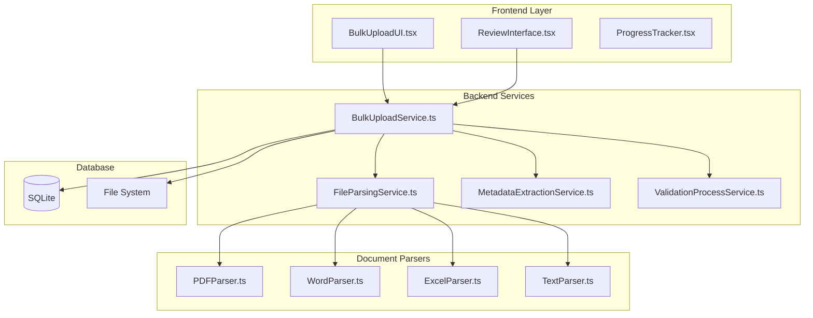

# Sistema de Upload em Massa - Especificação Técnica de Integração

## 📋 Objetivo
Implementar sistema completo de upload em massa para migração da Knowledge Base existente, suportando arquivos PDF, Word (DOCX), Excel (XLSX) e TXT conforme **Requisito #3**.

---

## 🎯 Requisitos Funcionais

### RF-001: Interface de Upload
- **Drag & Drop** para múltiplos arquivos
- **Seleção manual** via file picker
- **Preview** dos arquivos antes do upload
- **Validação** de tipo e tamanho de arquivo
- **Progress bar** durante processamento

### RF-002: Parsing de Documentos
- **PDF**: Extração de texto com OCR quando necessário
- **Word (DOCX)**: Extração de texto e metadados
- **Excel (XLSX)**: Processamento de planilhas com múltiplas abas
- **TXT**: Processamento de texto plano com encoding detection

### RF-003: Extração de Metadados
- **Título**: Auto-detecção ou extração de cabeçalho
- **Categoria**: Classificação automática baseada em keywords
- **Prioridade**: Inferência baseada em conteúdo
- **Tags**: Extração de palavras-chave técnicas

### RF-004: Estado e Workflow
- **Estado inicial**: `em_revisao` para todos os uploads em massa
- **Fila de revisão**: Interface para aprovar/rejeitar uploads
- **Transição automática**: Para `aberto` após aprovação

---

## 🏗️ Arquitetura de Implementação

### Componentes Principais



---

## 📱 Frontend Implementation

### 1. BulkUploadUI.tsx

```typescript
interface BulkUploadUIProps {
  onUploadComplete: (results: BulkUploadResult[]) => void;
  onError: (error: BulkUploadError) => void;
  maxFiles?: number;
  maxFileSize?: number; // em MB
}

interface BulkUploadState {
  files: UploadFile[];
  uploadProgress: Record<string, number>;
  validationResults: ValidationResult[];
  isUploading: boolean;
  currentPhase: 'selection' | 'validation' | 'parsing' | 'importing' | 'complete';
}

const BulkUploadUI: React.FC<BulkUploadUIProps> = ({
  onUploadComplete,
  onError,
  maxFiles = 50,
  maxFileSize = 100 // 100MB
}) => {
  const [state, setState] = useState<BulkUploadState>({
    files: [],
    uploadProgress: {},
    validationResults: [],
    isUploading: false,
    currentPhase: 'selection'
  });

  // Drag & Drop handlers
  const onDrop = useCallback((acceptedFiles: File[]) => {
    const validFiles = acceptedFiles.filter(file =>
      validateFileType(file) && validateFileSize(file, maxFileSize)
    );

    setState(prev => ({
      ...prev,
      files: [...prev.files, ...validFiles.map(f => ({
        file: f,
        id: generateFileId(),
        status: 'pending' as const,
        preview: generatePreview(f)
      }))]
    }));
  }, [maxFileSize]);

  // Upload processing
  const handleUpload = useCallback(async () => {
    setState(prev => ({ ...prev, isUploading: true, currentPhase: 'validation' }));

    try {
      // Phase 1: Validate all files
      const validationResults = await Promise.all(
        state.files.map(f => window.electron.incident.validateFile(f.file))
      );

      setState(prev => ({
        ...prev,
        validationResults,
        currentPhase: 'parsing'
      }));

      // Phase 2: Parse documents
      const parseResults = await window.electron.incident.bulkParseDocuments(
        state.files.filter((_, i) => validationResults[i].isValid),
        {
          onProgress: (fileId, progress) => {
            setState(prev => ({
              ...prev,
              uploadProgress: { ...prev.uploadProgress, [fileId]: progress }
            }));
          }
        }
      );

      setState(prev => ({ ...prev, currentPhase: 'importing' }));

      // Phase 3: Import to database
      const importResults = await window.electron.incident.bulkImport(parseResults);

      setState(prev => ({ ...prev, currentPhase: 'complete' }));

      onUploadComplete(importResults);
    } catch (error) {
      onError(error as BulkUploadError);
    } finally {
      setState(prev => ({ ...prev, isUploading: false }));
    }
  }, [state.files, onUploadComplete, onError]);

  const { getRootProps, getInputProps, isDragActive } = useDropzone({
    onDrop,
    accept: {
      'application/pdf': ['.pdf'],
      'application/vnd.openxmlformats-officedocument.wordprocessingml.document': ['.docx'],
      'application/vnd.openxmlformats-officedocument.spreadsheetml.sheet': ['.xlsx'],
      'text/plain': ['.txt']
    },
    maxFiles,
    maxSize: maxFileSize * 1024 * 1024
  });

  return (
    <div className="bulk-upload-container">
      {/* Phase: File Selection */}
      {state.currentPhase === 'selection' && (
        <div className="upload-zone">
          <div {...getRootProps()} className={`dropzone ${isDragActive ? 'active' : ''}`}>
            <input {...getInputProps()} />
            <div className="dropzone-content">
              <Upload className="dropzone-icon" size={48} />
              <h3>Arraste arquivos aqui ou clique para selecionar</h3>
              <p>Suporte para PDF, Word (.docx), Excel (.xlsx) e TXT</p>
              <p className="text-sm text-gray-500">
                Máximo {maxFiles} arquivos, {maxFileSize}MB cada
              </p>
            </div>
          </div>

          {/* File List Preview */}
          {state.files.length > 0 && (
            <div className="files-preview">
              <h4>Arquivos selecionados ({state.files.length})</h4>
              <div className="files-grid">
                {state.files.map((uploadFile) => (
                  <FilePreviewCard
                    key={uploadFile.id}
                    file={uploadFile}
                    onRemove={(id) => removeFile(id)}
                  />
                ))}
              </div>

              <div className="upload-actions">
                <Button onClick={handleUpload} size="lg" disabled={state.files.length === 0}>
                  <Upload className="mr-2" size={16} />
                  Iniciar Upload ({state.files.length} arquivos)
                </Button>
              </div>
            </div>
          )}
        </div>
      )}

      {/* Phase: Processing */}
      {['validation', 'parsing', 'importing'].includes(state.currentPhase) && (
        <ProcessingPhase
          phase={state.currentPhase}
          files={state.files}
          progress={state.uploadProgress}
          validationResults={state.validationResults}
        />
      )}

      {/* Phase: Complete */}
      {state.currentPhase === 'complete' && (
        <CompletionSummary
          results={state.uploadResults}
          onStartReview={() => navigateToReview()}
          onUploadMore={() => resetUpload()}
        />
      )}
    </div>
  );
};
```

### 2. FilePreviewCard.tsx

```typescript
interface FilePreviewCardProps {
  file: UploadFile;
  onRemove: (id: string) => void;
}

const FilePreviewCard: React.FC<FilePreviewCardProps> = ({ file, onRemove }) => {
  const getFileIcon = (fileName: string) => {
    const ext = fileName.split('.').pop()?.toLowerCase();
    switch (ext) {
      case 'pdf': return <FileText className="text-red-600" />;
      case 'docx': return <FileText className="text-blue-600" />;
      case 'xlsx': return <Table className="text-green-600" />;
      case 'txt': return <FileText className="text-gray-600" />;
      default: return <File className="text-gray-400" />;
    }
  };

  return (
    <div className="file-preview-card">
      <div className="file-header">
        {getFileIcon(file.file.name)}
        <div className="file-info">
          <h5 className="file-name" title={file.file.name}>
            {file.file.name}
          </h5>
          <span className="file-size">
            {formatFileSize(file.file.size)}
          </span>
        </div>
        <Button
          variant="ghost"
          size="sm"
          onClick={() => onRemove(file.id)}
          className="remove-button"
        >
          <X size={16} />
        </Button>
      </div>

      {file.preview && (
        <div className="file-preview">
          <pre className="preview-text">
            {file.preview.substring(0, 200)}...
          </pre>
        </div>
      )}

      <div className="file-status">
        <StatusBadge status={file.status} size="sm" />
        {file.error && (
          <span className="error-message" title={file.error}>
            {file.error}
          </span>
        )}
      </div>
    </div>
  );
};
```

### 3. ProcessingPhase.tsx

```typescript
interface ProcessingPhaseProps {
  phase: 'validation' | 'parsing' | 'importing';
  files: UploadFile[];
  progress: Record<string, number>;
  validationResults: ValidationResult[];
}

const ProcessingPhase: React.FC<ProcessingPhaseProps> = ({
  phase,
  files,
  progress,
  validationResults
}) => {
  const getPhaseTitle = (phase: string) => {
    switch (phase) {
      case 'validation': return 'Validando arquivos...';
      case 'parsing': return 'Extraindo conteúdo...';
      case 'importing': return 'Importando para base de dados...';
      default: return 'Processando...';
    }
  };

  const overallProgress = useMemo(() => {
    const totalFiles = files.length;
    const completedFiles = Object.values(progress).filter(p => p === 100).length;
    return Math.floor((completedFiles / totalFiles) * 100);
  }, [files.length, progress]);

  return (
    <div className="processing-phase">
      <div className="phase-header">
        <div className="phase-icon">
          <Loader2 className="animate-spin" size={32} />
        </div>
        <div className="phase-info">
          <h3>{getPhaseTitle(phase)}</h3>
          <div className="progress-bar">
            <div
              className="progress-fill"
              style={{ width: `${overallProgress}%` }}
            />
          </div>
          <span className="progress-text">
            {overallProgress}% - {Object.keys(progress).length} de {files.length} arquivos
          </span>
        </div>
      </div>

      <div className="files-processing">
        {files.map((file, index) => (
          <div key={file.id} className="file-processing-item">
            <div className="file-info">
              {getFileIcon(file.file.name)}
              <span className="file-name">{file.file.name}</span>
            </div>

            <div className="file-progress">
              {progress[file.id] !== undefined ? (
                <div className="progress-indicator">
                  <div className="progress-bar-small">
                    <div
                      className="progress-fill-small"
                      style={{ width: `${progress[file.id]}%` }}
                    />
                  </div>
                  <span className="progress-percent">
                    {progress[file.id]}%
                  </span>
                </div>
              ) : (
                <div className="status-indicator">
                  {validationResults[index]?.isValid === false ? (
                    <AlertTriangle className="text-red-500" size={16} />
                  ) : (
                    <Clock className="text-gray-400" size={16} />
                  )}
                </div>
              )}
            </div>

            {validationResults[index]?.error && (
              <div className="error-message">
                {validationResults[index].error}
              </div>
            )}
          </div>
        ))}
      </div>
    </div>
  );
};
```

---

## 🔧 Backend Services Implementation

### 1. BulkUploadService.ts

```typescript
import { promises as fs } from 'fs';
import path from 'path';
import { v4 as uuidv4 } from 'uuid';

interface BulkUploadService {
  validateFile(file: Buffer, filename: string): Promise<ValidationResult>;
  parseDocument(file: Buffer, filename: string): Promise<ParsedIncident>;
  bulkImport(incidents: ParsedIncident[]): Promise<BulkImportResult>;
  createUploadSession(): Promise<string>;
  getUploadProgress(sessionId: string): Promise<ProgressInfo>;
}

class BulkUploadServiceImpl implements BulkUploadService {
  private uploadSessions = new Map<string, UploadSession>();
  private parsers: Record<string, DocumentParser>;

  constructor(
    private database: Database,
    private fileParsingService: FileParsingService,
    private metadataService: MetadataExtractionService
  ) {
    this.parsers = {
      '.pdf': new PDFParser(),
      '.docx': new WordParser(),
      '.xlsx': new ExcelParser(),
      '.txt': new TextParser()
    };
  }

  async validateFile(file: Buffer, filename: string): Promise<ValidationResult> {
    const extension = path.extname(filename).toLowerCase();

    // Check supported file types
    if (!this.parsers[extension]) {
      return {
        isValid: false,
        error: `Tipo de arquivo não suportado: ${extension}`,
        details: {
          supportedTypes: ['.pdf', '.docx', '.xlsx', '.txt']
        }
      };
    }

    // Check file size (max 100MB)
    if (file.length > 100 * 1024 * 1024) {
      return {
        isValid: false,
        error: 'Arquivo muito grande. Máximo 100MB permitido.',
        details: { actualSize: file.length, maxSize: 100 * 1024 * 1024 }
      };
    }

    // Check file integrity
    try {
      await this.parsers[extension].validate(file);
      return { isValid: true };
    } catch (error) {
      return {
        isValid: false,
        error: `Arquivo corrompido ou inválido: ${error.message}`,
        details: { validationError: error.message }
      };
    }
  }

  async parseDocument(file: Buffer, filename: string): Promise<ParsedIncident> {
    const extension = path.extname(filename).toLowerCase();
    const parser = this.parsers[extension];

    if (!parser) {
      throw new Error(`No parser available for ${extension}`);
    }

    try {
      // Extract raw content
      const rawContent = await parser.extract(file);

      // Extract metadata
      const metadata = await this.metadataService.extractFromContent(
        rawContent,
        filename
      );

      // Validate and clean data
      const cleanedData = this.cleanAndValidateData({
        ...rawContent,
        ...metadata,
        originalFilename: filename,
        parseTimestamp: new Date()
      });

      return cleanedData;
    } catch (error) {
      throw new Error(`Failed to parse ${filename}: ${error.message}`);
    }
  }

  async bulkImport(incidents: ParsedIncident[]): Promise<BulkImportResult> {
    const importId = uuidv4();
    const results: ImportResultItem[] = [];

    // Create bulk upload record
    await this.database.prepare(`
      INSERT INTO bulk_uploads (
        id, filename, file_count, status, created_at
      ) VALUES (?, ?, ?, ?, ?)
    `).run(importId, 'bulk_import', incidents.length, 'importing', new Date().toISOString());

    // Process each incident
    for (const [index, incident] of incidents.entries()) {
      try {
        // Generate unique incident ID
        const incidentId = this.generateIncidentId();

        // Insert incident with 'em_revisao' status
        await this.database.prepare(`
          INSERT INTO incidents (
            id, title, description, category, priority, status,
            created_via, original_filename, created_at, updated_at
          ) VALUES (?, ?, ?, ?, ?, 'em_revisao', 'bulk_upload', ?, ?, ?)
        `).run(
          incidentId,
          incident.title,
          incident.description,
          incident.category || 'Other',
          incident.priority || 'P3',
          incident.originalFilename,
          new Date().toISOString(),
          new Date().toISOString()
        );

        // Log the import action
        await this.database.prepare(`
          INSERT INTO incident_action_logs (
            incident_id, action_type, action_name, details, timestamp
          ) VALUES (?, 'SYSTEM_ACTION', 'bulk_import', ?, ?)
        `).run(
          incidentId,
          JSON.stringify({
            source: 'bulk_upload',
            filename: incident.originalFilename,
            confidence_score: incident.confidence || 0,
            extracted_metadata: incident.metadata
          }),
          new Date().toISOString()
        );

        results.push({
          index,
          incidentId,
          status: 'success',
          filename: incident.originalFilename,
          title: incident.title
        });

      } catch (error) {
        results.push({
          index,
          status: 'error',
          error: error.message,
          filename: incident.originalFilename
        });
      }
    }

    // Update bulk upload status
    const successCount = results.filter(r => r.status === 'success').length;
    const failureCount = results.length - successCount;

    await this.database.prepare(`
      UPDATE bulk_uploads
      SET status = ?, success_count = ?, failure_count = ?, completed_at = ?
      WHERE id = ?
    `).run(
      failureCount === 0 ? 'completed' : 'partial_failure',
      successCount,
      failureCount,
      new Date().toISOString(),
      importId
    );

    return {
      importId,
      totalProcessed: incidents.length,
      successCount,
      failureCount,
      results
    };
  }

  private cleanAndValidateData(rawData: any): ParsedIncident {
    return {
      title: this.cleanTitle(rawData.title || rawData.filename),
      description: this.cleanDescription(rawData.content),
      category: this.inferCategory(rawData.content, rawData.filename),
      priority: this.inferPriority(rawData.content),
      tags: this.extractTags(rawData.content),
      confidence: rawData.confidence || 0.7,
      metadata: {
        originalFilename: rawData.originalFilename,
        fileSize: rawData.fileSize,
        parseTimestamp: rawData.parseTimestamp,
        extractedFields: rawData.extractedFields || {}
      },
      originalFilename: rawData.originalFilename
    };
  }

  private cleanTitle(title: string): string {
    // Remove file extensions, clean special chars, limit length
    return title
      .replace(/\.[^/.]+$/, '') // Remove extension
      .replace(/[^\w\s-]/g, ' ') // Clean special chars
      .replace(/\s+/g, ' ')      // Normalize spaces
      .trim()
      .substring(0, 255);        // Limit length
  }

  private cleanDescription(content: string): string {
    // Clean and truncate content for description
    return content
      .replace(/\s+/g, ' ')      // Normalize whitespace
      .trim()
      .substring(0, 2000);       // Limit length
  }

  private inferCategory(content: string, filename: string): string {
    const text = `${content} ${filename}`.toLowerCase();

    const categoryKeywords = {
      'JCL': ['jcl', 'job', 'step', 'proc', 'joblib', 'steplib'],
      'DB2': ['db2', 'sql', 'database', 'table', 'query', 'bind'],
      'VSAM': ['vsam', 'dataset', 'cluster', 'ksds', 'esds', 'rrds'],
      'CICS': ['cics', 'transaction', 'program', 'mapset', 'bms'],
      'Batch': ['batch', 'cobol', 'program', 'abend', 'sort'],
      'Network': ['network', 'connection', 'tcp', 'ip', 'port'],
      'Hardware': ['hardware', 'cpu', 'memory', 'disk', 'storage'],
      'Security': ['security', 'access', 'auth', 'permission', 'racf']
    };

    for (const [category, keywords] of Object.entries(categoryKeywords)) {
      if (keywords.some(keyword => text.includes(keyword))) {
        return category;
      }
    }

    return 'Other';
  }

  private inferPriority(content: string): string {
    const text = content.toLowerCase();

    const priorityKeywords = {
      'P1': ['critical', 'urgent', 'emergency', 'production down', 'outage'],
      'P2': ['high', 'important', 'priority', 'asap'],
      'P3': ['medium', 'normal', 'standard'],
      'P4': ['low', 'minor', 'enhancement']
    };

    for (const [priority, keywords] of Object.entries(priorityKeywords)) {
      if (keywords.some(keyword => text.includes(keyword))) {
        return priority;
      }
    }

    return 'P3'; // Default medium priority
  }

  private extractTags(content: string): string[] {
    const text = content.toLowerCase();
    const tags: string[] = [];

    // Technical tags
    const technicalKeywords = [
      'abend', 's0c4', 's0c7', 'oc4', 'oc7', 'soc4', 'soc7',
      'timeout', 'deadlock', 'connection', 'pool', 'memory',
      'cpu', 'performance', 'slow', 'error', 'exception'
    ];

    technicalKeywords.forEach(keyword => {
      if (text.includes(keyword)) {
        tags.push(keyword);
      }
    });

    // Mainframe-specific tags
    const mainframeKeywords = [
      'mainframe', 'zos', 'mvs', 'tso', 'ispf', 'sdsf',
      'jes2', 'jes3', 'vtam', 'tcpip', 'omvs'
    ];

    mainframeKeywords.forEach(keyword => {
      if (text.includes(keyword)) {
        tags.push(keyword);
      }
    });

    return [...new Set(tags)]; // Remove duplicates
  }

  private generateIncidentId(): string {
    const year = new Date().getFullYear();
    const timestamp = Date.now().toString().slice(-6);
    return `INC-${year}-${timestamp}`;
  }
}
```

### 2. Document Parsers

#### PDFParser.ts
```typescript
import * as pdf from 'pdf-parse';

export class PDFParser implements DocumentParser {
  async validate(buffer: Buffer): Promise<void> {
    try {
      await pdf(buffer);
    } catch (error) {
      throw new Error(`Invalid PDF file: ${error.message}`);
    }
  }

  async extract(buffer: Buffer): Promise<ExtractedContent> {
    try {
      const data = await pdf(buffer);

      return {
        content: data.text,
        title: this.extractTitleFromPDF(data),
        pageCount: data.numpages,
        metadata: {
          info: data.info,
          producer: data.info?.Producer,
          creator: data.info?.Creator,
          creationDate: data.info?.CreationDate
        },
        fileSize: buffer.length,
        extractedFields: {
          hasImages: data.text.length < buffer.length / 100, // Heuristic
          language: this.detectLanguage(data.text)
        }
      };
    } catch (error) {
      throw new Error(`PDF parsing failed: ${error.message}`);
    }
  }

  private extractTitleFromPDF(data: any): string {
    // Try to get title from PDF metadata
    if (data.info?.Title && data.info.Title.trim()) {
      return data.info.Title.trim();
    }

    // Try to extract from first few lines of content
    const lines = data.text.split('\n').filter(line => line.trim());
    if (lines.length > 0) {
      return lines[0].substring(0, 100);
    }

    return 'Untitled PDF Document';
  }

  private detectLanguage(text: string): string {
    // Simple Portuguese detection based on common words
    const portugueseWords = ['que', 'para', 'com', 'não', 'uma', 'por', 'são', 'dos'];
    const words = text.toLowerCase().split(/\s+/);
    const portugueseCount = words.filter(word => portugueseWords.includes(word)).length;

    return portugueseCount > words.length * 0.01 ? 'pt' : 'en';
  }
}
```

#### WordParser.ts
```typescript
import * as mammoth from 'mammoth';

export class WordParser implements DocumentParser {
  async validate(buffer: Buffer): Promise<void> {
    try {
      await mammoth.extractRawText({ buffer });
    } catch (error) {
      throw new Error(`Invalid Word document: ${error.message}`);
    }
  }

  async extract(buffer: Buffer): Promise<ExtractedContent> {
    try {
      const result = await mammoth.convertToHtml({ buffer });
      const textResult = await mammoth.extractRawText({ buffer });

      return {
        content: textResult.value,
        title: this.extractTitleFromWord(textResult.value),
        htmlContent: result.value,
        metadata: {
          warnings: result.messages,
          hasImages: result.value.includes(' line.trim());
    if (lines.length > 0) {
      // Use first significant line as title
      const title = lines[0].trim();
      return title.length > 5 ? title.substring(0, 100) : `Documento Word`;
    }
    return 'Documento Word Sem Título';
  }

  private detectLanguage(text: string): string {
    const portugueseWords = ['que', 'para', 'com', 'não', 'uma', 'por', 'são', 'dos', 'problema', 'solução'];
    const words = text.toLowerCase().split(/\s+/);
    const portugueseCount = words.filter(word => portugueseWords.includes(word)).length;

    return portugueseCount > words.length * 0.01 ? 'pt' : 'en';
  }
}
```

#### ExcelParser.ts
```typescript
import * as XLSX from 'xlsx';

export class ExcelParser implements DocumentParser {
  async validate(buffer: Buffer): Promise<void> {
    try {
      XLSX.read(buffer);
    } catch (error) {
      throw new Error(`Invalid Excel file: ${error.message}`);
    }
  }

  async extract(buffer: Buffer): Promise<ExtractedContent[]> {
    try {
      const workbook = XLSX.read(buffer);
      const incidents: ExtractedContent[] = [];

      // Process each worksheet
      for (const sheetName of workbook.SheetNames) {
        const worksheet = workbook.Sheets[sheetName];
        const data = XLSX.utils.sheet_to_json(worksheet, { header: 1 });

        // Skip empty sheets
        if (data.length <= 1) continue;

        // Try to identify columns
        const headers = (data[0] as string[]).map(h => h?.toString().toLowerCase() || '');
        const titleCol = this.findColumn(headers, ['título', 'title', 'nome', 'name', 'assunto']);
        const descCol = this.findColumn(headers, ['descrição', 'description', 'problema', 'problem', 'detalhe']);
        const catCol = this.findColumn(headers, ['categoria', 'category', 'tipo', 'type']);
        const prioCol = this.findColumn(headers, ['prioridade', 'priority', 'urgencia', 'urgency']);

        // Process data rows
        for (let i = 1; i < data.length; i++) {
          const row = data[i] as string[];
          if (!row || row.every(cell => !cell)) continue; // Skip empty rows

          const title = titleCol >= 0 ? row[titleCol] : `Incidente da linha ${i}`;
          const description = descCol >= 0 ? row[descCol] : row.join(' | ');

          if (title && description) {
            incidents.push({
              content: description,
              title: title.substring(0, 255),
              category: catCol >= 0 ? row[catCol] : undefined,
              priority: prioCol >= 0 ? row[prioCol] : undefined,
              metadata: {
                sheetName,
                rowIndex: i,
                originalRow: row,
                detectedColumns: {
                  title: titleCol,
                  description: descCol,
                  category: catCol,
                  priority: prioCol
                }
              },
              fileSize: buffer.length,
              extractedFields: {
                sourceSheet: sheetName,
                totalSheets: workbook.SheetNames.length,
                hasMultipleIncidents: true
              }
            });
          }
        }
      }

      // If no structured data found, treat as single incident
      if (incidents.length === 0) {
        const allText = workbook.SheetNames
          .map(name => XLSX.utils.sheet_to_csv(workbook.Sheets[name]))
          .join('\n\n');

        incidents.push({
          content: allText,
          title: 'Dados de Planilha Excel',
          fileSize: buffer.length,
          metadata: {
            sheetsProcessed: workbook.SheetNames,
            processingMode: 'fallback_text'
          },
          extractedFields: {
            totalSheets: workbook.SheetNames.length,
            hasStructuredData: false
          }
        });
      }

      return incidents;
    } catch (error) {
      throw new Error(`Excel parsing failed: ${error.message}`);
    }
  }

  private findColumn(headers: string[], possibleNames: string[]): number {
    for (const name of possibleNames) {
      const index = headers.findIndex(h => h.includes(name));
      if (index >= 0) return index;
    }
    return -1;
  }
}
```

#### TextParser.ts
```typescript
import * as iconv from 'iconv-lite';
import * as chardet from 'chardet';

export class TextParser implements DocumentParser {
  async validate(buffer: Buffer): Promise<void> {
    // Text files are generally always valid
    if (buffer.length === 0) {
      throw new Error('Empty text file');
    }
  }

  async extract(buffer: Buffer): Promise<ExtractedContent> {
    try {
      // Detect encoding
      const encoding = chardet.detect(buffer) || 'utf8';

      // Convert to UTF-8
      const content = iconv.decode(buffer, encoding);

      return {
        content: content,
        title: this.extractTitleFromText(content),
        metadata: {
          detectedEncoding: encoding,
          lineCount: content.split('\n').length,
          charCount: content.length
        },
        fileSize: buffer.length,
        extractedFields: {
          encoding: encoding,
          hasStructuredData: this.detectStructuredData(content),
          language: this.detectLanguage(content)
        }
      };
    } catch (error) {
      throw new Error(`Text file parsing failed: ${error.message}`);
    }
  }

  private extractTitleFromText(content: string): string {
    const lines = content.split('\n').filter(line => line.trim());

    if (lines.length > 0) {
      const firstLine = lines[0].trim();

      // Check if first line looks like a title (short, no special formatting)
      if (firstLine.length <= 100 && !firstLine.includes(':') && !firstLine.includes('=')) {
        return firstLine;
      }

      // Look for title markers
      const titleMarkers = ['título:', 'title:', 'assunto:', 'subject:'];
      for (const line of lines.slice(0, 10)) {
        const lowerLine = line.toLowerCase();
        for (const marker of titleMarkers) {
          if (lowerLine.includes(marker)) {
            const title = line.substring(line.toLowerCase().indexOf(marker) + marker.length).trim();
            if (title.length > 0) return title.substring(0, 100);
          }
        }
      }

      // Fallback to first line
      return firstLine.substring(0, 100);
    }

    return 'Arquivo de Texto';
  }

  private detectStructuredData(content: string): boolean {
    const lines = content.split('\n');

    // Check for common structured patterns
    const hasKeyValuePairs = lines.some(line => /^[^:]+:\s*.+$/.test(line.trim()));
    const hasTableStructure = lines.some(line => line.includes('|') || line.includes('\t'));
    const hasSections = lines.some(line => /^\s*\d+\.\s+/.test(line) || /^#+\s+/.test(line));

    return hasKeyValuePairs || hasTableStructure || hasSections;
  }

  private detectLanguage(text: string): string {
    const portugueseWords = [
      'que', 'para', 'com', 'não', 'uma', 'por', 'são', 'dos', 'das', 'problema',
      'solução', 'sistema', 'erro', 'falha', 'aplicação', 'dados'
    ];

    const words = text.toLowerCase().split(/\s+/);
    const totalWords = words.length;
    const portugueseCount = words.filter(word => portugueseWords.includes(word)).length;

    return portugueseCount > totalWords * 0.02 ? 'pt' : 'en';
  }
}
```

---

## 🗃️ Database Schema Extensions

### Bulk Upload Tables

```sql
-- Tabela para tracking de uploads em massa
CREATE TABLE IF NOT EXISTS bulk_uploads (
    id TEXT PRIMARY KEY,
    filename TEXT,
    file_count INTEGER NOT NULL,
    status TEXT NOT NULL CHECK(status IN (
        'uploading', 'parsing', 'validating', 'importing',
        'completed', 'failed', 'partial_failure'
    )),
    success_count INTEGER DEFAULT 0,
    failure_count INTEGER DEFAULT 0,
    created_at DATETIME DEFAULT CURRENT_TIMESTAMP,
    completed_at DATETIME,
    error_details TEXT, -- JSON com detalhes dos erros
    processing_stats TEXT -- JSON com estatísticas do processamento
);

-- Detalhes dos arquivos individuais no upload
CREATE TABLE IF NOT EXISTS bulk_upload_files (
    id INTEGER PRIMARY KEY AUTOINCREMENT,
    upload_id TEXT NOT NULL,
    original_filename TEXT NOT NULL,
    file_size INTEGER,
    file_type TEXT,
    status TEXT CHECK(status IN ('pending', 'processing', 'completed', 'failed')),
    incident_id TEXT, -- Link para incident criado
    error_message TEXT,
    processing_time_ms INTEGER,
    confidence_score REAL,
    extracted_metadata TEXT, -- JSON

    FOREIGN KEY (upload_id) REFERENCES bulk_uploads(id) ON DELETE CASCADE,
    FOREIGN KEY (incident_id) REFERENCES incidents(id) ON DELETE SET NULL
);

-- Extend incidents table
ALTER TABLE incidents ADD COLUMN created_via TEXT CHECK(created_via IN (
    'manual', 'bulk_upload', 'api_integration'
)) DEFAULT 'manual';

ALTER TABLE incidents ADD COLUMN original_filename TEXT;
ALTER TABLE incidents ADD COLUMN confidence_score REAL;
ALTER TABLE incidents ADD COLUMN extraction_metadata TEXT; -- JSON

-- Indexes para performance
CREATE INDEX IF NOT EXISTS idx_bulk_uploads_status ON bulk_uploads(status, created_at DESC);
CREATE INDEX IF NOT EXISTS idx_bulk_upload_files_upload ON bulk_upload_files(upload_id, status);
CREATE INDEX IF NOT EXISTS idx_incidents_created_via ON incidents(created_via, status, created_at DESC);
```

---

## 🔄 IPC Integration

### IPC Handlers Extension

```typescript
// Add to IncidentHandler.ts

// Bulk upload handlers
ipcMain.handle('incident:validateFile', async (event, fileData) => {
  try {
    const buffer = Buffer.from(fileData.content, 'base64');
    return await this.bulkUploadService.validateFile(buffer, fileData.filename);
  } catch (error) {
    console.error('Error in incident:validateFile:', error);
    throw error;
  }
});

ipcMain.handle('incident:bulkParseDocuments', async (event, files, options) => {
  try {
    const results = [];
    for (const [index, fileData] of files.entries()) {
      const buffer = Buffer.from(fileData.content, 'base64');

      // Progress callback
      if (options.onProgress) {
        options.onProgress(fileData.id, 0);
      }

      const parsed = await this.bulkUploadService.parseDocument(buffer, fileData.filename);

      if (options.onProgress) {
        options.onProgress(fileData.id, 100);
      }

      results.push(parsed);
    }
    return results;
  } catch (error) {
    console.error('Error in incident:bulkParseDocuments:', error);
    throw error;
  }
});

ipcMain.handle('incident:bulkImport', async (event, incidents) => {
  try {
    return await this.bulkUploadService.bulkImport(incidents);
  } catch (error) {
    console.error('Error in incident:bulkImport:', error);
    throw error;
  }
});

ipcMain.handle('incident:getBulkUploads', async (event, filters) => {
  try {
    return await this.getBulkUploads(filters);
  } catch (error) {
    console.error('Error in incident:getBulkUploads:', error);
    throw error;
  }
});

ipcMain.handle('incident:getBulkUploadDetails', async (event, uploadId) => {
  try {
    return await this.getBulkUploadDetails(uploadId);
  } catch (error) {
    console.error('Error in incident:getBulkUploadDetails:', error);
    throw error;
  }
});
```

---

## 🎯 Interface de Revisão

### ReviewInterface.tsx

```typescript
interface ReviewInterfaceProps {
  uploadId: string;
  onReviewComplete: (results: ReviewResult[]) => void;
}

const ReviewInterface: React.FC<ReviewInterfaceProps> = ({
  uploadId,
  onReviewComplete
}) => {
  const [uploadDetails, setUploadDetails] = useState<BulkUploadDetails | null>(null);
  const [incidents, setIncidents] = useState<IncidentForReview[]>([]);
  const [selectedIncidents, setSelectedIncidents] = useState<Set<string>>(new Set());
  const [reviewActions, setReviewActions] = useState<Record<string, ReviewAction>>({});

  useEffect(() => {
    loadUploadDetails();
  }, [uploadId]);

  const loadUploadDetails = async () => {
    try {
      const details = await window.electron.incident.getBulkUploadDetails(uploadId);
      setUploadDetails(details);

      // Load incidents pending review
      const pendingIncidents = await window.electron.incident.getIncidents({
        status: ['em_revisao'],
        created_via: ['bulk_upload']
      });

      setIncidents(pendingIncidents);
    } catch (error) {
      console.error('Failed to load upload details:', error);
    }
  };

  const handleBulkReview = async (action: 'approve' | 'reject') => {
    const selectedIds = Array.from(selectedIncidents);
    const results: ReviewResult[] = [];

    for (const incidentId of selectedIds) {
      try {
        if (action === 'approve') {
          await window.electron.incident.updateStatus(
            incidentId,
            'open',
            'Aprovado na revisão de upload em massa'
          );
          results.push({ incidentId, action: 'approved', success: true });
        } else {
          await window.electron.incident.updateStatus(
            incidentId,
            'rejected',
            'Rejeitado na revisão de upload em massa'
          );
          results.push({ incidentId, action: 'rejected', success: true });
        }
      } catch (error) {
        results.push({
          incidentId,
          action,
          success: false,
          error: error.message
        });
      }
    }

    onReviewComplete(results);
  };

  return (
    <div className="review-interface">
      <div className="review-header">
        <h2>Revisão de Upload em Massa</h2>
        <div className="upload-info">
          <Badge variant="outline">
            {incidents.length} incidentes pendentes
          </Badge>
          <Badge variant="secondary">
            Upload ID: {uploadId}
          </Badge>
        </div>
      </div>

      <div className="review-controls">
        <div className="selection-controls">
          <Button
            variant="outline"
            size="sm"
            onClick={() => setSelectedIncidents(new Set(incidents.map(i => i.id)))}
          >
            Selecionar Todos
          </Button>
          <Button
            variant="outline"
            size="sm"
            onClick={() => setSelectedIncidents(new Set())}
          >
            Limpar Seleção
          </Button>
          <span className="selection-count">
            {selectedIncidents.size} de {incidents.length} selecionados
          </span>
        </div>

        <div className="bulk-actions">
          <Button
            onClick={() => handleBulkReview('approve')}
            disabled={selectedIncidents.size === 0}
            className="bg-green-600 hover:bg-green-700"
          >
            <Check className="mr-2" size={16} />
            Aprovar Selecionados
          </Button>
          <Button
            onClick={() => handleBulkReview('reject')}
            disabled={selectedIncidents.size === 0}
            variant="destructive"
          >
            <X className="mr-2" size={16} />
            Rejeitar Selecionados
          </Button>
        </div>
      </div>

      <div className="incidents-review-list">
        {incidents.map(incident => (
          <IncidentReviewCard
            key={incident.id}
            incident={incident}
            isSelected={selectedIncidents.has(incident.id)}
            onSelect={(id) => {
              const newSelection = new Set(selectedIncidents);
              if (newSelection.has(id)) {
                newSelection.delete(id);
              } else {
                newSelection.add(id);
              }
              setSelectedIncidents(newSelection);
            }}
            onIndividualReview={(id, action) => {
              // Handle individual review
            }}
          />
        ))}
      </div>
    </div>
  );
};
```

---

## 📊 Monitoring e Métricas

### Métricas de Upload em Massa

```typescript
interface BulkUploadMetrics {
  totalUploads: number;
  successRate: number;
  averageProcessingTime: number;
  fileTypesDistribution: Record<string, number>;
  categoriesDistribution: Record<string, number>;
  confidenceScoreDistribution: {
    high: number; // > 0.8
    medium: number; // 0.5 - 0.8
    low: number; // < 0.5
  };
  reviewMetrics: {
    approvalRate: number;
    averageReviewTime: number;
    rejectionReasons: Record<string, number>;
  };
}

// Dashboard widget para métricas
const BulkUploadMetricsWidget: React.FC = () => {
  const [metrics, setMetrics] = useState<BulkUploadMetrics | null>(null);

  useEffect(() => {
    loadMetrics();
  }, []);

  const loadMetrics = async () => {
    const data = await window.electron.incident.getBulkUploadMetrics();
    setMetrics(data);
  };

  return (
    <Card>
      <CardHeader>
        <CardTitle>Upload em Massa - Métricas</CardTitle>
      </CardHeader>
      <CardContent>
        <div className="metrics-grid">
          <div className="metric">
            <h4>Total de Uploads</h4>
            <span className="metric-value">{metrics?.totalUploads}</span>
          </div>
          <div className="metric">
            <h4>Taxa de Sucesso</h4>
            <span className="metric-value">{metrics?.successRate}%</span>
          </div>
          <div className="metric">
            <h4>Tempo Médio</h4>
            <span className="metric-value">{metrics?.averageProcessingTime}s</span>
          </div>
          <div className="metric">
            <h4>Taxa de Aprovação</h4>
            <span className="metric-value">{metrics?.reviewMetrics.approvalRate}%</span>
          </div>
        </div>
      </CardContent>
    </Card>
  );
};
```

---

## 🚀 Roadmap de Implementação

### Fase 1: Base Infrastructure (3-4 semanas)
1. **Document Parsers** (1-2 semanas)
   - Implementar PDF, Word, Excel, TXT parsers
   - Testes unitários para cada parser
   - Validação de arquivos e error handling

2. **Backend Services** (1-2 semanas)
   - BulkUploadService core functionality
   - Database schema extensions
   - IPC handlers para upload

### Fase 2: Frontend Interface (2-3 semanas)
3. **Upload Interface** (1-2 semanas)
   - BulkUploadUI com drag & drop
   - Progress tracking durante processamento
   - Preview de arquivos antes do upload

4. **Review Interface** (1-2 semanas)
   - Interface de revisão em massa
   - Aprovação/rejeição individual e bulk
   - Dashboard de métricas

### Fase 3: Advanced Features (2-3 semanas)
5. **Metadata Extraction** (1-2 semanas)
   - Algoritmos de inferência de categoria
   - Extração de tags automáticas
   - Confidence scoring

6. **Integration & Polish** (1-2 semanas)
   - Integração com sistema de estados
   - Logs categorizados
   - Otimizações de performance

### Fase 4: Testing & Deployment (1-2 semanas)
7. **Testing** (1 semana)
   - Testes end-to-end
   - Testes de carga com arquivos grandes
   - Validação de cenários de erro

8. **Documentation & Training** (1 semana)
   - Documentação de usuário
   - Video tutorials
   - Deployment para produção

---

## 📋 Checklist de Implementação

### Backend Services
- [ ] Implementar PDFParser.ts com pdf-parse
- [ ] Implementar WordParser.ts com mammoth
- [ ] Implementar ExcelParser.ts com xlsx
- [ ] Implementar TextParser.ts com iconv-lite
- [ ] Criar BulkUploadService.ts principal
- [ ] Adicionar tabelas bulk_uploads ao schema
- [ ] Implementar IPC handlers para upload
- [ ] Sistema de validação de arquivos
- [ ] Algoritmos de extração de metadados

### Frontend Components
- [ ] BulkUploadUI.tsx com react-dropzone
- [ ] FilePreviewCard.tsx para preview
- [ ] ProcessingPhase.tsx para progresso
- [ ] ReviewInterface.tsx para aprovação
- [ ] IncidentReviewCard.tsx para revisão individual
- [ ] BulkUploadMetricsWidget.tsx para dashboard

### Database & Schema
- [ ] Tabela bulk_uploads
- [ ] Tabela bulk_upload_files
- [ ] Extend incidents table com campos novos
- [ ] Indexes para performance
- [ ] Views para métricas de upload

### Integration & Testing
- [ ] Integração com sistema de estados
- [ ] Logs categorizados para uploads
- [ ] Testes unitários para parsers
- [ ] Testes end-to-end para fluxo completo
- [ ] Testes de performance com arquivos grandes
- [ ] Validação de segurança (antivírus, tipos)

**Tempo Total Estimado:** 8-12 semanas
**Complexidade:** Alta - Processamento de múltiplos formatos de arquivo
**Prioridade:** Crítica - Bloqueio para migração de KB existente