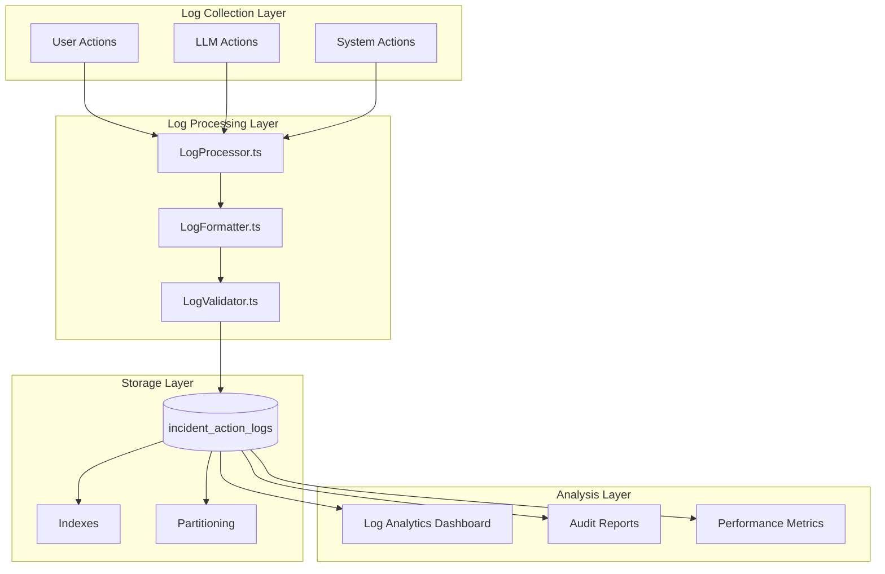

# Sistema de Logs Categorizado - Especificação Técnica

## 📋 Objetivo
Implementar sistema completo de logs categorizados para auditoria e rastreamento de ações no sistema de gestão de incidentes, conforme requisitos implícitos nos **Requisitos #11-19**.

---

## 🎯 Requisitos de Logs por Categoria

### USER_ACTION (Ações do Usuário)
**Todas as ações executadas diretamente por usuários devem ser logadas:**

- **RF-011**: Visualização de detalhes de incidentes relacionados
- **RF-012**: Solicitação de análise inteligente via IA
- **RF-016**: Classificação de soluções propostas (aceitar/rejeitar)
- **RF-017**: Inclusão de comentários ativos no contexto
- **RF-018**: Solicitação de nova análise após rejeição
- **RF-019**: Inativação/reativação de comentários

### LLM_ACTION (Ações do LLM/IA)
**Todas as operações realizadas por sistemas de IA devem ser logadas:**

- **RF-013**: Expansão semântica do contexto técnico/funcional
- **RF-015**: Análise de solução baseada em incidentes relacionados
- **Feedback processing**: Processamento de classificações para melhoria do modelo

### SYSTEM_ACTION (Ações do Sistema)
**Operações automáticas do sistema devem ser logadas:**

- **RF-010**: Busca automática de incidentes relacionados
- **RF-014**: Pesquisa de incidentes com contexto expandido
- **Auto-transições**: Mudanças automáticas de estado
- **Background processes**: Processamentos em segundo plano

---

## 🏗️ Arquitetura do Sistema de Logs

### Estrutura de Dados



---

## 🗃️ Database Schema

### incident_action_logs (Tabela Principal)

```sql
CREATE TABLE IF NOT EXISTS incident_action_logs (
    id INTEGER PRIMARY KEY AUTOINCREMENT,
    incident_id TEXT NOT NULL,
    action_type TEXT NOT NULL CHECK(action_type IN (
        'USER_ACTION',
        'LLM_ACTION',
        'SYSTEM_ACTION'
    )),
    action_name TEXT NOT NULL,
    action_category TEXT, -- Sub-categoria da ação

    -- Context information
    user_id TEXT, -- Para USER_ACTION
    user_email TEXT, -- Para auditoria
    session_id TEXT, -- Para agrupar ações relacionadas
    request_id TEXT, -- Para rastreamento de requests

    -- Action details
    details TEXT NOT NULL, -- JSON com detalhes específicos
    metadata TEXT, -- JSON com metadados adicionais

    -- Timing information
    timestamp DATETIME DEFAULT CURRENT_TIMESTAMP,
    processing_time_ms INTEGER, -- Tempo de processamento

    -- Status and lifecycle
    status TEXT DEFAULT 'completed' CHECK(status IN (
        'initiated', 'processing', 'completed', 'failed', 'cancelled'
    )),
    is_active BOOLEAN DEFAULT TRUE, -- Para soft delete

    -- Error handling
    error_code TEXT,
    error_message TEXT,

    -- Relationships
    parent_log_id INTEGER, -- Para logs hierárquicos
    correlation_id TEXT, -- Para correlacionar logs relacionados

    -- Audit trail
    created_at DATETIME DEFAULT CURRENT_TIMESTAMP,
    updated_at DATETIME DEFAULT CURRENT_TIMESTAMP,

    FOREIGN KEY (incident_id) REFERENCES incidents(id) ON DELETE CASCADE,
    FOREIGN KEY (parent_log_id) REFERENCES incident_action_logs(id) ON DELETE SET NULL
);

-- Tabela para logs de performance por tipo de ação
CREATE TABLE IF NOT EXISTS action_performance_metrics (
    id INTEGER PRIMARY KEY AUTOINCREMENT,
    action_type TEXT NOT NULL,
    action_name TEXT NOT NULL,
    date_period DATE NOT NULL,

    -- Métricas de volume
    total_actions INTEGER DEFAULT 0,
    successful_actions INTEGER DEFAULT 0,
    failed_actions INTEGER DEFAULT 0,
    cancelled_actions INTEGER DEFAULT 0,

    -- Métricas de tempo
    avg_processing_time_ms REAL DEFAULT 0,
    min_processing_time_ms INTEGER DEFAULT 0,
    max_processing_time_ms INTEGER DEFAULT 0,
    p95_processing_time_ms INTEGER DEFAULT 0,
    p99_processing_time_ms INTEGER DEFAULT 0,

    -- Métricas específicas por tipo
    specific_metrics TEXT, -- JSON com métricas específicas

    created_at DATETIME DEFAULT CURRENT_TIMESTAMP,

    UNIQUE(action_type, action_name, date_period)
);

-- Tabela para auditoria de mudanças nos logs
CREATE TABLE IF NOT EXISTS log_audit_trail (
    id INTEGER PRIMARY KEY AUTOINCREMENT,
    log_id INTEGER NOT NULL,
    change_type TEXT NOT NULL CHECK(change_type IN (
        'created', 'updated', 'deactivated', 'reactivated', 'deleted'
    )),
    old_values TEXT, -- JSON com valores anteriores
    new_values TEXT, -- JSON com novos valores
    changed_by TEXT NOT NULL,
    change_reason TEXT,
    timestamp DATETIME DEFAULT CURRENT_TIMESTAMP,

    FOREIGN KEY (log_id) REFERENCES incident_action_logs(id) ON DELETE CASCADE
);

-- Indexes para performance
CREATE INDEX IF NOT EXISTS idx_action_logs_incident ON incident_action_logs(incident_id, action_type, timestamp DESC);
CREATE INDEX IF NOT EXISTS idx_action_logs_type ON incident_action_logs(action_type, action_name, timestamp DESC);
CREATE INDEX IF NOT EXISTS idx_action_logs_user ON incident_action_logs(user_id, timestamp DESC);
CREATE INDEX IF NOT EXISTS idx_action_logs_session ON incident_action_logs(session_id, timestamp ASC);
CREATE INDEX IF NOT EXISTS idx_action_logs_correlation ON incident_action_logs(correlation_id, timestamp ASC);
CREATE INDEX IF NOT EXISTS idx_action_logs_timestamp ON incident_action_logs(timestamp DESC);
CREATE INDEX IF NOT EXISTS idx_action_logs_active ON incident_action_logs(is_active, action_type, timestamp DESC);

-- Index composto para queries analíticas
CREATE INDEX IF NOT EXISTS idx_action_logs_analytics ON incident_action_logs(
    action_type, action_name, status, DATE(timestamp)
);

-- Partitioning por data (SQLite não suporta nativamente, mas podemos simular)
-- Podemos criar views por período para melhor performance
CREATE VIEW IF NOT EXISTS v_action_logs_last_30_days AS
SELECT * FROM incident_action_logs
WHERE timestamp >= datetime('now', '-30 days')
  AND is_active = TRUE;

CREATE VIEW IF NOT EXISTS v_action_logs_current_month AS
SELECT * FROM incident_action_logs
WHERE strftime('%Y-%m', timestamp) = strftime('%Y-%m', 'now')
  AND is_active = TRUE;
```

---

## 🔧 Backend Implementation

### 1. LogService.ts (Core Service)

```typescript
interface LogEntry {
  incidentId: string;
  actionType: 'USER_ACTION' | 'LLM_ACTION' | 'SYSTEM_ACTION';
  actionName: string;
  actionCategory?: string;
  userId?: string;
  userEmail?: string;
  sessionId?: string;
  requestId?: string;
  details: Record<string, any>;
  metadata?: Record<string, any>;
  processingTimeMs?: number;
  status?: 'initiated' | 'processing' | 'completed' | 'failed' | 'cancelled';
  errorCode?: string;
  errorMessage?: string;
  parentLogId?: number;
  correlationId?: string;
}

interface LogSearchFilters {
  incidentId?: string;
  actionType?: string[];
  actionName?: string[];
  userId?: string;
  sessionId?: string;
  correlationId?: string;
  dateFrom?: Date;
  dateTo?: Date;
  status?: string[];
  isActive?: boolean;
}

interface LogAnalytics {
  totalLogs: number;
  logsByType: Record<string, number>;
  logsByStatus: Record<string, number>;
  averageProcessingTime: Record<string, number>;
  topActions: Array<{ action: string; count: number; }>;
  errorRate: number;
  performanceTrends: Array<{ date: string; count: number; avgTime: number; }>;
}

class LogService {
  private database: Database;
  private currentSession: string;
  private currentUser: string;

  constructor(database: Database) {
    this.database = database;
    this.currentSession = this.generateSessionId();
    this.currentUser = 'system'; // Will be set by auth context
  }

  // Main logging method
  async log(entry: LogEntry): Promise<number> {
    const logId = await this.insertLogEntry({
      ...entry,
      sessionId: entry.sessionId || this.currentSession,
      userId: entry.userId || this.currentUser,
      timestamp: new Date()
    });

    // Update performance metrics asynchronously
    this.updatePerformanceMetrics(entry).catch(error => {
      console.error('Error updating performance metrics:', error);
    });

    return logId;
  }

  // Specific logging methods for each action type

  // USER_ACTION logging
  async logUserAction(
    incidentId: string,
    actionName: string,
    details: Record<string, any>,
    userId?: string,
    processingTimeMs?: number
  ): Promise<number> {
    return this.log({
      incidentId,
      actionType: 'USER_ACTION',
      actionName,
      actionCategory: this.categorizeUserAction(actionName),
      details,
      userId,
      userEmail: await this.getUserEmail(userId),
      processingTimeMs,
      status: 'completed'
    });
  }

  // LLM_ACTION logging
  async logLLMAction(
    incidentId: string,
    actionName: string,
    details: Record<string, any>,
    processingTimeMs?: number,
    status: 'completed' | 'failed' = 'completed',
    errorMessage?: string
  ): Promise<number> {
    return this.log({
      incidentId,
      actionType: 'LLM_ACTION',
      actionName,
      actionCategory: this.categorizeLLMAction(actionName),
      details,
      processingTimeMs,
      status,
      errorMessage,
      metadata: {
        model_used: details.model_used,
        confidence_score: details.confidence_score,
        token_count: details.token_count
      }
    });
  }

  // SYSTEM_ACTION logging
  async logSystemAction(
    incidentId: string,
    actionName: string,
    details: Record<string, any>,
    processingTimeMs?: number
  ): Promise<number> {
    return this.log({
      incidentId,
      actionType: 'SYSTEM_ACTION',
      actionName,
      actionCategory: this.categorizeSystemAction(actionName),
      details,
      processingTimeMs,
      status: 'completed'
    });
  }

  // Transaction logging for complex operations
  async logTransaction(
    incidentId: string,
    transactionName: string,
    operations: Array<() => Promise<any>>,
    userId?: string
  ): Promise<{ success: boolean; logIds: number[]; errors: string[]; }> {
    const correlationId = this.generateCorrelationId();
    const logIds: number[] = [];
    const errors: string[] = [];
    const startTime = Date.now();

    // Log transaction start
    const parentLogId = await this.log({
      incidentId,
      actionType: 'SYSTEM_ACTION',
      actionName: `${transactionName}_transaction_start`,
      details: { operations_count: operations.length },
      correlationId,
      userId,
      status: 'initiated'
    });

    try {
      // Execute operations
      for (const [index, operation] of operations.entries()) {
        const opStartTime = Date.now();

        try {
          await operation();

          const opLogId = await this.log({
            incidentId,
            actionType: 'SYSTEM_ACTION',
            actionName: `${transactionName}_operation_${index + 1}`,
            details: { operation_index: index + 1 },
            correlationId,
            parentLogId,
            processingTimeMs: Date.now() - opStartTime,
            status: 'completed'
          });

          logIds.push(opLogId);
        } catch (error) {
          const opLogId = await this.log({
            incidentId,
            actionType: 'SYSTEM_ACTION',
            actionName: `${transactionName}_operation_${index + 1}`,
            details: { operation_index: index + 1 },
            correlationId,
            parentLogId,
            processingTimeMs: Date.now() - opStartTime,
            status: 'failed',
            errorMessage: error.message
          });

          logIds.push(opLogId);
          errors.push(error.message);
        }
      }

      // Log transaction end
      const finalStatus = errors.length === 0 ? 'completed' : 'failed';
      await this.updateLogStatus(parentLogId, finalStatus, {
        total_processing_time_ms: Date.now() - startTime,
        successful_operations: operations.length - errors.length,
        failed_operations: errors.length
      });

      return {
        success: errors.length === 0,
        logIds,
        errors
      };

    } catch (error) {
      await this.updateLogStatus(parentLogId, 'failed', {
        total_processing_time_ms: Date.now() - startTime,
        fatal_error: error.message
      });

      throw error;
    }
  }

  // Query and analysis methods
  async searchLogs(
    filters: LogSearchFilters,
    page = 1,
    pageSize = 50
  ): Promise<{
    logs: LogEntry[];
    totalCount: number;
    page: number;
    pageSize: number;
  }> {
    let query = `
      SELECT * FROM incident_action_logs
      WHERE 1=1
    `;
    const params: any[] = [];

    // Apply filters
    if (filters.incidentId) {
      query += ` AND incident_id = ?`;
      params.push(filters.incidentId);
    }

    if (filters.actionType && filters.actionType.length > 0) {
      query += ` AND action_type IN (${filters.actionType.map(() => '?').join(',')})`;
      params.push(...filters.actionType);
    }

    if (filters.actionName && filters.actionName.length > 0) {
      query += ` AND action_name IN (${filters.actionName.map(() => '?').join(',')})`;
      params.push(...filters.actionName);
    }

    if (filters.userId) {
      query += ` AND user_id = ?`;
      params.push(filters.userId);
    }

    if (filters.sessionId) {
      query += ` AND session_id = ?`;
      params.push(filters.sessionId);
    }

    if (filters.correlationId) {
      query += ` AND correlation_id = ?`;
      params.push(filters.correlationId);
    }

    if (filters.dateFrom) {
      query += ` AND timestamp >= ?`;
      params.push(filters.dateFrom.toISOString());
    }

    if (filters.dateTo) {
      query += ` AND timestamp <= ?`;
      params.push(filters.dateTo.toISOString());
    }

    if (filters.status && filters.status.length > 0) {
      query += ` AND status IN (${filters.status.map(() => '?').join(',')})`;
      params.push(...filters.status);
    }

    if (filters.isActive !== undefined) {
      query += ` AND is_active = ?`;
      params.push(filters.isActive ? 1 : 0);
    }

    // Count total
    const countQuery = query.replace('SELECT *', 'SELECT COUNT(*)') + ' ORDER BY timestamp DESC';
    const totalCount = this.database.prepare(countQuery).get(params) as any;

    // Apply pagination and ordering
    query += ` ORDER BY timestamp DESC LIMIT ? OFFSET ?`;
    params.push(pageSize, (page - 1) * pageSize);

    const logs = this.database.prepare(query).all(params);

    return {
      logs: logs.map(this.transformLogEntry),
      totalCount: totalCount['COUNT(*)'],
      page,
      pageSize
    };
  }

  async getLogAnalytics(
    incidentId?: string,
    timeframe = '30d'
  ): Promise<LogAnalytics> {
    const timeCondition = this.getTimeframeCondition(timeframe);
    const incidentCondition = incidentId ? 'AND incident_id = ?' : '';
    const params = incidentId ? [incidentId] : [];

    // Total logs
    const totalQuery = `
      SELECT COUNT(*) as total FROM incident_action_logs
      WHERE ${timeCondition} ${incidentCondition}
        AND is_active = TRUE
    `;
    const totalResult = this.database.prepare(totalQuery).get(params) as any;

    // Logs by type
    const typeQuery = `
      SELECT action_type, COUNT(*) as count
      FROM incident_action_logs
      WHERE ${timeCondition} ${incidentCondition}
        AND is_active = TRUE
      GROUP BY action_type
    `;
    const typeResults = this.database.prepare(typeQuery).all(params);

    // Logs by status
    const statusQuery = `
      SELECT status, COUNT(*) as count
      FROM incident_action_logs
      WHERE ${timeCondition} ${incidentCondition}
        AND is_active = TRUE
      GROUP BY status
    `;
    const statusResults = this.database.prepare(statusQuery).all(params);

    // Average processing time by action
    const avgTimeQuery = `
      SELECT action_name, AVG(processing_time_ms) as avg_time
      FROM incident_action_logs
      WHERE ${timeCondition} ${incidentCondition}
        AND processing_time_ms IS NOT NULL
        AND is_active = TRUE
      GROUP BY action_name
    `;
    const avgTimeResults = this.database.prepare(avgTimeQuery).all(params);

    // Top actions
    const topActionsQuery = `
      SELECT action_name, COUNT(*) as count
      FROM incident_action_logs
      WHERE ${timeCondition} ${incidentCondition}
        AND is_active = TRUE
      GROUP BY action_name
      ORDER BY count DESC
      LIMIT 10
    `;
    const topActionsResults = this.database.prepare(topActionsQuery).all(params);

    // Error rate
    const errorQuery = `
      SELECT
        COUNT(CASE WHEN status = 'failed' THEN 1 END) as errors,
        COUNT(*) as total
      FROM incident_action_logs
      WHERE ${timeCondition} ${incidentCondition}
        AND is_active = TRUE
    `;
    const errorResult = this.database.prepare(errorQuery).get(params) as any;

    // Performance trends (daily)
    const trendsQuery = `
      SELECT
        DATE(timestamp) as date,
        COUNT(*) as count,
        AVG(processing_time_ms) as avg_time
      FROM incident_action_logs
      WHERE ${timeCondition} ${incidentCondition}
        AND processing_time_ms IS NOT NULL
        AND is_active = TRUE
      GROUP BY DATE(timestamp)
      ORDER BY date DESC
      LIMIT 30
    `;
    const trendsResults = this.database.prepare(trendsQuery).all(params);

    return {
      totalLogs: totalResult.total,
      logsByType: this.transformToRecord(typeResults, 'action_type', 'count'),
      logsByStatus: this.transformToRecord(statusResults, 'status', 'count'),
      averageProcessingTime: this.transformToRecord(avgTimeResults, 'action_name', 'avg_time'),
      topActions: topActionsResults.map(r => ({
        action: r.action_name,
        count: r.count
      })),
      errorRate: errorResult.total > 0 ? (errorResult.errors / errorResult.total) * 100 : 0,
      performanceTrends: trendsResults.map(r => ({
        date: r.date,
        count: r.count,
        avgTime: Math.round(r.avg_time || 0)
      }))
    };
  }

  // Soft delete/reactivate logs
  async deactivateLog(logId: number, reason?: string, changedBy?: string): Promise<void> {
    await this.updateLogActiveStatus(logId, false);

    await this.database.prepare(`
      INSERT INTO log_audit_trail (
        log_id, change_type, change_reason, changed_by
      ) VALUES (?, 'deactivated', ?, ?)
    `).run(logId, reason || 'Manual deactivation', changedBy || 'system');
  }

  async reactivateLog(logId: number, reason?: string, changedBy?: string): Promise<void> {
    await this.updateLogActiveStatus(logId, true);

    await this.database.prepare(`
      INSERT INTO log_audit_trail (
        log_id, change_type, change_reason, changed_by
      ) VALUES (?, 'reactivated', ?, ?)
    `).run(logId, reason || 'Manual reactivation', changedBy || 'system');
  }

  // Export logs for external analysis
  async exportLogs(
    filters: LogSearchFilters,
    format: 'csv' | 'json' = 'json'
  ): Promise<string> {
    const { logs } = await this.searchLogs(filters, 1, 10000); // Large page size for export

    if (format === 'csv') {
      return this.convertToCSV(logs);
    } else {
      return JSON.stringify(logs, null, 2);
    }
  }

  // Private helper methods
  private async insertLogEntry(entry: LogEntry & { timestamp: Date }): Promise<number> {
    const result = this.database.prepare(`
      INSERT INTO incident_action_logs (
        incident_id, action_type, action_name, action_category,
        user_id, user_email, session_id, request_id,
        details, metadata, timestamp, processing_time_ms,
        status, error_code, error_message, parent_log_id,
        correlation_id, is_active
      ) VALUES (?, ?, ?, ?, ?, ?, ?, ?, ?, ?, ?, ?, ?, ?, ?, ?, ?, ?)
    `).run(
      entry.incidentId,
      entry.actionType,
      entry.actionName,
      entry.actionCategory,
      entry.userId,
      entry.userEmail,
      entry.sessionId,
      entry.requestId,
      JSON.stringify(entry.details),
      entry.metadata ? JSON.stringify(entry.metadata) : null,
      entry.timestamp.toISOString(),
      entry.processingTimeMs,
      entry.status || 'completed',
      entry.errorCode,
      entry.errorMessage,
      entry.parentLogId,
      entry.correlationId,
      1 // is_active = true
    );

    return result.lastInsertRowid as number;
  }

  private async updateLogStatus(
    logId: number,
    status: string,
    additionalDetails?: Record<string, any>
  ): Promise<void> {
    const currentLog = this.database.prepare('SELECT details FROM incident_action_logs WHERE id = ?').get(logId) as any;

    if (currentLog) {
      const currentDetails = JSON.parse(currentLog.details);
      const updatedDetails = { ...currentDetails, ...additionalDetails };

      this.database.prepare(`
        UPDATE incident_action_logs
        SET status = ?, details = ?, updated_at = CURRENT_TIMESTAMP
        WHERE id = ?
      `).run(status, JSON.stringify(updatedDetails), logId);
    }
  }

  private async updateLogActiveStatus(logId: number, isActive: boolean): Promise<void> {
    this.database.prepare(`
      UPDATE incident_action_logs
      SET is_active = ?, updated_at = CURRENT_TIMESTAMP
      WHERE id = ?
    `).run(isActive ? 1 : 0, logId);
  }

  private async updatePerformanceMetrics(entry: LogEntry): Promise<void> {
    if (!entry.processingTimeMs) return;

    const today = new Date().toISOString().split('T')[0];

    // Insert or update performance metrics
    this.database.prepare(`
      INSERT INTO action_performance_metrics (
        action_type, action_name, date_period, total_actions,
        successful_actions, failed_actions, avg_processing_time_ms,
        min_processing_time_ms, max_processing_time_ms
      ) VALUES (?, ?, ?, 1, ?, ?, ?, ?, ?)
      ON CONFLICT(action_type, action_name, date_period) DO UPDATE SET
        total_actions = total_actions + 1,
        successful_actions = successful_actions + ?,
        failed_actions = failed_actions + ?,
        avg_processing_time_ms = (avg_processing_time_ms * (total_actions - 1) + ?) / total_actions,
        min_processing_time_ms = MIN(min_processing_time_ms, ?),
        max_processing_time_ms = MAX(max_processing_time_ms, ?)
    `).run(
      entry.actionType,
      entry.actionName,
      today,
      entry.status === 'completed' ? 1 : 0,
      entry.status === 'failed' ? 1 : 0,
      entry.processingTimeMs,
      entry.processingTimeMs,
      entry.processingTimeMs,
      entry.status === 'completed' ? 1 : 0,
      entry.status === 'failed' ? 1 : 0,
      entry.processingTimeMs,
      entry.processingTimeMs,
      entry.processingTimeMs
    );
  }

  // Categorization methods
  private categorizeUserAction(actionName: string): string {
    if (actionName.includes('view') || actionName.includes('open')) return 'navigation';
    if (actionName.includes('edit') || actionName.includes('update')) return 'modification';
    if (actionName.includes('create') || actionName.includes('add')) return 'creation';
    if (actionName.includes('delete') || actionName.includes('remove')) return 'deletion';
    if (actionName.includes('search') || actionName.includes('filter')) return 'search';
    if (actionName.includes('export') || actionName.includes('download')) return 'export';
    return 'other';
  }

  private categorizeLLMAction(actionName: string): string {
    if (actionName.includes('semantic') || actionName.includes('expand')) return 'semantic_analysis';
    if (actionName.includes('solution') || actionName.includes('generate')) return 'solution_generation';
    if (actionName.includes('classify') || actionName.includes('categorize')) return 'classification';
    if (actionName.includes('search') || actionName.includes('find')) return 'search';
    if (actionName.includes('feedback') || actionName.includes('learn')) return 'learning';
    return 'other';
  }

  private categorizeSystemAction(actionName: string): string {
    if (actionName.includes('auto') || actionName.includes('trigger')) return 'automation';
    if (actionName.includes('sync') || actionName.includes('update')) return 'synchronization';
    if (actionName.includes('backup') || actionName.includes('archive')) return 'maintenance';
    if (actionName.includes('notify') || actionName.includes('alert')) return 'notification';
    if (actionName.includes('validate') || actionName.includes('check')) return 'validation';
    return 'other';
  }

  // Utility methods
  private transformLogEntry(row: any): LogEntry {
    return {
      ...row,
      details: JSON.parse(row.details),
      metadata: row.metadata ? JSON.parse(row.metadata) : undefined,
      timestamp: new Date(row.timestamp),
      isActive: Boolean(row.is_active)
    };
  }

  private transformToRecord(results: any[], keyField: string, valueField: string): Record<string, number> {
    return results.reduce((acc, item) => {
      acc[item[keyField]] = item[valueField];
      return acc;
    }, {});
  }

  private getTimeframeCondition(timeframe: string): string {
    switch (timeframe) {
      case '24h': return "timestamp >= datetime('now', '-24 hours')";
      case '7d': return "timestamp >= datetime('now', '-7 days')";
      case '30d': return "timestamp >= datetime('now', '-30 days')";
      case '90d': return "timestamp >= datetime('now', '-90 days')";
      default: return "timestamp >= datetime('now', '-30 days')";
    }
  }

  private generateSessionId(): string {
    return `session_${Date.now()}_${Math.random().toString(36).substring(2, 9)}`;
  }

  private generateCorrelationId(): string {
    return `corr_${Date.now()}_${Math.random().toString(36).substring(2, 9)}`;
  }

  private async getUserEmail(userId?: string): Promise<string | undefined> {
    if (!userId) return undefined;

    // This would integrate with user management system
    // For now, return a placeholder
    return `${userId}@company.com`;
  }

  private convertToCSV(logs: LogEntry[]): string {
    const headers = [
      'id', 'incident_id', 'action_type', 'action_name', 'user_id',
      'timestamp', 'status', 'processing_time_ms', 'details'
    ];

    const csvRows = [headers.join(',')];

    logs.forEach(log => {
      const row = [
        log.id || '',
        log.incidentId,
        log.actionType,
        log.actionName,
        log.userId || '',
        log.timestamp?.toISOString() || '',
        log.status || '',
        log.processingTimeMs || '',
        JSON.stringify(log.details).replace(/"/g, '""')
      ];
      csvRows.push(row.join(','));
    });

    return csvRows.join('\n');
  }
}
```

---

## 📱 Frontend Implementation

### 1. LogAnalyticsDashboard.tsx

```typescript
interface LogAnalyticsDashboardProps {
  incidentId?: string;
  timeframe?: '24h' | '7d' | '30d' | '90d';
  onTimeframeChange?: (timeframe: string) => void;
}

const LogAnalyticsDashboard: React.FC<LogAnalyticsDashboardProps> = ({
  incidentId,
  timeframe = '30d',
  onTimeframeChange
}) => {
  const [analytics, setAnalytics] = useState<LogAnalytics | null>(null);
  const [selectedLogType, setSelectedLogType] = useState<string>('all');
  const [loading, setLoading] = useState(true);

  useEffect(() => {
    loadAnalytics();
  }, [incidentId, timeframe]);

  const loadAnalytics = async () => {
    setLoading(true);
    try {
      const data = await window.electron.incident.getLogAnalytics(incidentId, timeframe);
      setAnalytics(data);
    } catch (error) {
      console.error('Failed to load log analytics:', error);
    } finally {
      setLoading(false);
    }
  };

  if (loading || !analytics) {
    return (
      <Card>
        <CardContent className="p-8 text-center">
          <Loader2 className="animate-spin h-8 w-8 mx-auto mb-4" />
          <p>Carregando analytics de logs...</p>
        </CardContent>
      </Card>
    );
  }

  return (
    <div className="log-analytics-dashboard space-y-6">
      {/* Header with timeframe selector */}
      <div className="flex items-center justify-between">
        <h2 className="text-2xl font-bold">
          Analytics de Logs {incidentId ? `- Incidente ${incidentId}` : '- Visão Geral'}
        </h2>
        <div className="flex items-center gap-4">
          <select
            value={timeframe}
            onChange={(e) => onTimeframeChange?.(e.target.value)}
            className="px-3 py-2 border rounded-md"
          >
            <option value="24h">Últimas 24 horas</option>
            <option value="7d">Últimos 7 dias</option>
            <option value="30d">Últimos 30 dias</option>
            <option value="90d">Últimos 90 dias</option>
          </select>
          <Button onClick={loadAnalytics} variant="outline" size="sm">
            <RefreshCw className="h-4 w-4 mr-2" />
            Atualizar
          </Button>
        </div>
      </div>

      {/* Key Metrics Cards */}
      <div className="grid grid-cols-1 md:grid-cols-4 gap-4">
        <Card>
          <CardContent className="p-6">
            <div className="flex items-center justify-between">
              <div>
                <p className="text-sm font-medium text-gray-600">Total de Logs</p>
                <p className="text-2xl font-bold">{analytics.totalLogs.toLocaleString()}</p>
              </div>
              <FileText className="h-8 w-8 text-blue-600" />
            </div>
          </CardContent>
        </Card>

        <Card>
          <CardContent className="p-6">
            <div className="flex items-center justify-between">
              <div>
                <p className="text-sm font-medium text-gray-600">Taxa de Erro</p>
                <p className="text-2xl font-bold text-red-600">
                  {analytics.errorRate.toFixed(1)}%
                </p>
              </div>
              <AlertTriangle className="h-8 w-8 text-red-600" />
            </div>
          </CardContent>
        </Card>

        <Card>
          <CardContent className="p-6">
            <div className="flex items-center justify-between">
              <div>
                <p className="text-sm font-medium text-gray-600">Ações de Usuário</p>
                <p className="text-2xl font-bold text-green-600">
                  {analytics.logsByType.USER_ACTION || 0}
                </p>
              </div>
              <User className="h-8 w-8 text-green-600" />
            </div>
          </CardContent>
        </Card>

        <Card>
          <CardContent className="p-6">
            <div className="flex items-center justify-between">
              <div>
                <p className="text-sm font-medium text-gray-600">Ações de IA</p>
                <p className="text-2xl font-bold text-purple-600">
                  {analytics.logsByType.LLM_ACTION || 0}
                </p>
              </div>
              <Bot className="h-8 w-8 text-purple-600" />
            </div>
          </CardContent>
        </Card>
      </div>

      {/* Charts Row */}
      <div className="grid grid-cols-1 lg:grid-cols-2 gap-6">
        {/* Logs by Type Chart */}
        <Card>
          <CardHeader>
            <CardTitle>Distribuição por Tipo de Ação</CardTitle>
          </CardHeader>
          <CardContent>
            <LogTypeDistributionChart data={analytics.logsByType} />
          </CardContent>
        </Card>

        {/* Performance Trends Chart */}
        <Card>
          <CardHeader>
            <CardTitle>Tendências de Performance</CardTitle>
          </CardHeader>
          <CardContent>
            <PerformanceTrendsChart data={analytics.performanceTrends} />
          </CardContent>
        </Card>
      </div>

      {/* Top Actions and Status Tables */}
      <div className="grid grid-cols-1 lg:grid-cols-2 gap-6">
        <Card>
          <CardHeader>
            <CardTitle>Top 10 Ações</CardTitle>
          </CardHeader>
          <CardContent>
            <div className="space-y-2">
              {analytics.topActions.map((action, index) => (
                <div key={index} className="flex items-center justify-between p-2 bg-gray-50 rounded">
                  <span className="text-sm font-medium">{action.action}</span>
                  <Badge variant="secondary">{action.count}</Badge>
                </div>
              ))}
            </div>
          </CardContent>
        </Card>

        <Card>
          <CardHeader>
            <CardTitle>Status dos Logs</CardTitle>
          </CardHeader>
          <CardContent>
            <div className="space-y-2">
              {Object.entries(analytics.logsByStatus).map(([status, count]) => (
                <div key={status} className="flex items-center justify-between p-2 bg-gray-50 rounded">
                  <div className="flex items-center gap-2">
                    <div className={`w-3 h-3 rounded-full ${getStatusColor(status)}`} />
                    <span className="text-sm font-medium capitalize">{status}</span>
                  </div>
                  <Badge variant="outline">{count}</Badge>
                </div>
              ))}
            </div>
          </CardContent>
        </Card>
      </div>

      {/* Average Processing Time */}
      <Card>
        <CardHeader>
          <CardTitle>Tempo Médio de Processamento por Ação</CardTitle>
        </CardHeader>
        <CardContent>
          <div className="overflow-x-auto">
            <table className="w-full">
              <thead>
                <tr className="border-b">
                  <th className="text-left p-2">Ação</th>
                  <th className="text-right p-2">Tempo Médio (ms)</th>
                  <th className="text-right p-2">Performance</th>
                </tr>
              </thead>
              <tbody>
                {Object.entries(analytics.averageProcessingTime)
                  .sort(([, a], [, b]) => b - a)
                  .map(([action, avgTime]) => (
                    <tr key={action} className="border-b">
                      <td className="p-2 text-sm">{action}</td>
                      <td className="p-2 text-right text-sm">{Math.round(avgTime)}</td>
                      <td className="p-2 text-right">
                        <Badge variant={avgTime > 5000 ? 'destructive' : avgTime > 1000 ? 'warning' : 'success'}>
                          {avgTime > 5000 ? 'Lento' : avgTime > 1000 ? 'Médio' : 'Rápido'}
                        </Badge>
                      </td>
                    </tr>
                  ))}
              </tbody>
            </table>
          </div>
        </CardContent>
      </Card>
    </div>
  );

  function getStatusColor(status: string): string {
    switch (status) {
      case 'completed': return 'bg-green-500';
      case 'failed': return 'bg-red-500';
      case 'processing': return 'bg-yellow-500';
      case 'cancelled': return 'bg-gray-500';
      default: return 'bg-blue-500';
    }
  }
};
```

### 2. LogViewer.tsx

```typescript
interface LogViewerProps {
  incidentId?: string;
  showFilters?: boolean;
  onLogSelect?: (log: LogEntry) => void;
}

const LogViewer: React.FC<LogViewerProps> = ({
  incidentId,
  showFilters = true,
  onLogSelect
}) => {
  const [logs, setLogs] = useState<LogEntry[]>([]);
  const [totalCount, setTotalCount] = useState(0);
  const [currentPage, setCurrentPage] = useState(1);
  const [pageSize] = useState(50);
  const [loading, setLoading] = useState(false);

  const [filters, setFilters] = useState<LogSearchFilters>({
    incidentId: incidentId,
    actionType: [],
    actionName: [],
    dateFrom: undefined,
    dateTo: undefined,
    status: [],
    isActive: true
  });

  useEffect(() => {
    loadLogs();
  }, [filters, currentPage]);

  const loadLogs = async () => {
    setLoading(true);
    try {
      const result = await window.electron.incident.searchLogs(
        filters,
        currentPage,
        pageSize
      );

      setLogs(result.logs);
      setTotalCount(result.totalCount);
    } catch (error) {
      console.error('Failed to load logs:', error);
    } finally {
      setLoading(false);
    }
  };

  const handleFilterChange = (newFilters: Partial<LogSearchFilters>) => {
    setFilters(prev => ({ ...prev, ...newFilters }));
    setCurrentPage(1); // Reset to first page
  };

  const exportLogs = async (format: 'csv' | 'json') => {
    try {
      const data = await window.electron.incident.exportLogs(filters, format);

      // Download file
      const blob = new Blob([data], {
        type: format === 'csv' ? 'text/csv' : 'application/json'
      });
      const url = URL.createObjectURL(blob);
      const a = document.createElement('a');
      a.href = url;
      a.download = `incident_logs_${Date.now()}.${format}`;
      a.click();
      URL.revokeObjectURL(url);
    } catch (error) {
      console.error('Export failed:', error);
    }
  };

  return (
    <div className="log-viewer">
      {/* Filters */}
      {showFilters && (
        <Card className="mb-6">
          <CardHeader>
            <CardTitle className="flex items-center justify-between">
              <span>Filtros de Logs</span>
              <div className="flex gap-2">
                <Button
                  onClick={() => exportLogs('csv')}
                  variant="outline"
                  size="sm"
                >
                  <Download className="h-4 w-4 mr-2" />
                  CSV
                </Button>
                <Button
                  onClick={() => exportLogs('json')}
                  variant="outline"
                  size="sm"
                >
                  <Download className="h-4 w-4 mr-2" />
                  JSON
                </Button>
              </div>
            </CardTitle>
          </CardHeader>
          <CardContent>
            <div className="grid grid-cols-1 md:grid-cols-3 lg:grid-cols-5 gap-4">
              {/* Action Type Filter */}
              <div>
                <label className="block text-sm font-medium mb-1">Tipo de Ação:</label>
                <MultiSelect
                  options={[
                    { value: 'USER_ACTION', label: 'Usuário' },
                    { value: 'LLM_ACTION', label: 'IA/LLM' },
                    { value: 'SYSTEM_ACTION', label: 'Sistema' }
                  ]}
                  value={filters.actionType || []}
                  onChange={(values) => handleFilterChange({ actionType: values })}
                  placeholder="Todos os tipos"
                />
              </div>

              {/* Status Filter */}
              <div>
                <label className="block text-sm font-medium mb-1">Status:</label>
                <MultiSelect
                  options={[
                    { value: 'completed', label: 'Completado' },
                    { value: 'failed', label: 'Falhado' },
                    { value: 'processing', label: 'Processando' },
                    { value: 'cancelled', label: 'Cancelado' }
                  ]}
                  value={filters.status || []}
                  onChange={(values) => handleFilterChange({ status: values })}
                  placeholder="Todos os status"
                />
              </div>

              {/* Date From */}
              <div>
                <label className="block text-sm font-medium mb-1">Data De:</label>
                <input
                  type="datetime-local"
                  value={filters.dateFrom ? filters.dateFrom.toISOString().slice(0, 16) : ''}
                  onChange={(e) => handleFilterChange({
                    dateFrom: e.target.value ? new Date(e.target.value) : undefined
                  })}
                  className="w-full px-3 py-2 border rounded-md text-sm"
                />
              </div>

              {/* Date To */}
              <div>
                <label className="block text-sm font-medium mb-1">Data Até:</label>
                <input
                  type="datetime-local"
                  value={filters.dateTo ? filters.dateTo.toISOString().slice(0, 16) : ''}
                  onChange={(e) => handleFilterChange({
                    dateTo: e.target.value ? new Date(e.target.value) : undefined
                  })}
                  className="w-full px-3 py-2 border rounded-md text-sm"
                />
              </div>

              {/* Active Filter */}
              <div>
                <label className="block text-sm font-medium mb-1">Status do Log:</label>
                <select
                  value={filters.isActive === undefined ? 'all' : filters.isActive.toString()}
                  onChange={(e) => {
                    const value = e.target.value;
                    handleFilterChange({
                      isActive: value === 'all' ? undefined : value === 'true'
                    });
                  }}
                  className="w-full px-3 py-2 border rounded-md text-sm"
                >
                  <option value="all">Todos</option>
                  <option value="true">Ativos</option>
                  <option value="false">Inativos</option>
                </select>
              </div>
            </div>
          </CardContent>
        </Card>
      )}

      {/* Logs Table */}
      <Card>
        <CardHeader>
          <CardTitle className="flex items-center justify-between">
            <span>
              Logs de Ações
              {totalCount > 0 && (
                <Badge variant="secondary" className="ml-2">
                  {totalCount} registros
                </Badge>
              )}
            </span>
            <Button onClick={loadLogs} variant="outline" size="sm" disabled={loading}>
              <RefreshCw className={`h-4 w-4 mr-2 ${loading ? 'animate-spin' : ''}`} />
              Atualizar
            </Button>
          </CardTitle>
        </CardHeader>
        <CardContent>
          {loading ? (
            <div className="text-center py-8">
              <Loader2 className="animate-spin h-8 w-8 mx-auto mb-4" />
              <p>Carregando logs...</p>
            </div>
          ) : logs.length === 0 ? (
            <div className="text-center py-8 text-gray-500">
              Nenhum log encontrado com os filtros aplicados.
            </div>
          ) : (
            <div className="overflow-x-auto">
              <table className="w-full">
                <thead>
                  <tr className="border-b">
                    <th className="text-left p-3">Timestamp</th>
                    <th className="text-left p-3">Tipo</th>
                    <th className="text-left p-3">Ação</th>
                    <th className="text-left p-3">Usuário</th>
                    <th className="text-left p-3">Status</th>
                    <th className="text-right p-3">Tempo (ms)</th>
                    <th className="text-center p-3">Ações</th>
                  </tr>
                </thead>
                <tbody>
                  {logs.map((log) => (
                    <LogRow
                      key={log.id}
                      log={log}
                      onSelect={onLogSelect}
                      onToggleActive={(id, isActive) => {
                        // Handle activation/deactivation
                      }}
                    />
                  ))}
                </tbody>
              </table>
            </div>
          )}

          {/* Pagination */}
          {totalCount > pageSize && (
            <div className="flex items-center justify-between mt-4">
              <div className="text-sm text-gray-600">
                Mostrando {((currentPage - 1) * pageSize) + 1} a {Math.min(currentPage * pageSize, totalCount)} de {totalCount}
              </div>
              <div className="flex items-center gap-2">
                <Button
                  onClick={() => setCurrentPage(prev => Math.max(1, prev - 1))}
                  disabled={currentPage === 1}
                  variant="outline"
                  size="sm"
                >
                  <ChevronLeft className="h-4 w-4" />
                </Button>
                <span className="px-3 py-1 text-sm">
                  {currentPage} de {Math.ceil(totalCount / pageSize)}
                </span>
                <Button
                  onClick={() => setCurrentPage(prev => prev + 1)}
                  disabled={currentPage >= Math.ceil(totalCount / pageSize)}
                  variant="outline"
                  size="sm"
                >
                  <ChevronRight className="h-4 w-4" />
                </Button>
              </div>
            </div>
          )}
        </CardContent>
      </Card>
    </div>
  );
};

const LogRow: React.FC<{
  log: LogEntry;
  onSelect?: (log: LogEntry) => void;
  onToggleActive: (id: number, isActive: boolean) => void;
}> = ({ log, onSelect, onToggleActive }) => {
  const getActionTypeIcon = (type: string) => {
    switch (type) {
      case 'USER_ACTION': return <User className="h-4 w-4 text-green-600" />;
      case 'LLM_ACTION': return <Bot className="h-4 w-4 text-purple-600" />;
      case 'SYSTEM_ACTION': return <Settings className="h-4 w-4 text-blue-600" />;
      default: return <FileText className="h-4 w-4 text-gray-600" />;
    }
  };

  const getStatusBadge = (status: string) => {
    const configs = {
      completed: { variant: 'success', label: 'Completado' },
      failed: { variant: 'destructive', label: 'Falhado' },
      processing: { variant: 'warning', label: 'Processando' },
      cancelled: { variant: 'secondary', label: 'Cancelado' }
    };

    const config = configs[status as keyof typeof configs] || configs.completed;

    return (
      <Badge variant={config.variant as any}>
        {config.label}
      </Badge>
    );
  };

  return (
    <tr
      className={`border-b hover:bg-gray-50 cursor-pointer ${!log.isActive ? 'opacity-50' : ''}`}
      onClick={() => onSelect?.(log)}
    >
      <td className="p-3 text-sm">
        {new Date(log.timestamp!).toLocaleString()}
      </td>
      <td className="p-3">
        <div className="flex items-center gap-2">
          {getActionTypeIcon(log.actionType)}
          <span className="text-sm">{log.actionType.replace('_', ' ')}</span>
        </div>
      </td>
      <td className="p-3 text-sm font-medium">
        {log.actionName}
      </td>
      <td className="p-3 text-sm">
        {log.userId || <span className="text-gray-400 italic">Sistema</span>}
      </td>
      <td className="p-3">
        {getStatusBadge(log.status || 'completed')}
      </td>
      <td className="p-3 text-right text-sm">
        {log.processingTimeMs ? `${log.processingTimeMs}ms` : '-'}
      </td>
      <td className="p-3 text-center">
        <div className="flex items-center justify-center gap-1">
          <Button
            variant="ghost"
            size="sm"
            onClick={(e) => {
              e.stopPropagation();
              onToggleActive(log.id!, !log.isActive);
            }}
            title={log.isActive ? 'Desativar log' : 'Ativar log'}
          >
            {log.isActive ? (
              <EyeOff className="h-4 w-4 text-gray-600" />
            ) : (
              <Eye className="h-4 w-4 text-green-600" />
            )}
          </Button>
          <Button
            variant="ghost"
            size="sm"
            onClick={(e) => {
              e.stopPropagation();
              onSelect?.(log);
            }}
            title="Ver detalhes"
          >
            <Info className="h-4 w-4 text-blue-600" />
          </Button>
        </div>
      </td>
    </tr>
  );
};
```

---

## 🚀 Integration with Existing Requirements

### Specific Logging for Each Requirement

#### Requisito #11 - Visualização de Relacionados
```typescript
// USER_ACTION quando usuário visualiza detalhes
await logService.logUserAction(
  incidentId,
  'view_related_incident_details',
  {
    related_incident_id: relatedIncidentId,
    similarity_score: 0.85,
    access_method: 'click_from_list'
  },
  userId,
  responseTime
);
```

#### Requisito #12 - Análise Inteligente
```typescript
// USER_ACTION quando usuário solicita análise
await logService.logUserAction(
  incidentId,
  'request_intelligent_analysis',
  {
    trigger_source: 'incident_detail_button',
    analysis_type: 'full_semantic_expansion'
  },
  userId
);
```

#### Requisito #13 - Expansão Semântica
```typescript
// LLM_ACTION durante expansão semântica
await logService.logLLMAction(
  incidentId,
  'semantic_context_expansion',
  {
    model_used: 'gemini-pro',
    original_keywords_count: 5,
    expanded_keywords_count: 23,
    confidence_score: 0.87,
    processing_tokens: 1250
  },
  processingTime,
  'completed'
);
```

#### Requisito #14 - Busca com Contexto Expandido
```typescript
// SYSTEM_ACTION para busca automática
await logService.logSystemAction(
  incidentId,
  'search_related_incidents_with_expanded_context',
  {
    search_algorithm: 'semantic_similarity',
    expanded_keywords: expandedKeywords,
    results_found: 8,
    top_similarity_score: 0.92,
    search_time_ms: 340
  },
  processingTime
);
```

#### Requisito #15 - Proposta de Solução
```typescript
// LLM_ACTION para geração de solução
await logService.logLLMAction(
  incidentId,
  'solution_proposal_generation',
  {
    model_used: 'gemini-pro',
    referenced_incidents: ['INC-2024-001', 'INC-2024-007'],
    confidence_score: 0.91,
    solution_length_chars: 1847,
    reasoning_steps: 4
  },
  processingTime,
  'completed'
);
```

#### Requisito #16 - Classificação de Solução
```typescript
// USER_ACTION para feedback
await logService.logUserAction(
  incidentId,
  'classify_solution_proposal',
  {
    proposal_id: solutionId,
    classification: 'accepted', // ou 'rejected'
    feedback_comments: userComments,
    time_to_decision_ms: decisionTime
  },
  userId
);
```

#### Requisito #17 - Comentários Ativos
```typescript
// USER_ACTION para gestão de comentários
await logService.logUserAction(
  incidentId,
  'toggle_comment_context_inclusion',
  {
    comment_id: commentId,
    previous_status: 'active',
    new_status: 'inactive',
    reason: 'context_not_relevant_for_ai'
  },
  userId
);
```

#### Requisito #18 - Re-análise
```typescript
// USER_ACTION para solicitação de re-análise
await logService.logUserAction(
  incidentId,
  'request_reanalysis_after_rejection',
  {
    rejected_proposal_id: proposalId,
    rejection_reason: rejectionComments,
    include_feedback_in_context: true
  },
  userId
);

// LLM_ACTION para nova análise
await logService.logLLMAction(
  incidentId,
  'reanalysis_with_user_feedback',
  {
    model_used: 'gemini-pro',
    feedback_incorporated: true,
    active_comments_count: 3,
    new_proposal_id: newProposalId
  },
  processingTime,
  'completed'
);
```

#### Requisito #19 - Inativação de Comentários
```typescript
// USER_ACTION para soft-delete
await logService.logUserAction(
  incidentId,
  'deactivate_comment_from_context',
  {
    comment_id: commentId,
    deactivation_reason: 'user_requested_removal',
    original_log_correlation_id: originalLogCorrelationId,
    affects_ai_context: true
  },
  userId
);

// Correlacionar com log original de criação do comentário
await logService.database.prepare(`
  UPDATE incident_action_logs
  SET is_active = FALSE
  WHERE correlation_id = ? AND action_name = 'add_comment'
`).run(originalLogCorrelationId);
```

---

## 📊 Roadmap de Implementação

### Fase 1: Core Logging Infrastructure (2-3 semanas)
1. **Database Schema** (1 semana)
   - Implementar tabela `incident_action_logs` completa
   - Adicionar tabelas de performance e auditoria
   - Criar indexes e views otimizados

2. **LogService Implementation** (1-2 semanas)
   - Core LogService.ts com todos os métodos
   - Integração com sistema existente
   - Testes unitários para logging

### Fase 2: Frontend Analytics (2-3 semanas)
3. **Log Analytics Dashboard** (1-2 semanas)
   - LogAnalyticsDashboard.tsx completo
   - Charts e métricas visuais
   - Export de dados (CSV/JSON)

4. **Log Viewer Interface** (1 semana)
   - LogViewer.tsx com filtros avançados
   - Paginação e busca
   - Ativação/desativação de logs

### Fase 3: Integration & Advanced Features (2-3 semanas)
5. **Requirement-Specific Logging** (1-2 semanas)
   - Implementar logging para todos os requisitos #11-19
   - Correlação entre logs relacionados
   - Transaction logging para operações complexas

6. **Performance & Monitoring** (1 semana)
   - Métricas automáticas de performance
   - Alertas para logs de erro
   - Cleanup automático de logs antigos

### Fase 4: Testing & Optimization (1-2 semanas)
7. **Testing & Validation** (1 semana)
   - Testes de performance com grande volume
   - Validação de integridade dos logs
   - Testes de export e analytics

8. **Documentation & Training** (1 semana)
   - Documentação de uso do sistema de logs
   - Guias de troubleshooting
   - Best practices para auditoria

---

## 📋 Implementation Checklist

### Backend Implementation
- [ ] Criar tabela `incident_action_logs` completa
- [ ] Implementar LogService.ts core service
- [ ] Adicionar tabelas de performance metrics
- [ ] Criar sistema de audit trail
- [ ] Implementar soft delete para logs
- [ ] Adicionar correlação entre logs relacionados
- [ ] Criar transaction logging
- [ ] Implementar export de logs (CSV/JSON)

### Frontend Implementation
- [ ] LogAnalyticsDashboard.tsx com charts
- [ ] LogViewer.tsx com filtros avançados
- [ ] Componentes de visualização de logs individuais
- [ ] Interface de export de dados
- [ ] Filtros por tipo, status, data, usuário
- [ ] Paginação e busca em logs
- [ ] Toggle ativo/inativo para logs

### Integration with Requirements
- [ ] Logging específico para Requisito #11 (visualização)
- [ ] Logging específico para Requisito #12 (análise IA)
- [ ] Logging específico para Requisito #13 (expansão semântica)
- [ ] Logging específico para Requisito #14 (busca expandida)
- [ ] Logging específico para Requisito #15 (proposta solução)
- [ ] Logging específico para Requisito #16 (classificação)
- [ ] Logging específico para Requisito #17 (comentários ativos)
- [ ] Logging específico para Requisito #18 (re-análise)
- [ ] Logging específico para Requisito #19 (inativação)

### Performance & Monitoring
- [ ] Indexes otimizados para queries frequentes
- [ ] Partitioning de logs por data
- [ ] Cleanup automático de logs antigos
- [ ] Monitoring de performance das operações de log
- [ ] Alertas para taxa alta de erros
- [ ] Dashboard de health do sistema de logs

### Testing & Validation
- [ ] Testes unitários para LogService
- [ ] Testes de integração com IPC
- [ ] Testes de performance com volume alto
- [ ] Validação de integridade dos logs
- [ ] Testes de export e import
- [ ] Testes de analytics dashboard

**Tempo Total Estimado:** 7-11 semanas
**Complexidade:** Alta - Sistema completo de auditoria
**Prioridade:** Alta - Compliance e debugging essenciais
**Dependencies:** Sistema de usuários para user_id, auth context para session tracking