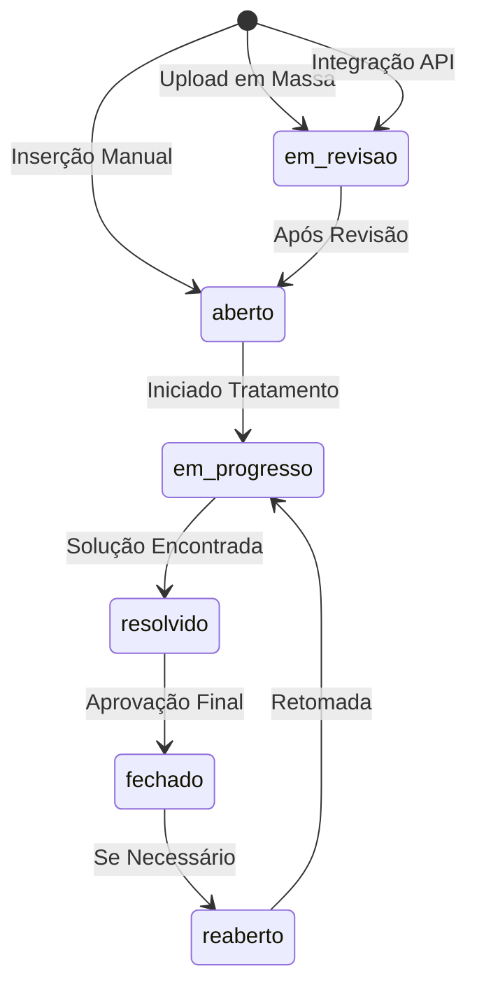
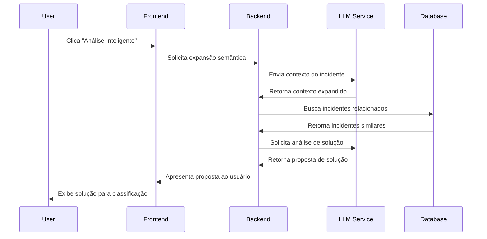

# Sistema de Gestão de Incidentes - Especificação Técnica Completa

## 📋 Resumo Executivo

Este documento fornece uma análise técnica completa do sistema de gestão de incidentes implementado no Mainframe AI Assistant, incluindo mapeamento de requisitos versus implementação atual, identificação de gaps e especificações de integração.

**Data de Análise:** 18 de Setembro de 2025
**Versão do Sistema:** 1.0.0
**Status:** Implementação Parcial - Gaps Identificados

---

## 🎯 Objetivo do Sistema

O sistema de gestão de incidentes é projetado para automatizar e otimizar o tratamento de incidentes em ambientes mainframe, com foco em:

- **Gestão de Fila de Incidentes**: Visualização e tratamento de incidentes não fechados/resolvidos
- **Upload em Massa**: Carregamento bulk de incidentes (PDF, Word, Excel, TXT) para migração
- **Análise Inteligente**: Integração com LLM/Gemini para expansão semântica e sugestões
- **Sistema de Estados**: Fluxo controlado (em revisão → aberto → resolvido → fechado)
- **Logs Categorizados**: Rastreamento de ações (USER_ACTION, LLM_ACTION, SYSTEM_ACTION)

---

## 🏗️ Arquitetura do Sistema

### Estrutura de Camadas

```
┌─────────────────────────────────────────────────────────┐
│                    Frontend (React)                     │
├─────────────────────────────────────────────────────────┤
│  Views/           │  Components/incident/               │
│  - Incidents.tsx  │  - IncidentQueue.tsx               │
│                   │  - StatusWorkflow.tsx               │
│                   │  - PriorityBadge.tsx                │
│                   │  - StatusBadge.tsx                  │
│                   │  - IncidentManagementDashboard.tsx  │
├─────────────────────────────────────────────────────────┤
│                IPC Communication Layer                  │
├─────────────────────────────────────────────────────────┤
│           Backend (Electron Main Process)               │
│  - IncidentHandler.ts (IPC Handlers)                   │
├─────────────────────────────────────────────────────────┤
│              Database Layer (SQLite)                   │
│  - incident-schema.sql (Comprehensive Schema)          │
└─────────────────────────────────────────────────────────┘
```

### Componentes Principais

#### 1. **Frontend Components**
- **Incidents.tsx**: View principal com busca local/IA
- **IncidentQueue.tsx**: Fila de incidentes com filtros e ações em lote
- **StatusWorkflow.tsx**: Gestão visual de transições de estado
- **Priority/StatusBadge.tsx**: Componentes visuais para prioridade e status
- **IncidentManagementDashboard.tsx**: Dashboard analítico completo

#### 2. **Backend Layer**
- **IncidentHandler.ts**: 25+ handlers IPC para operações CRUD
- **Database Schema**: 15 tabelas com views analíticas e triggers

#### 3. **Database Architecture**
- **Tabelas Principais**: incidents, incident_relationships, incident_comments
- **Automação**: sla_policies, automation_rules
- **Analytics**: incident_metrics_snapshots, team_performance
- **Relatórios**: report_templates, scheduled_reports

---

## 📊 Análise de Requisitos vs Implementação

### ✅ Requisitos IMPLEMENTADOS

| #  | Requisito | Status | Implementação |
|----|-----------|--------|---------------|
| 1  | Fila de incidentes em aberto | ✅ **IMPLEMENTADO** | `IncidentQueue.tsx` com filtros por status |
| 2  | Inserção de novos incidentes | ✅ **IMPLEMENTADO** | Modal de adição via fast action |
| 7  | Incidentes não fechados na fila | ✅ **IMPLEMENTADO** | Filtros por status (open, in_progress, etc.) |
| 8  | Filtros e ordenação por criticidade | ✅ **IMPLEMENTADO** | Sistema de filtros e sorting completo |
| 6  | Edição de incidentes | ✅ **IMPLEMENTADO** | Handlers para update via IPC |
| 20 | Log de tratamento associado | ✅ **IMPLEMENTADO** | `incident_comments` table com histórico |

### ⚠️ Requisitos PARCIALMENTE IMPLEMENTADOS

| #  | Requisito | Status | Gap Identificado |
|----|-----------|--------|------------------|
| 4  | Estados (em revisão, aberto) | 🟡 **PARCIAL** | Estados definidos no schema mas sem lógica de auto-transição |
| 5  | Inserção automática via API | 🟡 **PARCIAL** | IPC handlers existem mas falta integração API externa |
| 9  | Opção de tratamento para abertos | 🟡 **PARCIAL** | StatusWorkflow existe mas sem fluxo de tratamento |

### ❌ Requisitos NÃO IMPLEMENTADOS (GAPS CRÍTICOS)

| #  | Requisito | Status | Descrição do Gap |
|----|-----------|--------|------------------|
| 3  | **Upload em massa (PDF, Word, Excel, TXT)** | ❌ **FALTANDO** | Sistema de bulk upload não implementado |
| 10 | **Busca inteligente automática de relacionados** | ❌ **FALTANDO** | Auto-busca após status "aberto" não implementada |
| 11 | **Visualização de detalhes de relacionados** | ❌ **FALTANDO** | Interface de relacionamentos não funcional |
| 12 | **Análise inteligente via IA** | ❌ **FALTANDO** | Integração LLM/Gemini não implementada |
| 13 | **Alargamento semântico via LLM** | ❌ **FALTANDO** | Expansão de contexto técnico não implementada |
| 14 | **Pesquisa com contexto expandido** | ❌ **FALTANDO** | Busca baseada em semântica não implementada |
| 15 | **Proposta de solução via LLM** | ❌ **FALTANDO** | Geração de soluções não implementada |
| 16 | **Classificação de soluções propostas** | ❌ **FALTANDO** | Interface aceitar/rejeitar não implementada |
| 17 | **Sistema de comentários ativos** | ❌ **FALTANDO** | Gestão de comentários ativo/inativo não implementada |
| 18 | **Rejeição com nova análise** | ❌ **FALTANDO** | Fluxo de rejeição e re-análise não implementado |
| 19 | **Inativação de comentários** | ❌ **FALTANDO** | Sistema de soft-delete para comentários não implementado |

---

## 🔄 Fluxo de Estados dos Incidentes

### Estados Definidos no Sistema



### Implementação Atual vs Requerida

**✅ IMPLEMENTADO:**
- Estados básicos: `open`, `assigned`, `in_progress`, `resolved`, `closed`, `reopened`
- Transições via `StatusWorkflow.tsx`
- Histórico de mudanças em `incident_status_transitions`

**❌ FALTANDO:**
- Estado `em_revisao` específico para uploads em massa
- Auto-transição para `aberto` após revisão
- Triggers automáticos baseados em ações do usuário
- Lógica de negócio para validar transições

---

## 🏗️ Arquitetura de Componentes Detalhada

### 1. View Principal (Incidents.tsx)

**Funcionalidades Implementadas:**
- ✅ Busca local em tempo real (debounced)
- ✅ Busca via IA (com histórico)
- ✅ Interface tabbed (Local vs IA)
- ✅ Resultados com highlighting
- ✅ Floating Action Button para novos incidentes

**Limitações:**
- ❌ Não integra com sistema de fila real
- ❌ Resultados mockados, não do banco
- ❌ Sem integração LLM real

### 2. Fila de Incidentes (IncidentQueue.tsx)

**Funcionalidades Implementadas:**
- ✅ Tabela responsiva com paginação
- ✅ Filtros por status, prioridade, atribuição
- ✅ Seleção múltipla e ações em lote
- ✅ Ordenação por colunas
- ✅ Interface de busca integrada

**Limitações:**
- ❌ Dados mockados (não conecta ao banco)
- ❌ Sem integração com IPC handlers
- ❌ Ações em lote não executam operações reais

### 3. Gestão de Estados (StatusWorkflow.tsx)

**Funcionalidades Implementadas:**
- ✅ Visualização gráfica de estados
- ✅ Transições validadas por workflow
- ✅ Modal para mudança de status
- ✅ Histórico de transições
- ✅ Ícones e cores por estado

**Limitações:**
- ❌ Service `IncidentService` não implementado
- ❌ Sem validação de regras de negócio
- ❌ Estados hardcoded, não configuráveis

### 4. Dashboard Analítico (IncidentManagementDashboard.tsx)

**Funcionalidades Implementadas:**
- ✅ Métricas de overview (KPIs)
- ✅ Alertas do sistema
- ✅ Ações rápidas
- ✅ Atividade recente
- ✅ Interface tabbed para diferentes seções

**Limitações:**
- ❌ Dados completamente mockados
- ❌ Componentes de análise avançada não implementados
- ❌ Sem integração com dados reais

---

## 🗃️ Estrutura do Banco de Dados

### Tabelas Principais

#### `incidents` (Tabela Central)
```sql
CREATE TABLE incidents (
    id TEXT PRIMARY KEY,
    title TEXT NOT NULL,
    description TEXT NOT NULL,
    category TEXT CHECK(category IN ('JCL', 'VSAM', 'DB2', ...)),
    severity TEXT CHECK(severity IN ('critical', 'high', 'medium', 'low')),
    status TEXT DEFAULT 'open' CHECK(status IN ('open', 'in_progress', 'resolved', 'closed', 'reopened')),
    -- ... campos adicionais para SLA, métricas, IA
);
```

#### Tabelas de Apoio
- **`incident_relationships`**: Links entre incidentes relacionados
- **`incident_comments`**: Comentários e logs de atividade
- **`sla_policies`**: Políticas de SLA por categoria/severidade
- **`automation_rules`**: Regras de automação configuráveis

### Views Analíticas
- **`v_incident_analytics`**: Métricas consolidadas por incidente
- **`v_mttr_metrics`**: Cálculos de MTTR por categoria/equipe
- **`v_daily_incident_trends`**: Tendências diárias
- **`v_team_performance_summary`**: Performance por equipe

### Triggers Implementados
- **`tr_incident_status_update`**: Auto-atualização de timestamps
- **`tr_incident_response_time`**: Cálculo de tempo de resposta
- **`tr_auto_relationship_suggestions`**: Sugestões automáticas de relacionamentos

---

## 🚫 Gaps Críticos de Implementação

### 1. **Sistema de Upload em Massa** ❌
**Requisito:** Carregar PDF, Word, Excel, TXT para migração de KB
**Status:** Não implementado
**Impacto:** Alto - Bloqueio para migração de dados existentes

**Especificação Necessária:**
- Interface de drag & drop para múltiplos arquivos
- Parser para diferentes formatos (PDF, DOCX, XLSX, TXT)
- Extração de metadados (título, categoria, prioridade)
- Validação e preview antes da importação
- Processamento em background com progress bar
- Estado automático `em_revisao` após upload

### 2. **Integração LLM/Gemini** ❌
**Requisito:** Análise inteligente e expansão semântica
**Status:** Não implementado
**Impacto:** Crítico - Funcionalidade principal do sistema

**Especificação Necessária:**
```typescript
interface LLMIntegration {
  expandContext(incident: Incident): Promise<SemanticContext>;
  findRelatedIncidents(context: SemanticContext): Promise<RelatedIncident[]>;
  generateSolution(incident: Incident, related: RelatedIncident[]): Promise<SolutionProposal>;
  classifySolution(proposal: SolutionProposal, feedback: UserFeedback): Promise<void>;
}
```

### 3. **Sistema de Logs Categorizado** ❌
**Requisito:** Logs com categorias USER_ACTION, LLM_ACTION, SYSTEM_ACTION
**Status:** Parcialmente implementado (apenas comentários genéricos)
**Impacto:** Médio - Auditoria e compliance

**Schema Necessário:**
```sql
CREATE TABLE incident_action_logs (
    id INTEGER PRIMARY KEY,
    incident_id TEXT NOT NULL,
    action_type TEXT CHECK(action_type IN ('USER_ACTION', 'LLM_ACTION', 'SYSTEM_ACTION')),
    action_name TEXT NOT NULL,
    user_id TEXT,
    details TEXT, -- JSON com detalhes da ação
    timestamp DATETIME DEFAULT CURRENT_TIMESTAMP,
    is_active BOOLEAN DEFAULT TRUE, -- Para inativação
    FOREIGN KEY (incident_id) REFERENCES incidents(id)
);
```

### 4. **Gestão de Comentários Ativos/Inativos** ❌
**Requisito:** Comentários podem ser inativados, afetando contexto
**Status:** Não implementado
**Impacto:** Médio - Gestão de contexto para IA

**Implementação Necessária:**
- Campo `is_active` em `incident_comments`
- Interface para inativar/reativar comentários
- Filtros automáticos para incluir apenas comentários ativos no contexto LLM
- Log de inativação/reativação

---

## 🔌 Especificações de Integração

### 1. Sistema de Upload em Massa

#### Arquitetura Proposta
```
┌─────────────────┐    ┌─────────────────┐    ┌─────────────────┐
│   Frontend      │    │   File Parser   │    │   Database      │
│   Upload UI     │────│   Service       │────│   Storage       │
└─────────────────┘    └─────────────────┘    └─────────────────┘
         │                       │                       │
         │              ┌─────────────────┐             │
         └──────────────│  Progress       │─────────────┘
                        │  Tracking       │
                        └─────────────────┘
```

#### Interfaces Técnicas
```typescript
interface BulkUploadService {
  uploadFiles(files: File[]): Promise<UploadResult[]>;
  parseDocument(file: File): Promise<ParsedIncident>;
  validateIncident(incident: ParsedIncident): ValidationResult;
  importIncidents(incidents: ValidatedIncident[]): Promise<ImportResult>;
}

interface ParsedIncident {
  title: string;
  description: string;
  category?: string;
  priority?: string;
  tags: string[];
  confidence: number; // Confiança na extração
}
```

### 2. Integração LLM/Gemini

#### Fluxo de Análise Inteligente


#### Service Layer
```typescript
interface GeminiIntegrationService {
  expandSemanticContext(incident: Incident): Promise<{
    expanded_keywords: string[];
    technical_context: string[];
    functional_context: string[];
    confidence_score: number;
  }>;

  analyzeSolution(incident: Incident, related: Incident[]): Promise<{
    solution_proposal: string;
    confidence_score: number;
    referenced_incidents: string[];
    reasoning: string;
  }>;

  classifyFeedback(proposal: string, feedback: 'accept' | 'reject', comments?: string): Promise<void>;
}
```

### 3. Sistema de Logs Categorizado

#### Estrutura de Log
```typescript
enum ActionType {
  USER_ACTION = 'USER_ACTION',
  LLM_ACTION = 'LLM_ACTION',
  SYSTEM_ACTION = 'SYSTEM_ACTION'
}

interface ActionLog {
  incident_id: string;
  action_type: ActionType;
  action_name: string;
  user_id?: string;
  details: Record<string, any>;
  timestamp: Date;
  is_active: boolean;
}
```

#### Exemplos de Logs por Categoria
```typescript
// USER_ACTION
{
  action_type: 'USER_ACTION',
  action_name: 'incident_review_completed',
  details: { previous_status: 'em_revisao', new_status: 'aberto', comments: 'Revisão ok' }
}

// LLM_ACTION
{
  action_type: 'LLM_ACTION',
  action_name: 'semantic_expansion',
  details: { original_context: '...', expanded_context: '...', confidence: 0.87 }
}

// SYSTEM_ACTION
{
  action_type: 'SYSTEM_ACTION',
  action_name: 'related_incidents_search',
  details: { query: '...', results_count: 5, similarity_threshold: 0.7 }
}
```

---

## 🎯 Roadmap de Implementação

### Fase 1: Gaps Críticos (4-6 semanas)
1. **Sistema de Upload em Massa**
   - File parser para PDF/Word/Excel/TXT
   - Interface de upload com preview
   - Estado `em_revisao` automático

2. **Integração LLM Básica**
   - Configuração Gemini API
   - Expansão semântica simples
   - Busca de relacionados

### Fase 2: Análise Inteligente (3-4 semanas)
1. **Propostas de Solução**
   - Geração via LLM
   - Interface aceitar/rejeitar
   - Feedback loop para melhoria

2. **Sistema de Logs**
   - Implementação de categorias
   - Interface de auditoria
   - Dashboards de atividade

### Fase 3: Otimizações (2-3 semanas)
1. **Comentários Ativos/Inativos**
   - Gestão de estado de comentários
   - Filtros para contexto LLM
   - Interface de administração

2. **Integração Final**
   - Conectar frontend ao backend real
   - Testes end-to-end
   - Otimizações de performance

---

## 📈 Métricas e KPIs

### Métricas de Sistema (Implementadas)
- ✅ Total de incidentes
- ✅ Incidentes abertos/críticos
- ✅ MTTR médio
- ✅ Compliance SLA
- ✅ Taxa de automação

### Métricas Adicionais Necessárias
- ❌ Taxa de sucesso de upload em massa
- ❌ Precisão da análise semântica (confidence scores)
- ❌ Taxa de aceitação de soluções propostas por IA
- ❌ Tempo médio de revisão de incidentes
- ❌ Distribuição de logs por categoria de ação

---

## 🔐 Considerações de Segurança

### Implementado
- ✅ Validação de entrada (CHECK constraints no banco)
- ✅ Foreign keys para integridade referencial
- ✅ Logs de auditoria básicos

### Necessário Implementar
- ❌ Validação de uploads (antivírus, tipo de arquivo)
- ❌ Sanitização de conteúdo extraído de documentos
- ❌ Rate limiting para chamadas LLM
- ❌ Controle de acesso por função (RBAC)
- ❌ Criptografia de dados sensíveis nos logs

---

## 📝 Conclusão

O sistema de gestão de incidentes possui uma **base sólida** com arquitetura bem definida, schema de banco abrangente e componentes frontend bem estruturados. No entanto, **funcionalidades críticas** como upload em massa, integração LLM e sistema de logs categorizados não estão implementadas.

**Prioridade Alta:**
1. Sistema de Upload em Massa (bloqueio para migração)
2. Integração LLM/Gemini (funcionalidade principal)
3. Conexão frontend-backend (dados reais vs mockados)

**Próximos Passos:**
1. Implementar parsers de documentos para upload em massa
2. Configurar integração com Gemini API
3. Conectar componentes frontend aos handlers IPC reais
4. Implementar sistema de logs categorizado

O sistema está preparado para evolução, com boa separação de responsabilidades e extensibilidade adequada para as funcionalidades pendentes.