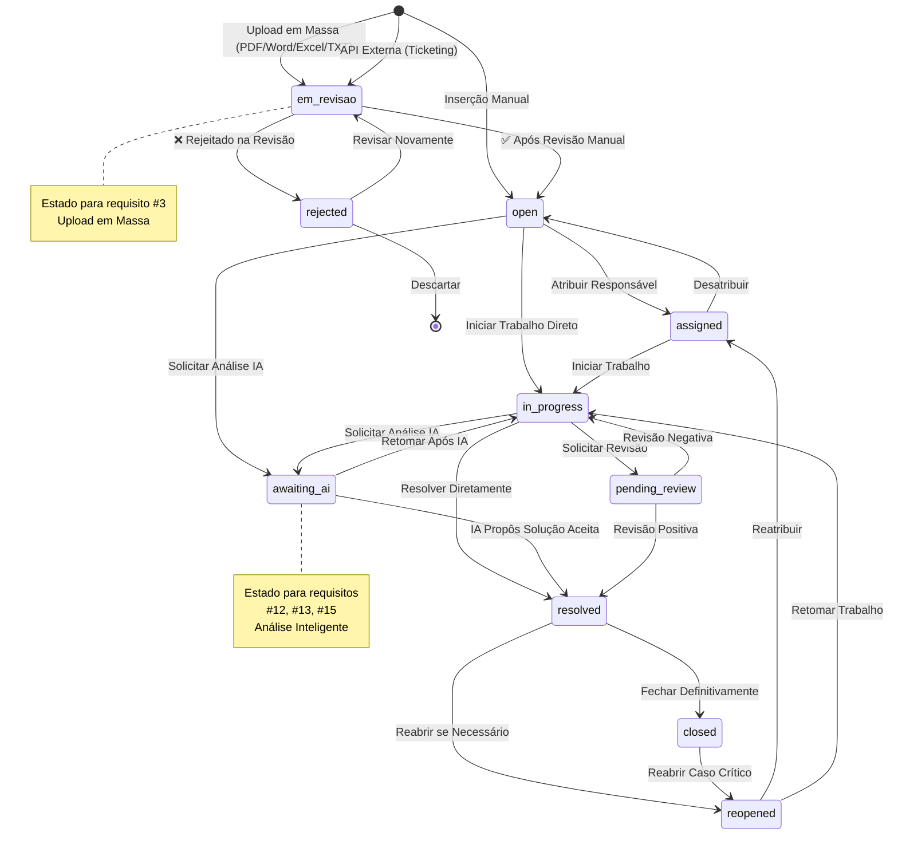
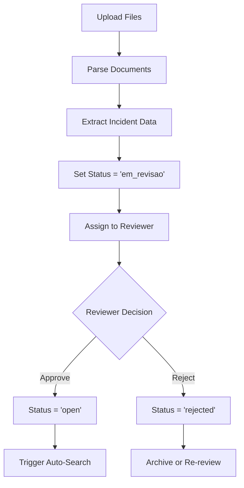
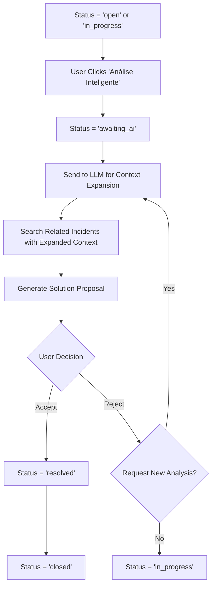
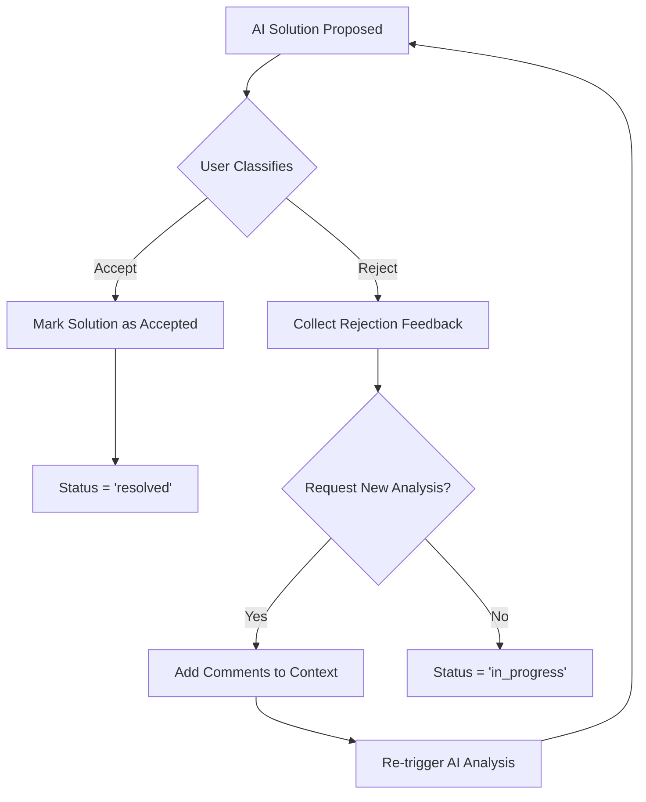

# Fluxo de Estados dos Incidentes - Especificação Detalhada

## 📋 Visão Geral
Este documento detalha o sistema de estados dos incidentes, incluindo transições automáticas e manuais, validações de negócio e logs de auditoria.

---

## 🔄 Estados Definidos

### Estados Implementados no Sistema
```typescript
type IncidentStatus =
  | 'open'           // Incidente aberto e pronto para atribuição
  | 'assigned'       // Atribuído a um responsável
  | 'in_progress'    // Em tratamento ativo
  | 'pending_review' // Aguardando revisão
  | 'resolved'       // Resolvido aguardando fechamento
  | 'closed'         // Fechado definitivamente
  | 'reopened';      // Reaberto após fechamento
```

### Estados Adicionais Necessários (Gap Identificado)
```typescript
type IncidentStatusExtended = IncidentStatus
  | 'em_revisao'     // ❌ FALTANDO - Para uploads em massa
  | 'rejected'       // ❌ FALTANDO - Solução rejeitada pelo usuário
  | 'awaiting_ai';   // ❌ FALTANDO - Aguardando análise de IA
```

---

## 🔄 Diagrama de Estados



---

## 🎯 Regras de Transição

### Transições Automáticas (Sistema)
```typescript
interface AutoTransitions {
  // Requisito #3 - Upload em massa
  onBulkUpload: 'em_revisao';

  // Requisito #4 - Inserção manual
  onManualCreate: 'open';

  // Requisito #5 - API externa
  onApiCreate: 'em_revisao';

  // Requisito #10 - Busca automática após abrir
  onStatusOpen: () => void; // Trigger busca de relacionados
}
```

### Transições Manuais (Usuário)
```typescript
interface ManualTransitions {
  // Estados básicos
  'em_revisao' -> 'open': 'review_complete';
  'em_revisao' -> 'rejected': 'review_failed';
  'open' -> 'assigned': 'assign_user';
  'assigned' -> 'in_progress': 'start_work';
  'in_progress' -> 'resolved': 'mark_resolved';
  'resolved' -> 'closed': 'close_incident';
  'closed' -> 'reopened': 'reopen_incident';

  // Estados de IA (Requisitos #12-18)
  'open' -> 'awaiting_ai': 'request_ai_analysis';
  'in_progress' -> 'awaiting_ai': 'request_ai_analysis';
  'awaiting_ai' -> 'in_progress': 'resume_manual_work';
  'awaiting_ai' -> 'resolved': 'accept_ai_solution';
  'resolved' -> 'awaiting_ai': 'reject_solution';
}
```

---

## 🔧 Implementação Atual vs Necessária

### ✅ Estados Implementados
**Arquivo:** `src/renderer/components/incident/StatusWorkflow.tsx` (linhas 29-65)

```typescript
const statusWorkflow = {
  open: {
    next: ['assigned', 'in_progress', 'resolved', 'closed'],
    color: '#6b7280',
    icon: 'open'
  },
  assigned: {
    next: ['in_progress', 'open', 'resolved', 'closed'],
    color: '#3b82f6',
    icon: 'user'
  },
  in_progress: {
    next: ['pending_review', 'resolved', 'assigned', 'open'],
    color: '#f59e0b',
    icon: 'play'
  },
  pending_review: {
    next: ['resolved', 'in_progress', 'assigned'],
    color: '#8b5cf6',
    icon: 'clock'
  },
  resolved: {
    next: ['closed', 'reopened'],
    color: '#10b981',
    icon: 'check'
  },
  closed: {
    next: ['reopened'],
    color: '#6b7280',
    icon: 'lock'
  },
  reopened: {
    next: ['assigned', 'in_progress', 'resolved'],
    color: '#ef4444',
    icon: 'refresh'
  }
};
```

### ❌ Estados Não Implementados (Gaps Críticos)

#### 1. Estado `em_revisao`
**Necessário para:** Requisitos #3, #4, #5
```typescript
// ADICIONAR ao statusWorkflow
em_revisao: {
  next: ['open', 'rejected'],
  color: '#f59e0b',
  icon: 'eye',
  description: 'Aguardando revisão manual após upload em massa ou API'
}
```

#### 2. Estado `awaiting_ai`
**Necessário para:** Requisitos #12, #13, #15, #18
```typescript
// ADICIONAR ao statusWorkflow
awaiting_ai: {
  next: ['in_progress', 'resolved'],
  color: '#8b5cf6',
  icon: 'bot',
  description: 'Processando análise inteligente via LLM'
}
```

#### 3. Estado `rejected`
**Necessário para:** Revisão de upload e rejeição de soluções
```typescript
// ADICIONAR ao statusWorkflow
rejected: {
  next: ['em_revisao'],
  color: '#ef4444',
  icon: 'x',
  description: 'Rejeitado durante revisão'
}
```

---

## 🗃️ Schema do Banco de Dados

### ✅ Implementação Atual
**Arquivo:** `src/database/incident-schema.sql` (linha 17)
```sql
status TEXT NOT NULL DEFAULT 'open' CHECK(status IN (
  'open', 'in_progress', 'resolved', 'closed', 'reopened'
))
```

### ❌ Schema Necessário (Gap)
```sql
-- ATUALIZAR CHECK constraint
status TEXT NOT NULL DEFAULT 'open' CHECK(status IN (
  'open', 'assigned', 'in_progress', 'pending_review',
  'resolved', 'closed', 'reopened',
  'em_revisao', 'awaiting_ai', 'rejected'  -- NOVOS ESTADOS
))
```

---

## 📝 Sistema de Logs para Estados

### Logs de Transição Implementados
**Arquivo:** `src/main/ipc/handlers/IncidentHandler.ts` (linhas 329-343)
```typescript
// Log manual de transição existe mas limitado
if (reason) {
  const transitionQuery = `
    INSERT INTO incident_status_transitions (
      incident_id, from_status, to_status, changed_by, change_reason
    ) VALUES (?, ?, ?, ?, ?)
  `;
}
```

### ❌ Sistema de Logs Categorizado Necessário
**Para atender requisitos de auditoria:**
```sql
CREATE TABLE incident_action_logs (
    id INTEGER PRIMARY KEY,
    incident_id TEXT NOT NULL,
    action_type TEXT CHECK(action_type IN (
        'USER_ACTION',    -- Ações do usuário
        'SYSTEM_ACTION',  -- Ações automáticas do sistema
        'LLM_ACTION'      -- Ações do LLM/IA
    )),
    action_name TEXT NOT NULL,
    from_state TEXT,
    to_state TEXT,
    user_id TEXT,
    details TEXT,  -- JSON com detalhes da ação
    timestamp DATETIME DEFAULT CURRENT_TIMESTAMP,
    is_active BOOLEAN DEFAULT TRUE,
    FOREIGN KEY (incident_id) REFERENCES incidents(id)
);
```

---

## 🤖 Triggers Automáticos

### ✅ Triggers Implementados
**Arquivo:** `src/database/incident-schema.sql` (linhas 384-444)

#### 1. Atualização de Timestamps
```sql
CREATE TRIGGER tr_incident_status_update
AFTER UPDATE ON incidents
FOR EACH ROW
WHEN OLD.status != NEW.status
BEGIN
    UPDATE incidents SET
        updated_at = CURRENT_TIMESTAMP,
        resolved_at = CASE WHEN NEW.status = 'resolved' THEN CURRENT_TIMESTAMP ELSE resolved_at END,
        -- ... outros campos
    WHERE id = NEW.id;
END;
```

#### 2. Cálculo de Tempo de Resposta
```sql
CREATE TRIGGER tr_incident_response_time
AFTER UPDATE ON incidents
FOR EACH ROW
WHEN OLD.assigned_to IS NULL AND NEW.assigned_to IS NOT NULL
```

#### 3. Sugestões Automáticas de Relacionamento
```sql
CREATE TRIGGER tr_auto_relationship_suggestions
AFTER INSERT ON incidents
-- Implementação básica por categoria
```

### ❌ Triggers Necessários (Gaps)

#### 1. Busca Automática ao Mudar para "Open"
**Para Requisito #10:**
```sql
CREATE TRIGGER tr_auto_search_related
AFTER UPDATE ON incidents
FOR EACH ROW
WHEN NEW.status = 'open' AND OLD.status != 'open'
BEGIN
    -- Executar busca inteligente sem IA
    INSERT INTO incident_action_logs (
        incident_id, action_type, action_name, details
    ) VALUES (
        NEW.id, 'SYSTEM_ACTION', 'auto_search_related',
        json_object('search_initiated', datetime('now'))
    );
END;
```

#### 2. Estado Automático Baseado na Origem
**Para Requisitos #3, #4, #5:**
```sql
CREATE TRIGGER tr_auto_set_initial_status
AFTER INSERT ON incidents
FOR EACH ROW
BEGIN
    UPDATE incidents SET
        status = CASE
            WHEN NEW.created_via = 'bulk_upload' THEN 'em_revisao'
            WHEN NEW.created_via = 'api_integration' THEN 'em_revisao'
            WHEN NEW.created_via = 'manual' THEN 'open'
            ELSE 'open'
        END
    WHERE id = NEW.id;
END;
```

---

## 🎯 Validações de Negócio

### ✅ Validações Implementadas
**Arquivo:** `src/renderer/components/incident/StatusWorkflow.tsx` (linha 179)
```typescript
const availableTransitions = statusWorkflow[incident.status]?.next || [];
```

### ❌ Validações Necessárias (Gaps)

#### 1. Validação por Perfil de Usuário
```typescript
interface StateTransitionRules {
  canTransition(
    from: IncidentStatus,
    to: IncidentStatus,
    user: User,
    incident: Incident
  ): boolean;

  // Exemplos de regras:
  // - Apenas gerentes podem fechar incidentes críticos
  // - Upload em massa requer revisão por supervisor
  // - Estados de IA requerem permissão específica
}
```

#### 2. Validação por SLA
```typescript
interface SLAValidation {
  // Impedir fechamento se SLA breached sem justificativa
  preventCloseOnSLABreach: boolean;

  // Auto-escalar se muito tempo em estado
  autoEscalateAfterHours: Record<IncidentStatus, number>;
}
```

#### 3. Validação de Campos Obrigatórios
```typescript
interface RequiredFieldsValidation {
  'resolved': ['resolution', 'resolver'];
  'closed': ['resolution', 'resolver', 'close_reason'];
  'rejected': ['rejection_reason'];
  'em_revisao': ['reviewer_assigned'];
}
```

---

## 🔄 Fluxos Específicos por Requisito

### Requisito #3 - Upload em Massa


### Requisitos #12-15 - Análise Inteligente


### Requisito #16-18 - Classificação e Feedback


---

## 📊 Métricas por Estado

### Métricas Implementadas
**View:** `v_incident_analytics` no schema
```sql
SELECT
    status,
    COUNT(*) as count,
    AVG(resolution_time_hours) as avg_resolution_time,
    COUNT(CASE WHEN sla_breach = TRUE THEN 1 END) as sla_breaches
FROM incidents
GROUP BY status;
```

### ❌ Métricas Adicionais Necessárias
```sql
-- Tempo médio por estado
CREATE VIEW v_state_duration_metrics AS
SELECT
    status,
    AVG(duration_hours) as avg_duration,
    MIN(duration_hours) as min_duration,
    MAX(duration_hours) as max_duration
FROM (
    SELECT
        incident_id,
        to_status as status,
        ROUND((julianday(next_timestamp) - julianday(timestamp)) * 24, 2) as duration_hours
    FROM incident_status_transitions t1
    LEFT JOIN incident_status_transitions t2 ON t1.incident_id = t2.incident_id
        AND t2.timestamp > t1.timestamp
    WHERE next_timestamp IS NOT NULL
)
GROUP BY status;

-- Taxa de rejeição de soluções IA
CREATE VIEW v_ai_solution_metrics AS
SELECT
    COUNT(*) as total_proposals,
    COUNT(CASE WHEN final_status = 'resolved' THEN 1 END) as accepted,
    COUNT(CASE WHEN final_status != 'resolved' THEN 1 END) as rejected,
    ROUND(COUNT(CASE WHEN final_status = 'resolved' THEN 1 END) * 100.0 / COUNT(*), 2) as acceptance_rate
FROM incident_ai_proposals;
```

---

## 🚀 Roadmap de Implementação

### Fase 1: Estados Base (2-3 semanas)
1. **Adicionar estados faltantes** ao schema e componentes
2. **Implementar triggers** para transições automáticas
3. **Validações de transição** por perfil de usuário

### Fase 2: Upload em Massa (3-4 semanas)
4. **Implementar fluxo `em_revisao`**
5. **Interface de revisão** de uploads em massa
6. **Auto-transição** para `open` após aprovação

### Fase 3: Integração IA (4-6 semanas)
7. **Estado `awaiting_ai`** e fluxos relacionados
8. **Integração com LLM** para análise
9. **Classificação de soluções** com feedback

### Fase 4: Logs e Auditoria (2-3 semanas)
10. **Sistema de logs categorizado** (USER/SYSTEM/LLM)
11. **Métricas avançadas** por estado
12. **Dashboard** de fluxo de estados

---

## 📋 Checklist de Implementação

### Estados e Transições
- [ ] Adicionar estados `em_revisao`, `awaiting_ai`, `rejected` ao schema
- [ ] Atualizar `StatusWorkflow.tsx` com novos estados
- [ ] Implementar validações de transição
- [ ] Criar triggers para transições automáticas

### Integração com Requisitos
- [ ] Fluxo de upload em massa (Req #3)
- [ ] Estados baseados na origem de inserção (Req #4, #5)
- [ ] Busca automática ao abrir (Req #10)
- [ ] Estados para análise IA (Req #12-18)

### Logs e Auditoria
- [ ] Tabela `incident_action_logs` com categorias
- [ ] Triggers para log automático de transições
- [ ] Interface de auditoria de logs
- [ ] Métricas de tempo por estado

### Validações e Regras
- [ ] Validação por perfil de usuário
- [ ] Regras de SLA por estado
- [ ] Campos obrigatórios por transição
- [ ] Notificações de mudança de estado

**Tempo Estimado Total:** 11-16 semanas
**Complexidade:** Alta - Múltiplas integrações e regras de negócio
**Prioridade:** Alta - Base para toda funcionalidade do sistema