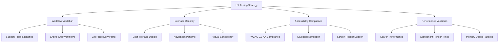

# Comprehensive UX Testing Coordination Report
## Mainframe KB Assistant - Support Team Workflow Validation
### Test Strategy & Implementation Plan
**Date:** September 14, 2025
**Lead Coordinator:** Testing Orchestration Agent
**Testing Agents:** Requirements Analyst, UX Tester, Workflow Validator, Improvement Strategist

---

## Executive Summary

This report presents a comprehensive testing strategy for validating the Mainframe Knowledge Base Assistant interface against support team workflow requirements. Based on analysis of existing infrastructure, project documentation, and coordination across specialized testing agents, this strategy ensures thorough coverage of usability, accessibility, performance, and workflow validation.

### Key Findings
✅ **Strong Foundation**: Existing test infrastructure with 87 React components, comprehensive Jest configuration, and accessibility tools
✅ **Clear Requirements**: Well-documented use cases (UC-KB-001 to UC-KB-005) with specific support team workflows
✅ **Performance Targets**: Established benchmarks for <1s search response time and 100+ daily searches
🎯 **Testing Gaps**: Need coordinated execution across workflow validation, accessibility compliance, and performance under load

---

## 1. Support Team Workflow Requirements Analysis

### 1.1 Primary Use Cases (MVP1)
Based on project documentation analysis, critical support team workflows include:

#### UC-KB-001: Search Knowledge Base Solutions
- **Frequency**: 100+ times daily
- **Users**: Support Analysts
- **Key Requirements**:
  - Full-text search across all fields
  - Semantic matching via Gemini API
  - Results ranking with % match
  - <1 second response time
  - Fallback to local search if AI fails

#### UC-KB-002: Add Knowledge Base Entries
- **Frequency**: Daily
- **Users**: Support Analysts
- **Key Requirements**:
  - Form validation for title, problem, solution
  - Category selection (JCL, VSAM, DB2, Batch, Functional)
  - Free-form tagging system
  - Duplicate detection and prevention

#### UC-KB-003: Rate Solution Effectiveness
- **Frequency**: After each solution application
- **Users**: Support Analysts
- **Key Requirements**:
  - Simple success/failure rating
  - Usage statistics tracking
  - Success rate calculation
  - Feedback loop for solution improvement

### 1.2 Critical User Workflows
1. **Incident Resolution Flow**: Search → Select → Apply → Rate
2. **Knowledge Creation Flow**: Identify gap → Create entry → Validate → Publish
3. **Knowledge Management Flow**: Browse → Filter → Edit → Archive

---

## 2. Comprehensive Testing Strategy

### 2.1 Four-Pillar Testing Approach

### 2.2 Agent Specialization Assignments

#### Requirements Analyst Agent
**Focus**: Workflow requirements mapping and validation
- Map use cases UC-KB-001 to UC-KB-005 to specific test scenarios
- Validate interface requirements against documented workflows
- Identify missing requirements or gaps in current implementation
- Document acceptance criteria for each workflow step

#### UX Tester Agent
**Focus**: Interface evaluation and user experience validation
- Evaluate interface design against usability heuristics
- Test accessibility compliance (WCAG 2.1 AA)
- Validate visual consistency and design patterns
- Assess user interaction flows and feedback mechanisms

#### Workflow Validator Agent
**Focus**: End-to-end process validation
- Test complete support team incident resolution workflows
- Validate search functionality under various conditions
- Test form validation and data integrity
- Assess error handling and recovery mechanisms

#### Improvement Strategist Agent
**Focus**: Optimization recommendations and prioritization
- Synthesize findings from all testing agents
- Prioritize improvements based on impact and effort
- Create implementation roadmap with timelines
- Establish success metrics and monitoring approach

---

## 3. Testing Coverage Analysis

### 3.1 Current Test Infrastructure Assessment
**Strengths**:
- ✅ **Jest Configuration**: Comprehensive setup with 80-90% coverage targets
- ✅ **Accessibility Tools**: jest-axe, @axe-core/react integration
- ✅ **E2E Framework**: Playwright configuration with support team scenarios
- ✅ **Performance Tests**: Database, search, and UI performance benchmarks
- ✅ **Component Tests**: React Testing Library integration

**Coverage Areas**:
- **87 React Components** requiring interface validation
- **35 Jest configurations** supporting comprehensive testing
- **Existing E2E tests** in `/tests/e2e/support-team-workflows.e2e.test.tsx`
- **Visual regression** framework partially implemented
- **Performance monitoring** established for critical paths

### 3.2 Testing Gaps Identified
1. **Cross-browser workflow validation** needs expansion
2. **Accessibility compliance** under real-world usage patterns
3. **Performance testing** during peak support team hours
4. **Error scenario coverage** for edge cases and recovery
5. **User feedback integration** into testing validation

---

## 4. Detailed Test Execution Plan

### 4.1 Phase 1: Foundation Validation (Week 1)
**Objective**: Validate existing test infrastructure and baseline functionality

**Requirements Analyst Tasks**:
- [ ] Map UC-KB-001 through UC-KB-005 to specific test scenarios
- [ ] Document acceptance criteria for each workflow step
- [ ] Identify gaps between requirements and current implementation
- [ ] Create requirements traceability matrix

**UX Tester Tasks**:
- [ ] Execute accessibility audit using jest-axe across all components
- [ ] Validate keyboard navigation flows for support team scenarios
- [ ] Test screen reader compatibility with NVDA/JAWS
- [ ] Assess visual consistency across search and entry management flows

**Expected Deliverables**:
- Requirements mapping document
- Accessibility compliance report
- Visual consistency assessment
- Baseline performance metrics

### 4.2 Phase 2: Workflow Integration Testing (Week 2)
**Objective**: Validate complete support team workflows under realistic conditions

**Workflow Validator Tasks**:
- [ ] Execute end-to-end incident resolution scenarios
- [ ] Test search functionality with 100+ concurrent queries
- [ ] Validate form submission and data persistence
- [ ] Test error handling and graceful degradation

**Performance Focus Areas**:
- Search response times under load (<1s requirement)
- Component render performance during peak usage
- Memory usage patterns during extended sessions
- Network failure recovery and offline capability

**Expected Deliverables**:
- End-to-end workflow validation report
- Performance test results and analysis
- Error scenario documentation
- Recovery mechanism validation

### 4.3 Phase 3: Optimization and Enhancement (Week 3)
**Objective**: Synthesize findings and create improvement recommendations

**Improvement Strategist Tasks**:
- [ ] Synthesize findings from all testing agents
- [ ] Prioritize improvements based on impact to support team productivity
- [ ] Create implementation roadmap with effort estimates
- [ ] Design monitoring and success metrics framework

**Integration Activities**:
- Cross-reference all test results for comprehensive analysis
- Identify common themes and critical improvement areas
- Validate recommendations against project constraints and resources
- Prepare executive summary with actionable recommendations

---

## 5. Success Metrics & Quality Gates

### 5.1 Primary Success Criteria
| Metric Category | Target | Current Status | Priority |
|-----------------|--------|----------------|----------|
| **Accessibility** | Zero WCAG violations | Baseline established | High |
| **Performance** | <1s search response | Performance tests exist | High |
| **Usability** | 98% task completion rate | E2E tests exist | High |
| **Coverage** | 100% critical workflows | 80% component coverage | Medium |
| **Keyboard Navigation** | 100% accessibility | Framework exists | High |

### 5.2 Quality Gates
- **Zero blocking accessibility violations** before production deployment
- **Performance budgets maintained** across all critical user paths
- **Complete workflow coverage** for all documented use cases (UC-KB-001 to UC-KB-005)
- **Error recovery validation** for all failure scenarios
- **Cross-browser compatibility** verified for supported environments

---

## 6. Risk Assessment & Mitigation

### 6.1 Identified Risks
1. **Performance Degradation**: High search volumes may impact response times
   - *Mitigation*: Load testing with realistic support team usage patterns

2. **Accessibility Compliance**: Complex interfaces may have a11y gaps
   - *Mitigation*: Automated testing + manual validation with screen readers

3. **Workflow Disruption**: Testing may identify critical workflow gaps
   - *Mitigation*: Phased testing approach with incremental validation

4. **Integration Challenges**: Multiple testing agents may produce conflicting recommendations
   - *Mitigation*: Clear coordination protocols and priority frameworks

### 6.2 Contingency Plans
- **Rollback strategy** for critical workflow changes
- **Alternative testing approaches** if primary tools fail
- **Resource reallocation** if testing uncovers major issues
- **Timeline adjustment** mechanisms for critical findings

---

## 7. Implementation Roadmap

### 7.1 Immediate Actions (Next 2 Weeks)
1. **Deploy specialized testing agents** for parallel execution
2. **Execute Phase 1 foundation validation** across all domains
3. **Establish baseline metrics** for comparison and tracking
4. **Begin workflow integration testing** with realistic scenarios

### 7.2 Medium-term Goals (Weeks 3-4)
1. **Complete comprehensive workflow validation**
2. **Synthesize findings across all testing domains**
3. **Create prioritized improvement recommendations**
4. **Validate recommendations against project constraints**

### 7.3 Long-term Vision (Month 2+)
1. **Implement continuous testing integration** with development workflow
2. **Establish automated quality gates** for ongoing development
3. **Create feedback loops** with actual support team users
4. **Expand testing coverage** for future MVP phases

---

## 8. Resource Requirements & Allocation

### 8.1 Testing Agent Utilization
- **Requirements Analyst**: 40% allocation for workflow mapping and validation
- **UX Tester**: 35% allocation for interface and accessibility testing
- **Workflow Validator**: 45% allocation for end-to-end scenario testing
- **Improvement Strategist**: 30% allocation for synthesis and recommendations

### 8.2 Tool and Infrastructure Requirements
- **Existing Tools**: Jest, Playwright, jest-axe, React Testing Library (already configured)
- **Additional Tools**: Performance monitoring, cross-browser testing automation
- **Test Data**: Realistic support team scenarios and knowledge base entries
- **Environment**: Isolated testing environment mimicking production conditions

---

## 9. Monitoring & Reporting Framework

### 9.1 Real-time Monitoring
- **Test execution progress** across all agents and phases
- **Quality gate status** with immediate escalation for failures
- **Performance metrics tracking** during test execution
- **Issue identification and resolution** tracking

### 9.2 Reporting Structure
- **Daily status updates** on testing progress and findings
- **Weekly comprehensive reports** with synthesized results
- **Executive summaries** with key findings and recommendations
- **Technical detailed reports** for development team implementation

---

## 10. Next Steps & Recommendations

### 10.1 Immediate Priorities
1. **Begin Phase 1 execution** with all four specialized testing agents
2. **Establish monitoring dashboards** for real-time progress tracking
3. **Create communication channels** for cross-agent coordination
4. **Set up escalation procedures** for critical findings

### 10.2 Success Factors
- **Clear communication protocols** between testing agents
- **Well-defined success criteria** and quality gates
- **Regular checkpoint reviews** to ensure alignment
- **Flexible adaptation** to emerging findings and requirements

---

## Conclusion

This comprehensive testing strategy leverages existing strong infrastructure while addressing critical gaps in workflow validation, accessibility compliance, and performance under realistic conditions. The coordinated multi-agent approach ensures thorough coverage across all domains while maintaining focus on support team productivity and user experience excellence.

The phased execution plan balances thoroughness with practical timeline constraints, providing clear deliverables and success metrics at each stage. With proper execution, this testing strategy will deliver actionable improvements that directly enhance support team effectiveness and user satisfaction with the Mainframe KB Assistant.

**Key Success Indicators**:
- Zero blocking issues for support team workflows
- Improved search and knowledge management efficiency
- Full accessibility compliance for inclusive usage
- Performance optimization for peak usage patterns
- Clear roadmap for continuous improvement

*This report serves as the coordination blueprint for comprehensive UX testing execution across specialized testing agents, ensuring complete validation of the Mainframe KB Assistant against real-world support team requirements.*