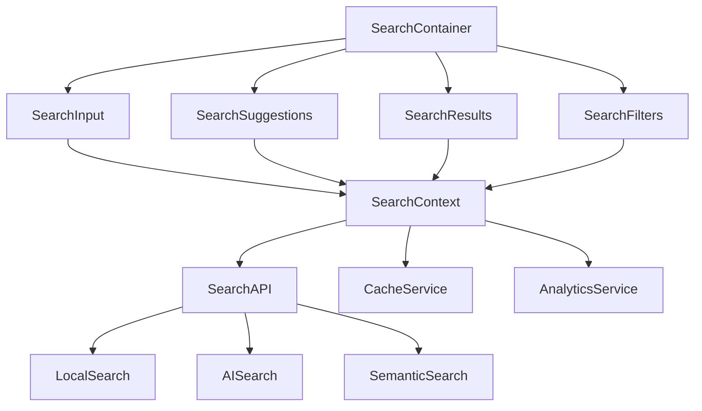

# Search Design System - Component Hierarchy

## Visual Component Tree

```
SearchDesignSystem/
├── 🔍 SearchContainer (Root Orchestrator)
│   │
│   ├── 📝 SearchInput (Core Input Component)
│   │   ├── 🔤 IconPrefix (Search/Loading Icons)
│   │   ├── 💬 InputField (Text Input Field)
│   │   ├── ❌ ClearButton (Query Reset)
│   │   ├── 🎤 VoiceInput (Speech Recognition)
│   │   └── ⏳ LoadingSpinner (Search Progress)
│   │
│   ├── 💡 SearchSuggestions (Intelligent Suggestions)
│   │   ├── 🕒 RecentSearches (User History)
│   │   ├── 🔥 PopularSearches (Trending Queries)
│   │   ├── 🤖 AIRecommendations (Smart Suggestions)
│   │   ├── 📂 CategoryFilters (Quick Category Access)
│   │   └── 🔖 SavedSearches (Bookmarked Queries)
│   │
│   ├── 📋 SearchResults (Results Presentation)
│   │   ├── 📊 ResultCount (Result Statistics)
│   │   ├── 📜 ResultsList (Virtualized List)
│   │   ├── 🃏 ResultCard (Individual Result)
│   │   ├── 📄 Pagination (Result Navigation)
│   │   ├── 🔢 SortControls (Result Ordering)
│   │   └── 🚫 EmptyState (No Results Feedback)
│   │
│   └── 🔧 SearchFilters (Advanced Filtering)
│       ├── ⚡ QuickFilters (Common Filters)
│       ├── 📅 DateRange (Temporal Filtering)
│       ├── 📁 Categories (Taxonomy Filtering)
│       ├── 🏷️ Tags (Metadata Filtering)
│       ├── 📎 FileTypes (Format Filtering)
│       └── ⚙️ AdvancedOptions (Complex Queries)
```

## Component Relationships

### 1. Data Flow Architecture



### 2. State Management Flow

```typescript
// Central Search State
interface SearchState {
  // Input State
  query: string
  isTyping: boolean
  inputFocused: boolean

  // Suggestions State
  suggestions: Suggestion[]
  showSuggestions: boolean
  selectedSuggestionIndex: number

  // Search State
  isSearching: boolean
  searchStartTime: number
  searchError: string | null

  // Results State
  results: SearchResult[]
  totalResults: number
  resultPage: number
  sortBy: SortOption

  // Filter State
  activeFilters: FilterSet
  availableFilters: FilterOption[]
  showFilters: boolean

  // History State
  searchHistory: string[]
  savedSearches: SavedSearch[]

  // Performance State
  searchMetrics: SearchMetrics
  cacheStatus: CacheStatus
}
```

### 3. Component Communication Patterns

```typescript
// Props Interface Definitions
interface SearchContainerProps {
  config: SearchConfig
  onSearchComplete: (results: SearchResult[]) => void
  onError: (error: Error) => void
}

interface SearchInputProps {
  value: string
  onChange: (value: string) => void
  onSubmit: (query: string) => void
  onFocus: () => void
  onBlur: () => void
  loading: boolean
  placeholder: string
  autoFocus: boolean
}

interface SearchSuggestionsProps {
  suggestions: Suggestion[]
  visible: boolean
  selectedIndex: number
  onSelect: (suggestion: Suggestion) => void
  onClose: () => void
  query: string
}

interface SearchResultsProps {
  results: SearchResult[]
  totalCount: number
  currentPage: number
  loading: boolean
  onPageChange: (page: number) => void
  onSortChange: (sort: SortOption) => void
}

interface SearchFiltersProps {
  activeFilters: FilterSet
  availableFilters: FilterOption[]
  onFilterChange: (filters: FilterSet) => void
  onClearAll: () => void
  visible: boolean
}
```

## Component Composition Patterns

### 1. Search Input Composition

```typescript
const SearchInput = React.forwardRef<HTMLInputElement, SearchInputProps>(
  ({ variant = 'standard', size = 'md', ...props }, ref) => {
    return (
      <div className={`search-input search-input--${variant} search-input--${size}`}>
        <IconPrefix icon="search" />
        <InputField ref={ref} {...props} />
        {props.loading && <LoadingSpinner size="sm" />}
        {props.value && <ClearButton onClick={props.onClear} />}
        {props.enableVoice && <VoiceInput onVoiceInput={props.onVoiceInput} />}
      </div>
    )
  }
)
```

### 2. Search Suggestions Composition

```typescript
const SearchSuggestions: React.FC<SearchSuggestionsProps> = ({
  suggestions,
  visible,
  query,
  onSelect,
  onClose
}) => {
  if (!visible) return null

  return (
    <div className="search-suggestions" role="listbox">
      <div className="suggestions-section">
        <h3>Recent Searches</h3>
        <RecentSearches onSelect={onSelect} />
      </div>

      <div className="suggestions-section">
        <h3>Suggestions</h3>
        {suggestions.map((suggestion, index) => (
          <SuggestionItem
            key={suggestion.id}
            suggestion={suggestion}
            query={query}
            selected={index === selectedIndex}
            onSelect={() => onSelect(suggestion)}
          />
        ))}
      </div>

      <div className="suggestions-section">
        <h3>AI Recommendations</h3>
        <AIRecommendations query={query} onSelect={onSelect} />
      </div>
    </div>
  )
}
```

### 3. Search Results Composition

```typescript
const SearchResults: React.FC<SearchResultsProps> = ({
  results,
  totalCount,
  loading,
  onPageChange,
  onSortChange
}) => {
  return (
    <div className="search-results">
      <div className="results-header">
        <ResultCount count={totalCount} />
        <SortControls onSortChange={onSortChange} />
      </div>

      {loading ? (
        <SkeletonLoader count={5} />
      ) : results.length > 0 ? (
        <VirtualizedResultsList
          results={results}
          renderItem={({ item, index }) => (
            <ResultCard key={item.id} result={item} index={index} />
          )}
        />
      ) : (
        <EmptyState />
      )}

      <div className="results-footer">
        <Pagination
          currentPage={currentPage}
          totalPages={Math.ceil(totalCount / pageSize)}
          onPageChange={onPageChange}
        />
      </div>
    </div>
  )
}
```

## Accessibility Component Tree

```
Accessibility Hierarchy:
├── search (role="search")
│   ├── combobox (SearchInput)
│   │   ├── textbox (InputField)
│   │   ├── button (ClearButton)
│   │   └── button (VoiceInput)
│   ├── listbox (SearchSuggestions)
│   │   ├── option (SuggestionItem)
│   │   └── option (SuggestionItem)
│   ├── region (SearchResults)
│   │   ├── status (ResultCount)
│   │   ├── list (ResultsList)
│   │   │   ├── listitem (ResultCard)
│   │   │   └── listitem (ResultCard)
│   │   └── navigation (Pagination)
│   └── region (SearchFilters)
│       ├── group (FilterGroup)
│       ├── checkbox (FilterOption)
│       └── radiogroup (SortOptions)
```

## Performance Optimization Tree

```
Performance Strategy:
├── Code Splitting
│   ├── SearchContainer (Always loaded)
│   ├── SearchSuggestions (Lazy loaded)
│   ├── SearchFilters (Dynamic import)
│   └── AdvancedOptions (Feature flag)
├── Virtualization
│   ├── ResultsList (react-window)
│   ├── SuggestionsList (Fixed height)
│   └── FilterOptions (Auto-sizing)
├── Caching
│   ├── SearchResults (LRU cache)
│   ├── Suggestions (Session storage)
│   └── UserPreferences (Local storage)
└── Optimization
    ├── Debounced Input (300ms)
    ├── Memoized Components (React.memo)
    └── Optimized Re-renders (useCallback)
```

## Integration Points

### 1. External Services

```typescript
interface ExternalIntegrations {
  // Search Services
  localSearch: LocalSearchService
  aiSearch: AISearchService
  semanticSearch: SemanticSearchService

  // Analytics
  searchAnalytics: AnalyticsService
  performanceMonitoring: PerformanceService
  userBehavior: BehaviorTrackingService

  // Personalization
  userPreferences: PreferencesService
  searchHistory: HistoryService
  savedSearches: BookmarkService

  // Accessibility
  screenReaderSupport: A11yService
  keyboardNavigation: KeyboardService
  focusManagement: FocusService
}
```

### 2. Context Providers

```typescript
// Search Context Hierarchy
<SearchConfigProvider config={searchConfig}>
  <SearchStateProvider>
    <SearchAnalyticsProvider>
      <SearchAccessibilityProvider>
        <SearchContainer>
          {/* Component tree */}
        </SearchContainer>
      </SearchAccessibilityProvider>
    </SearchAnalyticsProvider>
  </SearchStateProvider>
</SearchConfigProvider>
```

### 3. Hook Composition

```typescript
// Custom Hooks for Component Logic
export const useSearchInput = () => {
  const { query, setQuery } = useSearchQuery()
  const { generateSuggestions } = useSearchSuggestions()
  const { performSearch } = useSearchExecution()

  return {
    query,
    setQuery,
    generateSuggestions,
    performSearch,
    // ... other input-specific logic
  }
}

export const useSearchResults = () => {
  const { results, totalCount } = useSearchState()
  const { sortBy, setSortBy } = useSearchSorting()
  const { currentPage, setCurrentPage } = useSearchPagination()

  return {
    results,
    totalCount,
    sortBy,
    setSortBy,
    currentPage,
    setCurrentPage,
    // ... other results-specific logic
  }
}
```

---

This component hierarchy provides a clear blueprint for implementing the search design system with proper separation of concerns, accessibility support, and performance optimization.