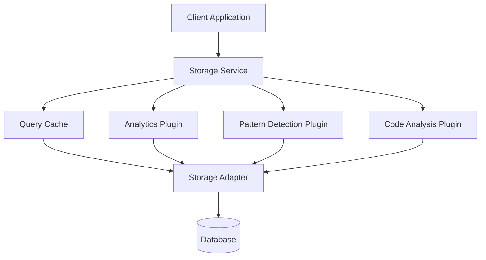

# Storage Service Integration Guide

## Overview

The Storage Service provides a comprehensive, MVP-progressive data management solution for the Mainframe AI Assistant. This guide covers complete integration, from basic setup through advanced plugin development.

## Table of Contents

1. [Quick Start](#quick-start)
2. [Architecture Overview](#architecture-overview)
3. [Basic Integration](#basic-integration)
4. [Advanced Configuration](#advanced-configuration)
5. [MVP Progression](#mvp-progression)
6. [Plugin System](#plugin-system)
7. [Performance Optimization](#performance-optimization)
8. [Monitoring & Health Checks](#monitoring--health-checks)
9. [Migration Strategies](#migration-strategies)
10. [Troubleshooting](#troubleshooting)

## Quick Start

### Installation & Basic Setup

```typescript
import { StorageService } from './services/storage/StorageService';
import { SQLiteAdapter } from './services/storage/adapters/SQLiteAdapter';

// Basic initialization for MVP1
const storage = new StorageService({
  adapter: 'sqlite',
  databasePath: './knowledge.db',
  enableBackups: true,
  enablePlugins: false // Start simple for MVP1
});

await storage.initialize();

// Add a knowledge base entry
const entryId = await storage.addKBEntry({
  title: 'VSAM Status 35 - File Not Found',
  problem: 'Job abends with VSAM status code 35',
  solution: '1. Check file existence\n2. Verify catalog',
  category: 'VSAM',
  tags: ['vsam', 'file-error']
});

// Search entries
const results = await storage.searchEntries('VSAM status 35');
console.log(`Found ${results.length} matching entries`);
```

### 5-Minute MVP1 Setup

```bash
# 1. Install dependencies
npm install better-sqlite3 uuid

# 2. Create basic configuration
echo '{
  "storage": {
    "adapter": "sqlite",
    "databasePath": "./data/knowledge.db",
    "enableBackups": true,
    "backupRetention": 7
  }
}' > config/storage.json

# 3. Initialize database
npm run init-db

# 4. Import sample data
npm run seed-kb
```

## Architecture Overview

### Component Structure

```
Storage Service
├── Core Service Layer (StorageService.ts)
├── Adapter Layer (Database-specific implementations)
│   ├── SQLiteAdapter.ts (MVP1-4)
│   ├── PostgreSQLAdapter.ts (MVP5+)
│   └── MemoryAdapter.ts (Testing)
├── Plugin System (MVP-specific features)
│   ├── BaseStoragePlugin.ts
│   ├── AnalyticsPlugin.ts (MVP2+)
│   ├── PatternDetectionPlugin.ts (MVP2+)
│   ├── CodeAnalysisPlugin.ts (MVP3+)
│   └── TemplateEnginePlugin.ts (MVP4+)
├── Migration System
│   ├── MigrationManager.ts
│   └── migrations/ (Version-specific SQL)
└── Performance Layer
    ├── QueryCache.ts
    ├── ConnectionPool.ts
    └── PerformanceMonitor.ts
```

### Data Flow



## Basic Integration

### Step 1: Service Initialization

```typescript
import { StorageService, StorageConfig } from './services/storage/StorageService';

const config: StorageConfig = {
  // Database Configuration
  adapter: 'sqlite',
  databasePath: './data/knowledge.db',
  
  // Performance Settings
  enableQueryCache: true,
  cacheSize: 100,
  cacheTTL: 300000, // 5 minutes
  
  // Backup Configuration
  enableBackups: true,
  backupInterval: 24, // hours
  backupRetention: 7, // days
  
  // Plugin Configuration (MVP-specific)
  enablePlugins: false, // Start with false for MVP1
  plugins: {
    analytics: { enabled: false },
    patternDetection: { enabled: false },
    codeAnalysis: { enabled: false }
  },
  
  // Monitoring
  enablePerformanceMonitoring: true,
  slowQueryThreshold: 1000 // ms
};

const storage = new StorageService(config);
await storage.initialize();
```

### Step 2: Basic CRUD Operations

```typescript
// Knowledge Base Operations
class KnowledgeBaseManager {
  constructor(private storage: StorageService) {}

  async addEntry(entry: KBEntry): Promise<string> {
    return await this.storage.addKBEntry(entry);
  }

  async searchEntries(query: string, options?: SearchOptions): Promise<SearchResult[]> {
    return await this.storage.searchEntries(query, options);
  }

  async updateEntry(id: string, updates: Partial<KBEntry>): Promise<void> {
    await this.storage.updateKBEntry(id, updates);
  }

  async deleteEntry(id: string): Promise<void> {
    await this.storage.deleteKBEntry(id);
  }

  async getPopularEntries(limit: number = 10): Promise<SearchResult[]> {
    return await this.storage.getPopularEntries(limit);
  }
}
```

### Step 3: Event Handling

```typescript
// Subscribe to storage events
storage.on('entry-added', (entry) => {
  console.log(`New KB entry added: ${entry.title}`);
});

storage.on('search-performed', (event) => {
  console.log(`Search performed: "${event.query}" (${event.resultsCount} results)`);
});

storage.on('performance-warning', (warning) => {
  console.warn(`Performance issue detected: ${warning.message}`);
});

storage.on('backup-completed', (info) => {
  console.log(`Backup completed: ${info.filename} (${info.size} bytes)`);
});
```

## Advanced Configuration

### Production Configuration

```typescript
const productionConfig: StorageConfig = {
  // Database
  adapter: 'sqlite', // or 'postgresql' for MVP5+
  databasePath: process.env.DB_PATH || '/data/production/knowledge.db',
  
  // Performance Tuning
  enableQueryCache: true,
  cacheSize: 1000,
  cacheTTL: 600000, // 10 minutes
  connectionPoolSize: 10,
  connectionTimeout: 30000,
  
  // High Availability
  enableBackups: true,
  backupInterval: 6, // hours
  backupRetention: 30, // days
  backupLocation: '/backups/storage',
  enableRemoteBackups: true,
  
  // Security
  enableEncryption: true,
  encryptionKey: process.env.STORAGE_ENCRYPTION_KEY,
  enableAuditLog: true,
  
  // Monitoring
  enablePerformanceMonitoring: true,
  slowQueryThreshold: 500,
  enableHealthChecks: true,
  healthCheckInterval: 60000, // 1 minute
  
  // Plugin System
  enablePlugins: true,
  plugins: {
    analytics: {
      enabled: true,
      config: {
        aggregationInterval: 3600000, // 1 hour
        retentionDays: 90
      }
    },
    patternDetection: {
      enabled: true,
      config: {
        detectionInterval: 300000, // 5 minutes
        minimumPatternOccurrences: 3
      }
    }
  }
};
```

### Environment-Specific Configuration

```typescript
// config/storage.ts
export const getStorageConfig = (): StorageConfig => {
  const env = process.env.NODE_ENV || 'development';
  
  const baseConfig: StorageConfig = {
    adapter: 'sqlite',
    enableQueryCache: true,
    enableBackups: true
  };

  switch (env) {
    case 'development':
      return {
        ...baseConfig,
        databasePath: './dev-data/knowledge.db',
        enablePlugins: false,
        logLevel: 'debug'
      };

    case 'test':
      return {
        ...baseConfig,
        adapter: 'memory',
        enableBackups: false,
        enablePlugins: false
      };

    case 'production':
      return {
        ...baseConfig,
        databasePath: '/data/production/knowledge.db',
        enablePlugins: true,
        enablePerformanceMonitoring: true,
        enableAuditLog: true
      };

    default:
      return baseConfig;
  }
};
```

## MVP Progression

### MVP1: Basic Knowledge Base (Weeks 1-4)

```typescript
// MVP1 Configuration - Keep it simple
const mvp1Config: StorageConfig = {
  adapter: 'sqlite',
  databasePath: './knowledge.db',
  enableBackups: true,
  enablePlugins: false, // No plugins yet
  enableQueryCache: false // Keep it simple
};

// MVP1 Usage
const storage = new StorageService(mvp1Config);
await storage.initialize();

// Basic operations only
const entryId = await storage.addKBEntry(kbEntry);
const results = await storage.searchEntries('VSAM error');
await storage.recordUsage(entryId, true);
```

### MVP2: Pattern Detection (Weeks 5-10)

```typescript
// MVP2 Configuration - Add analytics and pattern detection
const mvp2Config: StorageConfig = {
  ...mvp1Config,
  enablePlugins: true,
  plugins: {
    analytics: {
      enabled: true,
      config: {
        trackSearchPatterns: true,
        trackUsageMetrics: true
      }
    },
    patternDetection: {
      enabled: true,
      config: {
        detectionInterval: 300000, // 5 minutes
        minimumOccurrences: 3
      }
    }
  }
};

// MVP2 Usage - Incident pattern detection
await storage.importIncidents(csvData);
const patterns = await storage.getPlugin('patternDetection').detectPatterns();
```

### MVP3: Code Analysis (Weeks 11-16)

```typescript
// MVP3 Configuration - Add code analysis capabilities
const mvp3Config: StorageConfig = {
  ...mvp2Config,
  plugins: {
    ...mvp2Config.plugins,
    codeAnalysis: {
      enabled: true,
      config: {
        supportedLanguages: ['COBOL'],
        enableSyntaxAnalysis: true,
        enableErrorMapping: true
      }
    }
  }
};

// MVP3 Usage - Code integration
await storage.importCodeFiles(cobolFiles);
await storage.linkKBEntryToCode(entryId, 'program.cbl', 125);
const codeAnalysis = await storage.analyzeCode('program.cbl');
```

### MVP4: Template Engine (Weeks 17-24)

```typescript
// MVP4 Configuration - Add template generation
const mvp4Config: StorageConfig = {
  ...mvp3Config,
  plugins: {
    ...mvp3Config.plugins,
    templateEngine: {
      enabled: true,
      config: {
        enableAutoGeneration: true,
        templateCategories: ['fix-patterns', 'code-snippets'],
        validationRules: true
      }
    }
  }
};

// MVP4 Usage - Template generation and IDZ integration
const template = await storage.generateTemplate(pattern);
await storage.exportForIDZ(projectId, '/export/path');
```

### MVP5: Enterprise Intelligence (Weeks 25-32)

```typescript
// MVP5 Configuration - Full enterprise features
const mvp5Config: StorageConfig = {
  adapter: 'postgresql', // Upgrade to PostgreSQL
  connectionString: process.env.POSTGRESQL_URL,
  enablePlugins: true,
  plugins: {
    analytics: { enabled: true },
    patternDetection: { enabled: true },
    codeAnalysis: { enabled: true },
    templateEngine: { enabled: true },
    enterpriseIntelligence: {
      enabled: true,
      config: {
        enablePredictiveAnalytics: true,
        enableAutoResolution: true,
        enableMLModels: true
      }
    }
  },
  // Enterprise features
  enableAuditLog: true,
  enableRoleBasedAccess: true,
  enableEncryption: true
};

// MVP5 Usage - Auto-resolution and prediction
const prediction = await storage.predictIncident(dataPoints);
const autoResolution = await storage.attemptAutoResolve(incident);
```

## Plugin System

### Plugin Registration

```typescript
// Register plugins at initialization
storage.registerPlugin('customAnalytics', new CustomAnalyticsPlugin());
storage.registerPlugin('externalIntegration', new ExternalAPIPlugin());

// Or during runtime
await storage.addPlugin('newFeature', new NewFeaturePlugin());
```

### Plugin Event Handling

```typescript
// Listen to plugin events
storage.on('plugin-loaded', (pluginName) => {
  console.log(`Plugin loaded: ${pluginName}`);
});

storage.on('plugin-error', (error) => {
  console.error(`Plugin error: ${error.plugin} - ${error.message}`);
});

// Plugin-specific events
storage.getPlugin('patternDetection').on('pattern-detected', (pattern) => {
  console.log(`New pattern detected: ${pattern.type}`);
});
```

## Performance Optimization

### Query Optimization

```typescript
// Enable query caching
const optimizedConfig: StorageConfig = {
  enableQueryCache: true,
  cacheSize: 1000,
  cacheTTL: 600000, // 10 minutes
  
  // Connection pooling
  connectionPoolSize: 10,
  connectionTimeout: 30000,
  
  // Performance monitoring
  enablePerformanceMonitoring: true,
  slowQueryThreshold: 500
};

// Optimize specific queries
const searchOptions: SearchOptions = {
  limit: 10,
  offset: 0,
  useCache: true,
  cacheKey: 'custom-search-key'
};

const results = await storage.searchEntries(query, searchOptions);
```

### Index Management

```typescript
// Create custom indexes
await storage.createIndex('kb_entries_category_idx', 'kb_entries', ['category']);
await storage.createIndex('kb_entries_tags_idx', 'kb_tags', ['tag']);

// Analyze query performance
const queryPlan = await storage.explainQuery('SELECT * FROM kb_entries WHERE category = ?');
console.log('Query execution plan:', queryPlan);
```

### Bulk Operations

```typescript
// Efficient bulk operations
const entries: KBEntry[] = [...]; // Large array of entries

// Use transactions for bulk inserts
await storage.withTransaction(async (tx) => {
  for (const entry of entries) {
    await tx.addKBEntry(entry);
  }
});

// Bulk import with progress tracking
await storage.bulkImport(entries, {
  batchSize: 100,
  onProgress: (completed, total) => {
    console.log(`Import progress: ${completed}/${total}`);
  }
});
```

## Monitoring & Health Checks

### Health Check Implementation

```typescript
// Built-in health checks
const health = await storage.healthCheck();
console.log('Storage health:', health);

// Custom health checks
storage.addHealthCheck('custom-check', async () => {
  const recent = await storage.getRecentEntries(1);
  return {
    healthy: recent.length > 0,
    details: { lastEntryCount: recent.length }
  };
});

// Periodic health monitoring
setInterval(async () => {
  const health = await storage.healthCheck();
  if (!health.healthy) {
    console.error('Storage health check failed:', health.details);
    // Trigger alerts, restart services, etc.
  }
}, 60000); // Check every minute
```

### Performance Monitoring

```typescript
// Enable detailed performance monitoring
storage.enablePerformanceMonitoring({
  trackAllQueries: true,
  trackSlowQueries: true,
  slowQueryThreshold: 1000,
  enableQueryPlanCapture: true
});

// Get performance metrics
const metrics = await storage.getPerformanceMetrics();
console.log('Performance metrics:', {
  averageQueryTime: metrics.averageQueryTime,
  slowQueries: metrics.slowQueries.length,
  cacheHitRate: metrics.cacheHitRate,
  connectionPoolUtilization: metrics.connectionPoolUtilization
});

// Performance alerts
storage.on('slow-query', (queryInfo) => {
  console.warn(`Slow query detected: ${queryInfo.query} (${queryInfo.duration}ms)`);
});

storage.on('performance-degradation', (alert) => {
  console.error('Performance degradation:', alert);
});
```

## Error Handling & Recovery

### Comprehensive Error Handling

```typescript
try {
  await storage.addKBEntry(entry);
} catch (error) {
  if (error instanceof StorageError) {
    switch (error.code) {
      case 'DUPLICATE_ENTRY':
        console.log('Entry already exists, updating instead');
        await storage.updateKBEntry(entry.id, entry);
        break;
      case 'CONSTRAINT_VIOLATION':
        console.error('Data validation failed:', error.details);
        break;
      case 'CONNECTION_FAILED':
        console.error('Database connection failed, retrying...');
        await storage.reconnect();
        break;
      default:
        console.error('Unknown storage error:', error);
    }
  } else {
    console.error('Unexpected error:', error);
  }
}
```

### Automatic Recovery

```typescript
// Configure automatic recovery
const recoveryConfig = {
  enableAutoRecovery: true,
  maxRetries: 3,
  retryDelay: 1000,
  backoffMultiplier: 2,
  enableCircuitBreaker: true,
  circuitBreakerThreshold: 5
};

storage.configureRecovery(recoveryConfig);

// Manual recovery operations
if (!await storage.isHealthy()) {
  console.log('Initiating storage recovery...');
  await storage.recover();
}
```

## Testing Integration

### Unit Testing

```typescript
// test/storage.test.ts
import { StorageService } from '../src/services/storage/StorageService';
import { MemoryAdapter } from '../src/services/storage/adapters/MemoryAdapter';

describe('Storage Service', () => {
  let storage: StorageService;

  beforeEach(async () => {
    storage = new StorageService({
      adapter: 'memory',
      enablePlugins: false
    });
    await storage.initialize();
  });

  afterEach(async () => {
    await storage.close();
  });

  test('should add and retrieve KB entry', async () => {
    const entry = {
      title: 'Test Entry',
      problem: 'Test problem',
      solution: 'Test solution',
      category: 'Test'
    };

    const id = await storage.addKBEntry(entry);
    expect(id).toBeDefined();

    const retrieved = await storage.getKBEntry(id);
    expect(retrieved.title).toBe(entry.title);
  });

  test('should search entries', async () => {
    await storage.addKBEntry({
      title: 'VSAM Error',
      problem: 'VSAM status 35',
      solution: 'Check file',
      category: 'VSAM'
    });

    const results = await storage.searchEntries('VSAM');
    expect(results.length).toBe(1);
    expect(results[0].entry.title).toBe('VSAM Error');
  });
});
```

### Integration Testing

```typescript
// test/integration/storage-integration.test.ts
describe('Storage Integration Tests', () => {
  let storage: StorageService;

  beforeAll(async () => {
    storage = new StorageService({
      adapter: 'sqlite',
      databasePath: ':memory:',
      enablePlugins: true
    });
    await storage.initialize();
  });

  test('should handle full workflow', async () => {
    // Add entries
    const id1 = await storage.addKBEntry(testEntry1);
    const id2 = await storage.addKBEntry(testEntry2);

    // Search and verify
    const results = await storage.searchEntries('test');
    expect(results.length).toBe(2);

    // Record usage
    await storage.recordUsage(id1, true);
    await storage.recordUsage(id2, false);

    // Check metrics
    const metrics = await storage.getMetrics();
    expect(metrics.totalEntries).toBe(2);
    expect(metrics.totalUsages).toBe(2);
  });
});
```

## Best Practices

### Configuration Management

```typescript
// Use environment-specific configurations
const config = getStorageConfig(process.env.NODE_ENV);

// Validate configuration before use
function validateStorageConfig(config: StorageConfig): void {
  if (!config.databasePath && config.adapter === 'sqlite') {
    throw new Error('SQLite adapter requires databasePath');
  }
  
  if (config.enableBackups && !config.backupLocation) {
    console.warn('Backups enabled but no backup location specified');
  }
}
```

### Resource Management

```typescript
// Always close connections properly
process.on('SIGINT', async () => {
  console.log('Shutting down storage service...');
  await storage.close();
  process.exit(0);
});

process.on('SIGTERM', async () => {
  await storage.close();
  process.exit(0);
});
```

### Performance Guidelines

1. **Enable caching** for read-heavy workloads
2. **Use transactions** for bulk operations
3. **Monitor slow queries** and optimize indexes
4. **Implement pagination** for large result sets
5. **Use connection pooling** in production
6. **Regular maintenance** - run VACUUM, UPDATE STATISTICS

### Security Considerations

```typescript
// Enable encryption for sensitive data
const secureConfig: StorageConfig = {
  enableEncryption: true,
  encryptionKey: process.env.STORAGE_ENCRYPTION_KEY,
  enableAuditLog: true,
  auditLogLevel: 'all',
  enableRoleBasedAccess: true
};

// Sanitize user inputs
const sanitizedQuery = storage.sanitizeQuery(userInput);
const results = await storage.searchEntries(sanitizedQuery);
```

## Next Steps

1. **Review the [API Reference](./api-reference.md)** for detailed method documentation
2. **Check [Plugin Development Guide](./plugin-development.md)** for custom plugin creation
3. **See [MVP Scenarios](./mvp-scenarios.md)** for specific use cases
4. **Read [Performance Guide](./performance.md)** for optimization strategies
5. **Consult [Troubleshooting](./troubleshooting.md)** for common issues

## Support

- **Documentation**: `/docs/storage/`
- **Examples**: `/examples/storage/`
- **Tests**: `/src/tests/storage/`
- **Issues**: Create GitHub issue with `storage` label