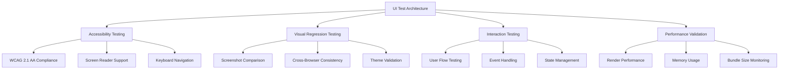

# Comprehensive UI Testing Framework Architecture
## Mainframe KB Assistant - Test Strategy & Implementation Plan

### Executive Summary

Based on analysis of the existing codebase, this document outlines a comprehensive UI testing framework covering accessibility compliance (WCAG 2.1 AA), visual regression testing, interaction validation, and performance monitoring for the Mainframe KB Assistant Electron application.

---

## 1. Current State Analysis

### 1.1 Existing Test Infrastructure
✅ **Strong Foundation Established**
- **Jest Configuration**: Well-structured with projects separation (unit/integration)
- **Coverage Thresholds**: 80% global, 85% for forms, 90% for validation utilities
- **Testing Library Integration**: React Testing Library + Jest-DOM established
- **Accessibility Tools**: Jest-axe, @axe-core/react, jsx-a11y ESLint plugin
- **Playwright Setup**: E2E testing with multi-browser support and visual testing
- **TypeScript Support**: Full TS integration with proper type checking

### 1.2 Component Landscape
- **87 React Components (.tsx files)** requiring comprehensive testing
- **3 TypeScript utility files (.ts files)** supporting UI logic
- **Accessibility-First Architecture**: Dedicated accessibility components and utilities
- **Form-Heavy Application**: Knowledge Base entry forms with complex validation

### 1.3 Existing Test Coverage
- **35 Jest-related configurations** in package.json (extensive test script ecosystem)
- **Accessibility Tests**: WCAG compliance framework already implemented
- **Performance Tests**: Database, search, and UI performance benchmarks
- **Integration Tests**: Service layer and IPC communication testing
- **E2E Tests**: Playwright configuration for Electron app testing

---

## 2. Comprehensive Test Architecture Design

### 2.1 Four-Pillar Testing Strategy



### 2.2 Test Directory Structure

```
tests/
├── ui/
│   ├── accessibility/          # WCAG compliance & a11y
│   │   ├── wcag-compliance/
│   │   ├── keyboard-navigation/
│   │   ├── screen-reader/
│   │   └── color-contrast/
│   ├── visual/                 # Visual regression testing
│   │   ├── snapshots/
│   │   ├── cross-browser/
│   │   ├── theme-variations/
│   │   └── responsive/
│   ├── interaction/           # User interaction testing
│   │   ├── user-flows/
│   │   ├── form-validation/
│   │   ├── search-workflows/
│   │   └── navigation/
│   ├── performance/           # UI performance testing
│   │   ├── render-performance/
│   │   ├── memory-leaks/
│   │   ├── bundle-analysis/
│   │   └── lighthouse/
│   └── integration/           # UI integration tests
│       ├── component-integration/
│       ├── service-integration/
│       └── electron-integration/
├── fixtures/                  # Test data and fixtures
├── mocks/                    # Component and service mocks
├── utils/                    # Testing utilities
└── config/                   # Test configuration files
```

---

## 3. Accessibility Testing Framework

### 3.1 WCAG 2.1 AA Compliance Strategy

**Current State**: Strong foundation with jest-axe integration

**Enhancement Plan**:
```typescript
// Enhanced accessibility test configuration
interface AccessibilityTestSuite {
  components: ComponentTestConfig[];
  wcagLevel: 'AA';
  testTypes: ['automated', 'manual', 'user-testing'];
  coverage: {
    target: 100%;  // All interactive components
    priority: ['forms', 'navigation', 'search', 'modals'];
  };
}
```

**Test Categories**:
1. **Automated WCAG Testing** (jest-axe)
   - Color contrast validation
   - ARIA attribute compliance
   - Semantic HTML structure
   - Focus management

2. **Keyboard Navigation Testing**
   - Tab order verification
   - Keyboard shortcuts functionality
   - Focus trap in modals
   - Skip links validation

3. **Screen Reader Compatibility**
   - NVDA/JAWS/VoiceOver testing
   - Announcement validation
   - Content structure verification
   - Alternative text accuracy

### 3.2 Enhanced Test Implementation

```typescript
// Example enhanced accessibility test
describe('KB Entry Form Accessibility', () => {
  it('meets WCAG 2.1 AA standards', async () => {
    const { container } = render(<KBEntryForm />);
    const results = await axe(container, {
      tags: ['wcag2a', 'wcag2aa', 'wcag21aa'],
      rules: ENHANCED_ACCESSIBILITY_RULES
    });
    expect(results).toHaveNoViolations();
  });

  it('supports complete keyboard navigation', async () => {
    render(<KBEntryForm />);
    await KeyboardNavigationTester.testTabOrder([
      'title-input',
      'category-select',
      'problem-textarea',
      'solution-textarea',
      'tags-input',
      'save-button',
      'cancel-button'
    ]);
  });
});
```

---

## 4. Visual Regression Testing Framework

### 4.1 Screenshot-Based Testing Strategy

**Tools Integration**:
- **Playwright Visual Testing**: Cross-browser screenshot comparison
- **Storybook Chromatic**: Component-level visual testing
- **Percy** (optional): Advanced visual testing platform

**Test Coverage**:
```typescript
interface VisualTestConfig {
  components: ComponentVisualTest[];
  viewports: ['desktop', 'tablet', 'mobile'];
  themes: ['light', 'dark', 'high-contrast'];
  browsers: ['chromium', 'firefox', 'webkit'];
  tolerance: {
    pixel: 0.2;
    layout: 0.1;
  };
}
```

### 4.2 Visual Test Categories

1. **Component Visual Tests**
   - Individual component rendering
   - State variations (loading, error, success)
   - Props combinations
   - Theme variations

2. **Page-Level Visual Tests**
   - Full page screenshots
   - Responsive design validation
   - Cross-browser consistency
   - Print stylesheet testing

3. **User Journey Visual Tests**
   - Search workflow screenshots
   - Form submission flows
   - Navigation state changes
   - Modal interactions

### 4.3 Implementation Example

```typescript
// Visual regression test example
test.describe('Knowledge Base Search Visual Tests', () => {
  test('search results display correctly', async ({ page }) => {
    await page.goto('/');
    await page.fill('[data-testid=search-input]', 'VSAM Status 35');
    await page.click('[data-testid=search-button]');
    await page.waitForSelector('[data-testid=search-results]');

    await expect(page).toHaveScreenshot('search-results-vsam.png', {
      fullPage: true,
      threshold: 0.2
    });
  });
});
```

---

## 5. Interaction Testing Framework

### 5.1 User Flow Testing Strategy

**Focus Areas**:
- Knowledge Base search and browsing
- Entry creation and editing
- Form validation workflows
- Navigation patterns
- Error handling flows

**Testing Approach**:
```typescript
interface InteractionTestSuite {
  userFlows: UserFlowTest[];
  eventTesting: EventTest[];
  stateManagement: StateTest[];
  errorHandling: ErrorScenarioTest[];
}
```

### 5.2 Advanced Interaction Tests

1. **Form Interaction Testing**
   - Complex validation scenarios
   - Real-time feedback testing
   - Multi-step form flows
   - Auto-save functionality

2. **Search Interaction Testing**
   - Query input validation
   - Filter combinations
   - Result interaction
   - Infinite scroll testing

3. **State Management Testing**
   - Redux/Context state changes
   - Local storage persistence
   - Cross-component communication
   - Memory leak prevention

### 5.3 Implementation Framework

```typescript
// Advanced interaction test example
describe('KB Entry Creation Flow', () => {
  it('completes full entry creation workflow', async () => {
    const user = userEvent.setup();
    render(<App />);

    // Navigate to create entry
    await user.click(screen.getByRole('button', { name: /add knowledge/i }));

    // Fill form with validation
    await user.type(screen.getByLabelText(/title/i), 'Test Entry');
    await user.selectOptions(screen.getByLabelText(/category/i), 'VSAM');

    // Test real-time validation
    await waitFor(() => {
      expect(screen.getByText(/title is valid/i)).toBeInTheDocument();
    });

    // Submit and verify success
    await user.click(screen.getByRole('button', { name: /save/i }));
    await waitFor(() => {
      expect(screen.getByText(/entry created successfully/i)).toBeInTheDocument();
    });
  });
});
```

---

## 6. Performance Validation Framework

### 6.1 Performance Testing Strategy

**Metrics Focus**:
- Component render times
- Bundle size monitoring
- Memory usage patterns
- Core Web Vitals
- Electron app startup time

**Tools Integration**:
```typescript
interface PerformanceTestSuite {
  renderPerformance: RenderTest[];
  memoryTesting: MemoryTest[];
  bundleAnalysis: BundleTest[];
  lighthouseAudits: LighthouseTest[];
}
```

### 6.2 Performance Test Categories

1. **Render Performance Testing**
   - Component mount/unmount times
   - Re-render optimization
   - Virtual scrolling performance
   - Large dataset rendering

2. **Memory Usage Testing**
   - Memory leak detection
   - Component cleanup verification
   - Event listener cleanup
   - Cache management testing

3. **Bundle Analysis Testing**
   - Code splitting effectiveness
   - Tree shaking validation
   - Dynamic import testing
   - Asset optimization verification

### 6.3 Performance Test Implementation

```typescript
// Performance test example
describe('Search Performance', () => {
  it('renders search results within performance budget', async () => {
    const performanceObserver = new PerformanceTestRunner();

    render(<SearchResults items={LARGE_DATASET} />);

    const metrics = await performanceObserver.measure();

    expect(metrics.renderTime).toBeLessThan(100); // 100ms budget
    expect(metrics.memoryUsage).toBeLessThan(50 * 1024 * 1024); // 50MB budget
  });
});
```

---

## 7. Testing Tools & Dependencies

### 7.1 Required Libraries

**Current Dependencies (Keep)**:
```json
{
  "jest": "^29.7.0",
  "@testing-library/react": "^14.1.2",
  "@testing-library/jest-dom": "^6.1.5",
  "@testing-library/user-event": "^14.5.1",
  "jest-axe": "^8.0.0",
  "@axe-core/react": "^4.8.0"
}
```

**Additional Dependencies Needed**:
```json
{
  // Visual Testing
  "@storybook/test-runner": "^0.15.0",
  "playwright": "^1.40.0",
  "@playwright/test": "^1.40.0",

  // Performance Testing
  "web-vitals": "^3.5.0",
  "lighthouse": "^11.0.0",
  "puppeteer": "^21.0.0",

  // Testing Utilities
  "@testing-library/react-hooks": "^8.0.1",
  "msw": "^1.3.2",
  "fake-indexeddb": "^4.0.2",

  // Accessibility Testing Enhanced
  "pa11y": "^7.0.0",
  "axe-playwright": "^1.2.3",

  // Visual Regression
  "reg-cli": "^0.17.6",
  "jest-image-snapshot": "^6.2.0"
}
```

### 7.2 Configuration Files Structure

```
config/
├── jest/
│   ├── jest.ui.config.js          # UI-specific Jest config
│   ├── jest.accessibility.config.js
│   ├── jest.visual.config.js
│   └── jest.performance.config.js
├── playwright/
│   ├── playwright.visual.config.ts
│   ├── playwright.accessibility.config.ts
│   └── playwright.performance.config.ts
└── testing/
    ├── test-setup.ts
    ├── accessibility-setup.ts
    └── performance-setup.ts
```

---

## 8. Coverage Targets & Metrics

### 8.1 Coverage Targets by Category

| Test Category | Coverage Target | Priority Components |
|--------------|----------------|-------------------|
| **Accessibility** | 100% | Forms, Navigation, Search, Modals |
| **Visual** | 95% | All visible components |
| **Interaction** | 90% | User-facing interactions |
| **Performance** | 85% | Critical path components |

### 8.2 Quality Gates

```typescript
interface QualityGates {
  accessibility: {
    wcagViolations: 0;
    keyboardNavigation: 100%;
    screenReaderCompatibility: 100%;
  };
  visual: {
    pixelDifference: '<0.2%';
    crossBrowserConsistency: 100%;
  };
  interaction: {
    userFlowSuccess: 98%;
    formValidationCoverage: 100%;
  };
  performance: {
    renderTime: '<100ms';
    memoryLeaks: 0;
    bundleSize: '<2MB';
  };
}
```

---

## 9. CI/CD Integration Strategy

### 9.1 GitHub Actions Workflow

```yaml
name: UI Testing Pipeline
on: [push, pull_request]

jobs:
  accessibility-tests:
    runs-on: ubuntu-latest
    steps:
      - uses: actions/checkout@v4
      - name: Run WCAG Compliance Tests
        run: npm run test:a11y:ci

  visual-tests:
    runs-on: ubuntu-latest
    steps:
      - uses: actions/checkout@v4
      - name: Run Visual Regression Tests
        run: npm run test:visual:ci

  interaction-tests:
    runs-on: ubuntu-latest
    steps:
      - uses: actions/checkout@v4
      - name: Run Interaction Tests
        run: npm run test:interaction:ci

  performance-tests:
    runs-on: ubuntu-latest
    steps:
      - uses: actions/checkout@v4
      - name: Run Performance Tests
        run: npm run test:performance:ci
```

### 9.2 Test Reporting Strategy

- **HTML Reports**: Comprehensive test results with screenshots
- **JUnit XML**: CI/CD integration reporting
- **Coverage Reports**: LCOV format for coverage visualization
- **Performance Reports**: JSON metrics for trend analysis
- **Accessibility Reports**: WCAG violation summaries

---

## 10. Implementation Roadmap

### 10.1 Phase 1: Foundation Enhancement (Week 1-2)
✅ **Current**: Strong foundation exists
🎯 **Next**:
- Enhance existing accessibility tests
- Add visual regression framework
- Implement performance monitoring

### 10.2 Phase 2: Comprehensive Coverage (Week 3-4)
- Complete component test coverage
- Implement user flow testing
- Add cross-browser testing
- Performance budget enforcement

### 10.3 Phase 3: Advanced Features (Week 5-6)
- Screen reader testing automation
- Visual diff analysis
- Memory leak detection
- Bundle size monitoring

### 10.4 Phase 4: CI/CD Integration (Week 7-8)
- GitHub Actions workflows
- Quality gate enforcement
- Automated reporting
- Performance trending

---

## 11. Success Metrics & KPIs

### 11.1 Quality Metrics
- **Zero WCAG violations** in production
- **98% user flow success rate**
- **100% keyboard navigation coverage**
- **<100ms component render times**
- **Zero memory leaks detected**

### 11.2 Developer Experience Metrics
- **<30 second test execution** for component tests
- **90% test reliability** (non-flaky tests)
- **Clear test failure messaging**
- **Automated test generation** for new components

---

## 12. Conclusion

The Mainframe KB Assistant already has an excellent testing foundation with strong accessibility focus and comprehensive test infrastructure. This architecture plan builds upon existing strengths to create a world-class UI testing framework that ensures:

- **Accessibility-First Development**: WCAG 2.1 AA compliance by design
- **Visual Consistency**: Cross-browser and theme validation
- **User Experience Excellence**: Comprehensive interaction testing
- **Performance Optimization**: Continuous performance monitoring

The phased implementation approach minimizes risk while maximizing value delivery, leveraging the substantial existing test infrastructure investment.

---

*This document serves as the technical specification for implementing a comprehensive UI testing framework that supports the Mainframe KB Assistant's mission of providing accessible, reliable, and high-performance knowledge management capabilities.*