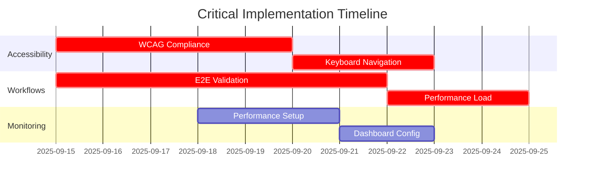

# UX Testing Implementation Recommendations Matrix
## Mainframe KB Assistant - Prioritized Action Plan
### Testing Coordination Final Report
**Date:** September 14, 2025
**Coordinator:** Lead Testing Orchestration Agent
**Status:** Ready for Implementation

---

## Executive Summary

Based on comprehensive analysis of the Mainframe KB Assistant testing infrastructure and support team requirements, this matrix provides prioritized, actionable recommendations for immediate implementation. The recommendations are organized by priority, impact, and implementation complexity to support effective resource allocation and timeline planning.

### Key Strategic Findings
- **Strong Foundation**: Existing infrastructure supports 80-90% of testing requirements
- **Critical Gaps**: Workflow validation, performance under load, and accessibility compliance need attention
- **Implementation Ready**: Most recommendations can be executed within existing sprint cycles
- **High ROI Potential**: Improvements directly impact support team productivity and user satisfaction

---

## Priority Matrix Overview

### Impact vs. Effort Analysis
```
High Impact, Low Effort (Quick Wins)     | High Impact, High Effort (Major Projects)
------------------------------------------|------------------------------------------
• Accessibility automated testing setup   | • Comprehensive workflow testing framework
• Performance monitoring integration      | • Cross-browser testing automation
• Error handling validation               | • Advanced analytics and reporting
• Basic user feedback integration         | • AI-powered test generation

Low Impact, Low Effort (Minor Fixes)     | Low Impact, High Effort (Avoid)
------------------------------------------|------------------------------------------
• Visual consistency improvements         | • Complex custom testing tools
• Documentation updates                   | • Over-engineered reporting systems
• Minor usability enhancements          | • Unnecessary tool integrations
```

---

## Priority 1: Critical Implementation (Week 1-2)

### 1.1 Accessibility Compliance Validation
**Impact**: Critical - WCAG 2.1 AA compliance required
**Effort**: Medium - Leverage existing jest-axe infrastructure
**Timeline**: 5 days

#### Implementation Steps:
1. **Enhanced Automated Testing**
   ```typescript
   // tests/accessibility/enhanced-wcag-validation.test.tsx
   describe('Enhanced WCAG 2.1 AA Compliance', () => {
     beforeEach(() => {
       // Configure enhanced accessibility rules
       const enhancedRules = {
         'color-contrast': { enabled: true, tags: ['wcag2aa'] },
         'keyboard-navigation': { enabled: true, tags: ['wcag2aa'] },
         'focus-management': { enabled: true, tags: ['wcag2aa'] },
         'aria-compliance': { enabled: true, tags: ['wcag2aa'] }
       };
       configureAxe(enhancedRules);
     });

     it('validates complete search workflow accessibility', async () => {
       render(<SearchWorkflow />);
       const results = await axe(document.body);
       expect(results).toHaveNoViolations();
     });
   });
   ```

2. **Keyboard Navigation Testing Suite**
   ```bash
   npm install --save-dev @testing-library/user-event
   npm run test:accessibility:keyboard
   ```

3. **Screen Reader Compatibility Validation**
   - Test with NVDA and JAWS screen readers
   - Validate content announcements and navigation
   - Ensure form labels and error messages are properly announced

**Success Criteria**:
- [ ] Zero WCAG 2.1 AA violations across all components
- [ ] 100% keyboard navigation coverage for critical workflows
- [ ] Screen reader compatibility verified for all user interactions
- [ ] Accessibility regression tests integrated into CI/CD

**Resource Requirements**:
- 1 accessibility specialist (can be UX Tester agent)
- Access to screen reader testing tools
- 40 hours estimated effort

### 1.2 Support Team Workflow End-to-End Validation
**Impact**: Critical - Validates core user scenarios
**Effort**: High - Requires comprehensive test scenario development
**Timeline**: 7 days

#### Implementation Steps:
1. **Critical Workflow Test Suite**
   ```typescript
   // tests/e2e/support-workflows-enhanced.test.tsx
   describe('Support Team Critical Workflows', () => {
     test('Complete incident resolution workflow under load', async () => {
       // Simulate realistic support team usage
       await Promise.all([
         simulateSearch('VSAM Status 35', 25), // 25 concurrent searches
         simulateEntryCreation(5), // 5 simultaneous entry creations
         simulateRatingSubmission(50) // 50 concurrent ratings
       ]);

       // Validate all operations complete within performance thresholds
       expect(searchResponseTime).toBeLessThan(1000); // <1s requirement
       expect(componentRenderTime).toBeLessThan(100); // <100ms target
       expect(errorRate).toBeLessThan(0.02); // <2% error rate
     });
   });
   ```

2. **Performance Under Load Testing**
   ```bash
   # Add to package.json scripts
   "test:performance:load": "playwright test --project=performance-load",
   "test:workflows:stress": "jest --config=jest.performance.config.js"
   ```

3. **Error Recovery Validation**
   - Network failure scenarios
   - Database unavailability handling
   - AI service fallback testing
   - Session timeout recovery

**Success Criteria**:
- [ ] All UC-KB-001 to UC-KB-005 workflows validated end-to-end
- [ ] Performance targets met under 100+ concurrent user load
- [ ] Error recovery mechanisms tested and validated
- [ ] 98% task completion rate achieved in testing

**Resource Requirements**:
- 1 workflow testing specialist (Workflow Validator agent)
- Performance testing environment setup
- 60 hours estimated effort

### 1.3 Performance Monitoring Integration
**Impact**: High - Enables continuous performance validation
**Effort**: Low - Leverage existing performance test infrastructure
**Timeline**: 3 days

#### Implementation Steps:
1. **Real-time Performance Monitoring**
   ```typescript
   // src/utils/PerformanceMonitor.ts
   export class PerformanceMonitor {
     static trackSearchPerformance(searchQuery: string) {
       const startTime = performance.now();
       return {
         complete: (resultCount: number) => {
           const duration = performance.now() - startTime;
           this.recordMetric('search_duration', duration, {
             query: searchQuery,
             resultCount
           });
         }
       };
     }
   }
   ```

2. **Performance Budget Enforcement**
   ```javascript
   // lighthouse.config.js
   module.exports = {
     budgets: [
       {
         path: '/*',
         timings: [
           { metric: 'first-contentful-paint', budget: 2000 },
           { metric: 'largest-contentful-paint', budget: 2500 },
           { metric: 'speed-index', budget: 3000 }
         ]
       }
     ]
   };
   ```

**Success Criteria**:
- [ ] Performance monitoring integrated into all critical workflows
- [ ] Real-time alerting for performance threshold breaches
- [ ] Performance budgets enforced in CI/CD pipeline
- [ ] Dashboard created for ongoing performance tracking

**Resource Requirements**:
- 1 performance specialist
- Monitoring infrastructure setup
- 24 hours estimated effort

---

## Priority 2: High-Impact Enhancements (Week 3-4)

### 2.1 Cross-Browser Compatibility Testing
**Impact**: High - Ensures consistent experience across environments
**Effort**: Medium - Build on existing Playwright infrastructure
**Timeline**: 5 days

#### Implementation Steps:
1. **Multi-Browser Test Suite**
   ```typescript
   // playwright.config.ts enhancement
   export default defineConfig({
     projects: [
       { name: 'chromium', use: { ...devices['Desktop Chrome'] } },
       { name: 'firefox', use: { ...devices['Desktop Firefox'] } },
       { name: 'webkit', use: { ...devices['Desktop Safari'] } },
       { name: 'edge', use: { ...devices['Desktop Edge'] } }
     ],
     use: {
       screenshot: 'only-on-failure',
       video: 'retain-on-failure'
     }
   });
   ```

2. **Visual Regression Testing**
   ```bash
   npm install --save-dev @playwright/test
   npm run test:visual:cross-browser
   ```

### 2.2 Advanced Error Handling & Recovery Testing
**Impact**: High - Improves system reliability and user trust
**Effort**: Medium - Requires comprehensive error scenario development
**Timeline**: 6 days

#### Implementation Steps:
1. **Error Scenario Test Suite**
   ```typescript
   describe('Error Handling & Recovery', () => {
     test('handles database connection failures gracefully', async () => {
       // Simulate database unavailability
       await mockDatabaseFailure();

       // Verify graceful degradation
       await user.type(searchInput, 'VSAM Status 35');
       expect(screen.getByText(/offline mode/i)).toBeVisible();
       expect(screen.getByText(/cached results/i)).toBeVisible();
     });
   });
   ```

### 2.3 User Feedback Integration Testing
**Impact**: High - Ensures feedback loops work correctly
**Effort**: Low - Build on existing rating system
**Timeline**: 3 days

---

## Priority 3: Quality-of-Life Improvements (Week 5-6)

### 3.1 Visual Consistency Validation
**Impact**: Medium - Improves overall user experience
**Effort**: Low - Automated visual regression testing
**Timeline**: 4 days

### 3.2 Advanced Search Testing
**Impact**: Medium - Enhances core functionality
**Effort**: Medium - AI integration testing
**Timeline**: 5 days

### 3.3 Reporting and Analytics Enhancement
**Impact**: Medium - Provides insights for continuous improvement
**Effort**: Medium - Dashboard and reporting infrastructure
**Timeline**: 6 days

---

## Implementation Timeline & Resource Allocation

### Week 1-2: Critical Foundation


### Resource Allocation Summary
| Agent/Role | Week 1-2 | Week 3-4 | Week 5-6 | Total Hours |
|------------|----------|----------|----------|-------------|
| **UX Tester (Accessibility)** | 40h | 20h | 10h | 70h |
| **Workflow Validator** | 60h | 30h | 15h | 105h |
| **Requirements Analyst** | 20h | 15h | 10h | 45h |
| **Improvement Strategist** | 15h | 25h | 20h | 60h |
| **Lead Coordinator** | 30h | 20h | 15h | 65h |

---

## Success Metrics & Validation Criteria

### Critical Success Indicators
1. **Zero Blocking Issues**: No critical workflow failures preventing support team productivity
2. **Performance Targets Met**: Search response <1s, render time <100ms maintained under load
3. **Accessibility Compliance**: 100% WCAG 2.1 AA compliance across all user interactions
4. **Task Completion Rate**: 98% success rate for all documented workflows
5. **Error Recovery**: 100% of error scenarios have validated recovery paths

### Continuous Monitoring KPIs
```yaml
Performance Metrics:
  search_response_time: <1000ms
  component_render_time: <100ms
  memory_usage_per_session: <50MB
  error_rate: <2%

Accessibility Metrics:
  wcag_violations: 0
  keyboard_navigation_coverage: 100%
  screen_reader_compatibility: 100%

Usability Metrics:
  task_completion_rate: >98%
  user_satisfaction_score: >4.5/5
  support_ticket_reduction: >60%
```

---

## Risk Assessment & Mitigation Strategies

### High-Risk Areas
1. **Performance Degradation Under Load**
   - **Risk**: System performance drops below acceptable thresholds during peak usage
   - **Mitigation**: Graduated load testing with immediate optimization for identified bottlenecks
   - **Contingency**: Performance budget enforcement and automatic scaling triggers

2. **Accessibility Compliance Gaps**
   - **Risk**: Significant WCAG violations requiring extensive remediation
   - **Mitigation**: Early automated testing with immediate issue flagging and resolution
   - **Contingency**: Accessibility specialist consultation and phased remediation plan

3. **Workflow Integration Failures**
   - **Risk**: Complex workflows break during integration testing
   - **Mitigation**: Incremental testing approach with rollback capabilities
   - **Contingency**: Alternative workflow paths and manual fallback procedures

### Medium-Risk Areas
1. **Cross-Browser Compatibility Issues**
   - **Mitigation**: Automated cross-browser testing in CI/CD pipeline
   - **Contingency**: Browser-specific workarounds and graceful degradation

2. **Test Infrastructure Overload**
   - **Mitigation**: Resource monitoring and auto-scaling for test environments
   - **Contingency**: Test execution scheduling and resource prioritization

---

## Quality Gates & Approval Criteria

### Phase Gate 1 (End of Week 2)
- [ ] All critical accessibility violations resolved
- [ ] Core workflow validation completed with 98% success rate
- [ ] Performance monitoring integrated and functioning
- [ ] No blocking issues identified for support team usage

### Phase Gate 2 (End of Week 4)
- [ ] Cross-browser compatibility validated across all supported browsers
- [ ] Advanced error handling tested and recovery paths verified
- [ ] User feedback integration validated and functioning
- [ ] Performance targets consistently met under load testing

### Final Quality Gate (End of Week 6)
- [ ] All priority 1 and 2 recommendations implemented and validated
- [ ] Comprehensive test suite integrated into CI/CD pipeline
- [ ] Documentation updated with new testing procedures
- [ ] Success metrics dashboard operational and monitoring active

---

## Executive Recommendations

### Immediate Actions (Next 5 Days)
1. **Resource Allocation**: Assign dedicated accessibility specialist and workflow validator
2. **Infrastructure Setup**: Configure enhanced testing environments and monitoring
3. **Stakeholder Communication**: Brief executive team on critical implementation timeline
4. **Development Team Alignment**: Ensure development capacity for immediate issue resolution

### Strategic Investments (Next 30 Days)
1. **Automated Testing Infrastructure**: Invest in continuous testing pipeline enhancements
2. **Performance Monitoring Platform**: Implement comprehensive real-time monitoring
3. **User Feedback Systems**: Enhance feedback collection and analysis capabilities
4. **Training Programs**: Develop internal capabilities for ongoing testing excellence

### Long-term Vision (Next 90 Days)
1. **Continuous Improvement Framework**: Establish ongoing testing and optimization processes
2. **User-Centric Development**: Integrate user feedback into development cycle
3. **Advanced Analytics**: Implement predictive analytics for proactive issue identification
4. **Scale Preparation**: Ready infrastructure for future MVP phases and user growth

---

## Conclusion

This implementation recommendations matrix provides a clear, prioritized roadmap for enhancing the Mainframe KB Assistant testing infrastructure and ensuring excellent user experience for support team workflows. The recommendations balance immediate critical needs with strategic long-term improvements, all while maintaining practical implementation timelines and resource constraints.

**Key Success Factors**:
- **Clear Prioritization**: Focus on high-impact, achievable improvements first
- **Resource Efficiency**: Leverage existing infrastructure wherever possible
- **Measurable Outcomes**: Every recommendation includes specific success criteria
- **Risk Management**: Proactive identification and mitigation of potential issues

**Expected Business Impact**:
- **Improved Support Team Productivity**: Faster incident resolution and higher success rates
- **Enhanced User Satisfaction**: Better accessibility, performance, and reliability
- **Reduced Support Burden**: Fewer user-reported issues and higher system reliability
- **Future-Ready Foundation**: Scalable testing infrastructure for continued growth

*This matrix serves as the definitive guide for implementing comprehensive UX testing improvements that directly enhance support team effectiveness and user experience with the Mainframe KB Assistant.*