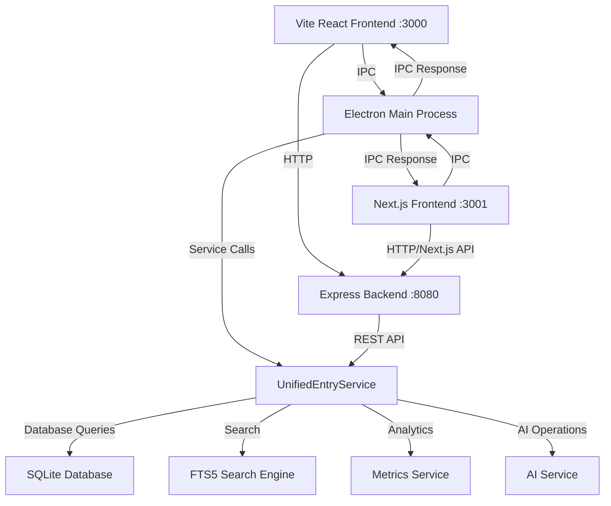

# API Documentation V3.0
## Accenture Mainframe AI Assistant - Hybrid Architecture API Reference

**Version**: 3.0.0
**Date**: September 21, 2024
**Architecture**: Hybrid Vite + Next.js + Electron + SQLite
**Target Audience**: Developers, QA Engineers, Integration Teams

---

## 📋 Overview

This document provides comprehensive API documentation for the Accenture Mainframe AI Assistant V3.0 with hybrid architecture. The application supports dual frontend modes (Vite + Next.js) with Electron's IPC (Inter-Process Communication) for secure communication between frontend applications and backend Node.js services.

## 🏗️ Hybrid Architecture Overview



### Communication Flow (Dual Mode)

**Vite Mode (Legacy)**:
1. **Frontend**: Vite React components trigger API calls via `window.electronAPI`
2. **IPC Layer**: Electron's secure IPC handles communication
3. **Main Process**: Routes requests to appropriate service handlers
4. **Service Layer**: Business logic and database operations
5. **Response**: Results returned through IPC back to frontend

**Next.js Mode (Modern)**:
1. **Frontend**: Next.js components use custom hooks (`useElectron`, `useDatabase`)
2. **IPC Layer**: Electron's secure IPC handles communication
3. **API Routes**: Next.js API routes can also call Express backend
4. **Service Layer**: Shared business logic and database operations
5. **Response**: Results returned through IPC or HTTP API

**Express Backend (Shared)**:
- Both frontend modes can call Express API directly
- Provides REST endpoints for database operations
- Shared between Vite and Next.js frontends

---

## 🔧 Core API Structure

### Base API Interface
```typescript
interface ElectronAPI {
  // Unified entry operations
  entry: EntryAPI;

  // Incident-specific operations
  incident: IncidentAPI;

  // Knowledge base operations
  knowledge: KnowledgeAPI;

  // Search operations
  search: SearchAPI;

  // Settings and configuration
  settings: SettingsAPI;

  // AI operations
  ai: AIAPI;

  // Analytics and metrics
  analytics: AnalyticsAPI;
}
```

---

## 📊 Entry API (Unified Operations)

The Entry API handles both incidents and knowledge base entries through a unified interface.

### Interface Definition
```typescript
interface EntryAPI {
  create(data: CreateEntryData): Promise<UnifiedEntry>;
  update(id: string, updates: UpdateEntryData): Promise<UnifiedEntry>;
  get(id: string): Promise<UnifiedEntry>;
  delete(id: string): Promise<void>;
  list(filters?: EntryFilters): Promise<UnifiedEntry[]>;
  search(query: string, filters?: SearchFilters): Promise<SearchResults>;
}
```

### Data Types
```typescript
interface UnifiedEntry {
  id: string;
  entry_type: 'incident' | 'knowledge';
  title: string;
  description: string;
  solution?: string;

  // Classification
  category: string;
  severity: 'low' | 'medium' | 'high' | 'critical';
  tags: string[];

  // Incident-specific fields
  incident_status?: 'aberto' | 'em_tratamento' | 'em_revisao' | 'resolvido' | 'cancelado';
  priority?: number;
  assigned_to?: string;
  reporter?: string;
  sla_deadline?: string; // ISO date string

  // Knowledge-specific fields
  usage_count?: number;
  success_count?: number;
  confidence_score?: number;

  // Audit trail
  created_at: string; // ISO date string
  updated_at: string; // ISO date string
  resolved_at?: string; // ISO date string
  created_by: string;
  last_used?: string; // ISO date string
}

interface CreateEntryData {
  entry_type: 'incident' | 'knowledge';
  title: string;
  description: string;
  solution?: string;
  category: string;
  severity: 'low' | 'medium' | 'high' | 'critical';
  tags?: string[];

  // Incident-specific
  priority?: number;
  reporter?: string;
  assigned_to?: string;

  // Metadata
  created_by: string;
}

interface UpdateEntryData {
  title?: string;
  description?: string;
  solution?: string;
  category?: string;
  severity?: 'low' | 'medium' | 'high' | 'critical';
  tags?: string[];
  incident_status?: 'aberto' | 'em_tratamento' | 'em_revisao' | 'resolvido' | 'cancelado';
  priority?: number;
  assigned_to?: string;
}
```

### API Methods

#### Create Entry
```typescript
// Create a new incident
const incident = await window.electronAPI.entry.create({
  entry_type: 'incident',
  title: 'Database Connection Failed',
  description: 'Unable to connect to production database',
  category: 'database',
  severity: 'high',
  priority: 1,
  reporter: 'john.doe@accenture.com',
  created_by: 'john.doe@accenture.com'
});

// Create a knowledge entry
const knowledge = await window.electronAPI.entry.create({
  entry_type: 'knowledge',
  title: 'How to Restart Apache Service',
  description: 'Steps to restart Apache web server',
  solution: 'Run: sudo systemctl restart apache2',
  category: 'web-server',
  severity: 'medium',
  tags: ['apache', 'restart', 'linux'],
  created_by: 'admin@accenture.com'
});
```

#### Update Entry
```typescript
// Update an incident
const updated = await window.electronAPI.entry.update('incident-123', {
  incident_status: 'em_tratamento',
  assigned_to: 'jane.smith@accenture.com',
  priority: 2
});

// Update knowledge entry
const updatedKnowledge = await window.electronAPI.entry.update('kb-456', {
  solution: 'Updated solution with additional steps...',
  tags: ['apache', 'restart', 'linux', 'systemctl']
});
```

#### Get Entry
```typescript
// Get specific entry
const entry = await window.electronAPI.entry.get('incident-123');

if (entry.entry_type === 'incident') {
  console.log('Incident status:', entry.incident_status);
} else {
  console.log('Knowledge usage count:', entry.usage_count);
}
```

#### List Entries
```typescript
// List all incidents
const incidents = await window.electronAPI.entry.list({
  entry_type: 'incident',
  incident_status: 'aberto'
});

// List knowledge entries by category
const networkKnowledge = await window.electronAPI.entry.list({
  entry_type: 'knowledge',
  category: 'network'
});
```

#### Delete Entry
```typescript
// Delete an entry (with confirmation)
try {
  await window.electronAPI.entry.delete('entry-789');
  console.log('Entry deleted successfully');
} catch (error) {
  console.error('Failed to delete entry:', error.message);
}
```

---

## 🚨 Incident API (Specialized Operations)

The Incident API provides specialized operations for incident management workflows.

### Interface Definition
```typescript
interface IncidentAPI {
  create(data: CreateIncidentData): Promise<UnifiedEntry>;
  resolve(id: string, resolution: ResolutionData): Promise<UnifiedEntry>;
  updateStatus(id: string, status: IncidentStatus): Promise<UnifiedEntry>;
  assign(id: string, assignee: string): Promise<UnifiedEntry>;
  getQueue(filters?: IncidentFilters): Promise<UnifiedEntry[]>;
  getHistory(id: string): Promise<IncidentHistoryEntry[]>;
  addComment(id: string, comment: string): Promise<void>;
  updateSLA(id: string, slaDeadline: string): Promise<UnifiedEntry>;
}
```

### Data Types
```typescript
interface CreateIncidentData {
  title: string;
  description: string;
  category: string;
  severity: 'low' | 'medium' | 'high' | 'critical';
  priority: number;
  reporter: string;
  tags?: string[];
  sla_deadline?: string; // ISO date string
}

interface ResolutionData {
  solution: string;
  rootCause?: string;
  tags?: string[];
  relatedEntries?: string[]; // IDs of related knowledge entries
  estimatedResolutionTime?: number; // minutes
}

interface IncidentFilters {
  status?: IncidentStatus | IncidentStatus[];
  severity?: 'low' | 'medium' | 'high' | 'critical';
  category?: string;
  assigned_to?: string;
  reporter?: string;
  created_after?: string; // ISO date string
  created_before?: string; // ISO date string
  sla_overdue?: boolean;
}

interface IncidentHistoryEntry {
  id: string;
  incident_id: string;
  action: 'created' | 'updated' | 'assigned' | 'status_changed' | 'resolved' | 'commented';
  details: string;
  user: string;
  timestamp: string; // ISO date string
}

type IncidentStatus = 'aberto' | 'em_tratamento' | 'em_revisao' | 'resolvido' | 'cancelado';
```

### API Methods

#### Create Incident
```typescript
const incident = await window.electronAPI.incident.create({
  title: 'Payment Processing Error',
  description: 'Credit card transactions failing with error code 500',
  category: 'payment',
  severity: 'critical',
  priority: 1,
  reporter: 'support@accenture.com',
  tags: ['payment', 'credit-card', 'error-500'],
  sla_deadline: '2024-09-22T14:00:00Z'
});
```

#### Resolve Incident
```typescript
// Resolve incident (automatically creates knowledge entry)
const resolved = await window.electronAPI.incident.resolve('incident-123', {
  solution: 'Restarted payment gateway service and cleared cache',
  rootCause: 'Memory leak in payment processor',
  tags: ['payment-gateway', 'restart', 'memory-leak'],
  estimatedResolutionTime: 30
});

// The resolved incident becomes searchable as knowledge automatically
console.log('Resolution created knowledge entry:', resolved.id);
```

#### Update Status
```typescript
// Update incident status
const updated = await window.electronAPI.incident.updateStatus(
  'incident-123',
  'em_tratamento'
);
```

#### Assign Incident
```typescript
// Assign incident to team member
const assigned = await window.electronAPI.incident.assign(
  'incident-123',
  'tech.lead@accenture.com'
);
```

#### Get Incident Queue
```typescript
// Get active incidents assigned to current user
const myIncidents = await window.electronAPI.incident.getQueue({
  status: ['aberto', 'em_tratamento'],
  assigned_to: 'current.user@accenture.com'
});

// Get high priority incidents
const highPriorityIncidents = await window.electronAPI.incident.getQueue({
  severity: 'critical',
  status: 'aberto'
});

// Get overdue incidents
const overdueIncidents = await window.electronAPI.incident.getQueue({
  sla_overdue: true
});
```

#### Get Incident History
```typescript
// Get complete history of incident changes
const history = await window.electronAPI.incident.getHistory('incident-123');

history.forEach(entry => {
  console.log(`${entry.timestamp}: ${entry.action} by ${entry.user}`);
  console.log(`Details: ${entry.details}`);
});
```

#### Add Comment
```typescript
// Add comment to incident
await window.electronAPI.incident.addComment(
  'incident-123',
  'Contacted vendor for support. Waiting for response.'
);
```

---

## 📚 Knowledge API (Knowledge Base Operations)

### Interface Definition
```typescript
interface KnowledgeAPI {
  create(data: CreateKnowledgeData): Promise<UnifiedEntry>;
  recordUsage(id: string, success: boolean): Promise<void>;
  rate(id: string, rating: number): Promise<void>;
  getPopular(limit?: number): Promise<UnifiedEntry[]>;
  getRecent(limit?: number): Promise<UnifiedEntry[]>;
  getByCategory(category: string): Promise<UnifiedEntry[]>;
  getSimilar(id: string, limit?: number): Promise<UnifiedEntry[]>;
  getMetrics(): Promise<KnowledgeMetrics>;
}
```

### Data Types
```typescript
interface CreateKnowledgeData {
  title: string;
  description: string;
  solution: string;
  category: string;
  severity: 'low' | 'medium' | 'high' | 'critical';
  tags: string[];
  confidence_score?: number; // 0-1
}

interface KnowledgeMetrics {
  totalEntries: number;
  totalUsage: number;
  averageSuccessRate: number;
  topCategories: Array<{
    category: string;
    count: number;
    successRate: number;
  }>;
  popularEntries: Array<{
    id: string;
    title: string;
    usageCount: number;
    successRate: number;
  }>;
  recentlyCreated: number; // Count in last 30 days
}
```

### API Methods

#### Create Knowledge Entry
```typescript
const knowledge = await window.electronAPI.knowledge.create({
  title: 'How to Clear Browser Cache',
  description: 'Steps to clear cache in different browsers',
  solution: '1. Open browser settings\n2. Find privacy/security section\n3. Clear browsing data',
  category: 'browser',
  severity: 'low',
  tags: ['browser', 'cache', 'troubleshooting'],
  confidence_score: 0.9
});
```

#### Record Usage
```typescript
// Record successful usage
await window.electronAPI.knowledge.recordUsage('kb-456', true);

// Record unsuccessful usage
await window.electronAPI.knowledge.recordUsage('kb-456', false);
```

#### Rate Knowledge Entry
```typescript
// Rate entry (1-5 stars)
await window.electronAPI.knowledge.rate('kb-456', 5);
```

#### Get Popular Knowledge
```typescript
// Get top 10 most used knowledge entries
const popular = await window.electronAPI.knowledge.getPopular(10);

popular.forEach(entry => {
  console.log(`${entry.title}: ${entry.usage_count} uses`);
});
```

#### Get Similar Entries
```typescript
// Find similar knowledge entries
const similar = await window.electronAPI.knowledge.getSimilar('kb-456', 5);
```

#### Get Knowledge Metrics
```typescript
const metrics = await window.electronAPI.knowledge.getMetrics();

console.log('Total knowledge entries:', metrics.totalEntries);
console.log('Average success rate:', metrics.averageSuccessRate);
console.log('Top category:', metrics.topCategories[0]);
```

---

## 🔍 Search API (Unified Search)

### Interface Definition
```typescript
interface SearchAPI {
  unified(params: UnifiedSearchParams): Promise<SearchResults>;
  suggest(query: string, type?: 'all' | 'incidents' | 'knowledge'): Promise<string[]>;
  similar(entryId: string): Promise<UnifiedEntry[]>;
  advanced(params: AdvancedSearchParams): Promise<SearchResults>;
  history(): Promise<SearchHistoryEntry[]>;
  saveSearch(query: string, filters: SearchFilters, name: string): Promise<void>;
  getSavedSearches(): Promise<SavedSearch[]>;
}
```

### Data Types
```typescript
interface UnifiedSearchParams {
  query: string;
  type?: 'all' | 'incidents' | 'knowledge';
  filters?: SearchFilters;
  limit?: number;
  offset?: number;
  sortBy?: 'relevance' | 'date' | 'title' | 'usage';
  sortOrder?: 'asc' | 'desc';
}

interface SearchFilters {
  category?: string;
  severity?: 'low' | 'medium' | 'high' | 'critical';
  tags?: string[];
  dateRange?: {
    from: string; // ISO date string
    to: string; // ISO date string
  };
  status?: IncidentStatus; // For incidents only
  assignedTo?: string; // For incidents only
  minUsageCount?: number; // For knowledge only
  minSuccessRate?: number; // For knowledge only
}

interface SearchResults {
  entries: UnifiedEntry[];
  totalCount: number;
  hasMore: boolean;
  facets: SearchFacets;
  searchTime: number; // milliseconds
}

interface SearchFacets {
  categories: Array<{ name: string; count: number; }>;
  severities: Array<{ name: string; count: number; }>;
  tags: Array<{ name: string; count: number; }>;
  statuses: Array<{ name: string; count: number; }>; // For incidents
}

interface AdvancedSearchParams extends UnifiedSearchParams {
  titleOnly?: boolean;
  solutionOnly?: boolean;
  exactPhrase?: boolean;
  excludeTerms?: string[];
  similarityThreshold?: number; // 0-1
}

interface SearchHistoryEntry {
  id: string;
  query: string;
  filters: SearchFilters;
  resultCount: number;
  timestamp: string; // ISO date string
}

interface SavedSearch {
  id: string;
  name: string;
  query: string;
  filters: SearchFilters;
  created_at: string; // ISO date string
}
```

### API Methods

#### Unified Search
```typescript
// Basic search
const results = await window.electronAPI.search.unified({
  query: 'database connection',
  type: 'all'
});

// Advanced search with filters
const filteredResults = await window.electronAPI.search.unified({
  query: 'network timeout',
  type: 'incidents',
  filters: {
    category: 'network',
    severity: 'high',
    dateRange: {
      from: '2024-09-01T00:00:00Z',
      to: '2024-09-21T23:59:59Z'
    }
  },
  limit: 20,
  sortBy: 'date',
  sortOrder: 'desc'
});

console.log(`Found ${results.totalCount} entries in ${results.searchTime}ms`);
```

#### Search Suggestions
```typescript
// Get search suggestions as user types
const suggestions = await window.electronAPI.search.suggest('datab');
// Returns: ['database', 'database connection', 'database timeout', ...]
```

#### Similar Entries
```typescript
// Find entries similar to a specific entry
const similar = await window.electronAPI.search.similar('incident-123');
```

#### Advanced Search
```typescript
const advancedResults = await window.electronAPI.search.advanced({
  query: 'server restart',
  titleOnly: true,
  exactPhrase: true,
  excludeTerms: ['planned', 'scheduled'],
  similarityThreshold: 0.8,
  filters: {
    category: 'server',
    tags: ['restart']
  }
});
```

#### Search History
```typescript
// Get user's search history
const history = await window.electronAPI.search.history();

history.forEach(search => {
  console.log(`${search.timestamp}: "${search.query}" (${search.resultCount} results)`);
});
```

#### Saved Searches
```typescript
// Save a search for later use
await window.electronAPI.search.saveSearch(
  'critical network issues',
  {
    category: 'network',
    severity: 'critical',
    status: 'aberto'
  },
  'Critical Network Alerts'
);

// Get saved searches
const savedSearches = await window.electronAPI.search.getSavedSearches();
```

---

## ⚙️ Settings API (Configuration Management)

### Interface Definition
```typescript
interface SettingsAPI {
  get(key: string): Promise<any>;
  set(key: string, value: any): Promise<void>;
  getAll(): Promise<Record<string, any>>;
  setMultiple(settings: Record<string, any>): Promise<void>;
  reset(key?: string): Promise<void>;
  export(): Promise<string>; // JSON string
  import(settingsJson: string): Promise<void>;
}
```

### Common Settings Keys
```typescript
// Application settings
'app.theme' // 'light' | 'dark' | 'system'
'app.language' // 'en' | 'pt-BR' | 'es'
'app.autoSave' // boolean
'app.notifications' // boolean

// Search settings
'search.defaultType' // 'all' | 'incidents' | 'knowledge'
'search.resultsPerPage' // number
'search.enableSuggestions' // boolean
'search.saveHistory' // boolean

// Incident settings
'incidents.defaultSeverity' // 'low' | 'medium' | 'high' | 'critical'
'incidents.autoAssign' // boolean
'incidents.slaWarningHours' // number
'incidents.defaultTags' // string[]

// AI settings
'ai.provider' // 'gemini' | 'openai'
'ai.apiKey' // string (encrypted)
'ai.model' // string
'ai.maxTokens' // number
'ai.temperature' // number 0-1

// UI settings
'ui.compactMode' // boolean
'ui.showTutorials' // boolean
'ui.defaultView' // 'dashboard' | 'incidents' | 'knowledge'
'ui.sidebarCollapsed' // boolean
```

### API Methods

#### Get Setting
```typescript
// Get single setting
const theme = await window.electronAPI.settings.get('app.theme');
console.log('Current theme:', theme); // 'light', 'dark', or 'system'

// Get with default value
const resultsPerPage = await window.electronAPI.settings.get('search.resultsPerPage') ?? 20;
```

#### Set Setting
```typescript
// Set single setting
await window.electronAPI.settings.set('app.theme', 'dark');

// Set AI configuration
await window.electronAPI.settings.set('ai.provider', 'gemini');
await window.electronAPI.settings.set('ai.model', 'gemini-pro');
```

#### Get All Settings
```typescript
// Get all settings
const allSettings = await window.electronAPI.settings.getAll();
console.log('All settings:', allSettings);
```

#### Set Multiple Settings
```typescript
// Set multiple settings at once
await window.electronAPI.settings.setMultiple({
  'app.theme': 'dark',
  'app.language': 'pt-BR',
  'search.resultsPerPage': 25,
  'incidents.defaultSeverity': 'medium'
});
```

#### Reset Settings
```typescript
// Reset specific setting to default
await window.electronAPI.settings.reset('app.theme');

// Reset all settings to defaults
await window.electronAPI.settings.reset();
```

#### Export/Import Settings
```typescript
// Export settings as JSON
const settingsJson = await window.electronAPI.settings.export();
console.log('Exported settings:', settingsJson);

// Import settings from JSON
await window.electronAPI.settings.import(settingsJson);
```

---

## 🤖 AI API (AI Operations)

### Interface Definition
```typescript
interface AIAPI {
  configure(provider: 'gemini' | 'openai', config: AIConfig): Promise<void>;
  testConnection(): Promise<boolean>;
  analyze(text: string, type: 'incident' | 'solution'): Promise<AIAnalysis>;
  suggest(context: AIContext): Promise<AISuggestion[]>;
  enhance(text: string, type: 'title' | 'description' | 'solution'): Promise<string>;
  getCost(): Promise<AICostInfo>;
  getHistory(): Promise<AIOperationHistory[]>;
}
```

### Data Types
```typescript
interface AIConfig {
  apiKey: string;
  model?: string;
  maxTokens?: number;
  temperature?: number;
  endpoint?: string; // Custom endpoint if needed
}

interface AIAnalysis {
  sentiment: 'positive' | 'neutral' | 'negative';
  urgency: 'low' | 'medium' | 'high' | 'critical';
  categories: Array<{ name: string; confidence: number; }>;
  suggestedTags: string[];
  estimatedResolutionTime?: number; // minutes
  relatedEntries?: string[]; // IDs of similar entries
}

interface AIContext {
  type: 'incident_analysis' | 'solution_suggestion' | 'tag_generation';
  title: string;
  description: string;
  category?: string;
  existingTags?: string[];
  similarEntries?: UnifiedEntry[];
}

interface AISuggestion {
  type: 'solution' | 'tag' | 'category' | 'related_entry';
  content: string;
  confidence: number; // 0-1
  reasoning: string;
}

interface AICostInfo {
  currentMonth: {
    requests: number;
    tokens: number;
    cost: number; // USD
  };
  lastMonth: {
    requests: number;
    tokens: number;
    cost: number; // USD
  };
  budget: {
    monthly: number; // USD
    remaining: number; // USD
    alertThreshold: number; // 0-1 (percentage)
  };
}

interface AIOperationHistory {
  id: string;
  operation: string;
  input: string;
  output: string;
  tokens: number;
  cost: number; // USD
  timestamp: string; // ISO date string
  success: boolean;
  errorMessage?: string;
}
```

### API Methods

#### Configure AI Provider
```typescript
// Configure Gemini
await window.electronAPI.ai.configure('gemini', {
  apiKey: 'your-gemini-api-key',
  model: 'gemini-pro',
  maxTokens: 1000,
  temperature: 0.7
});

// Configure OpenAI
await window.electronAPI.ai.configure('openai', {
  apiKey: 'your-openai-api-key',
  model: 'gpt-4',
  maxTokens: 1500,
  temperature: 0.5
});
```

#### Test AI Connection
```typescript
// Test if AI provider is working
const isConnected = await window.electronAPI.ai.testConnection();
if (isConnected) {
  console.log('AI provider is working');
} else {
  console.error('AI provider connection failed');
}
```

#### Analyze Text
```typescript
// Analyze incident description
const analysis = await window.electronAPI.ai.analyze(
  'Database server is down and users cannot access the application',
  'incident'
);

console.log('Urgency:', analysis.urgency);
console.log('Suggested categories:', analysis.categories);
console.log('Suggested tags:', analysis.suggestedTags);
```

#### Get AI Suggestions
```typescript
// Get suggestions for incident resolution
const suggestions = await window.electronAPI.ai.suggest({
  type: 'solution_suggestion',
  title: 'Database Connection Timeout',
  description: 'Users experiencing slow database queries',
  category: 'database',
  existingTags: ['database', 'performance']
});

suggestions.forEach(suggestion => {
  console.log(`${suggestion.type}: ${suggestion.content} (${suggestion.confidence})`);
});
```

#### Enhance Text
```typescript
// Enhance incident title
const enhancedTitle = await window.electronAPI.ai.enhance(
  'db down',
  'title'
);
// Returns: "Database Server Connectivity Issue"

// Enhance solution description
const enhancedSolution = await window.electronAPI.ai.enhance(
  'restart db',
  'solution'
);
// Returns: "1. Stop the database service\n2. Clear temporary files\n3. Restart the service\n4. Verify connectivity"
```

#### Get AI Cost Information
```typescript
// Get current AI usage and costs
const costInfo = await window.electronAPI.ai.getCost();

console.log('This month cost:', costInfo.currentMonth.cost);
console.log('Remaining budget:', costInfo.budget.remaining);

if (costInfo.budget.remaining < costInfo.budget.monthly * 0.1) {
  console.warn('AI budget is running low!');
}
```

---

## 📊 Analytics API (Metrics and Reporting)

### Interface Definition
```typescript
interface AnalyticsAPI {
  getDashboardMetrics(): Promise<DashboardMetrics>;
  getIncidentMetrics(timeframe: string): Promise<IncidentMetrics>;
  getKnowledgeMetrics(): Promise<KnowledgeMetrics>;
  getSearchMetrics(): Promise<SearchMetrics>;
  getUserActivity(userId?: string): Promise<UserActivityMetrics>;
  getPerformanceMetrics(): Promise<PerformanceMetrics>;
  exportReport(type: string, params: any): Promise<string>; // CSV content
}
```

### Data Types
```typescript
interface DashboardMetrics {
  incidents: {
    total: number;
    active: number;
    resolved: number;
    critical: number;
    averageResolutionTime: number; // hours
  };
  knowledge: {
    total: number;
    recentlyAdded: number; // last 7 days
    mostUsed: UnifiedEntry[];
    averageUsageRate: number;
  };
  system: {
    searchPerformance: number; // average ms
    userActivity: number; // active users today
    systemLoad: number; // 0-1
  };
}

interface IncidentMetrics {
  timeframe: string;
  totalIncidents: number;
  resolvedIncidents: number;
  averageResolutionTime: number; // hours
  resolutionTimeByCategory: Array<{
    category: string;
    averageTime: number;
    count: number;
  }>;
  slaCompliance: number; // percentage
  topCategories: Array<{
    category: string;
    count: number;
    percentage: number;
  }>;
  severityDistribution: Array<{
    severity: string;
    count: number;
    percentage: number;
  }>;
  trendsOverTime: Array<{
    date: string;
    created: number;
    resolved: number;
  }>;
}

interface SearchMetrics {
  totalSearches: number;
  uniqueQueries: number;
  averageResponseTime: number; // ms
  popularQueries: Array<{
    query: string;
    count: number;
    averageResults: number;
  }>;
  searchSuccessRate: number; // percentage
  noResultsQueries: string[];
}

interface UserActivityMetrics {
  userId?: string;
  timeframe: string;
  incidentsCreated: number;
  incidentsResolved: number;
  knowledgeEntriesCreated: number;
  searchesPerformed: number;
  averageSessionTime: number; // minutes
  lastActive: string; // ISO date string
}

interface PerformanceMetrics {
  database: {
    averageQueryTime: number; // ms
    slowQueries: Array<{
      query: string;
      executionTime: number;
      count: number;
    }>;
  };
  search: {
    indexSize: number; // MB
    averageSearchTime: number; // ms
    indexingStatus: 'up-to-date' | 'updating' | 'outdated';
  };
  application: {
    memoryUsage: number; // MB
    cpuUsage: number; // percentage
    responseTime: number; // ms
    errorRate: number; // percentage
  };
}
```

### API Methods

#### Get Dashboard Metrics
```typescript
// Get overview metrics for dashboard
const metrics = await window.electronAPI.analytics.getDashboardMetrics();

console.log('Active incidents:', metrics.incidents.active);
console.log('Knowledge entries:', metrics.knowledge.total);
console.log('Search performance:', metrics.system.searchPerformance + 'ms');
```

#### Get Incident Metrics
```typescript
// Get incident metrics for last 30 days
const incidentMetrics = await window.electronAPI.analytics.getIncidentMetrics('30d');

console.log('Resolution time:', incidentMetrics.averageResolutionTime + ' hours');
console.log('SLA compliance:', incidentMetrics.slaCompliance + '%');

// Chart data for trends
incidentMetrics.trendsOverTime.forEach(point => {
  console.log(`${point.date}: ${point.created} created, ${point.resolved} resolved`);
});
```

#### Get Search Metrics
```typescript
// Get search performance metrics
const searchMetrics = await window.electronAPI.analytics.getSearchMetrics();

console.log('Average search time:', searchMetrics.averageResponseTime + 'ms');
console.log('Search success rate:', searchMetrics.searchSuccessRate + '%');

// Popular queries
searchMetrics.popularQueries.forEach(query => {
  console.log(`"${query.query}": ${query.count} searches`);
});
```

#### Export Report
```typescript
// Export incident report as CSV
const csvData = await window.electronAPI.analytics.exportReport('incidents', {
  timeframe: '30d',
  includeResolved: true,
  format: 'csv'
});

// Create and download file
const blob = new Blob([csvData], { type: 'text/csv' });
const url = URL.createObjectURL(blob);
const a = document.createElement('a');
a.href = url;
a.download = 'incident-report.csv';
a.click();
```

---

## 🔒 Error Handling and Security

### Error Response Format
All API methods return standardized error responses:

```typescript
interface APIError {
  success: false;
  error: {
    code: string;
    message: string;
    details?: any;
    timestamp: string;
  };
}

// Example error handling
try {
  const result = await window.electronAPI.entry.create(entryData);
  if (!result.success) {
    console.error('API Error:', result.error.message);
    // Handle specific error codes
    switch (result.error.code) {
      case 'VALIDATION_ERROR':
        // Show validation message to user
        break;
      case 'PERMISSION_DENIED':
        // Redirect to login or show permission error
        break;
      case 'DATABASE_ERROR':
        // Show database connectivity error
        break;
    }
  }
} catch (error) {
  console.error('Network or system error:', error);
}
```

### Common Error Codes
```typescript
// Validation errors
'VALIDATION_ERROR' // Invalid input data
'REQUIRED_FIELD_MISSING' // Required field not provided
'INVALID_FORMAT' // Invalid data format (e.g., date, email)

// Authentication/Authorization
'PERMISSION_DENIED' // User lacks required permissions
'SESSION_EXPIRED' // User session has expired
'UNAUTHORIZED' // User not authenticated

// Database errors
'DATABASE_ERROR' // General database error
'RECORD_NOT_FOUND' // Requested record doesn't exist
'DUPLICATE_ENTRY' // Attempting to create duplicate record
'FOREIGN_KEY_ERROR' // Database relationship constraint violation

// Business logic errors
'INCIDENT_ALREADY_RESOLVED' // Attempting to modify resolved incident
'INVALID_STATUS_TRANSITION' // Invalid incident status change
'SLA_VIOLATION' // Operation would violate SLA constraints

// System errors
'SYSTEM_ERROR' // General system error
'SERVICE_UNAVAILABLE' // External service not available
'TIMEOUT_ERROR' // Operation timed out
'RATE_LIMIT_EXCEEDED' // Too many requests
```

### Security Considerations

#### IPC Security
- All IPC communications are validated and sanitized
- User permissions are checked for each operation
- SQL injection protection through parameterized queries
- XSS protection in all text fields

#### Data Encryption
```typescript
// Sensitive settings (like API keys) are automatically encrypted
await window.electronAPI.settings.set('ai.apiKey', 'sensitive-key');
// Stored encrypted in database

// When retrieved, automatically decrypted
const apiKey = await window.electronAPI.settings.get('ai.apiKey');
// Returns decrypted value
```

#### Rate Limiting
- Search operations: 100 requests per minute
- AI operations: 50 requests per hour (configurable)
- Database operations: 1000 requests per minute
- File operations: 20 requests per minute

---

## 📊 Performance Guidelines

### API Response Times
- Simple CRUD operations: < 50ms
- Search operations: < 200ms
- AI operations: < 5 seconds
- Analytics queries: < 1 second
- File operations: < 500ms

### Optimization Tips
```typescript
// Use pagination for large result sets
const results = await window.electronAPI.entry.list({
  limit: 20,
  offset: 0
});

// Cache frequently accessed data
const cachedSettings = await window.electronAPI.settings.getAll();

// Use specific filters to reduce result sets
const filteredIncidents = await window.electronAPI.incident.getQueue({
  status: 'aberto',
  severity: 'critical'
});

// Batch operations when possible
await window.electronAPI.settings.setMultiple({
  'setting1': 'value1',
  'setting2': 'value2',
  'setting3': 'value3'
});
```

---

## 🔄 Migration from Legacy APIs

### Deprecated APIs
The following APIs are deprecated and should be migrated:

```typescript
// ❌ Deprecated
window.electronAPI.createIncident()
window.electronAPI.createKBEntry()
window.electronAPI.searchIncidents()
window.electronAPI.searchKB()

// ✅ Use instead
window.electronAPI.incident.create()
window.electronAPI.entry.create({ entry_type: 'knowledge' })
window.electronAPI.search.unified({ type: 'incidents' })
window.electronAPI.search.unified({ type: 'knowledge' })
```

### Migration Timeline
- **Phase 1**: Both old and new APIs available (current)
- **Phase 2**: Deprecation warnings for old APIs (next release)
- **Phase 3**: Old APIs removed (future release)

---

## 📚 Additional Resources

### Developer Tools
- **API Testing**: Use browser DevTools console to test API calls
- **Database Inspection**: Use DB Browser for SQLite to inspect data
- **Performance Monitoring**: Built-in performance metrics in analytics API

### Code Examples
- **Component Integration**: See `src/renderer/components/unified/` for examples
- **Service Usage**: See `src/renderer/services/` for service implementations
- **Test Examples**: See `tests/` directory for API usage examples

### Support
For API-related questions:
1. Check this documentation first
2. Review code examples in the repository
3. Check the troubleshooting section in setup guide
4. Contact the development team

---

**End of API Documentation**

*This documentation is automatically updated with each release. For the most current API information, always refer to the latest version in the repository.*