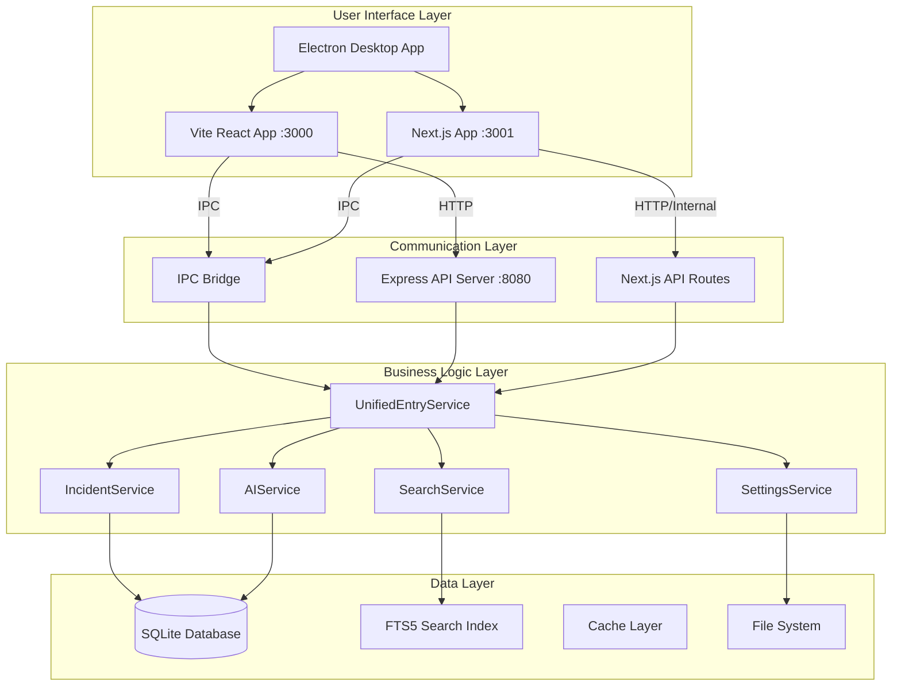
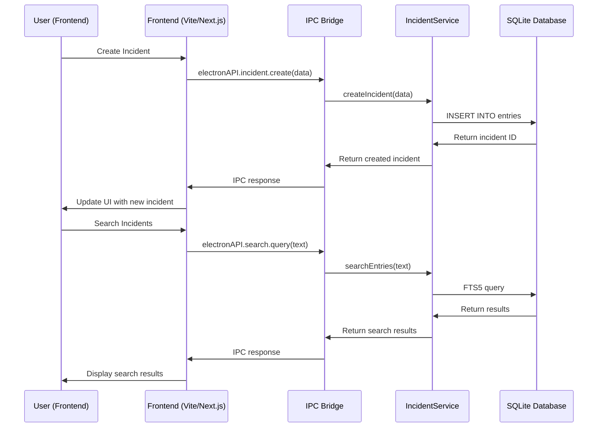
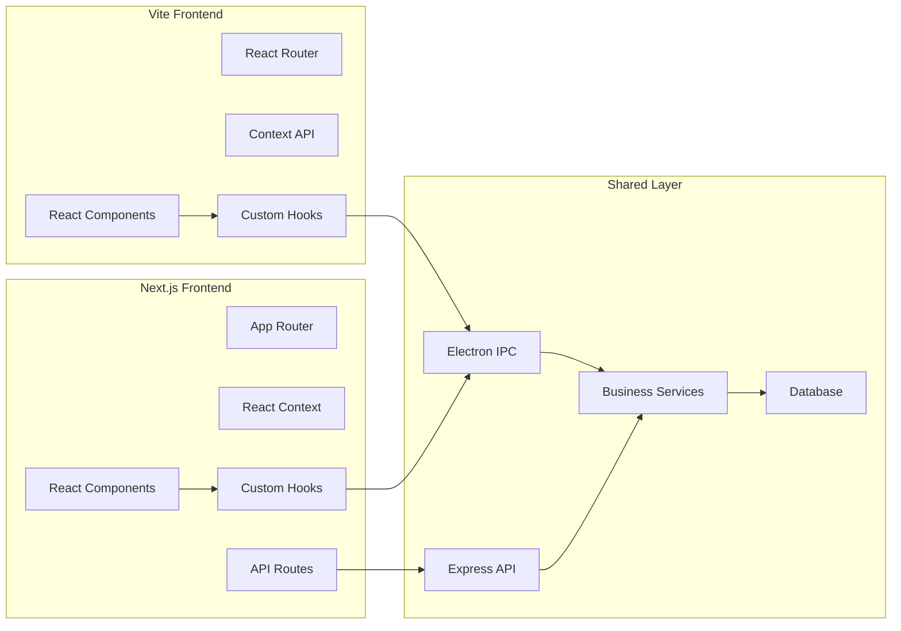
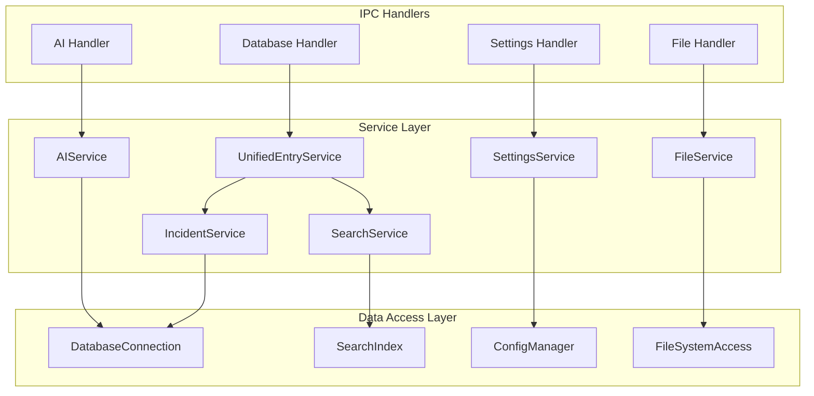
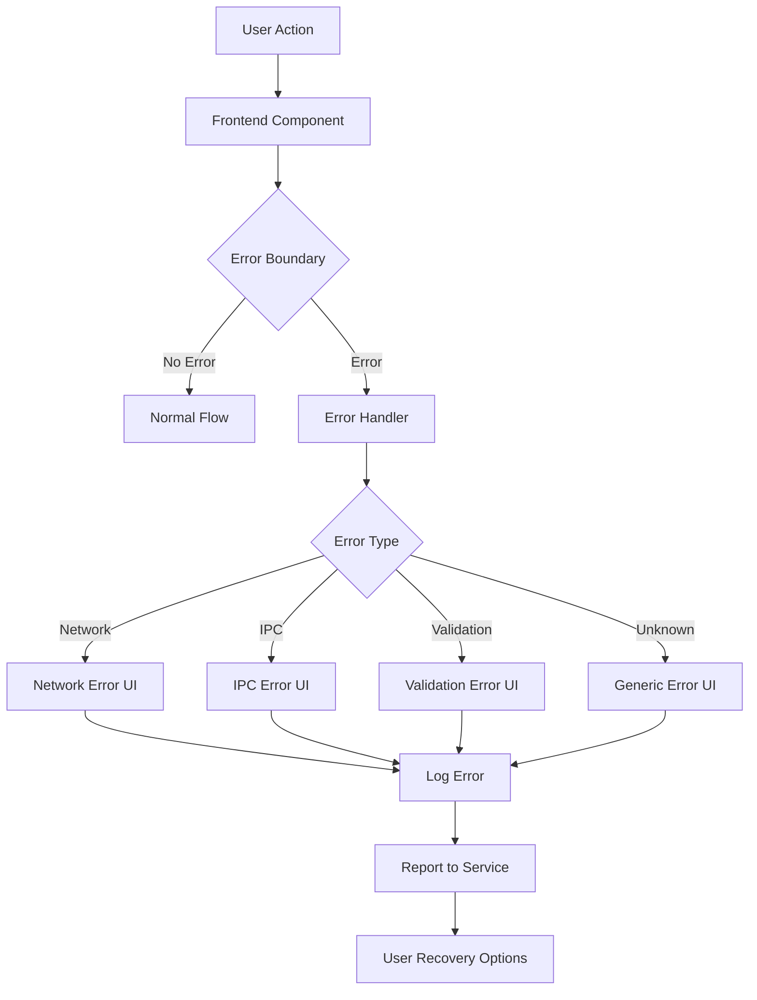
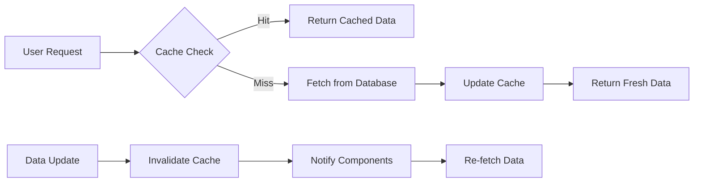
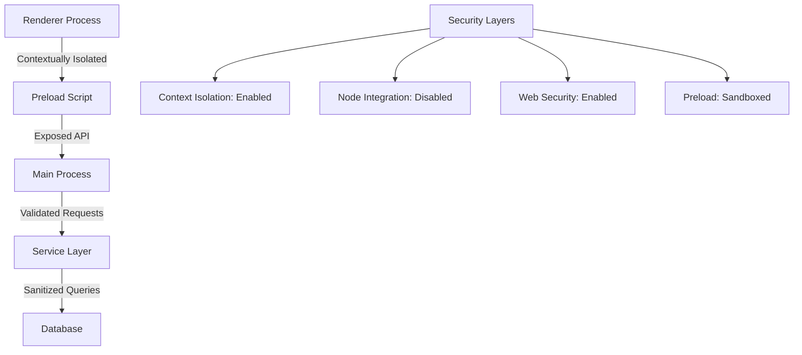
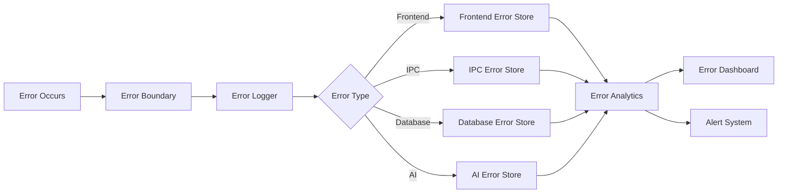

# Architecture Flow V3.0 - Hybrid System Design

## 🎯 Overview

The Architecture Flow V3.0 documents the complete system design for the hybrid Vite + Next.js + Electron architecture, including data flow diagrams, component interactions, and integration patterns.

## 🏗️ System Architecture Overview



## 🔄 Data Flow Patterns

### 1. Incident Management Flow



### 2. Dual Frontend Communication



### 3. AI Integration Flow

```mermaid
graph TD
    A[User Request] --> B{Frontend Mode?}
    B -->|Vite| C[Vite React Component]
    B -->|Next.js| D[Next.js Component]

    C --> E[useElectron Hook]
    D --> E

    E --> F[AI Authorization Dialog]
    F --> G{User Approved?}

    G -->|Yes| H[IPC: electronAPI.ai.analyze()]
    G -->|No| I[Cancel Operation]

    H --> J[AIService]
    J --> K{AI Provider}
    K -->|Gemini| L[Google AI API]
    K -->|OpenAI| M[OpenAI API]

    L --> N[Process Response]
    M --> N
    N --> O[Store AI Operation Log]
    O --> P[Return Results to Frontend]
    P --> Q[Update UI]
```

## 🧩 Component Architecture

### Frontend Component Hierarchy

#### Vite Frontend Structure
```
src/renderer/
├── App.tsx                    # Root application component
├── components/
│   ├── layout/
│   │   ├── Header.tsx         # Application header
│   │   ├── Sidebar.tsx        # Navigation sidebar
│   │   └── Footer.tsx         # Application footer
│   ├── incident/
│   │   ├── IncidentList.tsx   # Incident listing
│   │   ├── IncidentForm.tsx   # Create/edit form
│   │   └── IncidentDetail.tsx # Detailed view
│   ├── search/
│   │   ├── SearchBar.tsx      # Search input
│   │   ├── SearchResults.tsx  # Results display
│   │   └── SearchFilters.tsx  # Filter controls
│   └── shared/
│       ├── Button.tsx         # Reusable button
│       ├── Modal.tsx          # Modal dialog
│       └── LoadingSpinner.tsx # Loading indicator
├── hooks/
│   ├── useElectron.ts         # Electron integration
│   ├── useDatabase.ts         # Database operations
│   └── useSearch.ts           # Search functionality
├── contexts/
│   ├── AppContext.tsx         # Global app state
│   └── SettingsContext.tsx    # Settings management
└── pages/
    ├── Dashboard.tsx          # Main dashboard
    ├── Incidents.tsx          # Incidents page
    └── Settings.tsx           # Settings page
```

#### Next.js Frontend Structure
```
app/
├── layout.tsx                 # Root layout
├── page.tsx                   # Home page
├── loading.tsx                # Global loading UI
├── error.tsx                  # Global error UI
├── not-found.tsx              # 404 page
├── (dashboard)/               # Dashboard route group
│   ├── layout.tsx             # Dashboard layout
│   ├── page.tsx               # Dashboard home
│   ├── incidents/
│   │   ├── page.tsx           # Incidents list
│   │   ├── [id]/
│   │   │   ├── page.tsx       # Incident detail
│   │   │   └── edit/
│   │   │       └── page.tsx   # Edit incident
│   │   └── new/
│   │       └── page.tsx       # Create incident
│   └── settings/
│       ├── page.tsx           # Settings home
│       ├── ai/
│       │   └── page.tsx       # AI settings
│       └── general/
│           └── page.tsx       # General settings
├── api/                       # API routes
│   ├── incidents/
│   │   ├── route.ts           # GET, POST /api/incidents
│   │   └── [id]/
│   │       └── route.ts       # GET, PUT, DELETE /api/incidents/[id]
│   ├── search/
│   │   └── route.ts           # POST /api/search
│   └── ai/
│       └── analyze/
│           └── route.ts       # POST /api/ai/analyze
└── components/
    ├── ui/                    # Shared UI components
    ├── forms/                 # Form components
    └── features/              # Feature-specific components
```

### Backend Service Architecture



## 🔗 Integration Patterns

### 1. Cross-Frontend Component Sharing

#### Shared Hook Pattern
```typescript
// Shared hook that works in both Vite and Next.js
// src/renderer/hooks/useDatabase.ts (symlinked to app/hooks/)

export function useDatabase() {
  const { electronAPI } = useElectron();

  const getIncidents = useCallback(async () => {
    if (!electronAPI?.database) {
      // Fallback to HTTP API
      const response = await fetch('/api/incidents');
      return response.json();
    }

    return electronAPI.database.getIncidents();
  }, [electronAPI]);

  return { getIncidents /* ... */ };
}
```

#### Component Abstraction Pattern
```typescript
// Shared component interface
interface IncidentListProps {
  incidents: Incident[];
  onIncidentSelect: (incident: Incident) => void;
  onIncidentCreate: () => void;
}

// Vite implementation
export function ViteIncidentList(props: IncidentListProps) {
  return <div>{/* Vite-specific rendering */}</div>;
}

// Next.js implementation
export function NextJSIncidentList(props: IncidentListProps) {
  return <div>{/* Next.js-specific rendering */}</div>;
}
```

### 2. State Management Pattern

#### Vite State Management (Context API)
```typescript
// src/renderer/contexts/AppContext.tsx
interface AppState {
  incidents: Incident[];
  settings: Settings;
  searchResults: SearchResult[];
}

export const AppContext = createContext<AppState | null>(null);

export function AppProvider({ children }: { children: ReactNode }) {
  const [state, setState] = useState<AppState>({
    incidents: [],
    settings: {},
    searchResults: [],
  });

  return (
    <AppContext.Provider value={state}>
      {children}
    </AppContext.Provider>
  );
}
```

#### Next.js State Management (Context + Server State)
```typescript
// app/contexts/AppContext.tsx
export function AppProvider({ children }: { children: ReactNode }) {
  const { data: incidents } = useSWR('/api/incidents', fetcher);
  const { data: settings } = useSWR('/api/settings', fetcher);

  const value = {
    incidents: incidents || [],
    settings: settings || {},
  };

  return (
    <AppContext.Provider value={value}>
      {children}
    </AppContext.Provider>
  );
}
```

### 3. Error Handling Pattern



## 🚀 Performance Architecture

### 1. Rendering Optimization

#### Vite Performance Patterns
```typescript
// Lazy loading with React.lazy
const IncidentDetail = lazy(() => import('./components/IncidentDetail'));

// Memoization for expensive operations
const MemoizedIncidentList = memo(IncidentList, (prevProps, nextProps) => {
  return prevProps.incidents.length === nextProps.incidents.length;
});

// Virtual scrolling for large lists
function VirtualizedIncidentList({ incidents }: { incidents: Incident[] }) {
  return (
    <FixedSizeList
      height={600}
      itemCount={incidents.length}
      itemSize={80}
    >
      {IncidentRow}
    </FixedSizeList>
  );
}
```

#### Next.js Performance Patterns
```typescript
// Dynamic imports with loading states
const IncidentDetail = dynamic(() => import('./IncidentDetail'), {
  loading: () => <IncidentDetailSkeleton />,
});

// Server-side rendering with data fetching
export async function generateStaticParams() {
  const incidents = await getIncidents();
  return incidents.map((incident) => ({
    id: incident.id,
  }));
}

// Streaming with Suspense
function IncidentsPage() {
  return (
    <Suspense fallback={<IncidentListSkeleton />}>
      <IncidentsList />
    </Suspense>
  );
}
```

### 2. Data Flow Optimization

#### Caching Strategy


#### Database Query Optimization
```sql
-- Optimized incident queries
CREATE INDEX idx_incidents_status ON entries(status, created_at);
CREATE INDEX idx_incidents_priority ON entries(priority, created_at);
CREATE INDEX idx_incidents_fts ON entries_fts(content);

-- Pagination query
SELECT * FROM entries
WHERE status = ?
ORDER BY created_at DESC
LIMIT ? OFFSET ?;

-- Full-text search with ranking
SELECT entries.*, rank
FROM entries
JOIN entries_fts ON entries.id = entries_fts.rowid
WHERE entries_fts MATCH ?
ORDER BY rank;
```

## 🔧 Configuration Architecture

### 1. Environment Configuration

#### Development Configuration
```typescript
// config/development.ts
export const config = {
  // Frontend URLs
  viteUrl: 'http://localhost:3000',
  nextjsUrl: 'http://localhost:3001',

  // Backend configuration
  apiUrl: 'http://localhost:8080',
  apiPrefix: '/api/v1',

  // Database
  databasePath: './kb-assistant-dev.db',
  enableMigrations: true,

  // Features
  enableAI: true,
  enableAnalytics: false,
  enableDebugMode: true,

  // Performance
  enableHMR: true,
  enableSourceMaps: true,
  bundleAnalysis: false,
};
```

#### Production Configuration
```typescript
// config/production.ts
export const config = {
  // Frontend URLs (file:// in Electron)
  viteUrl: './dist/index.html',
  nextjsUrl: './app/out/index.html',

  // Backend configuration
  apiUrl: 'http://localhost:8080',
  apiPrefix: '/api/v1',

  // Database
  databasePath: './kb-assistant.db',
  enableMigrations: false,

  // Features
  enableAI: true,
  enableAnalytics: true,
  enableDebugMode: false,

  // Performance
  enableHMR: false,
  enableSourceMaps: false,
  bundleAnalysis: true,
};
```

### 2. Build Configuration Matrix

| Environment | Vite Build | Next.js Build | Electron Build | Target |
|-------------|------------|---------------|----------------|---------|
| Development | Dev Server | Dev Server | Dev Mode | Local Development |
| Testing | Static Build | Static Build | Test Mode | Automated Testing |
| Staging | Optimized | Static Export | Package | Staging Deployment |
| Production | Optimized | Static Export | Package | Production Release |

## 🔒 Security Architecture

### 1. IPC Security Model



### 2. Data Validation Flow

```typescript
// Input validation chain
interface ValidationChain {
  frontend: (data: unknown) => ValidationResult;
  ipc: (data: unknown) => ValidationResult;
  service: (data: unknown) => ValidationResult;
  database: (data: unknown) => ValidationResult;
}

// Example implementation
const incidentValidation: ValidationChain = {
  frontend: (data) => IncidentFormSchema.safeParse(data),
  ipc: (data) => IPCIncidentSchema.safeParse(data),
  service: (data) => ServiceIncidentSchema.safeParse(data),
  database: (data) => DatabaseIncidentSchema.safeParse(data),
};
```

## 📈 Monitoring & Observability

### 1. Performance Monitoring

```typescript
// Performance tracking
interface PerformanceMetrics {
  // Rendering metrics
  renderTime: number;
  componentCount: number;
  rerenderCount: number;

  // Data loading metrics
  dataFetchTime: number;
  cacheHitRate: number;

  // Build metrics
  buildTime: number;
  bundleSize: number;

  // User interaction metrics
  interactionTime: number;
  errorRate: number;
}

// Monitoring service
class PerformanceMonitor {
  track(metric: keyof PerformanceMetrics, value: number) {
    // Log to console in development
    // Send to analytics in production
  }

  startTimer(operation: string): () => void {
    const start = performance.now();
    return () => {
      const duration = performance.now() - start;
      this.track('renderTime', duration);
    };
  }
}
```

### 2. Error Tracking Architecture



## 🔮 Future Architecture Evolution

### Phase 1: Current State (V3.0)
- Dual frontend support (Vite + Next.js)
- Shared backend services
- Electron desktop integration
- SQLite database

### Phase 2: Optimization (V3.1)
- Performance improvements
- Enhanced caching
- Better state management
- Improved error handling

### Phase 3: Modernization (V3.2)
- Next.js becomes primary
- Vite legacy support
- Advanced features
- Cloud integration

### Phase 4: Unified Architecture (V4.0)
- Single Next.js frontend
- Microservices backend
- Cloud-first approach
- Advanced AI integration

---

The Architecture Flow V3.0 provides a comprehensive view of the hybrid system design, enabling developers to understand the complete data flow, component interactions, and integration patterns across the entire application stack.