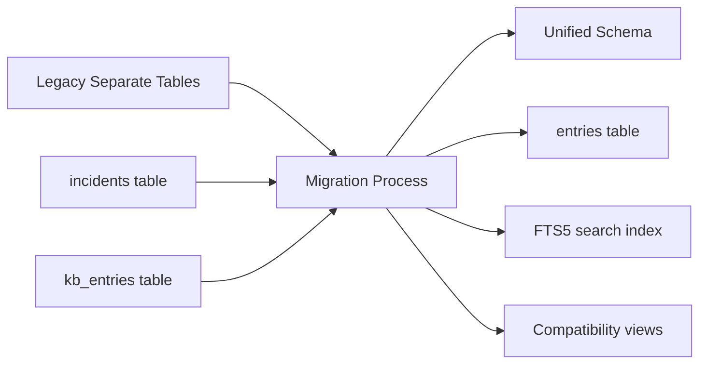

# Database Schema Documentation V2.0
## Accenture Mainframe AI Assistant - Unified Database Architecture

**Version**: 2.0.0
**Date**: September 21, 2024
**Database**: SQLite with Better-SQLite3
**Target Audience**: Developers, Database Administrators, QA Engineers

---

## 📋 Overview

This document provides comprehensive documentation for the unified database schema used by the Accenture Mainframe AI Assistant. The schema consolidates incident management and knowledge base functionality into a single, efficient design that eliminates data duplication and enables seamless integration between incident resolution and knowledge creation.

## 🏗️ Architecture Philosophy

### Unified Design Principles
1. **Single Source of Truth**: One table for both incidents and knowledge entries
2. **Type Discrimination**: `entry_type` field distinguishes between incidents and knowledge
3. **Lifecycle Integration**: Resolved incidents automatically become searchable knowledge
4. **Backward Compatibility**: Views provided for legacy code compatibility
5. **Performance Optimization**: Indexes and FTS5 for fast search and retrieval

### Schema Evolution


---

## 📊 Core Schema Structure

### Main Tables

#### 1. entries (Primary Table)
```sql
CREATE TABLE entries (
    -- Primary identification
    id TEXT PRIMARY KEY DEFAULT (lower(hex(randomblob(16)))),
    entry_type TEXT NOT NULL CHECK(entry_type IN ('incident', 'knowledge')),

    -- Core content
    title TEXT NOT NULL,
    description TEXT NOT NULL,
    solution TEXT,

    -- Classification and organization
    category TEXT NOT NULL,
    severity TEXT NOT NULL CHECK(severity IN ('low', 'medium', 'high', 'critical')),
    tags TEXT DEFAULT '[]', -- JSON array of strings
    status TEXT DEFAULT 'active' CHECK(status IN ('active', 'inactive', 'archived')),

    -- Incident-specific fields
    incident_status TEXT CHECK(incident_status IN ('aberto', 'em_tratamento', 'em_revisao', 'resolvido', 'cancelado')),
    priority INTEGER CHECK(priority >= 1 AND priority <= 5),
    assigned_to TEXT,
    reporter TEXT,
    sla_deadline DATETIME,

    -- Knowledge-specific fields
    usage_count INTEGER DEFAULT 0 CHECK(usage_count >= 0),
    success_count INTEGER DEFAULT 0 CHECK(success_count >= 0),
    confidence_score REAL DEFAULT 0.0 CHECK(confidence_score >= 0.0 AND confidence_score <= 1.0),

    -- Audit and tracking
    created_at DATETIME DEFAULT CURRENT_TIMESTAMP NOT NULL,
    updated_at DATETIME DEFAULT CURRENT_TIMESTAMP NOT NULL,
    resolved_at DATETIME,
    created_by TEXT NOT NULL,
    last_used DATETIME,

    -- Computed fields (triggers maintain these)
    success_rate REAL DEFAULT 0.0 CHECK(success_rate >= 0.0 AND success_rate <= 1.0),
    days_since_created INTEGER DEFAULT 0,
    is_overdue BOOLEAN DEFAULT FALSE,

    -- Constraints
    CONSTRAINT chk_incident_fields CHECK (
        entry_type != 'incident' OR (
            incident_status IS NOT NULL AND
            priority IS NOT NULL AND
            reporter IS NOT NULL
        )
    ),
    CONSTRAINT chk_knowledge_fields CHECK (
        entry_type != 'knowledge' OR solution IS NOT NULL
    ),
    CONSTRAINT chk_usage_consistency CHECK (
        success_count <= usage_count
    )
);
```

#### 2. entries_fts (Full-Text Search)
```sql
-- FTS5 virtual table for high-performance search
CREATE VIRTUAL TABLE entries_fts USING fts5(
    id UNINDEXED,
    title,
    description,
    solution,
    tags,
    category,
    entry_type UNINDEXED,
    severity UNINDEXED,
    content='entries',
    content_rowid='rowid',
    tokenize='porter'
);

-- Triggers to maintain FTS index
CREATE TRIGGER entries_ai AFTER INSERT ON entries BEGIN
    INSERT INTO entries_fts(rowid, id, title, description, solution, tags, category, entry_type, severity)
    VALUES (new.rowid, new.id, new.title, new.description, new.solution, new.tags, new.category, new.entry_type, new.severity);
END;

CREATE TRIGGER entries_ad AFTER DELETE ON entries BEGIN
    INSERT INTO entries_fts(entries_fts, rowid, id, title, description, solution, tags, category, entry_type, severity)
    VALUES ('delete', old.rowid, old.id, old.title, old.description, old.solution, old.tags, old.category, old.entry_type, old.severity);
END;

CREATE TRIGGER entries_au AFTER UPDATE ON entries BEGIN
    INSERT INTO entries_fts(entries_fts, rowid, id, title, description, solution, tags, category, entry_type, severity)
    VALUES ('delete', old.rowid, old.id, old.title, old.description, old.solution, old.tags, old.category, old.entry_type, old.severity);
    INSERT INTO entries_fts(rowid, id, title, description, solution, tags, category, entry_type, severity)
    VALUES (new.rowid, new.id, new.title, new.description, new.solution, new.tags, new.category, new.entry_type, new.severity);
END;
```

#### 3. relationships (Entry Relationships)
```sql
CREATE TABLE relationships (
    id TEXT PRIMARY KEY DEFAULT (lower(hex(randomblob(16)))),
    source_id TEXT NOT NULL,
    target_id TEXT NOT NULL,
    relationship_type TEXT NOT NULL CHECK(relationship_type IN (
        'related_to', 'duplicate_of', 'blocks', 'blocked_by', 'caused_by', 'causes'
    )),
    created_at DATETIME DEFAULT CURRENT_TIMESTAMP NOT NULL,
    created_by TEXT NOT NULL,

    FOREIGN KEY (source_id) REFERENCES entries(id) ON DELETE CASCADE,
    FOREIGN KEY (target_id) REFERENCES entries(id) ON DELETE CASCADE,
    UNIQUE(source_id, target_id, relationship_type)
);
```

#### 4. comments (Entry Comments)
```sql
CREATE TABLE comments (
    id TEXT PRIMARY KEY DEFAULT (lower(hex(randomblob(16)))),
    entry_id TEXT NOT NULL,
    content TEXT NOT NULL,
    author TEXT NOT NULL,
    created_at DATETIME DEFAULT CURRENT_TIMESTAMP NOT NULL,
    updated_at DATETIME DEFAULT CURRENT_TIMESTAMP NOT NULL,
    is_internal BOOLEAN DEFAULT FALSE,

    FOREIGN KEY (entry_id) REFERENCES entries(id) ON DELETE CASCADE
);
```

#### 5. history (Audit Trail)
```sql
CREATE TABLE history (
    id TEXT PRIMARY KEY DEFAULT (lower(hex(randomblob(16)))),
    entry_id TEXT NOT NULL,
    action TEXT NOT NULL CHECK(action IN (
        'created', 'updated', 'assigned', 'status_changed', 'resolved',
        'commented', 'tagged', 'related', 'used', 'rated'
    )),
    field_name TEXT,
    old_value TEXT,
    new_value TEXT,
    details TEXT, -- JSON object with additional details
    user_id TEXT NOT NULL,
    timestamp DATETIME DEFAULT CURRENT_TIMESTAMP NOT NULL,

    FOREIGN KEY (entry_id) REFERENCES entries(id) ON DELETE CASCADE
);
```

#### 6. categories (Category Management)
```sql
CREATE TABLE categories (
    id TEXT PRIMARY KEY,
    name TEXT NOT NULL UNIQUE,
    description TEXT,
    parent_id TEXT,
    sort_order INTEGER DEFAULT 0,
    is_active BOOLEAN DEFAULT TRUE,
    created_at DATETIME DEFAULT CURRENT_TIMESTAMP NOT NULL,

    FOREIGN KEY (parent_id) REFERENCES categories(id) ON DELETE SET NULL
);

-- Default categories
INSERT INTO categories (id, name, description) VALUES
('network', 'Network', 'Network connectivity and infrastructure issues'),
('database', 'Database', 'Database performance, connectivity, and data issues'),
('application', 'Application', 'Application errors, bugs, and functionality issues'),
('security', 'Security', 'Security incidents and access control issues'),
('hardware', 'Hardware', 'Hardware failures and physical infrastructure'),
('performance', 'Performance', 'System and application performance issues'),
('backup', 'Backup', 'Backup and recovery related issues'),
('maintenance', 'Maintenance', 'Scheduled and emergency maintenance activities');
```

#### 7. tags (Tag Management)
```sql
CREATE TABLE tags (
    id TEXT PRIMARY KEY,
    name TEXT NOT NULL UNIQUE,
    description TEXT,
    usage_count INTEGER DEFAULT 0,
    category_id TEXT,
    color TEXT, -- Hex color code for UI
    is_system BOOLEAN DEFAULT FALSE, -- System-generated tags
    created_at DATETIME DEFAULT CURRENT_TIMESTAMP NOT NULL,

    FOREIGN KEY (category_id) REFERENCES categories(id) ON DELETE SET NULL
);
```

#### 8. settings (Application Configuration)
```sql
CREATE TABLE settings (
    key TEXT PRIMARY KEY,
    value TEXT NOT NULL, -- JSON-encoded value
    type TEXT NOT NULL CHECK(type IN ('string', 'number', 'boolean', 'object', 'array')),
    description TEXT,
    is_encrypted BOOLEAN DEFAULT FALSE,
    updated_at DATETIME DEFAULT CURRENT_TIMESTAMP NOT NULL,
    updated_by TEXT
);
```

#### 9. search_history (Search Analytics)
```sql
CREATE TABLE search_history (
    id TEXT PRIMARY KEY DEFAULT (lower(hex(randomblob(16)))),
    query TEXT NOT NULL,
    filters TEXT, -- JSON object
    result_count INTEGER DEFAULT 0,
    search_time_ms INTEGER DEFAULT 0, -- Search execution time
    user_id TEXT,
    timestamp DATETIME DEFAULT CURRENT_TIMESTAMP NOT NULL,
    session_id TEXT
);
```

#### 10. ai_operations (AI Usage Tracking)
```sql
CREATE TABLE ai_operations (
    id TEXT PRIMARY KEY DEFAULT (lower(hex(randomblob(16)))),
    operation_type TEXT NOT NULL CHECK(operation_type IN (
        'analysis', 'suggestion', 'enhancement', 'classification'
    )),
    input_text TEXT NOT NULL,
    output_text TEXT,
    model_used TEXT,
    tokens_consumed INTEGER DEFAULT 0,
    cost_usd DECIMAL(10, 6) DEFAULT 0.0,
    success BOOLEAN DEFAULT TRUE,
    error_message TEXT,
    execution_time_ms INTEGER DEFAULT 0,
    user_id TEXT,
    entry_id TEXT, -- Related entry if applicable
    timestamp DATETIME DEFAULT CURRENT_TIMESTAMP NOT NULL,

    FOREIGN KEY (entry_id) REFERENCES entries(id) ON DELETE SET NULL
);
```

---

## 🔍 Indexes and Performance

### Primary Indexes
```sql
-- Core performance indexes
CREATE INDEX idx_entries_type_status ON entries(entry_type, incident_status);
CREATE INDEX idx_entries_created_at ON entries(created_at DESC);
CREATE INDEX idx_entries_category ON entries(category);
CREATE INDEX idx_entries_severity ON entries(severity);
CREATE INDEX idx_entries_assigned_to ON entries(assigned_to);
CREATE INDEX idx_entries_reporter ON entries(reporter);
CREATE INDEX idx_entries_tags ON entries(tags); -- For JSON array queries

-- Incident-specific indexes
CREATE INDEX idx_entries_incident_priority ON entries(priority) WHERE entry_type = 'incident';
CREATE INDEX idx_entries_incident_sla ON entries(sla_deadline) WHERE entry_type = 'incident' AND sla_deadline IS NOT NULL;
CREATE INDEX idx_entries_incident_overdue ON entries(is_overdue) WHERE entry_type = 'incident' AND is_overdue = TRUE;

-- Knowledge-specific indexes
CREATE INDEX idx_entries_knowledge_usage ON entries(usage_count DESC) WHERE entry_type = 'knowledge';
CREATE INDEX idx_entries_knowledge_success ON entries(success_rate DESC) WHERE entry_type = 'knowledge';
CREATE INDEX idx_entries_knowledge_recent ON entries(last_used DESC) WHERE entry_type = 'knowledge';

-- Relationship indexes
CREATE INDEX idx_relationships_source ON relationships(source_id);
CREATE INDEX idx_relationships_target ON relationships(target_id);
CREATE INDEX idx_relationships_type ON relationships(relationship_type);

-- Comment indexes
CREATE INDEX idx_comments_entry_id ON comments(entry_id);
CREATE INDEX idx_comments_created_at ON comments(created_at DESC);

-- History indexes
CREATE INDEX idx_history_entry_id ON history(entry_id);
CREATE INDEX idx_history_timestamp ON history(timestamp DESC);
CREATE INDEX idx_history_user_id ON history(user_id);

-- Search analytics indexes
CREATE INDEX idx_search_history_timestamp ON search_history(timestamp DESC);
CREATE INDEX idx_search_history_query ON search_history(query);

-- AI operations indexes
CREATE INDEX idx_ai_operations_timestamp ON ai_operations(timestamp DESC);
CREATE INDEX idx_ai_operations_type ON ai_operations(operation_type);
CREATE INDEX idx_ai_operations_entry_id ON ai_operations(entry_id);
```

### Composite Indexes for Common Queries
```sql
-- Dashboard queries
CREATE INDEX idx_entries_dashboard ON entries(entry_type, status, created_at DESC);

-- Queue queries
CREATE INDEX idx_entries_queue ON entries(entry_type, incident_status, assigned_to, priority);

-- Knowledge search
CREATE INDEX idx_entries_knowledge_search ON entries(entry_type, category, usage_count DESC) WHERE entry_type = 'knowledge';

-- Analytics queries
CREATE INDEX idx_entries_analytics ON entries(entry_type, category, created_at, resolved_at);
```

---

## 🔄 Database Triggers

### Automatic Field Updates
```sql
-- Update timestamp trigger
CREATE TRIGGER update_entries_timestamp
AFTER UPDATE ON entries
FOR EACH ROW
BEGIN
    UPDATE entries
    SET updated_at = CURRENT_TIMESTAMP
    WHERE id = NEW.id;
END;

-- Calculate success rate
CREATE TRIGGER update_success_rate
AFTER UPDATE OF usage_count, success_count ON entries
FOR EACH ROW
WHEN NEW.entry_type = 'knowledge'
BEGIN
    UPDATE entries
    SET success_rate = CASE
        WHEN NEW.usage_count > 0 THEN CAST(NEW.success_count AS REAL) / NEW.usage_count
        ELSE 0.0
    END
    WHERE id = NEW.id;
END;

-- Update days since created
CREATE TRIGGER update_days_since_created
AFTER UPDATE ON entries
FOR EACH ROW
BEGIN
    UPDATE entries
    SET days_since_created = JULIANDAY('now') - JULIANDAY(NEW.created_at)
    WHERE id = NEW.id;
END;

-- Check SLA overdue status
CREATE TRIGGER update_overdue_status
AFTER UPDATE OF sla_deadline ON entries
FOR EACH ROW
WHEN NEW.entry_type = 'incident' AND NEW.sla_deadline IS NOT NULL
BEGIN
    UPDATE entries
    SET is_overdue = CASE
        WHEN NEW.sla_deadline < CURRENT_TIMESTAMP AND NEW.incident_status NOT IN ('resolvido', 'cancelado')
        THEN TRUE
        ELSE FALSE
    END
    WHERE id = NEW.id;
END;
```

### History Tracking Triggers
```sql
-- Track entry creation
CREATE TRIGGER track_entry_creation
AFTER INSERT ON entries
FOR EACH ROW
BEGIN
    INSERT INTO history (entry_id, action, details, user_id)
    VALUES (NEW.id, 'created',
        json_object(
            'entry_type', NEW.entry_type,
            'title', NEW.title,
            'category', NEW.category,
            'severity', NEW.severity
        ),
        NEW.created_by
    );
END;

-- Track status changes
CREATE TRIGGER track_status_changes
AFTER UPDATE OF incident_status ON entries
FOR EACH ROW
WHEN OLD.incident_status IS DISTINCT FROM NEW.incident_status
BEGIN
    INSERT INTO history (entry_id, action, field_name, old_value, new_value, user_id)
    VALUES (NEW.id, 'status_changed', 'incident_status', OLD.incident_status, NEW.incident_status, NEW.created_by);
END;

-- Track assignment changes
CREATE TRIGGER track_assignment_changes
AFTER UPDATE OF assigned_to ON entries
FOR EACH ROW
WHEN OLD.assigned_to IS DISTINCT FROM NEW.assigned_to
BEGIN
    INSERT INTO history (entry_id, action, field_name, old_value, new_value, user_id)
    VALUES (NEW.id, 'assigned', 'assigned_to', OLD.assigned_to, NEW.assigned_to, NEW.created_by);
END;

-- Track resolution
CREATE TRIGGER track_resolution
AFTER UPDATE OF incident_status ON entries
FOR EACH ROW
WHEN NEW.incident_status = 'resolvido' AND OLD.incident_status != 'resolvido'
BEGIN
    UPDATE entries
    SET resolved_at = CURRENT_TIMESTAMP
    WHERE id = NEW.id;

    INSERT INTO history (entry_id, action, details, user_id)
    VALUES (NEW.id, 'resolved',
        json_object(
            'solution', NEW.solution,
            'resolution_time_hours',
            ROUND((JULIANDAY('now') - JULIANDAY(NEW.created_at)) * 24, 2)
        ),
        NEW.created_by
    );
END;
```

### Tag Management Triggers
```sql
-- Update tag usage count
CREATE TRIGGER update_tag_usage
AFTER INSERT ON entries
FOR EACH ROW
WHEN NEW.tags IS NOT NULL AND NEW.tags != '[]'
BEGIN
    -- This would need a custom function to parse JSON and update tag counts
    -- Implementation depends on JSON parsing capabilities
END;
```

---

## 📊 Views for Backward Compatibility

### Legacy Incident View
```sql
CREATE VIEW incidents AS
SELECT
    id,
    title,
    description,
    incident_status as status,
    priority,
    assigned_to,
    reporter,
    category,
    severity,
    tags,
    sla_deadline,
    created_at,
    updated_at,
    resolved_at,
    created_by,
    is_overdue
FROM entries
WHERE entry_type = 'incident';
```

### Legacy Knowledge Base View
```sql
CREATE VIEW kb_entries AS
SELECT
    id,
    title,
    description as problem,
    solution,
    category,
    severity,
    tags,
    usage_count,
    success_count,
    success_rate,
    confidence_score,
    created_at,
    updated_at,
    created_by,
    last_used
FROM entries
WHERE entry_type = 'knowledge';
```

### Dashboard Views
```sql
-- Active incidents summary
CREATE VIEW active_incidents_summary AS
SELECT
    COUNT(*) as total_active,
    COUNT(CASE WHEN severity = 'critical' THEN 1 END) as critical_count,
    COUNT(CASE WHEN is_overdue = TRUE THEN 1 END) as overdue_count,
    AVG(CASE WHEN resolved_at IS NOT NULL
        THEN (JULIANDAY(resolved_at) - JULIANDAY(created_at)) * 24
        END) as avg_resolution_hours
FROM entries
WHERE entry_type = 'incident'
    AND incident_status NOT IN ('resolvido', 'cancelado');

-- Knowledge base metrics
CREATE VIEW knowledge_metrics AS
SELECT
    COUNT(*) as total_entries,
    SUM(usage_count) as total_usage,
    AVG(success_rate) as avg_success_rate,
    COUNT(CASE WHEN created_at > datetime('now', '-7 days') THEN 1 END) as recent_entries
FROM entries
WHERE entry_type = 'knowledge'
    AND status = 'active';

-- Popular knowledge entries
CREATE VIEW popular_knowledge AS
SELECT
    id,
    title,
    category,
    usage_count,
    success_rate,
    last_used
FROM entries
WHERE entry_type = 'knowledge'
    AND status = 'active'
    AND usage_count > 0
ORDER BY usage_count DESC, success_rate DESC
LIMIT 10;
```

---

## 🔍 Common Query Patterns

### Search Queries
```sql
-- Full-text search across all entries
SELECT e.*,
    fts.rank,
    CASE WHEN e.entry_type = 'incident' AND e.incident_status NOT IN ('resolvido', 'cancelado')
         THEN 1.5 ELSE 1.0 END as priority_boost
FROM entries e
JOIN entries_fts fts ON e.rowid = fts.rowid
WHERE entries_fts MATCH ?
ORDER BY (fts.rank * priority_boost) DESC
LIMIT ? OFFSET ?;

-- Search with filters
SELECT e.*
FROM entries e
JOIN entries_fts fts ON e.rowid = fts.rowid
WHERE entries_fts MATCH ?
    AND e.entry_type = ?
    AND e.category = ?
    AND e.severity IN (?)
    AND e.created_at BETWEEN ? AND ?
ORDER BY fts.rank DESC;

-- Similar entries based on tags and category
SELECT e2.*,
    LENGTH(e1.tags) - LENGTH(REPLACE(UPPER(e1.tags), UPPER(e2.tags), '')) as tag_similarity
FROM entries e1, entries e2
WHERE e1.id = ?
    AND e2.id != e1.id
    AND e2.category = e1.category
    AND e2.entry_type = e1.entry_type
ORDER BY tag_similarity DESC
LIMIT 5;
```

### Incident Management Queries
```sql
-- Get incident queue with SLA status
SELECT
    id,
    title,
    incident_status,
    priority,
    assigned_to,
    severity,
    created_at,
    sla_deadline,
    is_overdue,
    CASE
        WHEN sla_deadline IS NOT NULL
        THEN ROUND((JULIANDAY(sla_deadline) - JULIANDAY('now')) * 24, 1)
        ELSE NULL
    END as hours_to_sla
FROM entries
WHERE entry_type = 'incident'
    AND incident_status IN ('aberto', 'em_tratamento', 'em_revisao')
ORDER BY
    CASE WHEN is_overdue THEN 0 ELSE 1 END,
    priority ASC,
    created_at ASC;

-- Resolution time analysis
SELECT
    category,
    COUNT(*) as total_resolved,
    AVG((JULIANDAY(resolved_at) - JULIANDAY(created_at)) * 24) as avg_resolution_hours,
    MIN((JULIANDAY(resolved_at) - JULIANDAY(created_at)) * 24) as min_resolution_hours,
    MAX((JULIANDAY(resolved_at) - JULIANDAY(created_at)) * 24) as max_resolution_hours
FROM entries
WHERE entry_type = 'incident'
    AND incident_status = 'resolvido'
    AND resolved_at >= datetime('now', '-30 days')
GROUP BY category
ORDER BY avg_resolution_hours ASC;
```

### Knowledge Base Queries
```sql
-- Most effective knowledge entries
SELECT
    id,
    title,
    category,
    usage_count,
    success_count,
    success_rate,
    confidence_score,
    last_used
FROM entries
WHERE entry_type = 'knowledge'
    AND usage_count >= 5
    AND success_rate >= 0.8
ORDER BY success_rate DESC, usage_count DESC;

-- Knowledge gaps (categories with low knowledge coverage)
SELECT
    i.category,
    COUNT(CASE WHEN i.incident_status = 'resolvido' THEN 1 END) as resolved_incidents,
    COUNT(CASE WHEN k.id IS NOT NULL THEN 1 END) as knowledge_entries,
    ROUND(
        CAST(COUNT(CASE WHEN k.id IS NOT NULL THEN 1 END) AS REAL) /
        CAST(COUNT(CASE WHEN i.incident_status = 'resolvido' THEN 1 END) AS REAL) * 100,
        2
    ) as knowledge_coverage_percent
FROM entries i
LEFT JOIN entries k ON k.category = i.category AND k.entry_type = 'knowledge'
WHERE i.entry_type = 'incident'
    AND i.created_at >= datetime('now', '-90 days')
GROUP BY i.category
HAVING resolved_incidents > 0
ORDER BY knowledge_coverage_percent ASC;
```

### Analytics Queries
```sql
-- Daily incident trends
SELECT
    DATE(created_at) as date,
    COUNT(*) as created_count,
    COUNT(CASE WHEN incident_status = 'resolvido' THEN 1 END) as resolved_count,
    COUNT(CASE WHEN severity = 'critical' THEN 1 END) as critical_count
FROM entries
WHERE entry_type = 'incident'
    AND created_at >= datetime('now', '-30 days')
GROUP BY DATE(created_at)
ORDER BY date DESC;

-- Search analytics
SELECT
    query,
    COUNT(*) as search_count,
    AVG(result_count) as avg_results,
    AVG(search_time_ms) as avg_search_time,
    COUNT(CASE WHEN result_count = 0 THEN 1 END) as zero_result_count
FROM search_history
WHERE timestamp >= datetime('now', '-7 days')
GROUP BY query
HAVING search_count > 1
ORDER BY search_count DESC
LIMIT 20;

-- AI usage and cost tracking
SELECT
    DATE(timestamp) as date,
    operation_type,
    COUNT(*) as operation_count,
    SUM(tokens_consumed) as total_tokens,
    SUM(cost_usd) as total_cost,
    AVG(execution_time_ms) as avg_execution_time,
    COUNT(CASE WHEN success = FALSE THEN 1 END) as error_count
FROM ai_operations
WHERE timestamp >= datetime('now', '-30 days')
GROUP BY DATE(timestamp), operation_type
ORDER BY date DESC, total_cost DESC;
```

---

## 🔧 Database Functions and Procedures

### JSON Handling Functions
```sql
-- Extract tags from JSON array (example usage)
-- This would be implemented in application code since SQLite has limited JSON functions

-- Example: Get entries with specific tag
SELECT * FROM entries
WHERE json_extract(tags, '$') LIKE '%"database"%';

-- Example: Count entries by tag
SELECT
    json_each.value as tag_name,
    COUNT(*) as usage_count
FROM entries, json_each(entries.tags)
WHERE entry_type = 'knowledge'
GROUP BY json_each.value
ORDER BY usage_count DESC;
```

### Application-Level Helper Functions
```typescript
// Database helper functions (implemented in TypeScript)

// Parse tags from JSON
function parseTags(tagsJson: string): string[] {
    try {
        return JSON.parse(tagsJson || '[]');
    } catch {
        return [];
    }
}

// Calculate knowledge effectiveness score
function calculateEffectivenessScore(
    usageCount: number,
    successRate: number,
    confidenceScore: number
): number {
    if (usageCount === 0) return confidenceScore;

    const usageWeight = Math.min(usageCount / 10, 1); // Cap at 10 uses
    const combinedScore = (successRate * 0.6) + (confidenceScore * 0.4);

    return combinedScore * usageWeight;
}

// Calculate SLA status
function calculateSLAStatus(slaDeadline: string, currentStatus: string): {
    isOverdue: boolean;
    hoursRemaining: number;
} {
    if (!slaDeadline || ['resolvido', 'cancelado'].includes(currentStatus)) {
        return { isOverdue: false, hoursRemaining: 0 };
    }

    const deadline = new Date(slaDeadline);
    const now = new Date();
    const hoursRemaining = (deadline.getTime() - now.getTime()) / (1000 * 60 * 60);

    return {
        isOverdue: hoursRemaining < 0,
        hoursRemaining: Math.round(hoursRemaining * 10) / 10
    };
}
```

---

## 📈 Performance Optimization

### Query Optimization Guidelines
```sql
-- Use appropriate indexes
EXPLAIN QUERY PLAN
SELECT * FROM entries
WHERE entry_type = 'incident'
    AND incident_status = 'aberto'
    AND category = 'network';

-- Prefer covering indexes when possible
CREATE INDEX idx_entries_covering ON entries(
    entry_type, incident_status, category, id, title, priority, created_at
);

-- Use LIMIT for large result sets
SELECT * FROM entries
WHERE entry_type = 'knowledge'
ORDER BY usage_count DESC
LIMIT 20 OFFSET 0;

-- Optimize JOIN operations
SELECT e.*, c.name as comment_content
FROM entries e
LEFT JOIN comments c ON e.id = c.entry_id
WHERE e.entry_type = 'incident'
    AND e.created_at >= datetime('now', '-7 days')
ORDER BY e.created_at DESC;
```

### Database Maintenance
```sql
-- Analyze table statistics (run periodically)
ANALYZE;

-- Rebuild FTS index if needed
INSERT INTO entries_fts(entries_fts) VALUES('rebuild');

-- Vacuum database to reclaim space
VACUUM;

-- Update table statistics
PRAGMA optimize;
```

### Performance Monitoring Queries
```sql
-- Check index usage
PRAGMA index_list('entries');
PRAGMA index_info('idx_entries_type_status');

-- Monitor database size
SELECT
    name,
    SUM("pgsize") as size_bytes,
    COUNT(*) as page_count
FROM "dbstat"
GROUP BY name
ORDER BY size_bytes DESC;

-- Identify slow queries (would need query logging)
SELECT
    query,
    AVG(search_time_ms) as avg_time,
    COUNT(*) as execution_count
FROM search_history
WHERE search_time_ms > 1000
GROUP BY query
ORDER BY avg_time DESC;
```

---

## 🔒 Security and Data Integrity

### Data Validation
```sql
-- Ensure data integrity through constraints
ALTER TABLE entries ADD CONSTRAINT chk_title_length
CHECK (LENGTH(title) >= 3 AND LENGTH(title) <= 200);

ALTER TABLE entries ADD CONSTRAINT chk_description_length
CHECK (LENGTH(description) >= 10 AND LENGTH(description) <= 5000);

-- Prevent deletion of entries with relationships
CREATE TRIGGER prevent_entry_deletion
BEFORE DELETE ON entries
FOR EACH ROW
WHEN EXISTS (SELECT 1 FROM relationships WHERE source_id = OLD.id OR target_id = OLD.id)
BEGIN
    SELECT RAISE(ABORT, 'Cannot delete entry with existing relationships');
END;
```

### Audit Trail
```sql
-- Complete audit trail for all changes
CREATE TRIGGER comprehensive_audit
AFTER UPDATE ON entries
FOR EACH ROW
BEGIN
    INSERT INTO history (
        entry_id, action, field_name, old_value, new_value,
        details, user_id, timestamp
    )
    SELECT
        NEW.id,
        'updated',
        column_name,
        old_value,
        new_value,
        json_object('table', 'entries', 'operation', 'update'),
        NEW.created_by,
        CURRENT_TIMESTAMP
    FROM (
        SELECT 'title' as column_name, OLD.title as old_value, NEW.title as new_value
        WHERE OLD.title != NEW.title
        UNION ALL
        SELECT 'description', OLD.description, NEW.description
        WHERE OLD.description != NEW.description
        UNION ALL
        SELECT 'solution', OLD.solution, NEW.solution
        WHERE OLD.solution IS DISTINCT FROM NEW.solution
        -- Add more fields as needed
    ) changes;
END;
```

### Data Encryption (Application Level)
```typescript
// Sensitive data encryption (implemented in application)
interface EncryptedSetting {
    key: string;
    encryptedValue: string;
    salt: string;
    algorithm: string;
}

// Encrypt sensitive settings like API keys
async function encryptSetting(key: string, value: string): Promise<void> {
    const { encryptedValue, salt } = await encrypt(value);

    await db.run(
        'INSERT OR REPLACE INTO settings (key, value, type, is_encrypted) VALUES (?, ?, ?, ?)',
        [key, JSON.stringify({ encryptedValue, salt }), 'string', true]
    );
}

// Decrypt when retrieving
async function decryptSetting(key: string): Promise<string> {
    const row = await db.get('SELECT value, is_encrypted FROM settings WHERE key = ?', [key]);

    if (row?.is_encrypted) {
        const { encryptedValue, salt } = JSON.parse(row.value);
        return await decrypt(encryptedValue, salt);
    }

    return row?.value || null;
}
```

---

## 🔄 Migration Scripts

### Schema Migration Template
```sql
-- Migration: 001_create_unified_schema.sql
PRAGMA foreign_keys = OFF;

BEGIN TRANSACTION;

-- Create new unified table
CREATE TABLE entries_new (
    -- [Full schema definition as shown above]
);

-- Migrate data from legacy tables
INSERT INTO entries_new (
    id, entry_type, title, description, solution, category, severity,
    incident_status, priority, assigned_to, reporter,
    created_at, created_by
)
SELECT
    id, 'incident', title, description, null, category, severity,
    status, priority, assigned_to, reporter,
    created_at, created_by
FROM incidents_old;

INSERT INTO entries_new (
    id, entry_type, title, description, solution, category, severity,
    usage_count, success_count, confidence_score,
    created_at, created_by
)
SELECT
    id, 'knowledge', title, problem, solution, category, severity,
    usage_count, success_count, confidence_score,
    created_at, created_by
FROM kb_entries_old;

-- Replace old table
DROP TABLE entries;
ALTER TABLE entries_new RENAME TO entries;

-- Create indexes
-- [All index creation statements]

-- Create triggers
-- [All trigger creation statements]

-- Create views for backward compatibility
-- [All view creation statements]

COMMIT;

PRAGMA foreign_keys = ON;
```

### Rollback Script Template
```sql
-- Rollback: 001_rollback_unified_schema.sql
PRAGMA foreign_keys = OFF;

BEGIN TRANSACTION;

-- Recreate legacy tables
CREATE TABLE incidents_old AS
SELECT
    id, title, description,
    incident_status as status, priority, assigned_to, reporter,
    category, severity, tags, sla_deadline,
    created_at, updated_at, resolved_at, created_by
FROM entries
WHERE entry_type = 'incident';

CREATE TABLE kb_entries_old AS
SELECT
    id, title, description as problem, solution,
    category, severity, tags,
    usage_count, success_count, confidence_score,
    created_at, updated_at, created_by, last_used
FROM entries
WHERE entry_type = 'knowledge';

-- Drop unified schema
DROP TABLE entries;
DROP TABLE relationships;
DROP TABLE comments;
DROP TABLE history;

-- Restore legacy table names
ALTER TABLE incidents_old RENAME TO incidents;
ALTER TABLE kb_entries_old RENAME TO kb_entries;

COMMIT;

PRAGMA foreign_keys = ON;
```

---

## 📊 Data Dictionary

### Field Definitions

#### entries Table
| Field | Type | Description | Constraints | Default |
|-------|------|-------------|-------------|---------|
| `id` | TEXT | Unique identifier | PRIMARY KEY | Generated UUID |
| `entry_type` | TEXT | Discriminator field | 'incident' or 'knowledge' | Required |
| `title` | TEXT | Entry title | 3-200 characters | Required |
| `description` | TEXT | Problem description | 10-5000 characters | Required |
| `solution` | TEXT | Solution details | Required for knowledge | NULL |
| `category` | TEXT | Category identifier | FK to categories | Required |
| `severity` | TEXT | Impact level | low/medium/high/critical | Required |
| `tags` | TEXT | JSON array of tags | Valid JSON array | '[]' |
| `status` | TEXT | Entry status | active/inactive/archived | 'active' |
| `incident_status` | TEXT | Incident workflow status | See incident statuses | NULL |
| `priority` | INTEGER | Priority level (1-5) | 1=highest, 5=lowest | NULL |
| `assigned_to` | TEXT | Assignee identifier | User ID or email | NULL |
| `reporter` | TEXT | Reporter identifier | Required for incidents | NULL |
| `sla_deadline` | DATETIME | SLA deadline | ISO datetime | NULL |
| `usage_count` | INTEGER | Times used | Non-negative | 0 |
| `success_count` | INTEGER | Successful uses | ≤ usage_count | 0 |
| `confidence_score` | REAL | Confidence level | 0.0-1.0 | 0.0 |
| `created_at` | DATETIME | Creation timestamp | ISO datetime | CURRENT_TIMESTAMP |
| `updated_at` | DATETIME | Last update | ISO datetime | CURRENT_TIMESTAMP |
| `resolved_at` | DATETIME | Resolution timestamp | ISO datetime | NULL |
| `created_by` | TEXT | Creator identifier | User ID or email | Required |
| `last_used` | DATETIME | Last usage timestamp | ISO datetime | NULL |
| `success_rate` | REAL | Calculated success rate | 0.0-1.0 | 0.0 |
| `days_since_created` | INTEGER | Age in days | Non-negative | 0 |
| `is_overdue` | BOOLEAN | SLA overdue flag | TRUE/FALSE | FALSE |

#### Incident Status Values
- `aberto`: Open/New incident
- `em_tratamento`: In progress/Being worked on
- `em_revisao`: Under review/Pending approval
- `resolvido`: Resolved/Closed
- `cancelado`: Cancelled/Invalid

#### Severity Levels
- `low`: Minor impact, low urgency
- `medium`: Moderate impact, normal urgency
- `high`: High impact, urgent attention needed
- `critical`: Critical impact, immediate attention required

---

## 🎯 Best Practices

### Query Performance
1. **Always use appropriate indexes** for WHERE clauses
2. **Limit result sets** with LIMIT and OFFSET for pagination
3. **Use covering indexes** when possible to avoid table lookups
4. **Prefer EXISTS over IN** for subqueries
5. **Use prepared statements** to prevent SQL injection

### Data Integrity
1. **Validate data at application level** before database insertion
2. **Use transactions** for multi-table operations
3. **Implement proper error handling** for constraint violations
4. **Regular backup** and integrity checks
5. **Monitor foreign key constraints**

### Maintenance
1. **Run ANALYZE periodically** to update query planner statistics
2. **Monitor database size** and implement archiving if needed
3. **Review slow queries** and optimize indexes
4. **Update FTS index** when content changes significantly
5. **Regular VACUUM** to reclaim disk space

---

## 📚 Additional Resources

### SQLite Documentation
- **SQLite Official Docs**: https://www.sqlite.org/docs.html
- **FTS5 Full-Text Search**: https://www.sqlite.org/fts5.html
- **JSON Functions**: https://www.sqlite.org/json1.html
- **Triggers**: https://www.sqlite.org/lang_createtrigger.html

### Better-SQLite3 (Node.js Driver)
- **GitHub Repository**: https://github.com/WiseLibs/better-sqlite3
- **API Documentation**: Better-SQLite3 provides synchronous API
- **Performance Guide**: Optimizations for Node.js applications

### Tools
- **DB Browser for SQLite**: Visual database browser and editor
- **SQLite Studio**: Advanced database management
- **SQLite Analyzer**: Query performance analysis

---

**End of Database Schema Documentation**

*This documentation should be updated whenever schema changes are made. Always verify current schema with `PRAGMA table_info(table_name)` commands.*