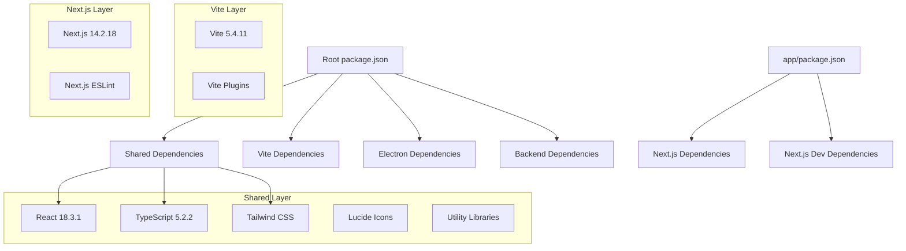

# Dependency Management V3.0 - Hybrid Architecture

## 🎯 Overview

The Dependency Management V3.0 handles the complex requirements of supporting both Vite and Next.js frontends while maintaining shared dependencies for Electron and backend services.

## 📦 Dependency Architecture



## 📋 Root Dependencies (package.json)

### Production Dependencies

```json
{
  "dependencies": {
    // Core React (Shared)
    "react": "^18.3.1",
    "react-dom": "^18.3.1",
    "react-router-dom": "^6.28.0",

    // UI Components (Shared)
    "lucide-react": "^0.460.0",
    "clsx": "^2.1.1",
    "tailwind-merge": "^2.5.4",
    "class-variance-authority": "^0.7.1",

    // Database & Backend
    "better-sqlite3": "^11.6.0",
    "express": "^4.21.2",
    "axios": "^1.7.9",
    "uuid": "^10.0.0",
    "zod": "^3.23.8",

    // Electron Utilities
    "electron-is-dev": "^2.0.0"
  }
}
```

### Development Dependencies

```json
{
  "devDependencies": {
    // TypeScript (Shared)
    "@types/react": "^18.3.12",
    "@types/react-dom": "^18.3.1",
    "@types/node": "^22.10.6",
    "@types/better-sqlite3": "^7.6.12",
    "@types/express": "^5.0.0",
    "@types/uuid": "^10.0.0",
    "@types/jest": "^29.5.14",

    // Vite Build System
    "@vitejs/plugin-react": "^4.3.4",
    "vite": "^5.4.11",

    // TypeScript Compiler
    "typescript": "~5.2.2",

    // Styling
    "tailwindcss": "^3.4.17",
    "autoprefixer": "^10.4.20",
    "postcss": "^8.5.4",

    // Electron
    "electron": "^33.3.0",
    "electron-builder": "^24.13.3",

    // Linting & Formatting
    "eslint": "^8.57.1",
    "@typescript-eslint/parser": "^6.21.0",
    "@typescript-eslint/eslint-plugin": "^6.21.0",
    "eslint-plugin-react": "^7.37.2",
    "eslint-plugin-react-hooks": "^4.6.2",
    "eslint-plugin-jsx-a11y": "^6.8.0",
    "prettier": "^3.4.1",

    // Testing
    "jest": "^29.7.0",
    "jest-environment-jsdom": "^29.7.0",
    "ts-jest": "^29.2.5"
  }
}
```

## 📱 Next.js Dependencies (app/package.json)

### Production Dependencies

```json
{
  "dependencies": {
    // Next.js Core
    "next": "^14.2.18",

    // React (Version-locked with root)
    "react": "^18.3.1",
    "react-dom": "^18.3.1",

    // Shared UI Libraries
    "lucide-react": "^0.460.0",
    "clsx": "^2.1.1",
    "tailwind-merge": "^2.5.4",
    "class-variance-authority": "^0.7.1"
  }
}
```

### Development Dependencies

```json
{
  "devDependencies": {
    // TypeScript
    "@types/node": "^22.10.6",
    "@types/react": "^18.3.12",
    "@types/react-dom": "^18.3.1",
    "typescript": "~5.2.2",

    // Tailwind CSS
    "tailwindcss": "^3.4.17",
    "autoprefixer": "^10.4.20",
    "postcss": "^8.5.4",

    // Next.js Linting
    "eslint": "^8.57.1",
    "eslint-config-next": "^14.2.18"
  }
}
```

## 🔄 Dependency Synchronization

### Version Lock Strategy

**Shared Libraries (Must Match)**
```json
{
  "react": "^18.3.1",
  "react-dom": "^18.3.1",
  "@types/react": "^18.3.12",
  "@types/react-dom": "^18.3.1",
  "typescript": "~5.2.2",
  "tailwindcss": "^3.4.17",
  "lucide-react": "^0.460.0"
}
```

**Synchronization Script** (`scripts/sync-deps.js`)
```javascript
const fs = require('fs');
const path = require('path');

function syncDependencies() {
  const rootPkg = require('../package.json');
  const appPkg = require('../app/package.json');

  // Shared dependencies that must match
  const sharedDeps = [
    'react',
    'react-dom',
    'typescript',
    'tailwindcss',
    'lucide-react',
    'clsx',
    'tailwind-merge',
    'class-variance-authority'
  ];

  const sharedDevDeps = [
    '@types/react',
    '@types/react-dom',
    '@types/node',
    'eslint'
  ];

  // Sync production dependencies
  sharedDeps.forEach(dep => {
    if (rootPkg.dependencies[dep] && appPkg.dependencies[dep]) {
      if (rootPkg.dependencies[dep] !== appPkg.dependencies[dep]) {
        console.warn(`Version mismatch for ${dep}:`);
        console.warn(`  Root: ${rootPkg.dependencies[dep]}`);
        console.warn(`  App:  ${appPkg.dependencies[dep]}`);
      }
    }
  });

  // Sync dev dependencies
  sharedDevDeps.forEach(dep => {
    if (rootPkg.devDependencies[dep] && appPkg.devDependencies[dep]) {
      if (rootPkg.devDependencies[dep] !== appPkg.devDependencies[dep]) {
        console.warn(`Dev dependency version mismatch for ${dep}:`);
        console.warn(`  Root: ${rootPkg.devDependencies[dep]}`);
        console.warn(`  App:  ${appPkg.devDependencies[dep]}`);
      }
    }
  });
}

syncDependencies();
```

### Automated Checks

**Package.json Scripts**
```json
{
  "scripts": {
    "deps:check": "node scripts/sync-deps.js",
    "deps:update": "npm update && cd app && npm update",
    "deps:audit": "npm audit && cd app && npm audit",
    "deps:fix": "npm audit fix && cd app && npm audit fix"
  }
}
```

## 🚀 Installation Workflow

### Initial Setup

```bash
# 1. Install root dependencies
npm install

# 2. Install Next.js app dependencies
cd app && npm install

# 3. Verify dependency sync
npm run deps:check

# 4. Run security audit
npm run deps:audit
```

### Development Workflow

```bash
# Daily dependency check
npm run deps:check

# Update dependencies (weekly)
npm run deps:update

# Security fixes (as needed)
npm run deps:fix
```

## 🔧 Dependency Resolution

### Peer Dependency Warnings

**Common Warnings & Solutions**

1. **React Version Mismatch**
```bash
# Root overrides for consistency
"overrides": {
  "react": "^18.3.1",
  "react-dom": "^18.3.1"
}
```

2. **TypeScript Version Conflicts**
```bash
# Use exact version in both packages
"typescript": "5.2.2"
```

3. **ESLint Configuration Conflicts**
```bash
# Use different configs per environment
# Root: Standard React config
# App: Next.js config
```

### Resolution Strategy

**Root package.json overrides**
```json
{
  "overrides": {
    "better-sqlite3": "^11.6.0",
    "react": "^18.3.1",
    "react-dom": "^18.3.1",
    "@types/react": "^18.3.12",
    "@types/react-dom": "^18.3.1"
  }
}
```

## 📊 Dependency Analysis

### Bundle Size Impact

| Category | Size (Vite) | Size (Next.js) | Shared |
|----------|-------------|----------------|--------|
| React Core | 138KB | 138KB | ✅ |
| Routing | 45KB (React Router) | 0KB (Built-in) | ❌ |
| UI Libraries | 89KB | 89KB | ✅ |
| Build Tools | 0KB (dev) | 0KB (dev) | N/A |
| **Total** | **272KB** | **227KB** | - |

### Performance Optimization

**Code Splitting**
```javascript
// Vite: Dynamic imports
const Component = lazy(() => import('./Component'));

// Next.js: Built-in optimization
import dynamic from 'next/dynamic';
const Component = dynamic(() => import('./Component'));
```

**Tree Shaking**
```javascript
// Import only needed icons
import { Search, User, Settings } from 'lucide-react';

// Instead of
import * as Icons from 'lucide-react';
```

## 🔄 Update Strategy

### Scheduled Updates

**Monthly Updates (Low Risk)**
- Patch versions of dependencies
- Security updates
- Minor version bumps for stable packages

**Quarterly Updates (Medium Risk)**
- Minor version updates for frameworks
- New dependencies evaluation
- Performance optimization

**Annual Updates (High Risk)**
- Major version updates
- Framework migrations
- Architecture changes

### Update Process

1. **Preparation**
```bash
# Create update branch
git checkout -b deps/update-q4-2024

# Backup current state
npm run deps:check > deps-before.txt
```

2. **Update Dependencies**
```bash
# Update root dependencies
npm update

# Update Next.js dependencies
cd app && npm update

# Check for breaking changes
npm run deps:check
```

3. **Testing**
```bash
# Build both versions
npm run build
npm run build:next

# Run tests
npm test
npm run test:next

# Manual testing
npm run dev & npm run dev:next
```

4. **Validation**
```bash
# Performance check
npm run build:all
du -sh dist/ app/out/

# Security audit
npm audit
cd app && npm audit
```

## 🛡️ Security Management

### Audit Workflow

```bash
# Daily automated check
npm audit --audit-level=moderate

# Weekly detailed audit
npm audit --json > security-audit.json
cd app && npm audit --json > ../security-audit-next.json
```

### Vulnerability Response

**High Severity**
- Immediate update required
- Test in isolated environment
- Deploy emergency patch

**Medium Severity**
- Update within 48 hours
- Include in next release cycle
- Document workarounds

**Low Severity**
- Update in monthly cycle
- Monitor for escalation
- Include in routine maintenance

### Security Tools

```json
{
  "scripts": {
    "security:audit": "npm audit && cd app && npm audit",
    "security:fix": "npm audit fix && cd app && npm audit fix",
    "security:check": "node scripts/security-check.js"
  }
}
```

## 🔍 Troubleshooting

### Common Issues

**1. React Version Conflicts**
```bash
# Check versions
npm ls react
cd app && npm ls react

# Fix mismatches
npm install react@18.3.1 react-dom@18.3.1
cd app && npm install react@18.3.1 react-dom@18.3.1
```

**2. TypeScript Compilation Errors**
```bash
# Clear TypeScript cache
rm -rf node_modules/.cache
rm -rf app/.next

# Reinstall type definitions
npm install --save-dev @types/react @types/react-dom
```

**3. Build Failures**
```bash
# Clear all caches
rm -rf node_modules package-lock.json
rm -rf app/node_modules app/package-lock.json

# Clean install
npm install
cd app && npm install
```

**4. Electron Native Dependencies**
```bash
# Rebuild native modules
npm rebuild better-sqlite3

# Use electron-rebuild
npx electron-rebuild
```

### Diagnostic Commands

```bash
# Check dependency tree
npm ls --depth=2

# Find duplicate packages
npm ls --depth=0 | grep -E "UNMET|invalid"

# Check for outdated packages
npm outdated
cd app && npm outdated
```

## 📈 Best Practices

### Dependency Hygiene

1. **Regular Audits**: Weekly security audits
2. **Version Pinning**: Use exact versions for critical deps
3. **Minimal Dependencies**: Only install what's needed
4. **Documentation**: Track reasons for each dependency

### Development Guidelines

1. **Shared First**: Check if dependency exists in root before adding to app/
2. **Version Consistency**: Keep shared libraries synchronized
3. **Security First**: Always run audit before adding new deps
4. **Performance Check**: Analyze bundle size impact

### Automation

```yaml
# GitHub Actions workflow
name: Dependency Check
on:
  schedule:
    - cron: '0 0 * * 1'  # Weekly on Monday

jobs:
  audit:
    runs-on: ubuntu-latest
    steps:
      - uses: actions/checkout@v4
      - uses: actions/setup-node@v4
      - run: npm ci
      - run: cd app && npm ci
      - run: npm run deps:check
      - run: npm audit
      - run: cd app && npm audit
```

## 🎯 Future Roadmap

### Planned Improvements

**Q4 2024**
- [ ] Automated dependency synchronization
- [ ] Enhanced security monitoring
- [ ] Bundle size optimization

**Q1 2025**
- [ ] Dependency consolidation
- [ ] Workspace configuration
- [ ] Advanced tree shaking

**Q2 2025**
- [ ] Micro-frontend architecture
- [ ] Module federation implementation
- [ ] Dynamic dependency loading

---

The Dependency Management V3.0 provides a robust foundation for the hybrid architecture while maintaining security, performance, and development experience standards.