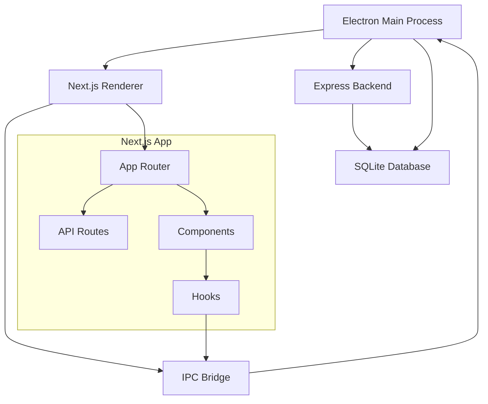

# Electron + Next.js Integration Guide

## 🎯 Overview

This guide covers the complete integration between Electron and Next.js in the Accenture Mainframe AI Assistant, including configuration, IPC communication, and best practices.

## 🏗️ Architecture Overview



## ⚙️ Configuration Setup

### 1. Next.js Configuration (`next.config.js`)

```javascript
/** @type {import('next').NextConfig} */
const nextConfig = {
  // Electron compatibility
  output: 'export',
  trailingSlash: true,
  images: {
    unoptimized: true,
  },

  // Disable static optimization for Electron
  experimental: {
    esmExternals: false,
  },

  // Asset prefix for file:// protocol in Electron
  assetPrefix: process.env.NODE_ENV === 'production' ? './' : '',

  // Webpack configuration for Electron
  webpack: (config, { isServer }) => {
    if (!isServer) {
      // Handle Electron's Node.js APIs in renderer
      config.resolve.fallback = {
        ...config.resolve.fallback,
        fs: false,
        path: false,
        os: false,
      };
    }
    return config;
  },

  // TypeScript configuration
  typescript: {
    tsconfigPath: './app/tsconfig.json',
  },

  // Build directory
  distDir: 'app/.next',

  // Security headers
  async headers() {
    return [
      {
        source: '/(.*)',
        headers: [
          {
            key: 'X-Frame-Options',
            value: 'DENY',
          },
          {
            key: 'X-Content-Type-Options',
            value: 'nosniff',
          },
        ],
      },
    ];
  },
};

module.exports = nextConfig;
```

### 2. TypeScript Configuration (`app/tsconfig.json`)

```json
{
  "$schema": "https://json.schemastore.org/tsconfig",
  "extends": "../tsconfig.json",
  "compilerOptions": {
    "target": "ES2022",
    "lib": ["DOM", "DOM.Iterable", "ES6"],
    "allowJs": true,
    "skipLibCheck": true,
    "strict": true,
    "noEmit": true,
    "esModuleInterop": true,
    "module": "esnext",
    "moduleResolution": "bundler",
    "resolveJsonModule": true,
    "isolatedModules": true,
    "jsx": "preserve",
    "incremental": true,
    "plugins": [{ "name": "next" }],
    "baseUrl": ".",
    "paths": {
      "@/*": ["./*"],
      "@/components/*": ["./components/*"],
      "@/lib/*": ["./lib/*"],
      "@main/*": ["../src/main/*"],
      "@renderer/*": ["../src/renderer/*"],
      "@shared/*": ["../src/shared/*"],
      "@database/*": ["../src/database/*"],
      "@services/*": ["../src/services/*"],
      "@hooks/*": ["../src/renderer/hooks/*"],
      "@utils/*": ["../src/shared/utils/*"],
      "@types/*": ["../src/types/*"]
    }
  },
  "include": [
    "next-env.d.ts",
    "**/*.ts",
    "**/*.tsx",
    ".next/types/**/*.ts"
  ],
  "exclude": ["node_modules", ".next"]
}
```

### 3. Electron Main Process Integration

```javascript
// src/main/main.js
const { app, BrowserWindow } = require('electron');
const path = require('path');
const isDev = process.env.NODE_ENV === 'development';

function createWindow() {
  const mainWindow = new BrowserWindow({
    width: 1200,
    height: 800,
    webPreferences: {
      nodeIntegration: false,
      contextIsolation: true,
      enableRemoteModule: false,
      preload: path.join(__dirname, 'preload.js'),
    },
  });

  if (isDev) {
    // Development: Connect to Next.js dev server
    mainWindow.loadURL('http://localhost:3001');
    mainWindow.webContents.openDevTools();
  } else {
    // Production: Load Next.js static export
    mainWindow.loadFile(path.join(__dirname, '../../app/out/index.html'));
  }
}

app.whenReady().then(createWindow);
```

### 4. Preload Script Enhancement

```javascript
// src/main/preload.js
const { contextBridge, ipcRenderer } = require('electron');

contextBridge.exposeInMainWorld('electronAPI', {
  // Database operations
  database: {
    getIncidents: () => ipcRenderer.invoke('database:get-incidents'),
    createIncident: (data) => ipcRenderer.invoke('database:create-incident', data),
    updateIncident: (id, data) => ipcRenderer.invoke('database:update-incident', id, data),
    deleteIncident: (id) => ipcRenderer.invoke('database:delete-incident', id),
    searchEntries: (query) => ipcRenderer.invoke('database:search-entries', query),
  },

  // Settings operations
  settings: {
    get: (key) => ipcRenderer.invoke('settings:get', key),
    set: (key, value) => ipcRenderer.invoke('settings:set', key, value),
    getAll: () => ipcRenderer.invoke('settings:get-all'),
  },

  // AI operations
  ai: {
    analyzeIncident: (data) => ipcRenderer.invoke('ai:analyze-incident', data),
    generateSolution: (problem) => ipcRenderer.invoke('ai:generate-solution', problem),
    searchSimilar: (query) => ipcRenderer.invoke('ai:search-similar', query),
  },

  // File operations
  files: {
    selectFile: () => ipcRenderer.invoke('files:select-file'),
    saveFile: (data, filename) => ipcRenderer.invoke('files:save-file', data, filename),
    exportData: (data, type) => ipcRenderer.invoke('files:export-data', data, type),
  },

  // System operations
  system: {
    getVersion: () => ipcRenderer.invoke('system:get-version'),
    minimize: () => ipcRenderer.invoke('window:minimize'),
    maximize: () => ipcRenderer.invoke('window:maximize'),
    close: () => ipcRenderer.invoke('window:close'),
  },

  // Event listeners
  on: (channel, callback) => {
    ipcRenderer.on(channel, callback);
  },
  removeListener: (channel, callback) => {
    ipcRenderer.removeListener(channel, callback);
  },
});
```

## 🔗 React Hooks for Electron Integration

### 1. useElectron Hook

```typescript
// app/hooks/useElectron.ts
'use client'
import { useEffect, useState } from 'react';

interface ElectronAPI {
  database: {
    getIncidents: () => Promise<any[]>;
    createIncident: (data: any) => Promise<any>;
    updateIncident: (id: string, data: any) => Promise<any>;
    deleteIncident: (id: string) => Promise<boolean>;
    searchEntries: (query: string) => Promise<any[]>;
  };
  settings: {
    get: (key: string) => Promise<any>;
    set: (key: string, value: any) => Promise<void>;
    getAll: () => Promise<Record<string, any>>;
  };
  ai: {
    analyzeIncident: (data: any) => Promise<any>;
    generateSolution: (problem: string) => Promise<string>;
    searchSimilar: (query: string) => Promise<any[]>;
  };
  files: {
    selectFile: () => Promise<string>;
    saveFile: (data: any, filename: string) => Promise<boolean>;
    exportData: (data: any, type: string) => Promise<boolean>;
  };
  system: {
    getVersion: () => Promise<string>;
    minimize: () => Promise<void>;
    maximize: () => Promise<void>;
    close: () => Promise<void>;
  };
  on: (channel: string, callback: (...args: any[]) => void) => void;
  removeListener: (channel: string, callback: (...args: any[]) => void) => void;
}

export function useElectron() {
  const [isElectron, setIsElectron] = useState(false);
  const [electronAPI, setElectronAPI] = useState<ElectronAPI | null>(null);

  useEffect(() => {
    // Check if running in Electron
    const isElectronApp = typeof window !== 'undefined' && window.electronAPI;
    setIsElectron(!!isElectronApp);

    if (isElectronApp) {
      setElectronAPI(window.electronAPI);
    }
  }, []);

  return {
    isElectron,
    electronAPI,
    // Convenience methods
    database: electronAPI?.database,
    settings: electronAPI?.settings,
    ai: electronAPI?.ai,
    files: electronAPI?.files,
    system: electronAPI?.system,
  };
}
```

### 2. useDatabase Hook

```typescript
// app/hooks/useDatabase.ts
'use client'
import { useCallback } from 'react';
import { useElectron } from './useElectron';

export function useDatabase() {
  const { database } = useElectron();

  const getIncidents = useCallback(async () => {
    if (!database) return [];
    try {
      return await database.getIncidents();
    } catch (error) {
      console.error('Error fetching incidents:', error);
      return [];
    }
  }, [database]);

  const createIncident = useCallback(async (incidentData: any) => {
    if (!database) throw new Error('Database not available');
    return await database.createIncident(incidentData);
  }, [database]);

  const updateIncident = useCallback(async (id: string, updates: any) => {
    if (!database) throw new Error('Database not available');
    return await database.updateIncident(id, updates);
  }, [database]);

  const deleteIncident = useCallback(async (id: string) => {
    if (!database) throw new Error('Database not available');
    return await database.deleteIncident(id);
  }, [database]);

  const searchEntries = useCallback(async (query: string) => {
    if (!database) return [];
    try {
      return await database.searchEntries(query);
    } catch (error) {
      console.error('Error searching entries:', error);
      return [];
    }
  }, [database]);

  return {
    getIncidents,
    createIncident,
    updateIncident,
    deleteIncident,
    searchEntries,
    isAvailable: !!database,
  };
}
```

## 📱 Next.js Components with Electron Integration

### 1. Incident Management Component

```typescript
// app/components/IncidentManager.tsx
'use client'
import { useState, useEffect } from 'react';
import { useDatabase } from '@/hooks/useDatabase';

interface Incident {
  id: string;
  title: string;
  description: string;
  status: 'open' | 'in-progress' | 'resolved';
  priority: 'low' | 'medium' | 'high' | 'critical';
  created_at: string;
  updated_at: string;
}

export default function IncidentManager() {
  const [incidents, setIncidents] = useState<Incident[]>([]);
  const [loading, setLoading] = useState(true);
  const { getIncidents, createIncident, updateIncident, deleteIncident, isAvailable } = useDatabase();

  useEffect(() => {
    if (isAvailable) {
      loadIncidents();
    }
  }, [isAvailable]);

  const loadIncidents = async () => {
    try {
      const data = await getIncidents();
      setIncidents(data);
    } catch (error) {
      console.error('Failed to load incidents:', error);
    } finally {
      setLoading(false);
    }
  };

  const handleCreateIncident = async (incidentData: Omit<Incident, 'id' | 'created_at' | 'updated_at'>) => {
    try {
      const newIncident = await createIncident(incidentData);
      setIncidents(prev => [...prev, newIncident]);
    } catch (error) {
      console.error('Failed to create incident:', error);
    }
  };

  const handleUpdateIncident = async (id: string, updates: Partial<Incident>) => {
    try {
      const updatedIncident = await updateIncident(id, updates);
      setIncidents(prev => prev.map(incident =>
        incident.id === id ? { ...incident, ...updatedIncident } : incident
      ));
    } catch (error) {
      console.error('Failed to update incident:', error);
    }
  };

  const handleDeleteIncident = async (id: string) => {
    try {
      await deleteIncident(id);
      setIncidents(prev => prev.filter(incident => incident.id !== id));
    } catch (error) {
      console.error('Failed to delete incident:', error);
    }
  };

  if (!isAvailable) {
    return <div>Database not available. Please run in Electron.</div>;
  }

  if (loading) {
    return <div>Loading incidents...</div>;
  }

  return (
    <div className="incident-manager">
      <h2>Incident Management</h2>
      {/* Incident list and forms */}
      <div className="incidents-list">
        {incidents.map(incident => (
          <div key={incident.id} className="incident-card">
            <h3>{incident.title}</h3>
            <p>{incident.description}</p>
            <p>Status: {incident.status}</p>
            <p>Priority: {incident.priority}</p>
            <button onClick={() => handleUpdateIncident(incident.id, { status: 'resolved' })}>
              Resolve
            </button>
            <button onClick={() => handleDeleteIncident(incident.id)}>
              Delete
            </button>
          </div>
        ))}
      </div>
    </div>
  );
}
```

### 2. Settings Component

```typescript
// app/components/Settings.tsx
'use client'
import { useState, useEffect } from 'react';
import { useElectron } from '@/hooks/useElectron';

export default function Settings() {
  const [settings, setSettings] = useState<Record<string, any>>({});
  const [loading, setLoading] = useState(true);
  const { settings: settingsAPI } = useElectron();

  useEffect(() => {
    if (settingsAPI) {
      loadSettings();
    }
  }, [settingsAPI]);

  const loadSettings = async () => {
    try {
      const allSettings = await settingsAPI!.getAll();
      setSettings(allSettings);
    } catch (error) {
      console.error('Failed to load settings:', error);
    } finally {
      setLoading(false);
    }
  };

  const updateSetting = async (key: string, value: any) => {
    try {
      await settingsAPI!.set(key, value);
      setSettings(prev => ({ ...prev, [key]: value }));
    } catch (error) {
      console.error('Failed to update setting:', error);
    }
  };

  if (!settingsAPI) {
    return <div>Settings not available. Please run in Electron.</div>;
  }

  if (loading) {
    return <div>Loading settings...</div>;
  }

  return (
    <div className="settings">
      <h2>Settings</h2>
      <div className="settings-grid">
        <div className="setting-item">
          <label>AI Provider</label>
          <select
            value={settings.aiProvider || 'gemini'}
            onChange={(e) => updateSetting('aiProvider', e.target.value)}
          >
            <option value="gemini">Google Gemini</option>
            <option value="openai">OpenAI GPT</option>
          </select>
        </div>

        <div className="setting-item">
          <label>Theme</label>
          <select
            value={settings.theme || 'light'}
            onChange={(e) => updateSetting('theme', e.target.value)}
          >
            <option value="light">Light</option>
            <option value="dark">Dark</option>
            <option value="auto">Auto</option>
          </select>
        </div>
      </div>
    </div>
  );
}
```

## 🚀 Next.js App Router Integration

### 1. Root Layout

```typescript
// app/layout.tsx
import type { Metadata } from 'next';
import './globals.css';

export const metadata: Metadata = {
  title: 'Accenture Mainframe AI Assistant',
  description: 'Enterprise Knowledge Management & AI-Powered Incident Resolution',
};

export default function RootLayout({
  children,
}: {
  children: React.ReactNode;
}) {
  return (
    <html lang="en">
      <body>
        <div id="app">
          {children}
        </div>
      </body>
    </html>
  );
}
```

### 2. Dashboard Route

```typescript
// app/(dashboard)/page.tsx
import IncidentManager from '@/components/IncidentManager';
import Settings from '@/components/Settings';

export default function DashboardPage() {
  return (
    <div className="dashboard">
      <header>
        <h1>Mainframe AI Assistant</h1>
      </header>

      <main className="dashboard-content">
        <div className="dashboard-grid">
          <section className="incidents-section">
            <IncidentManager />
          </section>

          <section className="settings-section">
            <Settings />
          </section>
        </div>
      </main>
    </div>
  );
}
```

## 🔄 Build Process Integration

### 1. Development Workflow

```bash
# Terminal 1: Start Next.js dev server
cd app && npm run dev

# Terminal 2: Start Electron with Next.js
npm run electron:dev
```

### 2. Production Build

```bash
# 1. Build Next.js app
cd app && npm run build

# 2. Build Electron app
npm run build:electron
```

### 3. Build Scripts

```json
// package.json
{
  "scripts": {
    "dev:next": "cd app && next dev -p 3001",
    "build:next": "cd app && next build",
    "build:electron-next": "cd app && next build && electron-builder",
    "start:next": "cd app && next start -p 3001"
  }
}
```

## 🔒 Security Considerations

### 1. Context Isolation
- Enabled in `webPreferences`
- No direct Node.js access in renderer
- All communication through IPC

### 2. Content Security Policy
```html
<meta http-equiv="Content-Security-Policy" content="
  default-src 'self';
  script-src 'self' 'unsafe-inline';
  style-src 'self' 'unsafe-inline';
  img-src 'self' data:;
">
```

### 3. IPC Security
- Validate all IPC messages
- Sanitize user inputs
- Use typed interfaces

## 🐛 Troubleshooting

### Common Issues

**1. Next.js Dev Server Not Loading**
```bash
# Check if port 3001 is available
lsof -i :3001
# Kill process if needed
kill -9 <PID>
```

**2. File Path Issues in Production**
```javascript
// Use relative paths for Electron
assetPrefix: process.env.NODE_ENV === 'production' ? './' : ''
```

**3. TypeScript Path Resolution**
```json
// Ensure paths are correctly mapped in tsconfig.json
"paths": {
  "@/*": ["./*"],
  "@main/*": ["../src/main/*"]
}
```

## 📈 Performance Optimization

### 1. Bundle Analysis
```bash
# Analyze Next.js bundle
cd app && npx @next/bundle-analyzer
```

### 2. Code Splitting
```typescript
// Dynamic imports for heavy components
import dynamic from 'next/dynamic';

const HeavyComponent = dynamic(() => import('./HeavyComponent'), {
  loading: () => <p>Loading...</p>,
});
```

### 3. Electron Optimization
```javascript
// Enable Electron optimizations
webPreferences: {
  nodeIntegration: false,
  contextIsolation: true,
  webSecurity: true,
  allowRunningInsecureContent: false
}
```

## 🎯 Best Practices

1. **Separation of Concerns**: Keep business logic in hooks
2. **Error Handling**: Always handle IPC errors gracefully
3. **Type Safety**: Use TypeScript interfaces for IPC communication
4. **Performance**: Use React.memo for expensive components
5. **Testing**: Test both web and Electron environments

---

This integration provides a robust foundation for modern Next.js development within an Electron desktop application while maintaining security and performance standards.