# Estratégia de Migração de Dados e Persistência V2

## 🎯 Visão Geral

Este documento apresenta a estratégia completa para migração do sistema atual SQLite para uma arquitetura baseada em Prisma, mantendo compatibilidade com a estrutura de incidentes existente e garantindo zero downtime.

## 📊 1. Análise do Estado Atual

### 1.1 Esquema SQLite Atual

**Base de Dados:** `kb-assistant.db` (389KB)
**Estrutura Principal:**
- **Tabela Unificada:** `entries` (substitui kb_entries e incidents)
- **Tabelas de Suporte:** entry_tags, entry_feedback, entry_relationships, entry_comments
- **Tabelas de Métricas:** usage_metrics, entry_metrics_snapshots, team_performance
- **Tabelas de Sistema:** sla_policies, automation_rules, system_config

```sql
-- Estrutura Principal Unificada
CREATE TABLE entries (
    id TEXT PRIMARY KEY,
    entry_type TEXT CHECK(entry_type IN ('knowledge', 'incident')),
    title TEXT NOT NULL,
    description TEXT NOT NULL,
    problem TEXT,
    solution TEXT,
    category TEXT CHECK(category IN ('JCL', 'VSAM', 'DB2', 'Batch', 'Functional', ...)),
    severity TEXT CHECK(severity IN ('critical', 'high', 'medium', 'low')),
    status TEXT,
    incident_status TEXT CHECK(incident_status IN ('aberto', 'em_tratamento', 'resolvido', ...)),
    -- ... campos adicionais
);
```

### 1.2 Padrões de Acesso a Dados Atuais

**Volume de Dados Estimado:**
- Entradas KB: ~500-1000 registros
- Incidentes: ~200-500 registros
- Tags: ~1000-2000 registros
- Feedback: ~500-1500 registros

**Queries Críticas Identificadas:**
1. Busca unificada por tipo e categoria
2. Filtros complexos de incidentes por status/prioridade
3. Métricas de MTTR por equipe/categoria
4. Análises temporais de tendências
5. Busca full-text (FTS5)

### 1.3 Dependências Atuais

- `better-sqlite3` v11.6.0
- Interface `IStorageService` para abstração
- Sistema de backup automático
- Triggers para audit trail
- Views para compatibilidade reversa

## 🏗️ 2. Migração para Prisma

### 2.1 Schema Prisma Completo

```prisma
// prisma/schema.prisma
generator client {
  provider = "prisma-client-js"
  output   = "../src/generated/prisma"
}

datasource db {
  provider = "sqlite"
  url      = env("DATABASE_URL")
}

// ===== MODELO UNIFICADO PRINCIPAL =====

model Entry {
  id           String    @id
  title        String    @db.VarChar(255)

  // Tipo e classificação
  entryType    EntryType @map("entry_type")
  isKnowledge  Boolean   @default(false) @map("is_knowledge_base")
  isIncident   Boolean   @default(false) @map("is_incident")

  // Conteúdo
  description  String    @db.Text
  problem      String?   @db.Text
  solution     String?   @db.Text

  // Classificação
  category     Category
  subcategory  String?   @db.VarChar(100)
  severity     Severity  @default(MEDIUM)
  priority     Int       @default(3) @db.SmallInt

  // Status unificado
  status       String    @default("active") @db.VarChar(50)

  // Campos específicos de incidente
  incidentStatus  IncidentStatus? @map("incident_status")
  assignedTeam    String?         @map("assigned_team") @db.VarChar(100)
  assignedTo      String?         @map("assigned_to") @db.VarChar(100)
  reporter        String?         @db.VarChar(100)
  resolutionType  ResolutionType? @map("resolution_type")
  rootCause       String?         @map("root_cause") @db.Text

  // Timestamps
  createdAt      DateTime @default(now()) @map("created_at")
  updatedAt      DateTime @updatedAt @map("updated_at")
  createdBy      String   @default("system") @map("created_by") @db.VarChar(100)

  // Timestamps de incidente
  firstResponseAt DateTime? @map("first_response_at")
  assignedAt      DateTime? @map("assigned_at")
  inProgressAt    DateTime? @map("in_progress_at")
  resolvedAt      DateTime? @map("resolved_at")
  closedAt        DateTime? @map("closed_at")
  lastUsed        DateTime? @map("last_used")

  // Métricas
  usageCount      Int   @default(0) @map("usage_count")
  successCount    Int   @default(0) @map("success_count")
  failureCount    Int   @default(0) @map("failure_count")
  escalationCount Int   @default(0) @map("escalation_count")
  reopenCount     Int   @default(0) @map("reopen_count")

  // Tempos de resolução
  resolutionTimeHours Float? @map("resolution_time_hours")
  responseTimeHours   Float? @map("response_time_hours")

  // SLA
  slaBreach               Boolean @default(false) @map("sla_breach")
  slaTargetResponseHours  Int?    @map("sla_target_response_hours")
  slaTargetResolutionHours Int?   @map("sla_target_resolution_hours")

  // Confiança e IA
  confidenceScore     Float? @map("confidence_score")
  aiConfidenceScore   Float? @map("ai_confidence_score")
  aiSuggestedCategory String? @map("ai_suggested_category") @db.VarChar(50)
  aiProcessed         Boolean @default(false) @map("ai_processed")

  // Relacionamentos
  parentEntryId     String? @map("parent_entry_id")
  parentEntry       Entry?  @relation("EntryHierarchy", fields: [parentEntryId], references: [id])
  childEntries      Entry[] @relation("EntryHierarchy")
  relatedKbEntries  String? @map("related_kb_entries") @db.Text // JSON
  relatedEntries    String? @map("related_entries") @db.Text // JSON

  // Metadados flexíveis
  tags          String? @db.Text // JSON
  customFields  String? @map("custom_fields") @db.Text // JSON
  attachments   String? @db.Text // JSON
  metadata      String? @db.Text // JSON

  // Flags
  archived  Boolean @default(false)
  pinned    Boolean @default(false)
  featured  Boolean @default(false)

  // Controle de versão
  version Int @default(1)

  // Relacionamentos
  tags_rel            EntryTag[]
  feedback            EntryFeedback[]
  comments            EntryComment[]
  usageMetrics        UsageMetric[]
  sourceRelationships EntryRelationship[] @relation("SourceEntry")
  targetRelationships EntryRelationship[] @relation("TargetEntry")
  searchHistories     SearchHistory[]
  kbSuggestions       IncidentKbSuggestion[]

  @@map("entries")
  @@index([entryType, status, createdAt(sort: Desc)], name: "idx_entries_type")
  @@index([category, entryType, createdAt(sort: Desc)], name: "idx_entries_category")
  @@index([severity, entryType, createdAt(sort: Desc)], name: "idx_entries_severity")
  @@index([assignedTo, entryType, createdAt(sort: Desc)], name: "idx_entries_assigned")
  @@index([usageCount(sort: Desc), entryType], name: "idx_entries_usage")
  @@index([entryType, status, severity, createdAt(sort: Desc)], name: "idx_entries_composite")
}

// ===== ENUMS =====

enum EntryType {
  KNOWLEDGE @map("knowledge")
  INCIDENT  @map("incident")

  @@map("entry_type")
}

enum Category {
  JCL
  VSAM
  DB2
  BATCH      @map("Batch")
  FUNCTIONAL @map("Functional")
  CICS
  IMS
  SECURITY   @map("Security")
  NETWORK    @map("Network")
  HARDWARE   @map("Hardware")
  SOFTWARE   @map("Software")
  SYSTEM     @map("System")
  OTHER      @map("Other")

  @@map("category")
}

enum Severity {
  CRITICAL @map("critical")
  HIGH     @map("high")
  MEDIUM   @map("medium")
  LOW      @map("low")

  @@map("severity")
}

enum IncidentStatus {
  ABERTO        @map("aberto")
  EM_TRATAMENTO @map("em_tratamento")
  EM_REVISAO    @map("em_revisao")
  RESOLVIDO     @map("resolvido")
  FECHADO       @map("fechado")
  REABERTO      @map("reaberto")

  @@map("incident_status")
}

enum ResolutionType {
  FIXED             @map("fixed")
  WORKAROUND        @map("workaround")
  DUPLICATE         @map("duplicate")
  CANNOT_REPRODUCE  @map("cannot_reproduce")
  INVALID           @map("invalid")
  WONT_FIX          @map("wont_fix")

  @@map("resolution_type")
}

// ===== TABELAS DE SUPORTE =====

model EntryTag {
  entryId   String   @map("entry_id")
  tag       String   @db.VarChar(50)
  tagType   TagType  @default(USER) @map("tag_type")
  createdAt DateTime @default(now()) @map("created_at")

  entry Entry @relation(fields: [entryId], references: [id], onDelete: Cascade)

  @@id([entryId, tag])
  @@map("entry_tags")
  @@index([tag, entryId], name: "idx_entry_tags_tag")
}

enum TagType {
  USER     @map("user")
  SYSTEM   @map("system")
  AUTO     @map("auto")
  CATEGORY @map("category")

  @@map("tag_type")
}

model EntryFeedback {
  id             String       @id @default(cuid())
  entryId        String       @map("entry_id")
  userId         String?      @map("user_id") @db.VarChar(100)
  feedbackType   FeedbackType @default(RATING) @map("feedback_type")
  rating         Int?         @db.SmallInt
  successful     Boolean?
  comment        String?      @db.Text
  sessionId      String?      @map("session_id") @db.VarChar(100)
  resolutionTime Int?         @map("resolution_time")
  helpfulRating  Int?         @map("helpful_rating") @db.SmallInt
  timestamp      DateTime     @default(now())
  metadata       String?      @db.Text // JSON

  entry Entry @relation(fields: [entryId], references: [id], onDelete: Cascade)

  @@map("entry_feedback")
  @@index([entryId, feedbackType, timestamp(sort: Desc)], name: "idx_feedback_entry")
}

enum FeedbackType {
  RATING  @map("rating")
  COMMENT @map("comment")
  SUCCESS @map("success")
  FAILURE @map("failure")
  HELPFUL @map("helpful")

  @@map("feedback_type")
}

model EntryRelationship {
  id               Int              @id @default(autoincrement())
  sourceEntryId    String           @map("source_entry_id")
  targetEntryId    String           @map("target_entry_id")
  relationshipType RelationshipType @map("relationship_type")
  similarityScore  Float            @default(0.0) @map("similarity_score")
  createdAt        DateTime         @default(now()) @map("created_at")
  createdBy        String?          @map("created_by") @db.VarChar(100)
  notes            String?          @db.Text
  active           Boolean          @default(true)

  sourceEntry Entry @relation("SourceEntry", fields: [sourceEntryId], references: [id], onDelete: Cascade)
  targetEntry Entry @relation("TargetEntry", fields: [targetEntryId], references: [id], onDelete: Cascade)

  @@unique([sourceEntryId, targetEntryId, relationshipType])
  @@map("entry_relationships")
  @@index([sourceEntryId, relationshipType, active], name: "idx_relationships_source")
}

enum RelationshipType {
  RELATED      @map("related")
  DUPLICATE    @map("duplicate")
  BLOCKS       @map("blocks")
  BLOCKED_BY   @map("blocked_by")
  PARENT       @map("parent")
  CHILD        @map("child")
  CAUSED_BY    @map("caused_by")
  CAUSES       @map("causes")
  SUPERSEDED_BY @map("superseded_by")
  SUPERSEDES   @map("supersedes")
  REFERENCE    @map("reference")
  DEPENDENCY   @map("dependency")

  @@map("relationship_type")
}

model EntryComment {
  id          Int         @id @default(autoincrement())
  entryId     String      @map("entry_id")
  commentType CommentType @default(COMMENT) @map("comment_type")
  content     String      @db.Text
  author      String      @db.VarChar(100)
  isInternal  Boolean     @default(false) @map("is_internal")
  isSystem    Boolean     @default(false) @map("is_system")
  createdAt   DateTime    @default(now()) @map("created_at")
  updatedAt   DateTime    @updatedAt @map("updated_at")
  metadata    String?     @db.Text // JSON

  entry Entry @relation(fields: [entryId], references: [id], onDelete: Cascade)

  @@map("entry_comments")
  @@index([entryId, createdAt(sort: Desc)], name: "idx_comments_entry")
}

enum CommentType {
  COMMENT        @map("comment")
  STATUS_CHANGE  @map("status_change")
  ASSIGNMENT     @map("assignment")
  ESCALATION     @map("escalation")
  RESOLUTION     @map("resolution")
  UPDATE         @map("update")
  NOTE           @map("note")
  CLARIFICATION  @map("clarification")

  @@map("comment_type")
}

model UsageMetric {
  id              Int      @id @default(autoincrement())
  entryId         String   @map("entry_id")
  action          String   @db.VarChar(50)
  userId          String?  @map("user_id") @db.VarChar(100)
  sessionId       String?  @map("session_id") @db.VarChar(100)
  timestamp       DateTime @default(now())
  durationSeconds Int?     @map("duration_seconds")
  success         Boolean?
  metadata        String?  @db.Text // JSON

  entry Entry @relation(fields: [entryId], references: [id], onDelete: Cascade)

  @@map("usage_metrics")
  @@index([entryId, action, timestamp(sort: Desc)], name: "idx_usage_entry_action")
}

model SearchHistory {
  id               Int      @id @default(autoincrement())
  query            String   @db.VarChar(500)
  normalizedQuery  String?  @map("normalized_query") @db.VarChar(500)
  searchType       SearchType @default(BASIC) @map("search_type")
  resultsCount     Int      @map("results_count")
  selectedEntryId  String?  @map("selected_entry_id")
  entryTypeFilter  EntryType? @map("entry_type_filter")
  userId           String?  @map("user_id") @db.VarChar(100)
  sessionId        String?  @map("session_id") @db.VarChar(100)
  searchTimeMs     Int?     @map("search_time_ms")
  filtersUsed      String?  @map("filters_used") @db.Text // JSON
  aiUsed           Boolean  @default(false) @map("ai_used")
  timestamp        DateTime @default(now())

  selectedEntry Entry? @relation(fields: [selectedEntryId], references: [id], onDelete: SetNull)

  @@map("search_history")
  @@index([normalizedQuery, searchType, entryTypeFilter], name: "idx_search_query_type")
}

enum SearchType {
  BASIC    @map("basic")
  ADVANCED @map("advanced")
  SEMANTIC @map("semantic")
  AI       @map("ai")
  FTS      @map("fts")

  @@map("search_type")
}

// ===== TABELAS DE SISTEMA =====

model SlaPolicy {
  id                    Int       @id @default(autoincrement())
  name                  String    @unique @db.VarChar(100)
  entryType             EntryType? @map("entry_type")
  category              Category?
  severity              Severity?
  priorityMin           Int?      @map("priority_min") @db.SmallInt
  priorityMax           Int?      @map("priority_max") @db.SmallInt
  responseTimeHours     Int       @map("response_time_hours")
  resolutionTimeHours   Int       @map("resolution_time_hours")
  escalationRules       String?   @map("escalation_rules") @db.Text // JSON
  active                Boolean   @default(true)
  createdAt             DateTime  @default(now()) @map("created_at")
  updatedAt             DateTime  @updatedAt @map("updated_at")

  @@map("sla_policies")
  @@index([entryType, category, severity, active], name: "idx_sla_policies_active")
}

model AutomationRule {
  id           Int       @id @default(autoincrement())
  name         String    @db.VarChar(100)
  description  String?   @db.VarChar(500)
  entryType    EntryType? @map("entry_type")
  ruleType     RuleType  @map("rule_type")
  conditions   String    @db.Text // JSON
  actions      String    @db.Text // JSON
  enabled      Boolean   @default(true)
  priority     Int       @default(100)
  successCount Int       @default(0) @map("success_count")
  failureCount Int       @default(0) @map("failure_count")
  lastExecuted DateTime? @map("last_executed")
  createdAt    DateTime  @default(now()) @map("created_at")
  createdBy    String?   @map("created_by") @db.VarChar(100)

  @@map("automation_rules")
  @@index([entryType, ruleType, enabled, priority], name: "idx_automation_rules_type")
}

enum RuleType {
  AUTO_ASSIGN     @map("auto_assign")
  AUTO_CATEGORIZE @map("auto_categorize")
  AUTO_ESCALATE   @map("auto_escalate")
  AUTO_CLOSE      @map("auto_close")
  NOTIFICATION    @map("notification")
  AUTO_TAG        @map("auto_tag")
  AUTO_RELATE     @map("auto_relate")

  @@map("rule_type")
}

model SystemConfig {
  key         String   @id @db.VarChar(100)
  value       String   @db.Text
  type        ConfigType @default(STRING)
  description String?  @db.VarChar(500)
  category    String   @default("general") @db.VarChar(50)
  createdAt   DateTime @default(now()) @map("created_at")
  updatedAt   DateTime @updatedAt @map("updated_at")

  @@map("system_config")
}

enum ConfigType {
  STRING  @map("string")
  NUMBER  @map("number")
  BOOLEAN @map("boolean")
  JSON    @map("json")

  @@map("config_type")
}

// ===== TABELAS DE SUPORTE ESPECÍFICAS PARA INCIDENTES =====

model IncidentKbSuggestion {
  id             Int      @id @default(autoincrement())
  incidentId     String   @map("incident_id")
  kbEntryId      String   @map("kb_entry_id")
  suggestionType SuggestionType @default(AUTO) @map("suggestion_type")
  relevanceScore Float    @default(0.0) @map("relevance_score")
  applied        Boolean  @default(false)
  helpfulRating  Int?     @map("helpful_rating") @db.SmallInt
  createdAt      DateTime @default(now()) @map("created_at")

  incident Entry @relation(fields: [incidentId], references: [id], onDelete: Cascade)

  @@map("incident_kb_suggestions")
  @@index([incidentId, relevanceScore(sort: Desc)], name: "idx_kb_suggestions_incident")
}

enum SuggestionType {
  AUTO   @map("auto")
  MANUAL @map("manual")
  AI     @map("ai")

  @@map("suggestion_type")
}

// ===== TABELAS DE MÉTRICAS E AUDITORIA =====

model EntryMetricsSnapshot {
  id                      Int       @id @default(autoincrement())
  snapshotDate            DateTime  @map("snapshot_date") @db.Date
  periodType              PeriodType @map("period_type")
  entryType               EntryType @map("entry_type")
  totalEntries            Int       @default(0) @map("total_entries")
  newEntries              Int       @default(0) @map("new_entries")
  updatedEntries          Int       @default(0) @map("updated_entries")
  resolvedEntries         Int       @default(0) @map("resolved_entries")
  archivedEntries         Int       @default(0) @map("archived_entries")
  kbUsageCount            Int       @default(0) @map("kb_usage_count")
  kbSuccessRate           Float     @default(0) @map("kb_success_rate")
  incidentResolved        Int       @default(0) @map("incident_resolved")
  incidentClosed          Int       @default(0) @map("incident_closed")
  incidentReopened        Int       @default(0) @map("incident_reopened")
  avgResponseTimeHours    Float     @default(0) @map("avg_response_time_hours")
  avgResolutionTimeHours  Float     @default(0) @map("avg_resolution_time_hours")
  avgMttrHours            Float     @default(0) @map("avg_mttr_hours")
  categoryBreakdown       String?   @map("category_breakdown") @db.Text // JSON
  severityBreakdown       String?   @map("severity_breakdown") @db.Text // JSON
  teamBreakdown           String?   @map("team_breakdown") @db.Text // JSON
  slaMetPercentage        Float     @default(0) @map("sla_met_percentage")
  slaBreaches             Int       @default(0) @map("sla_breaches")
  createdAt               DateTime  @default(now()) @map("created_at")

  @@unique([snapshotDate, periodType, entryType])
  @@map("entry_metrics_snapshots")
  @@index([snapshotDate(sort: Desc), periodType, entryType], name: "idx_metrics_snapshots_date")
}

enum PeriodType {
  DAILY   @map("daily")
  WEEKLY  @map("weekly")
  MONTHLY @map("monthly")

  @@map("period_type")
}

model AuditLog {
  id         Int      @id @default(autoincrement())
  tableName  String   @map("table_name") @db.VarChar(50)
  recordId   String   @map("record_id") @db.VarChar(100)
  operation  Operation
  oldValues  String?  @map("old_values") @db.Text // JSON
  newValues  String?  @map("new_values") @db.Text // JSON
  userId     String?  @map("user_id") @db.VarChar(100)
  sessionId  String?  @map("session_id") @db.VarChar(100)
  ipAddress  String?  @map("ip_address") @db.VarChar(45)
  userAgent  String?  @map("user_agent") @db.VarChar(500)
  timestamp  DateTime @default(now())

  @@map("audit_log")
  @@index([tableName, recordId, timestamp(sort: Desc)], name: "idx_audit_table_record")
}

enum Operation {
  INSERT
  UPDATE
  DELETE

  @@map("operation")
}

model SchemaVersion {
  version     Int      @id
  description String
  appliedAt   DateTime @default(now()) @map("applied_at")

  @@map("schema_versions")
}
```

### 2.2 Migrations Necessárias

```sql
-- Migration 001: Inicial Prisma Setup
-- Arquivo: prisma/migrations/001_initial_prisma_setup/migration.sql

-- Criar nova tabela entries_new com estrutura Prisma
CREATE TABLE "entries_new" (
    "id" TEXT NOT NULL PRIMARY KEY,
    "title" VARCHAR(255) NOT NULL,
    "entry_type" TEXT NOT NULL DEFAULT 'knowledge',
    "is_knowledge_base" BOOLEAN NOT NULL DEFAULT false,
    "is_incident" BOOLEAN NOT NULL DEFAULT false,
    "description" TEXT NOT NULL,
    "problem" TEXT,
    "solution" TEXT,
    "category" TEXT NOT NULL,
    "subcategory" VARCHAR(100),
    "severity" TEXT NOT NULL DEFAULT 'MEDIUM',
    "priority" SMALLINT NOT NULL DEFAULT 3,
    "status" VARCHAR(50) NOT NULL DEFAULT 'active',
    "incident_status" TEXT,
    -- ... todos os outros campos
    "created_at" DATETIME NOT NULL DEFAULT CURRENT_TIMESTAMP,
    "updated_at" DATETIME NOT NULL DEFAULT CURRENT_TIMESTAMP
);

-- Migrar dados existentes
INSERT INTO entries_new (
    id, title, entry_type, description, problem, solution,
    category, severity, status, incident_status, created_at, updated_at
    -- ... outros campos
)
SELECT
    id, title, entry_type, description, problem, solution,
    category, severity, status, incident_status, created_at, updated_at
    -- ... outros campos
FROM entries;

-- Renomear tabelas
ALTER TABLE entries RENAME TO entries_old;
ALTER TABLE entries_new RENAME TO entries;

-- Recriar índices
CREATE INDEX "idx_entries_type" ON "entries"("entry_type", "status", "created_at" DESC);
-- ... outros índices
```

### 2.3 Schema de Migração Incremental

```javascript
// scripts/migrate-to-prisma.js
const { PrismaClient } = require('@prisma/client')
const Database = require('better-sqlite3')

class PrismaMigrationManager {
  constructor() {
    this.prisma = new PrismaClient()
    this.sqlite = new Database('kb-assistant.db')
    this.batchSize = 100
  }

  async migrateInBatches() {
    console.log('🚀 Iniciando migração em lotes...')

    // 1. Migrar entries
    await this.migrateEntries()

    // 2. Migrar tags
    await this.migrateTags()

    // 3. Migrar feedback
    await this.migrateFeedback()

    // 4. Migrar relacionamentos
    await this.migrateRelationships()

    // 5. Validar migração
    await this.validateMigration()

    console.log('✅ Migração concluída com sucesso!')
  }

  async migrateEntries() {
    const totalEntries = this.sqlite.prepare('SELECT COUNT(*) as count FROM entries').get().count
    console.log(`📊 Migrando ${totalEntries} entradas...`)

    for (let offset = 0; offset < totalEntries; offset += this.batchSize) {
      const entries = this.sqlite.prepare(`
        SELECT * FROM entries
        LIMIT ${this.batchSize} OFFSET ${offset}
      `).all()

      await this.prisma.entry.createMany({
        data: entries.map(entry => this.transformEntry(entry)),
        skipDuplicates: true
      })

      console.log(`📦 Migradas ${Math.min(offset + this.batchSize, totalEntries)}/${totalEntries} entradas`)
    }
  }

  transformEntry(sqliteEntry) {
    return {
      id: sqliteEntry.id,
      title: sqliteEntry.title,
      entryType: sqliteEntry.entry_type === 'knowledge' ? 'KNOWLEDGE' : 'INCIDENT',
      description: sqliteEntry.description,
      problem: sqliteEntry.problem,
      solution: sqliteEntry.solution,
      category: this.mapCategory(sqliteEntry.category),
      severity: this.mapSeverity(sqliteEntry.severity),
      status: sqliteEntry.status,
      incidentStatus: this.mapIncidentStatus(sqliteEntry.incident_status),
      // ... outros campos
      createdAt: new Date(sqliteEntry.created_at),
      updatedAt: new Date(sqliteEntry.updated_at || sqliteEntry.created_at)
    }
  }
}
```

## 🛡️ 3. Estratégia de Migração Zero-Downtime

### 3.1 Processo de Migração Sem Interrupção

```mermaid
graph TD
    A[Sistema Atual SQLite] --> B[Backup Completo]
    B --> C[Deploy Prisma Schema]
    C --> D[Migração Incremental]
    D --> E[Validação de Dados]
    E --> F[Switch Gradual]
    F --> G[Monitoramento]
    G --> H[Rollback Ready]
```



**Fases da Migração:**

1. **Preparação (0-5min)**
   - Backup automático da base atual
   - Deploy da nova estrutura Prisma
   - Validação das conexões

2. **Migração Incremental (5-30min)**
   - Migração por lotes de 100 registros
   - Validação contínua de integridade
   - Log detalhado de progresso

3. **Período de Coexistência (1-7 dias)**
   - Sistema lê de Prisma, escreve em ambos
   - Validação contínua de sincronização
   - Monitoramento de performance

4. **Switch Completo (instantâneo)**
   - Desativação de escritas em SQLite legado
   - Sistema 100% Prisma
   - Backup final do estado anterior

### 3.2 Implementação do Dual-Write

```typescript
// src/services/storage/DualWriteStorageService.ts
export class DualWriteStorageService implements IStorageService {
  constructor(
    private prismaService: PrismaStorageService,
    private sqliteService: SQLiteStorageService,
    private validationService: DataValidationService
  ) {}

  async createEntry(entry: Partial<Entry>): Promise<Entry> {
    // Fase 1: Escrever em Prisma (principal)
    const prismaResult = await this.prismaService.createEntry(entry)

    try {
      // Fase 2: Escrever em SQLite (backup)
      await this.sqliteService.createEntry(entry)

      // Fase 3: Validar consistência
      await this.validationService.validateConsistency(prismaResult.id)

      return prismaResult
    } catch (error) {
      // Rollback em caso de erro
      await this.prismaService.deleteEntry(prismaResult.id)
      throw error
    }
  }

  async findEntries(filters: EntryFilters): Promise<Entry[]> {
    // Sempre ler do Prisma (fonte da verdade)
    return this.prismaService.findEntries(filters)
  }
}
```

## 🔄 4. Backup e Rollback

### 4.1 Estratégia de Backup

```typescript
// src/services/backup/BackupManager.ts
export class BackupManager {
  private backupPath = './backups'

  async createPreMigrationBackup(): Promise<BackupInfo> {
    const timestamp = new Date().toISOString().replace(/[:.]/g, '-')
    const backupFileName = `pre-migration-${timestamp}.db`

    // 1. Backup da base SQLite atual
    await this.copyDatabase(`${this.backupPath}/${backupFileName}`)

    // 2. Export dos dados em JSON (fallback)
    const jsonBackup = await this.exportToJSON()
    await fs.writeFile(`${this.backupPath}/data-${timestamp}.json`, jsonBackup)

    // 3. Verificar integridade do backup
    await this.verifyBackupIntegrity(backupFileName)

    return {
      fileName: backupFileName,
      size: await this.getFileSize(backupFileName),
      checksum: await this.calculateChecksum(backupFileName),
      timestamp: new Date(),
      recordCount: await this.countRecords()
    }
  }

  async rollbackToSQLite(backupFile: string): Promise<void> {
    console.log('🔄 Iniciando rollback para SQLite...')

    // 1. Parar escritas em Prisma
    await this.pauseWriteOperations()

    // 2. Restaurar backup SQLite
    await this.restoreDatabase(backupFile)

    // 3. Reactivar SQLite Service
    await this.switchToSQLiteService()

    // 4. Validar estado pós-rollback
    await this.validateRollback()

    console.log('✅ Rollback concluído com sucesso!')
  }
}
```

### 4.2 Procedimentos de Rollback

**Triggers de Rollback Automático:**
- Erro de migração > 5% dos registros
- Degradação de performance > 50%
- Inconsistência de dados detectada
- Timeout de migração > 2 horas

**Processo de Rollback Manual:**
```bash
# 1. Stop da aplicação
npm run stop

# 2. Rollback do schema
npx prisma db reset

# 3. Restaurar backup SQLite
node scripts/restore-backup.js --file=pre-migration-2024-01-01.db

# 4. Restart com SQLite
npm run start:sqlite
```

## ✅ 5. Scripts de Validação

### 5.1 Validação de Integridade de Dados

```typescript
// src/validation/DataValidationService.ts
export class DataValidationService {
  async validateFullMigration(): Promise<ValidationReport> {
    const report: ValidationReport = {
      totalChecks: 0,
      passed: 0,
      failed: 0,
      errors: [],
      summary: {}
    }

    // 1. Validar contagem de registros
    await this.validateRecordCounts(report)

    // 2. Validar integridade referencial
    await this.validateReferentialIntegrity(report)

    // 3. Validar dados críticos
    await this.validateCriticalData(report)

    // 4. Validar performance
    await this.validatePerformance(report)

    return report
  }

  async validateRecordCounts(report: ValidationReport): Promise<void> {
    const sqliteCounts = await this.getSQLiteCounts()
    const prismaCounts = await this.getPrismaCounts()

    for (const table of ['entries', 'entry_tags', 'entry_feedback']) {
      report.totalChecks++

      if (sqliteCounts[table] === prismaCounts[table]) {
        report.passed++
      } else {
        report.failed++
        report.errors.push({
          type: 'COUNT_MISMATCH',
          table,
          sqlite: sqliteCounts[table],
          prisma: prismaCounts[table]
        })
      }
    }
  }

  async validateCriticalData(report: ValidationReport): Promise<void> {
    // Validar incidentes críticos
    const criticalIncidents = await this.prisma.entry.findMany({
      where: {
        entryType: 'INCIDENT',
        severity: 'CRITICAL',
        incidentStatus: { in: ['ABERTO', 'EM_TRATAMENTO'] }
      }
    })

    for (const incident of criticalIncidents) {
      const sqliteIncident = await this.validateIncidentInSQLite(incident.id)

      if (!this.compareIncidents(incident, sqliteIncident)) {
        report.failed++
        report.errors.push({
          type: 'CRITICAL_INCIDENT_MISMATCH',
          incidentId: incident.id,
          differences: this.findDifferences(incident, sqliteIncident)
        })
      }
    }
  }
}
```

### 5.2 Script de Validação Contínua

```javascript
// scripts/continuous-validation.js
class ContinuousValidator {
  constructor() {
    this.validationInterval = 30000 // 30 segundos
    this.errorThreshold = 5 // 5 erros consecutivos = rollback
    this.consecutiveErrors = 0
  }

  async startValidation() {
    console.log('🔍 Iniciando validação contínua...')

    setInterval(async () => {
      try {
        const result = await this.validateDataConsistency()

        if (result.errors.length === 0) {
          this.consecutiveErrors = 0
          console.log('✅ Validação passou - dados consistentes')
        } else {
          this.consecutiveErrors++
          console.warn(`⚠️ Encontrados ${result.errors.length} erros de consistência`)

          if (this.consecutiveErrors >= this.errorThreshold) {
            await this.triggerAutoRollback()
          }
        }
      } catch (error) {
        console.error('❌ Erro na validação:', error)
        this.consecutiveErrors++
      }
    }, this.validationInterval)
  }

  async triggerAutoRollback() {
    console.log('🚨 TRIGGER AUTO-ROLLBACK: Muitos erros consecutivos')

    // Notificar administradores
    await this.sendAlertNotification()

    // Executar rollback automático
    await this.backupManager.rollbackToSQLite()
  }
}
```

## 🚀 6. Otimizações e Performance

### 6.1 Estratégia de Indexação

```sql
-- Índices optimizados para queries comuns
CREATE INDEX "idx_entries_incident_queue" ON "entries"(
  "entry_type", "incident_status", "severity", "created_at" DESC
) WHERE "entry_type" = 'INCIDENT';

CREATE INDEX "idx_entries_kb_active" ON "entries"(
  "entry_type", "archived", "usage_count" DESC
) WHERE "entry_type" = 'KNOWLEDGE' AND "archived" = false;

CREATE INDEX "idx_entries_sla_tracking" ON "entries"(
  "sla_breach", "severity", "created_at"
) WHERE "entry_type" = 'INCIDENT';

-- Índice para busca full-text
CREATE INDEX "idx_entries_search" ON "entries"(
  "title", "description"
) WHERE "archived" = false;
```

### 6.2 Connection Pooling com Prisma

```typescript
// src/config/database.ts
export const getDatabaseConfig = () => ({
  datasource: {
    url: process.env.DATABASE_URL || 'file:./kb-assistant.db'
  },
  generator: {
    provider: 'prisma-client-js',
    output: '../generated/prisma'
  },
  log: [
    { level: 'query', emit: 'event' },
    { level: 'error', emit: 'stdout' },
    { level: 'warn', emit: 'stdout' }
  ],
  errorFormat: 'pretty'
})

// Connection Pool Configuration
export const prismaClientOptions = {
  datasources: {
    db: {
      url: process.env.DATABASE_URL
    }
  },
  // SQLite não suporta connection pooling tradicional
  // mas Prisma gerencia conexões de forma eficiente
}
```

### 6.3 Caching Layer com Redis (Opcional)

```typescript
// src/services/cache/PrismaCacheService.ts
export class PrismaCacheService {
  constructor(
    private prisma: PrismaClient,
    private redis: Redis,
    private ttl: number = 300 // 5 minutos
  ) {}

  async findEntriesWithCache(filters: EntryFilters): Promise<Entry[]> {
    const cacheKey = this.generateCacheKey('entries', filters)

    // 1. Tentar buscar no cache
    const cached = await this.redis.get(cacheKey)
    if (cached) {
      return JSON.parse(cached)
    }

    // 2. Buscar na base de dados
    const results = await this.prisma.entry.findMany({
      where: this.buildWhereClause(filters),
      include: this.getDefaultIncludes(),
      orderBy: { createdAt: 'desc' }
    })

    // 3. Armazenar no cache
    await this.redis.setex(cacheKey, this.ttl, JSON.stringify(results))

    return results
  }

  async invalidateCache(pattern: string): Promise<void> {
    const keys = await this.redis.keys(pattern)
    if (keys.length > 0) {
      await this.redis.del(...keys)
    }
  }
}
```

## 🔧 7. Data Access Layer (DAL)

### 7.1 Interface Unificada

```typescript
// src/services/storage/PrismaStorageService.ts
export class PrismaStorageService implements IStorageService {
  constructor(
    private prisma: PrismaClient,
    private cacheService?: PrismaCacheService
  ) {}

  async createEntry(data: CreateEntryData): Promise<Entry> {
    const entry = await this.prisma.entry.create({
      data: {
        ...data,
        id: data.id || generateId(),
        entryType: data.type === 'incident' ? 'INCIDENT' : 'KNOWLEDGE',
        isKnowledge: data.type === 'knowledge',
        isIncident: data.type === 'incident'
      },
      include: this.getFullInclude()
    })

    // Invalidar caches relacionados
    await this.cacheService?.invalidateCache(`entries:*`)

    return this.transformToLegacyFormat(entry)
  }

  async findIncidents(filters: IncidentFilters): Promise<IncidentKBEntry[]> {
    const entries = await this.prisma.entry.findMany({
      where: {
        entryType: 'INCIDENT',
        incidentStatus: filters.status ? { in: filters.status } : undefined,
        severity: filters.severity ? { in: filters.severity } : undefined,
        assignedTeam: filters.assignedTeam,
        category: filters.category ? { in: filters.category } : undefined,
        archived: false
      },
      include: {
        tags_rel: true,
        comments: {
          orderBy: { createdAt: 'desc' },
          take: 5
        },
        sourceRelationships: {
          where: { active: true },
          include: { targetEntry: true }
        }
      },
      orderBy: [
        { severity: 'asc' }, // Critical first
        { createdAt: 'desc' }
      ]
    })

    return entries.map(entry => this.transformToIncidentFormat(entry))
  }

  async getIncidentMetrics(): Promise<IncidentMetrics> {
    const [
      totalOpen,
      totalAssigned,
      totalInProgress,
      totalResolvedToday,
      avgResolution,
      slaBreach,
      priorityDist,
      statusDist
    ] = await Promise.all([
      this.prisma.entry.count({
        where: { entryType: 'INCIDENT', incidentStatus: 'ABERTO' }
      }),
      this.prisma.entry.count({
        where: { entryType: 'INCIDENT', assignedTo: { not: null } }
      }),
      this.prisma.entry.count({
        where: { entryType: 'INCIDENT', incidentStatus: 'EM_TRATAMENTO' }
      }),
      this.getTodayResolvedCount(),
      this.getAverageResolutionTime(),
      this.getSlaBreachCount(),
      this.getPriorityDistribution(),
      this.getStatusDistribution()
    ])

    return {
      total_open: totalOpen,
      total_assigned: totalAssigned,
      total_in_progress: totalInProgress,
      total_resolved_today: totalResolvedToday,
      avg_resolution_time: avgResolution,
      sla_breaches: slaBreach,
      priority_distribution: priorityDist,
      status_distribution: statusDist,
      recent_incidents: await this.getRecentIncidents()
    }
  }

  private transformToLegacyFormat(prismaEntry: any): Entry {
    return {
      id: prismaEntry.id,
      title: prismaEntry.title,
      description: prismaEntry.description,
      problem: prismaEntry.problem,
      solution: prismaEntry.solution,
      category: prismaEntry.category,
      severity: prismaEntry.severity.toLowerCase(),
      status: prismaEntry.incidentStatus || prismaEntry.status,
      // ... outros campos de mapeamento
      created_at: prismaEntry.createdAt,
      updated_at: prismaEntry.updatedAt
    }
  }
}
```

### 7.2 Service Factory Pattern

```typescript
// src/services/storage/StorageServiceFactory.ts
export class StorageServiceFactory {
  private static instance: IStorageService

  static getInstance(): IStorageService {
    if (!this.instance) {
      const migrationMode = process.env.MIGRATION_MODE || 'prisma'

      switch (migrationMode) {
        case 'sqlite':
          this.instance = new SQLiteStorageService()
          break
        case 'dual':
          this.instance = new DualWriteStorageService(
            new PrismaStorageService(new PrismaClient()),
            new SQLiteStorageService(),
            new DataValidationService()
          )
          break
        case 'prisma':
        default:
          this.instance = new PrismaStorageService(
            new PrismaClient(),
            new PrismaCacheService()
          )
          break
      }
    }

    return this.instance
  }
}
```

## 📈 8. Monitoramento e Alertas

### 8.1 Métricas de Performance

```typescript
// src/monitoring/MigrationMonitor.ts
export class MigrationMonitor {
  private metrics = {
    queryTimes: new Map<string, number[]>(),
    errorCounts: new Map<string, number>(),
    migrationProgress: 0,
    dataConsistencyScore: 100
  }

  async trackQueryPerformance(query: string, duration: number): Promise<void> {
    if (!this.metrics.queryTimes.has(query)) {
      this.metrics.queryTimes.set(query, [])
    }

    this.metrics.queryTimes.get(query)!.push(duration)

    // Alertar se query está muito lenta
    const avg = this.calculateAverage(this.metrics.queryTimes.get(query)!)
    if (avg > 5000) { // 5 segundos
      await this.sendSlowQueryAlert(query, avg)
    }
  }

  async checkDataConsistency(): Promise<number> {
    const validationResult = await this.validator.validateDataConsistency()
    const score = (1 - validationResult.errors.length / validationResult.totalChecks) * 100

    this.metrics.dataConsistencyScore = score

    if (score < 95) {
      await this.sendConsistencyAlert(score, validationResult.errors)
    }

    return score
  }

  generateDashboard(): MigrationDashboard {
    return {
      migrationProgress: this.metrics.migrationProgress,
      dataConsistency: this.metrics.dataConsistencyScore,
      avgQueryTime: this.calculateOverallAvgQueryTime(),
      errorRate: this.calculateErrorRate(),
      slowQueries: this.identifySlowQueries(),
      recentErrors: this.getRecentErrors()
    }
  }
}
```

### 8.2 Sistema de Alertas

```typescript
// src/monitoring/AlertSystem.ts
export class AlertSystem {
  async sendAlert(type: AlertType, data: AlertData): Promise<void> {
    const alert: Alert = {
      type,
      severity: this.determineSeverity(type, data),
      message: this.formatMessage(type, data),
      timestamp: new Date(),
      data
    }

    // Log interno
    console.log(`🚨 ALERT [${alert.severity}]: ${alert.message}`)

    // Enviar notificação baseada na severidade
    switch (alert.severity) {
      case 'CRITICAL':
        await this.sendEmailAlert(alert)
        await this.sendSlackAlert(alert)
        break
      case 'HIGH':
        await this.sendSlackAlert(alert)
        break
      case 'MEDIUM':
      case 'LOW':
        await this.logAlert(alert)
        break
    }
  }

  private determineSeverity(type: AlertType, data: AlertData): AlertSeverity {
    switch (type) {
      case 'DATA_INCONSISTENCY':
        return data.score < 90 ? 'CRITICAL' : 'HIGH'
      case 'MIGRATION_FAILURE':
        return 'CRITICAL'
      case 'SLOW_QUERY':
        return data.duration > 10000 ? 'HIGH' : 'MEDIUM'
      case 'HIGH_ERROR_RATE':
        return data.rate > 10 ? 'HIGH' : 'MEDIUM'
      default:
        return 'LOW'
    }
  }
}
```

## 🚀 9. Plano de Execução

### 9.1 Timeline Detalhado

**Semana 1: Preparação**
- [ ] Setup do ambiente Prisma
- [ ] Criação dos scripts de migração
- [ ] Implementação do sistema de backup
- [ ] Testes em ambiente de desenvolvimento

**Semana 2: Implementação**
- [ ] Deploy da estrutura Prisma em produção
- [ ] Ativação do modo dual-write
- [ ] Migração incremental dos dados
- [ ] Validação contínua

**Semana 3: Transição**
- [ ] Monitoramento intensivo
- [ ] Otimizações de performance
- [ ] Ajustes baseados em métricas
- [ ] Preparação para switch final

**Semana 4: Finalização**
- [ ] Switch completo para Prisma
- [ ] Desativação do SQLite legado
- [ ] Backup final e cleanup
- [ ] Documentação e handover

### 9.2 Critérios de Sucesso

**Funcionais:**
- ✅ 100% dos dados migrados sem perda
- ✅ Todas as funcionalidades de incidentes funcionando
- ✅ Performance igual ou superior ao sistema atual
- ✅ Zero downtime durante a migração

**Técnicos:**
- ✅ Queries < 2 segundos para 95% dos casos
- ✅ Consistency score > 99%
- ✅ Error rate < 0.1%
- ✅ Backup/restore funcional

**Operacionais:**
- ✅ Documentação completa
- ✅ Equipe treinada no novo sistema
- ✅ Procedimentos de rollback testados
- ✅ Monitoramento em produção

## 🔐 10. Considerações de Segurança

### 10.1 Proteção de Dados Durante Migração

```typescript
// src/security/MigrationSecurity.ts
export class MigrationSecurity {
  async validateDataIntegrity(data: any[]): Promise<boolean> {
    for (const record of data) {
      // Verificar se contém dados sensíveis
      if (this.containsSensitiveData(record)) {
        // Aplicar mascaramento se necessário
        record = this.maskSensitiveFields(record)
      }

      // Validar estrutura dos dados
      if (!this.validateRecordStructure(record)) {
        throw new Error(`Invalid record structure: ${record.id}`)
      }
    }

    return true
  }

  private containsSensitiveData(record: any): boolean {
    const sensitiveFields = ['password', 'token', 'secret', 'key']
    return sensitiveFields.some(field =>
      Object.keys(record).some(key =>
        key.toLowerCase().includes(field)
      )
    )
  }

  async auditMigrationAccess(userId: string, action: string): Promise<void> {
    await this.auditLogger.log({
      userId,
      action,
      timestamp: new Date(),
      resource: 'migration_process',
      ip: this.getCurrentIP(),
      userAgent: this.getCurrentUserAgent()
    })
  }
}
```

### 10.2 Backup Encryption

```typescript
// src/services/backup/SecureBackupManager.ts
export class SecureBackupManager extends BackupManager {
  async createEncryptedBackup(): Promise<SecureBackupInfo> {
    const backup = await super.createPreMigrationBackup()

    // Encrypt backup file
    const encryptedPath = await this.encryptBackup(backup.fileName)

    // Secure checksum
    const secureChecksum = await this.generateSecureChecksum(encryptedPath)

    return {
      ...backup,
      encrypted: true,
      encryptedPath,
      secureChecksum
    }
  }

  private async encryptBackup(filePath: string): Promise<string> {
    const cipher = crypto.createCipher('aes-256-cbc', process.env.BACKUP_ENCRYPTION_KEY)
    // ... implementação da encriptação
  }
}
```

## 📚 11. Documentação e Handover

### 11.1 Documentação Técnica
- [ ] Architecture Decision Records (ADRs)
- [ ] API documentation atualizada
- [ ] Schema documentation
- [ ] Troubleshooting guides

### 11.2 Training Materials
- [ ] Guia de migração para desenvolvedores
- [ ] Procedures operacionais para administradores
- [ ] Scripts de manutenção e monitoramento
- [ ] Emergency rollback procedures

## 📊 12. Conclusão

A migração para Prisma representa uma modernização significativa da arquitetura de dados, oferecendo:

**Benefícios Imediatos:**
- Type safety completa com TypeScript
- Query builder mais intuitivo e seguro
- Melhor performance com otimizações automáticas
- Facilidade de manutenção e evolução

**Benefícios de Longo Prazo:**
- Escalabilidade para múltiplos bancos de dados
- Migrations automáticas e versionadas
- Melhor experiência de desenvolvimento
- Ecosystem rico de ferramentas

**Riscos Mitigados:**
- Zero downtime através de dual-write
- Rollback automático em caso de problemas
- Validação contínua de integridade
- Backup e recovery procedures robustos

Esta estratégia garante uma transição suave mantendo a compatibilidade total com o sistema de gestão de incidentes existente, preparando a aplicação para futuras expansões e melhorias.

---

**Próximos Passos:**
1. Review e aprovação da estratégia
2. Setup do ambiente de desenvolvimento
3. Implementação dos scripts de migração
4. Testes extensivos em ambiente staging
5. Execução da migração em produção

**Contatos para Suporte:**
- Arquiteto de Dados: [email]
- DevOps Team: [email]
- QA Lead: [email]