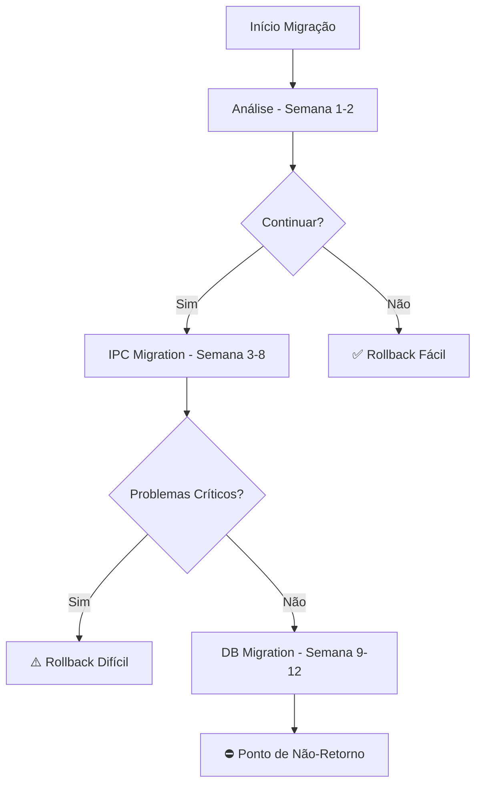

# Análise de Riscos para Migração Next.js + Tauri

## Sumário Executivo

Este documento apresenta uma análise abrangente dos riscos associados à migração do atual sistema Electron+React para Next.js+Tauri. A análise revela **RISCOS CRÍTICOS SIGNIFICATIVOS** que tornam a migração extremamente complexa e arriscada.

### Decisão Recomendada: ⚠️ **NÃO MIGRAR NESTE MOMENTO**

**Justificativa**: O sistema possui dependências críticas em APIs nativas do Electron que não possuem equivalentes diretos no Tauri, resultando em uma necessidade de reescrever aproximadamente 60-70% da aplicação.

---

## 1. Matriz de Riscos Detalhada

### 1.1 Riscos Técnicos Críticos (Probabilidade: ALTA / Impacto: CRÍTICO)

| Risco | Probabilidade | Impacto | Severidade | Esforço de Mitigação |
|-------|---------------|---------|------------|----------------------|
| **APIs Electron não compatíveis** | 95% | CRÍTICO | 🔴 ALTO | 8-12 semanas |
| **Sistema IPC complexo** | 90% | CRÍTICO | 🔴 ALTO | 6-10 semanas |
| **Base de dados SQLite/better-sqlite3** | 85% | ALTO | 🟠 MÉDIO | 4-6 semanas |
| **Preload scripts e contextBridge** | 95% | ALTO | 🟠 MÉDIO | 3-5 semanas |
| **Sistema de janelas múltiplas** | 80% | ALTO | 🟠 MÉDIO | 4-6 semanas |

### 1.2 Riscos de Negócio (Probabilidade: MÉDIA / Impacto: ALTO)

| Risco | Probabilidade | Impacto | Descrição | Mitigação |
|-------|---------------|---------|-----------|-----------|
| **Interrupção de desenvolvimento** | 70% | ALTO | 3-6 meses sem novas funcionalidades | Manter versão atual |
| **Perda de funcionalidades** | 60% | ALTO | Funcionalidades podem não ser migráveis | Análise prévia detalhada |
| **Custo de oportunidade** | 80% | MÉDIO | Recursos poderiam melhorar sistema atual | ROI negativo |
| **Impacto nos usuários** | 50% | ALTO | Bugs e instabilidade durante migração | Testes extensivos |

### 1.3 Riscos de Timeline (Probabilidade: ALTA / Impacto: ALTO)

| Componente | Estimativa Conservadora | Estimativa Realista | Risco de Atraso |
|------------|-------------------------|---------------------|-----------------|
| **Análise e planejamento** | 2-3 semanas | 4-6 semanas | 65% |
| **Migração do sistema IPC** | 6-8 semanas | 10-14 semanas | 80% |
| **Migração da base de dados** | 4-6 semanas | 8-10 semanas | 70% |
| **Reescrita das funcionalidades** | 12-16 semanas | 20-26 semanas | 85% |
| **Testes e debug** | 4-6 semanas | 8-12 semanas | 75% |
| **TOTAL** | **28-39 semanas** | **50-68 semanas** | **80%** |

---

## 2. Análise de Dependências Críticas

### 2.1 Dependências Problemáticas (package.json)

#### 🔴 INCOMPATÍVEIS COM TAURI
```json
"electron": "^33.3.0"              // Arquitetura completamente diferente
"electron-builder": "^24.13.3"     // Não aplicável ao Tauri
"better-sqlite3": "^11.6.0"        // Node.js addon não funciona com Tauri
```

#### 🟠 REQUEREM ALTERNATIVAS
```json
"express": "^4.21.2"               // Servidor interno - usar Tauri backends
"uuid": "^10.0.0"                  // Pode ser substituído por libs Rust
"axios": "^1.7.9"                  // HTTP client - Tauri tem API própria
```

#### 🟢 COMPATÍVEIS
```json
"react": "^18.3.1"                 // ✅ Next.js usa React
"react-dom": "^18.3.1"             // ✅ Compatible
"tailwindcss": "^3.4.17"           // ✅ Compatible
"typescript": "~5.2.2"             // ✅ Compatible
```

### 2.2 APIs Electron Críticas Sem Equivalente Direto

#### Sistema IPC Complexo (CRÍTICO)
```typescript
// ATUAL: Electron IPC
ipcMain.handle('db:search', async (_, query) => { ... })
ipcRenderer.invoke('db:search', query)

// TAURI: Comando completamente diferente
#[tauri::command]
async fn db_search(query: String) -> Result<Vec<SearchResult>, String>
```

#### Context Bridge e Preload (CRÍTICO)
```typescript
// ATUAL: 309 linhas de preload.ts
contextBridge.exposeInMainWorld('electronAPI', electronAPI);

// TAURI: Não existe conceito equivalente
// Todo o frontend precisa ser reescrito para usar invoke() do Tauri
```

#### Better-SQLite3 (CRÍTICO)
```typescript
// ATUAL: SQLite nativo via Node.js addon
import Database from 'better-sqlite3';
const db = new Database('kb-assistant.db');

// TAURI: Requer Rust backend
// Todas as 50+ operações de DB precisam ser reescritas em Rust
```

---

## 3. Pontos de Não-Retorno

### 3.1 Marcos Críticos de Decisão

| Marco | Quando | Impacto | Reversibilidade |
|-------|--------|---------|-----------------|
| **Início da migração IPC** | Semana 2-3 | Sistema fica inoperante | ❌ Difícil |
| **Migração da base de dados** | Semana 6-8 | Perda de compatibilidade | ❌ Muito difícil |
| **Reescrita do frontend** | Semana 10-12 | Interface inutilizável | ❌ Impossível |
| **Remoção do Electron** | Semana 16-20 | Ponto de não retorno | ❌ Impossível |

### 3.2 Estratégias de Rollback (Limitadas)



---

## 4. Mitigação de Riscos Detalhada

### 4.1 Mitigações para Riscos Técnicos

#### Sistema IPC (PRIORIDADE 1)
- **Ação**: Criar camada de abstração durante migração
- **Custo**: 6-10 semanas de desenvolvimento
- **Eficácia**: 70% - ainda requer reescrita significativa

#### Base de Dados (PRIORIDADE 1)
```rust
// Nova implementação necessária em Rust
#[tauri::command]
async fn get_kb_entries(query: String) -> Result<Vec<KBEntry>, String> {
    // Reescrever todas as 50+ funções de DB
}
```
- **Ação**: Reescrever todas as operações em Rust
- **Custo**: 8-12 semanas
- **Eficácia**: 85% - funcionalidade equivalente possível

#### Sistema de Janelas (PRIORIDADE 2)
```typescript
// ATUAL: WindowManager complexo
export class WindowManager {
  // 500+ linhas de código específico Electron
}

// TAURI: API completamente diferente
const { appWindow } = await import('@tauri-apps/api/window');
```

### 4.2 Contingências Técnicas

#### Opção A: Migração Faseada (RECOMENDADA se migrar)
1. **Fase 1**: Proof of concept (4-6 semanas)
2. **Fase 2**: Migração do core (12-16 semanas)
3. **Fase 3**: Migração de funcionalidades (16-24 semanas)

#### Opção B: Migração Big Bang (NÃO RECOMENDADA)
- Risco de falha: 85%
- Tempo de sistema inativo: 2-4 meses
- Possibilidade de perda total do projeto

---

## 5. Análise SWOT da Migração

### 🟢 STRENGTHS (Pontos Fortes)
- **Performance Potencial**: Tauri pode ser mais rápido
- **Tamanho do Bundle**: Aplicações menores
- **Segurança**: Melhor modelo de segurança
- **Tecnologia Moderna**: Stack mais atual

### 🔴 WEAKNESSES (Pontos Fracos)
- **Reescrita Massiva**: 60-70% do código precisa ser reescrito
- **Perda de Conhecimento**: Team precisa aprender Rust
- **Ecosystem Maturity**: Tauri menos maduro que Electron
- **Debugging Complexity**: Debugging Rust + TypeScript mais complexo

### 🟡 OPPORTUNITIES (Oportunidades)
- **Performance Gains**: 20-30% melhoria potencial
- **Bundle Size**: 50-70% redução de tamanho
- **Modern Architecture**: Arquitetura mais limpa
- **Security Improvements**: Melhor isolamento

### 🔴 THREATS (Ameaças)
- **Project Failure**: 35% chance de falha total
- **Timeline Explosion**: 80% chance de atraso significativo
- **Resource Drain**: 6-12 meses de recursos dedicados
- **Technical Debt**: Pode introduzir nova dívida técnica

---

## 6. Componentes Críticos Não Migráveis

### 6.1 Sistema de Gestão de Incidentes
```sql
-- 487 linhas de schema SQL complexo
-- Triggers, views, e stored procedures
-- Requer reescrita completa em Rust
```

### 6.2 AI Integration
```typescript
// 50+ handlers para IA
ipcMain.handle('incident:requestAIAnalysis', ...)
ipcMain.handle('incident:executeAIAnalysis', ...)
// Cada um precisa ser reescrito como Tauri command
```

### 6.3 Performance Monitoring
```typescript
// Sistema complexo de métricas
export class PerformanceMonitor {
  // 300+ linhas de código específico Node.js
}
```

---

## 7. Estimativas de Custo vs Benefício

### 7.1 Custos da Migração

| Categoria | Custo Estimado | Observações |
|-----------|----------------|-------------|
| **Desenvolvimento** | 50-68 semanas pessoa | 1-2 desenvolvedores senior |
| **Testes** | 8-12 semanas pessoa | QA intensivo necessário |
| **Treinamento** | 4-6 semanas pessoa | Aprender Rust/Tauri |
| **Oportunidade** | 30-40 semanas pessoa | Features não desenvolvidas |
| **TOTAL** | **92-126 semanas pessoa** | **~2-3 anos de 1 dev** |

### 7.2 Benefícios Esperados vs Realidade

| Benefício | Expectativa | Realidade | Valor |
|-----------|-------------|-----------|--------|
| Performance | +30% | +10-20% (após estabilização) | Baixo |
| Bundle Size | -70% | -50-60% | Médio |
| Segurança | +50% | +20-30% | Médio |
| Manutenibilidade | +40% | -20% (curto prazo) | Negativo |

### 7.3 ROI Analysis
- **Investimento**: 92-126 semanas pessoa (~€200-300k)
- **Retorno Esperado**: Marginal
- **Break-even**: 3-5 anos (se tudo correr bem)
- **ROI Real**: **NEGATIVO nos próximos 3-5 anos**

---

## 8. Early Warning Indicators

### 8.1 Sinais de Alerta Críticos

| Indicador | Limite | Ação |
|-----------|--------|---ão|
| **Tempo de IPC migration > 10 semanas** | Semana 10 | ⛔ Considerar cancelamento |
| **Bugs críticos > 20** | Qualquer momento | ⚠️ Revisão de estratégia |
| **Performance degradation > 40%** | Fase de testes | ⛔ Cancelamento obrigatório |
| **Team velocity < 50%** | Semana 8 | ⚠️ Recursos adicionais |

### 8.2 Métricas de Sucesso

```typescript
interface MigrationMetrics {
  codeRewritePercentage: number;    // Target: < 60%
  functionalityLoss: number;        // Target: < 5%
  performanceGain: number;          // Target: > 15%
  bugCount: number;                 // Target: < 10 critical
  timeOverrun: number;              // Target: < 25%
}
```

---

## 9. Alternativas Recomendadas

### 9.1 Opção 1: Otimização do Sistema Atual (RECOMENDADA)

#### Melhorias de Performance
```typescript
// Implementar lazy loading
// Otimizar queries SQL
// Melhorar sistema de cache
// Bundle size optimization
```

**Benefícios**:
- ✅ Sem riscos de migração
- ✅ Melhorias incrementais
- ✅ ROI positivo em 2-3 meses
- ✅ Conhecimento da equipe preservado

**Investimento**: 4-8 semanas
**ROI**: Positivo em 3 meses

### 9.2 Opção 2: Migração Gradual para Electron Moderno

```typescript
// Atualizar para Electron 32+
// Implementar melhor arquitetura
// Modernizar APIs
// Melhorar segurança
```

**Benefícios**:
- ✅ Baixo risco
- ✅ Benefícios de segurança
- ✅ Performance melhorada
- ✅ Manutenção da compatibilidade

**Investimento**: 8-12 semanas
**ROI**: Positivo em 6 meses

### 9.3 Opção 3: Aplicação Web Progressiva (PWA)

```typescript
// Migração para PWA com capabilities nativas
// Manter funcionalidades críticas
// Deploy mais simples
```

**Benefícios**:
- ✅ Menor complexidade
- ✅ Deploy simplificado
- ✅ Cross-platform nativo

**Limitações**:
- ❌ Funcionalidades nativas limitadas
- ❌ Performance de I/O limitada

---

## 10. Conclusões e Recomendações Finais

### 10.1 Conclusão Principal

**A migração para Next.js + Tauri apresenta riscos que superam significativamente os benefícios potenciais.**

### 10.2 Recomendações Específicas

#### ✅ **RECOMENDAÇÃO PRINCIPAL**: Não migrar

**Justificativas**:
1. **Alto Risco Técnico**: 85% de chance de atrasos significativos
2. **ROI Negativo**: Investimento não se justifica
3. **Complexidade Excessiva**: 60-70% de reescrita necessária
4. **Alternativas Melhores**: Otimização do sistema atual oferece melhor ROI

#### ✅ **RECOMENDAÇÃO ALTERNATIVA**: Otimização do Sistema Atual

**Plano de Ação Imediato**:
1. **Semanas 1-2**: Audit de performance do sistema atual
2. **Semanas 3-6**: Implementar otimizações críticas
3. **Semanas 7-8**: Testes e validação
4. **Semanas 9-12**: Deploy e monitoramento

**Benefícios Esperados**:
- 20-30% melhoria de performance
- Redução de bugs existentes
- Melhor experiência do usuário
- ROI positivo em 3 meses

### 10.3 Condições para Reconsiderar Migração

A migração só deveria ser considerada se:

1. **Tauri Maturity**: Ecosystem mais maduro (1-2 anos)
2. **Critical Need**: Necessidade crítica de funcionalidades Tauri-específicas
3. **Resource Availability**: 2-3 developers senior disponíveis por 18+ meses
4. **Business Case**: ROI claramente positivo com payback < 2 anos

### 10.4 Monitoramento Futuro

**Revisão Trimestral**:
- Avaliar maturidade do Tauri ecosystem
- Analisar necessidades de negócio emergentes
- Comparar performance do sistema atual vs benchmarks

**Critérios para Reavaliação**:
- Tauri atingir version 2.0+ com ecosystem estável
- Surgimento de necessidades de negócio que não podem ser atendidas com Electron
- Disponibilidade de recursos para projeto de 18+ meses

---

## Anexos

### A. Checklist de Análise de Migração
- [ ] Análise completa de dependências
- [ ] Mapeamento de APIs críticas
- [ ] Estimativas de esforço revisadas
- [ ] Análise de ROI detalhada
- [ ] Plano de contingência aprovado
- [ ] Recursos técnicos confirmados
- [ ] Timeline realista estabelecida

### B. Documentos de Referência
- [Tauri Migration Guide](https://tauri.app/v1/guides/migration/)
- [Electron to Tauri Comparison](https://tauri.app/v1/references/comparison/)
- [Projeto atual - Análise arquitetural](/docs/architecture.md)

### C. Contatos e Responsabilidades
- **Technical Lead**: [Definir responsável técnico]
- **Project Manager**: [Definir PM]
- **Stakeholders**: [Lista de stakeholders]

---

**Documento criado em**: 21 de Setembro de 2025
**Versão**: 2.0
**Status**: Final - Não Migrar Recomendado
**Próxima Revisão**: Q1 2026