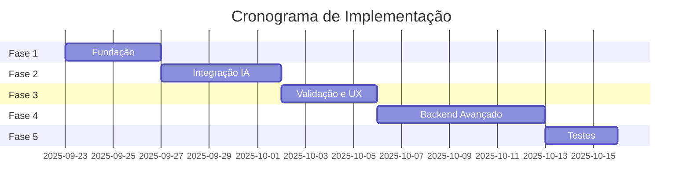

# 📋 PLANO DETALHADO DE IMPLEMENTAÇÃO
## Sistema de Gestão de Incidentes com IA

**Data:** 23/09/2025
**Status:** Em Planejamento
**Versão:** 1.0

---

## 📊 ANÁLISE DO ESTADO ATUAL

### ✅ **Componentes Já Implementados**

1. **Frontend (React no HTML)**
   - ✅ `CreateIncidentModal` (linha 676) - Modal básico de criação
   - ✅ `SettingsModal` (linha 507) - Modal de configurações com API keys
   - ✅ `SettingsDropdown` (linha 36) - Menu de configurações no header
   - ✅ Sistema de tabs de navegação
   - ✅ Dashboard com métricas
   - ✅ Lista de incidentes
   - ✅ LocalStorage para persistência

2. **Backend**
   - ✅ `simple-backend.js` - Servidor Node.js básico
   - ✅ API REST endpoints básicos
   - ✅ Integração com SQLite

3. **Configurações**
   - ✅ Provider LLM selector (OpenAI, Azure, Claude, Gemini)
   - ✅ API Key input e armazenamento
   - ✅ Persistência em localStorage

### ⚠️ **Componentes Parcialmente Implementados**

1. **CreateIncidentModal**
   - ✅ Campos básicos (título, descrição, prioridade)
   - ❌ Falta: Área técnica (obrigatória)
   - ❌ Falta: Área de negócio (opcional)
   - ❌ Falta: Campos dinâmicos por área técnica

2. **SettingsModal**
   - ✅ Configuração de API
   - ❌ Falta: Toggle IA ON/OFF
   - ❌ Falta: Configuração de validação
   - ❌ Falta: Pesos de relevância

### ❌ **Componentes Não Implementados**

1. **Serviços de IA**
   - DataSanitizer (sanitização)
   - LLMService (integração APIs)
   - EmbeddingService (vetorização)
   - EnrichmentService (enriquecimento)

2. **Telas**
   - ValidationScreen (confirmação)
   - ComparisonPanel (diff visual)

3. **Backend Avançado**
   - PostgreSQL + pgvector
   - Cache Redis
   - Busca vetorial
   - Migração de dados

---

## 🎯 TAREFAS DETALHADAS POR FASE

### **FASE 1: FUNDAÇÃO (3-4 dias)**

#### **1.1 Atualizar CreateIncidentModal**
**Arquivo:** `/mnt/c/mainframe-ai-assistant/Accenture-Mainframe-AI-Assistant-Integrated.html`
**Linha:** 676-906

**Tarefas:**
- [ ] Adicionar campo `technical_area` (dropdown obrigatório)
- [ ] Adicionar campo `business_area` (dropdown opcional)
- [ ] Implementar campos dinâmicos baseados em `technical_area`
- [ ] Adicionar validação de campos obrigatórios

**Código a adicionar:**
```javascript
// Após linha 678 (no estado inicial)
technical_area: '', // OBRIGATÓRIO
business_area: '',  // OPCIONAL - sistema infere
mainframe_job: '',  // Campos específicos Mainframe
mainframe_program: '',
mainframe_abend: '',
```

#### **1.2 Implementar Lógica de Inferência**
**Novo arquivo:** `/mnt/c/mainframe-ai-assistant/scripts/inference-service.js`

**Tarefas:**
- [ ] Criar função `inferBusinessArea(incident)`
- [ ] Implementar regras de detecção por keywords
- [ ] Integrar com CreateIncidentModal

#### **1.3 Atualizar SettingsModal**
**Arquivo:** `/mnt/c/mainframe-ai-assistant/Accenture-Mainframe-AI-Assistant-Integrated.html`
**Linha:** 507-673

**Tarefas:**
- [ ] Adicionar toggle "Ativar IA" (checkbox)
- [ ] Adicionar toggle "Validar antes de salvar"
- [ ] Adicionar configuração de pesos de relevância
- [ ] Salvar em localStorage

---

### **FASE 2: INTEGRAÇÃO IA (4-5 dias)**

#### **2.1 Criar Serviço de Sanitização**
**Novo arquivo:** `/mnt/c/mainframe-ai-assistant/scripts/data-sanitizer.js`

**Tarefas:**
- [ ] Implementar patterns de dados sensíveis (CPF, conta, etc.)
- [ ] Criar método `sanitize(data)`
- [ ] Criar método `restore(data, mapping)`
- [ ] Adicionar logs de auditoria

#### **2.2 Integrar APIs LLM**
**Novo arquivo:** `/mnt/c/mainframe-ai-assistant/scripts/llm-service.js`

**Tarefas:**
- [ ] Implementar integração Gemini
- [ ] Implementar integração OpenAI
- [ ] Implementar integração Azure OpenAI
- [ ] Implementar integração GitHub Copilot
- [ ] Adicionar rate limiting e cache

#### **2.3 Criar Serviço de Enriquecimento**
**Novo arquivo:** `/mnt/c/mainframe-ai-assistant/scripts/enrichment-service.js`

**Tarefas:**
- [ ] Integrar sanitização + LLM + restauração
- [ ] Implementar prompt engineering
- [ ] Adicionar metadados de processamento

---

### **FASE 3: VALIDAÇÃO E UX (3-4 dias)**

#### **3.1 Criar Tela de Validação**
**Novo componente no HTML principal**

**Tarefas:**
- [ ] Criar `ValidationScreen` component
- [ ] Implementar comparação visual (antes/depois)
- [ ] Adicionar campos editáveis
- [ ] Implementar lógica de confirmação

#### **3.2 Integrar Fluxo Completo**
**Atualizar CreateIncidentModal**

**Tarefas:**
- [ ] Adicionar estados de processamento
- [ ] Integrar com ValidationScreen
- [ ] Implementar fluxo condicional (com/sem validação)
- [ ] Adicionar feedback visual

#### **3.3 Melhorias UX**
**Arquivo principal HTML**

**Tarefas:**
- [ ] Remover redundância de criação (3 locais → 1)
- [ ] Renomear "Mostrar Tratamento" → "🤖 Analisar com IA"
- [ ] Adicionar indicadores visuais de IA
- [ ] Melhorar feedback de processamento

---

### **FASE 4: BACKEND AVANÇADO (5-7 dias)**

#### **4.1 Setup PostgreSQL**
**Novos arquivos em `/mnt/c/mainframe-ai-assistant/scripts/database/`**

**Tarefas:**
- [ ] Criar schema PostgreSQL com pgvector
- [ ] Criar docker-compose.yml
- [ ] Implementar conexão no backend
- [ ] Criar índices otimizados

#### **4.2 Migração de Dados**
**Novo arquivo:** `/mnt/c/mainframe-ai-assistant/scripts/migrate-to-postgresql.js`

**Tarefas:**
- [ ] Criar script de exportação SQLite
- [ ] Implementar enriquecimento durante migração
- [ ] Criar validação de integridade
- [ ] Implementar rollback

#### **4.3 Busca Vetorial**
**Novo arquivo:** `/mnt/c/mainframe-ai-assistant/scripts/vector-search.js`

**Tarefas:**
- [ ] Implementar geração de embeddings
- [ ] Criar busca por similaridade
- [ ] Adicionar cache de resultados
- [ ] Implementar fallback para busca tradicional

---

### **FASE 5: TESTES E OTIMIZAÇÃO (2-3 dias)**

#### **5.1 Testes de Integração**
**Novo arquivo:** `/mnt/c/mainframe-ai-assistant/tests/integration.test.js`

**Tarefas:**
- [ ] Testar fluxo completo de criação
- [ ] Testar sanitização/restauração
- [ ] Testar integração com LLMs
- [ ] Testar busca com/sem IA

#### **5.2 Otimização de Performance**
**Tarefas:**
- [ ] Implementar cache Redis
- [ ] Otimizar queries PostgreSQL
- [ ] Adicionar paginação
- [ ] Implementar lazy loading

#### **5.3 Documentação**
**Tarefas:**
- [ ] Criar README de instalação
- [ ] Documentar APIs
- [ ] Criar guia de configuração
- [ ] Adicionar exemplos de uso

---

## 📈 CRONOGRAMA ESTIMADO



**Tempo Total Estimado:** 23 dias úteis (~1 mês)

---

## 🚀 QUICK WINS (Implementar Primeiro)

1. **Adicionar campos de contexto no CreateIncidentModal** (2h)
2. **Toggle IA ON/OFF no Settings** (1h)
3. **Renomear "Mostrar Tratamento"** (30min)
4. **Inferência básica de área de negócio** (2h)

---

## ⚠️ RISCOS E MITIGAÇÕES

| Risco | Probabilidade | Impacto | Mitigação |
|-------|---------------|---------|-----------|
| Limites de API LLM | Alta | Médio | Implementar cache agressivo |
| Migração de dados | Média | Alto | Criar backups e rollback |
| Performance pgvector | Baixa | Médio | Fallback para busca tradicional |
| Dados sensíveis expostos | Baixa | Alto | Sanitização rigorosa |

---

## 📦 DEPENDÊNCIAS TÉCNICAS

### **Novas Bibliotecas Necessárias:**
```json
{
  "dependencies": {
    "pg": "^8.11.0",
    "pgvector": "^0.1.0",
    "redis": "^4.6.0",
    "@xenova/transformers": "^2.6.0",
    "axios": "^1.5.0"
  }
}
```

### **Infraestrutura:**
- PostgreSQL 15+ com pgvector
- Redis (opcional para cache)
- Docker (para desenvolvimento)

---

## ✅ CRITÉRIOS DE SUCESSO

1. **Funcional:**
   - [ ] Sistema funciona com e sem IA
   - [ ] Área técnica obrigatória implementada
   - [ ] Área negócio inferida corretamente
   - [ ] Dados sensíveis protegidos

2. **Performance:**
   - [ ] Busca < 200ms (com vetores)
   - [ ] Análise LLM < 3s
   - [ ] Interface responsiva

3. **Usabilidade:**
   - [ ] Fluxo intuitivo
   - [ ] Validação clara
   - [ ] Feedback adequado

---

## 📝 NOTAS DE IMPLEMENTAÇÃO

### **Prioridades:**
1. Manter compatibilidade com código existente
2. Reutilizar componentes quando possível
3. Implementar fallbacks para todas funcionalidades IA
4. Documentar mudanças incrementalmente

### **Padrões de Código:**
- Usar async/await para operações assíncronas
- Implementar tratamento de erros robusto
- Adicionar logs para debugging
- Seguir convenções existentes do projeto

---

**Última Atualização:** 23/09/2025
**Responsável:** Claude AI Assistant
**Status:** Pronto para Implementação