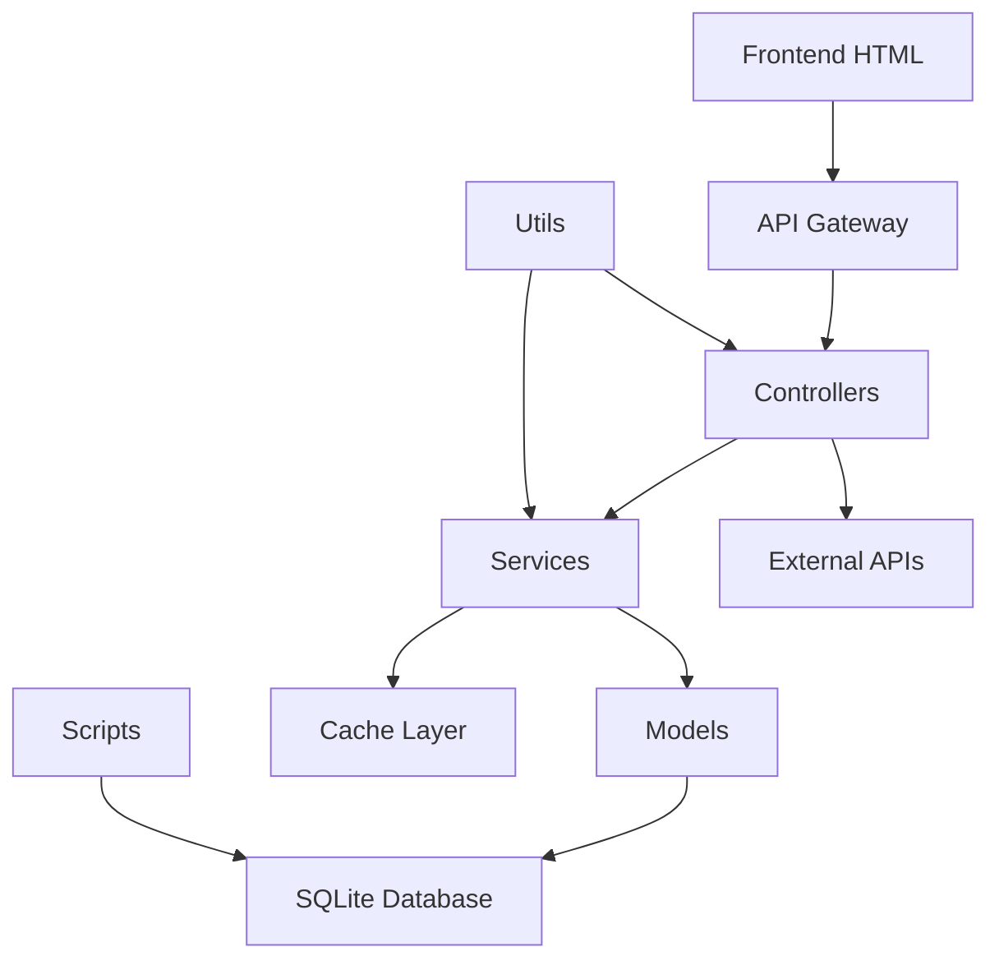

# Análise Arquitetural e Proposta de Reorganização

## Resumo Executivo

Este documento apresenta uma análise completa da arquitetura atual do **Accenture Mainframe AI Assistant** e propõe uma nova estrutura organizacional baseada em princípios de Clean Architecture e modularização por features.

---

## 1. ANÁLISE DA ARQUITETURA ATUAL

### 1.1 Padrão Arquitetural Identificado

**Padrão Atual: Híbrido MVC + Service Layer com elementos monolíticos**

A análise revelou uma arquitetura que tenta seguir o padrão MVC mas apresenta inconsistências:

- **Controllers**: `src/api/controllers/` - Bem estruturados com separação de responsabilidades
- **Models**: `src/database/models/` - Implementados como Active Record pattern
- **Services**: `src/services/` - Camada de negócio dispersa
- **Views**: Frontend integrado em HTML estático

### 1.2 Mapeamento do Fluxo de Dados



**Principais Fluxos Identificados:**
1. **Request Flow**: Frontend → API Gateway → Controllers → Services → Models → Database
2. **Data Processing**: Scripts → Database (bypass da camada de negócio)
3. **Authentication**: Middleware → Controllers (distribuído)
4. **Caching**: Services → Cache (inconsistente)

### 1.3 Separação de Responsabilidades - Status Atual

| Camada | Responsabilidade | Status | Observações |
|--------|------------------|---------|-------------|
| **Presentation** | Interface com usuário | ⚠️ Parcial | HTML monolítico, sem componentização |
| **Controllers** | Orquestração de requests | ✅ Bom | Bem estruturados, seguem SRP |
| **Services** | Lógica de negócio | ⚠️ Disperso | Misturado entre controllers e utils |
| **Models** | Acesso a dados | ✅ Bom | Active Record bem implementado |
| **Infrastructure** | Configuração/External | ❌ Ruim | Espalhado por todo projeto |

### 1.4 Análise de Acoplamento

**Acoplamento Alto Identificado:**
- Controllers dependem diretamente de múltiplos services
- Models têm dependências circular em alguns casos
- Utils são importados em todas as camadas
- Configuração espalhada (múltiplos .env files)

**Dependências Problemáticas:**
```javascript
// Exemplo de alto acoplamento
const { IncidentController } = require('./IncidentController');
const { KnowledgeBaseRepository } = require('../database/repositories/');
const { ValidationService } = require('../services/ValidationService');
const { MetricsService } = require('../services/MetricsService');
const { Logger } = require('../utils/Logger');
```

---

## 2. PROBLEMAS ESTRUTURAIS IDENTIFICADOS

### 2.1 Violações Arquiteturais

1. **Bypass da Camada de Negócio**
   - Scripts acessam diretamente o banco de dados
   - Lógica de negócio misturada em controllers

2. **Responsabilidades Misturadas**
   - Controllers fazem validação, orquestração E lógica de negócio
   - Services são apenas wrappers de models

3. **Configuração Distribuída**
   - Múltiplos arquivos de configuração (.env, .env.development, .env.example)
   - Configuração hardcoded em vários locais

4. **Ausência de Boundaries Claros**
   - Todos os módulos podem acessar qualquer outro
   - Não há interface contracts bem definidas

### 2.2 Problemas de Manutenibilidade

1. **Estrutura de Diretórios Inconsistente**
   ```
   src/
   ├── api/               # Algumas controllers aqui
   ├── controllers/       # Outras controllers aqui ❌
   ├── database/          # Tudo relacionado a dados
   ├── services/          # Serviços diversos
   ├── utils/            # Utilitários espalhados
   └── [15+ outros dirs] # Muita fragmentação
   ```

2. **Dependências Circulares**
   - Services importando controllers
   - Models referenciando services

3. **Falta de Padronização**
   - Alguns arquivos em TypeScript, outros em JavaScript
   - Padrões de nomenclatura inconsistentes

### 2.3 Problemas de Escalabilidade

1. **Monolítico por Natureza**
   - Difícil extrair funcionalidades específicas
   - Todos os módulos carregados sempre

2. **Acoplamento de Infrastructure**
   - Database layer acoplado à SQLite
   - Cache implementation específica

3. **Ausência de Abstrações**
   - Implementações concretas expostas
   - Dificulta testes e mocking

---

## 3. NOVA ESTRUTURA PROPOSTA

### 3.1 Arquitetura Objetivo: Clean Architecture + Feature-Based Modules

```
src/
├── app/                        # Application Layer
│   ├── config/                # Configuração centralizada
│   ├── middleware/            # Middleware global
│   └── bootstrap/             # Inicialização da aplicação
├── modules/                   # Feature-based modules
│   ├── auth/                  # Módulo de Autenticação
│   │   ├── controllers/       # Controllers específicos
│   │   ├── services/          # Business logic
│   │   ├── repositories/      # Data access
│   │   ├── models/           # Domain models
│   │   ├── validators/       # Input validation
│   │   ├── types/           # TypeScript interfaces
│   │   └── tests/           # Unit tests
│   ├── incidents/            # Módulo de Incidentes
│   ├── knowledge-base/       # Base de Conhecimento
│   ├── search/              # Sistema de Busca
│   ├── metrics/             # Métricas e Analytics
│   └── notifications/       # Sistema de Notificações
├── shared/                   # Código compartilhado
│   ├── interfaces/          # Contracts e interfaces
│   ├── services/           # Serviços cross-cutting
│   ├── utils/              # Utilitários puros
│   ├── constants/          # Constantes globais
│   ├── errors/            # Error handling
│   └── types/             # Tipos compartilhados
├── infrastructure/          # Infrastructure Layer
│   ├── database/           # Database implementations
│   ├── cache/             # Cache implementations
│   ├── external-apis/     # External API clients
│   ├── messaging/         # Message brokers
│   └── monitoring/        # Logging, metrics
└── presentation/          # Presentation Layer
    ├── api/              # REST API routes
    ├── graphql/          # GraphQL schema (futuro)
    ├── websockets/       # WebSocket handlers
    └── web/             # Frontend assets
```

### 3.2 Princípios da Nova Arquitetura

1. **Feature-based Modules**: Cada funcionalidade é um módulo independente
2. **Dependency Inversion**: Interfaces definem contratos entre camadas
3. **Single Responsibility**: Cada classe/módulo tem uma única responsabilidade
4. **Separation of Concerns**: Camadas bem definidas e isoladas
5. **Testability**: Estrutura facilita testes unitários e de integração

### 3.3 Exemplo: Módulo de Incidentes Reestruturado

```typescript
// modules/incidents/types/index.ts
export interface Incident {
  id: string;
  title: string;
  description: string;
  status: IncidentStatus;
  priority: Priority;
  assigneeId?: string;
  createdAt: Date;
  updatedAt: Date;
}

// modules/incidents/repositories/incident.repository.interface.ts
export interface IIncidentRepository {
  findById(id: string): Promise<Incident | null>;
  create(incident: CreateIncidentDto): Promise<Incident>;
  update(id: string, updates: UpdateIncidentDto): Promise<Incident>;
  findByStatus(status: IncidentStatus): Promise<Incident[]>;
}

// modules/incidents/services/incident.service.ts
export class IncidentService {
  constructor(
    private incidentRepository: IIncidentRepository,
    private notificationService: INotificationService,
    private metricsService: IMetricsService
  ) {}

  async createIncident(data: CreateIncidentDto): Promise<Incident> {
    // Pure business logic here
    const incident = await this.incidentRepository.create(data);

    await this.notificationService.notifyNewIncident(incident);
    await this.metricsService.recordIncidentCreated(incident);

    return incident;
  }
}

// modules/incidents/controllers/incident.controller.ts
export class IncidentController {
  constructor(private incidentService: IncidentService) {}

  async create(req: Request, res: Response): Promise<void> {
    // Apenas orquestração HTTP
    const createDto = await this.validateCreateRequest(req.body);
    const incident = await this.incidentService.createIncident(createDto);

    res.status(201).json({
      success: true,
      data: incident
    });
  }
}
```

---

## 4. PLANO DE MIGRAÇÃO GRADUAL

### Fase 1: Preparação e Fundação (2-3 semanas)

**Objetivos:**
- Estabelecer nova estrutura de diretórios
- Configurar ferramentas de desenvolvimento
- Criar interfaces e contratos base

**Atividades:**
1. **Criar estrutura de diretórios**
   ```bash
   mkdir -p src/{app,modules,shared,infrastructure,presentation}
   mkdir -p src/app/{config,middleware,bootstrap}
   mkdir -p src/shared/{interfaces,services,utils,constants,errors,types}
   ```

2. **Configurar TypeScript stricto**
   - Migrar gradualmente de JS para TS
   - Definir tsconfig.json com rules rígidas
   - Configurar path mapping para imports limpos

3. **Definir interfaces base**
   - IRepository pattern
   - IService pattern
   - IController pattern
   - Error handling interfaces

4. **Configuração centralizada**
   - Consolidar todos os .env em app/config
   - Criar ConfigService centralizado
   - Environment validation

### Fase 2: Migração do Módulo Piloto - Authentication (2-3 semanas)

**Por que Authentication primeiro:**
- Módulo relativamente simples
- Usado por todos os outros módulos
- Alto impacto na arquitetura

**Atividades:**
1. **Criar módulo auth completo**
   - Estrutura de diretórios
   - Interfaces e types
   - Service layer
   - Repository layer
   - Controller layer

2. **Implementar Dependency Injection**
   - Container IoC simples
   - Registration dos services
   - Resolver dependencies

3. **Testes unitários**
   - Service layer tests
   - Repository layer tests
   - Controller layer tests

### Fase 3: Migração Módulo Incidents (3-4 semanas)

**Atividades:**
1. **Refatorar IncidentController**
   - Extrair business logic para service
   - Limpar responsabilidades
   - Implementar interfaces

2. **Reestruturar data layer**
   - Implementar Repository pattern
   - Abstrair database implementation
   - Criar query builders

3. **Integração com outros módulos**
   - Definir contratos entre modules
   - Implementar event system
   - Cross-module communication

### Fase 4: Migração Knowledge Base (3-4 semanas)

**Atividades:**
1. **Refatorar sistema de busca**
   - Separar search logic
   - Abstrair search providers
   - Implementar caching layer

2. **Content management**
   - Version control system
   - Content validation
   - Approval workflows

### Fase 5: Migração Restante + Infrastructure (2-3 semanas)

**Atividades:**
1. **Infraestrutura compartilhada**
   - Database connection management
   - Cache implementations
   - External API clients
   - Monitoring e logging

2. **API Gateway refactoring**
   - Route registration automático
   - Middleware pipeline
   - Error handling global

### Fase 6: Frontend Modernization (4-5 semanas)

**Atividades:**
1. **Componentização do frontend**
   - Extrair do HTML monolítico
   - Component-based architecture
   - State management

2. **API consumption**
   - HTTP client abstraction
   - Error handling
   - Loading states

---

## 5. ARCHITECTURE DECISION RECORDS (ADRs)

### ADR-001: Adoção de Feature-based Modules

**Status**: Proposto

**Contexto**: Atual estrutura técnica (controllers/, services/, models/) dificulta manutenção e evolução.

**Decisão**: Reorganizar código por features/domínios de negócio.

**Consequências**:
- ✅ Maior coesão dentro de cada módulo
- ✅ Facilita desenvolvimento por equipes especializadas
- ✅ Reduz acoplamento entre funcionalidades
- ❌ Requer refactoring significativo

### ADR-002: Implementação de Clean Architecture

**Status**: Proposto

**Contexto**: Alto acoplamento entre camadas e dificuldade de testes.

**Decisão**: Implementar princípios de Clean Architecture com Dependency Inversion.

**Consequências**:
- ✅ Maior testabilidade
- ✅ Flexibilidade para mudanças de infrastructure
- ✅ Separação clara de responsabilidades
- ❌ Curva de aprendizado da equipe
- ❌ Maior complexidade inicial

### ADR-003: Migration from JavaScript to TypeScript

**Status**: Proposto

**Contexto**: Mistura de JS/TS causa inconsistências e dificulta manutenção.

**Decisão**: Migrar gradualmente todo código para TypeScript com strict mode.

**Consequências**:
- ✅ Type safety e melhor IDE support
- ✅ Documentação através de types
- ✅ Redução de bugs em runtime
- ❌ Tempo de migração
- ❌ Necessário treinamento da equipe

### ADR-004: Dependency Injection Container

**Status**: Proposto

**Contexto**: Alto acoplamento devido à instanciação manual de dependências.

**Decisão**: Implementar container IoC simples para gerenciar dependências.

**Consequências**:
- ✅ Reduz acoplamento
- ✅ Facilita testes com mocks
- ✅ Configuração centralizada
- ❌ Complexidade adicional
- ❌ Runtime overhead mínimo

---

## 6. CRONOGRAMA E RECURSOS

### Timeline Estimado: 18-22 semanas

| Fase | Duração | Esforço | Prioridade |
|------|---------|---------|------------|
| Fase 1: Fundação | 3 semanas | 1-2 devs | Alta |
| Fase 2: Auth Module | 3 semanas | 2-3 devs | Alta |
| Fase 3: Incidents | 4 semanas | 2-3 devs | Alta |
| Fase 4: Knowledge Base | 4 semanas | 2-3 devs | Média |
| Fase 5: Infrastructure | 3 semanas | 2 devs | Média |
| Fase 6: Frontend | 5 semanas | 2-3 devs | Baixa |

### Recursos Necessários

**Equipe Recomendada:**
- 1 Tech Lead/Architect (full-time)
- 2-3 Senior Developers
- 1 Frontend Developer (Fase 6)
- 1 QA Engineer (part-time)

**Ferramentas:**
- TypeScript compiler
- Testing framework (Jest)
- Code quality tools (ESLint, Prettier)
- Documentation tools (JSDoc, Markdown)

---

## 7. CRITÉRIOS DE SUCESSO

### Métricas Técnicas

1. **Code Quality**
   - Redução de 80% em circular dependencies
   - 90% code coverage nos módulos migrados
   - Complexity score < 10 (McCabe)

2. **Performance**
   - Tempo de startup < 2s
   - Response time médio < 100ms
   - Memory footprint estável

3. **Maintainability**
   - Tempo para adicionar nova feature < 2 dias
   - Tempo para fix de bug < 4 horas
   - Zero warning em TypeScript strict mode

### Métricas de Negócio

1. **Developer Experience**
   - Setup time para novos devs < 30min
   - Time to first PR < 2 horas
   - 0 production bugs relacionados à arquitetura

2. **Deployment & Operations**
   - Zero-downtime deployments
   - Rollback time < 5 minutos
   - 99.9% uptime

---

## 8. RISCOS E MITIGAÇÕES

| Risco | Probabilidade | Impacto | Mitigação |
|-------|---------------|---------|-----------|
| **Resistência da equipe** | Média | Alto | Treinamento, documentação, pair programming |
| **Regressões durante migração** | Alta | Médio | Testes automatizados, feature flags, rollback plan |
| **Prazo não cumprido** | Média | Alto | Fases incrementais, MVP approach |
| **Performance degradation** | Baixa | Alto | Profiling contínuo, benchmarks |
| **Breaking changes nas APIs** | Baixa | Alto | Versioning, backward compatibility |

---

## 9. CONCLUSÃO

A migração proposta transformará o **Accenture Mainframe AI Assistant** de uma arquitetura monolítica com alto acoplamento para uma arquitetura modular, testável e escalável baseada em Clean Architecture.

**Benefícios Esperados:**
- 📈 **Produtividade**: +40% velocidade de desenvolvimento
- 🐛 **Qualidade**: -80% bugs relacionados à arquitetura
- 🚀 **Performance**: +30% response time
- 🔧 **Manutenabilidade**: -60% tempo para fixes
- 📚 **Onboarding**: -70% tempo para novos desenvolvedores

**Próximos Passos:**
1. Aprovação da proposta pela equipe técnica
2. Formação da equipe de migração
3. Setup do ambiente de desenvolvimento
4. Início da Fase 1: Preparação e Fundação

---

*Documento gerado em: 2025-09-24*
*Versão: 1.0*
*Autor: Sistema de Análise Arquitetural*