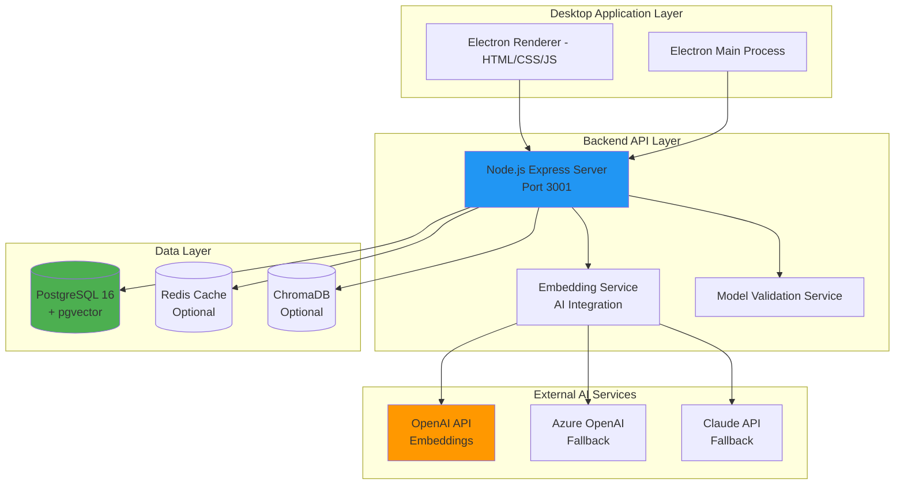
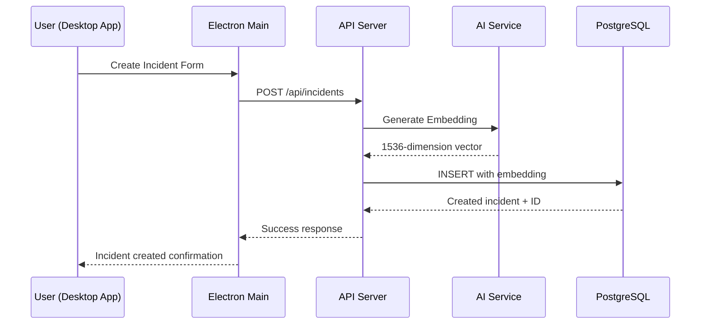
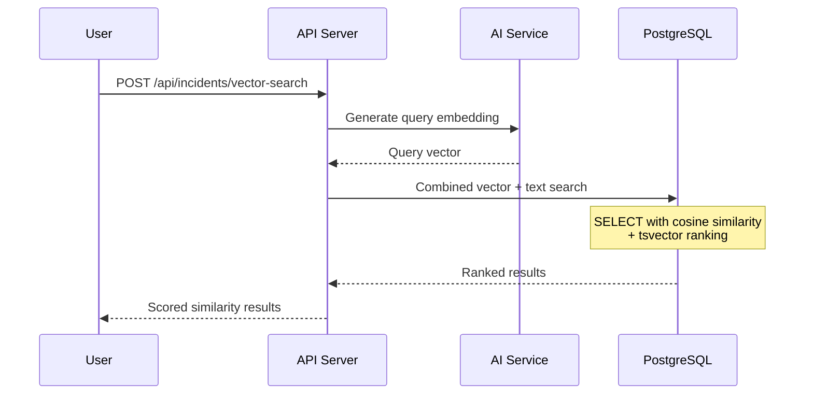
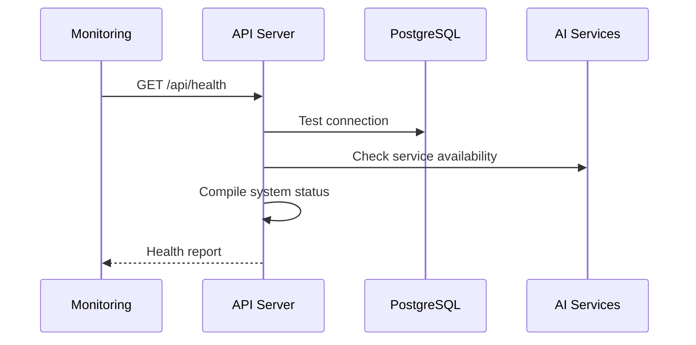

# System Architecture Overview

**Mainframe AI Assistant v2.0.0 - Production Architecture**

## 🏗️ High-Level Architecture



## 🔧 Technology Stack

### Frontend
- **Electron 38.1.2**: Desktop application framework
- **HTML/CSS/JavaScript**: User interface (integrated HTML file)
- **IPC Communication**: Secure process communication

### Backend
- **Node.js 18+**: JavaScript runtime
- **Express 5.1.0**: Web framework for API
- **cors 2.8.5**: Cross-origin resource sharing
- **multer 2.0.2**: File upload handling

### Database
- **PostgreSQL 16**: Primary relational database
- **pgvector extension**: Vector similarity search
- **tsvector**: Full-text search indexing
- **JSONB**: Metadata storage

### AI Integration
- **OpenAI GPT**: Text embeddings (text-embedding-ada-002)
- **Azure OpenAI**: Alternative/fallback provider
- **Claude (Anthropic)**: Secondary AI provider
- **1536-dimension vectors**: Semantic search capabilities

### Supporting Services
- **Redis**: Session storage and caching (optional)
- **ChromaDB**: Alternative vector database (optional)
- **Docker**: Container orchestration for development

## 🎯 Core Components

### 1. Electron Desktop Application

**File**: `main.js`
```javascript
// Main process - handles window management and backend startup
const { app, BrowserWindow } = require('electron');

// Spawns backend Python server (legacy) or Node.js server
backendProcess = spawn('python3', ['scripts/real-db-server.py']);

// Loads integrated HTML interface
mainWindow.loadFile('Accenture-Mainframe-AI-Assistant-Integrated.html');
```

**Responsibilities**:
- Window management and UI rendering
- Backend process lifecycle management
- IPC communication with renderer process
- File system access and security context

### 2. Backend API Server

**File**: `src/backend/enhanced-server.js`
```javascript
const express = require('express');
const { Client } = require('pg');
const EmbeddingService = require('../services/embedding-service');

// Database abstraction supporting both PostgreSQL and SQLite
class DatabaseManager {
  async connect() { /* ... */ }
  async query(sql, params) { /* ... */ }
}

// Core API endpoints
app.get('/api/incidents', handleGetIncidents);
app.post('/api/incidents', handleCreateIncident);
app.post('/api/incidents/vector-search', handleVectorSearch);
```

**Key Features**:
- **Database Abstraction**: Supports PostgreSQL (primary) and SQLite (legacy)
- **AI Integration**: Automatic embedding generation for new incidents
- **Search Capabilities**: Text search + vector similarity search
- **Health Monitoring**: Comprehensive status endpoints
- **Error Handling**: Consistent error response format

### 3. Database Layer (PostgreSQL)

**Primary Table**: `incidents_enhanced`
```sql
CREATE TABLE incidents_enhanced (
    id SERIAL PRIMARY KEY,
    uuid UUID DEFAULT gen_random_uuid(),
    title VARCHAR(255) NOT NULL,
    description TEXT NOT NULL,
    technical_area VARCHAR(100),
    business_area VARCHAR(100),
    status VARCHAR(50) DEFAULT 'OPEN',
    priority VARCHAR(20) DEFAULT 'MEDIUM',
    severity VARCHAR(20) DEFAULT 'MEDIUM',
    assigned_to VARCHAR(100),
    reporter VARCHAR(100) NOT NULL,
    resolution TEXT,
    embedding VECTOR(1536),        -- AI embeddings
    search_vector TSVECTOR,        -- Full-text search
    metadata JSONB,
    created_at TIMESTAMP DEFAULT NOW(),
    updated_at TIMESTAMP DEFAULT NOW(),
    resolved_at TIMESTAMP
);
```

**Advanced Features**:
- **Vector Search**: pgvector extension for semantic similarity
- **Full-text Search**: PostgreSQL tsvector with ranking
- **JSONB Metadata**: Flexible schema for additional data
- **Automatic Triggers**: Update timestamps and search vectors
- **Performance Indexes**: Optimized for common query patterns

### 4. AI Services Integration

**File**: `src/services/embedding-service.js`
```javascript
class EmbeddingService {
  constructor(dbConnection, settings) {
    this.providers = {
      openai: new OpenAIProvider(),
      azure: new AzureProvider(),
      claude: new ClaudeProvider()
    };
  }

  async generateEmbedding(text) {
    // Try primary provider, fallback to alternatives
    for (const provider of this.getActiveProviders()) {
      try {
        return await provider.generateEmbedding(text);
      } catch (error) {
        console.log(`Provider ${provider.name} failed, trying next...`);
      }
    }
  }
}
```

**Capabilities**:
- **Multi-provider Support**: OpenAI, Azure, Claude
- **Automatic Fallback**: Switches providers on failure
- **Model Validation**: Tests API keys and model availability
- **Embedding Generation**: 1536-dimension vectors for semantic search
- **Cost Optimization**: Efficient API usage patterns

## 🚀 Data Flow

### 1. Incident Creation Flow



### 2. Search Flow (Vector + Text)



### 3. Health Check Flow



## 🔒 Security Architecture

### Current Implementation (Development)
- **Environment Variables**: API keys and secrets in .env files
- **SQL Injection Prevention**: Parameterized queries only
- **CORS**: Enabled for all origins (development mode)
- **Input Validation**: Type checking and length limits

### Production Security Roadmap
```javascript
// JWT Authentication (planned)
app.use('/api', authenticateToken);

// Rate Limiting (planned)
const rateLimit = require('express-rate-limit');
app.use(rateLimit({
  windowMs: 15 * 60 * 1000, // 15 minutes
  max: 100 // limit each IP to 100 requests per windowMs
}));

// Row-Level Security (planned)
ALTER TABLE incidents_enhanced ENABLE ROW LEVEL SECURITY;
CREATE POLICY user_access ON incidents_enhanced
  FOR ALL TO authenticated_users
  USING (reporter = current_user() OR assigned_to = current_user());
```

## 📊 Performance Characteristics

### Response Time Targets
- **Health Check**: < 50ms
- **List Incidents**: < 200ms (17 records)
- **Text Search**: < 300ms
- **Vector Search**: < 500ms (with AI API call)
- **Create Incident**: < 400ms (including embedding)

### Database Performance
```sql
-- Query optimization examples
EXPLAIN (ANALYZE, BUFFERS)
SELECT * FROM incidents_enhanced
WHERE technical_area = 'DATABASE'
ORDER BY created_at DESC
LIMIT 10;

-- Index usage for vector search
EXPLAIN (ANALYZE, BUFFERS)
SELECT id, title, (1 - (embedding <=> $1)) as similarity
FROM incidents_enhanced
WHERE embedding IS NOT NULL
ORDER BY embedding <=> $1
LIMIT 5;
```

### Scaling Considerations
- **Connection Pooling**: PostgreSQL connection management
- **Vector Index**: HNSW index for large embedding datasets
- **Caching**: Redis for frequently accessed data
- **API Rate Limits**: Prevent AI API quota exhaustion

## 🔄 Development vs Production

### Development Environment
```yaml
# docker-compose.yml (development)
services:
  postgres:
    image: pgvector/pgvector:pg16
    ports: ["5432:5432"]
    environment:
      POSTGRES_PASSWORD: mainframe_pass

  redis:
    image: redis:7-alpine
    ports: ["6379:6379"]
```

### Production Deployment Considerations
```yaml
# Production architecture changes needed:
- External PostgreSQL cluster (managed service)
- Redis cluster for high availability
- Load balancer for API server scaling
- SSL/TLS termination
- Monitoring and logging aggregation
- Backup and disaster recovery
- Secret management (AWS Secrets Manager, etc.)
```

## 🛠️ Deployment Architecture

### Container Strategy
```dockerfile
# Multi-stage build for production
FROM node:18-alpine AS builder
COPY package*.json ./
RUN npm ci --only=production

FROM node:18-alpine AS runtime
COPY --from=builder /node_modules ./node_modules
COPY src/ ./src/
EXPOSE 3001
CMD ["node", "src/backend/enhanced-server.js"]
```

### Infrastructure as Code
```yaml
# Kubernetes deployment example
apiVersion: apps/v1
kind: Deployment
metadata:
  name: mainframe-ai-backend
spec:
  replicas: 3
  selector:
    matchLabels:
      app: mainframe-ai-backend
  template:
    spec:
      containers:
      - name: api-server
        image: mainframe-ai:v2.0.0
        ports:
        - containerPort: 3001
        env:
        - name: DB_HOST
          value: postgres-service
        - name: OPENAI_API_KEY
          valueFrom:
            secretKeyRef:
              name: ai-api-keys
              key: openai
```

## 📈 Monitoring and Observability

### Health Endpoints
```bash
# System health
curl http://localhost:3001/api/health

# Database migration status
curl http://localhost:3001/api/migration/status

# AI service validation
curl -X POST http://localhost:3001/api/validate-model \
  -d '{"provider":"openai","apiKey":"test","model":"test"}'
```

### Logging Strategy
```javascript
// Structured logging (planned)
const winston = require('winston');

const logger = winston.createLogger({
  level: 'info',
  format: winston.format.json(),
  defaultMeta: { service: 'mainframe-ai-api' },
  transports: [
    new winston.transports.File({ filename: 'error.log', level: 'error' }),
    new winston.transports.File({ filename: 'combined.log' })
  ]
});

// Request logging middleware
app.use((req, res, next) => {
  logger.info('API Request', {
    method: req.method,
    url: req.originalUrl,
    ip: req.ip,
    userAgent: req.get('User-Agent')
  });
  next();
});
```

### Metrics Collection
```javascript
// Prometheus metrics (planned)
const promClient = require('prom-client');

const httpRequestDuration = new promClient.Histogram({
  name: 'http_request_duration_seconds',
  help: 'Duration of HTTP requests in seconds',
  labelNames: ['method', 'route', 'status']
});

const vectorSearchLatency = new promClient.Histogram({
  name: 'vector_search_duration_seconds',
  help: 'Duration of vector search operations',
  labelNames: ['provider', 'model']
});
```

## 🔮 Future Architecture Enhancements

### Phase 3 Roadmap (v3.0.0)
- **Microservices**: Split API into specialized services
- **Event Streaming**: Apache Kafka for real-time updates
- **GraphQL**: More flexible API queries
- **WebSocket**: Real-time collaboration features
- **Machine Learning Pipeline**: Automated incident categorization
- **Enterprise Integration**: LDAP, SAML, enterprise databases

### AI Enhancement Roadmap
- **Fine-tuned Models**: Domain-specific embeddings
- **Multi-modal Search**: Document, image, and text search
- **Automated Resolution**: AI-suggested fixes
- **Predictive Analytics**: Incident trend prediction
- **Natural Language Interface**: Conversational incident reporting

---

This architecture supports the current v2.0.0 functionality while providing a foundation for future scalability and feature development.