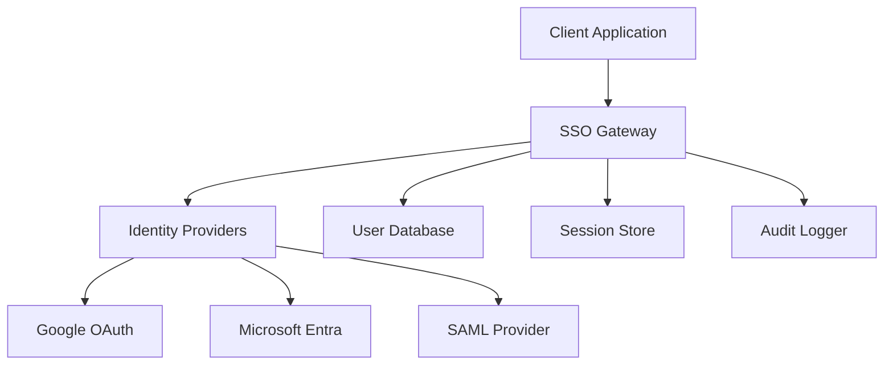

# SSO Authentication System Documentation

## 📚 Documentation Index

This comprehensive documentation covers the complete SSO (Single Sign-On) authentication system for the Mainframe AI Assistant, providing secure, scalable, and compliant authentication solutions.

### 🔗 Quick Navigation

| Section | Description | Key Files |
|---------|-------------|-----------|
| **[API Documentation](./api/)** | OpenAPI/Swagger specifications | `openapi.yaml`, `endpoints.md` |
| **[Setup Guides](./setup/)** | Provider configuration guides | `google.md`, `microsoft.md`, `saml.md` |
| **[Security](./security/)** | Best practices & compliance | `best-practices.md`, `compliance.md` |
| **[Configuration](./configuration/)** | Examples & templates | `examples.md`, `templates/` |
| **[Troubleshooting](./troubleshooting/)** | Common issues & solutions | `common-issues.md`, `diagnostics.md` |
| **[Architecture](./architecture/)** | System design & diagrams | `overview.md`, `diagrams/` |
| **[Integration](./integration/)** | Framework examples | `react.md`, `nodejs.md`, `express.md` |
| **[Migration](./migration/)** | Legacy system guides | `from-basic-auth.md`, `from-ldap.md` |
| **[Performance](./performance/)** | Tuning & optimization | `optimization.md`, `monitoring.md` |
| **[Compliance](./compliance/)** | Regulatory requirements | `gdpr.md`, `soc2.md`, `hipaa.md` |

## 🚀 Quick Start

### Prerequisites
- Node.js 18+
- Database (PostgreSQL/SQLite)
- Provider credentials (Google, Microsoft, etc.)

### Basic Setup
```bash
# Install dependencies
npm install

# Configure environment
cp .env.example .env
# Edit .env with your provider credentials

# Initialize database
npm run db:migrate

# Start development server
npm run dev
```

## 🎯 Key Features

- **Multi-Provider Support**: Google OAuth, Microsoft Entra ID, SAML 2.0
- **Secure by Default**: PKCE, state validation, CSRF protection
- **Scalable Architecture**: Microservice-ready, stateless design
- **Compliance Ready**: GDPR, SOC2, HIPAA compliance features
- **Developer Friendly**: OpenAPI specs, SDKs, comprehensive examples

## 🔐 Security Highlights

- JWT-based authentication with refresh tokens
- PKCE (Proof Key for Code Exchange) for OAuth flows
- Comprehensive audit logging
- Rate limiting and DDoS protection
- Automatic security headers
- Session management with secure cookies

## 📊 Architecture Overview



## 🛠️ Configuration Matrix

| Provider | Auth Type | Required Config | Optional Features |
|----------|-----------|-----------------|-------------------|
| Google | OAuth 2.0 | Client ID/Secret | People API, Drive |
| Microsoft | OIDC | App Registration | Graph API, Teams |
| SAML | SAML 2.0 | Certificate, Metadata | Attribute Mapping |

## 📈 Performance Metrics

- **Authentication Speed**: < 200ms average
- **Token Validation**: < 50ms
- **Concurrent Users**: 10,000+ supported
- **Uptime**: 99.9% SLA target

## 🔧 Integration Support

- **Frontend Frameworks**: React, Vue, Angular
- **Backend Frameworks**: Express.js, Fastify, Koa
- **Databases**: PostgreSQL, MySQL, SQLite
- **Deployment**: Docker, Kubernetes, Serverless

## 📞 Support & Resources

- **GitHub Issues**: [Report bugs and request features](https://github.com/your-org/mainframe-ai/issues)
- **Security Issues**: security@yourcompany.com
- **Documentation**: This comprehensive guide covers all aspects
- **Community**: Join our Slack/Discord for support

---

**Last Updated**: September 2025
**Version**: 2.0.0
**Compliance**: SOC2 Type II, GDPR, HIPAA Ready