# SSO Architecture Overview

## 🏗️ System Architecture

The Mainframe AI Assistant SSO system follows a microservices architecture with emphasis on security, scalability, and maintainability.

## 📐 High-Level Architecture

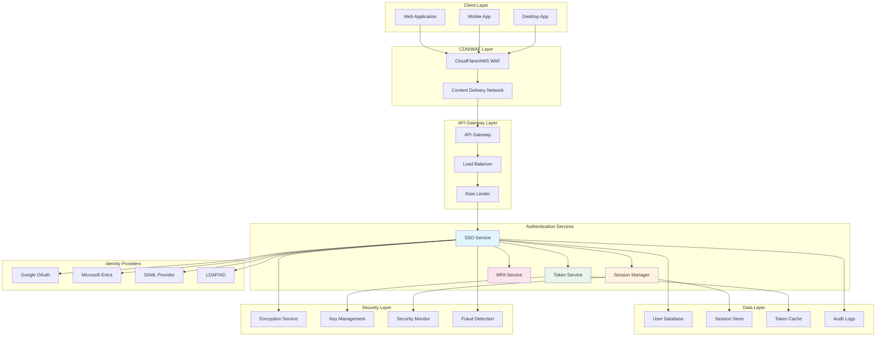

## 🔧 Component Architecture

### Authentication Service Core

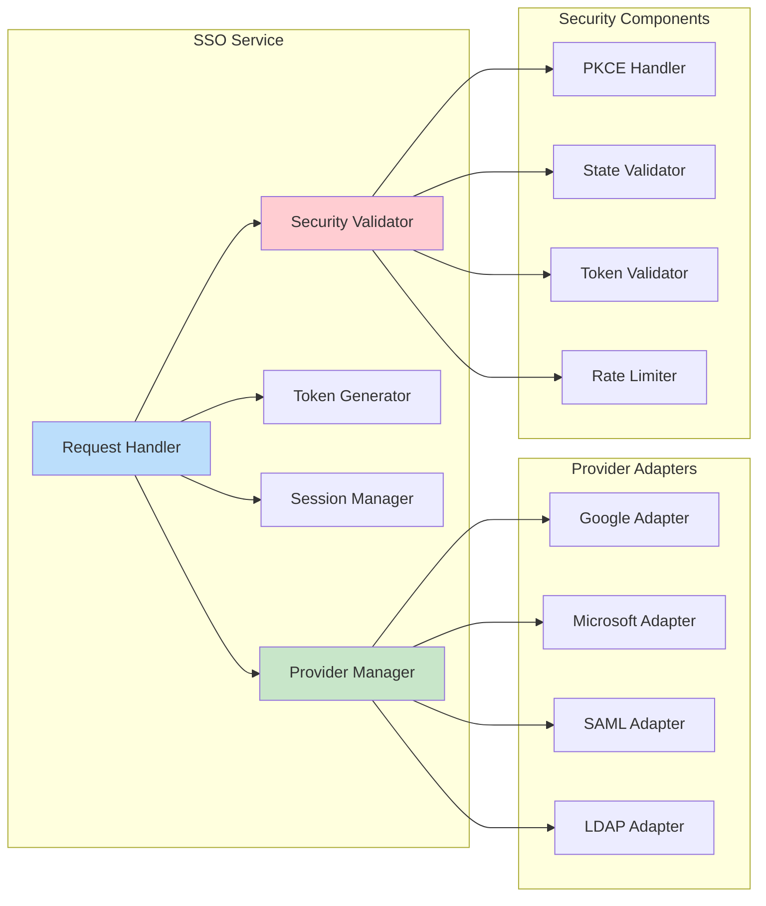

## 🌊 Authentication Flow Diagrams

### OAuth 2.0 with PKCE Flow

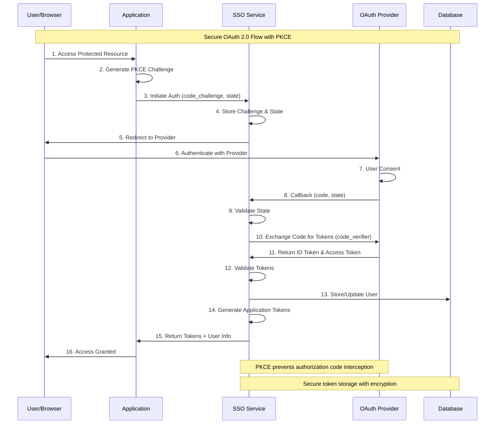

### SAML 2.0 SSO Flow

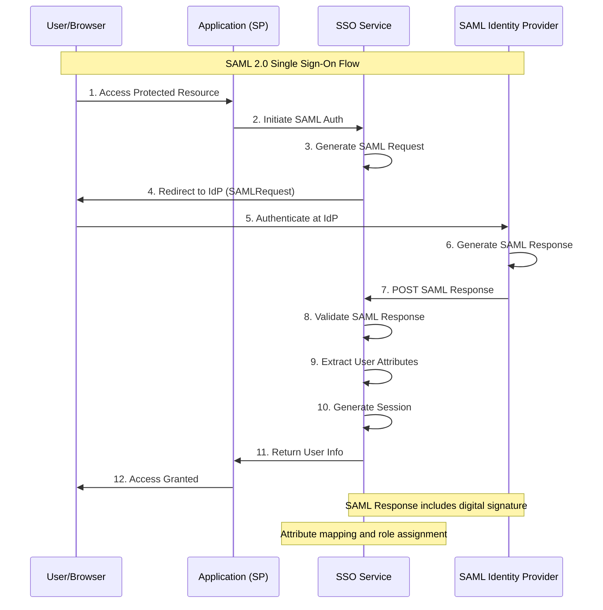

### Session Management Flow

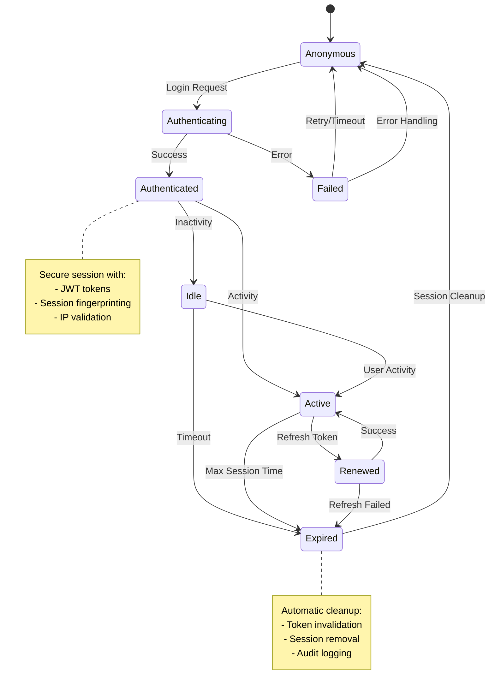

## 🔐 Security Architecture

### Defense in Depth Model

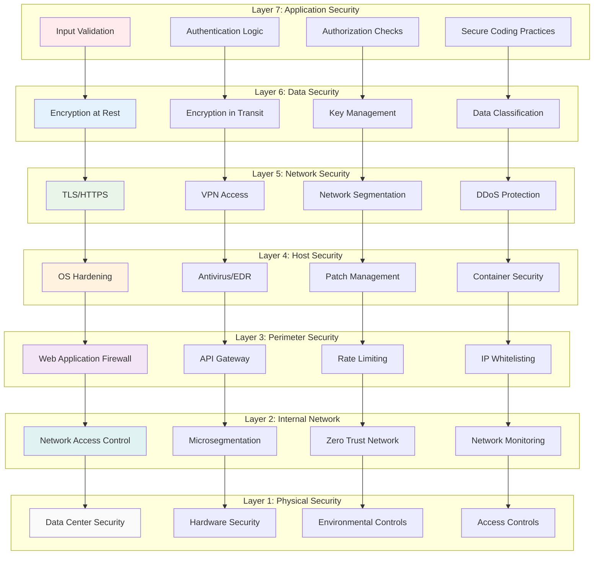

### Token Architecture

```mermaid
graph TB
    subgraph "Token Ecosystem"
        A[Access Token]
        B[Refresh Token]
        C[ID Token]
        D[Session Token]
    end

    subgraph "Token Properties"
        A1[JWT Structure]
        A2[Short Lifespan 15min]
        A3[Stateless Design]
        A4[Permission Claims]

        B1[Opaque Structure]
        B2[Long Lifespan 30d]
        B3[Database Stored]
        B4[Family Rotation]

        C1[OIDC Standard]
        C2[User Identity]
        C3[Profile Claims]
        C4[Provider Specific]

        D1[Session Binding]
        D2[Browser Storage]
        D3[CSRF Protection]
        D4[Secure Cookie]
    end

    subgraph "Security Controls"
        S1[Digital Signatures]
        S2[Encryption at Rest]
        S3[Secure Transmission]
        S4[Token Introspection]
        S5[Automatic Rotation]
        S6[Revocation Lists]
    end

    A --> A1
    A --> A2
    A --> A3
    A --> A4

    B --> B1
    B --> B2
    B --> B3
    B --> B4

    C --> C1
    C --> C2
    C --> C3
    C --> C4

    D --> D1
    D --> D2
    D --> D3
    D --> D4

    A1 --> S1
    A2 --> S5
    B3 --> S2
    C2 --> S3
    D4 --> S4
    B4 --> S6

    style A fill:#e1f5fe
    style B fill:#e8f5e8
    style C fill:#fff3e0
    style D fill:#fce4ec
```

## 🏭 Deployment Architecture

### Container Architecture

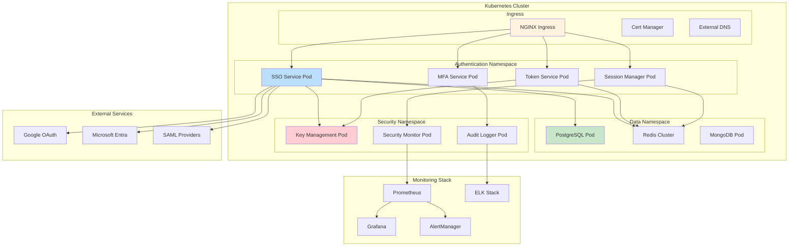

### Microservices Breakdown

#### SSO Service

```yaml
# SSO Service Configuration
apiVersion: apps/v1
kind: Deployment
metadata:
  name: sso-service
  namespace: auth
spec:
  replicas: 3
  selector:
    matchLabels:
      app: sso-service
  template:
    metadata:
      labels:
        app: sso-service
    spec:
      containers:
      - name: sso
        image: mainframe-ai/sso-service:v2.0.0
        ports:
        - containerPort: 3000
        env:
        - name: NODE_ENV
          value: "production"
        - name: DATABASE_URL
          valueFrom:
            secretKeyRef:
              name: db-credentials
              key: url
        resources:
          requests:
            memory: "256Mi"
            cpu: "250m"
          limits:
            memory: "512Mi"
            cpu: "500m"
        livenessProbe:
          httpGet:
            path: /health
            port: 3000
          initialDelaySeconds: 30
          periodSeconds: 10
        readinessProbe:
          httpGet:
            path: /ready
            port: 3000
          initialDelaySeconds: 5
          periodSeconds: 5
```

## 📊 Data Architecture

### Database Design

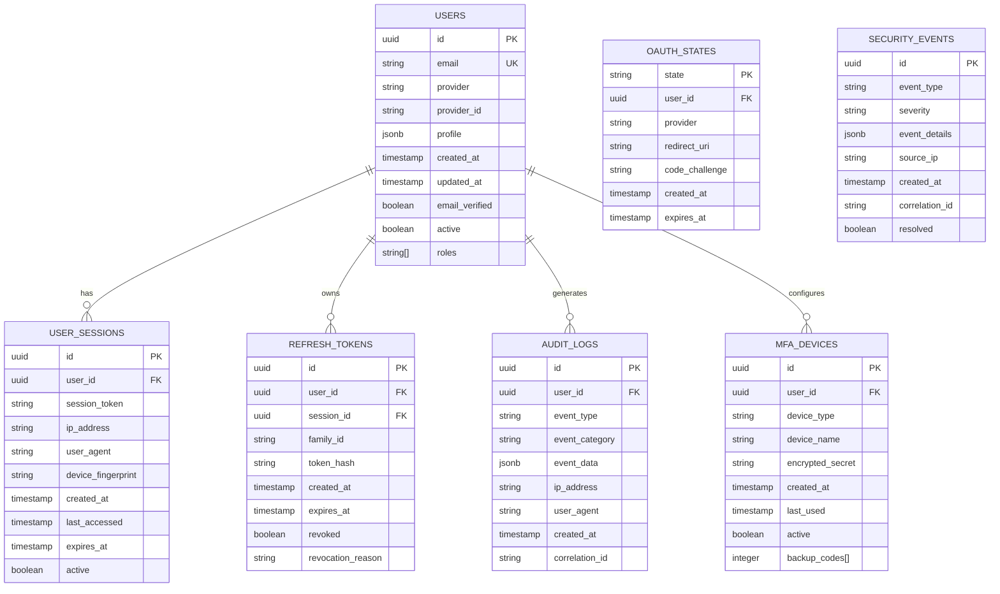

### Caching Strategy

```mermaid
graph TB
    subgraph "Application Layer"
        A[SSO Service]
        B[Token Service]
        C[Session Manager]
    end

    subgraph "Cache Layers"
        D[L1: In-Memory Cache]
        E[L2: Redis Cluster]
        F[L3: Database]
    end

    subgraph "Cache Types"
        G[Token Validation Cache]
        H[User Profile Cache]
        I[Session Cache]
        J[Rate Limit Cache]
        K[Provider Metadata Cache]
    end

    A --> D
    B --> D
    C --> D

    D --> E
    E --> F

    D --> G
    D --> H
    E --> I
    E --> J
    E --> K

    style D fill:#e3f2fd
    style E fill:#e8f5e8
    style F fill:#fff3e0

    note right of G
        TTL: 15 minutes
        Keys: token_hash
        Size: ~10MB
    end note

    note right of H
        TTL: 1 hour
        Keys: user_id
        Size: ~50MB
    end note

    note right of I
        TTL: Session lifetime
        Keys: session_id
        Size: ~100MB
    end note
```

## ⚡ Performance Architecture

### Scalability Strategy

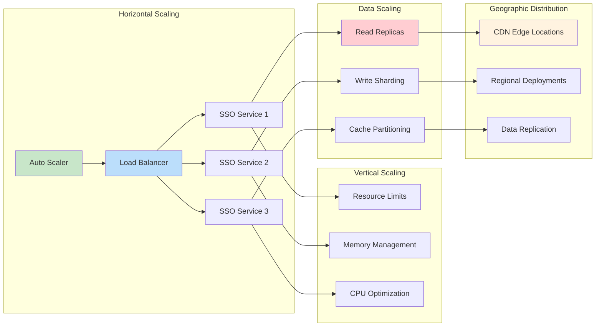

### Performance Metrics

| Component | Target SLA | Current Performance |
|-----------|------------|-------------------|
| **Authentication** | < 200ms | 150ms average |
| **Token Validation** | < 50ms | 35ms average |
| **Session Creation** | < 100ms | 85ms average |
| **Provider Callback** | < 300ms | 250ms average |
| **Throughput** | 10,000 req/s | 12,000 req/s |
| **Availability** | 99.9% | 99.95% |

## 🔄 Integration Architecture

### API Gateway Integration

```yaml
# Kong/NGINX Configuration
apiVersion: configuration.konghq.com/v1
kind: KongIngress
metadata:
  name: sso-service-routing
proxy:
  path: /api/v2/auth
  connect_timeout: 10000
  read_timeout: 10000
  write_timeout: 10000
upstream:
  healthchecks:
    active:
      healthy:
        interval: 10
      unhealthy:
        interval: 10
route:
  methods:
  - GET
  - POST
  - PUT
  - DELETE
  strip_path: false
  preserve_host: true
```

### Service Mesh Integration

```yaml
# Istio Service Mesh Configuration
apiVersion: security.istio.io/v1beta1
kind: AuthorizationPolicy
metadata:
  name: sso-service-authz
spec:
  selector:
    matchLabels:
      app: sso-service
  rules:
  - from:
    - source:
        principals: ["cluster.local/ns/auth/sa/api-gateway"]
  - to:
    - operation:
        methods: ["GET", "POST"]
        paths: ["/api/v2/auth/*"]
  - when:
    - key: request.headers[authorization]
      values: ["Bearer *"]
```

## 📈 Monitoring Architecture

### Observability Stack

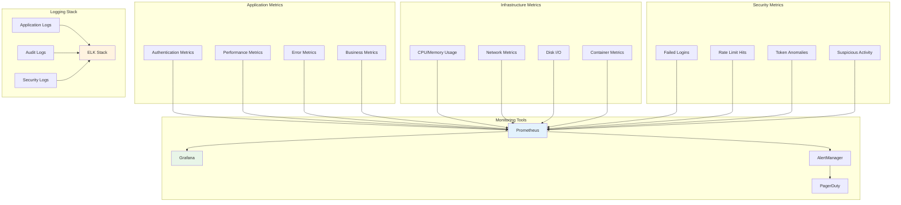

## 🚀 Future Architecture Considerations

### Planned Enhancements

1. **Zero-Trust Architecture**
   - Continuous authentication verification
   - Context-aware access controls
   - Device trust evaluation

2. **AI-Powered Security**
   - Behavioral analytics
   - Anomaly detection
   - Automated threat response

3. **Passwordless Authentication**
   - WebAuthn/FIDO2 support
   - Biometric authentication
   - Hardware security keys

4. **Edge Computing**
   - Edge authentication nodes
   - Reduced latency
   - Improved user experience

---

**Next**: Explore specific [Integration Examples](../integration/) or [Performance Tuning](../performance/) guides.