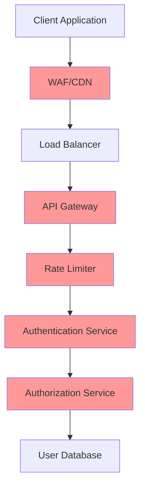

# SSO Security Best Practices

## 🔐 Overview

This document outlines critical security practices for implementing and maintaining a secure SSO system. Following these guidelines ensures your authentication system meets enterprise security standards and regulatory requirements.

## 🛡️ Core Security Principles

### 1. Defense in Depth

Implement multiple layers of security controls:



### 2. Zero Trust Architecture

```javascript
// Never trust, always verify
const securityMiddleware = {
  // Verify every request
  verifyToken: async (req, res, next) => {
    const token = extractToken(req);
    if (!token || !await isValidToken(token)) {
      return res.status(401).json({ error: 'unauthorized' });
    }
    next();
  },

  // Check permissions for every resource
  checkPermissions: (resource, action) => {
    return async (req, res, next) => {
      const user = req.user;
      if (!await hasPermission(user, resource, action)) {
        return res.status(403).json({ error: 'forbidden' });
      }
      next();
    };
  }
};
```

## 🔒 Authentication Security

### Token-Based Security

#### JWT Best Practices

```javascript
const jwt = require('jsonwebtoken');
const crypto = require('crypto');

// Secure JWT configuration
const jwtConfig = {
  // Use strong algorithms
  algorithm: 'RS256', // Never use HS256 for distributed systems

  // Short-lived access tokens
  expiresIn: '15m',

  // Audience and issuer validation
  issuer: 'https://auth.yourcompany.com',
  audience: 'https://api.yourcompany.com',

  // Secure key rotation
  keyid: generateKeyId(),

  // Additional claims
  subject: user.id,
  jti: crypto.randomUUID(), // JWT ID for revocation

  // Security claims
  iat: Math.floor(Date.now() / 1000), // Issued at
  nbf: Math.floor(Date.now() / 1000), // Not before
};

// Generate secure tokens
function generateAccessToken(user, permissions) {
  const payload = {
    sub: user.id,
    email: user.email,
    permissions: permissions,
    session_id: user.sessionId,
    // Security metadata
    ip_hash: hashIP(user.lastIP),
    user_agent_hash: hashUserAgent(user.userAgent),
    device_fingerprint: user.deviceFingerprint
  };

  return jwt.sign(payload, getPrivateKey(), jwtConfig);
}
```

#### Refresh Token Security

```javascript
// Secure refresh token implementation
class RefreshTokenManager {
  constructor() {
    this.tokenFamily = new Map(); // Token family tracking
  }

  async generateRefreshToken(userId, sessionId) {
    const refreshToken = {
      id: crypto.randomUUID(),
      userId: userId,
      sessionId: sessionId,
      family: crypto.randomUUID(), // Token family for rotation
      createdAt: new Date(),
      expiresAt: new Date(Date.now() + 30 * 24 * 60 * 60 * 1000), // 30 days

      // Security metadata
      ipAddress: req.ip,
      userAgent: req.headers['user-agent'],
      deviceFingerprint: computeDeviceFingerprint(req)
    };

    // Store with encryption
    await this.storeRefreshToken(refreshToken);

    // Return only the token ID
    return refreshToken.id;
  }

  async rotateRefreshToken(oldTokenId, req) {
    const oldToken = await this.getRefreshToken(oldTokenId);

    if (!oldToken || oldToken.expiresAt < new Date()) {
      throw new Error('Invalid or expired refresh token');
    }

    // Validate security context
    if (!this.validateSecurityContext(oldToken, req)) {
      // Potential token theft - invalidate entire family
      await this.invalidateTokenFamily(oldToken.family);
      throw new Error('Security validation failed');
    }

    // Generate new token in same family
    const newToken = await this.generateRefreshToken(
      oldToken.userId,
      oldToken.sessionId
    );

    // Invalidate old token
    await this.invalidateRefreshToken(oldTokenId);

    return newToken;
  }

  validateSecurityContext(token, req) {
    // IP address validation (with some tolerance for mobile users)
    if (!this.isValidIPRange(token.ipAddress, req.ip)) {
      return false;
    }

    // User agent validation
    if (token.userAgent !== req.headers['user-agent']) {
      return false;
    }

    // Device fingerprint validation
    if (token.deviceFingerprint !== computeDeviceFingerprint(req)) {
      return false;
    }

    return true;
  }
}
```

### PKCE Implementation

```javascript
// Proof Key for Code Exchange - Enhanced Security
class PKCEManager {
  generateChallenge() {
    // Generate cryptographically secure code verifier
    const codeVerifier = crypto.randomBytes(32).toString('base64url');

    // Create SHA256 challenge
    const challenge = crypto
      .createHash('sha256')
      .update(codeVerifier)
      .digest('base64url');

    return {
      codeVerifier,
      codeChallenge: challenge,
      codeChallengeMethod: 'S256'
    };
  }

  verifyChallenge(codeVerifier, codeChallenge) {
    const computedChallenge = crypto
      .createHash('sha256')
      .update(codeVerifier)
      .digest('base64url');

    return computedChallenge === codeChallenge;
  }

  // Store challenge securely with expiration
  async storeChallenge(state, challenge, userId) {
    const challengeData = {
      codeChallenge: challenge.codeChallenge,
      codeChallengeMethod: challenge.codeChallengeMethod,
      userId: userId,
      createdAt: new Date(),
      expiresAt: new Date(Date.now() + 10 * 60 * 1000) // 10 minutes
    };

    await redis.setex(`pkce:${state}`, 600, JSON.stringify(challengeData));
  }
}
```

## 🔐 Session Security

### Secure Session Management

```javascript
// Comprehensive session security
const session = require('express-session');
const RedisStore = require('connect-redis')(session);

const sessionConfig = {
  store: new RedisStore({ client: redisClient }),

  // Session configuration
  name: 'sid', // Don't use default session name
  genid: () => crypto.randomUUID(),

  // Security settings
  secret: [process.env.SESSION_SECRET_1, process.env.SESSION_SECRET_2], // Key rotation
  resave: false,
  saveUninitialized: false,

  // Cookie security
  cookie: {
    secure: process.env.NODE_ENV === 'production', // HTTPS only in production
    httpOnly: true, // Prevent XSS
    maxAge: 15 * 60 * 1000, // 15 minutes
    sameSite: 'strict', // CSRF protection
    domain: process.env.SESSION_DOMAIN // Restrict to your domain
  },

  // Rolling sessions
  rolling: true,

  // Session regeneration on privilege escalation
  regenerateOnLogin: true
};

// Session middleware with additional security
app.use(session(sessionConfig));

// Session security middleware
app.use((req, res, next) => {
  // Regenerate session ID on login
  if (req.session && req.session.regenerate && req.body.login) {
    req.session.regenerate((err) => {
      if (err) return next(err);
      next();
    });
  } else {
    next();
  }
});
```

### Session Fixation Prevention

```javascript
// Prevent session fixation attacks
class SessionManager {
  async createSecureSession(req, user) {
    // Destroy any existing session
    if (req.session) {
      await new Promise((resolve, reject) => {
        req.session.destroy((err) => {
          if (err) reject(err);
          else resolve();
        });
      });
    }

    // Create new session with fresh ID
    req.session = {
      userId: user.id,
      sessionId: crypto.randomUUID(),

      // Security metadata
      createdAt: new Date(),
      lastAccessed: new Date(),
      ipAddress: req.ip,
      userAgent: req.headers['user-agent'],

      // Security flags
      isAuthenticated: true,
      requiresMFA: user.mfaEnabled,
      loginMethod: req.body.provider
    };

    // Set secure cookie
    res.cookie('session_id', req.session.sessionId, {
      secure: true,
      httpOnly: true,
      sameSite: 'strict',
      maxAge: 15 * 60 * 1000
    });
  }

  async validateSession(req) {
    if (!req.session || !req.session.isAuthenticated) {
      return false;
    }

    // Check session expiry
    const now = new Date();
    const sessionAge = now - new Date(req.session.createdAt);
    const maxSessionAge = 8 * 60 * 60 * 1000; // 8 hours

    if (sessionAge > maxSessionAge) {
      await this.destroySession(req);
      return false;
    }

    // Validate security context
    if (req.ip !== req.session.ipAddress) {
      // IP changed - require re-authentication
      req.session.requiresReauth = true;
    }

    // Update last accessed
    req.session.lastAccessed = now;

    return true;
  }
}
```

## 🛡️ Input Validation & Sanitization

### Comprehensive Input Validation

```javascript
const Joi = require('joi');
const validator = require('validator');
const DOMPurify = require('isomorphic-dompurify');

// Authentication input schemas
const authSchemas = {
  login: Joi.object({
    provider: Joi.string()
      .valid('google', 'microsoft', 'saml')
      .required(),

    redirect_uri: Joi.string()
      .uri({ scheme: ['http', 'https'] })
      .required()
      .custom((value, helpers) => {
        // Validate against allowed redirect URIs
        const allowedUris = process.env.ALLOWED_REDIRECT_URIS?.split(',') || [];
        if (!allowedUris.includes(value)) {
          return helpers.error('any.invalid');
        }
        return value;
      }),

    state: Joi.string()
      .alphanum()
      .min(16)
      .max(128)
      .required(),

    code_challenge: Joi.string()
      .base64()
      .length(43)
      .when('provider', {
        is: Joi.string().valid('google', 'microsoft'),
        then: Joi.required()
      })
  }),

  callback: Joi.object({
    code: Joi.string()
      .alphanum()
      .required(),

    state: Joi.string()
      .alphanum()
      .required(),

    code_verifier: Joi.string()
      .base64()
      .length(43)
      .required()
  })
};

// Input sanitization middleware
const sanitizeInput = (req, res, next) => {
  // Sanitize all string inputs
  const sanitize = (obj) => {
    for (let key in obj) {
      if (typeof obj[key] === 'string') {
        // Remove potential XSS
        obj[key] = DOMPurify.sanitize(obj[key]);

        // Additional sanitization
        obj[key] = validator.escape(obj[key]);

        // Normalize Unicode
        obj[key] = obj[key].normalize('NFKC');

        // Trim whitespace
        obj[key] = obj[key].trim();
      } else if (typeof obj[key] === 'object' && obj[key] !== null) {
        sanitize(obj[key]);
      }
    }
  };

  sanitize(req.body);
  sanitize(req.query);
  sanitize(req.params);

  next();
};
```

## 🔍 Monitoring & Alerting

### Security Event Monitoring

```javascript
// Comprehensive security monitoring
class SecurityMonitor {
  constructor() {
    this.alertThresholds = {
      failedLoginAttempts: 5,
      suspiciousIPActivity: 10,
      tokenAnomalies: 3,
      timeWindow: 5 * 60 * 1000 // 5 minutes
    };
  }

  async logSecurityEvent(event, metadata) {
    const securityEvent = {
      timestamp: new Date(),
      eventType: event,
      severity: this.calculateSeverity(event),

      // Request metadata
      ip: metadata.ip,
      userAgent: metadata.userAgent,
      userId: metadata.userId,
      sessionId: metadata.sessionId,

      // Additional context
      details: metadata.details,
      correlationId: metadata.correlationId
    };

    // Store in security log
    await this.storeSecurityEvent(securityEvent);

    // Check for suspicious patterns
    await this.analyzeSecurityPatterns(securityEvent);
  }

  async analyzeSecurityPatterns(event) {
    const recentEvents = await this.getRecentEvents(
      event.eventType,
      this.alertThresholds.timeWindow
    );

    // Failed login pattern detection
    if (event.eventType === 'failed_login') {
      const ipFailures = recentEvents.filter(e => e.ip === event.ip).length;
      const userFailures = recentEvents.filter(e => e.userId === event.userId).length;

      if (ipFailures >= this.alertThresholds.failedLoginAttempts) {
        await this.triggerAlert('brute_force_ip', {
          ip: event.ip,
          attempts: ipFailures
        });
      }

      if (userFailures >= this.alertThresholds.failedLoginAttempts) {
        await this.triggerAlert('brute_force_user', {
          userId: event.userId,
          attempts: userFailures
        });
      }
    }

    // Token anomaly detection
    if (event.eventType === 'token_validation_failed') {
      const tokenFailures = recentEvents.length;
      if (tokenFailures >= this.alertThresholds.tokenAnomalies) {
        await this.triggerAlert('token_anomaly', {
          failures: tokenFailures,
          pattern: this.identifyPattern(recentEvents)
        });
      }
    }
  }

  async triggerAlert(alertType, details) {
    const alert = {
      type: alertType,
      severity: 'high',
      timestamp: new Date(),
      details: details,

      // Auto-response actions
      actions: this.getAutoResponseActions(alertType)
    };

    // Send to security team
    await this.sendSecurityAlert(alert);

    // Execute auto-response
    if (alert.actions.length > 0) {
      await this.executeAutoResponse(alert);
    }
  }

  getAutoResponseActions(alertType) {
    const actions = {
      'brute_force_ip': ['block_ip', 'notify_security'],
      'brute_force_user': ['lock_account', 'notify_security'],
      'token_anomaly': ['invalidate_sessions', 'notify_security']
    };

    return actions[alertType] || ['notify_security'];
  }
}
```

## 🔐 Rate Limiting & DDoS Protection

### Multi-Layer Rate Limiting

```javascript
const rateLimit = require('express-rate-limit');
const slowDown = require('express-slow-down');
const RedisStore = require('rate-limit-redis');

// Different rate limits for different endpoints
const rateLimits = {
  // Authentication endpoints - strict limits
  auth: rateLimit({
    store: new RedisStore({
      client: redisClient,
      prefix: 'rl:auth:'
    }),
    windowMs: 15 * 60 * 1000, // 15 minutes
    max: 5, // 5 attempts per window
    message: {
      error: 'too_many_requests',
      message: 'Too many authentication attempts',
      retryAfter: 15 * 60 // 15 minutes
    },
    standardHeaders: true,
    legacyHeaders: false,

    // Custom key generator - by IP and user
    keyGenerator: (req) => {
      const ip = req.ip;
      const user = req.body?.email || req.query?.email;
      return user ? `${ip}:${user}` : ip;
    },

    // Skip successful requests
    skipSuccessfulRequests: true,

    // Custom handler for rate limit exceeded
    handler: async (req, res) => {
      const ip = req.ip;
      const timestamp = new Date();

      // Log potential attack
      await securityLogger.log('rate_limit_exceeded', {
        ip: ip,
        endpoint: req.path,
        attempts: req.rateLimit.current,
        timestamp: timestamp
      });

      res.status(429).json({
        error: 'rate_limit_exceeded',
        message: 'Too many requests',
        retryAfter: Math.round(req.rateLimit.resetTime / 1000)
      });
    }
  }),

  // Token endpoints - moderate limits
  token: rateLimit({
    windowMs: 60 * 1000, // 1 minute
    max: 10, // 10 requests per minute
    message: 'Token endpoint rate limit exceeded'
  }),

  // General API - lenient limits
  api: rateLimit({
    windowMs: 15 * 60 * 1000,
    max: 100
  })
};

// Progressive delay for suspicious activity
const progressiveDelay = slowDown({
  windowMs: 15 * 60 * 1000,
  delayAfter: 2, // Allow 2 requests at full speed
  delayMs: 500, // Add 500ms delay after delayAfter
  maxDelayMs: 20000, // Maximum delay of 20 seconds
});

// Apply rate limiting
app.use('/api/v2/auth', rateLimits.auth, progressiveDelay);
app.use('/api/v2/token', rateLimits.token);
app.use('/api/v2', rateLimits.api);
```

## 🛡️ Security Headers

### Comprehensive Security Headers

```javascript
const helmet = require('helmet');
const hpp = require('hpp');
const cors = require('cors');

// Security headers configuration
app.use(helmet({
  // Content Security Policy
  contentSecurityPolicy: {
    directives: {
      defaultSrc: ["'self'"],
      styleSrc: ["'self'", "'unsafe-inline'", 'fonts.googleapis.com'],
      fontSrc: ["'self'", 'fonts.gstatic.com'],
      imgSrc: ["'self'", 'data:', 'https:'],
      scriptSrc: ["'self'"],
      objectSrc: ["'none'"],
      upgradeInsecureRequests: [],
    },
  },

  // HTTP Strict Transport Security
  hsts: {
    maxAge: 63072000, // 2 years
    includeSubDomains: true,
    preload: true
  },

  // X-Frame-Options
  frameguard: {
    action: 'deny'
  },

  // X-Content-Type-Options
  noSniff: true,

  // X-XSS-Protection
  xssFilter: true,

  // Referrer Policy
  referrerPolicy: {
    policy: 'strict-origin-when-cross-origin'
  }
}));

// CORS configuration
const corsOptions = {
  origin: (origin, callback) => {
    const allowedOrigins = process.env.ALLOWED_ORIGINS?.split(',') || [];

    // Allow requests with no origin (mobile apps, etc.)
    if (!origin) return callback(null, true);

    if (allowedOrigins.includes(origin)) {
      callback(null, true);
    } else {
      callback(new Error('Not allowed by CORS'));
    }
  },

  methods: ['GET', 'POST', 'PUT', 'DELETE'],
  allowedHeaders: ['Content-Type', 'Authorization', 'X-Requested-With'],
  credentials: true, // Allow cookies
  maxAge: 86400 // 24 hours preflight cache
};

app.use(cors(corsOptions));

// Prevent HTTP Parameter Pollution
app.use(hpp({
  whitelist: ['scopes'] // Allow arrays for OAuth scopes
}));

// Custom security headers
app.use((req, res, next) => {
  // Prevent caching of sensitive endpoints
  if (req.path.startsWith('/api/v2/auth')) {
    res.set({
      'Cache-Control': 'no-store, no-cache, must-revalidate, private',
      'Pragma': 'no-cache',
      'Expires': '0'
    });
  }

  // Add custom security headers
  res.set({
    'X-Powered-By': '', // Remove server info
    'X-DNS-Prefetch-Control': 'off',
    'X-Download-Options': 'noopen',
    'X-Permitted-Cross-Domain-Policies': 'none'
  });

  next();
});
```

## 🔍 Vulnerability Assessment

### Security Testing Checklist

```javascript
// Automated security testing
const securityTests = {
  // Test authentication bypass
  testAuthBypass: async () => {
    const tests = [
      // Test without token
      { path: '/api/v2/user', headers: {}, expect: 401 },

      // Test with invalid token
      { path: '/api/v2/user', headers: { Authorization: 'Bearer invalid' }, expect: 401 },

      // Test with expired token
      { path: '/api/v2/user', headers: { Authorization: 'Bearer expired_token' }, expect: 401 },

      // Test SQL injection in login
      {
        path: '/api/v2/auth/login',
        body: { email: "admin'--", password: 'any' },
        expect: 400
      }
    ];

    for (const test of tests) {
      const result = await runSecurityTest(test);
      if (result.status !== test.expect) {
        throw new Error(`Security test failed: ${test.path}`);
      }
    }
  },

  // Test CSRF protection
  testCSRFProtection: async () => {
    // Attempt state parameter bypass
    const result = await request(app)
      .get('/api/v2/auth/google/callback')
      .query({ code: 'valid_code', state: 'invalid_state' });

    expect(result.status).toBe(400);
  },

  // Test rate limiting
  testRateLimiting: async () => {
    const requests = Array(10).fill(null).map(() =>
      request(app).post('/api/v2/auth/login').send({
        provider: 'google',
        email: 'test@example.com'
      })
    );

    const results = await Promise.all(requests);
    const rateLimited = results.filter(r => r.status === 429);

    expect(rateLimited.length).toBeGreaterThan(0);
  }
};

// Run security tests
async function runSecurityAudit() {
  const testResults = {};

  for (const [testName, testFn] of Object.entries(securityTests)) {
    try {
      await testFn();
      testResults[testName] = 'PASS';
    } catch (error) {
      testResults[testName] = `FAIL: ${error.message}`;
    }
  }

  return testResults;
}
```

## 🚨 Incident Response

### Security Incident Response Plan

```javascript
// Automated incident response
class IncidentResponse {
  constructor() {
    this.severityLevels = {
      LOW: { response_time: 24 * 60 * 60 * 1000 }, // 24 hours
      MEDIUM: { response_time: 4 * 60 * 60 * 1000 }, // 4 hours
      HIGH: { response_time: 1 * 60 * 60 * 1000 }, // 1 hour
      CRITICAL: { response_time: 15 * 60 * 1000 } // 15 minutes
    };
  }

  async handleSecurityIncident(incident) {
    const severity = this.calculateSeverity(incident);

    // Immediate containment actions
    await this.containThreat(incident, severity);

    // Notification
    await this.notifySecurityTeam(incident, severity);

    // Evidence collection
    await this.collectEvidence(incident);

    // Recovery actions
    if (severity >= 'HIGH') {
      await this.initiateRecovery(incident);
    }
  }

  async containThreat(incident, severity) {
    const actions = {
      'account_compromise': async () => {
        // Lock compromised account
        await this.lockUserAccount(incident.userId);

        // Invalidate all sessions
        await this.invalidateAllSessions(incident.userId);

        // Force password reset
        await this.forcePasswordReset(incident.userId);
      },

      'token_theft': async () => {
        // Invalidate token family
        await this.invalidateTokenFamily(incident.tokenFamily);

        // Rotate signing keys
        if (severity === 'CRITICAL') {
          await this.rotateSigningKeys();
        }
      },

      'brute_force_attack': async () => {
        // Block attacking IP
        await this.blockIP(incident.sourceIP, 24 * 60 * 60 * 1000);

        // Temporarily lock targeted accounts
        await this.temporaryAccountLock(incident.targetUsers);
      }
    };

    const action = actions[incident.type];
    if (action) {
      await action();
    }
  }

  async collectEvidence(incident) {
    const evidence = {
      timestamp: new Date(),
      incidentId: incident.id,

      // System state
      activeTokens: await this.getActiveTokens(),
      recentLogins: await this.getRecentLogins(24 * 60 * 60 * 1000),
      systemLogs: await this.getSystemLogs(incident.timeRange),

      // Network data
      sourceIP: incident.sourceIP,
      userAgent: incident.userAgent,
      geolocation: await this.getIPGeolocation(incident.sourceIP),

      // Application state
      affectedUsers: incident.affectedUsers,
      compromisedResources: incident.compromisedResources
    };

    // Store evidence securely
    await this.storeEvidence(evidence);

    return evidence;
  }
}
```

## 📋 Security Compliance Checklist

### OWASP Top 10 Protection

- [x] **A01 Broken Access Control**: Role-based permissions, token validation
- [x] **A02 Cryptographic Failures**: Strong encryption, secure key management
- [x] **A03 Injection**: Input validation, parameterized queries
- [x] **A04 Insecure Design**: Threat modeling, security by design
- [x] **A05 Security Misconfiguration**: Security headers, secure defaults
- [x] **A06 Vulnerable Components**: Dependency scanning, updates
- [x] **A07 Authentication Failures**: MFA, secure session management
- [x] **A08 Software Integrity**: Code signing, secure CI/CD
- [x] **A09 Logging Failures**: Comprehensive logging, monitoring
- [x] **A10 Server-Side Request Forgery**: URL validation, allowlists

### Regulatory Compliance

| Requirement | Implementation | Status |
|-------------|----------------|--------|
| **GDPR** | Data encryption, user consent, right to deletion | ✅ |
| **SOC 2** | Access controls, audit logging, encryption | ✅ |
| **HIPAA** | Data encryption, access logs, user training | ✅ |
| **PCI DSS** | Secure transmission, access controls | ✅ |

---

**Next**: Review [Compliance Documentation](../compliance/) for specific regulatory requirements.