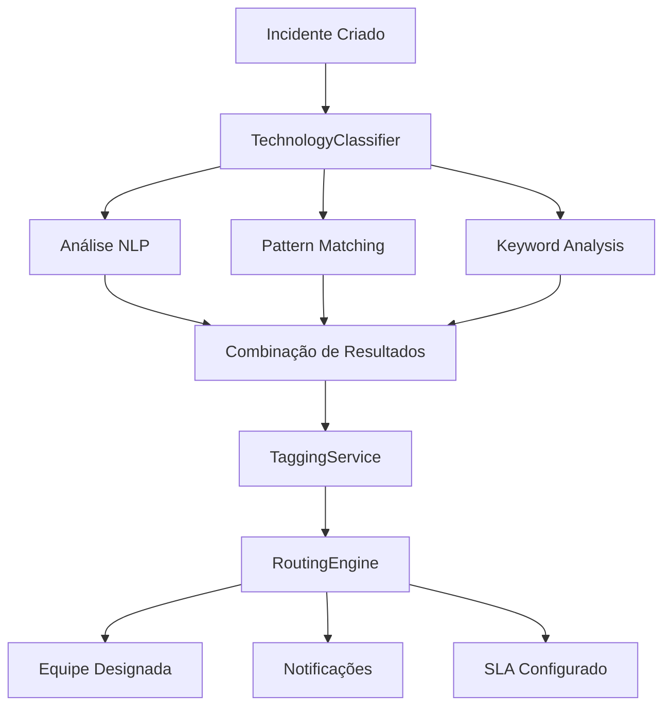

# Sistema de Categorização Automática de Incidentes

## Visão Geral

O Sistema de Categorização Automática de Incidentes é uma solução inteligente desenvolvida para ambientes bancários que classifica automaticamente incidentes por área tecnológica, aplicando tags hierárquicas e roteando-os para as equipes apropriadas.

## Arquitetura do Sistema

### Componentes Principais

1. **TaxonomyManager** - Gestão de taxonomias de áreas tecnológicas
2. **TechnologyClassifier** - Classificação inteligente usando NLP e ML
3. **TaggingService** - Sistema de tags e metadados
4. **RoutingEngine** - Roteamento automático para equipes

### Fluxo de Processamento



## Taxonomia de Áreas Tecnológicas

### Estrutura Hierárquica

#### 1. Mainframe (Nível 1)
- **COBOL** - Aplicações e programas COBOL
- **CICS** - Customer Information Control System
- **DB2** - Sistema de gerenciamento de banco de dados
- **z/OS** - Sistema operacional mainframe
- **JCL** - Job Control Language

#### 2. Core Banking (Nível 1)
- **Accounts** - Gestão de contas
- **Transactions** - Processamento de transações
- **Batch Processing** - Processamento em lote
- **SOA** - Arquitetura orientada a serviços
- **Middleware** - Camada de integração

#### 3. Mobile Banking (Nível 1)
- **iOS** - Aplicativo iOS nativo
- **Android** - Aplicativo Android nativo
- **React Native** - Aplicativo multiplataforma
- **Mobile API** - APIs específicas mobile

#### 4. Internet Banking (Nível 1)
- **Web Portal** - Portal web principal
- **API Gateway** - Gateway de APIs
- **Microservices** - Arquitetura de microserviços
- **Frontend** - Interface web

#### 5. Payment Systems (Nível 1)
- **PIX** - Sistema de pagamentos instantâneos
- **TED** - Transferência Eletrônica Disponível
- **DOC** - Documento de Ordem de Crédito
- **Cards** - Sistemas de cartões
- **Payment Gateway** - Gateway de pagamentos

#### 6. ATM Network (Nível 1)
- **ATM Hardware** - Componentes físicos
- **ISO 8583** - Protocolo de comunicação
- **ATM Software** - Software dos terminais
- **Network** - Rede de comunicação

#### 7. Data Platforms (Nível 1)
- **Data Lake** - Repositório de dados
- **BI** - Business Intelligence
- **Analytics** - Análise de dados
- **ETL** - Extract, Transform, Load
- **Big Data** - Processamento de grandes volumes

#### 8. Infrastructure (Nível 1)
- **Network** - Infraestrutura de rede
- **Servers** - Servidores
- **Cloud** - Infraestrutura em nuvem
- **Security** - Segurança
- **Monitoring** - Monitoramento

## Classificador Inteligente

### Métodos de Classificação

#### 1. NLP (Natural Language Processing)
- **Co-ocorrência de Termos**: Análise de termos que aparecem juntos
- **Similaridade Semântica**: Cálculo de similaridade contextual
- **Análise de Sentimento**: Identificação de urgência/criticidade

#### 2. Pattern Matching
- **Regex Patterns**: Expressões regulares para padrões específicos
- **Contextual Patterns**: Padrões baseados em contexto
- **Error Code Patterns**: Reconhecimento de códigos de erro

#### 3. Keyword Analysis
- **Weighted Keywords**: Palavras-chave com pesos específicos
- **Technical Terms**: Dicionário de termos técnicos bancários
- **Frequency Analysis**: Análise de frequência de termos

#### 4. Machine Learning
- **Classification Models**: Modelos por área tecnológica
- **Confidence Scoring**: Pontuação de confiança
- **Feedback Learning**: Aprendizado com feedback

### Exemplo de Classificação

```javascript
// Entrada
const incident = {
    title: "Erro S0C4 no programa COBOL PGPAY001",
    description: "Programa apresenta abend S0C4 durante processamento de pagamentos PIX",
    source: "mainframe",
    timestamp: "2024-09-22T14:30:00Z"
};

// Resultado da Classificação
const result = {
    primaryCategory: {
        category: "mainframe",
        confidence: 0.95,
        taxonomy: {
            name: "Mainframe",
            priority: "critical"
        }
    },
    classifications: [
        {
            category: "mainframe",
            confidence: 0.95,
            matches: ["s0c4", "cobol", "abend"],
            method: "pattern"
        },
        {
            category: "payment-systems",
            confidence: 0.8,
            matches: ["pagamentos", "pix"],
            method: "keyword"
        }
    ]
};
```

## Sistema de Tags

### Tipos de Tags

#### 1. Tags de Sistema
- **Automáticas**: Aplicadas automaticamente baseadas na taxonomia
- **Hierárquicas**: Estrutura pai-filho
- **Categorizadas**: Agrupadas por categoria tecnológica

#### 2. Tags de Status
- `NOVO` - Incidente recém-criado
- `CLASSIFICADO` - Classificado automaticamente
- `REVISÃO MANUAL` - Requer revisão manual
- `ROTEADO` - Roteado para equipe

#### 3. Tags de Impacto
- `CRÍTICO` - Impacto crítico no negócio
- `ALTO` - Alto impacto
- `MÉDIO` - Médio impacto
- `BAIXO` - Baixo impacto

#### 4. Tags de Urgência
- `IMEDIATO` - Requer ação imediata
- `URGENTE` - Requer ação em poucas horas
- `NORMAL` - Prazo normal de atendimento

#### 5. Tags Temporais
- `HORÁRIO COMERCIAL` - Ocorreu durante horário comercial
- `FORA DO HORÁRIO` - Ocorreu fora do horário
- `FIM DE SEMANA` - Ocorreu durante fim de semana
- `FERIADO` - Ocorreu durante feriado

### Aplicação Automática de Tags

```javascript
// Exemplo de aplicação automática
const autoTags = await taggingService.applyAutoTags(incident, classification);

// Resultado
{
    tags: [
        {
            id: "system_mainframe",
            name: "MAINFRAME",
            type: "system",
            color: "#e74c3c",
            priority: "critical"
        },
        {
            id: "status_classified",
            name: "CLASSIFICADO",
            type: "status",
            color: "#2ecc71"
        },
        {
            id: "impact_critical",
            name: "CRÍTICO",
            type: "impact",
            color: "#e74c3c"
        }
    ],
    applied: 3,
    skipped: 0
}
```

## Engine de Roteamento

### Equipes Disponíveis

#### 1. Mainframe Support
- **Capacidades**: mainframe, cobol, cics, db2, jcl, zos
- **Disponibilidade**: 24x7
- **SLA**: 15min resposta, 120min resolução
- **Prioridades**: critical, high

#### 2. Mobile Team
- **Capacidades**: mobile-banking, ios, android, react-native
- **Disponibilidade**: 8x5
- **SLA**: 30min resposta, 240min resolução
- **Prioridades**: high, medium

#### 3. Core Banking Team
- **Capacidades**: core-banking, accounts, transactions, batch-processing
- **Disponibilidade**: 24x7
- **SLA**: 10min resposta, 60min resolução
- **Prioridades**: critical, high

#### 4. Payments Team
- **Capacidades**: payment-systems, pix, ted, doc, cards
- **Disponibilidade**: 24x7
- **SLA**: 5min resposta, 30min resolução
- **Prioridades**: critical, high

#### 5. Infrastructure Team
- **Capacidades**: infrastructure, network, servers, cloud
- **Disponibilidade**: 24x7
- **SLA**: 20min resposta, 180min resolução
- **Prioridades**: high, medium

#### 6. ATM Support
- **Capacidades**: atm-network, atm-hardware, iso8583
- **Disponibilidade**: 24x7
- **SLA**: 15min resposta, 120min resolução
- **Prioridades**: high, medium

#### 7. Web Team
- **Capacidades**: internet-banking, web-portal, api-gateway, microservices
- **Disponibilidade**: 16x5
- **SLA**: 25min resposta, 180min resolução
- **Prioridades**: high, medium

#### 8. Data Team
- **Capacidades**: data-platforms, data-lake, bi, analytics
- **Disponibilidade**: 8x5
- **SLA**: 60min resposta, 480min resolução
- **Prioridades**: medium, low

### Regras de Roteamento

#### 1. Mainframe Crítico
```javascript
{
    conditions: {
        categories: ['mainframe', 'cobol', 'cics', 'db2'],
        priority: ['critical'],
        tags: ['impact_critical']
    },
    actions: {
        route: 'mainframe-support',
        escalate: true,
        notify: ['mainframe-architects'],
        sla: 15
    }
}
```

#### 2. Pagamentos Urgente
```javascript
{
    conditions: {
        categories: ['payment-systems', 'pix', 'ted'],
        priority: ['critical', 'high'],
        keywords: ['pagamento', 'pix', 'transferencia']
    },
    actions: {
        route: 'payments-team',
        escalate: true,
        notify: ['payments-architects'],
        sla: 5
    }
}
```

### Load Balancing

O sistema implementa balanceamento de carga considerando:

1. **Capacidade Atual**: Número de incidentes ativos
2. **Capacidade Máxima**: Limite de incidentes por equipe
3. **Disponibilidade**: Horário de funcionamento da equipe
4. **Prioridade**: Incidentes críticos sempre são atribuídos

### Escalação Automática

#### Tipos de Escalação

1. **Por Tempo**: Baseada no tempo de resposta
2. **Por Prioridade**: Incidentes críticos escalados imediatamente
3. **Por Capacidade**: Quando equipe está sobrecarregada

#### Exemplo de Escalação

```javascript
// Configuração de escalação
{
    trigger: 'time',
    conditions: {
        timeThreshold: 60, // minutos
        priorities: ['critical', 'high']
    },
    actions: {
        escalateTo: 'next_level',
        notify: ['managers'],
        createTask: true
    }
}
```

## Matriz de SLA

| Categoria | Prioridade | Resposta | Resolução | Escalação |
|-----------|------------|----------|-----------|-----------|
| Payment Systems | Critical | 5min | 30min | 10min |
| Core Banking | Critical | 10min | 60min | 15min |
| Mainframe | Critical | 15min | 120min | 30min |
| Mobile Banking | High | 30min | 240min | 60min |
| ATM Network | High | 15min | 120min | 30min |
| Infrastructure | Medium | 30min | 180min | 60min |

## API de Integração

### Endpoint Principal

```javascript
POST /api/incidents/categorize

{
    "incident": {
        "id": "INC-2024-001234",
        "title": "Erro no processamento PIX",
        "description": "Sistema PIX apresentando timeout nas transações",
        "source": "payment-gateway",
        "timestamp": "2024-09-22T14:30:00Z",
        "reporter": "user123",
        "affectedUsers": 5000
    }
}
```

### Resposta da Categorização

```javascript
{
    "classification": {
        "primaryCategory": {
            "category": "payment-systems",
            "confidence": 0.92,
            "taxonomy": {
                "name": "Payment Systems",
                "priority": "critical"
            }
        },
        "classifications": [
            {
                "category": "payment-systems",
                "confidence": 0.92,
                "matches": ["pix", "timeout", "transações"]
            }
        ]
    },
    "tags": [
        {
            "id": "system_payment-systems",
            "name": "PAYMENT SYSTEMS",
            "type": "system"
        },
        {
            "id": "impact_critical",
            "name": "CRÍTICO",
            "type": "impact"
        }
    ],
    "routing": {
        "team": {
            "id": "payments-team",
            "name": "Sistemas de Pagamento",
            "contacts": {
                "email": "payments-team@bank.com",
                "slack": "#payments-team"
            }
        },
        "sla": {
            "response": 5,
            "resolution": 30,
            "escalation": 10
        },
        "escalationRequired": true
    }
}
```

## Configuração e Customização

### Adicionando Nova Taxonomia

```javascript
const taxonomyManager = new TaxonomyManager();

taxonomyManager.addTaxonomy({
    id: 'blockchain',
    name: 'Blockchain',
    description: 'Sistemas baseados em blockchain',
    level: 1,
    parent: null,
    keywords: ['blockchain', 'bitcoin', 'ethereum', 'smart-contract'],
    patterns: [/\b(blockchain|bitcoin|ethereum)\b/i],
    priority: 'high',
    routing: {
        team: 'blockchain-team',
        sla: 30
    }
});
```

### Criando Nova Regra de Roteamento

```javascript
const routingEngine = new RoutingEngine();

routingEngine.addRoutingRule({
    id: 'rule_blockchain_urgent',
    name: 'Blockchain Urgente',
    conditions: {
        categories: ['blockchain'],
        priority: ['critical', 'high']
    },
    actions: {
        route: 'blockchain-team',
        escalate: true,
        sla: 20
    },
    weight: 90
});
```

### Configurando Nova Equipe

```javascript
routingEngine.addTeam({
    id: 'blockchain-team',
    name: 'Equipe Blockchain',
    capabilities: ['blockchain', 'smart-contracts', 'crypto'],
    availability: {
        schedule: '8x5',
        timezone: 'America/Sao_Paulo'
    },
    capacity: {
        max: 5,
        current: 0
    },
    sla: {
        response: 20,
        resolution: 180
    }
});
```

## Monitoramento e Métricas

### Métricas de Classificação

```javascript
const metrics = classifier.getMetrics();
// {
//     totalClassifications: 1250,
//     successfulClassifications: 1187,
//     averageConfidence: 0.87,
//     successRate: 0.95,
//     averageProcessingTime: 245
// }
```

### Métricas de Roteamento

```javascript
const routingMetrics = routingEngine.getRoutingMetrics();
// {
//     totalRoutings: 1187,
//     successfulRoutings: 1165,
//     escalations: 89,
//     successRate: 0.98,
//     slaCompliance: 0.94
// }
```

### Estatísticas de Tags

```javascript
const tagStats = taggingService.getTagStatistics();
// {
//     totalTags: 45,
//     byType: {
//         system: 20,
//         status: 8,
//         impact: 4,
//         urgency: 3,
//         temporal: 4,
//         custom: 6
//     },
//     totalUsage: 5640
// }
```

## Troubleshooting

### Problemas Comuns

#### 1. Baixa Confiança na Classificação
- **Causa**: Descrição do incidente muito vaga
- **Solução**: Adicionar mais keywords específicas à taxonomia
- **Prevenção**: Treinar usuários para descrições mais detalhadas

#### 2. Roteamento Incorreto
- **Causa**: Regras de roteamento conflitantes
- **Solução**: Revisar pesos das regras e order de prioridade
- **Prevenção**: Testes regulares das regras

#### 3. Sobrecarga de Equipe
- **Causa**: Muitos incidentes direcionados para uma equipe
- **Solução**: Ativar load balancing e escalação automática
- **Prevenção**: Monitorar capacidade das equipes regularmente

### Logs e Auditoria

O sistema registra todas as operações:

```javascript
// Log de classificação
{
    timestamp: "2024-09-22T14:30:15Z",
    incidentId: "INC-2024-001234",
    action: "classification",
    result: {
        primaryCategory: "payment-systems",
        confidence: 0.92
    },
    processingTime: 245
}

// Log de roteamento
{
    timestamp: "2024-09-22T14:30:16Z",
    incidentId: "INC-2024-001234",
    action: "routing",
    result: {
        team: "payments-team",
        rule: "rule_payments_urgent"
    },
    processingTime: 15
}
```

## Integração com Sistemas Existentes

### ServiceNow
```javascript
// Webhook para ServiceNow
const serviceNowIntegration = {
    endpoint: 'https://instance.service-now.com/api/now/table/incident',
    headers: {
        'Authorization': 'Bearer token',
        'Content-Type': 'application/json'
    },
    mapping: {
        'category': 'u_technology_area',
        'routing.team.id': 'assignment_group',
        'tags': 'u_tags'
    }
};
```

### Jira Service Management
```javascript
// Integração com Jira
const jiraIntegration = {
    endpoint: 'https://company.atlassian.net/rest/api/3/issue',
    mapping: {
        'classification.primaryCategory.category': 'components',
        'routing.team.name': 'assignee',
        'tags': 'labels'
    }
};
```

### Slack/Teams
```javascript
// Notificações via Slack
const slackNotification = {
    webhook: 'https://hooks.slack.com/services/...',
    template: {
        text: `Novo incidente categorizado: {{incident.title}}`,
        blocks: [
            {
                type: "section",
                text: {
                    type: "mrkdwn",
                    text: `*Categoria:* {{classification.primaryCategory.category}}\n*Confiança:* {{classification.confidence}}\n*Equipe:* {{routing.team.name}}`
                }
            }
        ]
    }
};
```

## Desenvolvimento e Testes

### Estrutura de Testes

```bash
tests/
├── unit/
│   ├── TaxonomyManager.test.js
│   ├── TechnologyClassifier.test.js
│   ├── TaggingService.test.js
│   └── RoutingEngine.test.js
├── integration/
│   ├── classification-flow.test.js
│   └── routing-flow.test.js
└── e2e/
    └── complete-workflow.test.js
```

### Exemplo de Teste

```javascript
// TechnologyClassifier.test.js
describe('TechnologyClassifier', () => {
    test('should classify mainframe incident correctly', async () => {
        const incident = {
            title: 'Erro S0C4 em programa COBOL',
            description: 'Abend S0C4 durante execução do batch'
        };

        const result = await classifier.classifyIncident(incident);

        expect(result.primaryCategory.category).toBe('mainframe');
        expect(result.confidence).toBeGreaterThan(0.8);
        expect(result.classifications).toHaveLength(1);
    });
});
```

## Roadmap

### Versão 2.0 (Q1 2025)
- [ ] Machine Learning avançado com modelos pré-treinados
- [ ] Integração com ferramentas de monitoring (Prometheus, Grafana)
- [ ] API GraphQL para consultas flexíveis
- [ ] Dashboard web para visualização e gestão

### Versão 2.1 (Q2 2025)
- [ ] Classificação de imagens e anexos
- [ ] Análise de sentimento para urgência
- [ ] Recomendações de solução baseadas em histórico
- [ ] Integração com ChatOps (bots Slack/Teams)

### Versão 2.2 (Q3 2025)
- [ ] Auto-aprendizado com feedback contínuo
- [ ] Predição de impacto baseada em padrões
- [ ] Classificação multilingue
- [ ] API para mobile apps

## Suporte e Documentação

### Contatos
- **Equipe de Desenvolvimento**: dev-team@bank.com
- **Suporte Técnico**: tech-support@bank.com
- **Documentação**: https://wiki.bank.com/categorization-system

### Recursos Adicionais
- [Guia de Configuração](configuration-guide.md)
- [Manual de Administração](admin-manual.md)
- [Troubleshooting Guide](troubleshooting.md)
- [API Reference](api-reference.md)

---

*Última atualização: 22/09/2024*
*Versão: 1.0.0*