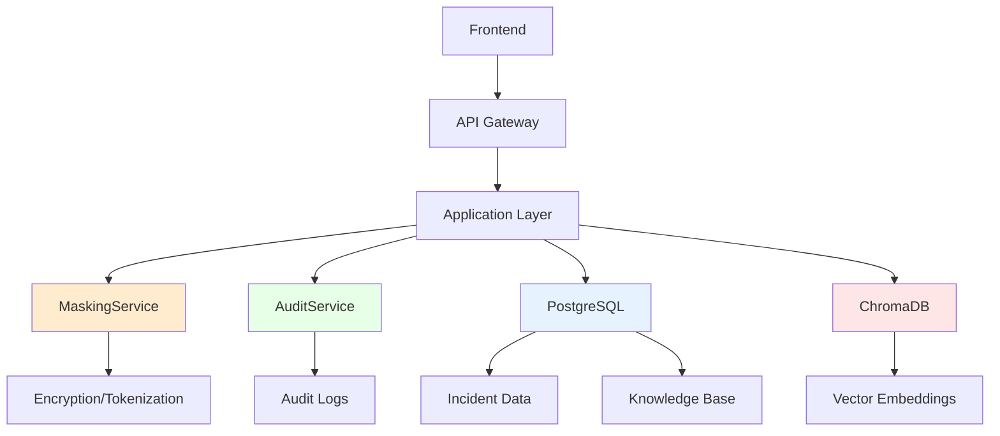

# Arquitetura de Dados - Sistema de Resolução de Incidentes Bancários

## Visão Geral

Este documento descreve a arquitetura de dados implementada para o Sistema de Resolução de Incidentes Bancários, incluindo estruturas de mascaramento, auditoria e compliance regulatório para LGPD, SOX e BACEN.

## Sumário

1. [Arquitetura Geral](#arquitetura-geral)
2. [Banco de Dados PostgreSQL](#banco-de-dados-postgresql)
3. [Sistema de Mascaramento](#sistema-de-mascaramento)
4. [Auditoria e Compliance](#auditoria-e-compliance)
5. [Vector Database (ChromaDB)](#vector-database-chromadb)
6. [Migração de Dados](#migração-de-dados)
7. [Backup e Restore](#backup-e-restore)
8. [Validação e Integridade](#validação-e-integridade)

## Arquitetura Geral

### Componentes Principais



### Fluxo de Dados

1. **Ingestão**: Dados chegam através da API
2. **Validação**: Verificação de integridade e formato
3. **Mascaramento**: Aplicação de políticas de proteção
4. **Armazenamento**: Persistência em PostgreSQL
5. **Indexação**: Criação de embeddings no ChromaDB
6. **Auditoria**: Registro de todas as operações

## Banco de Dados PostgreSQL

### Schemas

#### incident_system
Schema principal contendo dados de negócio:

- **business_areas**: Áreas de negócio bancário
- **technology_areas**: Áreas tecnológicas
- **application_modules**: Módulos de aplicação
- **incidents**: Incidentes reportados
- **knowledge_base**: Base de conhecimento
- **incident_resolution_steps**: Passos de resolução
- **ai_suggestions**: Sugestões de IA
- **vector_embeddings**: Metadados de embeddings

#### audit_system
Schema de auditoria para compliance:

- **audit_log**: Log geral de auditoria
- **data_masking_log**: Log específico de mascaramento

#### ml_system
Schema para machine learning:

- **classification_models**: Modelos de classificação
- **feedback_collection**: Coleta de feedback
- **ab_testing**: Testes A/B

### Estrutura de Dados Sensíveis

```sql
-- Exemplo: Tabela de incidentes com campos mascarados
CREATE TABLE incidents (
    id UUID PRIMARY KEY,
    incident_number VARCHAR(50) UNIQUE NOT NULL,
    title VARCHAR(500) NOT NULL,
    description TEXT NOT NULL,
    description_masked TEXT,  -- Versão mascarada para IA
    business_area_id INTEGER REFERENCES business_areas(id),
    reporter VARCHAR(100) NOT NULL,  -- Campo sensível
    assigned_to VARCHAR(100),        -- Campo sensível
    -- Campos de auditoria
    created_at TIMESTAMP DEFAULT CURRENT_TIMESTAMP,
    updated_at TIMESTAMP DEFAULT CURRENT_TIMESTAMP
);
```

## Sistema de Mascaramento

### MaskingService.js

Implementa 22 tipos de dados sensíveis bancários com 7 estratégias de mascaramento:

#### Tipos de Dados Sensíveis

| Tipo | Exemplo Original | Exemplo Mascarado | Estratégia | Reversível | Compliance |
|------|------------------|-------------------|------------|------------|------------|
| CPF | 12345678901 | 123.***.**1-** | Partial | Não | LGPD, BACEN |
| CNPJ | 12345678000195 | 12.***.***/**95-** | Partial | Não | LGPD, BACEN |
| Conta | 12345-6 | ACC_a1b2c3d4 | Tokenize | Sim | BACEN, SOX |
| Cartão | 1234567890123456 | 1234-****-****-3456 | Partial | Não | PCI-DSS |
| PIX | user@email.com | HASH_a1b2c3d4e5f6 | Hash | Não | BACEN, LGPD |
| Email | test@bank.com | te***om@bank.com | Partial | Não | LGPD |
| Telefone | 11999887766 | 119****7766 | Partial | Não | LGPD |
| Saldo | R$ 10.000,50 | R$ 8.543,21 | Synthetic | Não | BACEN, SOX |
| Nome | João Silva | João S*** | Partial | Não | LGPD |
| Senha | secret123 | [REDACTED] | Redact | Não | ALL |

#### Estratégias de Mascaramento

```javascript
const MASKING_STRATEGIES = {
    PARTIAL: 'partial',           // Exibe apenas parte dos dados
    HASH: 'hash',                 // Hash irreversível
    ENCRYPT: 'encrypt',           // Criptografia reversível
    TOKENIZE: 'tokenize',         // Tokenização
    SHUFFLE: 'shuffle',           // Embaralhamento
    SYNTHETIC: 'synthetic',       // Dados sintéticos
    REDACT: 'redact'             // Redação completa
};
```

#### Uso do MaskingService

```javascript
const maskingService = new MaskingService({
    encryptionKey: process.env.MASKING_ENCRYPTION_KEY,
    auditEnabled: true
});

// Mascaramento individual
const result = await maskingService.maskValue(
    '12345678901',
    SENSITIVE_DATA_TYPES.CPF,
    {
        entityType: 'incident',
        entityId: 'uuid',
        userId: 'user123'
    }
);

// Mascaramento de objeto
const incident = {
    title: 'Problema conta João Silva',
    description: 'CPF: 12345678901, Conta: 12345-6',
    reporter: 'Maria Santos'
};

const fieldTypes = {
    description: 'incident_description',
    reporter: SENSITIVE_DATA_TYPES.NAME
};

const masked = await maskingService.maskObject(incident, fieldTypes);
```

## Auditoria e Compliance

### AuditService.js

Sistema completo de auditoria para compliance bancário:

#### Tipos de Eventos

```javascript
const AUDIT_EVENT_TYPES = {
    // Acesso a dados
    DATA_ACCESS: 'data_access',
    DATA_VIEW: 'data_view',
    DATA_SEARCH: 'data_search',
    DATA_EXPORT: 'data_export',

    // Modificações
    DATA_CREATE: 'data_create',
    DATA_UPDATE: 'data_update',
    DATA_DELETE: 'data_delete',
    DATA_MASK: 'data_mask',
    DATA_UNMASK: 'data_unmask',

    // Compliance
    COMPLIANCE_CHECK: 'compliance_check',
    POLICY_VIOLATION: 'policy_violation'
};
```

#### Níveis de Sensibilidade

```javascript
const DATA_SENSITIVITY_LEVELS = {
    PUBLIC: 'public',           // Dados públicos
    INTERNAL: 'internal',       // Dados internos
    CONFIDENTIAL: 'confidential', // Dados confidenciais
    RESTRICTED: 'restricted'    // Dados restritos
};
```

#### Compliance Flags

```javascript
const COMPLIANCE_FLAGS = {
    LGPD: 'LGPD',       // Lei Geral de Proteção de Dados
    SOX: 'SOX',         // Sarbanes-Oxley Act
    BACEN: 'BACEN',     // Banco Central do Brasil
    PCI_DSS: 'PCI-DSS', // Payment Card Industry
    GDPR: 'GDPR'        // General Data Protection Regulation
};
```

#### Registro de Auditoria

```javascript
await auditService.logEvent({
    action: AUDIT_EVENT_TYPES.DATA_MASK,
    entityType: 'incident',
    entityId: 'uuid',
    userId: 'user123',
    details: {
        field: 'description',
        strategy: 'partial',
        reversible: false
    },
    dataSensitivity: DATA_SENSITIVITY_LEVELS.CONFIDENTIAL,
    complianceFlags: [COMPLIANCE_FLAGS.LGPD, COMPLIANCE_FLAGS.BACEN]
});
```

### Retenção de Dados

| Tipo | Retenção | Compliance |
|------|----------|------------|
| Audit Log | 7 anos | SOX |
| Masking Log | 3 anos | LGPD |
| Compliance Reports | 10 anos | BACEN |

## Vector Database (ChromaDB)

### Configuração

```javascript
const vectorDb = new VectorDatabase({
    connection: {
        host: 'localhost',
        port: 8000,
        persistDirectory: './data/chroma'
    },
    collections: {
        banking_knowledge: 'banking_knowledge',
        fraud_patterns: 'fraud_patterns',
        compliance_docs: 'compliance_documents',
        risk_models: 'risk_models'
    }
});
```

### Collections Bancárias

| Collection | Descrição | Uso |
|------------|-----------|-----|
| banking_knowledge | Base de conhecimento | Busca semântica |
| fraud_patterns | Padrões de fraude | Detecção |
| compliance_docs | Documentos compliance | Referência |
| risk_models | Modelos de risco | Análise |
| customer_profiles | Perfis de cliente | Personalização |
| transaction_patterns | Padrões transacionais | Análise |

### Estrutura de Documentos

```javascript
const document = {
    id: 'kb-001',
    content: 'Texto completo do documento',
    embedding: [0.1, 0.2, ...], // Vector 384D
    metadata: {
        type: 'knowledge',
        business_area: 'retail-banking',
        tags: ['pix', 'problema', 'resolução'],
        created_at: '2025-01-15T10:30:00Z',
        compliance_level: 'internal'
    }
};
```

## Migração de Dados

### DataMigrationService

Script completo para migração SQLite → PostgreSQL:

#### Processo de Migração

1. **Backup**: Cria backup dos dados originais
2. **Validação**: Verifica integridade e compatibilidade
3. **Transformação**: Converte formatos e aplica mascaramento
4. **Migração**: Transfere dados em batches
5. **Embeddings**: Preserva embeddings existentes
6. **Validação**: Verifica integridade pós-migração

#### Uso

```bash
# Migração completa
node scripts/migrate-data.js

# Dry run (sem persistir)
node scripts/migrate-data.js --dry-run

# Sem mascaramento
node scripts/migrate-data.js --no-masking

# Sem embeddings
node scripts/migrate-data.js --no-embeddings
```

#### Mapeamento de Campos Sensíveis

```javascript
const fieldMappings = {
    knowledge_base: {
        title: SENSITIVE_DATA_TYPES.NAME,
        content: 'content_text',
        author: SENSITIVE_DATA_TYPES.NAME,
        approver: SENSITIVE_DATA_TYPES.NAME
    },
    incidents: {
        title: 'incident_title',
        description: 'incident_description',
        assigned_to: SENSITIVE_DATA_TYPES.NAME,
        reporter: SENSITIVE_DATA_TYPES.NAME
    }
};
```

## Backup e Restore

### BackupRestoreService

Sistema seguro de backup com criptografia:

#### Características

- **Criptografia**: AES-256-GCM para dados sensíveis
- **Compressão**: GZIP para otimização de espaço
- **Verificação**: Checksums SHA-256 para integridade
- **Compliance**: Retenção conforme regulamentações

#### Estrutura do Backup

```
backup-2025-01-15T10-30-00-abc123/
├── database/
│   ├── incident_system.sql
│   ├── incidents_masked.json
│   ├── incidents_original.enc
│   └── sensitive/
├── embeddings/
│   ├── banking_knowledge.json
│   └── fraud_patterns.json
├── audit/
│   └── audit_report.json
└── metadata.json
```

#### Uso

```bash
# Criar backup
node scripts/backup-restore.js backup

# Restaurar backup
node scripts/backup-restore.js restore /path/to/backup.tar.gz
```

#### Políticas de Retenção

```javascript
retention: {
    daily: 30,      // 30 backups diários
    weekly: 12,     // 12 backups semanais
    monthly: 24,    // 24 backups mensais
    yearly: 7       // 7 backups anuais
}
```

## Validação e Integridade

### Testes de Compliance

```javascript
// Teste de mascaramento LGPD
test('should validate LGPD requirements', async () => {
    const personalData = {
        name: 'João Silva',
        cpf: '12345678901',
        email: 'joao@example.com'
    };

    const result = await maskingService.maskObject(personalData, fieldTypes);

    // Verifica se todos os campos foram mascarados
    expect(result.maskedObject.name).not.toBe(personalData.name);

    // Verifica compliance LGPD
    Object.values(result.maskingResults).forEach(maskResult => {
        expect(maskResult.compliance).toContain('LGPD');
    });
});
```

### Validações Automáticas

1. **Integridade Referencial**: Verifica foreign keys
2. **Constraints Únicos**: Valida unicidade
3. **Performance**: Testa throughput de mascaramento
4. **Embeddings**: Valida storage e busca
5. **Auditoria**: Verifica logs completos

### Métricas de Performance

| Operação | Threshold | Métrica |
|----------|-----------|---------|
| Mascaramento | >20 reg/sec | Throughput |
| Backup | <2h completo | Duração |
| Restore | <1h completo | Duração |
| Busca Vector | <100ms | Latência |
| Auditoria | <50ms/evento | Latência |

## Configuração de Ambiente

### Variáveis de Ambiente

```bash
# Banco de Dados
DB_HOST=localhost
DB_PORT=5432
DB_NAME=incident_system
DB_USER=ai_app_user
DB_PASSWORD=secure_password

# Mascaramento
MASKING_ENCRYPTION_KEY=32-character-encryption-key
MASKING_TOKEN_SALT=secure-salt-string

# Auditoria
AUDIT_ENCRYPTION_KEY=32-character-audit-key

# ChromaDB
CHROMA_HOST=localhost
CHROMA_PORT=8000
CHROMA_PERSIST_DIRECTORY=./data/chroma

# Backup
BACKUP_ENCRYPTION_KEY=32-character-backup-key
```

### Inicialização

```bash
# Inicializar banco PostgreSQL
psql -h localhost -U ai_app_user -d incident_system -f scripts/init-db.sql

# Inicializar ChromaDB
docker run -d --name chromadb -p 8000:8000 \
  -v ./data/chroma:/chroma/chroma \
  chromadb/chroma:latest

# Executar migração
node scripts/migrate-data.js

# Executar testes
npm test tests/data-integrity/
```

## Monitoramento e Alertas

### Métricas Críticas

1. **Taxa de Falha de Mascaramento**: <0.1%
2. **Violações de Compliance**: Zero tolerância
3. **Tempo de Backup**: <2 horas
4. **Integridade de Dados**: 100%
5. **Disponibilidade**: 99.9%

### Alertas Automáticos

- Falha de mascaramento
- Violação de compliance detectada
- Backup falhou
- Perda de integridade de dados
- Acesso não autorizado a dados sensíveis

## Roadmap

### Próximas Implementações

1. **Criptografia Homomórfica**: Computação sobre dados criptografados
2. **Zero-Knowledge Proofs**: Validação sem exposição
3. **Blockchain Audit**: Auditoria imutável
4. **AI/ML Privacy**: Differential privacy
5. **Multi-tenancy**: Isolamento por cliente

### Melhorias Planejadas

1. **Performance**: Otimização de queries
2. **Escalabilidade**: Sharding de dados
3. **Automação**: CI/CD para compliance
4. **Monitoring**: Dashboards em tempo real
5. **Recovery**: RTO/RPO < 1h

---

**Documento mantido por**: Equipe de Data Architecture
**Última atualização**: 2025-01-15
**Versão**: 2.0.0
**Compliance**: LGPD, SOX, BACEN