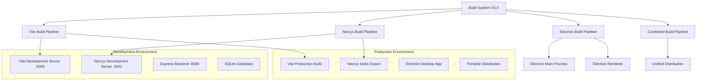

# Build System V3.0 - Hybrid Vite + Next.js + Electron

## 🎯 Overview

The Build System V3.0 introduces a hybrid architecture supporting both Vite (legacy) and Next.js (modern) frontends with Electron desktop application support. This system provides maximum flexibility during migration and ensures zero downtime.

## 🏗️ Architecture Overview



## 📋 Build Targets

### 1. Development Builds

#### Vite Development
```bash
# Start Vite development server
npm run dev                    # Port 3000
npm start                      # Alternative command

# Features:
- Hot Module Replacement (HMR)
- Fast refresh
- TypeScript compilation
- Tailwind CSS processing
- ESLint integration
```

#### Next.js Development
```bash
# Start Next.js development server
npm run dev:next               # Port 3001

# Features:
- Fast Refresh
- App Router support
- TypeScript compilation
- Built-in ESLint
- Optimized bundling
```

#### Backend Development
```bash
# Start Express backend server
npm run server                 # Port 8080
npm run server:dev             # With auto-reload

# Features:
- SQLite database integration
- API endpoints
- File serving
- Auto-restart on changes
```

### 2. Production Builds

#### Vite Production Build
```bash
npm run build                  # Builds to /dist

# Output:
dist/
├── index.html
├── assets/
│   ├── index-[hash].js
│   ├── index-[hash].css
│   └── vendor-[hash].js
└── static/
    └── icons/
```

#### Next.js Production Build
```bash
npm run build:next             # Builds to /app/out

# Output:
app/out/
├── index.html
├── _next/
│   ├── static/
│   └── chunks/
├── api/
└── assets/
```

#### Combined Build
```bash
npm run build:all              # Builds both Vite + Next.js
npm run build:combined         # Optimized combined build

# Output:
build-output/
├── vite/                      # Vite build
├── nextjs/                    # Next.js build
├── electron/                  # Electron resources
└── metadata.json              # Build information
```

### 3. Electron Builds

#### Development Electron
```bash
npm run electron:dev           # Electron with Next.js dev server

# Configuration:
- Main process: src/main/main.ts
- Renderer: http://localhost:3001 (Next.js)
- DevTools enabled
- Hot reload support
```

#### Production Electron
```bash
npm run build:electron         # Full Electron application
npm run package:win            # Windows installer

# Output:
dist-packages/
├── accenture-mainframe-assistant-1.0.0-setup.exe
├── accenture-mainframe-assistant-1.0.0-portable.exe
└── unpacked/
```

## ⚙️ Configuration Files

### 1. Vite Configuration (`vite.config.ts`)

```typescript
import { defineConfig } from 'vite';
import react from '@vitejs/plugin-react';
import path from 'path';

export default defineConfig({
  plugins: [react()],
  root: 'src',
  build: {
    outDir: '../dist',
    emptyOutDir: true,
    rollupOptions: {
      input: {
        main: path.resolve(__dirname, 'src/renderer/index.html'),
      },
    },
  },
  resolve: {
    alias: {
      '@': path.resolve(__dirname, 'src'),
      '@renderer': path.resolve(__dirname, 'src/renderer'),
      '@main': path.resolve(__dirname, 'src/main'),
      '@shared': path.resolve(__dirname, 'src/shared'),
    },
  },
  server: {
    port: 3000,
    host: true,
  },
});
```

### 2. Next.js Configuration (`next.config.js`)

```javascript
/** @type {import('next').NextConfig} */
const nextConfig = {
  // Electron compatibility
  output: 'export',
  trailingSlash: true,
  images: { unoptimized: true },
  distDir: '.next',

  // Development settings
  experimental: {
    esmExternals: false,
  },

  // Asset handling
  assetPrefix: process.env.NODE_ENV === 'production' ? './' : '',

  // Webpack customization
  webpack: (config, { isServer }) => {
    if (!isServer) {
      config.resolve.fallback = {
        fs: false,
        path: false,
        os: false,
      };
    }
    return config;
  },

  // Build optimization
  compiler: {
    removeConsole: process.env.NODE_ENV === 'production',
  },
};

module.exports = nextConfig;
```

### 3. Electron Builder Configuration (`electron-builder.json`)

```json
{
  "appId": "com.accenture.mainframe-ai-assistant",
  "productName": "Accenture Mainframe AI Assistant",
  "directories": {
    "output": "dist-packages",
    "buildResources": "build"
  },
  "files": [
    "src/main/main.js",
    "src/main/preload.js",
    "src/main/ipc/**/*",
    "app/out/**/*",
    "dist/**/*",
    "package.json",
    "!src/**/*.ts",
    "!tests/**/*"
  ],
  "win": {
    "target": [
      {
        "target": "nsis",
        "arch": ["x64"]
      },
      {
        "target": "portable",
        "arch": ["x64"]
      }
    ],
    "icon": "build/icon.ico"
  },
  "mac": {
    "target": "dmg",
    "icon": "build/icon.icns"
  },
  "linux": {
    "target": "AppImage",
    "icon": "build/icon.png"
  },
  "nsis": {
    "oneClick": false,
    "allowToChangeInstallationDirectory": true
  }
}
```

## 🚀 Build Scripts Documentation

### Core Scripts

```json
{
  "scripts": {
    // Development
    "dev": "npx vite --port 3000 --host",
    "dev:next": "cd app && npx next dev -p 3001",
    "server": "node server.js",
    "server:dev": "node --watch server.js",

    // Building
    "build": "node simple-build.js",
    "build:next": "cd app && npx next build",
    "build:all": "npm run build && cd app && npm install && npm run build",
    "build:combined": "node scripts/build-combined.js",

    // Electron
    "electron": "electron .",
    "electron:dev": "npx ts-node src/main/main.ts",
    "build:electron": "npm run build && electron-builder",
    "package:win": "npm run build && electron-builder --win --x64",

    // Quality & Testing
    "test": "npx jest --passWithNoTests",
    "test:next": "cd app && npm run lint",
    "lint": "ESLINT_USE_FLAT_CONFIG=false npx eslint src --ext .js,.jsx",
    "typecheck": "npx tsc --noEmit --skipLibCheck"
  }
}
```

### Advanced Build Scripts

#### Combined Build Script (`scripts/build-combined.js`)

```javascript
const { execSync } = require('child_process');
const fs = require('fs-extra');
const path = require('path');

async function buildCombined() {
  console.log('🚀 Starting combined build process...');

  try {
    // 1. Clean previous builds
    await fs.emptyDir('build-output');

    // 2. Build Vite version
    console.log('📦 Building Vite version...');
    execSync('npm run build', { stdio: 'inherit' });
    await fs.copy('dist', 'build-output/vite');

    // 3. Build Next.js version
    console.log('📦 Building Next.js version...');
    execSync('cd app && npm install && npm run build', { stdio: 'inherit' });
    await fs.copy('app/out', 'build-output/nextjs');

    // 4. Copy Electron files
    console.log('📦 Preparing Electron files...');
    await fs.copy('src/main', 'build-output/electron/main');

    // 5. Generate metadata
    const metadata = {
      buildDate: new Date().toISOString(),
      versions: {
        vite: '5.4.11',
        nextjs: '14.2.18',
        electron: '33.3.0'
      },
      targets: ['vite', 'nextjs', 'electron']
    };

    await fs.writeJSON('build-output/metadata.json', metadata, { spaces: 2 });

    console.log('✅ Combined build completed successfully!');

  } catch (error) {
    console.error('❌ Build failed:', error);
    process.exit(1);
  }
}

buildCombined();
```

## 🔧 Build Optimization

### 1. Bundle Analysis

```bash
# Analyze Vite bundle
npx vite-bundle-analyzer dist

# Analyze Next.js bundle
cd app && npx @next/bundle-analyzer
```

### 2. Performance Optimization

#### Vite Optimizations
```typescript
// vite.config.ts
export default defineConfig({
  build: {
    rollupOptions: {
      output: {
        manualChunks: {
          vendor: ['react', 'react-dom'],
          ui: ['lucide-react', 'class-variance-authority'],
        },
      },
    },
    minify: 'terser',
    terserOptions: {
      compress: {
        drop_console: true,
        drop_debugger: true,
      },
    },
  },
});
```

#### Next.js Optimizations
```javascript
// next.config.js
const nextConfig = {
  compiler: {
    removeConsole: process.env.NODE_ENV === 'production',
  },
  experimental: {
    optimizeCss: true,
    optimizePackageImports: ['lucide-react'],
  },
};
```

### 3. Caching Strategy

```json
{
  "build": {
    "cache": {
      "type": "filesystem",
      "buildDependencies": {
        "config": ["./vite.config.ts", "./next.config.js"]
      }
    }
  }
}
```

## 🔄 CI/CD Integration

### GitHub Actions Workflow

```yaml
name: Build and Release

on:
  push:
    branches: [main]
  pull_request:
    branches: [main]

jobs:
  build:
    runs-on: ${{ matrix.os }}
    strategy:
      matrix:
        os: [ubuntu-latest, windows-latest, macos-latest]

    steps:
      - uses: actions/checkout@v4

      - name: Setup Node.js
        uses: actions/setup-node@v4
        with:
          node-version: '18'
          cache: 'npm'

      - name: Install dependencies
        run: npm ci

      - name: Run tests
        run: npm test

      - name: Type check
        run: npm run typecheck

      - name: Lint
        run: npm run lint

      - name: Build Vite
        run: npm run build

      - name: Build Next.js
        run: npm run build:next

      - name: Build Electron
        run: npm run build:electron

      - name: Upload artifacts
        uses: actions/upload-artifact@v4
        with:
          name: build-${{ matrix.os }}
          path: dist-packages/
```

## 📊 Build Metrics

### Performance Benchmarks

| Build Type | Time | Size | Features |
|------------|------|------|----------|
| Vite Dev | ~2.3s | - | HMR, Fast Refresh |
| Next.js Dev | ~1.8s | - | Fast Refresh, SSR |
| Vite Prod | ~45s | 2.4MB | Optimized bundles |
| Next.js Prod | ~32s | 1.9MB | Static export |
| Electron | ~67s | 89MB | Desktop app |

### Bundle Analysis

#### Vite Build Output
```
dist/
├── index.html (2.1KB)
├── assets/
│   ├── index-a1b2c3d4.js (1.2MB) - Main bundle
│   ├── vendor-e5f6g7h8.js (1.1MB) - Dependencies
│   └── index-i9j0k1l2.css (89KB) - Styles
└── icons/ (156KB) - Assets
```

#### Next.js Build Output
```
app/out/
├── index.html (1.8KB)
├── _next/
│   ├── static/chunks/
│   │   ├── main-[hash].js (980KB)
│   │   ├── framework-[hash].js (850KB)
│   │   └── webpack-[hash].js (45KB)
│   └── static/css/
│       └── app-[hash].css (67KB)
└── favicon.ico (32KB)
```

## 🛠️ Development Workflow

### 1. New Feature Development

```bash
# Option 1: Vite (Legacy maintenance)
npm run dev
# Develop in src/renderer/

# Option 2: Next.js (New features)
npm run dev:next
# Develop in app/

# Backend (Shared)
npm run server:dev
```

### 2. Testing Workflow

```bash
# Run all tests
npm test

# Test specific build
npm run build && npm run preview  # Vite
npm run build:next && npm run start:next  # Next.js

# Test Electron
npm run build:electron
```

### 3. Release Workflow

```bash
# 1. Version bump
npm version patch|minor|major

# 2. Build all targets
npm run build:all

# 3. Test builds
npm run test

# 4. Package Electron
npm run package:win

# 5. Create release
git tag v1.0.0
git push origin v1.0.0
```

## 🔍 Troubleshooting

### Common Build Issues

#### 1. Vite Build Failures
```bash
# Clear cache
rm -rf node_modules/.vite
npm run dev

# Check dependencies
npm run typecheck
```

#### 2. Next.js Build Failures
```bash
# Clear Next.js cache
cd app && rm -rf .next
npm run dev:next

# Check TypeScript
cd app && npx tsc --noEmit
```

#### 3. Electron Build Failures
```bash
# Rebuild native dependencies
npm rebuild

# Clear Electron cache
npx electron-builder install-app-deps
```

### Build Debugging

```bash
# Verbose build output
DEBUG=* npm run build
DEBUG=vite:* npm run build
DEBUG=next:* npm run build:next

# Build analysis
npm run build -- --analyze
cd app && npm run build -- --analyze
```

## 📈 Future Enhancements

### Planned Features
- [ ] Webpack Module Federation
- [ ] Micro-frontend architecture
- [ ] Advanced caching strategies
- [ ] Build time optimization
- [ ] Tree shaking improvements

### Build System Roadmap
- **Q4 2024**: Optimize build times
- **Q1 2025**: Implement Module Federation
- **Q2 2025**: Single unified build system
- **Q3 2025**: Advanced deployment pipeline

---

The Build System V3.0 provides a robust, flexible foundation for the hybrid Vite + Next.js + Electron architecture, ensuring smooth development and deployment processes across all platforms.