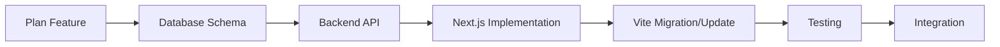

# Developer Workflow V3.0 - Hybrid Development Guide

## 🎯 Overview

The Developer Workflow V3.0 introduces a hybrid development approach supporting both Vite (legacy) and Next.js (modern) frontends. This guide provides comprehensive workflows for different development scenarios and team roles.

## 🔄 Development Modes

### Mode Selection Guide

| Scenario | Recommended Mode | Reason |
|----------|------------------|---------|
| New Features | Next.js | Modern architecture, better DX |
| Bug Fixes | Match existing code | Maintain consistency |
| Legacy Maintenance | Vite | Preserve existing patterns |
| Performance Optimization | Both | Compare implementations |
| Learning/Training | Next.js | Future-focused development |

## 🚀 Development Workflows

### 1. New Feature Development (Next.js)

#### Initial Setup
```bash
# 1. Create feature branch
git checkout -b feature/new-incident-dashboard

# 2. Start Next.js development environment
npm run dev:next
# Available at: http://localhost:3001

# 3. Start backend server
npm run server:dev
# API available at: http://localhost:8080
```

#### Development Process
```bash
# 4. Create Next.js component
mkdir -p app/components/dashboard
touch app/components/dashboard/IncidentDashboard.tsx

# 5. Add to App Router
mkdir -p app/(dashboard)/incidents
touch app/(dashboard)/incidents/page.tsx

# 6. Implement with Electron integration
# Use hooks: useElectron, useDatabase
```

#### Code Structure
```typescript
// app/components/dashboard/IncidentDashboard.tsx
'use client'
import { useDatabase } from '@/hooks/useDatabase';
import { useElectron } from '@/hooks/useElectron';

export default function IncidentDashboard() {
  const { getIncidents, createIncident } = useDatabase();
  const { isElectron } = useElectron();

  // Component implementation
  return <div>Incident Dashboard</div>;
}
```

#### Testing & Validation
```bash
# 7. Run type checking
npm run typecheck

# 8. Run linting
npm run lint

# 9. Test in Electron
npm run electron:dev

# 10. Build verification
npm run build:next
```

### 2. Legacy Maintenance (Vite)

#### Setup for Legacy Code
```bash
# 1. Create maintenance branch
git checkout -b fix/vite-search-bug

# 2. Start Vite development
npm run dev
# Available at: http://localhost:3000

# 3. Start backend server
npm run server:dev
```

#### Development Process
```bash
# 4. Locate existing component
find src/renderer -name "*Search*" -type f

# 5. Edit existing component
code src/renderer/components/search/SearchInterface.tsx

# 6. Test changes
npm run test:watch
```

#### Validation
```bash
# 7. Build Vite version
npm run build

# 8. Test in Electron
npm run electron:dev

# 9. Verify no regressions
npm test
```

### 3. Full-Stack Feature Development

#### Multi-Terminal Setup
```bash
# Terminal 1: Next.js Frontend
npm run dev:next

# Terminal 2: Vite Frontend (for comparison)
npm run dev

# Terminal 3: Backend Server
npm run server:dev

# Terminal 4: Database operations
sqlite3 kb-assistant.db
```

#### Development Flow


#### Implementation Steps
1. **Database Changes**
```bash
# Create migration
touch src/database/migrations/004_add_feature.sql

# Test migration
node src/database/migrate.js
```

2. **Backend API**
```bash
# Add Express routes
code src/main/ipc-handlers.ts

# Add service methods
code src/services/FeatureService.ts
```

3. **Next.js Implementation**
```bash
# Create API route
touch app/api/feature/route.ts

# Create component
touch app/components/Feature.tsx

# Add page
touch app/(dashboard)/feature/page.tsx
```

4. **Vite Integration** (if needed)
```bash
# Update existing component
code src/renderer/components/Feature.tsx

# Add route
code src/renderer/routes/AppRouter.tsx
```

## 🧪 Testing Workflows

### Unit Testing

#### Jest Configuration (Shared)
```bash
# Run all tests
npm test

# Run specific test file
npm test -- SearchInterface.test.tsx

# Run tests with coverage
npm test -- --coverage

# Watch mode
npm run test:watch
```

#### Next.js Specific Testing
```bash
# Next.js linting
npm run test:next

# Next.js build test
npm run build:next
```

### Integration Testing

#### Cross-Mode Testing
```bash
# Test feature in both modes
npm run dev &          # Vite mode
npm run dev:next &     # Next.js mode
npm run server:dev &   # Backend

# Manual testing checklist:
# □ Feature works in Vite mode
# □ Feature works in Next.js mode
# □ Electron integration functional
# □ Database operations consistent
```

#### E2E Testing with Playwright
```bash
# Install Playwright
npm install --save-dev @playwright/test

# Run E2E tests
npx playwright test

# Test specific mode
npx playwright test --grep "vite"
npx playwright test --grep "nextjs"
```

### Performance Testing

#### Build Performance
```bash
# Compare build times
time npm run build        # Vite build
time npm run build:next   # Next.js build

# Bundle analysis
npm run build -- --analyze
cd app && npm run build -- --analyze
```

#### Runtime Performance
```bash
# Lighthouse audit
npm install -g lighthouse

# Test both modes
lighthouse http://localhost:3000 --output=json --output-path=./reports/vite-lighthouse.json
lighthouse http://localhost:3001 --output=json --output-path=./reports/nextjs-lighthouse.json
```

## 🔄 Git Workflows

### Branch Strategy

```bash
# Feature branches
feature/nextjs-new-feature    # Next.js features
feature/vite-enhancement      # Vite enhancements
feature/shared-improvement    # Cross-platform features

# Maintenance branches
fix/vite-bug                  # Vite-specific fixes
fix/nextjs-issue             # Next.js-specific fixes
fix/shared-problem           # Shared code fixes

# Release branches
release/v3.0.0               # Version releases
```

### Commit Conventions

```bash
# Next.js specific
feat(nextjs): add incident dashboard component
fix(nextjs): resolve routing issue in app router

# Vite specific
feat(vite): enhance search performance
fix(vite): correct component import paths

# Shared/Cross-platform
feat(shared): add unified database service
fix(electron): resolve IPC communication issue
feat(deps): upgrade React to 18.3.1

# Documentation
docs(api): update API documentation for v3.0
docs(setup): add hybrid development guide
```

### Pull Request Workflow

#### PR Template
```markdown
## 🎯 Purpose
Brief description of changes

## 🏗️ Architecture Impact
- [ ] Affects Vite frontend
- [ ] Affects Next.js frontend
- [ ] Affects shared components
- [ ] Affects Electron main process
- [ ] Affects backend API
- [ ] Affects database schema

## ✅ Testing Checklist
- [ ] Unit tests pass
- [ ] Vite mode functional
- [ ] Next.js mode functional
- [ ] Electron integration works
- [ ] Database operations tested
- [ ] Performance impact assessed

## 📱 Screenshots
Before/After screenshots for UI changes

## 🚀 Deployment Notes
Any special deployment considerations
```

#### Review Process
1. **Automated Checks**
   - TypeScript compilation
   - ESLint validation
   - Unit tests
   - Build verification

2. **Manual Review**
   - Code quality
   - Architecture consistency
   - Performance impact
   - Documentation updates

3. **Testing**
   - Feature functionality
   - Cross-mode compatibility
   - Electron integration
   - No regressions

## 🚀 Deployment Workflows

### Development Deployment

#### Local Testing
```bash
# Build all versions
npm run build:all

# Test Electron build
npm run build:electron

# Verify distributions
ls -la dist/
ls -la app/out/
ls -la dist-packages/
```

#### Staging Deployment
```bash
# Build for staging
NODE_ENV=staging npm run build:all

# Package for testing
npm run package:win

# Deploy to staging server
scp -r dist/ staging-server:/var/www/staging/
```

### Production Deployment

#### Release Process
```bash
# 1. Version bump
npm version minor

# 2. Update changelog
code CHANGELOG.md

# 3. Build production
NODE_ENV=production npm run build:all

# 4. Run security audit
npm run deps:audit

# 5. Package all platforms
npm run package:win
npm run package:mac
npm run package:linux

# 6. Create release
git tag v3.0.0
git push origin v3.0.0

# 7. Deploy to distribution
./scripts/deploy-production.sh
```

## 🎭 Team Collaboration

### Role-Based Workflows

#### Frontend Developer (Next.js Focus)
```bash
# Daily workflow
npm run dev:next
npm run server:dev

# Development tools
- VS Code with Next.js extensions
- React DevTools
- Tailwind CSS IntelliSense

# Responsibilities
- New feature development in Next.js
- Component library maintenance
- Performance optimization
- Modern React patterns
```

#### Frontend Developer (Vite Maintenance)
```bash
# Daily workflow
npm run dev
npm run server:dev

# Development tools
- VS Code with React extensions
- React DevTools
- Vite DevTools

# Responsibilities
- Legacy code maintenance
- Bug fixes in Vite mode
- Migration planning
- Backward compatibility
```

#### Full-Stack Developer
```bash
# Daily workflow
npm run dev:next &
npm run server:dev &

# Development tools
- Database GUI (DB Browser for SQLite)
- API testing (Postman/Insomnia)
- DevTools for both modes

# Responsibilities
- Database schema changes
- Backend API development
- Cross-platform features
- Integration testing
```

#### QA Engineer
```bash
# Testing workflow
npm run build:all
npm run test
npm run electron:dev

# Testing tools
- Playwright for E2E
- Manual testing in both modes
- Performance monitoring

# Responsibilities
- Cross-mode testing
- Regression testing
- Performance validation
- Bug verification
```

### Code Review Guidelines

#### Review Checklist
- [ ] **Architecture**: Follows hybrid patterns
- [ ] **Performance**: No negative impact
- [ ] **Security**: Follows security guidelines
- [ ] **Testing**: Adequate test coverage
- [ ] **Documentation**: Updated if needed
- [ ] **Compatibility**: Works in both modes

#### Review Focus Areas
1. **Next.js Reviews**: App Router usage, hooks, performance
2. **Vite Reviews**: Component patterns, routing, compatibility
3. **Shared Code**: TypeScript types, services, utilities
4. **Electron**: IPC security, preload scripts
5. **Database**: Query optimization, schema changes

## 📊 Development Metrics

### Performance Monitoring

#### Build Metrics
```bash
# Track build times
echo "Vite build: $(time npm run build 2>&1 | grep real)"
echo "Next.js build: $(time npm run build:next 2>&1 | grep real)"

# Track bundle sizes
du -sh dist/
du -sh app/out/
```

#### Development Metrics
- Hot reload time (Vite vs Next.js)
- TypeScript compilation speed
- Test execution time
- Code coverage percentage

### Code Quality Metrics

#### Automated Tracking
```bash
# Lines of code
find src/ -name "*.ts" -o -name "*.tsx" | xargs wc -l
find app/ -name "*.ts" -o -name "*.tsx" | xargs wc -l

# Complexity analysis
npx complexity-report src/
npx complexity-report app/

# Technical debt
npm run lint -- --format=json > lint-report.json
```

## 🔮 Future Workflow Evolution

### Migration Planning

#### Phase 1: Parallel Development (Current)
- Maintain both Vite and Next.js
- New features in Next.js
- Bug fixes in respective modes

#### Phase 2: Next.js Priority (Q1 2025)
- Migrate core components to Next.js
- Reduce Vite maintenance
- Focus on Next.js optimization

#### Phase 3: Unified Architecture (Q2 2025)
- Single Next.js implementation
- Remove Vite dependencies
- Streamlined workflows

### Tooling Improvements

#### Planned Enhancements
- [ ] Automated mode switching
- [ ] Cross-mode component generator
- [ ] Unified testing framework
- [ ] Performance monitoring dashboard
- [ ] Automated migration tools

---

The Developer Workflow V3.0 provides comprehensive guidance for teams working with the hybrid architecture, ensuring productive development while maintaining code quality and performance standards.