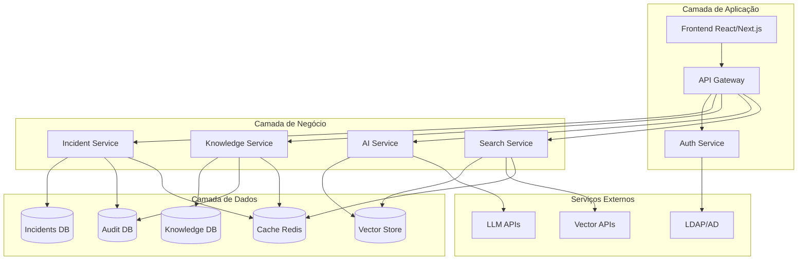

# Arquitetura de Dados - Sistema de Resolução de Incidentes com IA

## 📋 Visão Geral

Este documento define a arquitetura de dados necessária para um sistema bancário de resolução de incidentes assistida por IA, integrando gestão de incidentes multi-área com knowledge base inteligente e capacidades de busca semântica.

**Versão**: 1.0.0
**Data**: 22 de Setembro de 2024
**Contexto**: Sistema bancário multi-área (mainframe, cloud, mobile, web, database, network)
**Tecnologias**: SQLite/PostgreSQL, Vector Search, LLM Integration

---

## 🎯 Objetivos da Arquitetura

### Requisitos Funcionais
1. **Gestão Multi-Área**: Suporte para todas as áreas tecnológicas bancárias
2. **Knowledge Base Integrada**: Repositório inteligente de soluções
3. **Busca Semântica**: Similarity search com embeddings
4. **Mascaramento de Dados**: Proteção de informações sensíveis
5. **Auditoria Completa**: Rastreabilidade total de operações
6. **Resolução Assistida**: Integração com LLMs para sugestões

### Requisitos Não-Funcionais
1. **Performance**: Busca sub-segundo mesmo com 100k+ incidentes
2. **Escalabilidade**: Suporte a múltiplas unidades de negócio
3. **Segurança**: Compliance bancário e LGPD
4. **Disponibilidade**: 99.9% uptime
5. **Backup/Recovery**: RTO < 4h, RPO < 15min

---

## 🏗️ Arquitetura Geral



---

## 📊 Modelo de Dados Principal

### 1. Schema Unificado de Incidentes

```sql
-- Tabela principal unificada para incidentes e knowledge
CREATE TABLE entries (
    -- Identificação primária
    id UUID PRIMARY KEY DEFAULT gen_random_uuid(),
    entry_type VARCHAR(20) NOT NULL CHECK(entry_type IN ('incident', 'knowledge')),

    -- Conteúdo principal
    title VARCHAR(500) NOT NULL,
    description TEXT NOT NULL,
    solution TEXT,

    -- Classificação bancária específica
    business_area VARCHAR(50) NOT NULL CHECK(business_area IN (
        'mainframe', 'cloud', 'mobile', 'web', 'database',
        'network', 'security', 'payments', 'core_banking',
        'channels', 'middleware', 'batch_processing'
    )),
    application_module VARCHAR(100), -- Módulo bancário específico
    affected_systems JSONB DEFAULT '[]', -- Array de sistemas afetados

    -- Categorização e severidade
    category VARCHAR(100) NOT NULL,
    subcategory VARCHAR(100),
    severity VARCHAR(20) NOT NULL CHECK(severity IN ('low', 'medium', 'high', 'critical')),
    tags JSONB DEFAULT '[]',

    -- Status e workflow
    status VARCHAR(30) DEFAULT 'active' CHECK(status IN ('active', 'inactive', 'archived')),

    -- Campos específicos de incidentes
    incident_status VARCHAR(30) CHECK(incident_status IN (
        'aberto', 'triagem', 'em_analise', 'em_desenvolvimento',
        'em_teste', 'aguardando_aprovacao', 'resolvido', 'cancelado'
    )),
    priority INTEGER CHECK(priority BETWEEN 1 AND 5), -- 1=crítico, 5=baixo
    assigned_to VARCHAR(100),
    assigned_team VARCHAR(100),
    reporter VARCHAR(100),
    customer_impact BOOLEAN DEFAULT FALSE,
    estimated_users_affected INTEGER,

    -- SLA e controle temporal
    sla_deadline TIMESTAMP WITH TIME ZONE,
    first_response_deadline TIMESTAMP WITH TIME ZONE,
    resolution_deadline TIMESTAMP WITH TIME ZONE,
    business_hours_only BOOLEAN DEFAULT FALSE,

    -- Campos específicos de knowledge
    usage_count INTEGER DEFAULT 0 CHECK(usage_count >= 0),
    success_count INTEGER DEFAULT 0 CHECK(success_count >= 0),
    confidence_score REAL DEFAULT 0.0 CHECK(confidence_score BETWEEN 0.0 AND 1.0),
    knowledge_type VARCHAR(30) CHECK(knowledge_type IN (
        'solution', 'procedure', 'faq', 'troubleshooting', 'best_practice'
    )),

    -- Dados sensíveis (sempre mascarados)
    contains_sensitive_data BOOLEAN DEFAULT FALSE,
    data_classification VARCHAR(30) DEFAULT 'internal' CHECK(data_classification IN (
        'public', 'internal', 'confidential', 'restricted'
    )),
    masked_fields JSONB DEFAULT '[]', -- Lista de campos que foram mascarados

    -- Embeddings para busca semântica
    title_embedding VECTOR(1536), -- OpenAI ada-002 embeddings
    description_embedding VECTOR(1536),
    solution_embedding VECTOR(1536),

    -- Auditoria e controle
    created_at TIMESTAMP WITH TIME ZONE DEFAULT NOW() NOT NULL,
    updated_at TIMESTAMP WITH TIME ZONE DEFAULT NOW() NOT NULL,
    resolved_at TIMESTAMP WITH TIME ZONE,
    created_by VARCHAR(100) NOT NULL,
    updated_by VARCHAR(100),
    last_used TIMESTAMP WITH TIME ZONE,

    -- Campos calculados (mantidos por triggers)
    success_rate REAL DEFAULT 0.0 CHECK(success_rate BETWEEN 0.0 AND 1.0),
    days_since_created INTEGER DEFAULT 0,
    is_overdue BOOLEAN DEFAULT FALSE,
    resolution_time_hours REAL,

    -- Controle de versão
    version INTEGER DEFAULT 1,
    parent_id UUID REFERENCES entries(id), -- Para versionamento

    -- Metadados adicionais
    metadata JSONB DEFAULT '{}',

    -- Constraints de integridade
    CONSTRAINT chk_incident_fields CHECK (
        entry_type != 'incident' OR (
            incident_status IS NOT NULL AND
            priority IS NOT NULL AND
            reporter IS NOT NULL
        )
    ),
    CONSTRAINT chk_knowledge_fields CHECK (
        entry_type != 'knowledge' OR (
            solution IS NOT NULL AND
            knowledge_type IS NOT NULL
        )
    ),
    CONSTRAINT chk_usage_consistency CHECK (
        success_count <= usage_count
    ),
    CONSTRAINT chk_embedding_consistency CHECK (
        (title_embedding IS NULL AND description_embedding IS NULL) OR
        (title_embedding IS NOT NULL AND description_embedding IS NOT NULL)
    )
);
```

### 2. Áreas Tecnológicas Bancárias

```sql
-- Definição das áreas tecnológicas específicas do banco
CREATE TABLE business_areas (
    id VARCHAR(50) PRIMARY KEY,
    name VARCHAR(100) NOT NULL,
    description TEXT,
    parent_area_id VARCHAR(50) REFERENCES business_areas(id),
    responsible_team VARCHAR(100),
    escalation_contact VARCHAR(100),
    sla_template_id UUID,
    is_critical_system BOOLEAN DEFAULT FALSE,
    monitoring_tools JSONB DEFAULT '[]',
    documentation_links JSONB DEFAULT '[]',
    created_at TIMESTAMP WITH TIME ZONE DEFAULT NOW(),

    -- Índices específicos para hierarquia
    UNIQUE(name)
);

-- Dados iniciais das áreas bancárias
INSERT INTO business_areas (id, name, description, is_critical_system) VALUES
('mainframe', 'Mainframe Systems', 'Sistemas legados centrais do banco', TRUE),
('core_banking', 'Core Banking', 'Sistema central de operações bancárias', TRUE),
('payments', 'Payments & Transfers', 'Sistemas de pagamentos e transferências', TRUE),
('channels', 'Digital Channels', 'Canais digitais (app, web, atm)', TRUE),
('cloud', 'Cloud Infrastructure', 'Infraestrutura em nuvem', FALSE),
('database', 'Database Systems', 'Sistemas de banco de dados', TRUE),
('network', 'Network & Connectivity', 'Infraestrutura de rede', TRUE),
('security', 'Security & Compliance', 'Segurança e conformidade', TRUE),
('middleware', 'Middleware & Integration', 'Camada de integração', FALSE),
('batch_processing', 'Batch Processing', 'Processamento em lote', TRUE),
('mobile', 'Mobile Applications', 'Aplicações móveis', FALSE),
('web', 'Web Applications', 'Aplicações web', FALSE);
```

### 3. Módulos e Aplicações Bancárias

```sql
-- Catálogo de aplicações e módulos bancários
CREATE TABLE application_modules (
    id UUID PRIMARY KEY DEFAULT gen_random_uuid(),
    code VARCHAR(50) UNIQUE NOT NULL,
    name VARCHAR(200) NOT NULL,
    description TEXT,
    business_area_id VARCHAR(50) NOT NULL REFERENCES business_areas(id),
    module_type VARCHAR(30) CHECK(module_type IN (
        'core_system', 'interface', 'batch_job', 'api_service',
        'web_app', 'mobile_app', 'database', 'middleware'
    )),

    -- Criticidade e SLA
    criticality_level VARCHAR(20) CHECK(criticality_level IN ('low', 'medium', 'high', 'critical')),
    availability_requirement DECIMAL(5,3), -- 99.9% = 99.900
    max_downtime_minutes INTEGER,

    -- Informações técnicas
    technology_stack JSONB DEFAULT '[]',
    dependencies JSONB DEFAULT '[]', -- Dependências de outros módulos
    data_stores JSONB DEFAULT '[]', -- Bases de dados utilizadas

    -- Contatos e responsabilidades
    technical_owner VARCHAR(100),
    business_owner VARCHAR(100),
    support_team VARCHAR(100),
    escalation_matrix JSONB DEFAULT '{}',

    -- Documentação e monitoramento
    documentation_url VARCHAR(500),
    monitoring_dashboard_url VARCHAR(500),
    runbook_url VARCHAR(500),

    -- Metadados
    is_active BOOLEAN DEFAULT TRUE,
    created_at TIMESTAMP WITH TIME ZONE DEFAULT NOW(),
    updated_at TIMESTAMP WITH TIME ZONE DEFAULT NOW()
);

-- Exemplos de módulos bancários
INSERT INTO application_modules (code, name, business_area_id, module_type, criticality_level) VALUES
('CBS-CORE', 'Core Banking System', 'core_banking', 'core_system', 'critical'),
('PAY-ENGINE', 'Payment Processing Engine', 'payments', 'core_system', 'critical'),
('MOB-APP', 'Mobile Banking App', 'mobile', 'mobile_app', 'high'),
('WEB-IB', 'Internet Banking', 'web', 'web_app', 'high'),
('ATM-NET', 'ATM Network', 'channels', 'interface', 'critical'),
('FRAUD-DET', 'Fraud Detection System', 'security', 'api_service', 'critical'),
('BATCH-EOD', 'End of Day Processing', 'batch_processing', 'batch_job', 'critical'),
('API-GW', 'API Gateway', 'middleware', 'api_service', 'high');
```

### 4. Sistema de Mascaramento de Dados

```sql
-- Configuração para mascaramento de dados sensíveis
CREATE TABLE data_masking_rules (
    id UUID PRIMARY KEY DEFAULT gen_random_uuid(),
    field_pattern VARCHAR(100) NOT NULL, -- Regex para identificar campos
    field_type VARCHAR(50) NOT NULL CHECK(field_type IN (
        'cpf', 'cnpj', 'account_number', 'credit_card', 'phone',
        'email', 'address', 'name', 'password', 'token', 'api_key'
    )),
    masking_method VARCHAR(30) NOT NULL CHECK(masking_method IN (
        'full_mask', 'partial_mask', 'hash', 'tokenize', 'redact'
    )),
    masking_pattern VARCHAR(200), -- Padrão de mascaramento (ex: "***-***-###")
    preserve_format BOOLEAN DEFAULT TRUE,
    is_active BOOLEAN DEFAULT TRUE,
    created_at TIMESTAMP WITH TIME ZONE DEFAULT NOW()
);

-- Regras padrão de mascaramento
INSERT INTO data_masking_rules (field_pattern, field_type, masking_method, masking_pattern) VALUES
('(?i).*cpf.*', 'cpf', 'partial_mask', '***.***.***-##'),
('(?i).*cnpj.*', 'cnpj', 'partial_mask', '**.***.***/**##-##'),
('(?i).*(conta|account).*', 'account_number', 'partial_mask', '####****'),
('(?i).*(cartao|card).*', 'credit_card', 'partial_mask', '****-****-****-####'),
('(?i).*(telefone|phone).*', 'phone', 'partial_mask', '(**) ****-####'),
('(?i).*(email|mail).*', 'email', 'partial_mask', '***@***.***'),
('(?i).*(senha|password).*', 'password', 'full_mask', '********'),
('(?i).*(token|key).*', 'token', 'redact', '[REDACTED]');

-- Log de operações de mascaramento
CREATE TABLE masking_operations (
    id UUID PRIMARY KEY DEFAULT gen_random_uuid(),
    entry_id UUID NOT NULL REFERENCES entries(id),
    field_name VARCHAR(100) NOT NULL,
    masking_rule_id UUID NOT NULL REFERENCES data_masking_rules(id),
    original_hash VARCHAR(64), -- Hash do valor original para auditoria
    masked_at TIMESTAMP WITH TIME ZONE DEFAULT NOW(),
    masked_by VARCHAR(100) NOT NULL
);
```

---

## 🔍 Sistema de Busca e Indexação

### 1. Full-Text Search

```sql
-- Índice de busca textual (FTS5 para SQLite ou ts_vector para PostgreSQL)
CREATE VIRTUAL TABLE entries_fts USING fts5(
    id UNINDEXED,
    title,
    description,
    solution,
    tags,
    category,
    business_area UNINDEXED,
    application_module UNINDEXED,
    entry_type UNINDEXED,
    severity UNINDEXED,
    content='entries',
    content_rowid='rowid',
    tokenize='porter'
);

-- Triggers para manter o índice FTS atualizado
CREATE TRIGGER entries_fts_insert AFTER INSERT ON entries BEGIN
    INSERT INTO entries_fts(rowid, id, title, description, solution, tags, category, business_area, application_module, entry_type, severity)
    VALUES (new.rowid, new.id, new.title, new.description, new.solution, new.tags, new.category, new.business_area, new.application_module, new.entry_type, new.severity);
END;

CREATE TRIGGER entries_fts_delete AFTER DELETE ON entries BEGIN
    INSERT INTO entries_fts(entries_fts, rowid, id, title, description, solution, tags, category, business_area, application_module, entry_type, severity)
    VALUES ('delete', old.rowid, old.id, old.title, old.description, old.solution, old.tags, old.category, old.business_area, old.application_module, old.entry_type, old.severity);
END;

CREATE TRIGGER entries_fts_update AFTER UPDATE ON entries BEGIN
    INSERT INTO entries_fts(entries_fts, rowid, id, title, description, solution, tags, category, business_area, application_module, entry_type, severity)
    VALUES ('delete', old.rowid, old.id, old.title, old.description, old.solution, old.tags, old.category, old.business_area, old.application_module, old.entry_type, old.severity);
    INSERT INTO entries_fts(rowid, id, title, description, solution, tags, category, business_area, application_module, entry_type, severity)
    VALUES (new.rowid, new.id, new.title, new.description, new.solution, new.tags, new.category, new.business_area, new.application_module, new.entry_type, new.severity);
END;
```

### 2. Vector Search para Similarity

```sql
-- Configuração de embeddings e busca semântica
CREATE TABLE embedding_models (
    id UUID PRIMARY KEY DEFAULT gen_random_uuid(),
    name VARCHAR(100) NOT NULL,
    provider VARCHAR(50) NOT NULL, -- 'openai', 'azure', 'huggingface'
    model_name VARCHAR(100) NOT NULL,
    dimensions INTEGER NOT NULL,
    max_tokens INTEGER,
    cost_per_1k_tokens DECIMAL(10,6),
    is_active BOOLEAN DEFAULT TRUE,
    created_at TIMESTAMP WITH TIME ZONE DEFAULT NOW()
);

-- Modelos padrão
INSERT INTO embedding_models (name, provider, model_name, dimensions, max_tokens, cost_per_1k_tokens) VALUES
('OpenAI Ada v2', 'openai', 'text-embedding-ada-002', 1536, 8191, 0.0001),
('Azure OpenAI Ada v2', 'azure', 'text-embedding-ada-002', 1536, 8191, 0.0001);

-- Cache de embeddings para performance
CREATE TABLE embedding_cache (
    id UUID PRIMARY KEY DEFAULT gen_random_uuid(),
    content_hash VARCHAR(64) UNIQUE NOT NULL, -- SHA-256 do conteúdo
    content_type VARCHAR(50) NOT NULL, -- 'title', 'description', 'solution'
    model_id UUID NOT NULL REFERENCES embedding_models(id),
    embedding VECTOR(1536) NOT NULL,
    token_count INTEGER,
    created_at TIMESTAMP WITH TIME ZONE DEFAULT NOW(),
    last_used TIMESTAMP WITH TIME ZONE DEFAULT NOW(),
    usage_count INTEGER DEFAULT 1
);

-- Índices para performance de busca vetorial
CREATE INDEX idx_embedding_cache_hash ON embedding_cache(content_hash);
CREATE INDEX idx_embedding_cache_model ON embedding_cache(model_id);
```

### 3. Estratégia de Indexação Multi-Camada

```sql
-- Índices otimizados para queries específicas do domínio bancário

-- 1. Índices básicos de performance
CREATE INDEX idx_entries_type_status ON entries(entry_type, status);
CREATE INDEX idx_entries_business_area ON entries(business_area);
CREATE INDEX idx_entries_application ON entries(application_module);
CREATE INDEX idx_entries_created_at ON entries(created_at DESC);
CREATE INDEX idx_entries_severity ON entries(severity);

-- 2. Índices específicos para incidentes
CREATE INDEX idx_entries_incident_queue ON entries(entry_type, incident_status, priority, assigned_to)
    WHERE entry_type = 'incident';
CREATE INDEX idx_entries_incident_sla ON entries(sla_deadline)
    WHERE entry_type = 'incident' AND sla_deadline IS NOT NULL;
CREATE INDEX idx_entries_incident_overdue ON entries(is_overdue)
    WHERE entry_type = 'incident' AND is_overdue = TRUE;
CREATE INDEX idx_entries_customer_impact ON entries(customer_impact, severity)
    WHERE entry_type = 'incident' AND customer_impact = TRUE;

-- 3. Índices específicos para knowledge base
CREATE INDEX idx_entries_knowledge_usage ON entries(usage_count DESC, success_rate DESC)
    WHERE entry_type = 'knowledge';
CREATE INDEX idx_entries_knowledge_recent ON entries(last_used DESC)
    WHERE entry_type = 'knowledge';
CREATE INDEX idx_entries_knowledge_effective ON entries(success_rate DESC, confidence_score DESC)
    WHERE entry_type = 'knowledge' AND usage_count >= 5;

-- 4. Índices compostos para análises
CREATE INDEX idx_entries_analytics ON entries(business_area, category, created_at, resolved_at);
CREATE INDEX idx_entries_dashboard ON entries(entry_type, status, severity, created_at DESC);

-- 5. Índices JSONB para arrays e metadados (PostgreSQL)
CREATE INDEX idx_entries_tags ON entries USING GIN(tags);
CREATE INDEX idx_entries_affected_systems ON entries USING GIN(affected_systems);
CREATE INDEX idx_entries_metadata ON entries USING GIN(metadata);

-- 6. Índices para busca semântica (quando suportado)
CREATE INDEX idx_entries_title_embedding ON entries USING ivfflat (title_embedding vector_cosine_ops)
    WITH (lists = 100);
CREATE INDEX idx_entries_description_embedding ON entries USING ivfflat (description_embedding vector_cosine_ops)
    WITH (lists = 100);
```

---

## 🛡️ Sistema de Auditoria e Logging

### 1. Auditoria Completa

```sql
-- Log completo de auditoria
CREATE TABLE audit_log (
    id UUID PRIMARY KEY DEFAULT gen_random_uuid(),
    table_name VARCHAR(100) NOT NULL,
    record_id UUID NOT NULL,
    operation VARCHAR(20) NOT NULL CHECK(operation IN ('INSERT', 'UPDATE', 'DELETE')),

    -- Dados da alteração
    old_values JSONB,
    new_values JSONB,
    changed_fields TEXT[], -- Array de campos alterados

    -- Contexto da operação
    user_id VARCHAR(100) NOT NULL,
    session_id VARCHAR(100),
    ip_address INET,
    user_agent TEXT,
    request_id VARCHAR(100), -- Para correlação com logs de aplicação

    -- Informações de compliance
    reason TEXT, -- Justificativa da alteração
    approval_required BOOLEAN DEFAULT FALSE,
    approved_by VARCHAR(100),
    approved_at TIMESTAMP WITH TIME ZONE,

    -- Metadados
    timestamp TIMESTAMP WITH TIME ZONE DEFAULT NOW() NOT NULL,
    application VARCHAR(100) DEFAULT 'incident-system',
    environment VARCHAR(20) DEFAULT 'production'
);

-- Triggers automáticos de auditoria para a tabela principal
CREATE OR REPLACE FUNCTION audit_trigger_function()
RETURNS TRIGGER AS $$
BEGIN
    IF TG_OP = 'DELETE' THEN
        INSERT INTO audit_log (table_name, record_id, operation, old_values, user_id)
        VALUES (TG_TABLE_NAME, OLD.id, 'DELETE', to_jsonb(OLD), OLD.updated_by);
        RETURN OLD;
    ELSIF TG_OP = 'UPDATE' THEN
        INSERT INTO audit_log (table_name, record_id, operation, old_values, new_values, user_id)
        VALUES (TG_TABLE_NAME, NEW.id, 'UPDATE', to_jsonb(OLD), to_jsonb(NEW), NEW.updated_by);
        RETURN NEW;
    ELSIF TG_OP = 'INSERT' THEN
        INSERT INTO audit_log (table_name, record_id, operation, new_values, user_id)
        VALUES (TG_TABLE_NAME, NEW.id, 'INSERT', to_jsonb(NEW), NEW.created_by);
        RETURN NEW;
    END IF;
    RETURN NULL;
END;
$$ LANGUAGE plpgsql;

-- Aplicar trigger na tabela principal
CREATE TRIGGER entries_audit_trigger
    AFTER INSERT OR UPDATE OR DELETE ON entries
    FOR EACH ROW EXECUTE FUNCTION audit_trigger_function();
```

### 2. Log de Operações de IA

```sql
-- Tracking específico para operações de IA
CREATE TABLE ai_operations_log (
    id UUID PRIMARY KEY DEFAULT gen_random_uuid(),
    operation_type VARCHAR(50) NOT NULL CHECK(operation_type IN (
        'embedding_generation', 'similarity_search', 'text_analysis',
        'solution_suggestion', 'classification', 'sentiment_analysis'
    )),

    -- Contexto da operação
    entry_id UUID REFERENCES entries(id),
    user_id VARCHAR(100) NOT NULL,
    session_id VARCHAR(100),

    -- Dados da requisição
    input_text TEXT,
    input_metadata JSONB DEFAULT '{}',

    -- Dados da resposta
    output_data JSONB,
    confidence_score REAL CHECK(confidence_score BETWEEN 0.0 AND 1.0),

    -- Informações técnicas
    model_provider VARCHAR(50), -- 'openai', 'azure', 'anthropic'
    model_name VARCHAR(100),
    model_version VARCHAR(50),
    tokens_consumed INTEGER DEFAULT 0,
    cost_usd DECIMAL(10,6) DEFAULT 0.0,

    -- Performance e qualidade
    execution_time_ms INTEGER DEFAULT 0,
    success BOOLEAN DEFAULT TRUE,
    error_code VARCHAR(50),
    error_message TEXT,

    -- Compliance e auditoria
    data_classification VARCHAR(30),
    contains_pii BOOLEAN DEFAULT FALSE,
    retention_date TIMESTAMP WITH TIME ZONE, -- Data de expiração dos dados

    timestamp TIMESTAMP WITH TIME ZONE DEFAULT NOW() NOT NULL
);

-- Índices para análise de uso de IA
CREATE INDEX idx_ai_operations_timestamp ON ai_operations_log(timestamp DESC);
CREATE INDEX idx_ai_operations_type ON ai_operations_log(operation_type);
CREATE INDEX idx_ai_operations_user ON ai_operations_log(user_id);
CREATE INDEX idx_ai_operations_entry ON ai_operations_log(entry_id);
CREATE INDEX idx_ai_operations_model ON ai_operations_log(model_provider, model_name);
```

### 3. Métricas e Monitoramento

```sql
-- Sistema de métricas para monitoramento
CREATE TABLE system_metrics (
    id UUID PRIMARY KEY DEFAULT gen_random_uuid(),
    metric_name VARCHAR(100) NOT NULL,
    metric_type VARCHAR(30) NOT NULL CHECK(metric_type IN (
        'counter', 'gauge', 'histogram', 'timer'
    )),
    value DECIMAL(15,6) NOT NULL,
    unit VARCHAR(20),

    -- Dimensões para análise
    dimensions JSONB DEFAULT '{}',
    business_area VARCHAR(50),
    application_module VARCHAR(100),

    -- Metadados
    timestamp TIMESTAMP WITH TIME ZONE DEFAULT NOW() NOT NULL,
    collected_by VARCHAR(100) DEFAULT 'system'
);

-- Métricas agregadas por período
CREATE TABLE metric_aggregations (
    id UUID PRIMARY KEY DEFAULT gen_random_uuid(),
    metric_name VARCHAR(100) NOT NULL,
    aggregation_type VARCHAR(20) NOT NULL CHECK(aggregation_type IN (
        'sum', 'avg', 'min', 'max', 'count', 'percentile'
    )),
    time_window VARCHAR(20) NOT NULL CHECK(time_window IN (
        '1m', '5m', '15m', '1h', '1d', '1w', '1M'
    )),
    period_start TIMESTAMP WITH TIME ZONE NOT NULL,
    period_end TIMESTAMP WITH TIME ZONE NOT NULL,
    value DECIMAL(15,6) NOT NULL,
    sample_count INTEGER DEFAULT 1,
    dimensions JSONB DEFAULT '{}',
    created_at TIMESTAMP WITH TIME ZONE DEFAULT NOW()
);

-- Índices para métricas
CREATE INDEX idx_metrics_name_timestamp ON system_metrics(metric_name, timestamp DESC);
CREATE INDEX idx_metrics_business_area ON system_metrics(business_area, timestamp DESC);
CREATE INDEX idx_metric_agg_name_period ON metric_aggregations(metric_name, time_window, period_start);
```

---

## 🎯 Queries Otimizadas para Domínio Bancário

### 1. Dashboard Executivo

```sql
-- Métricas executivas em tempo real
WITH incident_summary AS (
    SELECT
        business_area,
        COUNT(*) FILTER (WHERE incident_status NOT IN ('resolvido', 'cancelado')) as active_incidents,
        COUNT(*) FILTER (WHERE severity = 'critical' AND incident_status NOT IN ('resolvido', 'cancelado')) as critical_active,
        COUNT(*) FILTER (WHERE customer_impact = true AND incident_status NOT IN ('resolvido', 'cancelado')) as customer_impact_active,
        COUNT(*) FILTER (WHERE is_overdue = true) as overdue_incidents,
        AVG(EXTRACT(EPOCH FROM (COALESCE(resolved_at, NOW()) - created_at))/3600) FILTER (WHERE resolved_at IS NOT NULL) as avg_resolution_hours
    FROM entries
    WHERE entry_type = 'incident'
        AND created_at >= NOW() - INTERVAL '30 days'
    GROUP BY business_area
),
knowledge_effectiveness AS (
    SELECT
        business_area,
        COUNT(*) as total_knowledge,
        AVG(success_rate) as avg_success_rate,
        SUM(usage_count) as total_usage
    FROM entries
    WHERE entry_type = 'knowledge'
        AND status = 'active'
    GROUP BY business_area
)
SELECT
    ba.name as area_name,
    ba.is_critical_system,
    COALESCE(i.active_incidents, 0) as active_incidents,
    COALESCE(i.critical_active, 0) as critical_incidents,
    COALESCE(i.customer_impact_active, 0) as customer_impact_incidents,
    COALESCE(i.overdue_incidents, 0) as overdue_incidents,
    ROUND(COALESCE(i.avg_resolution_hours, 0), 2) as avg_resolution_hours,
    COALESCE(k.total_knowledge, 0) as knowledge_entries,
    ROUND(COALESCE(k.avg_success_rate, 0), 3) as knowledge_effectiveness,
    COALESCE(k.total_usage, 0) as knowledge_usage
FROM business_areas ba
LEFT JOIN incident_summary i ON ba.id = i.business_area
LEFT JOIN knowledge_effectiveness k ON ba.id = k.business_area
ORDER BY ba.is_critical_system DESC, i.critical_active DESC;
```

### 2. Busca Inteligente Multi-Modal

```sql
-- Busca combinada: textual + semântica + contextual
WITH text_search AS (
    SELECT e.*,
           fts.rank as text_rank,
           'text' as search_type
    FROM entries e
    JOIN entries_fts fts ON e.rowid = fts.rowid
    WHERE entries_fts MATCH :search_query
        AND e.entry_type = :entry_type
        AND (:business_area IS NULL OR e.business_area = :business_area)
        AND (:severity IS NULL OR e.severity = :severity)
),
semantic_search AS (
    SELECT e.*,
           1 - (e.description_embedding <=> :query_embedding) as similarity_score,
           'semantic' as search_type
    FROM entries e
    WHERE e.description_embedding IS NOT NULL
        AND e.entry_type = :entry_type
        AND (:business_area IS NULL OR e.business_area = :business_area)
        AND (:severity IS NULL OR e.severity = :severity)
        AND (1 - (e.description_embedding <=> :query_embedding)) > 0.7
),
contextual_boost AS (
    SELECT *,
           CASE
               WHEN entry_type = 'incident' AND incident_status NOT IN ('resolvido', 'cancelado') THEN 1.5
               WHEN entry_type = 'knowledge' AND usage_count > 10 AND success_rate > 0.8 THEN 1.3
               WHEN severity = 'critical' THEN 1.2
               ELSE 1.0
           END as context_boost
    FROM (
        SELECT *, text_rank as score FROM text_search
        UNION ALL
        SELECT *, similarity_score as score FROM semantic_search
    ) combined
)
SELECT DISTINCT
    id, title, description, business_area, category, severity,
    entry_type, created_at, updated_at,
    CASE
        WHEN entry_type = 'incident' THEN incident_status
        ELSE status
    END as current_status,
    MAX(score * context_boost) as final_score,
    ARRAY_AGG(DISTINCT search_type) as search_methods
FROM contextual_boost
GROUP BY id, title, description, business_area, category, severity,
         entry_type, created_at, updated_at, current_status
ORDER BY final_score DESC
LIMIT :limit OFFSET :offset;
```

### 3. Análise de Tendências e Padrões

```sql
-- Análise de padrões de incidentes para prevenção
WITH incident_patterns AS (
    SELECT
        business_area,
        application_module,
        category,
        DATE_TRUNC('day', created_at) as incident_date,
        COUNT(*) as incident_count,
        COUNT(*) FILTER (WHERE severity IN ('high', 'critical')) as severe_count,
        AVG(EXTRACT(EPOCH FROM (resolved_at - created_at))/3600) as avg_resolution_hours
    FROM entries
    WHERE entry_type = 'incident'
        AND created_at >= NOW() - INTERVAL '90 days'
        AND resolved_at IS NOT NULL
    GROUP BY business_area, application_module, category, DATE_TRUNC('day', created_at)
),
trend_analysis AS (
    SELECT *,
           LAG(incident_count, 7) OVER (
               PARTITION BY business_area, application_module, category
               ORDER BY incident_date
           ) as count_week_ago,
           AVG(incident_count) OVER (
               PARTITION BY business_area, application_module, category
               ORDER BY incident_date
               ROWS BETWEEN 6 PRECEDING AND CURRENT ROW
           ) as moving_avg_7d
    FROM incident_patterns
)
SELECT
    business_area,
    application_module,
    category,
    incident_date,
    incident_count,
    severe_count,
    ROUND(avg_resolution_hours, 2) as avg_resolution_hours,
    ROUND(moving_avg_7d, 2) as trend_7d,
    CASE
        WHEN count_week_ago IS NOT NULL AND count_week_ago > 0
        THEN ROUND(((incident_count - count_week_ago) * 100.0 / count_week_ago), 1)
        ELSE NULL
    END as week_over_week_change,
    CASE
        WHEN incident_count > moving_avg_7d * 1.5 THEN 'SPIKE'
        WHEN incident_count < moving_avg_7d * 0.5 THEN 'DROP'
        ELSE 'NORMAL'
    END as anomaly_status
FROM trend_analysis
WHERE incident_date >= NOW() - INTERVAL '30 days'
ORDER BY business_area, incident_date DESC;
```

---

## 🚀 Estratégias de Performance e Escalabilidade

### 1. Particionamento de Dados

```sql
-- Particionamento temporal para grandes volumes
CREATE TABLE entries_2024_q1 PARTITION OF entries
    FOR VALUES FROM ('2024-01-01') TO ('2024-04-01');

CREATE TABLE entries_2024_q2 PARTITION OF entries
    FOR VALUES FROM ('2024-04-01') TO ('2024-07-01');

-- Particionamento por área de negócio
CREATE TABLE entries_critical_systems PARTITION OF entries
    FOR VALUES IN ('mainframe', 'core_banking', 'payments');

CREATE TABLE entries_supporting_systems PARTITION OF entries
    FOR VALUES IN ('cloud', 'web', 'mobile');

-- Arquivamento automático de dados antigos
CREATE OR REPLACE FUNCTION archive_old_entries()
RETURNS void AS $$
BEGIN
    -- Mover incidentes resolvidos há mais de 2 anos para arquivo
    INSERT INTO entries_archive
    SELECT * FROM entries
    WHERE entry_type = 'incident'
        AND incident_status = 'resolvido'
        AND resolved_at < NOW() - INTERVAL '2 years';

    DELETE FROM entries
    WHERE entry_type = 'incident'
        AND incident_status = 'resolvido'
        AND resolved_at < NOW() - INTERVAL '2 years';

    -- Mover knowledge não utilizado há mais de 3 anos
    INSERT INTO entries_archive
    SELECT * FROM entries
    WHERE entry_type = 'knowledge'
        AND (last_used IS NULL OR last_used < NOW() - INTERVAL '3 years')
        AND usage_count < 5;

    DELETE FROM entries
    WHERE entry_type = 'knowledge'
        AND (last_used IS NULL OR last_used < NOW() - INTERVAL '3 years')
        AND usage_count < 5;
END;
$$ LANGUAGE plpgsql;

-- Agendar execução mensal
CREATE EXTENSION IF NOT EXISTS pg_cron;
SELECT cron.schedule('archive-old-entries', '0 2 1 * *', 'SELECT archive_old_entries();');
```

### 2. Caching Strategy

```sql
-- Tabela de cache para queries frequentes
CREATE TABLE query_cache (
    id UUID PRIMARY KEY DEFAULT gen_random_uuid(),
    cache_key VARCHAR(255) UNIQUE NOT NULL,
    query_hash VARCHAR(64) NOT NULL,
    result_data JSONB NOT NULL,
    expires_at TIMESTAMP WITH TIME ZONE NOT NULL,
    created_at TIMESTAMP WITH TIME ZONE DEFAULT NOW(),
    access_count INTEGER DEFAULT 1,
    last_accessed TIMESTAMP WITH TIME ZONE DEFAULT NOW()
);

-- Função para cache inteligente
CREATE OR REPLACE FUNCTION get_cached_result(
    p_cache_key VARCHAR(255),
    p_ttl_minutes INTEGER DEFAULT 15
) RETURNS JSONB AS $$
DECLARE
    cached_result JSONB;
BEGIN
    -- Buscar resultado válido no cache
    SELECT result_data INTO cached_result
    FROM query_cache
    WHERE cache_key = p_cache_key
        AND expires_at > NOW();

    IF cached_result IS NOT NULL THEN
        -- Atualizar estatísticas de acesso
        UPDATE query_cache
        SET access_count = access_count + 1,
            last_accessed = NOW()
        WHERE cache_key = p_cache_key;

        RETURN cached_result;
    END IF;

    RETURN NULL;
END;
$$ LANGUAGE plpgsql;

-- Limpeza automática de cache expirado
CREATE OR REPLACE FUNCTION cleanup_expired_cache()
RETURNS void AS $$
BEGIN
    DELETE FROM query_cache
    WHERE expires_at < NOW() - INTERVAL '1 day';
END;
$$ LANGUAGE plpgsql;
```

### 3. Otimizações Específicas

```sql
-- Índices parciais para otimização de espaço
CREATE INDEX idx_entries_active_incidents ON entries(created_at DESC)
    WHERE entry_type = 'incident' AND incident_status NOT IN ('resolvido', 'cancelado');

CREATE INDEX idx_entries_effective_knowledge ON entries(usage_count DESC, success_rate DESC)
    WHERE entry_type = 'knowledge' AND usage_count >= 5 AND success_rate >= 0.7;

-- Estatísticas customizadas para query planner
CREATE STATISTICS entries_multicolumn_stats ON business_area, category, severity FROM entries;
CREATE STATISTICS entries_temporal_stats ON created_at, resolved_at FROM entries;

-- Views materializadas para dashboards
CREATE MATERIALIZED VIEW dashboard_metrics AS
SELECT
    business_area,
    DATE_TRUNC('hour', created_at) as hour_bucket,
    COUNT(*) FILTER (WHERE entry_type = 'incident') as incidents_created,
    COUNT(*) FILTER (WHERE entry_type = 'incident' AND incident_status = 'resolvido') as incidents_resolved,
    COUNT(*) FILTER (WHERE entry_type = 'incident' AND severity = 'critical') as critical_incidents,
    COUNT(*) FILTER (WHERE entry_type = 'knowledge') as knowledge_created,
    AVG(EXTRACT(EPOCH FROM (resolved_at - created_at))/3600) FILTER (WHERE resolved_at IS NOT NULL) as avg_resolution_hours
FROM entries
WHERE created_at >= NOW() - INTERVAL '7 days'
GROUP BY business_area, DATE_TRUNC('hour', created_at);

-- Refresh automático das views materializadas
CREATE OR REPLACE FUNCTION refresh_dashboard_metrics()
RETURNS void AS $$
BEGIN
    REFRESH MATERIALIZED VIEW CONCURRENTLY dashboard_metrics;
END;
$$ LANGUAGE plpgsql;

-- Executar a cada 15 minutos
SELECT cron.schedule('refresh-dashboard', '*/15 * * * *', 'SELECT refresh_dashboard_metrics();');
```

---

## 🔧 Scripts de Migração e Setup

### 1. Script de Inicialização

```bash
#!/bin/bash
# setup_incident_system.sh

echo "Configurando sistema de resolução de incidentes..."

# 1. Configurar banco de dados
psql -h $DB_HOST -U $DB_USER -d $DB_NAME << 'EOF'
-- Extensões necessárias
CREATE EXTENSION IF NOT EXISTS "uuid-ossp";
CREATE EXTENSION IF NOT EXISTS "pg_trgm";
CREATE EXTENSION IF NOT EXISTS "vector";
CREATE EXTENSION IF NOT EXISTS "pg_cron";

-- Configurações de performance
ALTER SYSTEM SET shared_preload_libraries = 'pg_stat_statements,pg_cron';
ALTER SYSTEM SET max_connections = 200;
ALTER SYSTEM SET shared_buffers = '256MB';
ALTER SYSTEM SET effective_cache_size = '1GB';
ALTER SYSTEM SET maintenance_work_mem = '64MB';
ALTER SYSTEM SET checkpoint_completion_target = 0.9;
ALTER SYSTEM SET wal_buffers = '16MB';
ALTER SYSTEM SET default_statistics_target = 100;

SELECT pg_reload_conf();
EOF

# 2. Executar scripts de schema
psql -h $DB_HOST -U $DB_USER -d $DB_NAME -f schema/01_create_tables.sql
psql -h $DB_HOST -U $DB_USER -d $DB_NAME -f schema/02_create_indexes.sql
psql -h $DB_HOST -U $DB_USER -d $DB_NAME -f schema/03_create_triggers.sql
psql -h $DB_HOST -U $DB_USER -d $DB_NAME -f schema/04_create_views.sql

# 3. Inserir dados iniciais
psql -h $DB_HOST -U $DB_USER -d $DB_NAME -f data/01_business_areas.sql
psql -h $DB_HOST -U $DB_USER -d $DB_NAME -f data/02_application_modules.sql
psql -h $DB_HOST -U $DB_USER -d $DB_NAME -f data/03_masking_rules.sql

# 4. Configurar jobs de manutenção
psql -h $DB_HOST -U $DB_USER -d $DB_NAME -f maintenance/01_scheduled_jobs.sql

echo "Setup concluído!"
```

### 2. Script de Migração de Dados

```sql
-- migration_to_unified_schema.sql
-- Migração do schema legacy para o novo schema unificado

BEGIN;

-- 1. Backup das tabelas existentes
CREATE TABLE incidents_backup AS SELECT * FROM incidents;
CREATE TABLE kb_entries_backup AS SELECT * FROM kb_entries;

-- 2. Migrar incidentes
INSERT INTO entries (
    id, entry_type, title, description,
    business_area, application_module, category, severity,
    incident_status, priority, assigned_to, reporter,
    sla_deadline, customer_impact, estimated_users_affected,
    contains_sensitive_data, data_classification,
    created_at, updated_at, resolved_at, created_by
)
SELECT
    id, 'incident', title, description,
    COALESCE(business_area, 'unknown'), application_module, category, severity,
    status, priority, assigned_to, reporter,
    sla_deadline, customer_impact, estimated_users_affected,
    CASE WHEN description ~* '(cpf|cnpj|conta|cartão)' THEN true ELSE false END,
    'internal',
    created_at, updated_at, resolved_at, created_by
FROM incidents_backup;

-- 3. Migrar knowledge base
INSERT INTO entries (
    id, entry_type, title, description, solution,
    business_area, category, severity,
    usage_count, success_count, confidence_score, knowledge_type,
    created_at, updated_at, created_by, last_used
)
SELECT
    id, 'knowledge', title, problem, solution,
    COALESCE(business_area, 'unknown'), category,
    COALESCE(severity, 'medium'),
    usage_count, success_count, confidence_score, 'solution',
    created_at, updated_at, created_by, last_used
FROM kb_entries_backup;

-- 4. Atualizar campos calculados
UPDATE entries SET
    success_rate = CASE
        WHEN usage_count > 0 THEN success_count::real / usage_count::real
        ELSE 0.0
    END,
    days_since_created = EXTRACT(DAYS FROM (NOW() - created_at)),
    is_overdue = CASE
        WHEN entry_type = 'incident' AND sla_deadline IS NOT NULL
             AND sla_deadline < NOW() AND incident_status NOT IN ('resolvido', 'cancelado')
        THEN true
        ELSE false
    END;

-- 5. Aplicar mascaramento automático
DO $$
DECLARE
    entry_record RECORD;
    masked_desc TEXT;
BEGIN
    FOR entry_record IN
        SELECT id, description FROM entries WHERE contains_sensitive_data = true
    LOOP
        masked_desc := entry_record.description;

        -- Aplicar regras de mascaramento
        masked_desc := regexp_replace(masked_desc, '\b\d{3}\.\d{3}\.\d{3}-\d{2}\b', '***.***.***-##', 'g');
        masked_desc := regexp_replace(masked_desc, '\b\d{2}\.\d{3}\.\d{3}/\d{4}-\d{2}\b', '**.***.***/**##-##', 'g');
        masked_desc := regexp_replace(masked_desc, '\b\d{4,6}-?\d{0,10}\b', '####****', 'g');

        UPDATE entries
        SET description = masked_desc,
            masked_fields = '["description"]'::jsonb
        WHERE id = entry_record.id;
    END LOOP;
END $$;

COMMIT;

-- Verificação da migração
SELECT
    entry_type,
    COUNT(*) as total,
    COUNT(*) FILTER (WHERE contains_sensitive_data) as with_sensitive_data,
    COUNT(*) FILTER (WHERE masked_fields != '[]'::jsonb) as masked_entries
FROM entries
GROUP BY entry_type;
```

---

## 📊 Monitoramento e Métricas

### 1. Dashboards de Performance

```sql
-- Query para dashboard de performance do sistema
CREATE OR REPLACE VIEW system_performance_dashboard AS
WITH performance_metrics AS (
    SELECT
        DATE_TRUNC('hour', timestamp) as hour_bucket,
        AVG(execution_time_ms) as avg_response_time,
        COUNT(*) as total_requests,
        COUNT(*) FILTER (WHERE success = false) as failed_requests,
        SUM(tokens_consumed) as total_tokens,
        SUM(cost_usd) as total_cost
    FROM ai_operations_log
    WHERE timestamp >= NOW() - INTERVAL '24 hours'
    GROUP BY DATE_TRUNC('hour', timestamp)
),
search_metrics AS (
    SELECT
        DATE_TRUNC('hour', timestamp) as hour_bucket,
        COUNT(*) as total_searches,
        AVG(result_count) as avg_results,
        COUNT(*) FILTER (WHERE result_count = 0) as zero_result_searches,
        AVG(search_time_ms) as avg_search_time
    FROM search_history
    WHERE timestamp >= NOW() - INTERVAL '24 hours'
    GROUP BY DATE_TRUNC('hour', timestamp)
),
incident_metrics AS (
    SELECT
        DATE_TRUNC('hour', created_at) as hour_bucket,
        COUNT(*) as incidents_created,
        COUNT(*) FILTER (WHERE severity = 'critical') as critical_incidents,
        COUNT(*) FILTER (WHERE customer_impact = true) as customer_impact_incidents
    FROM entries
    WHERE entry_type = 'incident'
        AND created_at >= NOW() - INTERVAL '24 hours'
    GROUP BY DATE_TRUNC('hour', created_at)
)
SELECT
    h.hour_bucket,
    COALESCE(p.avg_response_time, 0) as ai_avg_response_time_ms,
    COALESCE(p.total_requests, 0) as ai_total_requests,
    COALESCE(p.failed_requests, 0) as ai_failed_requests,
    COALESCE(s.total_searches, 0) as total_searches,
    COALESCE(s.avg_search_time, 0) as avg_search_time_ms,
    COALESCE(s.zero_result_searches, 0) as zero_result_searches,
    COALESCE(i.incidents_created, 0) as incidents_created,
    COALESCE(i.critical_incidents, 0) as critical_incidents,
    COALESCE(i.customer_impact_incidents, 0) as customer_impact_incidents,
    COALESCE(p.total_cost, 0) as ai_hourly_cost
FROM generate_series(
    NOW() - INTERVAL '24 hours',
    NOW(),
    INTERVAL '1 hour'
) h(hour_bucket)
LEFT JOIN performance_metrics p ON h.hour_bucket = p.hour_bucket
LEFT JOIN search_metrics s ON h.hour_bucket = s.hour_bucket
LEFT JOIN incident_metrics i ON h.hour_bucket = i.hour_bucket
ORDER BY h.hour_bucket;
```

### 2. Alertas Automáticos

```sql
-- Sistema de alertas baseado em thresholds
CREATE TABLE alert_rules (
    id UUID PRIMARY KEY DEFAULT gen_random_uuid(),
    rule_name VARCHAR(100) NOT NULL,
    description TEXT,
    metric_query TEXT NOT NULL, -- Query SQL que retorna valor numérico
    threshold_value DECIMAL(15,6) NOT NULL,
    comparison_operator VARCHAR(10) CHECK(comparison_operator IN ('>', '<', '>=', '<=', '=', '!=')),
    severity VARCHAR(20) CHECK(severity IN ('info', 'warning', 'critical')),
    notification_channels JSONB DEFAULT '[]', -- email, slack, teams, etc.
    is_active BOOLEAN DEFAULT TRUE,
    cooldown_minutes INTEGER DEFAULT 15, -- Evitar spam de alertas
    created_at TIMESTAMP WITH TIME ZONE DEFAULT NOW()
);

-- Regras de alerta padrão
INSERT INTO alert_rules (rule_name, description, metric_query, threshold_value, comparison_operator, severity) VALUES
('High Critical Incidents', 'Muitos incidentes críticos abertos',
 'SELECT COUNT(*) FROM entries WHERE entry_type = ''incident'' AND severity = ''critical'' AND incident_status NOT IN (''resolvido'', ''cancelado'')',
 5, '>', 'critical'),

('AI Service Degradation', 'Alta taxa de falha nos serviços de IA',
 'SELECT (COUNT(*) FILTER (WHERE success = false) * 100.0 / COUNT(*)) FROM ai_operations_log WHERE timestamp >= NOW() - INTERVAL ''1 hour''',
 10, '>', 'warning'),

('Search Performance Issue', 'Tempo de busca muito alto',
 'SELECT AVG(search_time_ms) FROM search_history WHERE timestamp >= NOW() - INTERVAL ''15 minutes''',
 2000, '>', 'warning'),

('Knowledge Base Usage Drop', 'Redução significativa no uso da KB',
 'SELECT COUNT(*) FROM entries WHERE entry_type = ''knowledge'' AND last_used >= NOW() - INTERVAL ''1 hour''',
 10, '<', 'info');

-- Função para verificar alertas
CREATE OR REPLACE FUNCTION check_alert_rules()
RETURNS void AS $$
DECLARE
    rule_record RECORD;
    metric_value DECIMAL(15,6);
    alert_triggered BOOLEAN;
BEGIN
    FOR rule_record IN
        SELECT * FROM alert_rules WHERE is_active = true
    LOOP
        -- Executar query da métrica
        EXECUTE rule_record.metric_query INTO metric_value;

        -- Verificar se alerta deve ser disparado
        alert_triggered := CASE rule_record.comparison_operator
            WHEN '>' THEN metric_value > rule_record.threshold_value
            WHEN '<' THEN metric_value < rule_record.threshold_value
            WHEN '>=' THEN metric_value >= rule_record.threshold_value
            WHEN '<=' THEN metric_value <= rule_record.threshold_value
            WHEN '=' THEN metric_value = rule_record.threshold_value
            WHEN '!=' THEN metric_value != rule_record.threshold_value
            ELSE false
        END;

        IF alert_triggered THEN
            -- Verificar cooldown
            IF NOT EXISTS (
                SELECT 1 FROM system_alerts
                WHERE rule_id = rule_record.id
                    AND created_at >= NOW() - (rule_record.cooldown_minutes || ' minutes')::INTERVAL
                    AND status != 'resolved'
            ) THEN
                -- Criar alerta
                INSERT INTO system_alerts (
                    rule_id, rule_name, severity, metric_value, threshold_value,
                    description, status
                ) VALUES (
                    rule_record.id, rule_record.rule_name, rule_record.severity,
                    metric_value, rule_record.threshold_value,
                    rule_record.description || ' (Valor: ' || metric_value || ')',
                    'active'
                );
            END IF;
        END IF;
    END LOOP;
END;
$$ LANGUAGE plpgsql;

-- Executar verificação a cada 5 minutos
SELECT cron.schedule('check-alerts', '*/5 * * * *', 'SELECT check_alert_rules();');
```

---

## 🔒 Segurança e Compliance

### 1. Controle de Acesso Granular

```sql
-- Sistema de controle de acesso baseado em roles
CREATE TABLE user_roles (
    id UUID PRIMARY KEY DEFAULT gen_random_uuid(),
    role_name VARCHAR(50) UNIQUE NOT NULL,
    description TEXT,
    permissions JSONB NOT NULL DEFAULT '{}',
    is_system_role BOOLEAN DEFAULT FALSE,
    created_at TIMESTAMP WITH TIME ZONE DEFAULT NOW()
);

-- Roles padrão do sistema bancário
INSERT INTO user_roles (role_name, description, permissions, is_system_role) VALUES
('admin', 'Administrador do sistema', '{
    "entries": ["create", "read", "update", "delete"],
    "admin": ["manage_users", "manage_system", "view_audit"],
    "data": ["export", "mask", "unmask"]
}', true),

('incident_manager', 'Gerente de incidentes', '{
    "entries": ["create", "read", "update"],
    "incidents": ["assign", "close", "escalate"],
    "reports": ["view", "export"]
}', true),

('analyst', 'Analista de suporte', '{
    "entries": ["create", "read", "update"],
    "incidents": ["work_on"],
    "knowledge": ["use", "rate"]
}', true),

('viewer', 'Visualizador', '{
    "entries": ["read"],
    "reports": ["view"]
}', true);

-- Controle de acesso por área de negócio
CREATE TABLE user_business_area_access (
    id UUID PRIMARY KEY DEFAULT gen_random_uuid(),
    user_id VARCHAR(100) NOT NULL,
    business_area_id VARCHAR(50) NOT NULL REFERENCES business_areas(id),
    access_level VARCHAR(20) CHECK(access_level IN ('read', 'write', 'admin')),
    granted_by VARCHAR(100) NOT NULL,
    granted_at TIMESTAMP WITH TIME ZONE DEFAULT NOW(),
    expires_at TIMESTAMP WITH TIME ZONE,
    is_active BOOLEAN DEFAULT TRUE,

    UNIQUE(user_id, business_area_id)
);

-- Função para verificar permissões
CREATE OR REPLACE FUNCTION check_user_permission(
    p_user_id VARCHAR(100),
    p_permission VARCHAR(100),
    p_business_area VARCHAR(50) DEFAULT NULL
) RETURNS BOOLEAN AS $$
DECLARE
    has_permission BOOLEAN := FALSE;
    user_permissions JSONB;
BEGIN
    -- Buscar permissões do usuário via roles
    SELECT jsonb_agg(r.permissions) INTO user_permissions
    FROM user_roles r
    JOIN user_role_assignments ura ON r.id = ura.role_id
    WHERE ura.user_id = p_user_id AND ura.is_active = true;

    -- Verificar se tem a permissão
    IF user_permissions IS NOT NULL THEN
        SELECT EXISTS (
            SELECT 1 FROM jsonb_array_elements(user_permissions) AS perms
            WHERE perms->p_permission IS NOT NULL
        ) INTO has_permission;
    END IF;

    -- Se é específico de área de negócio, verificar acesso
    IF has_permission AND p_business_area IS NOT NULL THEN
        SELECT EXISTS (
            SELECT 1 FROM user_business_area_access
            WHERE user_id = p_user_id
                AND business_area_id = p_business_area
                AND is_active = true
                AND (expires_at IS NULL OR expires_at > NOW())
        ) INTO has_permission;
    END IF;

    RETURN has_permission;
END;
$$ LANGUAGE plpgsql SECURITY DEFINER;
```

### 2. Compliance e Retenção de Dados

```sql
-- Políticas de retenção de dados
CREATE TABLE data_retention_policies (
    id UUID PRIMARY KEY DEFAULT gen_random_uuid(),
    policy_name VARCHAR(100) NOT NULL,
    table_name VARCHAR(100) NOT NULL,
    retention_period INTERVAL NOT NULL,
    conditions JSONB DEFAULT '{}', -- Condições específicas para aplicar a política
    action VARCHAR(20) CHECK(action IN ('archive', 'delete', 'anonymize')),
    is_active BOOLEAN DEFAULT TRUE,
    created_at TIMESTAMP WITH TIME ZONE DEFAULT NOW()
);

-- Políticas padrão
INSERT INTO data_retention_policies (policy_name, table_name, retention_period, action, conditions) VALUES
('Audit Log Retention', 'audit_log', INTERVAL '7 years', 'archive', '{}'),
('AI Operations Log', 'ai_operations_log', INTERVAL '2 years', 'delete', '{}'),
('Search History', 'search_history', INTERVAL '1 year', 'anonymize', '{}'),
('Resolved Incidents', 'entries', INTERVAL '5 years', 'archive',
 '{"entry_type": "incident", "incident_status": "resolvido"}'),
('Inactive Knowledge', 'entries', INTERVAL '3 years', 'archive',
 '{"entry_type": "knowledge", "last_used": "< 1 year ago", "usage_count": "< 5"}');

-- Função para aplicar políticas de retenção
CREATE OR REPLACE FUNCTION apply_retention_policies()
RETURNS void AS $$
DECLARE
    policy_record RECORD;
    rows_affected INTEGER;
BEGIN
    FOR policy_record IN
        SELECT * FROM data_retention_policies WHERE is_active = true
    LOOP
        CASE policy_record.action
            WHEN 'delete' THEN
                EXECUTE format('DELETE FROM %I WHERE created_at < NOW() - %L',
                    policy_record.table_name, policy_record.retention_period);
                GET DIAGNOSTICS rows_affected = ROW_COUNT;

            WHEN 'archive' THEN
                -- Implementar lógica de arquivamento específica
                NULL;

            WHEN 'anonymize' THEN
                -- Implementar lógica de anonimização
                NULL;
        END CASE;

        -- Log da aplicação da política
        INSERT INTO system_metrics (metric_name, value, dimensions)
        VALUES ('retention_policy_applied', rows_affected,
                jsonb_build_object('policy', policy_record.policy_name, 'action', policy_record.action));
    END LOOP;
END;
$$ LANGUAGE plpgsql;

-- Executar políticas de retenção diariamente às 2h
SELECT cron.schedule('apply-retention', '0 2 * * *', 'SELECT apply_retention_policies();');
```

---

## 📈 Roadmap de Evolução

### Fase 1: Fundação (Meses 1-2)
- [x] Schema unificado básico
- [x] Sistema de mascaramento
- [x] Auditoria completa
- [ ] APIs básicas de CRUD
- [ ] Migração de dados legacy

### Fase 2: Inteligência (Meses 3-4)
- [ ] Integração com LLMs
- [ ] Sistema de embeddings
- [ ] Busca semântica
- [ ] Sugestões automáticas
- [ ] Classificação inteligente

### Fase 3: Análise Avançada (Meses 5-6)
- [ ] Analytics preditivos
- [ ] Detecção de padrões
- [ ] Alertas inteligentes
- [ ] Dashboards executivos
- [ ] Relatórios automatizados

### Fase 4: Automação (Meses 7-8)
- [ ] Auto-resolução de incidentes
- [ ] Workflow automático
- [ ] Escalation inteligente
- [ ] Knowledge base auto-atualizada
- [ ] Integração com ferramentas externas

### Fase 5: Otimização (Meses 9-12)
- [ ] Performance tuning
- [ ] Escalabilidade horizontal
- [ ] Multi-tenancy
- [ ] Backup/DR avançado
- [ ] Compliance automático

---

## 📚 Referências e Recursos

### Documentação Técnica
- **PostgreSQL**: https://www.postgresql.org/docs/
- **Vector Extensions**: https://github.com/pgvector/pgvector
- **Full-Text Search**: https://www.postgresql.org/docs/current/textsearch.html
- **JSONB**: https://www.postgresql.org/docs/current/datatype-json.html

### Padrões de Compliance
- **LGPD**: Lei Geral de Proteção de Dados
- **PCI-DSS**: Payment Card Industry Data Security Standard
- **SOX**: Sarbanes-Oxley Act
- **ITIL v4**: Information Technology Infrastructure Library

### Ferramentas e Integrações
- **Embeddings**: OpenAI, Azure OpenAI, Anthropic
- **Monitoring**: Grafana, Prometheus, New Relic
- **Alerting**: PagerDuty, Slack, Microsoft Teams
- **Analytics**: Apache Superset, Metabase, Power BI

---

**Documento criado por**: Claude Code Assistant
**Última atualização**: 22 de Setembro de 2024
**Versão**: 1.0.0

*Esta arquitetura foi projetada especificamente para ambientes bancários, considerando requisitos de segurança, compliance e alta disponibilidade.*