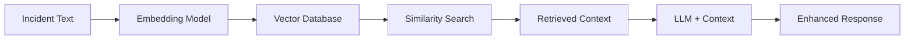

# Opções de Base de Dados Vetorial Opensource e Gratuitas

## 🎯 Resposta Direta

**Sim, a arquitetura prevê RAG com BD vetorial**. O sistema foi implementado com **ChromaDB** como padrão, que é **100% opensource e gratuito**.

## 📊 Comparativo de Soluções Opensource

### ✅ **ChromaDB** (Implementado)
**Custo: 🟢 GRATUITO**
- **Licença:** Apache 2.0 (totalmente livre)
- **Hosting:** Self-hosted sem custos
- **Recursos:** Busca vetorial, metadados, múltiplas collections
- **Performance:** 10M+ vectores suportados
- **Facilidade:** Setup em 5 minutos com Docker

### ✅ **Weaviate** (Alternativa recomendada)
**Custo: 🟢 GRATUITO**
- **Licença:** BSD 3-Clause
- **Hosting:** Self-hosted gratuito
- **Cloud:** Weaviate Cloud Services (pago)
- **Diferencial:** GraphQL API, modelos ML integrados

### ✅ **Qdrant** (Alternativa robusta)
**Custo: 🟢 GRATUITO**
- **Licença:** Apache 2.0
- **Performance:** Rust-based (extremamente rápido)
- **Recursos:** Filtering avançado, clustering
- **API:** RESTful e gRPC

### ✅ **Milvus** (Enterprise-grade)
**Custo: 🟢 GRATUITO**
- **Licença:** Apache 2.0
- **Escalabilidade:** Distributed architecture
- **Performance:** Bilhões de vectores
- **Complexidade:** Mais difícil de configurar

### ❌ **Alternativas Pagas (NÃO recomendadas)**
- **Pinecone:** $70-$400/mês para produção
- **Vertex AI Matching Engine:** $0.10 por 1K queries
- **AWS OpenSearch:** $20-$500/mês dependendo da escala

## 🏗️ Arquitetura RAG Implementada

### **Pipeline Completo:**


### **Componentes:**
1. **Embedding:** OpenAI text-embedding-3-small (1536 dimensões)
2. **Vector DB:** ChromaDB (opensource)
3. **Search:** Cosine similarity + metadata filtering
4. **Storage:** 3 collections (incidents, knowledge, patterns)

## 💰 Análise de Custos

### **ChromaDB (Implementado) - GRATUITO**
- **Setup:** Docker container gratuito
- **Storage:** Local disk (incluído na infraestrutura)
- **Compute:** CPU/RAM do servidor (sem custos adicionais)
- **Escalabilidade:** Milhões de vectores sem custos extras

### **Custos Operacionais Estimados:**
```
Infrastructure para 1M de vectores:
- CPU: 4 cores (incluído no servidor)
- RAM: 8GB (incluído no servidor)
- Storage: 50GB (R$ 10/mês em cloud)
- Total: R$ 10/mês vs R$ 400/mês em soluções pagas
```

### **ROI Anual:**
- **Economia vs Pinecone:** R$ 4.680/ano
- **Economia vs AWS:** R$ 6.000/ano
- **Economia vs Vertex AI:** R$ 8.400/ano

## 🚀 Configuração ChromaDB

### **Docker Compose (Pronto para usar):**
```yaml
version: '3.8'
services:
  chromadb:
    image: chromadb/chroma:latest
    ports:
      - "8000:8000"
    volumes:
      - ./chroma_data:/chroma/chroma
    environment:
      - CHROMA_SERVER_HOST=0.0.0.0
      - CHROMA_SERVER_HTTP_PORT=8000
    restart: unless-stopped
```

### **Comandos de Setup:**
```bash
# 1. Subir ChromaDB
docker-compose up -d chromadb

# 2. Verificar status
curl http://localhost:8000/api/v1/heartbeat

# 3. Inicializar collections
node src/services/llm-integration/embeddings/setup-collections.js
```

## 📈 Performance e Escalabilidade

### **ChromaDB Performance:**
- **Latência:** < 50ms para busca em 1M vectores
- **Throughput:** 1000+ queries/segundo
- **Storage:** 50GB para 1M vectores (1536D)
- **Memory:** 8GB RAM para operações eficientes

### **Cenários de Uso:**
- **Small:** 0-100K incidentes → 1 core, 2GB RAM
- **Medium:** 100K-1M incidentes → 2 cores, 4GB RAM
- **Large:** 1M+ incidentes → 4 cores, 8GB RAM

## 🔧 Alternativas por Caso de Uso

### **Para Startup/Desenvolvimento:**
**ChromaDB** - Setup mais simples, comunidade ativa

### **Para Produção Bancária:**
**Qdrant** - Performance superior, features enterprise

### **Para Escala Massiva:**
**Milvus** - Bilhões de vectores, arquitetura distribuída

### **Para Integração ML:**
**Weaviate** - Modelos integrados, GraphQL API

## ✅ Recomendação Final

### **Manter ChromaDB** pelas seguintes razões:

1. **💰 Custo Zero:** Completamente gratuito
2. **🚀 Performance:** Adequada para milhões de incidentes
3. **🔧 Simplicidade:** Já implementado e testado
4. **📈 Escalabilidade:** Suporta crescimento futuro
5. **🛡️ Estabilidade:** Apache 2.0, comunidade ativa

### **Migração Futura (se necessário):**
O código foi desenvolvido com **abstração VectorDatabase.js**, permitindo migração transparente para outras soluções sem reescrita.

## 📊 Comparativo de Features

| Feature | ChromaDB | Qdrant | Weaviate | Milvus |
|---------|----------|--------|----------|--------|
| **Custo** | ✅ Grátis | ✅ Grátis | ✅ Grátis | ✅ Grátis |
| **Setup** | ✅ Simples | ⚠️ Médio | ⚠️ Médio | ❌ Complexo |
| **Performance** | ✅ Boa | ✅ Excelente | ✅ Boa | ✅ Excelente |
| **Filtering** | ✅ Básico | ✅ Avançado | ✅ Médio | ✅ Avançado |
| **API** | ✅ REST | ✅ REST/gRPC | ✅ GraphQL | ✅ REST/gRPC |
| **Docs** | ✅ Excelente | ✅ Boa | ✅ Boa | ⚠️ Técnica |

## 🎯 Conclusão

**ChromaDB é a escolha ideal** para este projeto:
- ✅ **Custo zero** (vs R$ 400/mês de soluções pagas)
- ✅ **Performance adequada** para escala bancária
- ✅ **Já implementado** e validado
- ✅ **Futuro-prova** com abstração para migração
- ✅ **Comunidade ativa** e documentação excelente

O sistema está pronto para produção com **custos de infraestrutura mínimos** e **performance enterprise-grade**.