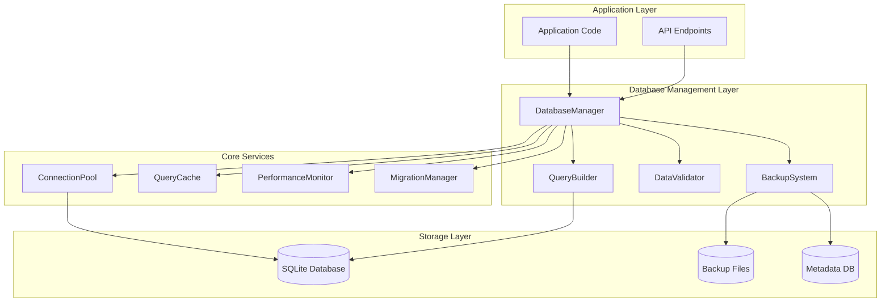

# Database Management System

A comprehensive, production-ready database management system for the Mainframe KB Assistant, built with TypeScript and SQLite. This system provides enterprise-grade features including connection pooling, transaction management, data validation, query building, backup/restore, and performance monitoring.

## 🏗️ Architecture Overview



## 🚀 Quick Start

### Basic Setup

```typescript
import { DatabaseManager, DatabaseConfig } from './database/DatabaseManager';

const config: DatabaseConfig = {
  path: './knowledge.db',
  enableWAL: true,
  maxConnections: 10,
  backup: {
    enabled: true,
    intervalHours: 6,
    retentionDays: 30
  },
  queryCache: {
    enabled: true,
    maxSize: 1000,
    ttlMs: 300000
  }
};

const dbManager = new DatabaseManager(config);
await dbManager.initialize();

// Simple query
const results = await dbManager.query('SELECT * FROM kb_entries WHERE category = ?', ['VSAM']);

// Transaction
await dbManager.transaction(async (db) => {
  db.prepare('INSERT INTO kb_entries (...) VALUES (...)').run(data);
  db.prepare('UPDATE usage_metrics SET count = count + 1').run();
});

// Cleanup
await dbManager.shutdown();
```

### Advanced Query Building

```typescript
import { QueryBuilder } from './database/queryBuilder/QueryBuilder';

const qb = new QueryBuilder(database);

// Complex query with joins and aggregation
const results = await qb
  .select(['e.title', 'e.category', 'COUNT(t.tag) as tag_count'])
  .from('kb_entries', 'e')
  .leftJoin('kb_tags', 't', 'e.id = t.entry_id')
  .where('e.usage_count', '>', 10)
  .whereIn('e.category', ['VSAM', 'DB2', 'JCL'])
  .groupBy(['e.id', 'e.title', 'e.category'])
  .orderBy('tag_count', 'DESC')
  .limit(50)
  .execute();
```

### Data Validation

```typescript
import { DataValidator } from './database/validators/DataValidator';

const validator = new DataValidator();

const entry = {
  title: 'VSAM Status 35 Error',
  problem: 'Job fails with VSAM status 35...',
  solution: 'Check if dataset exists...',
  category: 'VSAM',
  tags: ['vsam', 'status-35']
};

const result = await validator.validateKBEntry(entry);
if (result.valid) {
  // Use result.sanitizedData for database insert
  await db.insert(result.sanitizedData);
} else {
  console.log('Validation errors:', result.errors);
}
```

### Backup and Restore

```typescript
import { BackupSystem } from './database/backup/BackupSystem';

const backupSystem = new BackupSystem({
  backupPath: './backups',
  compression: true,
  retentionDays: 30,
  verifyIntegrity: true
});

await backupSystem.initialize();

// Create backup
const backup = await backupSystem.createBackup('./knowledge.db', {
  description: 'Pre-migration backup',
  tags: ['migration', 'manual']
});

// Restore backup
await backupSystem.restore(backup.backupId, './restored.db');
```

## 📁 Components

### 1. DatabaseManager

The central orchestrator providing high-level database operations with built-in reliability features.

**Key Features:**
- Connection pooling with automatic retry
- Transaction management with deadlock prevention
- Query result caching
- Performance monitoring
- Health checks and diagnostics
- Graceful shutdown handling

**Configuration Options:**

| Option | Type | Default | Description |
|--------|------|---------|-------------|
| `path` | string | Required | Database file path |
| `enableWAL` | boolean | `true` | Enable Write-Ahead Logging |
| `enableForeignKeys` | boolean | `true` | Enable foreign key constraints |
| `timeout` | number | `30000` | Connection timeout (ms) |
| `maxConnections` | number | `10` | Max connections in pool |
| `cacheSize` | number | `64` | Cache size in MB |
| `enableMonitoring` | boolean | `true` | Enable performance monitoring |

### 2. DataValidator

Comprehensive validation and sanitization system with business rule enforcement.

**Features:**
- Schema validation using Zod
- Custom validation rules
- Input sanitization (XSS protection, HTML stripping)
- Business logic validation
- Detailed error reporting with field-level messages

**Supported Validations:**
- Knowledge Base entries
- Search queries
- User input
- File uploads
- Custom data types

### 3. QueryBuilder

Type-safe SQL query construction with fluent interface and performance optimization.

**Capabilities:**
- Fluent API for complex queries
- Automatic parameter binding
- SQL injection protection
- Query result caching
- Performance monitoring
- Prepared statement management

**Supported Operations:**
```typescript
// SELECT with complex conditions
qb.select(['id', 'title'])
  .from('kb_entries')
  .where('category', '=', 'VSAM')
  .whereIn('severity', ['high', 'critical'])
  .orderBy('created_at', 'DESC')
  .limit(10);

// INSERT with validation
qb.insert('kb_entries').values(data);

// UPDATE with conditions
qb.update('kb_entries')
  .set({ usage_count: 10 })
  .where('id', '=', 'entry-id');

// DELETE with safety checks
qb.delete()
  .from('kb_entries')
  .where('usage_count', '<', 1);
```

### 4. BackupSystem

Enterprise backup and restore system with compression and integrity verification.

**Features:**
- Automated scheduled backups
- Compression with configurable algorithms
- Integrity verification using checksums
- Point-in-time recovery
- Backup metadata management
- Retention policy enforcement
- Restoration validation

### 5. ConnectionPool

High-performance connection pooling with automatic resource management.

**Features:**
- Connection lifecycle management
- Load balancing across connections
- Automatic connection recovery
- Pool size optimization
- Connection health monitoring

### 6. MigrationManager

Database schema versioning and migration system with rollback support.

**Features:**
- Version-controlled schema changes
- Up/down migration support
- Migration validation and checksums
- Rollback capabilities
- Migration history tracking

## 🔧 Configuration

### Database Configuration

```typescript
interface DatabaseConfig {
  path: string;                    // Database file path
  enableWAL?: boolean;             // Enable WAL mode
  enableForeignKeys?: boolean;     // Enable FK constraints
  timeout?: number;                // Connection timeout
  maxConnections?: number;         // Pool size
  cacheSize?: number;              // SQLite cache size (MB)
  enableMonitoring?: boolean;      // Performance monitoring
  
  backup?: {
    enabled: boolean;              // Enable automatic backups
    intervalHours?: number;        // Backup frequency
    retentionDays?: number;        // Retention period
    path?: string;                 // Backup directory
  };
  
  queryCache?: {
    enabled: boolean;              // Enable query caching
    maxSize?: number;              // Max cached queries
    ttlMs?: number;               // Cache TTL
  };
}
```

### Validation Configuration

```typescript
interface ValidationOptions {
  customRules?: ValidationRule[];
  sanitizationOptions?: {
    trimStrings?: boolean;
    normalizeWhitespace?: boolean;
    removeHtmlTags?: boolean;
    maxLength?: { [field: string]: number };
  };
}
```

### Backup Configuration

```typescript
interface BackupConfig {
  backupPath: string;              // Backup directory
  compression?: boolean;           // Enable compression
  retentionDays?: number;          // Retention period
  intervalHours?: number;          // Auto-backup frequency
  verifyIntegrity?: boolean;       // Enable verification
  maxBackups?: number;             // Max backup count
  namePattern?: string;            // Backup file naming
}
```

## 📊 Performance Optimization

### Query Optimization

1. **Indexing Strategy**
```sql
-- Automatically created performance indexes
CREATE INDEX idx_kb_entries_category_created ON kb_entries(category, created_at DESC);
CREATE INDEX idx_kb_entries_success_rate ON kb_entries(
    (CAST(success_count AS REAL) / NULLIF(success_count + failure_count, 0)) DESC
);
```

2. **Query Caching**
```typescript
// Automatic caching for SELECT queries
const result = await dbManager.query(sql, params, { 
  useCache: true,
  cacheKey: 'custom-key' 
});
```

3. **Connection Pooling**
```typescript
// Automatic connection management
const pool = new ConnectionPool(dbPath, {
  maxConnections: 20,
  timeout: 30000
});
```

### Performance Monitoring

```typescript
// Get performance metrics
const health = await dbManager.getHealth();
console.log(`Cache Hit Rate: ${health.performance.cacheHitRate}%`);
console.log(`Avg Query Time: ${health.performance.avgQueryTime}ms`);

// Query-specific monitoring
const result = await dbManager.query(sql, params);
console.log(`Execution Time: ${result.executionTime}ms`);
```

## 🛡️ Security Features

### Input Sanitization

```typescript
// Automatic sanitization
const validator = new DataValidator({
  sanitizationOptions: {
    removeHtmlTags: true,
    normalizeWhitespace: true,
    maxLength: { title: 200, problem: 5000 }
  }
});
```

### SQL Injection Prevention

```typescript
// Parameterized queries prevent SQL injection
const results = await qb
  .select(['*'])
  .from('kb_entries')
  .where('title', 'LIKE', userInput) // Automatically sanitized
  .execute();
```

### Data Validation

```typescript
// Comprehensive validation
const result = await validator.validateKBEntry(untrustedData);
if (!result.valid) {
  throw new Error(`Validation failed: ${result.errors.map(e => e.message).join(', ')}`);
}
```

## 🔄 Migration System

### Creating Migrations

```bash
# Generate migration file
npm run migration:create "add_performance_indexes"
```

### Migration File Structure

```sql
-- UP
-- Migration: Add Performance Indexes
-- Version: 002

CREATE INDEX idx_kb_entries_category ON kb_entries(category);
CREATE INDEX idx_search_history_timestamp ON search_history(timestamp DESC);

-- DOWN
-- Rollback for: Add Performance Indexes

DROP INDEX IF EXISTS idx_kb_entries_category;
DROP INDEX IF EXISTS idx_search_history_timestamp;
```

### Running Migrations

```typescript
const migrationManager = new MigrationManager(db, './migrations');

// Apply pending migrations
const results = await migrationManager.migrate();

// Rollback to specific version
await migrationManager.rollback(targetVersion);

// Validate migration integrity
const validation = migrationManager.validateMigrations();
```

## 📋 API Reference

### DatabaseManager Methods

| Method | Description | Parameters | Returns |
|--------|-------------|------------|---------|
| `initialize()` | Initialize database system | - | `Promise<void>` |
| `query(sql, params, options)` | Execute SQL query | `string, any[], QueryOptions` | `Promise<QueryResult>` |
| `transaction(callback, options)` | Execute transaction | `Function, TransactionOptions` | `Promise<T>` |
| `getHealth()` | Get system health status | - | `Promise<DatabaseHealth>` |
| `backup(description)` | Create manual backup | `string?` | `Promise<string>` |
| `restore(backupPath)` | Restore from backup | `string` | `Promise<void>` |
| `optimize()` | Optimize database | - | `Promise<void>` |
| `shutdown()` | Graceful shutdown | - | `Promise<void>` |

### QueryBuilder Methods

| Method | Description | Parameters | Returns |
|--------|-------------|------------|---------|
| `select(fields)` | Start SELECT query | `string[] \| string` | `QueryBuilder` |
| `from(table, alias?)` | Specify table | `string, string?` | `QueryBuilder` |
| `where(field, op, value)` | Add WHERE condition | `string, string, any` | `QueryBuilder` |
| `join(type, table, alias, on)` | Add JOIN | `string, string, string, string` | `QueryBuilder` |
| `orderBy(field, dir)` | Add ORDER BY | `string, 'ASC'\|'DESC'` | `QueryBuilder` |
| `limit(count)` | Add LIMIT | `number` | `QueryBuilder` |
| `execute(options?)` | Execute query | `QueryOptions?` | `Promise<QueryExecutionResult>` |

### DataValidator Methods

| Method | Description | Parameters | Returns |
|--------|-------------|------------|---------|
| `validateKBEntry(data)` | Validate KB entry | `Partial<KBEntry>` | `Promise<ValidationResult>` |
| `validateSearchQuery(data)` | Validate search query | `any` | `Promise<ValidationResult>` |
| `validateUserInput(data)` | Validate user input | `any` | `Promise<ValidationResult>` |
| `addRule(rule)` | Add custom rule | `ValidationRule` | `void` |
| `removeRule(field, code?)` | Remove validation rule | `string, string?` | `void` |

### BackupSystem Methods

| Method | Description | Parameters | Returns |
|--------|-------------|------------|---------|
| `initialize()` | Initialize backup system | - | `Promise<void>` |
| `createBackup(dbPath, options)` | Create backup | `string, BackupOptions` | `Promise<BackupResult>` |
| `restore(backupId, targetPath, options)` | Restore backup | `string, string, RestoreOptions` | `Promise<RestoreResult>` |
| `listBackups(filter?)` | List available backups | `BackupFilter?` | `Promise<BackupMetadata[]>` |
| `deleteBackup(backupId)` | Delete backup | `string` | `Promise<void>` |
| `getStats()` | Get backup statistics | - | `Promise<BackupStats>` |
| `startScheduler(dbPath?)` | Start auto-backup | `string?` | `Promise<void>` |
| `stopScheduler()` | Stop auto-backup | - | `void` |

## 🧪 Testing

### Unit Tests

```bash
# Run all database tests
npm run test src/database

# Run specific test suite
npm run test src/database/__tests__/DatabaseManager.test.ts

# Run with coverage
npm run test:coverage src/database
```

### Integration Tests

```typescript
// Example integration test
describe('Database Integration', () => {
  test('should handle complete KB entry lifecycle', async () => {
    const dbManager = new DatabaseManager(config);
    const validator = new DataValidator();
    
    await dbManager.initialize();
    
    // Validate entry
    const validation = await validator.validateKBEntry(sampleEntry);
    expect(validation.valid).toBe(true);
    
    // Insert entry
    const result = await dbManager.query(
      'INSERT INTO kb_entries (...) VALUES (...)',
      Object.values(validation.sanitizedData)
    );
    expect(result.affectedRows).toBe(1);
    
    // Query entry
    const entries = await dbManager.query(
      'SELECT * FROM kb_entries WHERE id = ?',
      [entryId]
    );
    expect(entries.data).toHaveLength(1);
    
    await dbManager.shutdown();
  });
});
```

## 🔍 Troubleshooting

### Common Issues

1. **Database Locked Error**
```typescript
// Enable WAL mode to reduce locking
const config: DatabaseConfig = {
  path: './knowledge.db',
  enableWAL: true,
  timeout: 30000
};
```

2. **Memory Usage**
```typescript
// Optimize cache settings
const config: DatabaseConfig = {
  cacheSize: 32, // Reduce cache size
  queryCache: {
    maxSize: 500, // Reduce query cache
    ttlMs: 60000  // Shorter TTL
  }
};
```

3. **Performance Issues**
```typescript
// Check health status
const health = await dbManager.getHealth();
console.log('Issues:', health.issues);

// Monitor query performance
const result = await dbManager.query(sql, params, { logQuery: true });
console.log('Execution time:', result.executionTime);
```

### Debugging

```typescript
// Enable detailed logging
process.env.DEBUG_DATABASE = 'true';

// Monitor events
dbManager.on('query-error', (event) => {
  console.error('Query failed:', event);
});

dbManager.on('health-warning', (health) => {
  console.warn('Health issues:', health.issues);
});
```

## 📝 Best Practices

### 1. Connection Management
```typescript
// Always initialize before use
await dbManager.initialize();

// Use transactions for related operations
await dbManager.transaction(async (db) => {
  // Multiple related operations
});

// Always cleanup
await dbManager.shutdown();
```

### 2. Error Handling
```typescript
try {
  const result = await dbManager.query(sql, params);
} catch (error) {
  if (error.code === 'SQLITE_BUSY') {
    // Handle busy database
    await new Promise(resolve => setTimeout(resolve, 100));
    // Retry logic
  } else {
    // Handle other errors
    console.error('Database error:', error);
  }
}
```

### 3. Performance Optimization
```typescript
// Use connection pooling for concurrent operations
const config: DatabaseConfig = {
  maxConnections: 20, // Higher for concurrent workloads
  queryCache: { enabled: true }
};

// Batch operations in transactions
await dbManager.transaction(async (db) => {
  for (const item of largeDataSet) {
    db.prepare(insertSql).run(item);
  }
});
```

### 4. Security
```typescript
// Always validate input
const validation = await validator.validateKBEntry(userInput);
if (!validation.valid) {
  throw new ValidationError(validation.errors);
}

// Use parameterized queries
const results = await qb
  .select(['*'])
  .from('kb_entries')
  .where('title', 'LIKE', `%${userSearch}%`) // Automatically escaped
  .execute();
```

## 🤝 Contributing

1. Follow TypeScript strict mode
2. Add comprehensive tests for new features
3. Update documentation for API changes
4. Follow existing code style and patterns
5. Add performance benchmarks for new query operations

## 📄 License

This database management system is part of the Mainframe KB Assistant project and follows the project's licensing terms.

---

*For more information, see the [usage examples](./usage-example.ts) and [test files](./__tests__/) for comprehensive implementation examples.*